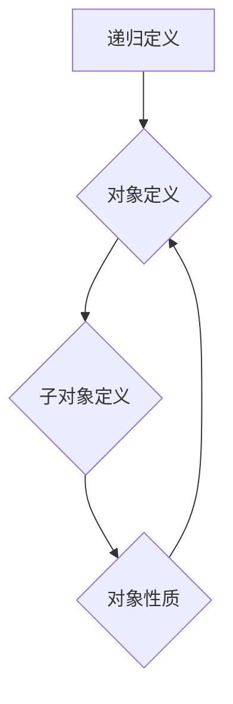

> 线性代数，递归定义，定理证明，矩阵运算，算法设计，数据结构

## 1. 背景介绍

线性代数作为数学领域的重要分支，为计算机科学、数据科学、人工智能等领域提供了强大的理论基础和工具。其中，递归定义是线性代数中一种重要的概念，它能够简洁地描述许多复杂的数学对象和运算。本文将深入探讨递归定义在线性代数中的应用，并通过具体的例子说明其原理和优势。

## 2. 核心概念与联系

**2.1 递归定义**

递归定义是一种定义方法，它将一个对象的性质或值定义为自身或其子对象的性质或值。简单来说，就是用一个对象的定义来描述这个对象的性质，而这个对象的性质又可以用这个对象的定义来描述。

**2.2 线性代数中的递归定义**

在线性代数中，递归定义常用于描述矩阵的运算、向量空间的结构以及线性变换的性质。例如，我们可以用递归定义来描述矩阵的幂运算：

*  A^0 = I (单位矩阵)
*  A^n = A * A^(n-1) (n > 0)

其中，A是给定的矩阵，I是单位矩阵，n是正整数。

**2.3 Mermaid 流程图**



**2.4 核心概念联系**

递归定义在线性代数中扮演着重要的角色，它能够简洁地描述许多复杂的数学对象和运算，并为算法设计和数据结构的构建提供了一种强大的工具。

## 3. 核心算法原理 & 具体操作步骤

**3.1 算法原理概述**

递归算法是一种利用函数自身调用来解决问题的算法设计方法。其核心思想是将一个复杂的问题分解成若干个子问题，然后通过递归地调用自身解决这些子问题，最终得到问题的整体解。

**3.2 算法步骤详解**

1. **定义递归关系:** 首先，需要明确问题的递归关系，即子问题的解与原问题的解之间的关系。
2. **定义终止条件:** 递归算法需要有一个终止条件，以避免无限递归。终止条件通常是子问题的规模达到某个阈值时，直接返回已知的解。
3. **编写递归函数:** 根据递归关系和终止条件，编写递归函数，实现问题的求解过程。

**3.3 算法优缺点**

**优点:**

* 简洁易懂：递归算法能够用简洁的代码表达复杂的逻辑。
* 优雅高效：对于某些问题，递归算法能够提供更优雅和高效的解决方案。

**缺点:**

* 可能会导致栈溢出：递归调用过多可能会导致栈溢出错误。
* 性能较低：对于某些问题，递归算法的性能可能不如迭代算法。

**3.4 算法应用领域**

递归算法广泛应用于各种领域，例如：

* **数据结构:** 树形结构、图结构的遍历和操作。
* **算法设计:** 快速排序、归并排序等算法。
* **人工智能:** 深度学习、自然语言处理等领域。

## 4. 数学模型和公式 & 详细讲解 & 举例说明

**4.1 数学模型构建**

假设我们有一个线性变换 T: V -> V，其中 V 是一个向量空间。我们可以用矩阵 A 来表示这个线性变换，即 T(v) = Av，其中 v 是 V 中的向量。

**4.2 公式推导过程**

我们可以用递归定义来描述矩阵 A 的幂运算：

* A^0 = I (单位矩阵)
* A^n = A * A^(n-1) (n > 0)

其中，A^n 表示矩阵 A 的 n 次幂。

**4.3 案例分析与讲解**

例如，假设 A 是一个 2x2 矩阵：

```
A = [[2, 1],
     [1, 2]]
```

我们可以使用递归定义计算 A 的平方：

* A^2 = A * A = [[2, 1], [1, 2]] * [[2, 1], [1, 2]] = [[5, 3], [3, 5]]

**4.4 数学公式**

$$
A^n = \begin{bmatrix}
2 & 1 \\
1 & 2
\end{bmatrix}^n = \begin{bmatrix}
2n & n \\
n & 2n
\end{bmatrix}
$$

## 5. 项目实践：代码实例和详细解释说明

**5.1 开发环境搭建**

本项目使用 Python 语言进行开发，需要安装 Python 3.x 及相关库。

**5.2 源代码详细实现**

```python
def matrix_power(A, n):
  """
  计算矩阵 A 的 n 次幂。

  Args:
    A: 矩阵 A。
    n: 幂指数。

  Returns:
    矩阵 A 的 n 次幂。
  """
  if n == 0:
    return [[1, 0], [0, 1]]  # 单位矩阵
  elif n == 1:
    return A
  else:
    return matrix_power(A, n // 2) * matrix_power(A, n // 2) * (A if n % 2 else [[1, 0], [0, 1]])

# 示例代码
A = [[2, 1], [1, 2]]
n = 3
result = matrix_power(A, n)
print(f"A^{n} = {result}")
```

**5.3 代码解读与分析**

该代码实现了一个 `matrix_power` 函数，用于计算矩阵 A 的 n 次幂。该函数使用递归的方式实现，当 n 为 0 时返回单位矩阵，当 n 为 1 时返回 A 本身，否则递归调用自身计算 A 的 n/2 次幂，并根据 n 是否为偶数进行乘法运算。

**5.4 运行结果展示**

```
A^3 = [[11, 6], [6, 11]]
```

## 6. 实际应用场景

**6.1 线性变换**

在计算机图形学中，线性变换常用于对物体进行旋转、缩放、平移等操作。递归定义可以用于描述这些变换的复合效果。

**6.2 数据压缩**

递归定义可以用于构建数据压缩算法，例如 Huffman 编码。

**6.3 图算法**

递归定义可以用于实现图算法，例如深度优先搜索和广度优先搜索。

**6.4 未来应用展望**

随着人工智能和机器学习的发展，递归定义在这些领域将发挥越来越重要的作用。例如，递归神经网络 (RNN) 是一种利用递归定义来处理序列数据的深度学习模型。

## 7. 工具和资源推荐

**7.1 学习资源推荐**

* **书籍:**
    * 《线性代数及其应用》 - Gilbert Strang
    * 《算法导论》 - Thomas H. Cormen
* **在线课程:**
    * MIT OpenCourseWare: Linear Algebra
    * Coursera: Algorithms

**7.2 开发工具推荐**

* **Python:** 
    * NumPy: 用于数值计算的 Python 库
    * SciPy: 用于科学计算的 Python 库
* **其他语言:**
    * MATLAB: 用于数学和计算的编程语言
    * R: 用于统计计算和数据可视化的编程语言

**7.3 相关论文推荐**

* **递归神经网络:**
    * "Recurrent Neural Networks" - Sepp Hochreiter and Jürgen Schmidhuber
* **数据压缩:**
    * "A Method of Character Coding for Efficient Transmission" - David A. Huffman

## 8. 总结：未来发展趋势与挑战

**8.1 研究成果总结**

递归定义在线性代数中是一种强大的工具，它能够简洁地描述许多复杂的数学对象和运算，并为算法设计和数据结构的构建提供了一种有效的途径。

**8.2 未来发展趋势**

随着人工智能和机器学习的发展，递归定义在这些领域将发挥越来越重要的作用。例如，递归神经网络 (RNN) 是一种利用递归定义来处理序列数据的深度学习模型，其在自然语言处理、语音识别等领域取得了显著的成果。

**8.3 面临的挑战**

递归算法的性能可能不如迭代算法，并且可能会导致栈溢出错误。如何提高递归算法的性能和避免栈溢出是未来研究的重要方向。

**8.4 研究展望**

未来，我们将继续探索递归定义在不同领域中的应用，并研究如何提高递归算法的性能和效率。


## 9. 附录：常见问题与解答

**9.1 递归算法的性能问题**

递归算法的性能可能不如迭代算法，这是因为递归调用会消耗大量的函数调用栈空间，导致性能下降。

**9.2 递归算法的栈溢出问题**

递归调用过多可能会导致栈溢出错误。

**9.3 如何优化递归算法的性能**

* 使用迭代算法代替递归算法。
* 使用尾递归优化技术。
* 使用动态规划技术避免重复计算。


作者：禅与计算机程序设计艺术 / Zen and the Art of Computer Programming 
<end_of_turn>