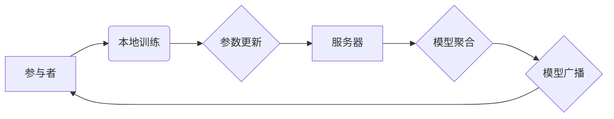

> 联邦学习、模型训练、数据隐私、分布式学习、机器学习

## 1. 背景介绍

在当今数据驱动时代，机器学习模型的训练离不开海量数据。然而，数据往往分散在不同的机构或设备上，例如医疗机构、金融机构、智能手机等。直接将这些数据集中到一个中心服务器进行训练，会引发严重的隐私泄露和数据安全问题。

联邦学习 (Federated Learning, FL) 应运而生，它是一种分布式机器学习方法，旨在训练机器学习模型，而无需将原始数据传输到一个中央服务器。

联邦学习的核心思想是将模型参数在参与者之间进行迭代更新。每个参与者在本地对自己的数据进行训练，并仅将模型参数的更新发送到服务器。服务器汇总所有参与者的参数更新，并将其广播回所有参与者，从而迭代更新模型参数。

## 2. 核心概念与联系

### 2.1 核心概念

* **参与者 (Client):** 拥有本地数据的个体，例如智能手机、医疗机构、金融机构等。
* **服务器 (Server):** 负责协调参与者之间的通信，汇总和更新模型参数。
* **模型参数 (Model Parameters):** 机器学习模型的权重和偏置等可训练参数。
* **本地训练 (Local Training):** 参与者在本地数据上训练模型，并计算模型参数的梯度。
* **参数更新 (Parameter Update):** 参与者将模型参数的梯度发送到服务器。
* **模型聚合 (Model Aggregation):** 服务器汇总所有参与者的参数更新，并计算全局模型参数的更新。
* **模型广播 (Model Broadcasting):** 服务器将更新后的全局模型参数广播回所有参与者。

### 2.2 架构图



## 3. 核心算法原理 & 具体操作步骤

### 3.1 算法原理概述

联邦学习的核心算法是基于梯度下降的迭代更新机制。每个参与者在本地数据上训练模型，并计算模型参数的梯度。这些梯度信息被发送到服务器，服务器汇总所有参与者的梯度信息，并计算全局模型参数的更新。更新后的全局模型参数被广播回所有参与者，参与者根据更新后的参数继续训练模型。

### 3.2 算法步骤详解

1. **初始化:** 服务器将一个初始模型参数分配给所有参与者。
2. **本地训练:** 每个参与者在本地数据上训练模型，并计算模型参数的梯度。
3. **参数更新:** 每个参与者将模型参数的梯度发送到服务器。
4. **模型聚合:** 服务器汇总所有参与者的梯度信息，并计算全局模型参数的更新。
5. **模型广播:** 服务器将更新后的全局模型参数广播回所有参与者。
6. **重复步骤2-5:** 直到模型收敛或达到预设的迭代次数。

### 3.3 算法优缺点

**优点:**

* **数据隐私保护:** 数据从未离开参与者的设备，有效保护数据隐私。
* **数据分散利用:** 可以利用分散在不同机构或设备上的数据进行训练，提高模型的泛化能力。
* **可扩展性:** 可以容纳大量参与者，并随着参与者数量的增加而提高模型训练效率。

**缺点:**

* **通信开销:** 参与者需要频繁地与服务器通信，这可能会导致通信开销较大。
* **模型性能:** 由于参与者数据分布不均匀，模型性能可能不如集中式训练。
* **安全风险:** 服务器可能成为攻击目标，攻击者可能试图窃取模型参数或篡改训练过程。

### 3.4 算法应用领域

* **移动设备:** 在智能手机上训练语音识别、文本预测等模型，无需将用户语音或文本数据上传到云端。
* **医疗保健:** 在多个医院之间训练疾病诊断模型，保护患者隐私，同时提高模型的诊断精度。
* **金融服务:** 在多个银行之间训练欺诈检测模型，提高欺诈检测的准确率，并保护客户数据安全。

## 4. 数学模型和公式 & 详细讲解 & 举例说明

### 4.1 数学模型构建

假设我们有一个包含 $n$ 个参与者的联邦学习系统。每个参与者 $i$ 拥有本地数据集 $D_i$，目标是训练一个全局模型 $w$。

* $w_i$ 表示参与者 $i$ 的本地模型参数。
* $g_i$ 表示参与者 $i$ 计算的模型参数梯度。
* $w$ 表示全局模型参数。
* $\alpha$ 表示学习率。

### 4.2 公式推导过程

1. **本地训练:** 每个参与者 $i$ 在本地数据集 $D_i$ 上训练模型，并计算模型参数梯度 $g_i$:

$$g_i = \nabla_w L(w_i, D_i)$$

其中 $L(w_i, D_i)$ 是参与者 $i$ 的本地损失函数。

2. **参数更新:** 每个参与者 $i$ 将模型参数梯度 $g_i$ 发送到服务器。

3. **模型聚合:** 服务器汇总所有参与者的梯度信息，并计算全局模型参数的更新:

$$w' = w - \alpha \frac{1}{n} \sum_{i=1}^{n} g_i$$

4. **模型广播:** 服务器将更新后的全局模型参数 $w'$ 广播回所有参与者。

5. **重复步骤1-4:** 直到模型收敛或达到预设的迭代次数。

### 4.3 案例分析与讲解

假设我们有一个包含 3 个参与者的联邦学习系统，每个参与者拥有 100 个样本的数据集。

* 参与者 1 的损失函数为 $L_1(w_1, D_1) = 0.1$
* 参与者 2 的损失函数为 $L_2(w_2, D_2) = 0.2$
* 参与者 3 的损失函数为 $L_3(w_3, D_3) = 0.3$

每个参与者计算模型参数梯度后，发送到服务器。服务器汇总所有参与者的梯度信息，并计算全局模型参数的更新:

$$w' = w - \alpha \frac{1}{3} (g_1 + g_2 + g_3)$$

更新后的全局模型参数 $w'$ 被广播回所有参与者，参与者根据更新后的参数继续训练模型。

## 5. 项目实践：代码实例和详细解释说明

### 5.1 开发环境搭建

* Python 3.6+
* TensorFlow 2.0+
* PyTorch 1.0+

### 5.2 源代码详细实现

```python
import tensorflow as tf

# 定义联邦学习模型
class FederatedModel(tf.keras.Model):
    def __init__(self):
        super(FederatedModel, self).__init__()
        self.dense = tf.keras.layers.Dense(10, activation='relu')

    def call(self, x):
        return self.dense(x)

# 定义联邦学习训练函数
def federated_train(model, clients, epochs, learning_rate):
    for epoch in range(epochs):
        # 每个参与者本地训练
        for client in clients:
            client.train(model, learning_rate)

        # 模型聚合
        model.aggregate(clients)

        # 打印训练进度
        print(f'Epoch {epoch+1}/{epochs}, Loss: {model.loss}')

# 定义参与者类
class Client:
    def __init__(self, data):
        self.data = data
        self.model = FederatedModel()

    def train(self, model, learning_rate):
        # 在本地数据上训练模型
        optimizer = tf.keras.optimizers.Adam(learning_rate=learning_rate)
        for batch in self.data:
            with tf.GradientTape() as tape:
                predictions = model(batch)
                loss = tf.keras.losses.MeanSquaredError()(batch, predictions)
            gradients = tape.gradient(loss, model.trainable_variables)
            optimizer.apply_gradients(zip(gradients, model.trainable_variables))

    def aggregate(self, clients):
        # 将模型参数更新发送到服务器
        pass

# 创建参与者实例
client1 = Client(data1)
client2 = Client(data2)
client3 = Client(data3)

# 创建联邦学习模型实例
model = FederatedModel()

# 启动联邦学习训练
federated_train(model, [client1, client2, client3], epochs=10, learning_rate=0.01)
```

### 5.3 代码解读与分析

* **联邦学习模型:** 定义了一个简单的联邦学习模型，包含一个全连接层。
* **联邦学习训练函数:** 定义了一个联邦学习训练函数，包含本地训练、模型聚合和训练进度打印等步骤。
* **参与者类:** 定义了一个参与者类，包含本地训练和模型聚合等方法。
* **代码实例:** 创建了三个参与者实例，并启动了联邦学习训练。

### 5.4 运行结果展示

运行代码后，会打印出每个epoch的训练进度，包括损失值。

## 6. 实际应用场景

### 6.1 医疗保健

* **疾病诊断:** 利用多个医院的患者数据训练疾病诊断模型，提高诊断精度，并保护患者隐私。
* **个性化治疗:** 根据患者的基因信息和病史，训练个性化治疗方案模型，提高治疗效果。

### 6.2 金融服务

* **欺诈检测:** 利用多个银行的交易数据训练欺诈检测模型，提高欺诈检测的准确率，并保护客户数据安全。
* **信用评分:** 利用多个金融机构的客户数据训练信用评分模型，提高信用评分的准确性，并降低风险。

### 6.3 其他领域

* **智能交通:** 利用多个城市的交通数据训练交通流量预测模型，提高交通效率。
* **推荐系统:** 利用多个用户的行为数据训练个性化推荐模型，提高推荐效果。

### 6.4 未来应用展望

随着联邦学习技术的不断发展，其应用场景将会更加广泛。未来，联邦学习将应用于更多领域，例如：

* **自动驾驶:** 利用多个车辆的驾驶数据训练自动驾驶模型，提高自动驾驶的安全性。
* **自然语言处理:** 利用多个语言数据训练自然语言处理模型，提高模型的语言理解能力。
* **人工智能芯片设计:** 利用多个芯片设计数据的训练，提高人工智能芯片的性能。

## 7. 工具和资源推荐

### 7.1 学习资源推荐

* **论文:**
    * McMahan, H. B., Moore, E., Ramage, D., Hampson, S., & y Arcas, B. A. (2017). Communication-efficient learning of deep networks from decentralized data. In Proceedings of the 2017 ACM International Conference on Learning Representations (ICLR)
* **博客:**
    * TensorFlow Federated Blog: https://www.tensorflow.org/federated
    * PySyft Blog: https://www.openmined.org/blog/

### 7.2 开发工具推荐

* **TensorFlow Federated:** https://www.tensorflow.org/federated
* **PySyft:** https://www.openmined.org/

### 7.3 相关论文推荐

* **Federated Learning: Strategies for Improving Communication Efficiency**
* **Personalized Federated Learning**
* **Secure and Private Federated Learning**

## 8. 总结：未来发展趋势与挑战

### 8.1 研究成果总结

联邦学习近年来取得了显著进展，在数据隐私保护、模型训练效率等方面展现出巨大的