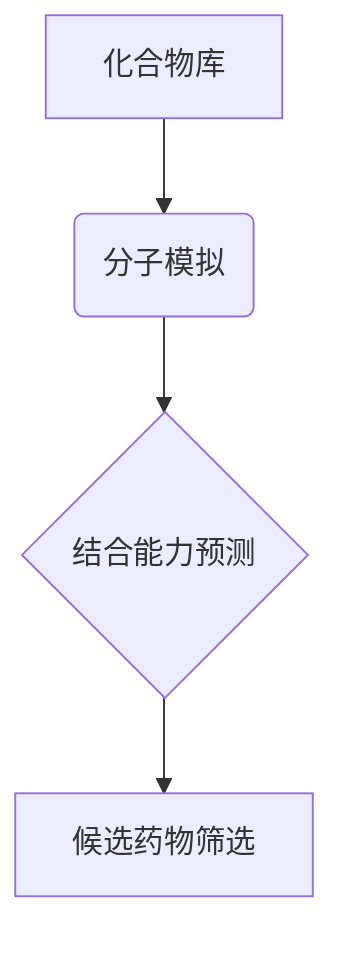

> 虚拟筛选、药物发现、计算机辅助药物设计、分子模拟、机器学习

## 1. 背景介绍

药物发现是一个漫长而复杂的流程，从候选药物的识别到临床试验，通常需要花费十年时间和数十亿美元的投资。传统药物发现方法依赖于大量的实验筛选，效率低下且成本高昂。近年来，随着计算机技术和生物信息学的发展，虚拟筛选技术（Virtual Screening，VS）逐渐成为药物发现领域的重要工具，为加速药物研发进程提供了新的思路。

虚拟筛选技术是指利用计算机模拟和算法，对大量的化合物库进行筛选，预测其与靶蛋白的结合能力，从而快速识别潜在的候选药物。与传统的实验筛选相比，虚拟筛选具有以下优势：

* **效率高：** 可以快速筛选数百万甚至数十亿个化合物，大大缩短了药物发现的周期。
* **成本低：** 减少了实验筛选的成本，降低了药物研发的风险。
* **精准性高：** 可以根据靶蛋白的结构和功能，筛选出与之结合能力更强的化合物。

## 2. 核心概念与联系

虚拟筛选技术的核心是利用计算机模拟和算法，预测化合物与靶蛋白的结合能力。

**2.1 核心概念**

* **靶蛋白：** 药物作用的目标，通常是参与疾病发生发展的重要蛋白质。
* **化合物库：** 包含大量化合物的数据库，可以是已知的化合物或新合成的化合物。
* **分子模拟：** 利用计算机模拟化合物与靶蛋白的相互作用，预测其结合能力。
* **算法：** 用于筛选化合物库，预测其与靶蛋白的结合能力的算法。

**2.2 联系**

虚拟筛选技术将分子模拟和算法相结合，实现对化合物库的快速筛选，从而识别潜在的候选药物。



## 3. 核心算法原理 & 具体操作步骤

### 3.1 算法原理概述

虚拟筛选算法主要分为以下几种类型：

* **基于结构的虚拟筛选（Structure-Based Virtual Screening，SBVS）：** 利用靶蛋白的三维结构信息，预测化合物与靶蛋白的结合能力。
* **基于性质的虚拟筛选（Ligand-Based Virtual Screening，LBVS）：** 利用已知活性化合物的结构和性质信息，预测新化合物的活性。
* **基于机器学习的虚拟筛选（Machine Learning-Based Virtual Screening，MLVS）：** 利用机器学习算法，从大规模的化合物数据中学习预测模型，提高筛选效率和准确性。

### 3.2 算法步骤详解

以基于结构的虚拟筛选为例，其具体操作步骤如下：

1. **获取靶蛋白结构：** 从蛋白质数据库（如PDB）中获取靶蛋白的三维结构信息。
2. **准备化合物库：** 收集大量的化合物结构信息，可以是公开数据库或自行构建的库。
3. **分子对接（Molecular Docking）：** 利用分子对接算法，将化合物库中的化合物与靶蛋白进行虚拟结合，预测其结合构象和结合能。
4. **筛选候选化合物：** 根据结合能、结合构象等指标，筛选出结合能力较强的化合物作为候选药物。
5. **验证筛选结果：** 利用实验验证筛选出的候选药物的活性，评估虚拟筛选的准确性。

### 3.3 算法优缺点

**优点：**

* 效率高，可以快速筛选大量的化合物。
* 精准性高，可以预测化合物与靶蛋白的结合能力。
* 成本低，减少了实验筛选的成本。

**缺点：**

* 依赖于靶蛋白结构信息，对于结构未知的靶蛋白难以应用。
* 虚拟筛选结果需要进行实验验证，不能完全替代实验筛选。

### 3.4 算法应用领域

虚拟筛选技术广泛应用于药物发现、农药研发、材料科学等领域。

## 4. 数学模型和公式 & 详细讲解 & 举例说明

### 4.1 数学模型构建

虚拟筛选算法中常用的数学模型包括：

* **结合能模型：** 用于预测化合物与靶蛋白的结合能力，常用的模型包括DockScore、GoldScore等。
* **构象优化模型：** 用于优化化合物与靶蛋白的结合构象，常用的模型包括AMBER、CHARMM等。

### 4.2 公式推导过程

结合能模型的推导过程通常涉及以下步骤：

1. **定义相互作用势能：** 将化合物与靶蛋白之间的相互作用势能分解为不同类型的相互作用，例如氢键、疏水相互作用、静电相互作用等。
2. **建立相互作用势能函数：** 根据相互作用类型的特点，建立相应的势能函数。
3. **计算结合能：** 将化合物与靶蛋白的相互作用势能函数进行积分，得到结合能。

### 4.3 案例分析与讲解

以DockScore模型为例，其结合能计算公式如下：

$$
DockScore = \sum_{i=1}^{n} w_i \cdot E_i
$$

其中：

* $n$ 为相互作用项的总数。
* $w_i$ 为每个相互作用项的权重。
* $E_i$ 为每个相互作用项的能量。

DockScore模型将不同类型的相互作用项的能量加权求和，得到化合物与靶蛋白的结合能。

## 5. 项目实践：代码实例和详细解释说明

### 5.1 开发环境搭建

虚拟筛选项目开发环境通常包括：

* 操作系统：Linux、Windows或macOS。
* 编程语言：Python、C++或Java。
* 软件包：Open Babel、RDKit、AutoDock Vina等。

### 5.2 源代码详细实现

以下是一个使用AutoDock Vina进行虚拟筛选的Python代码示例：

```python
from vina import Vina

# 初始化AutoDock Vina
vina = Vina()

# 设置搜索空间
vina.set_search_space(x_min=-10, x_max=10, y_min=-10, y_max=10, z_min=-10, z_max=10)

# 设置化合物和靶蛋白文件路径
ligand_file = "ligand.pdbqt"
receptor_file = "receptor.pdbqt"

# 执行虚拟筛选
vina.run(ligand_file, receptor_file)

# 获取筛选结果
results = vina.get_results()

# 打印筛选结果
for result in results:
    print(result)
```

### 5.3 代码解读与分析

* `vina = Vina()` 初始化AutoDock Vina对象。
* `vina.set_search_space()` 设置搜索空间，即化合物与靶蛋白结合的区域。
* `vina.run()` 执行虚拟筛选，将化合物与靶蛋白进行虚拟结合，预测其结合构象和结合能。
* `vina.get_results()` 获取筛选结果，包括结合能、结合构象等信息。

### 5.4 运行结果展示

虚拟筛选的结果通常以表格或图形的形式展示，包括化合物名称、结合能、结合构象等信息。

## 6. 实际应用场景

虚拟筛选技术已广泛应用于药物发现、农药研发、材料科学等领域。

### 6.1 药物发现

虚拟筛选技术可以用于筛选潜在的药物候选物，加速药物研发进程。例如，在抗癌药物研发中，虚拟筛选技术可以用于筛选与癌细胞特异性靶蛋白结合的化合物，从而开发出更有效的抗癌药物。

### 6.2 农药研发

虚拟筛选技术可以用于筛选具有杀虫、杀菌、除草等功能的农药候选物，提高农药研发效率。例如，在杀虫剂研发中，虚拟筛选技术可以用于筛选与昆虫特异性靶蛋白结合的化合物，从而开发出更安全、更有效的杀虫剂。

### 6.3 材料科学

虚拟筛选技术可以用于筛选具有特定功能的材料候选物，例如导电材料、光电材料等。例如，在太阳能电池研发中，虚拟筛选技术可以用于筛选具有高光电转换效率的材料候选物。

### 6.4 未来应用展望

随着计算机技术和人工智能技术的不断发展，虚拟筛选技术将更加智能化、自动化，并应用于更多领域。例如，

* **基于深度学习的虚拟筛选：** 利用深度学习算法，从大规模的化合物数据中学习预测模型，提高筛选效率和准确性。
* **多目标虚拟筛选：** 同时考虑多个目标，例如活性、毒性、代谢稳定性等，筛选出更理想的候选药物。
* **虚拟筛选与实验筛选的结合：** 将虚拟筛选结果与实验筛选结果相结合，提高筛选的准确性和效率。

## 7. 工具和资源推荐

### 7.1 学习资源推荐

* **书籍：**
    * 《计算机辅助药物设计》
    * 《虚拟筛选技术》
* **在线课程：**
    * Coursera 上的《药物发现》课程
    * edX 上的《计算机辅助药物设计》课程

### 7.2 开发工具推荐

* **AutoDock Vina：** 一个开源的分子对接软件。
* **Open Babel：** 一个开源的化学数据处理软件。
* **RDKit：** 一个开源的化学信息学软件包。

### 7.3 相关论文推荐

* **Virtual screening for drug discovery: A review**
* **Machine learning in virtual screening: A review**

## 8. 总结：未来发展趋势与挑战

### 8.1 研究成果总结

虚拟筛选技术在药物发现领域取得了显著的进展，加速了药物研发进程，降低了研发成本。

### 8.2 未来发展趋势

虚拟筛选技术将朝着更加智能化、自动化、个性化的方向发展，并应用于更多领域。

### 8.3 面临的挑战

虚拟筛选技术还面临一些挑战，例如：

* 虚拟筛选结果的准确性需要进一步提高。
* 虚拟筛选技术难以应用于结构未知的靶蛋白。
* 虚拟筛选技术需要与实验筛选相结合，才能最终确定候选药物。

### 8.4 研究展望

未来，虚拟筛选技术将继续发展，并与其他技术相结合，例如人工智能、纳米技术等，为药物发现和材料科学等领域带来更多创新。

## 9. 附录：常见问题与解答

### 9.1 什么是虚拟筛选？

虚拟筛选是指利用计算机模拟和算法，对大量的化合物库进行筛选，预测其与靶蛋白的结合能力，从而快速识别潜在的候选药物。

### 9.2 虚拟筛选有哪些类型？

常见的虚拟筛选类型包括基于结构的虚拟筛选（SBVS）、基于性质的虚拟筛选（LBVS）和基于机器学习的虚拟筛选（MLVS）。

### 9.3 虚拟筛选的优势是什么？

虚拟筛选的优势包括效率高、成本低、精准性高。

### 9.4 虚拟筛选的局限性是什么？

虚拟筛选的局限性包括依赖于靶蛋白结构信息、虚拟筛选结果需要进行实验验证等。


作者：禅与计算机程序设计艺术 / Zen and the Art of Computer Programming 
<end_of_turn>