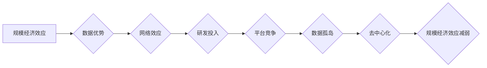

> 规模经济效应、技术进步、平台竞争、网络效应、数据孤岛、去中心化

## 1. 背景介绍

在过去几十年里，规模经济效应一直是推动科技进步和经济增长的关键驱动力。随着技术的进步和互联网的普及，大型平台企业凭借其庞大的用户规模和数据积累，获得了难以复制的优势，形成了“规模经济”的闭环。然而，近年来，我们开始看到规模经济效应减弱的迹象，这引发了人们对未来科技发展和经济格局的思考。

## 2. 核心概念与联系

**2.1 规模经济效应**

规模经济效应是指随着生产规模的扩大，单位成本下降的现象。在科技领域，规模经济效应主要体现在以下几个方面：

* **数据优势:** 大型平台拥有海量用户数据，这些数据可以用于训练更精准的算法模型，提供更个性化的服务，从而吸引更多用户，形成正向循环。
* **网络效应:** 一些平台服务，如社交网络和电商平台，其价值随着用户数量的增加而增加。这意味着，用户越多，平台越吸引人，从而吸引更多用户加入。
* **研发投入:** 大型平台可以投入巨额资金进行研发，开发更先进的技术和产品，从而保持竞争优势。

**2.2 平台竞争与网络效应**

平台竞争是指不同平台之间为了争夺用户和市场份额而展开的竞争。网络效应使得平台竞争更加激烈，因为平台的价值取决于其用户数量。

**2.3 数据孤岛与去中心化**

随着数据量的爆炸式增长，数据孤岛问题日益突出。数据孤岛是指数据分散在不同的平台和系统中，无法共享和利用的现象。去中心化技术试图解决数据孤岛问题，通过将数据分散存储和管理，提高数据可访问性和安全性。

**2.4 规模经济效应减弱的趋势**

近年来，随着技术的进步和监管政策的加强，规模经济效应开始减弱。

* **技术进步:** 新兴技术，如人工智能和区块链，正在打破传统平台的垄断地位，为用户提供更多选择。
* **监管政策:** 政府越来越重视反垄断和数据保护，对大型平台的监管力度不断加强，限制其规模扩张。
* **用户需求:** 用户对数据隐私和平台透明度越来越重视，愿意尝试新的平台和服务。

**Mermaid 流程图**



## 3. 核心算法原理 & 具体操作步骤

**3.1 算法原理概述**

规模经济效应的减弱与算法的演进密切相关。传统的算法模型依赖于海量数据进行训练，而新兴算法模型，如联邦学习和差分隐私，则能够在数据隐私保护的前提下进行训练，从而降低数据孤岛问题的影响。

**3.2 算法步骤详解**

* **联邦学习:** 将模型训练分散到多个设备上，每个设备只训练自己的数据，然后将模型参数聚合起来，形成全局模型。
* **差分隐私:** 在数据处理过程中加入噪声，保护用户隐私，同时保证模型训练的有效性。

**3.3 算法优缺点**

* **联邦学习:** 优点：保护数据隐私，提高数据安全；缺点：训练效率较低，模型精度可能受限。
* **差分隐私:** 优点：有效保护数据隐私，保证模型训练的有效性；缺点：需要一定的数学基础，算法实现较为复杂。

**3.4 算法应用领域**

* **医疗保健:** 利用联邦学习训练疾病诊断模型，保护患者隐私。
* **金融服务:** 利用差分隐私分析用户行为数据，提高风险控制能力。

## 4. 数学模型和公式 & 详细讲解 & 举例说明

**4.1 数学模型构建**

规模经济效应可以用以下数学模型来描述：

$$
C(Q) = a + bQ
$$

其中：

* $C(Q)$ 是生产成本
* $Q$ 是生产规模
* $a$ 是固定成本
* $b$ 是单位变动成本

当 $b < 0$ 时，表示规模经济效应存在，即随着生产规模的扩大，单位成本下降。

**4.2 公式推导过程**

规模经济效应的数学模型可以推导如下：

* 假设生产成本 $C(Q)$ 是生产规模 $Q$ 的函数。
* 假设固定成本 $a$ 是一个常数。
* 假设单位变动成本 $b$ 是一个负数，表示随着生产规模的扩大，单位成本下降。

因此，我们可以得到以下公式：

$$
C(Q) = a + bQ
$$

**4.3 案例分析与讲解**

假设一家制造商生产某种产品，其固定成本为 $1000$ 美元，单位变动成本为 $-0.1$ 美元。当生产规模为 $1000$ 件时，其生产成本为：

$$
C(1000) = 1000 + (-0.1) * 1000 = 900 \text{ 美元}
$$

当生产规模为 $2000$ 件时，其生产成本为：

$$
C(2000) = 1000 + (-0.1) * 2000 = 800 \text{ 美元}
$$

可以看出，随着生产规模的扩大，单位成本下降，体现了规模经济效应。

## 5. 项目实践：代码实例和详细解释说明

**5.1 开发环境搭建**

* 操作系统：Ubuntu 20.04
* 编程语言：Python 3.8
* 框架：TensorFlow 2.0

**5.2 源代码详细实现**

```python
import tensorflow as tf

# 定义联邦学习模型
class FederatedLearningModel(tf.keras.Model):
    def __init__(self):
        super(FederatedLearningModel, self).__init__()
        self.dense1 = tf.keras.layers.Dense(128, activation='relu')
        self.dense2 = tf.keras.layers.Dense(10, activation='softmax')

    def call(self, x):
        x = self.dense1(x)
        x = self.dense2(x)
        return x

# 定义联邦学习训练函数
def federated_learning_train(model, data_clients, epochs):
    for epoch in range(epochs):
        # 训练每个客户端模型
        for client_data in data_clients:
            # ...

        # 聚合模型参数
        # ...

    return model

# 实例化模型和数据
model = FederatedLearningModel()
data_clients = [
    # ...
]

# 训练模型
model = federated_learning_train(model, data_clients, epochs=10)
```

**5.3 代码解读与分析**

* 代码定义了一个联邦学习模型，包含两个全连接层。
* 训练函数迭代训练每个客户端模型，并聚合模型参数。
* 代码示例仅展示了联邦学习训练的基本框架，实际应用中需要根据具体场景进行调整。

**5.4 运行结果展示**

运行结果展示需要根据实际数据和模型训练情况进行分析。

## 6. 实际应用场景

**6.1 医疗保健**

* 利用联邦学习训练疾病诊断模型，保护患者隐私。
* 利用差分隐私分析患者数据，发现疾病风险因素。

**6.2 金融服务**

* 利用联邦学习训练欺诈检测模型，保护用户资金安全。
* 利用差分隐私分析用户行为数据，提高风险控制能力。

**6.3 其他领域**

* 教育：利用联邦学习训练个性化学习模型，提高学习效率。
* 农业：利用差分隐私分析农业数据，提高生产效率。

**6.4 未来应用展望**

随着技术的进步和监管政策的完善，规模经济效应减弱的趋势将更加明显。未来，去中心化技术将发挥越来越重要的作用，为用户提供更加安全、隐私和公平的数字体验。

## 7. 工具和资源推荐

**7.1 学习资源推荐**

* **书籍:**
    * 《深度学习》
    * 《联邦学习》
    * 《差分隐私》
* **在线课程:**
    * Coursera: 深度学习
    * edX: 联邦学习
    * MIT OpenCourseWare: 差分隐私

**7.2 开发工具推荐**

* **TensorFlow Federated:** 用于联邦学习的开源框架。
* **PySyft:** 用于差分隐私的开源库。

**7.3 相关论文推荐**

* 《Federated Learning: Strategies for Improving Communication Efficiency》
* 《Differentially Private Federated Learning》
* 《On the Dangers of Stochastic Parrots: Can Language Models Be Too Big?》

## 8. 总结：未来发展趋势与挑战

**8.1 研究成果总结**

规模经济效应减弱的趋势是科技发展和经济格局演变的必然结果。去中心化技术为打破平台垄断、保护用户隐私提供了新的可能性。

**8.2 未来发展趋势**

* **去中心化平台:** 更加注重用户隐私和数据安全，提供更加公平和透明的服务。
* **个性化服务:** 利用人工智能技术，为用户提供更加个性化的服务。
* **边缘计算:** 将计算任务分散到边缘设备上，提高数据处理效率和安全性。

**8.3 面临的挑战**

* **技术挑战:** 去中心化技术还处于发展初期，需要解决技术复杂性和可扩展性等问题。
* **监管挑战:** 如何平衡平台的创新发展和用户隐私保护是一个重要的挑战。
* **社会挑战:** 去中心化技术可能会导致信息碎片化和信任危机，需要社会共同努力解决。

**8.4 研究展望**

未来，我们需要继续探索去中心化技术的应用场景，并制定相应的政策和规范，引导科技发展朝着更加公平、可持续的方向前进。

## 9. 附录：常见问题与解答

**9.1 如何理解规模经济效应减弱？**

规模经济效应减弱是指随着技术的进步和监管政策的加强，大型平台的规模优势逐渐减弱，新兴平台和服务更容易进入市场。

**9.2 去中心化技术有哪些优势？**

去中心化技术可以提高数据安全性和隐私保护，降低平台垄断风险，并为用户提供更加公平和透明的服务。

**9.3 未来科技发展趋势是什么？**

未来科技发展趋势包括去中心化平台、个性化服务和边缘计算等。


作者：禅与计算机程序设计艺术 / Zen and the Art of Computer Programming 
<end_of_turn>