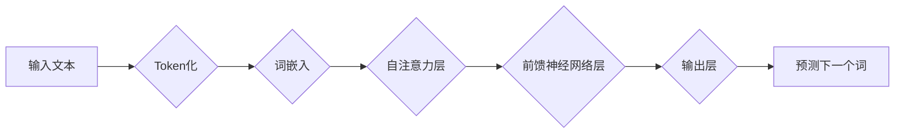

> ChatGPT, GPT-3, 自然语言处理, 语言模型, Transformer, 深度学习, 机器学习

## 1. 背景介绍

近年来，人工智能（AI）领域取得了令人瞩目的进展，其中自然语言处理（NLP）领域尤为突出。ChatGPT，由OpenAI开发的基于Transformer架构的强大语言模型，以其出色的文本生成能力和对话理解能力，迅速成为公众关注的焦点。它能够生成逼真的文本、翻译语言、编写不同类型的创意内容，甚至可以进行深入的对话，让人们不禁思考：机器真的能思考吗？

ChatGPT的出现，标志着人工智能技术迈向新的里程碑，它不仅展现了AI技术的强大潜力，也引发了人们对机器智能本质的深刻思考。本文将深入探讨ChatGPT的原理，揭示其背后的技术奥秘，并探讨其对未来社会的影响。

## 2. 核心概念与联系

ChatGPT的核心是Transformer架构，它是一种专门设计用于处理序列数据的深度神经网络结构。与传统的循环神经网络（RNN）相比，Transformer具有以下优势：

* **并行计算能力强:** Transformer可以并行处理输入序列中的所有元素，而RNN则需要逐个处理，效率较低。
* **长距离依赖关系处理能力强:** Transformer通过自注意力机制，可以有效地捕捉输入序列中任意两个元素之间的长距离依赖关系，而RNN在处理长序列时容易出现梯度消失问题。

**Mermaid 流程图:**

**核心概念与联系:**

* **Token化:** 将输入文本分割成一个个独立的单位（token），例如单词或子词。
* **词嵌入:** 将每个token映射到一个低维向量空间，以便神经网络进行处理。
* **自注意力机制:** 允许模型关注输入序列中不同位置的词，并计算它们之间的相关性。
* **前馈神经网络层:** 对自注意力机制输出的特征进行进一步处理。
* **输出层:** 生成下一个词的概率分布。

## 3. 核心算法原理 & 具体操作步骤

### 3.1  算法原理概述

ChatGPT的核心算法是基于Transformer架构的语言模型训练算法。其训练目标是最大化模型在训练数据上生成的文本与真实文本的相似度。

训练过程可以概括为以下步骤：

1. **数据预处理:** 将文本数据进行清洗、分词、词嵌入等预处理操作。
2. **模型训练:** 使用训练数据训练Transformer模型，通过反向传播算法不断调整模型参数，使其能够生成更符合真实文本的输出。
3. **模型评估:** 使用测试数据评估模型的性能，例如困惑度（perplexity）等指标。
4. **模型调优:** 根据评估结果，调整模型超参数，例如学习率、批处理大小等，进一步提高模型性能。

### 3.2  算法步骤详解

1. **输入文本:** 将用户输入的文本作为模型的输入。
2. **Token化:** 将输入文本分割成一个个独立的token。
3. **词嵌入:** 将每个token映射到一个低维向量空间。
4. **自注意力机制:** 计算每个token与其他token之间的相关性，并生成一个注意力权重矩阵。
5. **前馈神经网络层:** 对注意力权重矩阵进行处理，生成新的特征表示。
6. **输出层:** 根据生成的特征表示，预测下一个词的概率分布。
7. **解码:** 根据概率分布选择最可能的词，并将其添加到输出文本中。
8. **重复步骤6-7:** 直到生成完整的输出文本。

### 3.3  算法优缺点

**优点:**

* **强大的文本生成能力:** ChatGPT能够生成逼真的文本，并能够适应不同的写作风格。
* **良好的对话理解能力:** ChatGPT能够理解用户的意图，并进行自然流畅的对话。
* **可扩展性强:** Transformer架构可以轻松扩展到处理更长的文本序列。

**缺点:**

* **训练成本高:** 训练大型语言模型需要大量的计算资源和时间。
* **数据依赖性强:** 模型的性能取决于训练数据的质量和数量。
* **缺乏真实世界知识:** ChatGPT的知识主要来自于训练数据，缺乏对真实世界事件的理解和判断能力。

### 3.4  算法应用领域

ChatGPT在多个领域都有广泛的应用前景，例如：

* **聊天机器人:** 开发更智能、更自然的聊天机器人。
* **文本生成:** 自动生成新闻报道、小说、诗歌等文本内容。
* **机器翻译:** 实现更高效、更准确的机器翻译。
* **代码生成:** 自动生成代码，提高开发效率。
* **教育:** 提供个性化的学习辅导和知识问答服务。

## 4. 数学模型和公式 & 详细讲解 & 举例说明

### 4.1  数学模型构建

ChatGPT的核心数学模型是基于Transformer架构的深度神经网络。其主要组成部分包括：

* **词嵌入层:** 将每个词映射到一个低维向量空间。
* **自注意力层:** 计算每个词与其他词之间的相关性。
* **前馈神经网络层:** 对自注意力层的输出进行进一步处理。
* **输出层:** 生成下一个词的概率分布。

### 4.2  公式推导过程

**词嵌入层:**

$$
\mathbf{e}_i = \mathbf{W}_e \mathbf{x}_i
$$

其中，$\mathbf{e}_i$ 是词 $i$ 的词嵌入向量，$\mathbf{x}_i$ 是词 $i$ 的 one-hot 编码向量，$\mathbf{W}_e$ 是词嵌入矩阵。

**自注意力层:**

$$
\mathbf{A} = \text{softmax}\left(\frac{\mathbf{Q} \mathbf{K}^T}{\sqrt{d_k}}\right)
$$

其中，$\mathbf{Q}$ 是查询矩阵，$\mathbf{K}$ 是键矩阵，$\mathbf{A}$ 是注意力权重矩阵，$d_k$ 是键向量的维度。

**前馈神经网络层:**

$$
\mathbf{h} = \sigma(\mathbf{W}_1 \mathbf{A} + \mathbf{b}_1)
$$

$$
\mathbf{o} = \mathbf{W}_2 \mathbf{h} + \mathbf{b}_2
$$

其中，$\mathbf{h}$ 是前馈神经网络层的输出，$\mathbf{o}$ 是最终的输出，$\mathbf{W}_1$, $\mathbf{W}_2$, $\mathbf{b}_1$, $\mathbf{b}_2$ 是神经网络的参数。

### 4.3  案例分析与讲解

假设我们输入一个句子：“今天天气真好”。

1. 词嵌入层将每个词映射到一个低维向量空间。
2. 自注意力层计算每个词与其他词之间的相关性，例如“今天”与“天气”之间的相关性较高。
3. 前馈神经网络层对自注意力层的输出进行处理，生成新的特征表示。
4. 输出层根据生成的特征表示，预测下一个词的概率分布。

在该例子中，由于“今天天气真好”是一个完整的句子，因此输出层会预测下一个词为“。”。

## 5. 项目实践：代码实例和详细解释说明

### 5.1  开发环境搭建

ChatGPT的开发环境需要满足以下条件：

* 操作系统：Linux、macOS 或 Windows
* Python 版本：3.6 或更高版本
* CUDA 和 cuDNN：用于加速GPU训练

### 5.2  源代码详细实现

ChatGPT的源代码由OpenAI开源，可以在其官方网站上下载。

### 5.3  代码解读与分析

ChatGPT的源代码主要包含以下部分：

* **模型架构定义:** 定义Transformer模型的结构，包括词嵌入层、自注意力层、前馈神经网络层和输出层。
* **训练脚本:** 定义模型训练的流程，包括数据加载、模型训练、模型评估等步骤。
* **评估脚本:** 定义模型评估的指标，例如困惑度（perplexity）。

### 5.4  运行结果展示

训练完成后，可以使用ChatGPT生成文本、进行对话等操作。

## 6. 实际应用场景

### 6.1  聊天机器人

ChatGPT可以用于开发更智能、更自然的聊天机器人，例如客服机器人、陪伴机器人等。

### 6.2  文本生成

ChatGPT可以用于自动生成各种文本内容，例如新闻报道、小说、诗歌、剧本等。

### 6.3  机器翻译

ChatGPT可以用于实现更高效、更准确的机器翻译。

### 6.4  未来应用展望

ChatGPT在未来将有更广泛的应用场景，例如：

* **教育:** 提供个性化的学习辅导和知识问答服务。
* **医疗:** 辅助医生诊断疾病、提供医疗建议。
* **法律:** 辅助律师进行法律研究、撰写法律文件。

## 7. 工具和资源推荐

### 7.1  学习资源推荐

* **OpenAI 官方文档:** https://openai.com/blog/chatgpt/
* **Transformer 架构论文:** https://arxiv.org/abs/1706.03762
* **深度学习课程:** https://www.deeplearning.ai/

### 7.2  开发工具推荐

* **TensorFlow:** https://www.tensorflow.org/
* **PyTorch:** https://pytorch.org/

### 7.3  相关论文推荐

* **BERT:** https://arxiv.org/abs/1810.04805
* **GPT-3:** https://openai.com/blog/gpt-3/

## 8. 总结：未来发展趋势与挑战

### 8.1  研究成果总结

ChatGPT的出现标志着人工智能技术取得了新的突破，它展现了AI技术在自然语言处理领域的强大潜力。

### 8.2  未来发展趋势

未来，ChatGPT和类似的语言模型将朝着以下方向发展：

* **模型规模更大:** 训练更大的模型，提高模型的性能和能力。
* **多模态理解:** 能够理解和生成多种模态的数据，例如文本、图像、音频等。
* **更强的推理能力:** 能够进行更复杂的推理和决策。

### 8.3  面临的挑战

ChatGPT也面临着一些挑战，例如：

* **数据偏见:** 模型的训练数据可能存在偏见，导致模型输出结果存在偏差。
* **可解释性:** 模型的决策过程难以解释，难以理解模型是如何生成输出结果的。
* **安全风险:** 模型可能被用于生成虚假信息、进行恶意攻击等。

### 8.4  研究展望

未来，我们需要继续研究如何解决这些挑战，并推动ChatGPT等语言模型的健康发展，使其真正为人类社会带来福祉。

## 9. 附录：常见问题与解答

**Q1: ChatGPT 是开源的吗？**

A1: ChatGPT 的源代码由 OpenAI 开源，可以在其官方网站上下载。

**Q2: 如何训练 ChatGPT？**

A2: 训练 ChatGPT 需要大量的计算资源和时间，需要使用深度学习框架，例如 TensorFlow 或 PyTorch。

**Q3: ChatGPT 的应用场景有哪些？**

A3: ChatGPT 的应用场景非常广泛，例如聊天机器人、文本生成、机器翻译等。

**Q4: ChatGPT 的局限性是什么？**

A4: ChatGPT 的局限性包括数据偏见、可解释性差、安全风险等。

**Q5: ChatGPT 的未来发展趋势是什么？**

A5: ChatGPT 的未来发展趋势包括模型规模更大、多模态理解、更强的推理能力等。

作者：禅与计算机程序设计艺术 / Zen and the Art of Computer Programming 
<end_of_turn>