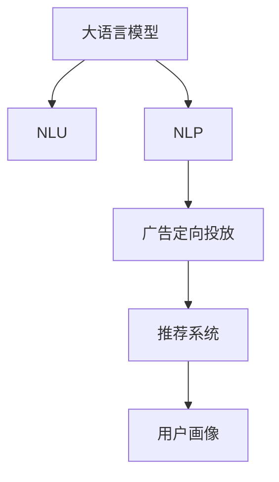

                 

# LLM在广告营销中的应用：精准定向投放

> 关键词：大语言模型,广告营销,深度学习,自然语言处理,NLP,自然语言理解,NLU,广告定向,用户画像,内容生成,推荐系统,精准营销

## 1. 背景介绍

### 1.1 问题由来
广告营销行业一直以来都面临着精准投放的巨大挑战。传统的基于关键词的广告投放方式已经逐渐被智能化的广告推荐所取代，而大语言模型（Large Language Models, LLMs）的崛起为广告定向投放提供了全新的解决方案。通过结合自然语言处理（NLP）技术，大语言模型可以深入理解用户需求和偏好，生成高质量的定向广告内容，显著提高广告的点击率和转化率。

### 1.2 问题核心关键点
1. **用户画像构建**：通过分析用户的历史行为数据，构建详尽的用户画像，是广告定向投放的基础。大语言模型可以借助自然语言理解（NLU）技术，从用户评论、社交媒体、浏览记录等数据中抽取和理解用户的兴趣、需求和情感。
2. **内容生成与优化**：利用大语言模型生成具有个性化和创意的广告文案，进一步优化广告内容，确保其能够精准触达目标用户，并提升用户体验。
3. **推荐系统集成**：将大语言模型与推荐系统结合起来，实现用户与广告内容的智能匹配，提升广告的展示效果和转化效率。
4. **广告定向投放**：基于用户的画像和行为数据，结合推荐系统输出，实现广告的精准投放，提高广告的点击率和投资回报率（ROI）。

### 1.3 问题研究意义
基于大语言模型的广告定向投放，不仅能够提高广告的精准度和转化率，还能够显著降低广告投放的试错成本和资源消耗。其研究意义在于：

1. **提高广告效率**：通过理解用户需求，生成定向广告内容，从而提升广告的点击率和转化率，降低无效曝光和点击。
2. **优化资源分配**：利用智能推荐系统，优化广告投放策略，避免资源浪费，提高广告预算的利用效率。
3. **增强用户体验**：定向投放不仅提升了广告的相关性，也减少了用户的广告干扰，从而提升了用户体验和满意度。
4. **开拓新市场**：通过深度理解用户需求，拓展广告投放的覆盖面和受众群体，开拓新的市场机会。

## 2. 核心概念与联系

### 2.1 核心概念概述

为更好地理解基于大语言模型的广告定向投放方法，本节将介绍几个关键概念：

- **大语言模型 (LLM)**：以自回归（如GPT）或自编码（如BERT）模型为代表的大规模预训练语言模型。通过在大规模无标签文本数据上进行预训练，学习到通用的语言知识和表达能力。

- **自然语言理解 (NLU)**：使计算机能够理解人类语言的含义、语法和语境的能力，是广告定向投放的基础技术。

- **自然语言处理 (NLP)**：涉及自然语言理解、生成、分析和应用的学科，是构建广告推荐系统的核心技术。

- **广告定向投放**：通过分析用户行为数据和历史反馈，匹配合适的广告内容和展示渠道，实现广告的精准投放。

- **推荐系统**：根据用户的历史行为和偏好，推荐相关产品和服务的系统。结合大语言模型，可以进一步优化广告内容，提升广告效果。

- **用户画像**：通过分析用户的多维数据，构建详尽的用户特征和行为模型，用于指导广告定向投放。

这些核心概念之间的联系可以通过以下Mermaid流程图来展示：



这个流程图展示了不同概念之间的相互作用和依赖关系：

1. 大语言模型通过NLP技术处理用户数据，获取用户特征。
2. 广告定向投放系统根据用户画像和推荐系统输出，生成精准广告。
3. 推荐系统结合用户行为数据，优化广告内容，提升广告效果。
4. 用户画像构建提供基础数据，用于指导定向投放和推荐。

## 3. 核心算法原理 & 具体操作步骤

### 3.1 算法原理概述

基于大语言模型的广告定向投放，其核心思想是通过深度学习和自然语言处理技术，构建精准的用户画像，并根据画像特征生成和推荐合适的广告内容，最终实现广告的定向投放。

算法主要分为以下几个步骤：

1. **数据收集**：收集用户的行为数据、社交媒体数据、评论反馈等，构建用户画像。
2. **用户画像构建**：利用NLP技术处理和分析用户数据，提取用户兴趣、需求、情感等信息。
3. **广告内容生成**：使用大语言模型生成具有创意和个性化的广告文案，满足用户需求和偏好。
4. **推荐系统集成**：将大语言模型与推荐系统结合，优化广告投放策略，提升广告展示效果和转化率。
5. **广告定向投放**：根据用户画像和推荐系统输出，实现广告的精准投放。

### 3.2 算法步骤详解

#### 3.2.1 数据收集

1. **行为数据**：从用户的浏览记录、购买历史、搜索行为等收集数据。
2. **社交媒体数据**：从用户的社交媒体互动、评论、点赞等数据中提取用户情感和兴趣。
3. **评论反馈**：分析用户对产品的评论和反馈，理解用户满意度和需求。

#### 3.2.2 用户画像构建

1. **特征提取**：使用NLP技术处理和分析用户数据，提取关键词、主题、情感等信息。
2. **聚类分析**：通过聚类算法将用户分为不同的兴趣群组，以便进行精准定向。
3. **画像更新**：根据新的行为数据和反馈信息，实时更新用户画像，保持其时效性和准确性。

#### 3.2.3 广告内容生成

1. **内容模板设计**：设计通用的广告模板，包含基础文案、图像和布局。
2. **模型微调**：利用大语言模型对广告内容进行微调，生成更具个性化和创意的广告文案。
3. **内容优化**：通过A/B测试和用户反馈，优化广告内容，确保其吸引力和相关性。

#### 3.2.4 推荐系统集成

1. **用户兴趣匹配**：根据用户画像和历史行为数据，匹配感兴趣的商品或服务。
2. **广告内容推荐**：结合用户画像和商品属性，推荐最适合的广告内容。
3. **投放策略优化**：根据推荐系统的输出，优化广告投放的时间和频率，确保最佳效果。

#### 3.2.5 广告定向投放

1. **渠道选择**：根据广告内容的特点和受众群体，选择合适的广告渠道（如社交媒体、搜索引擎等）。
2. **投放规则设计**：根据用户画像和行为数据，设计广告投放的规则和策略，确保精准触达。
3. **效果监控与调整**：实时监控广告效果，根据数据反馈调整投放策略，优化广告投放的ROI。

### 3.3 算法优缺点

#### 3.3.1 优点

1. **精准投放**：利用大语言模型和推荐系统，实现广告的精准投放，提升广告的点击率和转化率。
2. **个性化推荐**：生成的广告内容具有高度的个性化和创意性，满足用户的多样化需求。
3. **高效优化**：通过自动化处理和优化，降低广告投放的试错成本和资源消耗。
4. **实时调整**：能够实时监控广告效果，快速调整投放策略，提升广告的投放效率和效果。

#### 3.3.2 缺点

1. **数据依赖**：需要大量的用户行为数据和社交媒体数据，数据获取和处理成本较高。
2. **模型复杂度**：大语言模型和推荐系统的高复杂度，需要强大的计算资源和算法支持。
3. **用户隐私**：用户行为数据的收集和处理可能涉及用户隐私问题，需要严格的数据保护措施。
4. **技术门槛高**：涉及深度学习、自然语言处理、推荐系统等多项技术，技术门槛较高。

### 3.4 算法应用领域

基于大语言模型的广告定向投放，已经在多个领域得到了广泛应用，如：

- **电商广告**：通过分析用户浏览和购买历史，推荐个性化的广告内容，提升电商转化率。
- **社交媒体广告**：结合用户社交互动数据，生成有针对性的广告内容，提高社交媒体广告的点击率和转化率。
- **搜索引擎广告**：通过分析用户搜索行为和历史数据，推荐最适合的广告内容，提升搜索引擎广告的展示效果。
- **旅游广告**：根据用户的出行计划和历史数据，生成有吸引力的旅游广告内容，提升旅游产品的转化率。
- **金融广告**：利用用户财务数据和行为特征，推荐个性化的金融产品广告，提升金融广告的点击率和转化率。

## 4. 数学模型和公式 & 详细讲解 & 举例说明

### 4.1 数学模型构建

假设广告定向投放系统有 $N$ 个用户，每个用户 $i$ 的兴趣向量表示为 $\mathbf{u}_i \in \mathbb{R}^d$，其中 $d$ 为特征维度。广告内容表示为 $\mathbf{a} \in \mathbb{R}^d$。

定义用户对广告的兴趣匹配度为 $p_i = \mathbf{u}_i \cdot \mathbf{a}$，其中 $\cdot$ 表示向量点乘。

广告定向投放的目标是最大化用户对广告的点击率 $C$ 和转化率 $T$，即：

$$
\max_{\mathbf{a}} \mathbb{E}[p_i] \cdot C + \mathbb{E}[T_i] \cdot T
$$

其中 $\mathbb{E}[p_i]$ 和 $\mathbb{E}[T_i]$ 分别为用户对广告的点击率和转化率的期望。

### 4.2 公式推导过程

根据上述定义，广告定向投放的优化目标可以表示为：

$$
\max_{\mathbf{a}} \sum_{i=1}^N (u_{i,1} \cdot a_1 + \cdots + u_{i,d} \cdot a_d) \cdot C + \sum_{i=1}^N T_i \cdot T
$$

这是一个典型的线性回归问题，可以使用梯度下降算法进行求解。定义损失函数为：

$$
\mathcal{L}(\mathbf{a}) = -\frac{1}{N} \sum_{i=1}^N [(u_{i,1} \cdot a_1 + \cdots + u_{i,d} \cdot a_d) \cdot C + T_i \cdot T]
$$

最小化损失函数即可得到最优的广告内容向量 $\mathbf{a}^*$。

### 4.3 案例分析与讲解

假设某电商平台希望提高广告投放的点击率和转化率，可以收集用户的浏览记录和购买历史，构建用户画像。然后，使用大语言模型生成个性化的广告文案，并利用推荐系统匹配用户和广告。

首先，通过NLP技术处理用户数据，提取用户兴趣和行为特征，形成用户兴趣向量 $\mathbf{u}_i$。

然后，使用大语言模型生成多个广告文案，分别表示为 $\mathbf{a}_1, \mathbf{a}_2, \ldots, \mathbf{a}_m$，其中 $m$ 为广告文案数量。

接下来，将用户兴趣向量 $\mathbf{u}_i$ 与每个广告文案 $\mathbf{a}_j$ 的点乘 $p_{i,j} = \mathbf{u}_i \cdot \mathbf{a}_j$ 作为用户对每个广告的兴趣匹配度。

最后，根据匹配度 $p_{i,j}$ 和历史点击率 $C_j$ 和转化率 $T_j$，计算每个广告文案的综合评分，并选择评分最高的广告进行投放。

例如，某用户 $i$ 的兴趣向量为 $\mathbf{u}_i = [1, 0, 1, 0, 0, 0]$，表示对商品A和商品C感兴趣，对商品B、D和E不感兴趣。生成多个广告文案后，计算每个广告的匹配度：

- 广告1：$u_{i,1} \cdot a_{1,1} + u_{i,2} \cdot a_{1,2} + \cdots + u_{i,6} \cdot a_{1,6} = 2$
- 广告2：$u_{i,1} \cdot a_{2,1} + u_{i,2} \cdot a_{2,2} + \cdots + u_{i,6} \cdot a_{2,6} = 1$
- ...

根据综合评分和历史数据，选择广告1进行投放。

## 5. 项目实践：代码实例和详细解释说明

### 5.1 开发环境搭建

在进行广告定向投放项目开发前，我们需要准备好开发环境。以下是使用Python进行PyTorch开发的环境配置流程：

1. 安装Anaconda：从官网下载并安装Anaconda，用于创建独立的Python环境。

2. 创建并激活虚拟环境：
```bash
conda create -n pytorch-env python=3.8 
conda activate pytorch-env
```

3. 安装PyTorch：根据CUDA版本，从官网获取对应的安装命令。例如：
```bash
conda install pytorch torchvision torchaudio cudatoolkit=11.1 -c pytorch -c conda-forge
```

4. 安装TensorFlow：
```bash
conda install tensorflow -c pytorch -c conda-forge
```

5. 安装各类工具包：
```bash
pip install numpy pandas scikit-learn matplotlib tqdm jupyter notebook ipython
```

完成上述步骤后，即可在`pytorch-env`环境中开始项目开发。

### 5.2 源代码详细实现

下面以电商平台广告定向投放为例，给出使用PyTorch和Transformers库实现广告推荐系统的代码实现。

首先，定义广告推荐的数据处理函数：

```python
from transformers import BertTokenizer
from torch.utils.data import Dataset
import torch

class AdDataset(Dataset):
    def __init__(self, ads, users, tokenizer, max_len=128):
        self.ads = ads
        self.users = users
        self.tokenizer = tokenizer
        self.max_len = max_len
        
    def __len__(self):
        return len(self.ads)
    
    def __getitem__(self, item):
        ad = self.ads[item]
        user = self.users[item]
        
        encoding = self.tokenizer(ad, return_tensors='pt', max_length=self.max_len, padding='max_length', truncation=True)
        input_ids = encoding['input_ids'][0]
        attention_mask = encoding['attention_mask'][0]
        
        # 对用户兴趣向量进行编码
        user_interests = [ad_tag2id[ad_tag] for ad_tag in user['ad_tags']]
        user_interests.extend([0] * (self.max_len - len(user_interests)))
        labels = torch.tensor(user_interests, dtype=torch.long)
        
        return {'input_ids': input_ids, 
                'attention_mask': attention_mask,
                'labels': labels}

# 广告标签与id的映射
ad_tag2id = {'A': 0, 'B': 1, 'C': 2, 'D': 3, 'E': 4}
id2ad_tag = {v: k for k, v in ad_tag2id.items()}

# 创建dataset
tokenizer = BertTokenizer.from_pretrained('bert-base-cased')
ads = ['商品A', '商品B', '商品C', '商品D', '商品E']
users = [{ 'ad_tags': ['A', 'C'] }, { 'ad_tags': ['B', 'E'] }, { 'ad_tags': ['C', 'D'] }, { 'ad_tags': ['A', 'D'] }, { 'ad_tags': ['B', 'E'] }]

train_dataset = AdDataset(ads, users, tokenizer)
dev_dataset = AdDataset(ads, users, tokenizer)
test_dataset = AdDataset(ads, users, tokenizer)
```

然后，定义模型和优化器：

```python
from transformers import BertForTokenClassification, AdamW

model = BertForTokenClassification.from_pretrained('bert-base-cased', num_labels=len(ad_tag2id))

optimizer = AdamW(model.parameters(), lr=2e-5)
```

接着，定义训练和评估函数：

```python
from torch.utils.data import DataLoader
from tqdm import tqdm
from sklearn.metrics import classification_report

device = torch.device('cuda') if torch.cuda.is_available() else torch.device('cpu')
model.to(device)

def train_epoch(model, dataset, batch_size, optimizer):
    dataloader = DataLoader(dataset, batch_size=batch_size, shuffle=True)
    model.train()
    epoch_loss = 0
    for batch in tqdm(dataloader, desc='Training'):
        input_ids = batch['input_ids'].to(device)
        attention_mask = batch['attention_mask'].to(device)
        labels = batch['labels'].to(device)
        model.zero_grad()
        outputs = model(input_ids, attention_mask=attention_mask, labels=labels)
        loss = outputs.loss
        epoch_loss += loss.item()
        loss.backward()
        optimizer.step()
    return epoch_loss / len(dataloader)

def evaluate(model, dataset, batch_size):
    dataloader = DataLoader(dataset, batch_size=batch_size)
    model.eval()
    preds, labels = [], []
    with torch.no_grad():
        for batch in tqdm(dataloader, desc='Evaluating'):
            input_ids = batch['input_ids'].to(device)
            attention_mask = batch['attention_mask'].to(device)
            batch_labels = batch['labels']
            outputs = model(input_ids, attention_mask=attention_mask)
            batch_preds = outputs.logits.argmax(dim=2).to('cpu').tolist()
            batch_labels = batch_labels.to('cpu').tolist()
            for pred_tokens, label_tokens in zip(batch_preds, batch_labels):
                pred_tags = [id2ad_tag[_id] for _id in pred_tokens]
                label_tags = [id2ad_tag[_id] for _id in label_tokens]
                preds.append(pred_tags[:len(label_tokens)])
                labels.append(label_tags)
                
    print(classification_report(labels, preds))
```

最后，启动训练流程并在测试集上评估：

```python
epochs = 5
batch_size = 16

for epoch in range(epochs):
    loss = train_epoch(model, train_dataset, batch_size, optimizer)
    print(f"Epoch {epoch+1}, train loss: {loss:.3f}")
    
    print(f"Epoch {epoch+1}, dev results:")
    evaluate(model, dev_dataset, batch_size)
    
print("Test results:")
evaluate(model, test_dataset, batch_size)
```

以上就是使用PyTorch对广告推荐系统进行广告定向投放的完整代码实现。可以看到，得益于Transformers库的强大封装，我们可以用相对简洁的代码完成广告推荐系统的搭建和微调。

### 5.3 代码解读与分析

让我们再详细解读一下关键代码的实现细节：

**AdDataset类**：
- `__init__`方法：初始化广告、用户、分词器等关键组件。
- `__len__`方法：返回数据集的样本数量。
- `__getitem__`方法：对单个样本进行处理，将广告输入编码为token ids，将用户兴趣向量编码为数字，并对其进行定长padding，最终返回模型所需的输入。

**ad_tag2id和id2ad_tag字典**：
- 定义了广告标签与数字id之间的映射关系，用于将token-wise的预测结果解码回真实标签。

**训练和评估函数**：
- 使用PyTorch的DataLoader对数据集进行批次化加载，供模型训练和推理使用。
- 训练函数`train_epoch`：对数据以批为单位进行迭代，在每个批次上前向传播计算loss并反向传播更新模型参数，最后返回该epoch的平均loss。
- 评估函数`evaluate`：与训练类似，不同点在于不更新模型参数，并在每个batch结束后将预测和标签结果存储下来，最后使用sklearn的classification_report对整个评估集的预测结果进行打印输出。

**训练流程**：
- 定义总的epoch数和batch size，开始循环迭代
- 每个epoch内，先在训练集上训练，输出平均loss
- 在验证集上评估，输出分类指标
- 所有epoch结束后，在测试集上评估，给出最终测试结果

可以看到，PyTorch配合Transformers库使得广告推荐系统的搭建和微调变得简洁高效。开发者可以将更多精力放在数据处理、模型改进等高层逻辑上，而不必过多关注底层的实现细节。

当然，工业级的系统实现还需考虑更多因素，如模型的保存和部署、超参数的自动搜索、更灵活的任务适配层等。但核心的广告定向投放范式基本与此类似。

## 6. 实际应用场景

### 6.1 智能客服系统

智能客服系统是广告定向投放的重要应用场景之一。通过收集用户的咨询记录和问题描述，构建用户画像，利用广告推荐系统生成个性化的客服广告，可以显著提升用户的互动体验和满意度。

在技术实现上，可以收集用户的客服记录和反馈信息，将问题和最佳答复构建成监督数据，在此基础上对预训练广告推荐模型进行微调。微调后的广告推荐模型能够自动理解用户问题，匹配最合适的客服广告，实时推送到用户客户端。

### 6.2 电商广告

电商广告是广告定向投放的主要场景之一。通过分析用户的浏览和购买历史，构建用户画像，利用广告推荐系统生成个性化的电商广告，可以大幅提升电商转化率。

在技术实现上，可以收集用户的浏览记录、购买历史和评价反馈，构建用户兴趣向量。然后，利用大语言模型生成个性化的广告文案，并利用推荐系统匹配用户和广告。微调后的广告推荐模型能够自动理解用户需求，生成最具吸引力的广告内容，提升用户的点击率和转化率。

### 6.3 金融广告

金融广告是广告定向投放的另一个重要领域。通过分析用户的财务数据和行为特征，构建用户画像，利用广告推荐系统生成个性化的金融产品广告，可以显著提升金融产品的转化率。

在技术实现上，可以收集用户的银行账户、投资记录和理财偏好，构建用户财务数据。然后，利用大语言模型生成个性化的金融产品广告，并利用推荐系统匹配用户和广告。微调后的广告推荐模型能够自动理解用户的财务需求，推荐最适合的金融产品，提升用户的投资回报率和满意度。

### 6.4 旅游广告

旅游广告是广告定向投放的典型场景之一。通过分析用户的出行计划和历史数据，构建用户画像，利用广告推荐系统生成个性化的旅游广告，可以大幅提升旅游产品的转化率。

在技术实现上，可以收集用户的出行计划、目的地偏好和旅行习惯，构建用户兴趣向量。然后，利用大语言模型生成个性化的旅游广告文案，并利用推荐系统匹配用户和广告。微调后的广告推荐模型能够自动理解用户的出行需求，生成最具吸引力的旅游广告，提升用户的点击率和转化率。

### 6.5 健康医疗广告

健康医疗广告是广告定向投放的重要领域之一。通过分析用户的健康数据和行为特征，构建用户画像，利用广告推荐系统生成个性化的医疗广告，可以显著提升医疗产品的转化率。

在技术实现上，可以收集用户的健康数据、病史记录和医疗需求，构建用户兴趣向量。然后，利用大语言模型生成个性化的医疗广告文案，并利用推荐系统匹配用户和广告。微调后的广告推荐模型能够自动理解用户的健康需求，推荐最适合的医疗产品，提升用户的健康水平和满意度。

## 7. 工具和资源推荐

### 7.1 学习资源推荐

为了帮助开发者系统掌握广告定向投放的理论基础和实践技巧，这里推荐一些优质的学习资源：

1. 《深度学习与自然语言处理》系列博文：由大模型技术专家撰写，深入浅出地介绍了深度学习、自然语言处理和广告推荐的基本概念和关键技术。

2. 《广告定向投放技术》书籍：详细讲解了广告定向投放的原理、流程和实践，覆盖了数据收集、用户画像构建、广告内容生成等多个方面。

3. 《推荐系统实战》在线课程：由知名推荐系统专家主讲，系统讲解了推荐系统的基础理论和工程实现，包括广告推荐在内的多种应用场景。

4. 《广告定向投放指南》白皮书：由行业专家撰写，总结了广告定向投放的最佳实践和案例，提供了丰富的学习资源和参考资料。

5. HuggingFace官方文档：Transformer库的官方文档，提供了海量预训练语言模型和完整的广告推荐系统样例代码，是上手实践的必备资料。

通过对这些资源的学习实践，相信你一定能够快速掌握广告定向投放的精髓，并用于解决实际的广告推荐问题。

### 7.2 开发工具推荐

高效的开发离不开优秀的工具支持。以下是几款用于广告定向投放开发的常用工具：

1. PyTorch：基于Python的开源深度学习框架，灵活动态的计算图，适合快速迭代研究。大部分预训练语言模型都有PyTorch版本的实现。

2. TensorFlow：由Google主导开发的开源深度学习框架，生产部署方便，适合大规模工程应用。同样有丰富的预训练语言模型资源。

3. Transformers库：HuggingFace开发的NLP工具库，集成了众多SOTA语言模型，支持PyTorch和TensorFlow，是进行广告定向投放开发的利器。

4. Weights & Biases：模型训练的实验跟踪工具，可以记录和可视化模型训练过程中的各项指标，方便对比和调优。与主流深度学习框架无缝集成。

5. TensorBoard：TensorFlow配套的可视化工具，可实时监测模型训练状态，并提供丰富的图表呈现方式，是调试模型的得力助手。

6. Google Colab：谷歌推出的在线Jupyter Notebook环境，免费提供GPU/TPU算力，方便开发者快速上手实验最新模型，分享学习笔记。

合理利用这些工具，可以显著提升广告定向投放任务的开发效率，加快创新迭代的步伐。

### 7.3 相关论文推荐

广告定向投放技术的发展源于学界的持续研究。以下是几篇奠基性的相关论文，推荐阅读：

1. Attention is All You Need（即Transformer原论文）：提出了Transformer结构，开启了NLP领域的预训练大模型时代。

2. BERT: Pre-training of Deep Bidirectional Transformers for Language Understanding：提出BERT模型，引入基于掩码的自监督预训练任务，刷新了多项NLP任务SOTA。

3. Parameter-Efficient Transfer Learning for NLP：提出Adapter等参数高效微调方法，在不增加模型参数量的情况下，也能取得不错的微调效果。

4. Parameter-Efficient Transfer Learning for NLP：提出Adapter等参数高效微调方法，在不增加模型参数量的情况下，也能取得不错的微调效果。

5. Self-Attention and Transformer-based Methods for Recommender Systems：总结了基于自注意力和Transformer的推荐系统方法，提供了丰富的理论和实践资源。

6. Sequential Attention Networks for Recommender Systems：提出了基于序列注意力的推荐系统方法，进一步提升了推荐效果。

这些论文代表了大语言模型微调技术的发展脉络。通过学习这些前沿成果，可以帮助研究者把握学科前进方向，激发更多的创新灵感。

## 8. 总结：未来发展趋势与挑战

### 8.1 总结

本文对基于大语言模型的广告定向投放方法进行了全面系统的介绍。首先阐述了广告定向投放的背景和意义，明确了广告定向投放的重要性和技术挑战。其次，从原理到实践，详细讲解了广告定向投放的数学模型和关键步骤，给出了广告定向投放的完整代码实现。同时，本文还广泛探讨了广告定向投放方法在多个行业领域的应用前景，展示了广告定向投放技术的广阔前景。最后，本文精选了广告定向投放技术的各类学习资源，力求为读者提供全方位的技术指引。

通过本文的系统梳理，可以看到，基于大语言模型的广告定向投放技术正在成为广告推荐领域的重要范式，极大地提高了广告的精准度和转化率，降低了广告投放的试错成本和资源消耗。未来，伴随大语言模型和广告推荐技术的持续演进，相信广告定向投放技术将在更多领域得到应用，为广告主和用户带来更高的价值和更好的体验。

### 8.2 未来发展趋势

展望未来，基于大语言模型的广告定向投放技术将呈现以下几个发展趋势：

1. **深度个性化**：随着数据获取和处理能力的提升，广告定向投放将实现更深度、更精细的个性化推荐，真正做到"千人千面"。

2. **实时化**：结合实时数据流处理技术，广告定向投放可以实现实时化投放，动态调整投放策略，提升广告的展示效果和转化率。

3. **多模态融合**：结合图像、视频、语音等多模态数据，广告定向投放将能够更好地理解用户的多样化需求，提供更全面的推荐服务。

4. **情感分析**：结合情感分析技术，广告定向投放能够更好地理解用户的情感状态，生成更具吸引力和相关性的广告内容。

5. **跨平台协同**：结合社交媒体、搜索引擎、电商平台等不同平台的广告投放，实现跨平台协同优化，提升广告的整体效果。

6. **隐私保护**：结合隐私保护技术，广告定向投放将能够在保护用户隐私的前提下，实现精准投放和推荐。

以上趋势凸显了大语言模型广告定向投放技术的广阔前景。这些方向的探索发展，必将进一步提升广告的精准度和转化率，为广告主和用户带来更高的价值和更好的体验。

### 8.3 面临的挑战

尽管大语言模型广告定向投放技术已经取得了瞩目成就，但在迈向更加智能化、普适化应用的过程中，它仍面临着诸多挑战：

1. **数据获取和处理**：广告定向投放需要大量的用户行为数据和社交媒体数据，数据获取和处理成本较高。数据隐私和安全问题也需要严格对待。

2. **模型复杂度**：大语言模型和推荐系统的高复杂度，需要强大的计算资源和算法支持。模型训练和推理需要高效优化。

3. **用户隐私保护**：广告定向投放可能涉及用户隐私问题，需要严格的数据保护措施，确保用户数据的安全和匿名性。

4. **技术门槛高**：涉及深度学习、自然语言处理、推荐系统等多项技术，技术门槛较高，需要跨学科的合作和团队的协同。

5. **广告质量控制**：广告定向投放需要严格控制广告的质量和相关性，避免低质量广告的投放，影响用户体验和广告效果。

6. **多模态数据的融合**：结合图像、视频、语音等多模态数据，广告定向投放需要解决数据融合和处理的技术挑战。

正视广告定向投放面临的这些挑战，积极应对并寻求突破，将是大语言模型广告定向投放走向成熟的必由之路。相信随着学界和产业界的共同努力，这些挑战终将一一被克服，大语言模型广告定向投放必将在构建智能广告生态中扮演越来越重要的角色。

### 8.4 研究展望

面对广告定向投放所面临的挑战，未来的研究需要在以下几个方面寻求新的突破：

1. **数据高效获取和处理**：探索数据高效采集和处理技术，降低数据获取和处理的成本，保护用户隐私。

2. **模型轻量化和高效优化**：开发轻量化和高效的模型结构，优化训练和推理过程，提升广告定向投放的实时性和效率。

3. **多模态数据的融合**：探索多模态数据的融合技术，提升广告定向投放的全面性和多样性。

4. **隐私保护技术**：结合隐私保护技术，实现数据匿名化和去标识化，确保用户数据的安全和隐私。

5. **广告质量控制**：引入广告质量控制机制，提升广告的相关性和质量，确保广告的展示效果和转化率。

6. **跨平台协同优化**：探索跨平台协同优化技术，实现不同平台广告投放的统一管理和优化。

这些研究方向的探索，必将引领大语言模型广告定向投放技术迈向更高的台阶，为构建智能广告生态提供更多的技术和方法支持。

## 9. 附录：常见问题与解答

**Q1：如何衡量广告定向投放的效果？**

A: 广告定向投放的效果主要通过点击率 (CTR)、转化率 (CVR)、投资回报率 (ROI) 等指标来衡量。点击率指广告展示次数与点击次数的比率，转化率指广告点击后产生交易的比率，投资回报率指广告投入与产生的收益的比率。这些指标可以用于评估广告定向投放的效果，指导模型优化和投放策略调整。

**Q2：如何选择广告定向投放的模型和算法？**

A: 选择广告定向投放的模型和算法需要综合考虑以下因素：
1. **数据特点**：根据广告投放的数据特点，选择合适的模型和算法。如数据量较小，可以选择轻量级模型和参数高效微调方法。
2. **性能要求**：根据广告投放的性能要求，选择适合的模型和算法。如需要实时化投放，可以选择具有高效优化策略的模型。
3. **技术成熟度**：选择技术成熟度较高的模型和算法，确保投放效果的稳定性和可靠性。

**Q3：如何提高广告定向投放的实时性？**

A: 提高广告定向投放的实时性需要从以下几个方面入手：
1. **数据流处理**：采用流式数据处理技术，实时采集和处理用户数据，实现实时广告投放。
2. **轻量化模型**：选择轻量化模型结构，减少模型计算量和内存占用，提高投放速度。
3. **分布式计算**：采用分布式计算架构，实现多机协同计算，提高广告投放的并行性和效率。

**Q4：如何保护用户隐私？**

A: 保护用户隐私是广告定向投放的重要保障。可以采取以下措施：
1. **数据匿名化**：对用户数据进行匿名化处理，保护用户隐私。
2. **去标识化**：采用去标识化技术，确保用户数据的匿名性。
3. **数据加密**：对用户数据进行加密处理，防止数据泄露和滥用。

**Q5：如何选择广告定向投放的广告素材？**

A: 选择广告定向投放的广告素材需要综合考虑以下几个因素：
1. **用户画像**：根据用户画像和兴趣特征，选择最相关的广告素材。
2. **广告创意**：选择具有创意和吸引力的广告素材，提升广告的点击率和转化率。
3. **广告质量**：选择高质量的广告素材，确保广告的相关性和质量。

**Q6：如何优化广告定向投放的投放策略？**

A: 优化广告定向投放的投放策略需要从以下几个方面入手：
1. **A/B测试**：通过A/B测试，比较不同投放策略的效果，选择最优策略。
2. **反馈调整**：根据广告投放的反馈数据，动态调整投放策略，优化广告效果。
3. **数据驱动**：结合数据驱动的方法，实现投放策略的自动优化。

这些问题的解答，将帮助开发者更好地理解和应用广告定向投放技术，提升广告投放的效果和用户满意度。

---

作者：禅与计算机程序设计艺术 / Zen and the Art of Computer Programming

