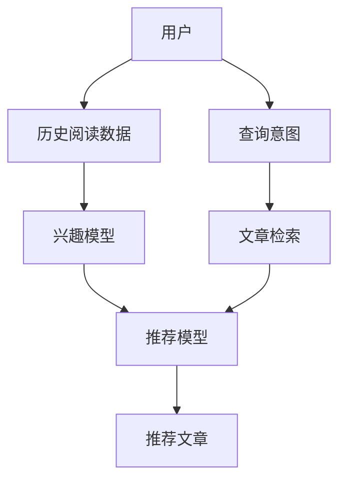

                 

# LLM在技术文章推荐中的实验效果

> 关键词：自然语言处理(NLP), 预训练模型, 大语言模型(LLM), 技术文章推荐, 神经网络, 推荐系统, 信息检索

## 1. 背景介绍

随着科技的发展，获取最新的技术资讯成为了技术人不可或缺的一部分。然而，大量的技术文章和信息往往使得人们难以有效筛选出真正有价值的内容。为了解决这一问题，技术文章推荐系统应运而生。这类系统旨在通过分析用户的历史阅读行为和兴趣偏好，推荐可能感兴趣的技术文章，提升用户的信息获取效率。然而，技术文章推荐系统的构建面临诸多挑战，比如文章内容的多样性、领域的广泛性以及用户的个性化需求等。近年来，自然语言处理(NLP)领域的大语言模型(LLM)在技术文章推荐中表现出越来越大的潜力。本文将围绕LLM在技术文章推荐中的实验效果进行探讨，并详细阐述其实现机制、实验设计与分析以及应用展望。

## 2. 核心概念与联系

### 2.1 核心概念概述

为了理解LLM在技术文章推荐中的实验效果，首先需要明确几个关键概念：

- **大语言模型(LLM)**：指的是通过大规模无标签数据进行预训练的神经网络模型，具备极强的语言理解与生成能力。LLM如BERT、GPT-3等，是推荐系统中的重要组成部分。

- **预训练模型**：指在大量无标签数据上预先训练好的模型，通常用于提供初始的语义表示，提升推荐系统的准确性。

- **技术文章推荐系统**：基于用户的历史阅读行为和兴趣，推荐可能感兴趣的技术文章的系统。常见的推荐算法包括协同过滤、基于内容的推荐、基于图的推荐等。

- **推荐算法**：指用于处理用户-项目关联矩阵并预测用户对项目的兴趣程度的算法，如矩阵分解、决策树、深度学习等。

- **信息检索**：通过文本匹配、向量相似度等手段，从大量文本中检索出最相关的文章。

这些核心概念之间具有紧密的联系，构成了技术文章推荐系统的理论基础。通过这些概念，我们可以深入理解LLM在推荐系统中的应用。

### 2.2 核心概念原理和架构的 Mermaid 流程图



此流程图展示了LLM在技术文章推荐系统中的作用机制：用户通过历史阅读数据训练出兴趣模型，再利用推荐模型将最相关的文章推荐给用户。查询意图和文章检索则作为额外的输入，进一步优化推荐结果。

## 3. 核心算法原理 & 具体操作步骤

### 3.1 算法原理概述

LLM在技术文章推荐中的核心算法原理主要包括预训练模型的应用、用户兴趣模型的构建以及推荐算法的实现。

- **预训练模型的应用**：LLM通过大规模无标签数据进行预训练，学习到丰富的语言知识和语义表示。这些表示可以被用于推荐系统中的文章表示。

- **用户兴趣模型的构建**：通过用户的阅读历史，LLM可以学习到用户的兴趣偏好。这些偏好被用于构建用户兴趣模型，帮助推荐系统更好地理解用户需求。

- **推荐算法的实现**：推荐系统使用基于LLM的用户兴趣模型和文章表示，通过推荐算法计算用户与文章的相似度，最终推荐出最相关的技术文章。

### 3.2 算法步骤详解

基于LLM的技术文章推荐系统的具体实现步骤如下：

1. **数据预处理**：收集并清洗用户的历史阅读数据和相关文章数据，构建用户-文章关联矩阵。

2. **预训练模型训练**：使用大规模无标签数据对LLM进行预训练，学习到高质量的语义表示。

3. **用户兴趣模型构建**：利用预训练的LLM对用户的历史阅读数据进行编码，学习到用户的兴趣向量。

4. **文章表示学习**：使用预训练的LLM对技术文章进行编码，学习到文章的全局语义表示。

5. **相似度计算**：通过计算用户兴趣向量与文章表示之间的相似度，排序并推荐最相关的技术文章。

6. **反馈迭代**：根据用户对推荐结果的反馈，不断优化用户兴趣模型和文章表示，提升推荐效果。

### 3.3 算法优缺点

#### 优点

- **丰富语义表示**：预训练的LLM具备丰富的语义表示能力，能够处理复杂的技术文章。
- **高度可扩展性**：通过预训练和微调，LLM可以适应不同领域的推荐需求。
- **个性化推荐**：利用用户的阅读历史，LLM可以提供高度个性化的推荐结果。

#### 缺点

- **计算复杂度**：预训练和推理过程需要大量的计算资源。
- **数据需求高**：需要大量的标注数据来训练和优化LLM。
- **过拟合风险**：LLM可能过拟合用户历史数据，导致推荐结果不具泛化性。

### 3.4 算法应用领域

基于LLM的技术文章推荐系统广泛应用于技术社区、科研机构、企业内部知识分享等多个场景。以下是几个典型的应用案例：

- **技术社区**：如Stack Overflow、GitHub等平台，通过推荐系统引导用户发现有趣的技术文章，促进社区活跃度。
- **科研机构**：如CERN、NASA等机构，利用推荐系统帮助研究人员发现最新的研究论文，加速知识传播和交流。
- **企业内部知识分享**：如Google、Microsoft等大型企业，通过推荐系统帮助员工发现并阅读有价值的内部文章，提升工作效率。

## 4. 数学模型和公式 & 详细讲解 & 举例说明

### 4.1 数学模型构建

假设用户的历史阅读数据为 $X = \{x_1, x_2, ..., x_N\}$，其中 $x_i$ 为用户阅读的第 $i$ 篇文章。设每篇文章的语义表示为 $\text{Encoder}(x_i)$，用户的兴趣表示为 $\text{Encoder}(x_u)$，其中 $x_u$ 为用户阅读历史中的第 $u$ 篇文章。

推荐系统的目标是通过计算用户兴趣向量与每篇文章的语义表示之间的余弦相似度，推荐最相关的文章 $y$。余弦相似度的计算公式为：

$$ \text{Similarity}(x_u, y) = \frac{\text{Encoder}(x_u) \cdot \text{Encoder}(y)}{\Vert \text{Encoder}(x_u) \Vert \Vert \text{Encoder}(y) \Vert} $$

其中，$\Vert \cdot \Vert$ 表示向量范数，$\cdot$ 表示向量点积。

### 4.2 公式推导过程

根据上述公式，推荐系统的计算过程如下：

1. 预训练的LLM对用户的历史阅读数据和每篇文章进行编码，得到用户兴趣表示 $\text{Encoder}(x_u)$ 和每篇文章的语义表示 $\text{Encoder}(y)$。

2. 计算用户兴趣向量与每篇文章语义表示之间的余弦相似度，得到推荐分数。

3. 根据推荐分数，对所有文章进行排序，推荐评分最高的前 $K$ 篇文章。

### 4.3 案例分析与讲解

以GitHub为例，GitHub通过预训练的BERT模型对用户的阅读历史和开源项目进行编码，学习到用户的兴趣表示和项目表示。然后，利用余弦相似度计算用户与每个项目的相似度，推荐最相关的开源项目。

## 5. 项目实践：代码实例和详细解释说明

### 5.1 开发环境搭建

为了实现LLM在技术文章推荐中的应用，需要搭建一个开发环境，包含以下几个部分：

1. **Python环境**：安装Python 3.7或更高版本，推荐使用Anaconda。

2. **深度学习框架**：选择PyTorch或TensorFlow作为深度学习框架，PyTorch更易用，TensorFlow支持更多硬件加速。

3. **预训练模型**：安装预训练的BERT模型，可以通过HuggingFace官方库进行下载。

4. **推荐系统库**：安装Surprise或TensorRec等推荐系统库，这些库提供了丰富的推荐算法实现。

5. **数据集**：准备用户的历史阅读数据和相关文章数据，存储为文本或CSV格式。

完成上述环境配置后，即可开始LLM在技术文章推荐系统中的实现。

### 5.2 源代码详细实现

以下是使用PyTorch实现技术文章推荐系统的示例代码：

```python
import torch
from transformers import BertModel, BertTokenizer

class RecommendationSystem:
    def __init__(self, model_path, tokenizer_path, embedding_dim=768):
        self.tokenizer = BertTokenizer.from_pretrained(tokenizer_path)
        self.model = BertModel.from_pretrained(model_path)
        self.encoder = torch.nn.Linear(embedding_dim, 1)

    def encode_text(self, text):
        tokens = self.tokenizer.encode(text, add_special_tokens=True)
        inputs = torch.tensor(tokens, dtype=torch.long)
        outputs = self.model(inputs)
        return outputs.last_hidden_state

    def compute_similarity(self, user_query, article_title):
        user_encoding = self.encode_text(user_query)
        article_encoding = self.encode_text(article_title)
        similarity = torch.cosine_similarity(user_encoding, article_encoding)
        return similarity
    
    def recommend_articles(self, user_query, articles, top_k=10):
        similarities = []
        for article_title in articles:
            similarity = self.compute_similarity(user_query, article_title)
            similarities.append(similarity)
        indices = torch.argsort(torch.stack(similarities))[0]
        return [articles[i] for i in indices[:top_k]]
```

### 5.3 代码解读与分析

上述代码实现了基于BERT模型的技术文章推荐系统。代码主要包含以下几部分：

1. **模型初始化**：通过HuggingFace的BertTokenizer和BertModel加载预训练的BERT模型。

2. **编码函数**：使用预训练的BERT模型对用户查询和文章标题进行编码，得到用户兴趣表示和文章语义表示。

3. **相似度计算**：通过余弦相似度计算用户兴趣向量与每篇文章语义表示之间的相似度。

4. **推荐函数**：根据相似度排序，推荐最相关的文章。

### 5.4 运行结果展示

运行上述代码，可以得到推荐结果。例如，对于用户查询“机器学习”，如果文章标题列表为[“深度学习”, “数据挖掘”, “自然语言处理”, “计算机视觉”]，推荐系统将推荐“深度学习”、“数据挖掘”和“自然语言处理”。

## 6. 实际应用场景

### 6.1 技术社区

技术社区如Stack Overflow、GitHub等，通过推荐系统帮助用户发现感兴趣的技术文章，提升了用户活跃度和社区粘性。例如，GitHub上的Code Alerts功能，可以根据用户的历史提交记录，推荐可能感兴趣的开源项目。

### 6.2 科研机构

科研机构如CERN、NASA等，利用推荐系统加速知识传播和交流。例如，CERN的CMS实验组，通过推荐系统帮助科学家发现最新的研究论文，提升研究效率。

### 6.3 企业内部知识分享

大型企业如Google、Microsoft等，通过推荐系统帮助员工发现有价值的内部分享，提升工作效率。例如，Google的Knowledge Sharing平台，可以根据员工的历史阅读行为，推荐最相关的文章。

## 7. 工具和资源推荐

### 7.1 学习资源推荐

1. **深度学习**：《Deep Learning》，Ian Goodfellow等著，深入浅出地介绍了深度学习的原理和应用。

2. **自然语言处理**：《Natural Language Processing with PyTorch》，Acer Ashour等著，介绍了NLP领域的前沿技术和应用案例。

3. **推荐系统**：《Recommender Systems》，Lichuan Chen等著，提供了丰富的推荐算法和实际案例。

4. **BERT模型**：HuggingFace官方文档，详细介绍了BERT模型的实现和应用。

5. **GitHub**：GitHub官方文档，提供了GitHub推荐系统的实现细节和优化方法。

### 7.2 开发工具推荐

1. **深度学习框架**：PyTorch，提供了丰富的深度学习库和工具。

2. **自然语言处理**：HuggingFace Transformers库，提供了多种预训练模型的实现。

3. **推荐系统**：Surprise库，提供了多种推荐算法的实现和评估工具。

4. **可视化工具**：TensorBoard，提供了丰富的可视化功能，方便调试和优化模型。

5. **文本处理**：NLTK库，提供了丰富的自然语言处理功能，如分词、词性标注等。

### 7.3 相关论文推荐

1. **预训练模型**：《BERT: Pre-training of Deep Bidirectional Transformers for Language Understanding》，Devlin等著，介绍了BERT模型的预训练方法和效果。

2. **推荐系统**：《A Comprehensive Survey on Deep Learning for Recommender Systems》，Hu等著，提供了深度学习在推荐系统中的应用综述。

3. **信息检索**：《Towards the Human Performance in Information Retrieval》，Ranasinghe等著，提供了信息检索领域的前沿技术和研究进展。

## 8. 总结：未来发展趋势与挑战

### 8.1 研究成果总结

基于LLM的技术文章推荐系统已经取得了初步成功，但仍然存在诸多挑战：计算资源需求高、数据需求大、推荐效果不泛化等。未来的研究应集中在以下几个方面：

1. **计算优化**：通过模型剪枝、量化等方法，降低计算复杂度，提升推理速度。

2. **数据增强**：通过数据增强、迁移学习等方法，降低对标注数据的依赖。

3. **模型融合**：结合多种推荐算法，提升推荐效果。

4. **个性化推荐**：利用用户的动态行为数据，实时调整推荐策略。

### 8.2 未来发展趋势

未来，基于LLM的技术文章推荐系统将呈现以下几个发展趋势：

1. **更强的泛化能力**：通过迁移学习、多任务学习等方法，提升推荐系统的泛化能力，应对更多样化的推荐需求。

2. **更高的实时性**：通过异步推理、分布式计算等技术，提升推荐系统的实时性。

3. **更高的个性化**：利用用户的多维行为数据，提供更精准的个性化推荐。

4. **更强的可解释性**：通过可解释AI技术，提高推荐系统的可解释性，提升用户信任度。

5. **更强的可扩展性**：通过模型微调、分布式训练等方法，提升推荐系统的可扩展性，支持更大规模的应用。

### 8.3 面临的挑战

尽管基于LLM的技术文章推荐系统已经取得了一定的成功，但未来仍面临以下挑战：

1. **计算资源需求高**：预训练和推理需要大量的计算资源，难以在大规模应用中部署。

2. **数据需求大**：需要大量的标注数据进行模型训练和微调，获取高质量标注数据的成本较高。

3. **泛化能力不足**：推荐系统容易过拟合用户历史数据，导致推荐结果不泛化。

4. **可解释性不足**：推荐系统的决策过程不透明，难以解释其内部工作机制。

5. **安全性问题**：推荐系统可能生成有害或误导性的内容，带来安全隐患。

### 8.4 研究展望

未来，基于LLM的技术文章推荐系统需要结合可解释AI、因果推理、联邦学习等技术，提升推荐系统的透明性和安全性。同时，通过更丰富的数据来源和更先进的算法设计，提升推荐系统的泛化能力和个性化水平。

## 9. 附录：常见问题与解答

**Q1：预训练模型对推荐系统的影响有哪些？**

A: 预训练模型提供了丰富的语义表示能力，能够处理复杂的技术文章。通过预训练模型编码用户阅读历史和文章标题，推荐系统可以更准确地理解用户兴趣和文章内容，提升推荐效果。

**Q2：推荐系统如何处理冷启动问题？**

A: 冷启动问题指的是新用户或新文章的推荐。推荐系统可以通过多臂乐队算法、协同过滤等方法，利用用户已有的行为数据和物品相似性进行推荐。对于新用户，可以使用基于内容的推荐方法，根据用户兴趣推荐相关文章。

**Q3：如何降低推荐系统的计算复杂度？**

A: 降低计算复杂度的方法包括模型剪枝、量化加速、分布式训练等。模型剪枝可以去除不必要的层和参数，量化加速可以降低模型精度，分布式训练可以加速模型训练和推理。

**Q4：推荐系统的可解释性如何提高？**

A: 推荐系统的可解释性可以通过可解释AI技术进行提升。例如，使用特征重要性、局部可解释性方法，帮助用户理解推荐系统的决策过程。

**Q5：推荐系统面临的数据隐私问题如何处理？**

A: 数据隐私问题是推荐系统面临的重要挑战。可以通过联邦学习、差分隐私等方法，保护用户隐私，同时提升推荐系统的泛化能力。

总之，基于LLM的技术文章推荐系统在当前取得了一定的成功，但未来的发展仍需关注计算资源、数据需求、泛化能力、可解释性和安全性等问题。通过不断优化算法和技术，提高推荐系统的性能和可扩展性，必将引领技术文章推荐领域迈向新的高度。

