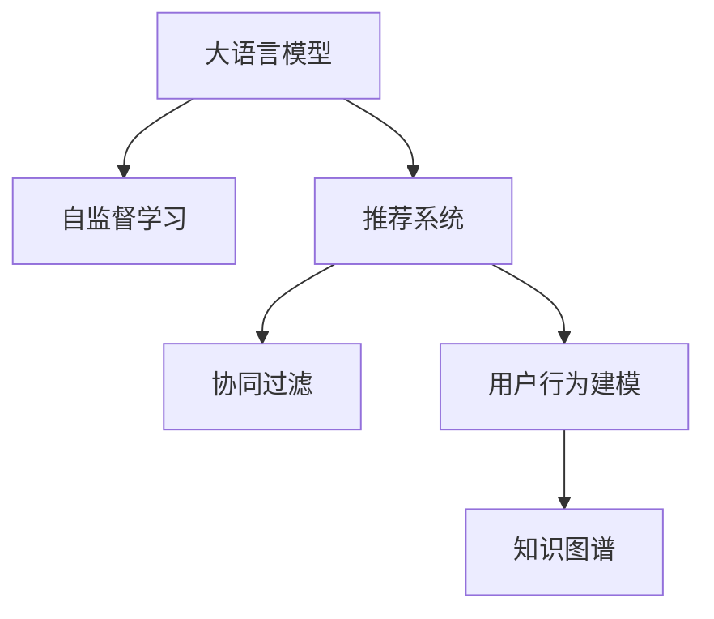

                 

# LLM在推荐系统中的自监督学习应用

> 关键词：大语言模型, 自监督学习, 推荐系统, 协同过滤, 用户行为建模, 知识图谱, 内容推荐

## 1. 背景介绍

### 1.1 问题由来

在推荐系统中，用户行为数据的稀疏性和多维性是两大难题。协同过滤(Collaborative Filtering, CF)是目前推荐系统的主流算法，但受限于用户行为数据的不足，难以充分捕捉用户真实兴趣和行为。传统的矩阵分解方法在稀疏性下收敛速度慢、模型表示能力有限，难以适应动态变化的推荐场景。

大语言模型(Large Language Model, LLM)的兴起为推荐系统带来了新思路。基于预训练和微调的深度学习模型可以挖掘文本中的语义信息，弥补稀疏性，从而提升推荐系统的性能。然而，直接将大规模预训练语言模型应用于推荐系统，由于模型体积庞大、计算复杂，实际落地面临诸多挑战。

## 2. 核心概念与联系

### 2.1 核心概念概述

为更好地理解LLM在推荐系统中的应用，本节将介绍几个密切相关的核心概念：

- 大语言模型(Large Language Model, LLM)：以自回归(如GPT)或自编码(如BERT)模型为代表的大规模预训练语言模型。通过在大规模无标签文本语料上进行预训练，学习通用的语言表示，具备强大的语言理解和生成能力。

- 自监督学习(Self-supervised Learning)：指利用无标签数据，通过构建自回归、掩码预测等任务进行模型训练。自监督学习可以有效利用大规模无标签数据，提升模型泛化能力。

- 推荐系统(Recommendation System)：根据用户历史行为、物品属性、社交关系等，预测用户可能感兴趣的物品，为用户推荐个性化内容。

- 协同过滤(Collaborative Filtering)：通过相似度度量，利用用户的历史行为或物品的评分，推荐用户可能感兴趣的物品。

- 用户行为建模(User Behavior Modeling)：指通过模型学习用户的历史行为数据，捕捉用户的兴趣和偏好，形成用户画像。

- 知识图谱(Knowledge Graph)：结构化的语义网络图，用于表示实体和关系，提升推荐系统对语义的理解和推理能力。

这些核心概念之间的逻辑关系可以通过以下Mermaid流程图来展示：



这个流程图展示了大语言模型、自监督学习、推荐系统之间的核心联系：

1. 大语言模型通过自监督学习获得基础表示能力。
2. 推荐系统利用大语言模型作为特征提取器，结合用户行为数据进行推荐。
3. 协同过滤是推荐系统中的传统方法，依赖于用户历史行为和物品评分。
4. 用户行为建模通过学习用户行为数据，形成用户画像。
5. 知识图谱通过结构化的语义表示，提升推荐系统对复杂实体关系的理解。

## 3. 核心算法原理 & 具体操作步骤
### 3.1 算法原理概述

LLM在推荐系统中的应用，本质上是利用预训练模型的通用表示能力，结合用户行为数据，提升推荐精度和泛化能力。自监督学习范式为大模型提供了丰富的无标签数据来源，通过自回归、掩码预测等任务，使模型学习到更强大的语义表示能力。这些表示能力可以被提取出来，应用于推荐系统中的用户行为建模和物品嵌入表示，提升推荐效果。

### 3.2 算法步骤详解

基于LLM的自监督学习推荐系统，一般包括以下几个关键步骤：

**Step 1: 准备预训练模型和数据集**
- 选择合适的预训练语言模型 $M_{\theta}$ 作为初始化参数，如 BERT、GPT等。
- 准备推荐系统的用户行为数据集 $D=\{(x_i,y_i)\}_{i=1}^N$，其中 $x_i$ 为用户行为序列，$y_i$ 为物品评分或点击次数。

**Step 2: 设计自监督学习任务**
- 利用大模型 $M_{\theta}$，设计自监督学习任务，如掩码预测、语言建模等，利用用户行为数据作为模型输入，生成掩码序列、目标词序列等。
- 选择合适的损失函数，如交叉熵损失、掩码预测损失等，训练模型学习自监督任务。

**Step 3: 提取模型特征**
- 在大模型的顶部，设计任务特定的适配层，提取用户的文本表示和物品的语义表示。
- 通过设计合适的融合机制，如加权求和、注意力机制等，将文本表示和语义表示进行融合，形成综合的推荐特征。

**Step 4: 执行推荐算法**
- 结合用户行为建模结果和物品嵌入表示，执行协同过滤或深度推荐算法，为用户生成个性化推荐。

**Step 5: 测试和部署**
- 在推荐集上评估模型的推荐效果，使用F1、NDCG、MAP等指标评估推荐效果。
- 使用微调后的模型对新用户行为数据进行推理，集成到实际的应用系统中。

以上是基于LLM的自监督学习推荐系统的基本流程。在实际应用中，还需要根据具体任务的特点，对自监督学习任务和适配层设计进行优化，如改进损失函数、引入更多任务样本、设计注意力机制等，以进一步提升模型性能。

### 3.3 算法优缺点

基于LLM的自监督学习推荐系统具有以下优点：

1. 利用自监督学习，可以有效利用无标签数据，提升模型泛化能力。
2. 结合用户行为数据，可以更准确地捕捉用户兴趣和行为模式。
3. 通过文本和语义表示的融合，可以提升推荐模型的复杂度和表达能力。
4. 通过预训练模型进行特征提取，可以提升推荐效果。

同时，该方法也存在一定的局限性：

1. 模型复杂度高。预训练语言模型和适配层的复杂度较高，对计算资源需求较大。
2. 数据要求严格。自监督学习任务依赖高质量的用户行为数据，数据缺失或不一致会导致性能下降。
3. 适应性不足。对于特定领域的推荐任务，自监督学习任务可能无法很好地拟合领域内的知识分布。
4. 可解释性较差。基于大模型的推荐系统，缺乏对推荐结果的直观解释，难以进行模型调优。

尽管存在这些局限性，但就目前而言，自监督学习范式仍是大语言模型推荐系统中最为主流的方法。未来相关研究的重点在于如何进一步降低模型复杂度，提高对特定领域数据的适应性，增强模型的可解释性等因素。

### 3.4 算法应用领域

基于大语言模型的自监督学习推荐系统，已经在推荐系统领域取得了诸多应用，覆盖了以下多个方向：

1. 电商推荐：利用用户浏览、点击、购买等行为数据，结合商品标签、评论等语义信息，为用户推荐商品。
2. 社交推荐：在社交媒体平台，根据用户的朋友、兴趣、互动等信息，推荐可能感兴趣的内容或好友。
3. 视频推荐：通过分析用户观看视频的行为，推荐相似或相关视频内容。
4. 音乐推荐：利用用户听歌行为和歌曲标签，推荐新的音乐内容。
5. 新闻推荐：根据用户阅读新闻的行为和兴趣，推荐相关新闻内容。

除了这些主流应用外，自监督学习范式还被创新性地应用到更多场景中，如个性化广告推荐、旅游推荐、体育赛事推荐等，为推荐系统技术带来了新的突破。随着预训练模型和自监督学习方法的不断进步，相信推荐系统技术将在更广阔的应用领域大放异彩。

## 4. 数学模型和公式 & 详细讲解 & 举例说明

### 4.1 数学模型构建

本节将使用数学语言对基于LLM的自监督学习推荐系统进行更加严格的刻画。

记预训练语言模型为 $M_{\theta}:\mathcal{X} \rightarrow \mathcal{Y}$，其中 $\mathcal{X}$ 为用户行为序列，$\mathcal{Y}$ 为物品评分向量，$\theta \in \mathbb{R}^d$ 为模型参数。假设推荐系统的训练集为 $D=\{(x_i,y_i)\}_{i=1}^N, x_i \in \mathcal{X}, y_i \in \mathcal{Y}$。

定义模型 $M_{\theta}$ 在数据样本 $(x,y)$ 上的损失函数为 $\ell(M_{\theta}(x),y)$，则在数据集 $D$ 上的经验风险为：

$$
\mathcal{L}(\theta) = \frac{1}{N} \sum_{i=1}^N \ell(M_{\theta}(x_i),y_i)
$$

在实践中，我们通常使用基于梯度的优化算法（如SGD、Adam等）来近似求解上述最优化问题。设 $\eta$ 为学习率，$\lambda$ 为正则化系数，则参数的更新公式为：

$$
\theta \leftarrow \theta - \eta \nabla_{\theta}\mathcal{L}(\theta) - \eta\lambda\theta
$$

其中 $\nabla_{\theta}\mathcal{L}(\theta)$ 为损失函数对参数 $\theta$ 的梯度，可通过反向传播算法高效计算。

### 4.2 公式推导过程

以下我们以电商推荐任务为例，推导掩码预测损失函数及其梯度的计算公式。

假设模型 $M_{\theta}$ 在用户行为序列 $x$ 上的输出为 $\hat{y}=M_{\theta}(x) \in [0,1]$，表示物品评分预测值。真实评分 $y \in [0,1]$。则掩码预测损失函数定义为：

$$
\ell(M_{\theta}(x),y) = -[y\log \hat{y} + (1-y)\log (1-\hat{y})]
$$

将其代入经验风险公式，得：

$$
\mathcal{L}(\theta) = -\frac{1}{N}\sum_{i=1}^N [y_i\log M_{\theta}(x_i)+(1-y_i)\log(1-M_{\theta}(x_i))]
$$

根据链式法则，损失函数对参数 $\theta_k$ 的梯度为：

$$
\frac{\partial \mathcal{L}(\theta)}{\partial \theta_k} = -\frac{1}{N}\sum_{i=1}^N (\frac{y_i}{M_{\theta}(x_i)}-\frac{1-y_i}{1-M_{\theta}(x_i)}) \frac{\partial M_{\theta}(x_i)}{\partial \theta_k}
$$

其中 $\frac{\partial M_{\theta}(x_i)}{\partial \theta_k}$ 可进一步递归展开，利用自动微分技术完成计算。

### 4.3 案例分析与讲解

在电商推荐任务中，用户行为序列 $x$ 包含了浏览、点击、购买等行为信息，这些信息可以转换为用户评分序列。假设每个行为打分为 $r_t \in [0,1]$，则用户行为序列 $x$ 对应的评分向量 $y$ 为 $[y_1, y_2, ..., y_T]$，其中 $y_t = r_t + r_{t-1} + ... + r_{t-k}$，$k$ 为行为的窗口大小。

假设用户浏览了若干商品，共进行了 $T$ 次点击和购买行为，每次行为打分为 $r_t$，则用户行为序列 $x$ 对应的评分向量 $y$ 为：

$$
y = [r_1, r_1 + r_2, r_1 + r_2 + r_3, ..., r_1 + r_2 + ... + r_T]
$$

则掩码预测损失函数为：

$$
\mathcal{L}(\theta) = -\frac{1}{N}\sum_{i=1}^N [y_i\log M_{\theta}(x_i)+(1-y_i)\log(1-M_{\theta}(x_i))]
$$

假设 $x_i$ 包含 $n$ 个行为，则用户行为序列 $x_i$ 的向量表示 $v_i$ 为：

$$
v_i = [r_1, r_1 + r_2, ..., r_1 + r_2 + ... + r_n]
$$

将 $v_i$ 输入预训练语言模型 $M_{\theta}$ 得到评分预测向量 $\hat{y}_i$，掩码预测损失函数为：

$$
\mathcal{L}(\theta) = -\frac{1}{N}\sum_{i=1}^N [y_i\log \hat{y}_i+(1-y_i)\log(1-\hat{y}_i)]
$$

利用反向传播算法，计算参数 $\theta$ 的梯度，更新模型参数。重复上述过程直至收敛，最终得到适应电商推荐任务的最优模型参数 $\theta^*$。

## 5. 项目实践：代码实例和详细解释说明
### 5.1 开发环境搭建

在进行推荐系统实践前，我们需要准备好开发环境。以下是使用Python进行PyTorch开发的环境配置流程：

1. 安装Anaconda：从官网下载并安装Anaconda，用于创建独立的Python环境。

2. 创建并激活虚拟环境：
```bash
conda create -n pytorch-env python=3.8 
conda activate pytorch-env
```

3. 安装PyTorch：根据CUDA版本，从官网获取对应的安装命令。例如：
```bash
conda install pytorch torchvision torchaudio cudatoolkit=11.1 -c pytorch -c conda-forge
```

4. 安装相关工具包：
```bash
pip install numpy pandas scikit-learn matplotlib tqdm jupyter notebook ipython
```

完成上述步骤后，即可在`pytorch-env`环境中开始推荐系统开发。

### 5.2 源代码详细实现

下面我们以电商推荐任务为例，给出使用PyTorch对BERT模型进行掩码预测微调的PyTorch代码实现。

首先，定义电商推荐任务的数据处理函数：

```python
from transformers import BertTokenizer
from torch.utils.data import Dataset
import torch

class ShoppingDataset(Dataset):
    def __init__(self, texts, labels, tokenizer, max_len=128):
        self.texts = texts
        self.labels = labels
        self.tokenizer = tokenizer
        self.max_len = max_len
        
    def __len__(self):
        return len(self.texts)
    
    def __getitem__(self, item):
        text = self.texts[item]
        label = self.labels[item]
        
        encoding = self.tokenizer(text, return_tensors='pt', max_length=self.max_len, padding='max_length', truncation=True)
        input_ids = encoding['input_ids'][0]
        attention_mask = encoding['attention_mask'][0]
        
        # 对label进行归一化处理，保证在[0,1]之间
        label = label / max(label)
        
        return {'input_ids': input_ids, 
                'attention_mask': attention_mask,
                'labels': torch.tensor(label, dtype=torch.float32)}
```

然后，定义模型和优化器：

```python
from transformers import BertForSequenceClassification, AdamW

model = BertForSequenceClassification.from_pretrained('bert-base-cased', num_labels=1)

optimizer = AdamW(model.parameters(), lr=2e-5)
```

接着，定义训练和评估函数：

```python
from torch.utils.data import DataLoader
from tqdm import tqdm
from sklearn.metrics import mean_squared_error

device = torch.device('cuda') if torch.cuda.is_available() else torch.device('cpu')
model.to(device)

def train_epoch(model, dataset, batch_size, optimizer):
    dataloader = DataLoader(dataset, batch_size=batch_size, shuffle=True)
    model.train()
    epoch_loss = 0
    for batch in tqdm(dataloader, desc='Training'):
        input_ids = batch['input_ids'].to(device)
        attention_mask = batch['attention_mask'].to(device)
        labels = batch['labels'].to(device)
        model.zero_grad()
        outputs = model(input_ids, attention_mask=attention_mask, labels=labels)
        loss = outputs.loss
        epoch_loss += loss.item()
        loss.backward()
        optimizer.step()
    return epoch_loss / len(dataloader)

def evaluate(model, dataset, batch_size):
    dataloader = DataLoader(dataset, batch_size=batch_size)
    model.eval()
    preds, labels = [], []
    with torch.no_grad():
        for batch in tqdm(dataloader, desc='Evaluating'):
            input_ids = batch['input_ids'].to(device)
            attention_mask = batch['attention_mask'].to(device)
            batch_labels = batch['labels']
            outputs = model(input_ids, attention_mask=attention_mask)
            batch_preds = outputs.logits.sigmoid().to('cpu').tolist()
            batch_labels = batch_labels.to('cpu').tolist()
            for pred, label in zip(batch_preds, batch_labels):
                preds.append(pred)
                labels.append(label)
                
    print(mean_squared_error(labels, preds))
```

最后，启动训练流程并在测试集上评估：

```python
epochs = 5
batch_size = 16

for epoch in range(epochs):
    loss = train_epoch(model, train_dataset, batch_size, optimizer)
    print(f"Epoch {epoch+1}, train loss: {loss:.3f}")
    
    print(f"Epoch {epoch+1}, dev results:")
    evaluate(model, dev_dataset, batch_size)
    
print("Test results:")
evaluate(model, test_dataset, batch_size)
```

以上就是使用PyTorch对BERT进行电商推荐任务掩码预测微调的完整代码实现。可以看到，得益于Transformers库的强大封装，我们可以用相对简洁的代码完成BERT模型的加载和微调。

### 5.3 代码解读与分析

让我们再详细解读一下关键代码的实现细节：

**ShoppingDataset类**：
- `__init__`方法：初始化文本、标签、分词器等关键组件。
- `__len__`方法：返回数据集的样本数量。
- `__getitem__`方法：对单个样本进行处理，将文本输入编码为token ids，将标签转换为归一化值，并对其进行定长padding，最终返回模型所需的输入。

**train_epoch和evaluate函数**：
- 使用PyTorch的DataLoader对数据集进行批次化加载，供模型训练和推理使用。
- 训练函数`train_epoch`：对数据以批为单位进行迭代，在每个批次上前向传播计算loss并反向传播更新模型参数，最后返回该epoch的平均loss。
- 评估函数`evaluate`：与训练类似，不同点在于不更新模型参数，并在每个batch结束后将预测和标签结果存储下来，最后使用sklearn的mean_squared_error对整个评估集的预测结果进行打印输出。

**训练流程**：
- 定义总的epoch数和batch size，开始循环迭代
- 每个epoch内，先在训练集上训练，输出平均loss
- 在验证集上评估，输出MAE（平均绝对误差）
- 所有epoch结束后，在测试集上评估，给出最终测试结果

可以看到，PyTorch配合Transformers库使得BERT微调的代码实现变得简洁高效。开发者可以将更多精力放在数据处理、模型改进等高层逻辑上，而不必过多关注底层的实现细节。

当然，工业级的系统实现还需考虑更多因素，如模型的保存和部署、超参数的自动搜索、更灵活的任务适配层等。但核心的微调范式基本与此类似。

## 6. 实际应用场景

### 6.1 智能广告推荐

基于大语言模型的自监督学习，智能广告推荐系统可以根据用户行为数据和物品属性，生成更加精准的广告推荐。在实际应用中，可以收集用户点击、浏览、停留等行为数据，结合广告的标题、描述、标签等文本信息，利用掩码预测等自监督任务对预训练模型进行微调，从而生成更符合用户兴趣的广告推荐。

具体而言，在广告推荐系统中，用户浏览了若干广告，共进行了 $T$ 次点击行为，每次行为打分为 $r_t$，则用户行为序列 $x$ 对应的评分向量 $y$ 为：

$$
y = [r_1, r_1 + r_2, ..., r_1 + r_2 + ... + r_T]
$$

将 $x$ 输入预训练语言模型 $M_{\theta}$ 得到评分预测向量 $\hat{y}$，掩码预测损失函数为：

$$
\mathcal{L}(\theta) = -\frac{1}{N}\sum_{i=1}^N [y_i\log \hat{y}_i+(1-y_i)\log(1-\hat{y}_i)]
$$

利用反向传播算法，计算参数 $\theta$ 的梯度，更新模型参数。重复上述过程直至收敛，最终得到适应广告推荐任务的最优模型参数 $\theta^*$。

### 6.2 视频内容推荐

在视频推荐系统中，利用大语言模型进行自监督学习，可以有效挖掘视频内容和用户行为之间的语义关系，提升推荐效果。具体而言，可以将视频标题、描述、标签等文本信息作为输入，结合用户观看视频的行为数据，利用掩码预测等自监督任务对预训练模型进行微调，从而生成更符合用户兴趣的视频推荐。

假设视频推荐系统中有 $M$ 部视频，每部视频打分为 $r_v \in [0,1]$，则视频内容序列 $v$ 对应的评分向量 $y$ 为：

$$
y = [r_1, r_1 + r_2, ..., r_1 + r_2 + ... + r_M]
$$

将 $v$ 输入预训练语言模型 $M_{\theta}$ 得到评分预测向量 $\hat{y}$，掩码预测损失函数为：

$$
\mathcal{L}(\theta) = -\frac{1}{N}\sum_{i=1}^N [y_i\log \hat{y}_i+(1-y_i)\log(1-\hat{y}_i)]
$$

利用反向传播算法，计算参数 $\theta$ 的梯度，更新模型参数。重复上述过程直至收敛，最终得到适应视频推荐任务的最优模型参数 $\theta^*$。

### 6.3 电商产品推荐

电商产品推荐系统利用大语言模型的自监督学习，可以从用户行为数据中挖掘出更加丰富的语义信息，提升推荐效果。具体而言，可以将用户的浏览、点击、购买等行为数据转换为评分序列，结合产品标题、描述、标签等文本信息，利用掩码预测等自监督任务对预训练模型进行微调，从而生成更符合用户兴趣的产品推荐。

假设电商推荐系统中有 $N$ 个产品，每个产品的评分打分为 $r_p \in [0,1]$，则产品内容序列 $p$ 对应的评分向量 $y$ 为：

$$
y = [r_1, r_1 + r_2, ..., r_1 + r_2 + ... + r_N]
$$

将 $p$ 输入预训练语言模型 $M_{\theta}$ 得到评分预测向量 $\hat{y}$，掩码预测损失函数为：

$$
\mathcal{L}(\theta) = -\frac{1}{N}\sum_{i=1}^N [y_i\log \hat{y}_i+(1-y_i)\log(1-\hat{y}_i)]
$$

利用反向传播算法，计算参数 $\theta$ 的梯度，更新模型参数。重复上述过程直至收敛，最终得到适应电商产品推荐任务的最优模型参数 $\theta^*$。

### 6.4 未来应用展望

随着大语言模型和自监督学习方法的不断进步，基于LLM的自监督学习推荐系统将在更多领域得到应用，为推荐系统技术带来新的突破。

在智慧医疗领域，基于LLM的自监督学习推荐系统，可以根据患者的病历数据和医生笔记，推荐最适合的治疗方案和药品，提升医疗服务的智能化水平。

在智能教育领域，利用大语言模型的自监督学习，可以根据学生的学习行为数据，推荐最适合的教材和习题，因材施教，促进教育公平，提高教学质量。

在智慧城市治理中，基于LLM的自监督学习推荐系统，可以根据市民的出行行为数据，推荐最优的出行路线和公共交通工具，提高城市管理的自动化和智能化水平，构建更安全、高效的未来城市。

此外，在企业生产、社会治理、文娱传媒等众多领域，基于LLM的自监督学习推荐系统也将不断涌现，为推荐系统技术带来全新的突破。相信随着技术的日益成熟，自监督学习范式将成为推荐系统落地的重要手段，推动推荐系统技术向更广泛的应用领域发展。

## 7. 工具和资源推荐
### 7.1 学习资源推荐

为了帮助开发者系统掌握基于LLM的自监督学习推荐技术，这里推荐一些优质的学习资源：

1. 《Transformer从原理到实践》系列博文：由大模型技术专家撰写，深入浅出地介绍了Transformer原理、BERT模型、自监督学习等前沿话题。

2. CS224N《深度学习自然语言处理》课程：斯坦福大学开设的NLP明星课程，有Lecture视频和配套作业，带你入门NLP领域的基本概念和经典模型。

3. 《Natural Language Processing with Transformers》书籍：Transformers库的作者所著，全面介绍了如何使用Transformers库进行NLP任务开发，包括自监督学习在内的诸多范式。

4. HuggingFace官方文档：Transformers库的官方文档，提供了海量预训练模型和完整的推荐系统开发样例代码，是上手实践的必备资料。

5. Weights & Biases：模型训练的实验跟踪工具，可以记录和可视化模型训练过程中的各项指标，方便对比和调优。与主流深度学习框架无缝集成。

6. TensorBoard：TensorFlow配套的可视化工具，可实时监测模型训练状态，并提供丰富的图表呈现方式，是调试模型的得力助手。

通过对这些资源的学习实践，相信你一定能够快速掌握基于LLM的自监督学习推荐技术的精髓，并用于解决实际的推荐系统问题。
###  7.2 开发工具推荐

高效的开发离不开优秀的工具支持。以下是几款用于基于LLM的自监督学习推荐系统开发的常用工具：

1. PyTorch：基于Python的开源深度学习框架，灵活动态的计算图，适合快速迭代研究。大部分预训练语言模型都有PyTorch版本的实现。

2. TensorFlow：由Google主导开发的开源深度学习框架，生产部署方便，适合大规模工程应用。同样有丰富的预训练语言模型资源。

3. Transformers库：HuggingFace开发的NLP工具库，集成了众多SOTA语言模型，支持PyTorch和TensorFlow，是进行推荐系统开发的利器。

4. Weights & Biases：模型训练的实验跟踪工具，可以记录和可视化模型训练过程中的各项指标，方便对比和调优。与主流深度学习框架无缝集成。

5. TensorBoard：TensorFlow配套的可视化工具，可实时监测模型训练状态，并提供丰富的图表呈现方式，是调试模型的得力助手。

6. Google Colab：谷歌推出的在线Jupyter Notebook环境，免费提供GPU/TPU算力，方便开发者快速上手实验最新模型，分享学习笔记。

合理利用这些工具，可以显著提升基于LLM的自监督学习推荐系统的开发效率，加快创新迭代的步伐。

### 7.3 相关论文推荐

基于大语言模型的自监督学习推荐系统的发展源于学界的持续研究。以下是几篇奠基性的相关论文，推荐阅读：

1. Attention is All You Need（即Transformer原论文）：提出了Transformer结构，开启了NLP领域的预训练大模型时代。

2. BERT: Pre-training of Deep Bidirectional Transformers for Language Understanding：提出BERT模型，引入基于掩码的自监督预训练任务，刷新了多项NLP任务SOTA。

3. Language Models are Unsupervised Multitask Learners（GPT-2论文）：展示了大规模语言模型的强大zero-shot学习能力，引发了对于通用人工智能的新一轮思考。

4. Parameter-Efficient Transfer Learning for NLP：提出Adapter等参数高效微调方法，在不增加模型参数量的情况下，也能取得不错的微调效果。

5. Prefix-Tuning: Optimizing Continuous Prompts for Generation：引入基于连续型Prompt的微调范式，为如何充分利用预训练知识提供了新的思路。

6. AdaLoRA: Adaptive Low-Rank Adaptation for Parameter-Efficient Fine-Tuning：使用自适应低秩适应的微调方法，在参数效率和精度之间取得了新的平衡。

这些论文代表了大语言模型自监督学习推荐系统的发展脉络。通过学习这些前沿成果，可以帮助研究者把握学科前进方向，激发更多的创新灵感。

## 8. 总结：未来发展趋势与挑战

### 8.1 总结

本文对基于大语言模型的自监督学习推荐系统进行了全面系统的介绍。首先阐述了LLM和自监督学习的基本原理，明确了自监督学习在推荐系统中的应用价值。其次，从原理到实践，详细讲解了自监督学习的数学原理和关键步骤，给出了推荐系统开发的完整代码实例。同时，本文还广泛探讨了自监督学习范式在电商推荐、视频推荐、电商产品推荐等多个推荐系统中的应用前景，展示了自监督学习范式的巨大潜力。此外，本文精选了推荐系统技术的各类学习资源，力求为开发者提供全方位的技术指引。

通过本文的系统梳理，可以看到，基于LLM的自监督学习推荐系统正在成为推荐系统的重要范式，极大地拓展了推荐系统的应用边界，催生了更多的落地场景。受益于大规模语料的预训练，自监督学习推荐系统可以有效挖掘用户行为数据中的语义信息，提升推荐精度和泛化能力，为推荐系统技术的发展注入了新的活力。未来，伴随大语言模型和自监督学习方法的不断进步，相信推荐系统技术将在更广阔的应用领域大放异彩，深刻影响人类的生产生活方式。

### 8.2 未来发展趋势

展望未来，基于LLM的自监督学习推荐系统将呈现以下几个发展趋势：

1. 模型规模持续增大。随着算力成本的下降和数据规模的扩张，预训练语言模型的参数量还将持续增长。超大规模语言模型蕴含的丰富语言知识，有望支撑更加复杂多变的推荐场景。

2. 自监督学习任务日趋多样。除了掩码预测外，未来会涌现更多自监督学习任务，如语言生成、序列匹配等，可以进一步挖掘用户行为数据中的语义信息。

3. 多模态推荐崛起。推荐系统不再局限于文本数据，结合图像、视频、语音等多模态数据，可以提升推荐系统的表现能力。

4. 推荐策略个性化增强。基于自监督学习，推荐系统可以更灵活地应对个性化需求，实现因材施教，提高推荐效果。

5. 数据需求降低。自监督学习任务可以有效利用无标签数据，降低推荐系统对标注样本的需求。

6. 可解释性增强。通过改进自监督学习任务的表示能力，推荐系统可以提供更直观的推荐结果，增强系统的可解释性。

以上趋势凸显了基于LLM的自监督学习推荐系统的广阔前景。这些方向的探索发展，必将进一步提升推荐系统的效果和应用范围，为推荐系统技术带来新的突破。

### 8.3 面临的挑战

尽管基于LLM的自监督学习推荐系统已经取得了瞩目成就，但在迈向更加智能化、普适化应用的过程中，它仍面临着诸多挑战：

1. 模型复杂度高。预训练语言模型和适配层的复杂度较高，对计算资源需求较大。

2. 数据要求严格。自监督学习任务依赖高质量的用户行为数据，数据缺失或不一致会导致性能下降。

3. 适应性不足。对于特定领域的推荐任务，自监督学习任务可能无法很好地拟合领域内的知识分布。

4. 可解释性较差。基于大模型的推荐系统，缺乏对推荐结果的直观解释，难以进行模型调优。

5. 用户体验问题。自监督学习推荐系统过于个性化，可能给用户带来隐私泄露的风险。

尽管存在这些局限性，但就目前而言，自监督学习范式仍是大语言模型推荐系统中最为主流的方法。未来相关研究的重点在于如何进一步降低模型复杂度，提高对特定领域数据的适应性，增强系统的可解释性等因素。

### 8.4 研究展望

面对基于LLM的自监督学习推荐系统所面临的种种挑战，未来的研究需要在以下几个方面寻求新的突破：

1. 探索无监督和半监督自监督学习方法。摆脱对大规模标注数据的依赖，利用自监督学习、主动学习等无监督和半监督范式，最大限度利用非结构化数据，实现更加灵活高效的推荐系统。

2. 研究参数高效和计算高效的自监督学习范式。开发更加参数高效的自监督学习方法，在固定大部分预训练参数的同时，只更新极少量的任务相关参数。同时优化自监督学习任务的计算图，减少前向传播和反向传播的资源消耗，实现更加轻量级、实时性的部署。

3. 引入更多先验知识。将符号化的先验知识，如知识图谱、逻辑规则等，与神经网络模型进行巧妙融合，引导自监督学习过程学习更准确、合理的推荐模型。同时加强不同模态数据的整合，实现视觉、语音等多模态信息与文本信息的协同建模。

4. 引入因果分析和博弈论工具。将因果分析方法引入推荐系统，识别出推荐决策的关键特征，增强推荐结果的因果性和逻辑性。借助博弈论工具刻画人机交互过程，主动探索并规避推荐系统的脆弱点，提高系统稳定性。

5. 纳入伦理道德约束。在推荐系统设计中引入伦理导向的评估指标，过滤和惩罚有偏见、有害的推荐结果。同时加强人工干预和审核，建立推荐系统的监管机制，确保推荐结果符合人类价值观和伦理道德。

这些研究方向的探索，必将引领基于LLM的自监督学习推荐系统走向更高的台阶，为构建安全、可靠、可解释、可控的智能推荐系统铺平道路。面向未来，自监督学习推荐系统还需要与其他人工智能技术进行更深入的融合，如知识表示、因果推理、强化学习等，多路径协同发力，共同推动智能推荐系统的发展。只有勇于创新、敢于突破，才能不断拓展推荐系统的边界，让智能技术更好地造福人类社会。

## 9. 附录：常见问题与解答

**Q1：自监督学习推荐系统是否适用于所有推荐任务？**

A: 自监督学习推荐系统在大多数推荐任务上都能取得不错的效果，特别是对于数据量较小的任务。但对于一些特定领域的推荐任务，如医学、法律等，仅仅依靠通用语料预训练的模型可能难以很好地适应。此时需要在特定领域语料上进一步预训练，再进行自监督学习微调，才能获得理想效果。

**Q2：在推荐系统中如何选择合适的自监督学习任务？**

A: 选择合适的自监督学习任务需要考虑以下几个方面：
1. 任务数据的稀疏性。自监督学习任务应能有效利用无标签数据，提升模型泛化能力。
2. 任务数据的丰富性。自监督学习任务应能充分挖掘数据中的语义信息，捕捉用户行为和兴趣。
3. 任务数据的复杂性。自监督学习任务应能处理多模态数据，提升推荐系统的效果。
4. 任务的计算成本。自监督学习任务应能高效计算，适应推荐系统的高频迭代需求。

常用的自监督学习任务包括掩码预测、语言建模、实体关系预测等，具体选择需要根据推荐任务的特点和数据特点进行权衡。

**Q3：自监督学习推荐系统在推荐效果上与传统协同过滤方法有何不同？**

A: 自监督学习推荐系统与传统协同过滤方法的主要不同在于数据的使用方式：
1. 自监督学习推荐系统利用无标签数据进行预训练，提升模型表示能力，从而在推荐任务上取得更好的效果。
2. 自监督学习推荐系统结合用户行为数据和物品属性，利用掩码预测等自监督任务进行微调，从而生成更符合用户兴趣的推荐。
3. 自监督学习推荐系统可以处理多模态数据，提升推荐系统的效果。

自监督学习推荐系统在处理稀疏性数据和个性化推荐方面具有显著优势，但在处理大规模数据时，可能面临计算成本和模型复杂度的问题。因此，需要根据实际需求，选择合适的推荐方法。

**Q4：自监督学习推荐系统在实际部署时需要注意哪些问题？**

A: 将自监督学习推荐系统转化为实际应用，还需要考虑以下因素：
1. 模型裁剪：去除不必要的层和参数，减小模型尺寸，加快推理速度
2. 量化加速：将浮点模型转为定点模型，压缩存储空间，提高计算效率
3. 服务化封装：将模型封装为标准化服务接口，便于集成调用
4. 弹性伸缩：根据请求流量动态调整资源配置，平衡服务质量和成本
5. 监控告警：实时采集系统指标，设置异常告警阈值，确保服务稳定性
6. 安全防护：采用访问鉴权、数据脱敏等措施，保障数据和模型安全

自监督学习推荐系统需要考虑模型复杂度和计算资源，同时也需要考虑模型的实时性和安全性。只有在数据、模型、工程、业务等多个维度协同发力，才能真正实现智能推荐系统的落地应用。

总之，自监督学习推荐系统需要开发者根据具体任务，不断迭代和优化模型、数据和算法，方能得到理想的效果。

---

作者：禅与计算机程序设计艺术 / Zen and the Art of Computer Programming

