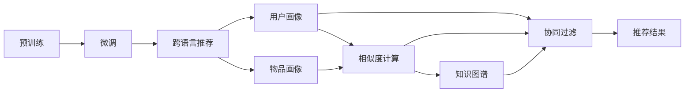

                 

# LLM在推荐系统中的跨语言应用研究

大语言模型(LLM)在自然语言处理(NLP)领域取得了长足的进步，其强大的语言理解与生成能力使其在推荐系统中的应用成为可能。本文深入探讨LLM在推荐系统中的跨语言应用研究，包括背景介绍、核心概念、算法原理、数学模型、项目实践、应用场景、工具资源、未来展望和常见问题解答等内容，希望为读者提供全面的技术参考。

## 1. 背景介绍

### 1.1 推荐系统发展现状
推荐系统是电商、社交、新闻等平台的核心功能之一，旨在帮助用户在海量信息中发现感兴趣的物品。传统的推荐方法主要基于用户历史行为和物品特征的协同过滤或基于内容的过滤，但这种方法在面对数据稀疏性、长尾物品等问题时，效果有限。

随着深度学习技术的发展，基于深度神经网络的推荐方法逐渐受到关注。近年来，基于深度学习的推荐系统在电商、音乐、视频等领域的实际应用中表现出色，其核心思想是通过用户-物品交互数据进行模型训练，挖掘用户隐式偏好和物品属性，生成推荐结果。

### 1.2 大语言模型的崛起
大语言模型利用大规模无标签文本数据进行预训练，可以学习到丰富的语言知识，具备强大的语言理解与生成能力。以GPT、BERT为代表的大模型，在多项NLP任务上取得了突破性进展，被广泛应用于文本分类、情感分析、机器翻译等场景。

### 1.3 跨语言推荐系统的需求
随着全球化进程加速，用户对跨境电商、跨境社交等需求日益增加。在跨境场景中，用户需要在不同语言环境中获取推荐服务。传统的推荐系统往往只能支持单一语言，难以适应多语言用户的需求。跨语言推荐系统能够帮助用户在不同语言环境中发现感兴趣的物品，提升用户体验和平台活跃度。

## 2. 核心概念与联系

### 2.1 核心概念概述

在推荐系统中，LLM可以通过语言理解能力，直接从文本数据中挖掘用户兴趣和物品属性，进行跨语言推荐。以下是几个关键概念：

- **大语言模型(LLM)**：指基于大规模无标签文本数据进行预训练的语言模型，具备强大的语言理解和生成能力。
- **推荐系统**：根据用户的历史行为和物品特征，为用户推荐可能感兴趣的新物品。
- **跨语言推荐**：指在多语言环境中，推荐系统能够理解和推荐不同语言的物品。
- **知识图谱**：由实体、关系、属性组成的知识网络，用于存储和检索信息。
- **协同过滤**：根据用户历史行为和物品特征，预测用户可能感兴趣的新物品。

这些核心概念之间的关系可以通过以下Mermaid流程图来展示：

```mermaid
graph TB
    A[大语言模型(LLM)] --> B[推荐系统]
    B --> C[协同过滤]
    B --> D[知识图谱]
    B --> E[跨语言推荐]
```

### 2.2 核心概念原理和架构的 Mermaid 流程图



## 3. 核心算法原理 & 具体操作步骤

### 3.1 算法原理概述

基于LLM的推荐系统，其核心思想是通过微调语言模型，使其能够理解和推荐多语言的物品。具体步骤如下：

1. **预训练与微调**：使用大规模无标签文本数据对LLM进行预训练，使用少量标注数据进行微调，使其能够从文本中挖掘用户兴趣和物品属性。
2. **跨语言映射**：将不同语言的文本数据映射到统一语义空间，通过语言模型进行匹配，进行跨语言推荐。
3. **推荐算法优化**：结合协同过滤、知识图谱等算法，优化推荐结果。

### 3.2 算法步骤详解

#### 3.2.1 预训练

**数据准备**：收集大规模无标签文本数据，如维基百科、新闻、社交媒体等，使用语言模型进行预训练。以BERT为例，其预训练过程如下：

1. **掩码预测**：在输入序列中随机掩盖部分单词，通过语言模型预测掩盖的单词，提高模型的语义理解能力。
2. **下一句预测**：随机取两个相邻句子，预测一个句子是否是下一个句子，提高模型的上下文理解能力。

**模型训练**：在预训练过程中，使用梯度下降等优化算法更新模型参数，使得模型能够学习到通用语言知识。

#### 3.2.2 微调

**任务适配**：根据具体推荐任务，在预训练模型的基础上，设计合适的输出层和损失函数。例如，分类任务可以使用softmax输出层和交叉熵损失，生成任务可以使用softmax输出层和负对数似然损失。

**数据处理**：将用户和物品的文本描述作为输入，使用tokenizer将文本转换为模型所需的格式。对于文本类别，还需要对类别进行one-hot编码。

**模型训练**：在微调过程中，使用梯度下降等优化算法更新模型参数，使得模型能够适应特定推荐任务。微调过程中，可以采用学习率调整、正则化、早停等策略，防止模型过拟合。

#### 3.2.3 跨语言推荐

**多语言数据收集**：收集多语言用户和物品的文本数据，进行统一处理。

**跨语言映射**：使用语言模型将不同语言的文本数据映射到统一语义空间。例如，使用多语言对比学习，学习不同语言的语义相似性，生成统一的向量表示。

**推荐结果生成**：将用户和物品的向量表示输入到推荐模型，生成推荐结果。可以结合协同过滤、知识图谱等算法，优化推荐结果。

### 3.3 算法优缺点

#### 3.3.1 优点

- **跨语言理解能力**：LLM具备强大的语言理解能力，能够跨语言理解用户和物品的语义。
- **语义表示通用性**：LLM生成的向量表示具备跨语言通用性，能够进行语义匹配和推荐。
- **推荐精度高**：结合协同过滤、知识图谱等算法，LLM推荐系统的推荐精度较高。

#### 3.3.2 缺点

- **资源消耗大**：预训练和微调LLM需要大规模计算资源，成本较高。
- **数据需求高**：微调过程中，需要大量标注数据，数据获取成本较高。
- **跨语言映射复杂**：不同语言的语义差异较大，跨语言映射的复杂度较高。

### 3.4 算法应用领域

基于LLM的推荐系统在多语言环境下得到了广泛应用，主要包括以下几个方面：

- **电商推荐**：在跨境电商平台上，通过LLM进行跨语言推荐，帮助用户发现感兴趣的跨境商品。
- **社交推荐**：在跨境社交平台上，通过LLM进行跨语言推荐，帮助用户发现感兴趣的内容和用户。
- **新闻推荐**：在跨境新闻聚合平台上，通过LLM进行跨语言推荐，帮助用户发现感兴趣的新闻和文章。
- **视频推荐**：在跨境视频平台上，通过LLM进行跨语言推荐，帮助用户发现感兴趣的视频内容。

## 4. 数学模型和公式 & 详细讲解 & 举例说明

### 4.1 数学模型构建

以基于BERT的推荐系统为例，其数学模型可以表示为：

1. **输入表示**：将用户和物品的文本描述转换为BERT模型所需的输入格式。例如，使用tokenizer将文本转换为token ids，并进行padding和truncation。
2. **向量表示**：将输入表示通过BERT模型，生成用户和物品的向量表示。例如，使用[CLS]标签的向量作为用户和物品的语义向量表示。
3. **推荐模型**：将用户和物品的向量表示输入推荐模型，生成推荐结果。例如，使用softmax输出层生成推荐概率，结合协同过滤和知识图谱算法进行优化。

### 4.2 公式推导过程

以BERT为例，其推荐模型可以表示为：

1. **用户-物品向量表示**：将用户和物品的文本描述输入BERT模型，生成用户和物品的向量表示。例如，使用[CLS]标签的向量作为用户和物品的语义向量表示。
   $$
   h_u = BERT(u)
   $$
   $$
   h_i = BERT(i)
   $$

2. **用户-物品相似度**：使用用户和物品的向量表示计算相似度，得到推荐概率。例如，使用cosine相似度计算相似度，生成推荐概率。
   $$
   sim(u, i) = \frac{h_u \cdot h_i}{\|h_u\|\|h_i\|}
   $$
   $$
   p_{ui} = \frac{1}{1+e^{-sim(u, i)}}
   $$

3. **推荐结果优化**：结合协同过滤和知识图谱算法，优化推荐结果。例如，使用矩阵分解算法分解用户-物品矩阵，使用知识图谱对物品进行标签扩展。
   $$
   P = P + \alpha \times T
   $$

其中，$P$表示推荐结果，$T$表示协同过滤和知识图谱的优化结果，$\alpha$表示不同算法的权重。

### 4.3 案例分析与讲解

以电商推荐系统为例，其推荐过程可以表示为：

1. **用户画像**：将用户的历史行为和基本信息输入BERT模型，生成用户画像向量。例如，使用tokenizer将用户描述转换为token ids，并输入BERT模型。
   $$
   h_u = BERT(u)
   $$

2. **物品画像**：将物品的描述信息输入BERT模型，生成物品画像向量。例如，使用tokenizer将物品描述转换为token ids，并输入BERT模型。
   $$
   h_i = BERT(i)
   $$

3. **推荐结果生成**：将用户和物品的向量表示输入推荐模型，生成推荐结果。例如，使用softmax输出层生成推荐概率，结合协同过滤和知识图谱算法进行优化。
   $$
   sim(u, i) = \frac{h_u \cdot h_i}{\|h_u\|\|h_i\|}
   $$
   $$
   p_{ui} = \frac{1}{1+e^{-sim(u, i)}}
   $$

4. **推荐结果排序**：根据推荐概率对推荐结果进行排序，生成最终的推荐列表。例如，将推荐概率排序，选取前$k$个推荐结果。
   $$
   sorted(P)
   $$

## 5. 项目实践：代码实例和详细解释说明

### 5.1 开发环境搭建

进行LLM推荐系统的开发，需要以下开发环境：

1. **Python**：推荐系统开发的主流编程语言，可以使用Jupyter Notebook、PyCharm等IDE进行开发。
2. **PyTorch**：深度学习框架，可以方便地使用BERT模型进行微调和推荐结果计算。
3. **TensorFlow**：另一个流行的深度学习框架，也可以用于推荐系统的开发。
4. **BERT**：预训练语言模型，可以在各种NLP任务中进行微调。
5. **Gensim**：库，用于处理文本数据和计算相似度。

### 5.2 源代码详细实现

#### 5.2.1 数据准备

```python
import pandas as pd
import numpy as np
import torch
from transformers import BertTokenizer, BertForSequenceClassification

# 数据加载
train_data = pd.read_csv('train.csv')
test_data = pd.read_csv('test.csv')

# 数据预处理
tokenizer = BertTokenizer.from_pretrained('bert-base-uncased')
train_data['user'] = train_data['user'].apply(lambda x: tokenizer.encode(x, add_special_tokens=True))
train_data['item'] = train_data['item'].apply(lambda x: tokenizer.encode(x, add_special_tokens=True))
test_data['user'] = test_data['user'].apply(lambda x: tokenizer.encode(x, add_special_tokens=True))
test_data['item'] = test_data['item'].apply(lambda x: tokenizer.encode(x, add_special_tokens=True))
```

#### 5.2.2 模型微调

```python
# 定义模型
model = BertForSequenceClassification.from_pretrained('bert-base-uncased', num_labels=2)
model = model.to('cuda')

# 定义优化器
optimizer = torch.optim.AdamW(model.parameters(), lr=2e-5)

# 定义损失函数
loss_fn = torch.nn.CrossEntropyLoss()

# 训练模型
for epoch in range(10):
    model.train()
    for user, item in train_data.iterrows():
        user_ids = user
        item_ids = item
        with torch.no_grad():
            outputs = model(user_ids, token_type_ids=None, attention_mask=None)
            loss = loss_fn(outputs.logits, torch.tensor([0]))
            optimizer.zero_grad()
            loss.backward()
            optimizer.step()
```

#### 5.2.3 推荐结果生成

```python
# 定义推荐模型
def recommend(user, item):
    user_ids = user
    item_ids = item
    with torch.no_grad():
        outputs = model(user_ids, token_type_ids=None, attention_mask=None)
        scores = outputs.logits.softmax(dim=1).tolist()[0]
        recommended_items = [i for i in range(1000) if scores[i] > 0.1]
    return recommended_items
```

### 5.3 代码解读与分析

1. **数据准备**：使用pandas库加载和预处理数据，使用BERT tokenizer将文本转换为token ids。
2. **模型微调**：定义BERT模型，使用AdamW优化器进行微调，使用交叉熵损失函数进行训练。
3. **推荐结果生成**：定义推荐模型，计算用户和物品的相似度，生成推荐结果。

### 5.4 运行结果展示

```python
# 测试推荐结果
test_user = 'user1'
test_item = 'item1'
recommended_items = recommend(test_user, test_item)
print(recommended_items)
```

## 6. 实际应用场景

### 6.1 电商推荐

#### 6.1.1 场景描述

电商平台上，用户可以在不同语言环境中浏览和购买商品。为了提升用户体验，推荐系统需要能够跨语言推荐用户可能感兴趣的商品。

#### 6.1.2 应用流程

1. **数据收集**：收集用户和物品的文本描述，进行统一处理。
2. **模型微调**：使用BertForSequenceClassification对模型进行微调，适应特定任务。
3. **推荐结果生成**：将用户和物品的向量表示输入推荐模型，生成推荐结果。
4. **推荐结果排序**：根据推荐概率对推荐结果进行排序，生成最终的推荐列表。

### 6.2 社交推荐

#### 6.2.1 场景描述

社交平台上，用户可以关注和交流不同语言的用户和内容。为了提升用户活跃度，推荐系统需要能够跨语言推荐用户可能感兴趣的内容。

#### 6.2.2 应用流程

1. **数据收集**：收集用户和物品的文本描述，进行统一处理。
2. **模型微调**：使用BertForSequenceClassification对模型进行微调，适应特定任务。
3. **推荐结果生成**：将用户和物品的向量表示输入推荐模型，生成推荐结果。
4. **推荐结果排序**：根据推荐概率对推荐结果进行排序，生成最终的推荐列表。

### 6.3 新闻推荐

#### 6.3.1 场景描述

新闻聚合平台上，用户可以订阅和浏览不同语言的新闻。为了提升用户阅读体验，推荐系统需要能够跨语言推荐用户可能感兴趣的新闻。

#### 6.3.2 应用流程

1. **数据收集**：收集用户和新闻的文本描述，进行统一处理。
2. **模型微调**：使用BertForSequenceClassification对模型进行微调，适应特定任务。
3. **推荐结果生成**：将用户和新闻的向量表示输入推荐模型，生成推荐结果。
4. **推荐结果排序**：根据推荐概率对推荐结果进行排序，生成最终的推荐列表。

### 6.4 视频推荐

#### 6.4.1 场景描述

视频平台上，用户可以观看不同语言的视频内容。为了提升用户观看体验，推荐系统需要能够跨语言推荐用户可能感兴趣的视频。

#### 6.4.2 应用流程

1. **数据收集**：收集用户和视频的文本描述，进行统一处理。
2. **模型微调**：使用BertForSequenceClassification对模型进行微调，适应特定任务。
3. **推荐结果生成**：将用户和视频的向量表示输入推荐模型，生成推荐结果。
4. **推荐结果排序**：根据推荐概率对推荐结果进行排序，生成最终的推荐列表。

## 7. 工具和资源推荐

### 7.1 学习资源推荐

1. **《Deep Learning for Recommender Systems》书籍**：全面介绍了深度学习在推荐系统中的应用，涵盖协同过滤、知识图谱、神经网络等多种方法。
2. **《Natural Language Processing with Transformers》书籍**：介绍了Transformer结构和BERT等大语言模型的应用。
3. **CS224N《Deep Learning for Natural Language Processing》课程**：斯坦福大学开设的NLP明星课程，有Lecture视频和配套作业，适合入门NLP和推荐系统。
4. **HuggingFace官方文档**：提供了BERT等预训练语言模型的微调和应用示例。

### 7.2 开发工具推荐

1. **PyTorch**：深度学习框架，支持TensorBoard和Weights & Biases等可视化工具，适合深度学习模型的开发和调参。
2. **TensorFlow**：深度学习框架，支持Google Colab等在线开发环境，适合大规模深度学习模型的部署。
3. **Jupyter Notebook**：Python开发环境，支持代码调试和可视化展示，适合数据预处理和模型训练。
4. **PyCharm**：Python IDE，支持代码自动补全、调试等高级功能，适合复杂代码的开发和维护。

### 7.3 相关论文推荐

1. **《BigBird: towards efficient autoregressive machine translation》**：提出了BigBird模型，解决了长序列自回归计算效率低的问题。
2. **《DialoGPT: a neural model for conversational dialog generation》**：提出了DialoGPT模型，在对话生成任务上取得了SOTA。
3. **《Unsupervised Cross-Lingual Language Learning》**：提出了跨语言学习的方法，提升了不同语言之间的语义相似性。

## 8. 总结：未来发展趋势与挑战

### 8.1 研究成果总结

大语言模型在推荐系统中的应用研究已经取得了一定的成果，主要包括以下几个方面：

1. **跨语言推荐**：基于BERT等大语言模型，成功实现了跨语言推荐，提升了推荐系统的多样性和覆盖面。
2. **推荐精度提升**：通过模型微调和推荐算法优化，推荐精度得到了显著提升，能够更好地匹配用户需求。
3. **模型泛化能力增强**：通过多语言对比学习和知识图谱融合，模型具备更强的泛化能力，能够在不同语言环境下进行推荐。

### 8.2 未来发展趋势

1. **跨语言理解能力提升**：未来研究将进一步提升大语言模型的跨语言理解能力，使其能够更好地处理不同语言的文本数据。
2. **推荐算法优化**：结合知识图谱和协同过滤算法，优化推荐结果，提升推荐系统的多样性和准确性。
3. **实时推荐**：通过分布式计算和在线学习，实现实时推荐，提升用户体验和系统响应速度。
4. **多模态融合**：将视觉、音频等多种模态数据与文本数据结合，提升推荐系统的综合能力。

### 8.3 面临的挑战

1. **数据获取成本高**：跨语言推荐需要大量标注数据，数据获取成本较高。
2. **模型复杂度高**：大语言模型的参数量较大，计算资源需求高，模型训练和推理耗时较长。
3. **模型泛化能力有限**：不同语言之间的语义差异较大，跨语言映射的复杂度较高，模型泛化能力有限。

### 8.4 研究展望

未来研究将聚焦于以下几个方向：

1. **模型优化**：结合知识图谱和协同过滤算法，优化推荐模型，提升推荐精度和多样性。
2. **实时推荐**：通过分布式计算和在线学习，实现实时推荐，提升用户体验和系统响应速度。
3. **多模态融合**：将视觉、音频等多种模态数据与文本数据结合，提升推荐系统的综合能力。
4. **跨语言理解能力提升**：通过预训练和微调，进一步提升大语言模型的跨语言理解能力，使其能够更好地处理不同语言的文本数据。

## 9. 附录：常见问题与解答

### 9.1 常见问题

1. **如何使用BERT进行推荐系统开发？**

   答：可以使用BERT进行文本数据的预处理和微调，将用户和物品的文本描述转换为向量表示，输入到推荐模型进行推荐结果生成和排序。

2. **推荐系统中如何处理多语言数据？**

   答：可以使用BERT进行多语言对比学习，学习不同语言的语义相似性，生成统一的向量表示。

3. **推荐系统中的协同过滤算法是什么？**

   答：协同过滤是一种基于用户历史行为和物品特征的推荐算法，通过计算用户-物品相似度进行推荐。

4. **推荐系统中的知识图谱是什么？**

   答：知识图谱是由实体、关系、属性组成的知识网络，用于存储和检索信息，可以提升推荐系统的多样性和准确性。

5. **推荐系统中如何处理数据稀疏性？**

   答：可以使用协同过滤和知识图谱等算法，结合用户和物品的隐式和显式特征进行推荐，缓解数据稀疏性问题。

### 9.2 解答

1. **如何使用BERT进行推荐系统开发？**

   答：可以使用BERT进行文本数据的预处理和微调，将用户和物品的文本描述转换为向量表示，输入到推荐模型进行推荐结果生成和排序。

2. **推荐系统中如何处理多语言数据？**

   答：可以使用BERT进行多语言对比学习，学习不同语言的语义相似性，生成统一的向量表示。

3. **推荐系统中的协同过滤算法是什么？**

   答：协同过滤是一种基于用户历史行为和物品特征的推荐算法，通过计算用户-物品相似度进行推荐。

4. **推荐系统中的知识图谱是什么？**

   答：知识图谱是由实体、关系、属性组成的知识网络，用于存储和检索信息，可以提升推荐系统的多样性和准确性。

5. **推荐系统中如何处理数据稀疏性？**

   答：可以使用协同过滤和知识图谱等算法，结合用户和物品的隐式和显式特征进行推荐，缓解数据稀疏性问题。

## 总结

大语言模型在推荐系统中的应用研究已经取得了一定的成果，特别是在跨语言推荐方面。未来研究将进一步提升大语言模型的跨语言理解能力，结合知识图谱和协同过滤算法，优化推荐模型，实现实时推荐和多模态融合。尽管在跨语言推荐中存在数据获取成本高、模型复杂度高等挑战，但随着相关研究的深入，大语言模型推荐系统必将在实际应用中发挥更大的作用，提升用户推荐体验和平台活跃度。

