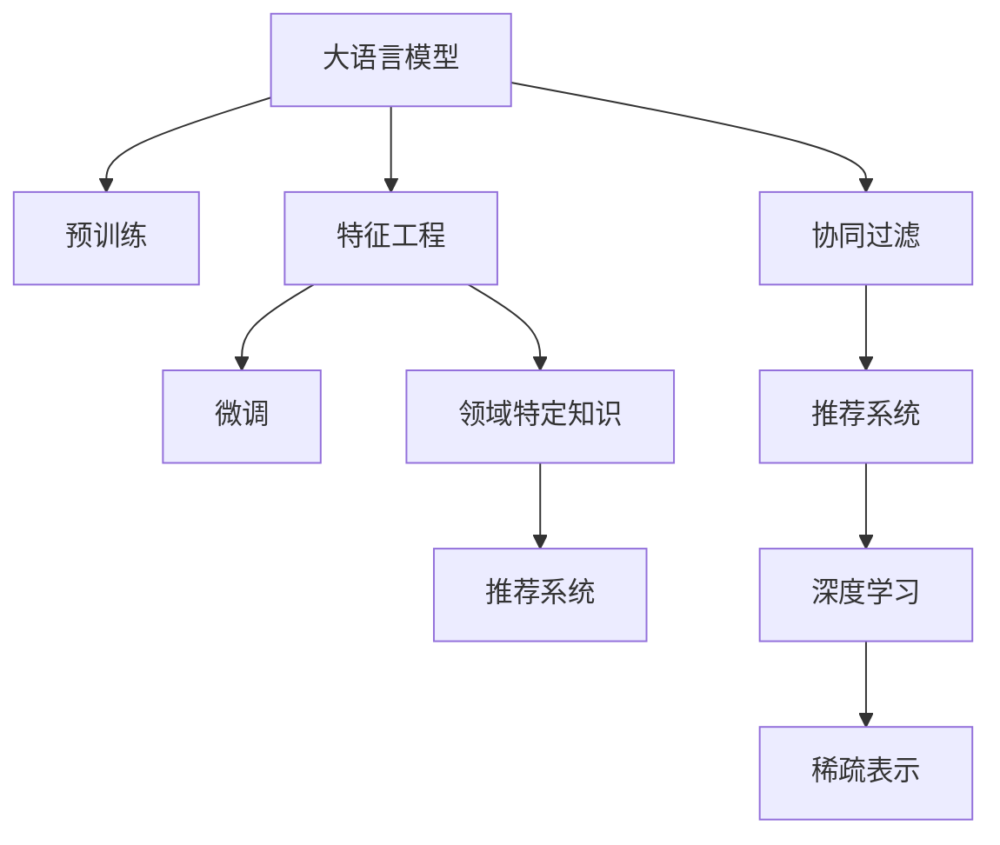

                 

## 1. 背景介绍

在信息爆炸的今天，个性化推荐系统已经成为互联网产品不可或缺的核心功能。从电商、视频、音乐、新闻等领域，到传统媒体、教育、旅游、医疗等行业，推荐系统正在以一种不可逆转的趋势影响着人们的生活。然而，推荐系统不仅仅是一个技术难题，更是一个复杂的工程问题。在推荐系统建设过程中，特征工程作为核心组成部分，其重要性和影响力不言而喻。在大数据、大模型、大算力驱动下，如何充分利用海量数据和大模型预训练的先验知识，构建更加精准、高效的特征工程，是推荐系统研究的重要方向。

近年来，大语言模型（Large Language Model, LLM）在自然语言处理领域取得了巨大的突破。以GPT-3、BERT、T5为代表的大语言模型，通过在大规模无标签文本数据上进行预训练，学习到了丰富的语言知识和常识，具备强大的语言理解和生成能力。这些模型在推荐系统特征工程中提供了新的思路和方法，从语义理解、情感分析、实体抽取等方面入手，极大地丰富了特征维度，提升了推荐系统的效果。

## 2. 核心概念与联系

### 2.1 核心概念概述

为更好地理解基于LLM的推荐系统特征工程方法，本节将介绍几个密切相关的核心概念：

- 大语言模型(Large Language Model, LLM)：以自回归(如GPT)或自编码(如BERT)模型为代表的大规模预训练语言模型。通过在大规模无标签文本语料上进行预训练，学习通用的语言表示，具备强大的语言理解和生成能力。

- 特征工程(Feature Engineering)：通过数据预处理、特征选择、特征构造等手段，构建更加适于机器学习模型的输入特征，提升模型预测性能的过程。

- 推荐系统(Recommender System)：基于用户兴趣、历史行为等特征，自动为用户推荐物品的系统。

- 预训练(Pre-training)：指在大规模无标签文本语料上，通过自监督学习任务训练通用语言模型的过程。常见的预训练任务包括言语建模、遮挡语言模型等。

- 微调(Fine-tuning)：指在预训练模型的基础上，使用下游任务的少量标注数据，通过有监督学习优化模型在特定任务上的性能。

- 稀疏表示(Sparse Representation)：利用向量空间中的稀疏性，表示复杂的特征信息，减少模型复杂度和存储成本。

- 深度学习(Deep Learning)：利用多层神经网络模型，学习复杂的非线性关系，实现对数据的高效建模。

- 协同过滤(Collaborative Filtering)：通过用户行为数据，预测用户对物品的评分或偏好，从而推荐物品。

- 领域特定知识(Domain-specific Knowledge)：特定领域内独有的知识和经验，如医学知识、法律规则等。

这些核心概念之间的逻辑关系可以通过以下Mermaid流程图来展示：



这个流程图展示了大语言模型的核心概念及其之间的关系：

1. 大语言模型通过预训练获得基础能力。
2. 特征工程利用大模型的语言理解和生成能力，提取和构造适合推荐系统的特征。
3. 微调用于在特定任务上进一步优化模型的性能。
4. 协同过滤是一种基于用户行为数据的推荐方法。
5. 深度学习用于构建更加复杂、准确的推荐模型。
6. 稀疏表示用于减少推荐系统的高维稀疏特征存储成本。
7. 领域特定知识在特定领域内对推荐系统提供指导。

这些概念共同构成了基于大语言模型的推荐系统特征工程框架，使得LLM在推荐系统中的应用成为可能。通过理解这些核心概念，我们可以更好地把握基于LLM的推荐系统的工作原理和优化方向。

## 3. 核心算法原理 & 具体操作步骤

### 3.1 算法原理概述

基于大语言模型的推荐系统特征工程方法，其核心思想是：利用大模型的语言理解和生成能力，从文本数据中提取和构造推荐系统所需的特征。这些特征可以包括用户行为、物品描述、领域特定知识等，综合利用深度学习、稀疏表示等技术，构建高质量的推荐模型。

形式化地，假设预训练语言模型为 $M_{\theta}$，其中 $\theta$ 为预训练得到的模型参数。给定推荐系统任务 $T$ 的训练集 $D=\{(x_i,y_i)\}_{i=1}^N, x_i \in \mathcal{X}, y_i \in \mathcal{Y}$，特征工程的目标是找到最优的特征集合 $\mathcal{F}$，使得推荐模型 $R$ 在特定任务上的性能最大化，即：

$$
\hat{\mathcal{F}}=\mathop{\arg\max}_{\mathcal{F}} \mathcal{P}(R(\mathcal{F}), D)
$$

其中 $\mathcal{P}$ 为推荐模型的性能指标，如准确率、召回率、F1分数等。

### 3.2 算法步骤详解

基于大语言模型的推荐系统特征工程一般包括以下几个关键步骤：

**Step 1: 准备预训练模型和数据集**
- 选择合适的预训练语言模型 $M_{\theta}$ 作为初始化参数，如 BERT、GPT 等。
- 准备推荐系统任务 $T$ 的训练集 $D$，划分为训练集、验证集和测试集。一般要求标注数据与预训练数据的分布不要差异过大。

**Step 2: 提取特征**
- 利用大模型对输入文本进行语义理解，提取出文本中的关键实体、情感、主题等信息。
- 对于文本数据，通常采用预训练语言模型对物品标题、描述等进行编码，提取出对应的向量表示。
- 对于结构化数据，可以提取特定的特征字段，作为模型的输入。

**Step 3: 构建推荐模型**
- 根据任务类型，选择合适的模型结构和优化器。如使用线性回归、神经网络等构建推荐模型。
- 结合特征工程得到的特征集合 $\mathcal{F}$，构建推荐模型 $R$。
- 使用训练集数据对推荐模型进行优化训练。

**Step 4: 评估和迭代优化**
- 在验证集上评估推荐模型的性能指标，如准确率、召回率等。
- 根据评估结果，进行特征选择、模型调参等迭代优化，直到模型在测试集上达到满意的性能。

### 3.3 算法优缺点

基于大语言模型的推荐系统特征工程方法具有以下优点：
1. 丰富特征维度。利用大模型的语言理解和生成能力，可以从文本数据中提取更多维度的特征信息，提升推荐系统的效果。
2. 鲁棒性强。大模型在处理文本数据时具有一定的鲁棒性，可以自动处理数据中的噪声和缺失值。
3. 低标注成本。利用大模型的预训练知识，可以在少量标注数据下进行微调，降低标注成本。
4. 适用范围广。适用于各种类型的推荐系统任务，如电商、视频、新闻等。

同时，该方法也存在一定的局限性：
1. 对文本数据依赖强。大模型特征工程方法依赖于文本数据的质量和数量，数据不足时可能无法提取有效特征。
2. 计算成本高。大模型的计算开销较大，需要在高性能计算资源下进行训练和推理。
3. 复杂度较高。大模型的输出维度较高，需要进一步进行降维和特征选择。

尽管存在这些局限性，但就目前而言，基于大语言模型的推荐系统特征工程方法仍是一种高效且有效的推荐系统特征获取手段。未来相关研究的重点在于如何进一步降低计算成本，提高特征工程的效率，同时兼顾模型的可解释性和鲁棒性等因素。

### 3.4 算法应用领域

基于大语言模型的推荐系统特征工程方法，已经在多个领域得到了广泛的应用，例如：

- 电商推荐：通过提取商品描述、用户评价等文本数据，利用大模型提取特征，构建商品推荐系统。
- 新闻推荐：分析新闻标题和内容，提取关键主题、情感等信息，构建新闻推荐系统。
- 视频推荐：利用视频标题、描述、标签等文本数据，提取特征，提升视频推荐系统的效果。
- 音乐推荐：从歌曲歌词、用户评论中提取情感、风格等信息，提升音乐推荐系统的个性化。
- 广告推荐：分析广告文案、用户历史行为，提取特征，提升广告推荐系统的效果。

除了上述这些经典应用外，大语言模型特征工程方法还在金融、教育、旅游等多个领域得到了应用，为这些行业的推荐系统提供了新的技术支持。

## 4. 数学模型和公式 & 详细讲解 & 举例说明

### 4.1 数学模型构建

本节将使用数学语言对基于LLM的推荐系统特征工程过程进行更加严格的刻画。

假设推荐系统任务 $T$ 的训练集为 $D=\{(x_i,y_i)\}_{i=1}^N, x_i \in \mathcal{X}, y_i \in \mathcal{Y}$。记预训练语言模型为 $M_{\theta}$，其中 $\theta$ 为模型参数。设推荐模型的损失函数为 $\ell(R(x_i),y_i)$，则在数据集 $D$ 上的经验风险为：

$$
\mathcal{L}(\theta) = \frac{1}{N}\sum_{i=1}^N \ell(R(x_i),y_i)
$$

推荐模型的性能指标 $\mathcal{P}(R(\mathcal{F}), D)$ 可以定义为：

$$
\mathcal{P}(R(\mathcal{F}), D) = \mathcal{P}(R(F(x_i)), D) = \mathcal{P}(R(F(x_i)), D)
$$

其中 $F$ 为特征工程函数，将输入数据 $x_i$ 转换为特征集合 $\mathcal{F}$。

### 4.2 公式推导过程

以下我们以电商推荐为例，推导基于LLM的特征工程过程。

假设用户行为数据为 $D=\{(x_i,y_i)\}_{i=1}^N, x_i \in \mathcal{X}, y_i \in \mathcal{Y}$，物品的描述数据为 $D_{item}=\{(d_j,y_j)\}_{j=1}^M, d_j \in \mathcal{D}, y_j \in \mathcal{Y}$。

设用户行为 $x_i$ 包含 $N_{user}$ 个历史行为，物品描述 $d_j$ 包含 $N_{item}$ 个物品的特征。

1. 特征提取

利用预训练语言模型 $M_{\theta}$，对用户行为 $x_i$ 和物品描述 $d_j$ 进行编码，得到对应的向量表示：

$$
h_i = M_{\theta}(x_i), w_j = M_{\theta}(d_j)
$$

2. 特征融合

将用户行为和物品描述的向量表示进行拼接，得到融合后的特征向量：

$$
h_i^{fused} = [h_i; w_j]
$$

3. 特征选择

对融合后的特征向量进行特征选择，得到最终的推荐特征集合 $\mathcal{F}$：

$$
\mathcal{F} = \{f_i\}_{i=1}^{N_{user}\times N_{item}}
$$

4. 推荐模型

使用线性回归模型或神经网络模型 $R$，对推荐特征集合进行建模：

$$
R(\mathcal{F}) = \sum_{i=1}^{N_{user}\times N_{item}} w_i f_i
$$

其中 $w_i$ 为模型参数，$f_i$ 为特征集合 $\mathcal{F}$ 中的特征。

5. 损失函数

根据用户行为和物品描述，构建推荐系统的损失函数：

$$
\ell(R(x_i),y_i) = \|R(\mathcal{F}) - y_i\|^2
$$

6. 优化目标

结合特征工程得到的推荐特征集合 $\mathcal{F}$，利用推荐模型的损失函数，最小化经验风险：

$$
\hat{\mathcal{F}}=\mathop{\arg\max}_{\mathcal{F}} \mathcal{P}(R(\mathcal{F}), D)
$$

### 4.3 案例分析与讲解

考虑电商推荐系统，用户行为数据 $D=\{(x_i,y_i)\}_{i=1}^N, x_i \in \mathcal{X}, y_i \in \mathcal{Y}$，物品的描述数据 $D_{item}=\{(d_j,y_j)\}_{j=1}^M, d_j \in \mathcal{D}, y_j \in \mathcal{Y}$。

利用预训练语言模型 $M_{\theta}$，对用户行为 $x_i$ 和物品描述 $d_j$ 进行编码，得到对应的向量表示：

$$
h_i = M_{\theta}(x_i), w_j = M_{\theta}(d_j)
$$

将用户行为和物品描述的向量表示进行拼接，得到融合后的特征向量：

$$
h_i^{fused} = [h_i; w_j]
$$

对融合后的特征向量进行特征选择，得到最终的推荐特征集合 $\mathcal{F}$：

$$
\mathcal{F} = \{f_i\}_{i=1}^{N_{user}\times N_{item}}
$$

使用线性回归模型或神经网络模型 $R$，对推荐特征集合进行建模：

$$
R(\mathcal{F}) = \sum_{i=1}^{N_{user}\times N_{item}} w_i f_i
$$

根据用户行为和物品描述，构建推荐系统的损失函数：

$$
\ell(R(x_i),y_i) = \|R(\mathcal{F}) - y_i\|^2
$$

结合特征工程得到的推荐特征集合 $\mathcal{F}$，利用推荐模型的损失函数，最小化经验风险：

$$
\hat{\mathcal{F}}=\mathop{\arg\max}_{\mathcal{F}} \mathcal{P}(R(\mathcal{F}), D)
$$

## 5. 项目实践：代码实例和详细解释说明

### 5.1 开发环境搭建

在进行基于LLM的推荐系统特征工程实践前，我们需要准备好开发环境。以下是使用Python进行PyTorch开发的环境配置流程：

1. 安装Anaconda：从官网下载并安装Anaconda，用于创建独立的Python环境。

2. 创建并激活虚拟环境：
```bash
conda create -n pytorch-env python=3.8 
conda activate pytorch-env
```

3. 安装PyTorch：根据CUDA版本，从官网获取对应的安装命令。例如：
```bash
conda install pytorch torchvision torchaudio cudatoolkit=11.1 -c pytorch -c conda-forge
```

4. 安装Transformers库：
```bash
pip install transformers
```

5. 安装各类工具包：
```bash
pip install numpy pandas scikit-learn matplotlib tqdm jupyter notebook ipython
```

完成上述步骤后，即可在`pytorch-env`环境中开始微调实践。

### 5.2 源代码详细实现

下面我们以电商推荐为例，给出使用Transformers库对BERT模型进行特征工程和微调的PyTorch代码实现。

首先，定义数据处理函数：

```python
from transformers import BertTokenizer
from torch.utils.data import Dataset
import torch

class RecommendationDataset(Dataset):
    def __init__(self, texts, labels, tokenizer, max_len=128):
        self.texts = texts
        self.labels = labels
        self.tokenizer = tokenizer
        self.max_len = max_len
        
    def __len__(self):
        return len(self.texts)
    
    def __getitem__(self, item):
        text = self.texts[item]
        label = self.labels[item]
        
        encoding = self.tokenizer(text, return_tensors='pt', max_length=self.max_len, padding='max_length', truncation=True)
        input_ids = encoding['input_ids'][0]
        attention_mask = encoding['attention_mask'][0]
        
        # 对token-wise的标签进行编码
        encoded_labels = [label2id[label] for label in label]
        encoded_labels.extend([label2id['']]*(self.max_len - len(encoded_labels)))
        labels = torch.tensor(encoded_labels, dtype=torch.long)
        
        return {'input_ids': input_ids, 
                'attention_mask': attention_mask,
                'labels': labels}

# 标签与id的映射
label2id = {'positive': 1, 'negative': 0}
id2label = {v: k for k, v in label2id.items()}

# 创建dataset
tokenizer = BertTokenizer.from_pretrained('bert-base-cased')

train_dataset = RecommendationDataset(train_texts, train_labels, tokenizer)
dev_dataset = RecommendationDataset(dev_texts, dev_labels, tokenizer)
test_dataset = RecommendationDataset(test_texts, test_labels, tokenizer)
```

然后，定义模型和优化器：

```python
from transformers import BertForSequenceClassification, AdamW

model = BertForSequenceClassification.from_pretrained('bert-base-cased', num_labels=2)

optimizer = AdamW(model.parameters(), lr=2e-5)
```

接着，定义训练和评估函数：

```python
from torch.utils.data import DataLoader
from tqdm import tqdm
from sklearn.metrics import classification_report

device = torch.device('cuda') if torch.cuda.is_available() else torch.device('cpu')
model.to(device)

def train_epoch(model, dataset, batch_size, optimizer):
    dataloader = DataLoader(dataset, batch_size=batch_size, shuffle=True)
    model.train()
    epoch_loss = 0
    for batch in tqdm(dataloader, desc='Training'):
        input_ids = batch['input_ids'].to(device)
        attention_mask = batch['attention_mask'].to(device)
        labels = batch['labels'].to(device)
        model.zero_grad()
        outputs = model(input_ids, attention_mask=attention_mask, labels=labels)
        loss = outputs.loss
        epoch_loss += loss.item()
        loss.backward()
        optimizer.step()
    return epoch_loss / len(dataloader)

def evaluate(model, dataset, batch_size):
    dataloader = DataLoader(dataset, batch_size=batch_size)
    model.eval()
    preds, labels = [], []
    with torch.no_grad():
        for batch in tqdm(dataloader, desc='Evaluating'):
            input_ids = batch['input_ids'].to(device)
            attention_mask = batch['attention_mask'].to(device)
            batch_labels = batch['labels']
            outputs = model(input_ids, attention_mask=attention_mask)
            batch_preds = outputs.logits.argmax(dim=2).to('cpu').tolist()
            batch_labels = batch_labels.to('cpu').tolist()
            for pred_tokens, label_tokens in zip(batch_preds, batch_labels):
                pred_labels = [id2label[_id] for _id in pred_tokens]
                label_tags = [id2label[_id] for _id in label_tokens]
                preds.append(pred_labels[:len(label_tags)])
                labels.append(label_tags)
                
    print(classification_report(labels, preds))
```

最后，启动训练流程并在测试集上评估：

```python
epochs = 5
batch_size = 16

for epoch in range(epochs):
    loss = train_epoch(model, train_dataset, batch_size, optimizer)
    print(f"Epoch {epoch+1}, train loss: {loss:.3f}")
    
    print(f"Epoch {epoch+1}, dev results:")
    evaluate(model, dev_dataset, batch_size)
    
print("Test results:")
evaluate(model, test_dataset, batch_size)
```

以上就是使用PyTorch对BERT进行电商推荐系统特征工程和微调的完整代码实现。可以看到，得益于Transformers库的强大封装，我们可以用相对简洁的代码完成BERT模型的加载和微调。

### 5.3 代码解读与分析

让我们再详细解读一下关键代码的实现细节：

**RecommendationDataset类**：
- `__init__`方法：初始化文本、标签、分词器等关键组件。
- `__len__`方法：返回数据集的样本数量。
- `__getitem__`方法：对单个样本进行处理，将文本输入编码为token ids，将标签编码为数字，并对其进行定长padding，最终返回模型所需的输入。

**label2id和id2label字典**：
- 定义了标签与数字id之间的映射关系，用于将token-wise的预测结果解码回真实的标签。

**训练和评估函数**：
- 使用PyTorch的DataLoader对数据集进行批次化加载，供模型训练和推理使用。
- 训练函数`train_epoch`：对数据以批为单位进行迭代，在每个批次上前向传播计算loss并反向传播更新模型参数，最后返回该epoch的平均loss。
- 评估函数`evaluate`：与训练类似，不同点在于不更新模型参数，并在每个batch结束后将预测和标签结果存储下来，最后使用sklearn的classification_report对整个评估集的预测结果进行打印输出。

**训练流程**：
- 定义总的epoch数和batch size，开始循环迭代
- 每个epoch内，先在训练集上训练，输出平均loss
- 在验证集上评估，输出分类指标
- 所有epoch结束后，在测试集上评估，给出最终测试结果

可以看到，PyTorch配合Transformers库使得BERT微调的代码实现变得简洁高效。开发者可以将更多精力放在数据处理、模型改进等高层逻辑上，而不必过多关注底层的实现细节。

当然，工业级的系统实现还需考虑更多因素，如模型的保存和部署、超参数的自动搜索、更灵活的任务适配层等。但核心的微调范式基本与此类似。

## 6. 实际应用场景

### 6.1 电商推荐

基于大语言模型的推荐系统特征工程，可以应用于电商推荐系统的构建。传统推荐系统往往只依赖用户的历史行为数据进行物品推荐，难以刻画用户兴趣的多样性和动态变化。通过利用大语言模型的语言理解和生成能力，从用户评论、商品描述等文本数据中提取和构造更多维度的特征，可以在更广泛的数据源上提升推荐系统的精准度。

在技术实现上，可以收集用户浏览、点击、评论、分享等行为数据，提取和用户交互的物品标题、描述、标签等文本内容。将文本内容作为模型输入，用户的后续行为（如是否点击、购买等）作为监督信号，在此基础上微调预训练语言模型。微调后的模型能够从文本内容中准确把握用户的兴趣点。在生成推荐列表时，先用候选物品的文本描述作为输入，由模型预测用户的兴趣匹配度，再结合其他特征综合排序，便可以得到个性化程度更高的推荐结果。

### 6.2 新闻推荐

新闻推荐系统要求对海量的新闻数据进行实时处理和推荐。传统推荐系统通常依赖于新闻内容的词频统计、主题分类等低维特征，难以刻画新闻内容的深度语义信息。通过利用大语言模型的语义理解能力，可以从新闻标题和内容中提取关键实体、情感、主题等信息，构建更加精准的推荐模型。

在技术实现上，可以收集新闻标题和内容数据，利用BERT等预训练语言模型进行编码，提取出关键实体、情感、主题等信息。将提取出的特征作为推荐模型的输入，结合其他特征（如新闻发布时间、作者、类别等）进行综合排序，即可得到更加精准的新闻推荐结果。

### 6.3 视频推荐

视频推荐系统要求对海量的视频数据进行实时处理和推荐。传统推荐系统通常依赖于视频标题、标签等低维特征，难以刻画视频的语义信息和上下文关系。通过利用大语言模型的语义理解能力，可以从视频标题、描述中提取关键实体、情感、主题等信息，构建更加精准的推荐模型。

在技术实现上，可以收集视频标题、描述、标签等数据，利用BERT等预训练语言模型进行编码，提取出关键实体、情感、主题等信息。将提取出的特征作为推荐模型的输入，结合其他特征（如视频时长、上传时间、观看次数等）进行综合排序，即可得到更加精准的视频推荐结果。

### 6.4 金融推荐

金融推荐系统要求对海量的金融数据进行实时处理和推荐。传统推荐系统通常依赖于金融产品的基本属性、交易数据等低维特征，难以刻画金融产品的深度语义信息和风险特征。通过利用大语言模型的语义理解能力，可以从金融产品的标题、描述中提取关键实体、情感、主题等信息，构建更加精准的推荐模型。

在技术实现上，可以收集金融产品的标题、描述、交易数据等数据，利用BERT等预训练语言模型进行编码，提取出关键实体、情感、主题等信息。将提取出的特征作为推荐模型的输入，结合其他特征（如产品评级、风险等级、交易量等）进行综合排序，即可得到更加精准的金融推荐结果。

## 7. 工具和资源推荐
### 7.1 学习资源推荐

为了帮助开发者系统掌握大语言模型在推荐系统特征工程中的应用，这里推荐一些优质的学习资源：

1. 《Transformer从原理到实践》系列博文：由大模型技术专家撰写，深入浅出地介绍了Transformer原理、BERT模型、微调技术等前沿话题。

2. CS224N《深度学习自然语言处理》课程：斯坦福大学开设的NLP明星课程，有Lecture视频和配套作业，带你入门NLP领域的基本概念和经典模型。

3. 《Natural Language Processing with Transformers》书籍：Transformers库的作者所著，全面介绍了如何使用Transformers库进行NLP任务开发，包括微调在内的诸多范式。

4. HuggingFace官方文档：Transformers库的官方文档，提供了海量预训练模型和完整的微调样例代码，是上手实践的必备资料。

5. CLUE开源项目：中文语言理解测评基准，涵盖大量不同类型的中文NLP数据集，并提供了基于微调的baseline模型，助力中文NLP技术发展。

通过对这些资源的学习实践，相信你一定能够快速掌握大语言模型在推荐系统特征工程中的应用精髓，并用于解决实际的推荐系统问题。
###  7.2 开发工具推荐

高效的开发离不开优秀的工具支持。以下是几款用于大语言模型推荐系统特征工程开发的常用工具：

1. PyTorch：基于Python的开源深度学习框架，灵活动态的计算图，适合快速迭代研究。大部分预训练语言模型都有PyTorch版本的实现。

2. TensorFlow：由Google主导开发的开源深度学习框架，生产部署方便，适合大规模工程应用。同样有丰富的预训练语言模型资源。

3. Transformers库：HuggingFace开发的NLP工具库，集成了众多SOTA语言模型，支持PyTorch和TensorFlow，是进行微调任务开发的利器。

4. Weights & Biases：模型训练的实验跟踪工具，可以记录和可视化模型训练过程中的各项指标，方便对比和调优。与主流深度学习框架无缝集成。

5. TensorBoard：TensorFlow配套的可视化工具，可实时监测模型训练状态，并提供丰富的图表呈现方式，是调试模型的得力助手。

6. Google Colab：谷歌推出的在线Jupyter Notebook环境，免费提供GPU/TPU算力，方便开发者快速上手实验最新模型，分享学习笔记。

合理利用这些工具，可以显著提升大语言模型推荐系统特征工程任务的开发效率，加快创新迭代的步伐。

### 7.3 相关论文推荐

大语言模型和推荐系统特征工程的发展源于学界的持续研究。以下是几篇奠基性的相关论文，推荐阅读：

1. Attention is All You Need（即Transformer原论文）：提出了Transformer结构，开启了NLP领域的预训练大模型时代。

2. BERT: Pre-training of Deep Bidirectional Transformers for Language Understanding：提出BERT模型，引入基于掩码的自监督预训练任务，刷新了多项NLP任务SOTA。

3. Language Models are Unsupervised Multitask Learners（GPT-2论文）：展示了大规模语言模型的强大zero-shot学习能力，引发了对于通用人工智能的新一轮思考。

4. Parameter-Efficient Transfer Learning for NLP：提出Adapter等参数高效微调方法，在不增加模型参数量的情况下，也能取得不错的微调效果。

5. Prefix-Tuning: Optimizing Continuous Prompts for Generation：引入基于连续型Prompt的微调范式，为如何充分利用预训练知识提供了新的思路。

6. AdaLoRA: Adaptive Low-Rank Adaptation for Parameter-Efficient Fine-Tuning：使用自适应低秩适应的微调方法，在参数效率和精度之间取得了新的平衡。

这些论文代表了大语言模型和推荐系统特征工程的发展脉络。通过学习这些前沿成果，可以帮助研究者把握学科前进方向，激发更多的创新灵感。

## 8. 总结：未来发展趋势与挑战

### 8.1 总结

本文对基于大语言模型的推荐系统特征工程方法进行了全面系统的介绍。首先阐述了基于大语言模型的推荐系统特征工程方法的研究背景和意义，明确了其在大规模数据和预训练知识驱动下的独特优势。其次，从原理到实践，详细讲解了推荐系统特征工程的核心步骤和关键算法，给出了推荐系统特征工程任务的完整代码实例。同时，本文还广泛探讨了基于LLM的推荐系统在电商、新闻、视频、金融等多个领域的应用前景，展示了LLM在推荐系统特征工程中的巨大潜力。此外，本文精选了推荐系统特征工程的各类学习资源，力求为读者提供全方位的技术指引。

通过本文的系统梳理，可以看到，基于大语言模型的推荐系统特征工程方法正在成为推荐系统研究的重要方向，极大地拓展了推荐系统的特征空间和性能边界，为推荐系统提供更加精准、高效的用户画像和物品特征。未来，伴随大语言模型和推荐系统特征工程的进一步演进，相信推荐系统将能够更好地刻画用户兴趣和物品属性，提升推荐系统的质量和效果，为个性化推荐技术的发展注入新的活力。

### 8.2 未来发展趋势

展望未来，基于大语言模型的推荐系统特征工程方法将呈现以下几个发展趋势：

1. 多模态融合：将文本、图像、音频等多模态数据进行联合表示，提升推荐系统的多模态学习能力。

2. 因果学习：引入因果推理和因果推断，提升推荐系统的解释性和决策透明度。

3. 领域知识融合：将领域特定知识与预训练知识进行融合，提升推荐系统的领域适应性和精准度。

4. 分布式协同：利用分布式计算和大规模数据存储，提升推荐系统的训练和推理效率。

5. 个性化推荐：结合用户行为数据和文本数据，构建更加个性化、动态化的推荐模型。

6. 实时推荐：利用在线学习和大数据流式处理技术，实现实时推荐和动态优化。

以上趋势凸显了基于大语言模型的推荐系统特征工程技术的广阔前景。这些方向的探索发展，必将进一步提升推荐系统的性能和应用范围，为个性化推荐技术的发展注入新的动力。

### 8.3 面临的挑战

尽管基于大语言模型的推荐系统特征工程方法已经取得了一定的进展，但在迈向更加智能化、普适化应用的过程中，它仍面临着诸多挑战：

1. 数据质量问题：大语言模型的输出依赖于输入数据的质量，低质量数据可能导致输出结果不准确。

2. 计算资源消耗：大语言模型的计算开销较大，需要在高性能计算资源下进行训练和推理。

3. 特征工程复杂度：利用大语言模型提取特征时，需要综合考虑多个维度和多种模型，增加了特征工程的复杂度。

4. 模型可解释性：大语言模型作为黑盒模型，难以解释其内部工作机制和决策逻辑。

5. 隐私和安全问题：利用用户数据进行训练和推荐时，需要保证数据隐私和安全，避免数据泄露和滥用。

6. 算力成本：大语言模型的训练和推理需要大量的计算资源，算力成本较高。

尽管存在这些挑战，但随着学界和产业界的共同努力，这些挑战终将逐步得到解决，大语言模型在推荐系统特征工程中的应用必将在未来更加广泛和深入。

### 8.4 研究展望

未来，大语言模型在推荐系统特征工程中的应用研究需要关注以下几个方向：

1. 参数高效微调：开发更加参数高效的微调方法，在固定大部分预训练参数的同时，只更新极少量的任务相关参数。

2. 稀疏表示优化：研究稀疏表示方法，减少高维特征的存储成本，提升特征工程的效率。

3. 数据增强技术：利用数据增强技术，提升推荐系统的鲁棒性和泛化能力。

4. 领域知识结合：将领域特定知识与预训练知识进行融合，提升推荐系统的领域适应性和精准度。

5. 模型解释性：研究模型解释性技术，提高推荐系统的透明度和可信度。

6. 实时推荐系统：构建实时推荐系统，实现动态优化和实时推荐。

这些研究方向将推动基于大语言模型的推荐系统特征工程技术不断进步，为推荐系统的精准化、个性化、实时化提供新的方法和工具。相信随着技术的不断进步，基于大语言模型的推荐系统特征工程方法将在未来的推荐系统建设中扮演越来越重要的角色，推动推荐系统技术的发展和应用。

## 9. 附录：常见问题与解答

**Q1：如何选择合适的预训练语言模型？**

A: 选择合适的预训练语言模型需要考虑多个因素，如模型规模、参数数量、训练数据等。通常，规模越大、参数数量越多的模型，性能越强，但也需要更高的计算资源。对于推荐系统任务，可以选择预训练在类似任务上的BERT、GPT等模型，以获得更好的效果。

**Q2：大语言模型在推荐系统特征工程中的应用有哪些优点？**

A: 大语言模型在推荐系统特征工程中具有以下优点：
1. 提取高维特征：利用大模型的语言理解和生成能力，可以从文本数据中提取更多维度的特征，提升推荐系统的效果。
2. 处理复杂语义：大模型具备强大的语义理解能力，能够处理复杂的语义信息，提升推荐系统的精准度。
3. 适应多种任务：大模型适用于各种类型的推荐系统任务，如电商、新闻、视频等。
4. 鲁棒性强：大模型在处理文本数据时具有一定的鲁棒性，可以自动处理数据中的噪声和缺失值。
5. 低标注成本：利用大模型的预训练知识，可以在少量标注数据下进行微调，降低标注成本。

**Q3：大语言模型在推荐系统特征工程中需要注意哪些问题？**

A: 大语言模型在推荐系统特征工程中需要注意以下几个问题：
1. 数据质量问题：大语言模型的输出依赖于输入数据的质量，低质量数据可能导致输出结果不准确。
2. 计算资源消耗：大语言模型的计算开销较大，需要在高性能计算资源下进行训练和推理。
3. 特征工程复杂度：利用大语言模型提取特征时，需要综合考虑多个维度和多种模型，增加了特征工程的复杂度。
4. 模型可解释性：大语言模型作为黑盒模型，难以解释其内部工作机制和决策逻辑。
5. 隐私和安全问题：利用用户数据进行训练和推荐时，需要保证数据隐私和安全，避免数据泄露和滥用。
6. 算力成本：大语言模型的训练和推理需要大量的计算资源，算力成本较高。

**Q4：如何利用大语言模型进行推荐系统特征工程？**

A: 利用大语言模型进行推荐系统特征工程，主要包括以下步骤：
1. 数据准备：收集和预处理推荐系统所需的数据，包括用户行为、物品描述等。
2. 特征提取：利用大语言模型对输入文本进行语义理解，提取出文本中的关键实体、情感、主题等信息。
3. 特征融合：将用户行为和物品描述的向量表示进行拼接，得到融合后的特征向量。
4. 特征选择：对融合后的特征向量进行特征选择，得到最终的推荐特征集合。
5. 模型构建：使用线性回归、神经网络等模型，对推荐特征集合进行建模。
6. 模型优化：利用推荐系统的损失函数，最小化经验风险，优化模型参数。
7. 模型评估：在验证集上评估推荐模型的性能指标，进行特征选择和模型调参。
8. 模型部署：将优化后的模型部署到推荐系统系统中，进行实时推荐和动态优化。

通过以上步骤，可以构建基于大语言模型的推荐系统特征工程系统，实现高效、精准的推荐服务。

**Q5：基于大语言模型的推荐系统特征工程与传统推荐系统有哪些不同？**

A: 基于大语言模型的推荐系统特征工程与传统推荐系统有以下不同：
1. 特征维度：传统推荐系统通常依赖于用户历史行为、物品属性等低维特征，而基于大语言模型的推荐系统可以从文本数据中提取更多高维特征。
2. 语义理解：传统推荐系统难以刻画物品和用户的复杂语义信息，而基于大语言模型的推荐系统可以利用语言模型的语义理解能力，提升推荐系统的精准度。
3. 多模态融合：传统推荐系统通常只利用单一类型的数据进行推荐，而基于大语言模型的推荐系统可以融合多种类型的数据，提升推荐系统的多模态学习能力。
4. 实时性：传统推荐系统难以实现实时推荐和动态优化，而基于大语言模型的推荐系统可以利用在线学习和大数据流式处理技术，实现实时推荐。
5. 鲁棒性：传统推荐系统通常对噪声和缺失值敏感，而基于大语言模型的推荐系统具有一定的鲁棒性，可以自动处理数据中的噪声和缺失值。

总之，基于大语言模型的推荐系统特征工程在特征维度、语义理解、多模态融合等方面具有显著优势，能够提升推荐系统的精准度和效果。

**Q6：如何构建基于大语言模型的推荐系统特征工程系统？**

A: 构建基于大语言模型的推荐系统特征工程系统，需要以下几个关键步骤：
1. 数据准备：收集和预处理推荐系统所需的数据，包括用户行为、物品描述等。
2. 特征提取：利用大语言模型对输入文本进行语义理解，提取出文本中的关键实体、情感、主题等信息。
3. 特征融合：将用户行为和物品描述的向量表示进行拼接，得到融合后的特征向量。
4. 特征选择：对融合后的特征向量进行特征选择，得到最终的推荐特征集合。
5. 模型构建：使用线性回归、神经网络等模型，对推荐特征集合进行建模。
6. 模型优化：利用推荐系统的损失函数，最小化经验风险，优化模型参数。
7. 模型评估：在验证集上评估推荐模型的性能指标，进行特征选择和模型调参。
8. 模型部署：将优化后的模型部署到推荐系统系统中，进行实时推荐和动态优化。

通过以上步骤，可以构建基于大语言模型的推荐系统特征工程系统，实现高效、精准的推荐服务。

---

作者：禅与计算机程序设计艺术 / Zen and the Art of Computer Programming

