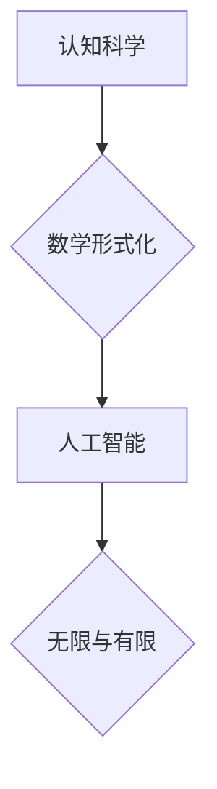

> 数学形式化、认知科学、人工智能、无限、有限、算法、模型、应用

## 1. 背景介绍

认知科学作为一门跨学科研究人类认知的科学，试图揭示人类思维、学习、记忆、语言等复杂行为背后的机制。而数学，作为一种精确的逻辑语言，为认知科学提供了强大的工具和框架。

近年来，随着人工智能技术的飞速发展，人们对认知科学的理解和探索更加深入。人工智能的研究旨在构建能够模拟人类认知能力的智能系统，而数学形式化在这一过程中扮演着至关重要的角色。

## 2. 核心概念与联系

**2.1 数学形式化**

数学形式化是指用数学语言和符号来描述和表达概念、关系和规则。它将抽象的思想转化为精确的符号表示，从而使得认知过程能够被量化、分析和计算。

**2.2 认知科学**

认知科学试图理解人类思维、学习、记忆、语言等复杂行为背后的机制。它融合了心理学、神经科学、计算机科学、语言学等多学科的知识和方法。

**2.3 人工智能**

人工智能是指模拟和扩展人类智能的计算机系统。它包括机器学习、深度学习、自然语言处理、计算机视觉等多个领域。

**2.4 无限与有限**

无限和有限是数学中两个基本的概念。无限是指没有边界或终点的概念，而有限是指有明确边界或终点的概念。

**2.5 核心概念联系**

数学形式化为认知科学和人工智能提供了强大的工具和框架。通过将认知过程数学化，我们可以更深入地理解人类思维的机制，并构建能够模拟人类认知能力的智能系统。

**Mermaid 流程图**



## 3. 核心算法原理 & 具体操作步骤

**3.1 算法原理概述**

在认知科学和人工智能领域，许多算法都基于数学形式化的原理。例如，神经网络算法就是通过模拟大脑神经元的连接和激活方式来学习和处理信息。

**3.2 算法步骤详解**

具体算法步骤会根据不同的算法而有所不同。例如，神经网络算法的训练步骤包括：

1. 初始化神经网络参数。
2. 将训练数据输入神经网络。
3. 计算神经网络的输出。
4. 计算输出与真实值的误差。
5. 根据误差调整神经网络参数。
6. 重复步骤2-5，直到误差达到预设阈值。

**3.3 算法优缺点**

不同的算法具有不同的优缺点。例如，神经网络算法具有强大的学习能力，但训练时间长，参数量大。

**3.4 算法应用领域**

数学形式化的算法广泛应用于认知科学和人工智能领域，例如：

* **自然语言处理:** 机器翻译、文本摘要、情感分析等。
* **计算机视觉:** 图像识别、物体检测、图像分割等。
* **语音识别:** 语音转文本、语音合成等。
* **机器人学:** 机器人导航、机器人控制等。

## 4. 数学模型和公式 & 详细讲解 & 举例说明

**4.1 数学模型构建**

在认知科学和人工智能领域，数学模型被用来模拟和解释人类认知过程。例如，符号系统模型用来描述语言的结构和语法，而激活网络模型用来模拟大脑神经元的连接和激活方式。

**4.2 公式推导过程**

数学公式可以用来描述和量化认知过程中的各种关系和规则。例如，贝叶斯公式可以用来描述概率推理的过程，而逻辑公式可以用来描述推理和决策的过程。

**4.3 案例分析与讲解**

例如，我们可以使用数学模型来分析人类的决策过程。假设一个人的决策过程可以被描述为一个概率模型，其中每个选项都有一个相应的概率值。我们可以使用贝叶斯公式来更新这些概率值，从而预测这个人最终会做出哪个决策。

**4.4 数学公式示例**

$$
P(A|B) = \frac{P(B|A)P(A)}{P(B)}
$$

**公式解释:**

* $P(A|B)$ 表示在已知事件 B 发生的情况下，事件 A 发生的概率。
* $P(B|A)$ 表示在已知事件 A 发生的情况下，事件 B 发生的概率。
* $P(A)$ 表示事件 A 发生的概率。
* $P(B)$ 表示事件 B 发生的概率。

## 5. 项目实践：代码实例和详细解释说明

**5.1 开发环境搭建**

* Python 3.x
* TensorFlow 或 PyTorch

**5.2 源代码详细实现**

```python
import tensorflow as tf

# 定义神经网络模型
model = tf.keras.models.Sequential([
    tf.keras.layers.Dense(128, activation='relu', input_shape=(784,)),
    tf.keras.layers.Dense(10, activation='softmax')
])

# 编译模型
model.compile(optimizer='adam',
              loss='sparse_categorical_crossentropy',
              metrics=['accuracy'])

# 训练模型
model.fit(x_train, y_train, epochs=10)

# 评估模型
loss, accuracy = model.evaluate(x_test, y_test)
print('Test loss:', loss)
print('Test accuracy:', accuracy)
```

**5.3 代码解读与分析**

这段代码实现了简单的深度学习模型，用于手写数字识别任务。

* `tf.keras.models.Sequential` 定义了一个顺序模型，其中层级依次连接。
* `tf.keras.layers.Dense` 定义了一个全连接层，每个神经元都连接到上一层的每个神经元。
* `activation='relu'` 指定了激活函数为ReLU函数。
* `input_shape=(784,)` 指定了输入数据的形状，这里假设输入数据是784维的向量。
* `loss='sparse_categorical_crossentropy'` 指定了损失函数为稀疏类别交叉熵损失函数。
* `metrics=['accuracy']` 指定了评估指标为准确率。

**5.4 运行结果展示**

训练完成后，模型可以用来预测新的手写数字。

## 6. 实际应用场景

**6.1 自然语言处理**

* 机器翻译: 将一种语言翻译成另一种语言。
* 文本摘要: 将长篇文本压缩成短篇摘要。
* 情感分析: 分析文本中的情感倾向。

**6.2 计算机视觉**

* 图像识别: 将图像分类为不同的类别。
* 物体检测: 在图像中检测到特定物体的位置和大小。
* 图像分割: 将图像分割成不同的区域。

**6.3 语音识别**

* 语音转文本: 将语音转换为文本。
* 语音合成: 将文本转换为语音。

**6.4 未来应用展望**

随着人工智能技术的不断发展，数学形式化在认知科学和人工智能领域的应用将更加广泛。例如，我们可以利用数学模型来模拟和理解更复杂的认知过程，例如创造力和决策。

## 7. 工具和资源推荐

**7.1 学习资源推荐**

* **书籍:**
    * 《认知科学导论》
    * 《人工智能：现代方法》
    * 《数学形式化》
* **在线课程:**
    * Coursera: 人工智能
    * edX: 认知科学
    * Udacity: 深度学习

**7.2 开发工具推荐**

* **Python:** 广泛用于人工智能开发。
* **TensorFlow:** 开源深度学习框架。
* **PyTorch:** 开源深度学习框架。

**7.3 相关论文推荐**

* **《深度学习》**
* **《循环神经网络》**
* **《卷积神经网络》**

## 8. 总结：未来发展趋势与挑战

**8.1 研究成果总结**

数学形式化为认知科学和人工智能提供了强大的工具和框架，使得我们能够更深入地理解人类认知过程，并构建能够模拟人类认知能力的智能系统。

**8.2 未来发展趋势**

未来，数学形式化在认知科学和人工智能领域的应用将更加广泛，例如：

* 模拟更复杂的认知过程，例如创造力和决策。
* 开发更智能的机器学习算法。
* 构建能够与人类进行自然交互的智能系统。

**8.3 面临的挑战**

* 构建更精确的数学模型来描述人类认知过程。
* 开发更有效的算法来训练和优化数学模型。
* 解决伦理和社会问题，例如人工智能的透明度和可解释性。

**8.4 研究展望**

未来，我们将继续探索数学形式化在认知科学和人工智能领域的应用，并致力于构建能够真正理解和模拟人类认知能力的智能系统。

## 9. 附录：常见问题与解答

**9.1 如何选择合适的数学模型？**

选择合适的数学模型取决于具体的应用场景和数据特点。例如，对于文本分类任务，可以使用循环神经网络或Transformer模型；对于图像识别任务，可以使用卷积神经网络。

**9.2 如何训练和优化数学模型？**

训练和优化数学模型需要使用大量的训练数据和合适的算法。常用的训练算法包括梯度下降法和随机梯度下降法。

**9.3 如何评估数学模型的性能？**

评估数学模型的性能可以使用各种指标，例如准确率、召回率、F1-score等。

作者：禅与计算机程序设计艺术 / Zen and the Art of Computer Programming


<end_of_turn>