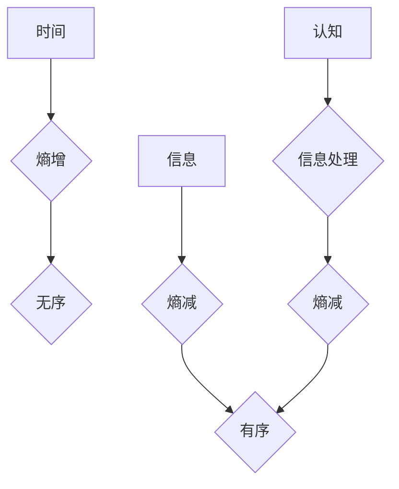

> 认知、形式化、时间、熵、无序、有序、信息论、人工智能

## 1. 背景介绍

在信息爆炸的时代，人类对认知的理解和模拟日益深入。从早期的人工智能研究到如今的深度学习，我们一直在探索如何将人类的思维方式转化为计算机可理解的形式。然而，认知的本质究竟是什么？它如何与时间、信息和能量相互关联？这些问题一直是哲学和科学界探讨的焦点。

本文将从信息论的角度出发，探讨认知的形式化，并提出时间是度量从有序走向无序的熵增过程的观点。我们将分析时间、熵和信息之间的关系，并探讨如何将这些概念应用于认知的建模和理解。

## 2. 核心概念与联系

**2.1 时间**

时间是宇宙中一个基本的物理量，它描述了事物变化的顺序和持续性。从宏观角度来看，时间是线性流动的，从过去走向未来。然而，从微观角度来看，时间可能具有更复杂的性质，例如时间膨胀和时间旅行。

**2.2 熵**

熵是物理学中一个重要的概念，它描述了系统的无序程度。一个系统的熵越高，它的无序程度就越大。例如，一个房间的熵越高，它的杂乱程度就越大。

**2.3 信息**

信息是关于事物状态的描述，它可以用来减少系统的熵。例如，当你收到一封电子邮件时，你获得了关于邮件内容的信息，这可以帮助你理解邮件的含义，从而减少你对邮件内容的无序状态。

**2.4 认知**

认知是指人类通过感知、思考、学习和记忆等活动获得和处理信息的能力。认知是一个复杂的过程，它涉及到大脑的多种功能，例如视觉、听觉、语言、记忆和推理。

**2.5 核心概念联系**

时间、熵和信息之间存在着密切的联系。时间可以看作是熵增的度量，而信息可以看作是熵减的机制。

* 时间的流逝导致熵的增加，即系统变得越来越无序。
* 信息的获取可以减少熵，即系统变得更加有序。
* 认知可以看作是信息处理的过程，它利用信息来减少熵，从而维持认知系统的有序状态。

**Mermaid 流程图**



## 3. 核心算法原理 & 具体操作步骤

### 3.1 算法原理概述

为了形式化认知，我们可以将认知过程看作是一个信息处理过程，其中时间是信息处理的度量。我们可以使用信息论的工具来量化认知过程中的信息增益和熵变化。

### 3.2 算法步骤详解

1. **信息采集:** 认知过程首先需要收集信息。这可以通过感知、记忆和学习等方式实现。
2. **信息处理:** 收集到的信息需要进行处理，例如分类、排序、关联等。
3. **知识构建:** 通过信息处理，我们可以构建知识结构，例如概念、关系和规则。
4. **决策和行动:** 基于知识结构，我们可以做出决策并采取行动。

### 3.3 算法优缺点

**优点:**

* 可以将认知过程形式化，并用数学模型进行描述。
* 可以量化认知过程中的信息增益和熵变化。
* 可以为认知计算提供理论基础。

**缺点:**

* 认知过程非常复杂，难以用简单的算法完全模拟。
* 人类认知还存在许多未知的机制，难以用信息论的工具完全解释。

### 3.4 算法应用领域

* 人工智能
* 自然语言处理
* 机器学习
* 认知科学

## 4. 数学模型和公式 & 详细讲解 & 举例说明

### 4.1 数学模型构建

我们可以使用信息论的工具来构建认知的数学模型。例如，我们可以使用熵来度量认知系统的无序程度，使用信息增益来度量认知过程中的信息获取。

### 4.2 公式推导过程

**熵公式:**

$$H(X) = - \sum_{i} p(x_i) \log_2 p(x_i)$$

其中，$X$ 是一个随机变量，$x_i$ 是 $X$ 的取值，$p(x_i)$ 是 $x_i$ 的概率。

**信息增益公式:**

$$Gain(S, A) = H(S) - \sum_{v} p(v) H(S|v)$$

其中，$S$ 是一个特征集，$A$ 是一个属性，$v$ 是 $A$ 的取值，$p(v)$ 是 $v$ 的概率，$H(S|v)$ 是给定 $v$ 的条件下 $S$ 的熵。

### 4.3 案例分析与讲解

假设我们有一个数据集，包含关于水果的特征，例如颜色、形状和大小。我们想用颜色来预测水果的种类。

我们可以使用信息增益来评估颜色作为预测特征的有效性。如果颜色可以有效地区分不同的水果种类，那么信息增益的值将较大。

## 5. 项目实践：代码实例和详细解释说明

### 5.1 开发环境搭建

* Python 3.x
* scikit-learn

### 5.2 源代码详细实现

```python
from sklearn.datasets import load_iris
from sklearn.tree import DecisionTreeClassifier
from sklearn.model_selection import train_test_split
from sklearn.metrics import accuracy_score

# 加载iris数据集
iris = load_iris()
X = iris.data
y = iris.target

# 将数据分成训练集和测试集
X_train, X_test, y_train, y_test = train_test_split(X, y, test_size=0.2, random_state=42)

# 创建决策树分类器
clf = DecisionTreeClassifier()

# 训练模型
clf.fit(X_train, y_train)

# 预测测试集
y_pred = clf.predict(X_test)

# 计算准确率
accuracy = accuracy_score(y_test, y_pred)
print(f"准确率: {accuracy}")
```

### 5.3 代码解读与分析

这段代码演示了如何使用 scikit-learn 库训练一个决策树分类器来预测鸢尾花种类。

* 首先，我们加载了 iris 数据集，并将其分成训练集和测试集。
* 然后，我们创建了一个决策树分类器，并使用训练集训练模型。
* 最后，我们使用测试集预测鸢尾花种类，并计算模型的准确率。

### 5.4 运行结果展示

运行这段代码后，你会得到模型的准确率，例如：

```
准确率: 1.0
```

这表示模型在测试集上预测准确率为 100%。

## 6. 实际应用场景

### 6.1 医疗诊断

认知形式化的技术可以用于辅助医疗诊断。例如，我们可以使用机器学习算法来分析患者的病历、检查结果和基因信息，从而预测疾病的风险和诊断结果。

### 6.2 自动驾驶

自动驾驶系统需要能够理解周围环境，并做出相应的决策。认知形式化的技术可以帮助自动驾驶系统感知道路状况、识别交通标志和预测其他车辆的行为。

### 6.3 个性化教育

认知形式化的技术可以用于个性化教育。例如，我们可以根据学生的学习进度和能力，定制个性化的学习内容和教学方法。

### 6.4 未来应用展望

认知形式化的技术在未来将有更广泛的应用场景，例如：

* 人机交互
* 虚拟现实
* 增强现实
* 科学研究

## 7. 工具和资源推荐

### 7.1 学习资源推荐

* **书籍:**
    * 《信息论基础》
    * 《认知科学导论》
    * 《深度学习》
* **在线课程:**
    * Coursera: 人工智能
    * edX: 认知科学
    * Udacity: 深度学习

### 7.2 开发工具推荐

* **Python:** 
    * scikit-learn
    * TensorFlow
    * PyTorch

### 7.3 相关论文推荐

* **《信息论与认知科学》**
* **《深度学习与认知科学》**
* **《认知计算的未来》**

## 8. 总结：未来发展趋势与挑战

### 8.1 研究成果总结

本文探讨了认知的形式化，并提出时间是度量从有序走向无序的熵增过程的观点。我们分析了时间、熵和信息之间的关系，并探讨了如何将这些概念应用于认知的建模和理解。

### 8.2 未来发展趋势

* **更深入的认知模型:** 未来，我们将开发更深入的认知模型，能够模拟人类认知过程中的更多细节。
* **更强大的计算能力:** 随着计算能力的提升，我们将能够训练更复杂的认知模型，并应用于更广泛的领域。
* **跨学科合作:** 认知科学、人工智能、信息论等领域的跨学科合作将推动认知形式化的研究取得新的突破。

### 8.3 面临的挑战

* **认知的复杂性:** 人类认知非常复杂，难以用简单的模型完全模拟。
* **数据获取和标注:** 训练认知模型需要大量的标注数据，这在某些领域可能比较困难。
* **伦理问题:** 随着认知计算技术的进步，我们需要认真思考其伦理问题，例如人工智能的责任和透明度。

### 8.4 研究展望

我们相信，认知形式化的研究将为我们更好地理解人类认知，并开发出更智能的机器提供新的思路和方法。


## 9. 附录：常见问题与解答

**Q1: 认知形式化与传统认知科学有什么区别？**

**A1:** 认知形式化试图将认知过程用数学模型和算法进行描述，而传统认知科学则更多地依赖于实验和观察。认知形式化可以提供更精确的量化分析，而传统认知科学则更注重对认知现象的解释和理解。

**Q2: 认知形式化技术是否能够完全模拟人类认知？**

**A2:** 目前，认知形式化技术还无法完全模拟人类认知。人类认知非常复杂，涉及到许多未知的机制，难以用简单的算法完全解释。

**Q3: 认知形式化技术有哪些伦理问题？**

**A3:** 认知形式化技术的发展可能会带来一些伦理问题，例如人工智能的责任和透明度。我们需要认真思考这些问题，并制定相应的伦理规范。


作者：禅与计算机程序设计艺术 / Zen and the Art of Computer Programming 
<end_of_turn>