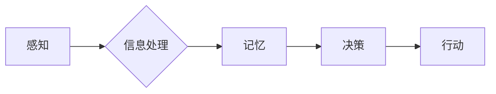

> 认知过程、复杂系统、简单性原理、演化算法、人工智能、深度学习

## 1. 背景介绍

认知过程是人类理解世界、解决问题和做出决策的核心机制。从简单的感知到复杂的推理，认知过程展现出惊人的复杂性。然而，在复杂性背后，隐藏着简单性的原理，这些原理驱动着认知过程的演化和发展。

近年来，人工智能领域取得了飞速发展，深度学习算法的出现为模拟和理解认知过程提供了新的工具。然而，深度学习模型仍然难以完全复制人类的认知能力，例如，创造性思维、抽象思考和常识推理等。

理解认知过程中的简单与复杂演变，对于构建更智能的人工智能系统至关重要。

## 2. 核心概念与联系

**2.1 认知过程的复杂性**

认知过程涉及到多个相互关联的模块，包括感知、记忆、语言、推理和决策等。这些模块之间通过复杂的网络连接进行信息传递，形成一个高度复杂的系统。

**2.2 简单性原理**

尽管认知过程极其复杂，但简单性原理表明，复杂系统往往可以被分解为更简单的组成部分，这些部分之间遵循着简单的规则。

**2.3 复杂系统演化**

复杂系统通常通过演化过程逐渐形成。在演化过程中，简单的结构和规则不断组合和重组，最终形成更复杂的系统。

**2.4 认知过程的演化**

人类的认知能力是通过漫长的演化过程逐渐形成的。从简单的反射到复杂的语言和抽象思维，认知过程经历了从简单到复杂的演变。

**Mermaid 流程图**



## 3. 核心算法原理 & 具体操作步骤

**3.1 算法原理概述**

演化算法是一种模仿自然选择机制的优化算法。它通过迭代地生成、评估和选择候选解，最终找到最优解。

**3.2 算法步骤详解**

1. **初始化种群:** 生成一个初始的候选解集合，称为种群。
2. **评估适应度:** 对每个候选解进行评估，计算其适应度值，适应度值越高，表示该候选解越好。
3. **选择操作:** 根据适应度值，选择部分候选解作为父代，用于生成下一代。
4. **交叉操作:** 将两个父代的基因进行交叉，生成新的候选解。
5. **变异操作:** 对部分候选解进行随机变异，增加种群的多样性。
6. **重复步骤2-5:** 重复上述步骤，直到达到预设的终止条件。

**3.3 算法优缺点**

**优点:**

* 可以解决复杂优化问题。
* 对目标函数的假设较少。
* 能够找到全局最优解。

**缺点:**

* 算法收敛速度较慢。
* 需要大量的计算资源。

**3.4 算法应用领域**

* 机器学习
* 遗传算法
* 优化问题求解

## 4. 数学模型和公式 & 详细讲解 & 举例说明

**4.1 数学模型构建**

假设种群大小为N，每个候选解由D个基因组成。

* **适应度函数:** $f(x)$，其中$x$为候选解。

* **选择概率:** $p(x) = \frac{f(x)}{\sum_{i=1}^{N} f(i)}$

* **交叉概率:** $p_c$

* **变异概率:** $p_m$

**4.2 公式推导过程**

选择操作:

* 从种群中随机选择两个候选解，其选择概率与适应度值成正比。

交叉操作:

* 随机选择一个交叉点，将两个父代的基因进行交换。

变异操作:

* 随机选择一个基因，对其进行随机变异。

**4.3 案例分析与讲解**

例如，在解决图像分类问题时，可以使用演化算法来优化神经网络的权重参数。

* 适应度函数: 分类准确率

* 选择操作: 选择准确率高的神经网络权重作为父代。

* 交叉操作: 将两个父代的权重进行交叉，生成新的权重组合。

* 变异操作: 对部分权重进行随机变异，增加网络的泛化能力。

## 5. 项目实践：代码实例和详细解释说明

**5.1 开发环境搭建**

* Python 3.x
* TensorFlow/PyTorch

**5.2 源代码详细实现**

```python
import numpy as np

# 定义适应度函数
def fitness_function(individual):
    # 计算个体的适应度值
    return accuracy(individual)

# 定义选择操作
def selection(population):
    # 根据适应度值选择父代
    return select_parents(population)

# 定义交叉操作
def crossover(parent1, parent2):
    # 将两个父代的基因进行交叉
    return create_child(parent1, parent2)

# 定义变异操作
def mutation(individual):
    # 对个体的基因进行随机变异
    return mutate(individual)

# 主程序
def main():
    # 初始化种群
    population = initialize_population()

    # 迭代优化
    for generation in range(num_generations):
        # 选择父代
        parents = selection(population)

        # 交叉
        children = crossover(parents)

        # 变异
        children = mutation(children)

        # 更新种群
        population = children

    # 返回最优解
    return best_individual(population)

if __name__ == "__main__":
    main()
```

**5.3 代码解读与分析**

* `fitness_function`: 计算个体的适应度值，例如分类准确率。
* `selection`: 选择适应度高的个体作为父代。
* `crossover`: 将两个父代的基因进行交叉，生成新的个体。
* `mutation`: 对个体的基因进行随机变异，增加种群的多样性。
* `main`: 主程序，初始化种群，迭代优化，返回最优解。

**5.4 运行结果展示**

运行代码后，可以得到最优解，例如，最优的神经网络权重参数。

## 6. 实际应用场景

**6.1 机器学习**

* 优化神经网络权重参数
* 寻找最优的模型结构

**6.2 遗传算法**

* 解决组合优化问题
* 设计新的算法

**6.3 其他领域**

* 金融投资
* 药物设计
* 工程设计

**6.4 未来应用展望**

* 结合深度学习，构建更智能的演化算法
* 应用于更复杂的问题领域

## 7. 工具和资源推荐

**7.1 学习资源推荐**

* 书籍: 《进化算法》
* 网页: https://en.wikipedia.org/wiki/Evolutionary_algorithm

**7.2 开发工具推荐**

* Python
* TensorFlow/PyTorch

**7.3 相关论文推荐**

* [Evolutionary Algorithms for Machine Learning](https://arxiv.org/abs/1706.01978)

## 8. 总结：未来发展趋势与挑战

**8.1 研究成果总结**

演化算法是一种有效的优化算法，在机器学习、遗传算法等领域取得了成功应用。

**8.2 未来发展趋势**

* 结合深度学习，构建更智能的演化算法
* 应用于更复杂的问题领域

**8.3 面临的挑战**

* 算法收敛速度较慢
* 需要大量的计算资源

**8.4 研究展望**

* 研究更有效的演化算法
* 探索演化算法在其他领域的应用

## 9. 附录：常见问题与解答

**9.1 如何选择适应度函数？**

适应度函数应该能够准确地反映个体的性能，例如，分类准确率、回归误差等。

**9.2 如何设置交叉和变异概率？**

交叉和变异概率应该根据具体问题进行调整。一般来说，交叉概率应该较高，变异概率应该较低。

**9.3 如何判断演化算法是否收敛？**

可以根据适应度值的变化趋势判断演化算法是否收敛。如果适应度值不再增加，则表示算法已经收敛。


作者：禅与计算机程序设计艺术 / Zen and the Art of Computer Programming 
<end_of_turn>