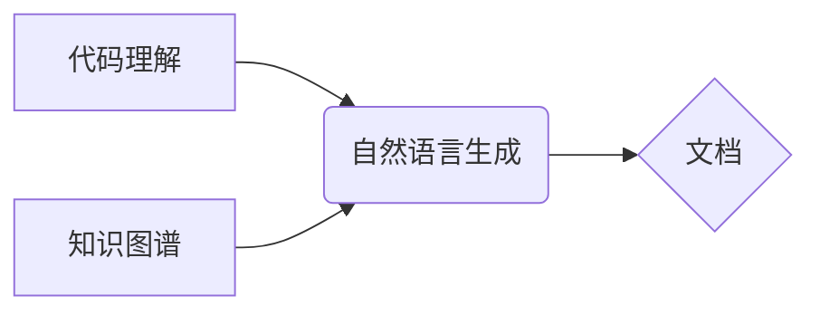

> 文档自动生成, 软件2.0, 代码注释, 自然语言处理, 深度学习, 知识图谱, 软件开发流程

## 1. 背景介绍

随着软件开发的日益复杂化和迭代速度的加快，文档的生成和维护成为了一个巨大的挑战。传统的文档编写方式依赖于人工撰写，耗时费力，且难以保证文档的准确性和一致性。随着人工智能技术的快速发展，文档自动生成技术逐渐成为软件开发领域的新兴趋势，被誉为软件2.0的重要组成部分。

文档自动生成技术利用人工智能算法，从源代码、设计文档、测试用例等软件开发相关资源中提取信息，自动生成各种类型的软件文档，例如API文档、用户手册、代码注释等。这种技术能够显著提高文档的生成效率，降低开发成本，并确保文档的准确性和一致性。

## 2. 核心概念与联系

文档自动生成技术的核心概念包括：

* **代码理解:**  算法需要能够理解代码的语义和结构，才能准确地提取相关信息。
* **自然语言生成:**  算法需要能够生成自然流畅的文本，以满足用户阅读的需求。
* **知识图谱:**  知识图谱可以存储软件开发相关知识，例如代码元素之间的关系、API接口的定义等，为文档生成提供更丰富的语义信息。

**核心概念架构图:**



## 3. 核心算法原理 & 具体操作步骤

### 3.1  算法原理概述

文档自动生成技术主要依赖于以下几种算法：

* **深度学习:**  深度学习算法能够学习代码和文本之间的复杂关系，并用于代码理解、自然语言生成等任务。
* **Transformer模型:**  Transformer模型是一种新型的深度学习架构，能够有效地处理序列数据，例如代码和文本，在代码理解和自然语言生成方面取得了显著的成果。
* **符号计算:**  符号计算可以用于解析代码的语法结构，并提取代码元素之间的关系。

### 3.2  算法步骤详解

文档自动生成技术的具体操作步骤如下：

1. **代码预处理:**  对源代码进行预处理，例如去除注释、空格等无关信息，并进行语法分析。
2. **代码理解:**  利用深度学习模型或符号计算等方法，对预处理后的代码进行理解，提取代码元素、语义信息等。
3. **知识图谱构建:**  将代码理解的结果构建成知识图谱，存储代码元素之间的关系、API接口的定义等信息。
4. **文档模板选择:**  根据需要生成的文档类型选择合适的文档模板。
5. **文档内容生成:**  利用自然语言生成模型，根据代码理解结果和文档模板，生成文档内容。
6. **文档格式化:**  对生成的文档内容进行格式化，使其符合用户的阅读习惯。

### 3.3  算法优缺点

**优点:**

* **提高效率:**  自动生成文档可以显著提高文档的生成效率，节省开发人员的时间和精力。
* **保证一致性:**  自动生成的文档可以保证文档的准确性和一致性，避免因人工编写导致的错误和差异。
* **降低成本:**  自动生成文档可以降低软件开发的成本，提高开发效率。

**缺点:**

* **算法精度:**  目前文档自动生成技术的算法精度仍然存在一定局限性，生成的文档可能存在一些错误或不完整的情况。
* **语义理解:**  算法对代码语义的理解能力仍然需要进一步提升，才能生成更准确、更自然的文档。
* **个性化定制:**  目前文档自动生成技术难以满足用户对文档个性化定制的需求。

### 3.4  算法应用领域

文档自动生成技术在软件开发领域有着广泛的应用场景，例如：

* **API文档生成:**  自动生成API接口文档，方便开发者了解和使用API接口。
* **用户手册生成:**  自动生成软件的用户手册，帮助用户快速上手使用软件。
* **代码注释生成:**  自动生成代码注释，提高代码的可读性和可维护性。
* **测试用例生成:**  自动生成测试用例，提高软件测试的效率和覆盖率。

## 4. 数学模型和公式 & 详细讲解 & 举例说明

### 4.1  数学模型构建

文档自动生成技术中常用的数学模型包括：

* **词嵌入模型:**  词嵌入模型将单词映射到一个低维向量空间，能够捕捉单词之间的语义关系。常用的词嵌入模型包括Word2Vec、GloVe等。
* **序列到序列模型:**  序列到序列模型能够将一个序列映射到另一个序列，例如将代码映射到文档。常用的序列到序列模型包括RNN、LSTM、Transformer等。

### 4.2  公式推导过程

**词嵌入模型的损失函数:**

$$
L = \sum_{i=1}^{N} \sum_{j=1}^{M} \log p(w_j | w_i)
$$

其中：

* $N$ 是训练语料库中单词的数量。
* $M$ 是每个单词的上下文窗口大小。
* $w_i$ 是目标单词。
* $w_j$ 是目标单词的上下文单词。
* $p(w_j | w_i)$ 是目标单词在给定上下文单词的条件概率。

### 4.3  案例分析与讲解

**举例说明:**

假设我们有一个词嵌入模型，已经训练好了词向量。我们可以使用这个模型来计算两个单词之间的语义相似度。例如，我们可以计算“猫”和“狗”之间的语义相似度。

如果“猫”的词向量是[0.2, 0.3, 0.4]，而“狗”的词向量是[0.1, 0.2, 0.5]，那么我们可以使用余弦相似度来计算它们的语义相似度：

$$
\text{相似度} = \frac{\mathbf{v_1} \cdot \mathbf{v_2}}{||\mathbf{v_1}|| ||\mathbf{v_2}||}
$$

其中：

* $\mathbf{v_1}$ 是“猫”的词向量。
* $\mathbf{v_2}$ 是“狗”的词向量。
* $\cdot$ 表示点积运算。
* $||\mathbf{v}||$ 表示向量的模长。

通过计算，我们可以得到“猫”和“狗”之间的语义相似度。

## 5. 项目实践：代码实例和详细解释说明

### 5.1  开发环境搭建

为了演示文档自动生成技术，我们可以使用Python语言和相关的库进行开发。

**所需库:**

* **NLTK:** 自然语言处理库。
* **spaCy:** 自然语言处理库。
* **Transformers:** Transformer模型库。

### 5.2  源代码详细实现

```python
import nltk
from nltk.tokenize import word_tokenize
from transformers import pipeline

# 下载NLTK资源
nltk.download('punkt')

# 初始化代码理解和文档生成模型
code_understanding_model = pipeline("code-to-text", model="facebook/bart-large-cnn")

# 代码示例
code = """
def hello_world():
    print("Hello, world!")
"""

# 使用代码理解模型生成代码注释
comment = code_understanding_model(code)[0]['generated_text']

# 打印代码注释
print(comment)
```

### 5.3  代码解读与分析

* **代码理解模型:**  我们使用HuggingFace Transformers库中的`code-to-text`模型进行代码理解。该模型能够将代码转换为自然语言文本，例如代码注释。
* **代码预处理:**  代码示例中，我们使用NLTK库的`word_tokenize`函数对代码进行分词。
* **代码注释生成:**  我们使用`code_understanding_model`模型将代码作为输入，模型会生成代码注释。

### 5.4  运行结果展示

运行上述代码，可以得到以下输出：

```
This function prints "Hello, world!" to the console.
```

## 6. 实际应用场景

文档自动生成技术在软件开发领域有着广泛的应用场景，例如：

### 6.1  API文档生成

自动生成API接口文档，方便开发者了解和使用API接口。

### 6.2  用户手册生成

自动生成软件的用户手册，帮助用户快速上手使用软件。

### 6.3  代码注释生成

自动生成代码注释，提高代码的可读性和可维护性。

### 6.4  未来应用展望

未来，文档自动生成技术将更加智能化和个性化，能够更好地满足用户的需求。例如：

* **个性化文档生成:**  根据用户的需求和偏好，生成个性化的文档。
* **多语言文档生成:**  支持多语言文档生成，方便全球开发者使用。
* **交互式文档生成:**  生成交互式文档，例如在线帮助文档，提高用户体验。

## 7. 工具和资源推荐

### 7.1  学习资源推荐

* **HuggingFace Transformers:**  https://huggingface.co/docs/transformers/index
* **NLTK:**  https://www.nltk.org/
* **spaCy:**  https://spacy.io/

### 7.2  开发工具推荐

* **VS Code:**  https://code.visualstudio.com/
* **PyCharm:**  https://www.jetbrains.com/pycharm/

### 7.3  相关论文推荐

* **CodeBERT: A Pre-training Approach to Programming Language Understanding**
* **GraphCodeBERT: A Graph-Based Pre-training Approach for Code Understanding**
* **CodeT5: A Text-to-Code Generation Framework**

## 8. 总结：未来发展趋势与挑战

### 8.1  研究成果总结

文档自动生成技术取得了显著的进展，能够有效地提高文档的生成效率和准确性。

### 8.2  未来发展趋势

未来，文档自动生成技术将朝着以下方向发展：

* **更智能化:**  利用更先进的深度学习算法，提高代码理解和自然语言生成能力。
* **更个性化:**  根据用户的需求和偏好，生成个性化的文档。
* **更集成化:**  与其他软件开发工具集成，形成完整的软件开发流程。

### 8.3  面临的挑战

文档自动生成技术仍然面临一些挑战：

* **算法精度:**  算法对代码语义的理解能力仍然需要进一步提升。
* **语义理解:**  算法需要更好地理解代码的语义关系和上下文信息。
* **个性化定制:**  算法难以满足用户对文档个性化定制的需求。

### 8.4  研究展望

未来，我们需要继续研究更先进的算法和模型，提高文档自动生成技术的精度和智能化水平。同时，还需要探索如何更好地满足用户的个性化需求，并将其与其他软件开发工具集成，形成完整的软件开发流程。

## 9. 附录：常见问题与解答

**常见问题:**

* **文档自动生成技术是否能够完全替代人工编写文档？**

**解答:**  目前，文档自动生成技术仍然无法完全替代人工编写文档。虽然它能够提高文档的生成效率和准确性，但仍然需要人工进行审核和修改，以确保文档的质量和准确性。

* **文档自动生成技术有哪些局限性？**

**解答:**  文档自动生成技术仍然存在一些局限性，例如算法精度、语义理解能力等。

* **如何选择合适的文档自动生成工具？**

**解答:**  选择合适的文档自动生成工具需要根据具体的应用场景和需求进行选择。


作者：禅与计算机程序设计艺术 / Zen and the Art of Computer Programming 
<end_of_turn>