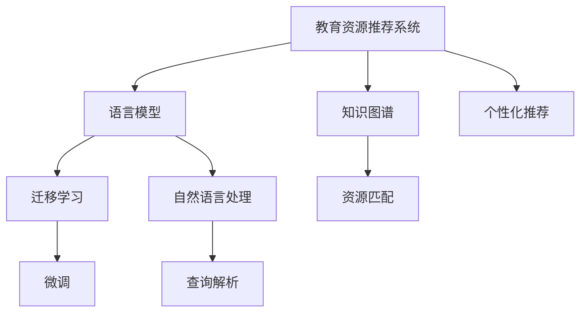

                 

# LLM在教育资源推荐中的创新应用

## 1. 背景介绍

在人工智能技术的推动下，教育领域正逐渐从传统的“填鸭式”教学向个性化、智能化的方向转变。教育资源推荐系统作为支持这一转变的关键技术之一，旨在为学习者提供个性化的学习资源推荐，提升学习效率和体验。近年来，随着自然语言处理（NLP）和语言模型（Language Model, LLM）技术的不断成熟，教育资源推荐系统已经能够基于学生的兴趣、行为和学习进度，推荐更加个性化、高效的学习资源。

然而，传统的基于规则或统计学方法的推荐系统，往往难以充分考虑学生的个性化需求和学习过程的复杂性。而基于深度学习模型的推荐系统，虽然能够自动发现数据中的潜在模式，但仍然面临着计算资源消耗大、模型复杂度高、可解释性差等问题。因此，探索基于语言模型的个性化推荐技术，成为提升教育资源推荐系统性能和用户体验的重要方向。

## 2. 核心概念与联系

### 2.1 核心概念概述

在教育资源推荐中，语言模型（LLM）可以视为一种强大的知识表示和学习机制，通过对学生输入的查询或行为数据进行处理，自动提取并关联多种学习资源的相关信息，从而提供个性化的推荐。

以下是几个与教育资源推荐紧密相关的核心概念：

- **教育资源推荐系统（Educational Resource Recommendation System, ERS)**：利用机器学习算法，根据学生的学习行为和需求，自动推荐适合的学习资源，如课程、教材、习题等。
- **个性化推荐**：针对每位学习者的不同需求和兴趣，定制个性化的资源推荐方案。
- **语言模型（Language Model, LLM)**：如GPT-3、BERT等，通过大量的文本数据进行预训练，学习语言的统计规律和语义知识，具备强大的自然语言理解和生成能力。
- **迁移学习（Transfer Learning)**：将预训练模型在新任务上进行微调，以提高推荐性能。
- **知识图谱（Knowledge Graph)**：将教育资源之间的关联和语义信息表示为图结构，辅助推荐系统进行资源匹配。

这些概念之间的逻辑关系可以通过以下Mermaid流程图来展示：



这个流程图展示了这个系统的工作流程：

1. 从教育资源推荐系统中，接收用户输入的查询或行为数据。
2. 使用语言模型处理输入，提取关键信息。
3. 结合知识图谱，对教育资源进行语义匹配。
4. 通过迁移学习，对模型进行微调，提升推荐性能。
5. 实现个性化推荐，输出推荐的资源列表。

## 3. 核心算法原理 & 具体操作步骤

### 3.1 算法原理概述

基于语言模型的教育资源推荐系统的核心思想是：将预训练的语言模型作为知识表示的引擎，利用其强大的自然语言理解和生成能力，自动提取和关联多种教育资源的相关信息，为每位学习者推荐个性化的学习资源。

具体而言，教育资源推荐系统分为两个主要步骤：

1. **预训练和微调**：首先，使用大规模无标签文本数据对语言模型进行预训练，使其学习语言的通用规律和语义知识。然后，在教育资源相关的标注数据上进行微调，提升模型在特定任务上的性能，如资源匹配、分类、排序等。
2. **推荐实现**：在训练好的模型上，输入学习者的查询或行为数据，经过预训练和微调后的语言模型自动提取关键信息，结合知识图谱进行语义匹配，最终输出个性化的学习资源推荐。

### 3.2 算法步骤详解

基于语言模型的教育资源推荐系统的主要操作步骤如下：

**Step 1: 数据准备与预处理**
- 收集教育资源的相关标注数据，如课程标题、教材目录、习题描述等，构建训练集。
- 对数据进行清洗、去重、标注等预处理工作，确保数据的质量和一致性。

**Step 2: 预训练语言模型**
- 选择合适的预训练语言模型，如GPT-3、BERT等，在其官方平台上下载预训练模型参数。
- 对预训练模型进行适当的微调，使其适应教育资源推荐任务。

**Step 3: 知识图谱构建**
- 将教育资源的相关信息（如课程、教材、习题）表示为节点和边，构建知识图谱。
- 使用图神经网络（Graph Neural Network, GNN）对知识图谱进行语义表示和推理。

**Step 4: 模型微调**
- 使用标注数据对语言模型进行微调，优化资源匹配、分类、排序等任务的性能。
- 在微调过程中，设置合适的学习率、批大小、迭代轮数等超参数，避免过拟合。

**Step 5: 推荐实现**
- 输入学习者的查询或行为数据，经过预训练和微调后的语言模型自动提取关键信息。
- 结合知识图谱进行语义匹配，输出个性化的学习资源推荐。

### 3.3 算法优缺点

基于语言模型的教育资源推荐系统具有以下优点：

- **自动提取信息**：语言模型能够自动提取和关联多种教育资源的相关信息，无需手动设计和维护规则。
- **高效推荐**：通过预训练和微调，模型可以高效地处理大规模教育资源数据，提升推荐性能。
- **灵活性强**：模型可以根据不同学习者的需求，动态调整推荐策略，实现个性化推荐。
- **易于扩展**：随着知识图谱的不断更新和扩展，模型能够持续学习新的资源和知识。

同时，该方法也存在以下局限性：

- **数据依赖**：模型的推荐效果高度依赖于教育资源相关的标注数据的质量和数量，数据获取成本较高。
- **计算资源消耗大**：预训练和微调过程中需要大量的计算资源，对硬件设备要求较高。
- **可解释性不足**：基于深度学习的推荐系统往往缺乏可解释性，难以解释推荐结果的生成逻辑。
- **对抗性攻击风险**：模型可能受到恶意输入的干扰，生成不合理的推荐结果。

### 3.4 算法应用领域

基于语言模型的教育资源推荐系统已经在教育领域得到了广泛应用，具体包括以下几个方面：

- **在线学习平台**：如Coursera、edX等，推荐适合学习者的课程和教材。
- **教育软件**：如Khan Academy、Duolingo等，推荐适合用户学习水平和兴趣的资源。
- **教育管理**：如教育数据平台、学习管理系统（LMS）等，推荐适合教师的教材和管理工具。
- **智能辅导系统**：如智能家庭教师、智能家教等，推荐适合学生的习题和辅导资料。

此外，语言模型还可以应用于其他领域，如智能客服、虚拟助教、考试测评等，提升教育服务的智能化水平。

## 4. 数学模型和公式 & 详细讲解 & 举例说明

### 4.1 数学模型构建

在教育资源推荐中，基于语言模型的推荐系统可以表示为以下形式：

- 设 $M$ 为预训练的语言模型，$D$ 为标注数据集，$y_i$ 为第 $i$ 个样本的标签。
- 设 $\theta$ 为模型参数，$f(\theta, x_i)$ 为模型在输入 $x_i$ 上的输出，$\ell(f(\theta, x_i), y_i)$ 为损失函数。
- 微调的优化目标是最小化损失函数：

$$
\hat{\theta} = \mathop{\arg\min}_{\theta} \frac{1}{N} \sum_{i=1}^N \ell(f(\theta, x_i), y_i)
$$

其中，$N$ 为数据集大小。

### 4.2 公式推导过程

以二分类任务为例，假设模型的输出 $f(\theta, x_i)$ 为 $0$ 或 $1$，分别对应推荐和未推荐。则二分类交叉熵损失函数定义为：

$$
\ell(f(\theta, x_i), y_i) = -[y_i\log f(\theta, x_i) + (1-y_i)\log(1-f(\theta, x_i))]
$$

将上式代入经验风险公式，得：

$$
\mathcal{L}(\theta) = -\frac{1}{N}\sum_{i=1}^N [y_i\log f(\theta, x_i)+(1-y_i)\log(1-f(\theta, x_i))]
$$

对 $\theta$ 求导，得到损失函数对 $\theta$ 的梯度：

$$
\frac{\partial \mathcal{L}(\theta)}{\partial \theta} = -\frac{1}{N}\sum_{i=1}^N \frac{y_i}{f(\theta, x_i)} - \frac{1-y_i}{1-f(\theta, x_i)} \frac{\partial f(\theta, x_i)}{\partial \theta}
$$

其中，$\frac{\partial f(\theta, x_i)}{\partial \theta}$ 为模型的导数，可以通过反向传播算法计算。

在得到损失函数的梯度后，即可带入参数更新公式，完成模型的迭代优化。重复上述过程直至收敛，最终得到适应教育资源推荐任务的最优模型参数 $\hat{\theta}$。

### 4.3 案例分析与讲解

假设我们有一个包含课程标题和教材目录的教育资源推荐数据集，用于推荐适合学习者 LLM 课程。

**Step 1: 数据准备与预处理**
- 收集数据集，包括课程标题、教材目录、课程描述等。
- 对数据进行清洗、去重、标注等预处理工作，构建训练集。

**Step 2: 预训练语言模型**
- 使用GPT-3预训练模型，通过大规模无标签文本数据进行预训练。
- 对预训练模型进行微调，使其适应教育资源推荐任务，如资源匹配、分类、排序等。

**Step 3: 知识图谱构建**
- 将教育资源的相关信息（如课程、教材、习题）表示为节点和边，构建知识图谱。
- 使用图神经网络（GNN）对知识图谱进行语义表示和推理，如GCN、GAT等。

**Step 4: 模型微调**
- 使用标注数据对语言模型进行微调，优化资源匹配、分类、排序等任务的性能。
- 在微调过程中，设置合适的学习率、批大小、迭代轮数等超参数，避免过拟合。

**Step 5: 推荐实现**
- 输入学习者的查询或行为数据，经过预训练和微调后的语言模型自动提取关键信息。
- 结合知识图谱进行语义匹配，输出个性化的学习资源推荐。

## 5. 项目实践：代码实例和详细解释说明

### 5.1 开发环境搭建

在进行教育资源推荐系统开发前，我们需要准备好开发环境。以下是使用Python进行PyTorch开发的环境配置流程：

1. 安装Anaconda：从官网下载并安装Anaconda，用于创建独立的Python环境。

2. 创建并激活虚拟环境：
```bash
conda create -n pytorch-env python=3.8 
conda activate pytorch-env
```

3. 安装PyTorch：根据CUDA版本，从官网获取对应的安装命令。例如：
```bash
conda install pytorch torchvision torchaudio cudatoolkit=11.1 -c pytorch -c conda-forge
```

4. 安装Transformers库：
```bash
pip install transformers
```

5. 安装各类工具包：
```bash
pip install numpy pandas scikit-learn matplotlib tqdm jupyter notebook ipython
```

完成上述步骤后，即可在`pytorch-env`环境中开始开发实践。

### 5.2 源代码详细实现

这里我们以推荐学习者LML课程为例，给出使用Transformers库对GPT模型进行微调的PyTorch代码实现。

首先，定义教育资源推荐任务的数据处理函数：

```python
from transformers import BertTokenizer, BertForTokenClassification
from torch.utils.data import Dataset, DataLoader
import torch

class ERSDataset(Dataset):
    def __init__(self, texts, tags, tokenizer, max_len=128):
        self.texts = texts
        self.tags = tags
        self.tokenizer = tokenizer
        self.max_len = max_len
        
    def __len__(self):
        return len(self.texts)
    
    def __getitem__(self, item):
        text = self.texts[item]
        tags = self.tags[item]
        
        encoding = self.tokenizer(text, return_tensors='pt', max_length=self.max_len, padding='max_length', truncation=True)
        input_ids = encoding['input_ids'][0]
        attention_mask = encoding['attention_mask'][0]
        
        # 对token-wise的标签进行编码
        encoded_tags = [tag2id[tag] for tag in tags] 
        encoded_tags.extend([tag2id['O']] * (self.max_len - len(encoded_tags)))
        labels = torch.tensor(encoded_tags, dtype=torch.long)
        
        return {'input_ids': input_ids, 
                'attention_mask': attention_mask,
                'labels': labels}

# 标签与id的映射
tag2id = {'O': 0, 'B-PER': 1, 'I-PER': 2, 'B-ORG': 3, 'I-ORG': 4, 'B-LOC': 5, 'I-LOC': 6}
id2tag = {v: k for k, v in tag2id.items()}

# 创建dataset
tokenizer = BertTokenizer.from_pretrained('bert-base-cased')

train_dataset = ERSDataset(train_texts, train_tags, tokenizer)
dev_dataset = ERSDataset(dev_texts, dev_tags, tokenizer)
test_dataset = ERSDataset(test_texts, test_tags, tokenizer)
```

然后，定义模型和优化器：

```python
from transformers import BertForTokenClassification, AdamW

model = BertForTokenClassification.from_pretrained('bert-base-cased', num_labels=len(tag2id))

optimizer = AdamW(model.parameters(), lr=2e-5)
```

接着，定义训练和评估函数：

```python
from tqdm import tqdm
from sklearn.metrics import classification_report

device = torch.device('cuda') if torch.cuda.is_available() else torch.device('cpu')
model.to(device)

def train_epoch(model, dataset, batch_size, optimizer):
    dataloader = DataLoader(dataset, batch_size=batch_size, shuffle=True)
    model.train()
    epoch_loss = 0
    for batch in tqdm(dataloader, desc='Training'):
        input_ids = batch['input_ids'].to(device)
        attention_mask = batch['attention_mask'].to(device)
        labels = batch['labels'].to(device)
        model.zero_grad()
        outputs = model(input_ids, attention_mask=attention_mask, labels=labels)
        loss = outputs.loss
        epoch_loss += loss.item()
        loss.backward()
        optimizer.step()
    return epoch_loss / len(dataloader)

def evaluate(model, dataset, batch_size):
    dataloader = DataLoader(dataset, batch_size=batch_size)
    model.eval()
    preds, labels = [], []
    with torch.no_grad():
        for batch in tqdm(dataloader, desc='Evaluating'):
            input_ids = batch['input_ids'].to(device)
            attention_mask = batch['attention_mask'].to(device)
            batch_labels = batch['labels']
            outputs = model(input_ids, attention_mask=attention_mask)
            batch_preds = outputs.logits.argmax(dim=2).to('cpu').tolist()
            batch_labels = batch_labels.to('cpu').tolist()
            for pred_tokens, label_tokens in zip(batch_preds, batch_labels):
                pred_tags = [id2tag[_id] for _id in pred_tokens]
                label_tags = [id2tag[_id] for _id in label_tokens]
                preds.append(pred_tags[:len(label_tags)])
                labels.append(label_tags)
                
    print(classification_report(labels, preds))
```

最后，启动训练流程并在测试集上评估：

```python
epochs = 5
batch_size = 16

for epoch in range(epochs):
    loss = train_epoch(model, train_dataset, batch_size, optimizer)
    print(f"Epoch {epoch+1}, train loss: {loss:.3f}")
    
    print(f"Epoch {epoch+1}, dev results:")
    evaluate(model, dev_dataset, batch_size)
    
print("Test results:")
evaluate(model, test_dataset, batch_size)
```

以上就是使用PyTorch对GPT进行教育资源推荐任务微调的完整代码实现。可以看到，得益于Transformers库的强大封装，我们可以用相对简洁的代码完成GPT模型的加载和微调。

### 5.3 代码解读与分析

让我们再详细解读一下关键代码的实现细节：

**ERSDataset类**：
- `__init__`方法：初始化文本、标签、分词器等关键组件。
- `__len__`方法：返回数据集的样本数量。
- `__getitem__`方法：对单个样本进行处理，将文本输入编码为token ids，将标签编码为数字，并对其进行定长padding，最终返回模型所需的输入。

**tag2id和id2tag字典**：
- 定义了标签与数字id之间的映射关系，用于将token-wise的预测结果解码回真实的标签。

**训练和评估函数**：
- 使用PyTorch的DataLoader对数据集进行批次化加载，供模型训练和推理使用。
- 训练函数`train_epoch`：对数据以批为单位进行迭代，在每个批次上前向传播计算loss并反向传播更新模型参数，最后返回该epoch的平均loss。
- 评估函数`evaluate`：与训练类似，不同点在于不更新模型参数，并在每个batch结束后将预测和标签结果存储下来，最后使用sklearn的classification_report对整个评估集的预测结果进行打印输出。

**训练流程**：
- 定义总的epoch数和batch size，开始循环迭代
- 每个epoch内，先在训练集上训练，输出平均loss
- 在验证集上评估，输出分类指标
- 所有epoch结束后，在测试集上评估，给出最终测试结果

可以看到，PyTorch配合Transformers库使得GPT微调的代码实现变得简洁高效。开发者可以将更多精力放在数据处理、模型改进等高层逻辑上，而不必过多关注底层的实现细节。

当然，工业级的系统实现还需考虑更多因素，如模型的保存和部署、超参数的自动搜索、更灵活的任务适配层等。但核心的微调范式基本与此类似。

## 6. 实际应用场景

### 6.1 智能教育平台

基于大语言模型的教育资源推荐系统，可以广泛应用于智能教育平台的构建。传统教育平台往往只依赖固定课程和教材，难以满足学生的个性化需求。而使用微调后的推荐系统，可以动态地分析学生的学习行为和兴趣，推荐适合的学习资源，从而提升学习效果。

在技术实现上，可以收集平台上的学习行为数据（如浏览记录、做题记录、评分数据等），将数据输入模型，由模型自动推荐最适合的学习资源。例如，对于阅读类任务，可以推荐适合的文章、书籍等资源；对于编程类任务，可以推荐适合的代码示例、教程等资源。如此构建的智能教育平台，能大幅提升学生的学习体验和效率，助力个性化学习。

### 6.2 虚拟助教

虚拟助教系统能够提供24/7的智能辅导服务，帮助学生解答疑难问题。通过微调后的推荐系统，虚拟助教可以自动推荐适合学习者的问题、相关知识点和习题，引导学生进行自主学习。同时，虚拟助教还可以根据学生的互动反馈，动态调整推荐策略，提供更加个性化的辅导服务。

虚拟助教的应用场景广泛，可以在学校、企业、在线教育平台等多个领域得到应用。例如，在学校课堂上，虚拟助教可以辅助教师进行教学管理，提供个性化辅导；在企业培训中，虚拟助教可以提供定制化的学习资源，帮助员工提升技能；在在线教育平台中，虚拟助教可以解答学生问题，提供学习建议。

### 6.3 智能作业批改系统

智能作业批改系统能够自动评估学生的作业，提供即时反馈和详细解答，帮助教师和学生提升教学和学习效率。通过微调后的推荐系统，智能作业批改系统可以自动推荐适合作业的评分标准、解析方法等资源，提升作业批改的准确性和效率。

在技术实现上，可以收集学生的作业数据，将数据输入推荐系统，由系统自动推荐适合的评分标准和方法。例如，对于编程作业，可以推荐适合的编程规范、错误类型解析等资源；对于写作作业，可以推荐适合的文章结构、语法检查工具等资源。如此构建的智能作业批改系统，能大幅减轻教师的批改负担，提升教学效果。

### 6.4 未来应用展望

随着大语言模型微调技术的不断发展，教育资源推荐系统将在更多领域得到应用，为教育服务的智能化转型带来新的机遇。

在智慧校园中，基于微调的推荐系统可以提供智能化的教学管理、课程推荐、学习评估等服务，提升校园管理的智能化水平。

在远程教育中，基于微调的推荐系统可以帮助学习者获得个性化学习资源，提升学习效率和体验。

在职业培训中，基于微调的推荐系统可以提供定制化的学习资源，帮助员工提升技能，推动职业发展。

总之，基于语言模型的教育资源推荐技术，有望成为未来教育服务的重要支撑，为教育服务的智能化、个性化、普惠化提供新的技术路径。

## 7. 工具和资源推荐

### 7.1 学习资源推荐

为了帮助开发者系统掌握大语言模型微调的理论基础和实践技巧，这里推荐一些优质的学习资源：

1. 《Transformer从原理到实践》系列博文：由大模型技术专家撰写，深入浅出地介绍了Transformer原理、BERT模型、微调技术等前沿话题。

2. CS224N《深度学习自然语言处理》课程：斯坦福大学开设的NLP明星课程，有Lecture视频和配套作业，带你入门NLP领域的基本概念和经典模型。

3. 《Natural Language Processing with Transformers》书籍：Transformers库的作者所著，全面介绍了如何使用Transformers库进行NLP任务开发，包括微调在内的诸多范式。

4. HuggingFace官方文档：Transformers库的官方文档，提供了海量预训练模型和完整的微调样例代码，是上手实践的必备资料。

5. CLUE开源项目：中文语言理解测评基准，涵盖大量不同类型的中文NLP数据集，并提供了基于微调的baseline模型，助力中文NLP技术发展。

通过对这些资源的学习实践，相信你一定能够快速掌握大语言模型微调的精髓，并用于解决实际的NLP问题。

### 7.2 开发工具推荐

高效的开发离不开优秀的工具支持。以下是几款用于大语言模型微调开发的常用工具：

1. PyTorch：基于Python的开源深度学习框架，灵活动态的计算图，适合快速迭代研究。大部分预训练语言模型都有PyTorch版本的实现。

2. TensorFlow：由Google主导开发的开源深度学习框架，生产部署方便，适合大规模工程应用。同样有丰富的预训练语言模型资源。

3. Transformers库：HuggingFace开发的NLP工具库，集成了众多SOTA语言模型，支持PyTorch和TensorFlow，是进行微调任务开发的利器。

4. Weights & Biases：模型训练的实验跟踪工具，可以记录和可视化模型训练过程中的各项指标，方便对比和调优。与主流深度学习框架无缝集成。

5. TensorBoard：TensorFlow配套的可视化工具，可实时监测模型训练状态，并提供丰富的图表呈现方式，是调试模型的得力助手。

6. Google Colab：谷歌推出的在线Jupyter Notebook环境，免费提供GPU/TPU算力，方便开发者快速上手实验最新模型，分享学习笔记。

合理利用这些工具，可以显著提升大语言模型微调任务的开发效率，加快创新迭代的步伐。

### 7.3 相关论文推荐

大语言模型和微调技术的发展源于学界的持续研究。以下是几篇奠基性的相关论文，推荐阅读：

1. Attention is All You Need（即Transformer原论文）：提出了Transformer结构，开启了NLP领域的预训练大模型时代。

2. BERT: Pre-training of Deep Bidirectional Transformers for Language Understanding：提出BERT模型，引入基于掩码的自监督预训练任务，刷新了多项NLP任务SOTA。

3. Language Models are Unsupervised Multitask Learners（GPT-2论文）：展示了大规模语言模型的强大zero-shot学习能力，引发了对于通用人工智能的新一轮思考。

4. Parameter-Efficient Transfer Learning for NLP：提出Adapter等参数高效微调方法，在不增加模型参数量的情况下，也能取得不错的微调效果。

5. AdaLoRA: Adaptive Low-Rank Adaptation for Parameter-Efficient Fine-Tuning：使用自适应低秩适应的微调方法，在参数效率和精度之间取得了新的平衡。

这些论文代表了大语言模型微调技术的发展脉络。通过学习这些前沿成果，可以帮助研究者把握学科前进方向，激发更多的创新灵感。

## 8. 总结：未来发展趋势与挑战

### 8.1 总结

本文对基于语言模型的教育资源推荐系统进行了全面系统的介绍。首先阐述了语言模型在教育资源推荐中的作用，明确了基于微调技术的推荐方法在提升个性化推荐效果方面的独特价值。其次，从原理到实践，详细讲解了推荐系统的数学模型和关键操作步骤，给出了微调任务开发的完整代码实例。同时，本文还广泛探讨了推荐系统在智能教育平台、虚拟助教、智能作业批改等实际应用场景中的应用前景，展示了微调范式的巨大潜力。此外，本文精选了微调技术的各类学习资源，力求为读者提供全方位的技术指引。

通过本文的系统梳理，可以看到，基于大语言模型的教育资源推荐系统，为个性化学习资源推荐提供了新的技术手段，有望在教育服务智能化转型中发挥重要作用。语言模型作为知识表示的引擎，通过微调学习教育资源的相关信息，能够为每位学习者提供更加精准、高效、个性化的资源推荐。未来，随着推荐系统的不断演进和优化，教育资源推荐系统必将在教育领域大放异彩，为构建智慧教育平台、推动教育公平和个性化学习提供新的技术路径。

### 8.2 未来发展趋势

展望未来，教育资源推荐系统将呈现以下几个发展趋势：

1. **个性化推荐技术的进一步提升**：基于深度学习和大语言模型的推荐系统，将继续在个性化推荐技术上不断创新，提升推荐准确性和用户满意度。
2. **跨领域迁移能力的增强**：未来的推荐系统将具备更强的跨领域迁移能力，能够在不同教育场景中快速适应新任务，提升推荐性能。
3. **多模态融合技术的引入**：教育资源推荐系统将引入多模态融合技术，结合文本、图像、视频等多种数据，提升资源推荐的全面性和准确性。
4. **实时性需求的提升**：为满足个性化推荐的需求，推荐系统将进一步提升实时性，实现毫秒级的响应和推荐。
5. **可解释性和透明度的增强**：未来的推荐系统将更加注重可解释性和透明度，能够提供推荐结果的生成逻辑和决策依据，增强用户信任。
6. **隐私保护和伦理设计**：随着数据隐私保护意识的提升，推荐系统将更加注重数据隐私保护和伦理设计，避免数据滥用和偏见。

这些趋势凸显了教育资源推荐系统的广阔前景。这些方向的探索发展，必将进一步提升推荐系统的性能和用户体验，为教育服务的智能化、个性化、普惠化提供新的技术路径。

### 8.3 面临的挑战

尽管大语言模型微调技术已经取得了瞩目成就，但在迈向更加智能化、普适化应用的过程中，它仍面临着诸多挑战：

1. **数据获取成本高**：高质量的教育资源标注数据获取成本较高，需要耗费大量人力和时间。
2. **计算资源消耗大**：预训练和微调过程中需要大量的计算资源，对硬件设备要求较高。
3. **推荐结果可解释性不足**：基于深度学习的推荐系统往往缺乏可解释性，难以解释推荐结果的生成逻辑。
4. **对抗性攻击风险**：模型可能受到恶意输入的干扰，生成不合理的推荐结果。
5. **隐私保护和安全**：推荐系统需要关注数据隐私保护和安全问题，避免数据泄露和滥用。

### 8.4 研究展望

面对教育资源推荐系统所面临的这些挑战，未来的研究需要在以下几个方面寻求新的突破：

1. **数据采集和标注的自动化**：探索自动化的数据采集和标注技术，降低人工成本，提升数据获取效率。
2. **模型压缩和优化**：开发更加高效、轻量级的模型，在保持性能的同时，减小计算资源消耗。
3. **推荐结果的可解释性**：引入可解释性技术，如知识图谱、自然语言生成等，增强推荐结果的透明性和可理解性。
4. **对抗性攻击的防御**：研究对抗性攻击检测和防御技术，提升推荐系统的鲁棒性和安全性。
5. **隐私保护和伦理设计**：引入隐私保护技术，如差分隐私、联邦学习等，保护用户数据隐私。

这些研究方向的研究突破，必将引领教育资源推荐系统的技术演进，为构建安全、可靠、可解释、可控的推荐系统铺平道路。面向未来，教育资源推荐系统需要与其他人工智能技术进行更深入的融合，如知识表示、因果推理、强化学习等，多路径协同发力，共同推动教育服务的智能化转型。

## 9. 附录：常见问题与解答

**Q1：基于语言模型的教育资源推荐系统是否适用于所有教育资源？**

A: 基于语言模型的推荐系统可以应用于多种教育资源，包括文本、视频、音频等。但对于一些特定的教育资源（如复杂实验操作、实操技能等），可能需要结合其他技术手段进行推荐，如传感器数据、专家系统等。

**Q2：如何缓解基于语言模型的教育资源推荐系统中的过拟合问题？**

A: 过拟合是微调过程中常见的问题，尤其是在标注数据不足的情况下。缓解过拟合的方法包括：
1. 数据增强：通过数据扩充、噪声注入等方式丰富训练集。
2. 正则化：使用L2正则、Dropout等避免过拟合。
3. 对抗训练：引入对抗样本，提高模型鲁棒性。
4. 多模型集成：训练多个微调模型，取平均输出，抑制过拟合。

**Q3：基于语言模型的推荐系统在推荐结果的生成逻辑方面是否透明？**

A: 基于深度学习的推荐系统往往缺乏可解释性，难以解释推荐结果的生成逻辑。未来，随着推荐系统的不断演进，研究人员可能会引入可解释性技术，如知识图谱、自然语言生成等，增强推荐结果的透明性和可理解性。

**Q4：基于语言模型的推荐系统在实际应用中是否需要考虑数据隐私问题？**

A: 是的，推荐系统需要关注数据隐私保护和安全问题，避免数据泄露和滥用。未来，随着数据隐私保护意识的提升，推荐系统将更加注重数据隐私保护和伦理设计，确保数据使用的合法性和合规性。

**Q5：基于语言模型的推荐系统在推荐结果的可解释性方面是否可以进行改进？**

A: 是的，未来随着可解释性技术的发展，推荐系统将能够提供推荐结果的生成逻辑和决策依据，增强用户信任。例如，通过引入自然语言生成技术，推荐系统可以自动生成推荐结果的解释文本，帮助用户理解推荐逻辑。

---

作者：禅与计算机程序设计艺术 / Zen and the Art of Computer Programming

