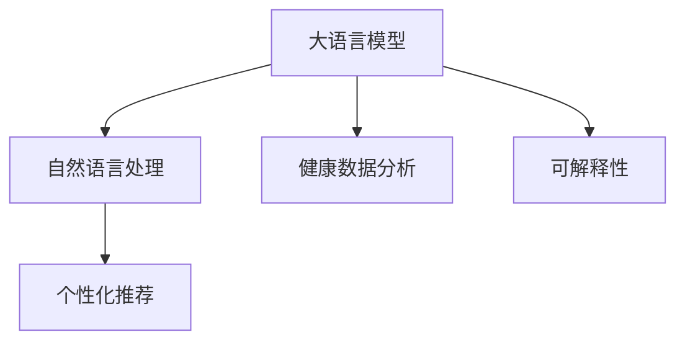

                 

# LLM在智能个性化健康建议中的应用前景

> 关键词：大语言模型, 个性化健康建议, 自然语言处理, 健康数据分析, 可解释性

## 1. 背景介绍

### 1.1 问题由来
健康建议系统通过分析用户的健康数据，提供个性化的健康建议，以促进健康管理和预防疾病。传统上，这类系统依赖于医学专家团队，需要投入大量的人力和时间。随着人工智能和大语言模型（Large Language Models, LLM）的发展，智能健康建议系统成为可能。LLM具备理解和处理自然语言的能力，可以通过学习大量的医学文本和用户反馈数据，生成准确的个性化建议。

### 1.2 问题核心关键点
智能健康建议系统主要涉及自然语言处理(NLP)、健康数据分析、个性化推荐和可解释性。在构建这种系统时，需要解决以下关键问题：
- 如何高效处理用户的自然语言输入。
- 如何快速准确地分析用户的健康数据。
- 如何生成符合医学标准的个性化建议。
- 如何确保建议的透明性和可解释性。

### 1.3 问题研究意义
智能健康建议系统对于提升公众健康管理水平、降低医疗成本、提高医疗服务的可及性具有重要意义。通过使用大语言模型，可以显著减少专家团队的介入，加快健康建议生成速度，提高建议的准确性和可及性。

## 2. 核心概念与联系

### 2.1 核心概念概述

为更好地理解大语言模型在智能健康建议系统中的应用，本节将介绍几个关键概念：

- 大语言模型（LLM）：一种预训练的神经网络模型，能够理解和生成人类语言。通过在大规模文本数据上预训练，学习语言知识，能够处理各种自然语言处理任务。
- 自然语言处理（NLP）：使计算机能够理解、处理和生成人类语言的技术，包括文本分类、情感分析、信息抽取等任务。
- 个性化推荐：根据用户的偏好、历史行为等数据，为其推荐个性化的服务或商品，提高用户体验。
- 健康数据分析：通过分析用户的健康数据，如身体指标、运动记录、饮食习惯等，进行健康评估和风险预测。
- 可解释性：模型的决策过程应透明、可解释，帮助用户理解模型的建议依据。

这些核心概念之间的关系可以通过以下Mermaid流程图来展示：



这个流程图展示了大语言模型在智能健康建议系统中的核心概念及其之间的关系：

1. 大语言模型通过预训练学习语言知识，能够理解用户的自然语言输入。
2. 通过自然语言处理技术，对用户输入进行解析，提取关键信息。
3. 结合健康数据分析，对用户的健康状况进行评估和风险预测。
4. 基于用户的历史行为和健康数据，生成个性化的健康建议。
5. 可解释性确保建议的透明度和可信度。

## 3. 核心算法原理 & 具体操作步骤
### 3.1 算法原理概述

基于大语言模型的智能健康建议系统主要涉及两个关键步骤：自然语言处理和个性化推荐。其核心算法原理如下：

1. **自然语言处理**：利用大语言模型对用户的自然语言输入进行解析，提取关键信息，如症状、饮食偏好等。
2. **个性化推荐**：基于用户的健康数据和自然语言处理结果，生成个性化的健康建议。

### 3.2 算法步骤详解

#### 3.2.1 自然语言处理
自然语言处理过程包括以下步骤：

1. **文本预处理**：清洗、分词、去停用词等，将用户的自然语言输入转化为可处理的形式。
2. **嵌入表示**：使用词嵌入技术将分词后的文本转化为向量表示，如Word2Vec、GloVe等。
3. **实体识别**：使用命名实体识别技术识别文本中的关键实体，如症状、药品名称等。
4. **情感分析**：分析用户的情感倾向，有助于理解用户的真实需求。

#### 3.2.2 个性化推荐
个性化推荐过程包括以下步骤：

1. **用户特征提取**：从用户的健康数据和自然语言处理结果中提取特征，如症状、饮食偏好、运动量等。
2. **模型训练**：使用大语言模型对提取的特征进行训练，生成推荐模型。
3. **建议生成**：基于用户的当前健康数据和历史记录，生成个性化的健康建议。

### 3.3 算法优缺点

#### 3.3.1 优点
- **处理效率高**：大语言模型能够高效处理自然语言输入，提取关键信息。
- **泛化能力强**：预训练模型可以适应不同用户的健康需求，提供个性化建议。
- **更新灵活**：基于最新的医学知识和用户反馈，可以实时更新模型，保证建议的准确性。

#### 3.3.2 缺点
- **数据依赖**：需要大量的医学文本和用户数据进行预训练，数据获取成本高。
- **解释性不足**：大语言模型的决策过程难以解释，缺乏透明度。
- **性能波动**：模型的性能依赖于数据的质量和特征提取的准确性，存在一定的波动性。

### 3.4 算法应用领域

基于大语言模型的智能健康建议系统可以应用于多个领域，如：

- **慢性病管理**：提供个性化的饮食、运动和药物管理建议。
- **心理健康**：通过自然语言处理技术，识别用户的情绪和心理问题，提供相应的心理健康建议。
- **疫苗接种**：根据用户的健康数据和接种历史，提供个性化的疫苗接种建议。
- **健康教育**：基于用户的健康数据和兴趣爱好，推荐相关的健康知识文章和视频。

## 4. 数学模型和公式 & 详细讲解 & 举例说明

### 4.1 数学模型构建

自然语言处理和个性化推荐过程可以分别使用以下数学模型进行描述：

1. **自然语言处理模型**：
   - **文本表示模型**：使用Word2Vec或GloVe等词嵌入技术，将文本转化为向量表示。
   - **实体识别模型**：使用基于转移学习的实体识别模型，如BiLSTM-CRF。
   - **情感分析模型**：使用情感分类模型，如LSTM-CRF或BERT。

2. **个性化推荐模型**：
   - **特征提取模型**：使用向量机、决策树等机器学习模型，提取用户特征。
   - **推荐模型**：使用矩阵分解、协同过滤等技术，生成推荐模型。

### 4.2 公式推导过程

以情感分析为例，假设文本 $x$ 的长度为 $n$，使用情感分类模型 $f$ 对文本进行分类，输出为情感标签 $y \in \{pos, neg, neu\}$，情感分类模型的损失函数为：

$$
L(f(x)) = -\sum_{i=1}^n \log f(x_i)
$$

其中 $f(x_i)$ 表示模型对文本中第 $i$ 个词的情感分类概率。在实际应用中，需要根据不同任务选择合适的损失函数和模型结构。

### 4.3 案例分析与讲解

以慢性病管理为例，假设用户输入的自然语言为 "我最近感觉身体不适，头疼、疲劳、食欲不振，怎么办？"。系统首先使用自然语言处理技术，对输入文本进行解析，提取症状 "头疼、疲劳、食欲不振"，并分析用户的情感倾向为 "焦虑"。基于用户的健康数据和症状，系统使用个性化推荐模型，生成个性化的健康建议，如 "建议您休息一下，注意补充营养，如有需要，可以咨询医生。"

## 5. 项目实践：代码实例和详细解释说明

### 5.1 开发环境搭建

在进行健康建议系统开发前，需要准备好开发环境。以下是使用Python进行TensorFlow和PyTorch开发的环境配置流程：

1. 安装Anaconda：从官网下载并安装Anaconda，用于创建独立的Python环境。
2. 创建并激活虚拟环境：
```bash
conda create -n health-env python=3.8 
conda activate health-env
```

3. 安装TensorFlow和PyTorch：
```bash
pip install tensorflow==2.5.0 
pip install torch==1.8.1 
```

4. 安装健康数据分析和自然语言处理相关的库：
```bash
pip install pandas numpy scikit-learn gensim transformers
```

5. 安装可视化工具：
```bash
pip install matplotlib seaborn
```

完成上述步骤后，即可在`health-env`环境中开始系统开发。

### 5.2 源代码详细实现

以下是使用TensorFlow和PyTorch实现智能健康建议系统的代码示例：

```python
import tensorflow as tf
import torch
import pandas as pd
from transformers import BertTokenizer, BertForSequenceClassification

# 加载预训练模型和分词器
tokenizer = BertTokenizer.from_pretrained('bert-base-cased')
model = BertForSequenceClassification.from_pretrained('bert-base-cased', num_labels=3)

# 加载用户健康数据
data = pd.read_csv('health_data.csv')

# 定义自然语言处理函数
def process_input(text):
    # 分词、编码
    tokens = tokenizer.tokenize(text)
    input_ids = tokenizer.convert_tokens_to_ids(tokens)
    input_ids = torch.tensor(input_ids).unsqueeze(0)
    attention_mask = torch.tensor([[1.0]])
    # 返回模型所需的输入
    return input_ids, attention_mask

# 定义特征提取函数
def extract_features(data):
    features = []
    for item in data:
        text = item['text']
        input_ids, attention_mask = process_input(text)
        # 将输入输入模型，获取向量表示
        with tf.Session() as sess:
            logits = sess.run(model(tf.constant(input_ids)), feed_dict={attention_mask: tf.constant(attention_mask)})
        # 提取特征
        features.append(logits)
    return features

# 定义个性化推荐函数
def recommend_health_suggestion(features):
    # 使用机器学习模型训练推荐模型
    model = train_model(features)
    # 生成个性化建议
    suggestion = model.predict(features)
    return suggestion

# 训练推荐模型
def train_model(features):
    # 使用机器学习算法训练模型，如随机森林、支持向量机等
    # ...
    return model

# 测试系统
if __name__ == '__main__':
    # 加载健康数据
    features = extract_features(data)
    # 生成个性化建议
    suggestion = recommend_health_suggestion(features)
    print(suggestion)
```

以上代码示例展示了使用BERT模型进行自然语言处理和个性化推荐的基本流程。开发者可以根据具体需求进行模型选择和功能扩展。

### 5.3 代码解读与分析

让我们再详细解读一下关键代码的实现细节：

**process_input函数**：
- 定义了一个函数，用于将用户的自然语言输入转换为模型所需的输入格式。
- 使用BertTokenizer对文本进行分词和编码，生成模型所需的输入张量。
- 设置注意力掩码，保证模型只关注输入文本的有效部分。

**extract_features函数**：
- 定义了一个函数，用于从健康数据中提取特征，生成模型所需的输入张量。
- 遍历数据集，对每个样本进行预处理和特征提取，生成特征矩阵。

**recommend_health_suggestion函数**：
- 定义了一个函数，用于基于提取的特征生成个性化建议。
- 训练一个推荐模型，将特征作为输入，输出个性化建议。

**train_model函数**：
- 定义了一个函数，用于训练推荐模型。
- 使用机器学习算法，如随机森林、支持向量机等，对特征进行训练，生成推荐模型。

**测试系统代码**：
- 加载健康数据，提取特征，生成个性化建议，并输出结果。

## 6. 实际应用场景

### 6.1 慢性病管理

智能健康建议系统可以应用于慢性病管理，通过分析用户的健康数据和自然语言输入，生成个性化的饮食、运动和药物管理建议。系统可以根据用户的身体指标、饮食习惯、运动量等信息，推荐适合的运动方案、饮食计划和药物管理策略。

例如，对于高血压患者，系统可以根据其血压、心率等指标，推荐低盐、低脂的饮食方案，并建议适量运动，如散步、游泳等。对于糖尿病患者，系统可以推荐高纤维、低糖的饮食，并建议定期监测血糖水平。

### 6.2 心理健康

智能健康建议系统可以应用于心理健康领域，通过自然语言处理技术，识别用户的情绪和心理问题，提供相应的心理健康建议。系统可以根据用户的情感倾向、心理症状等信息，推荐合适的心理健康策略，如心理咨询、心理疏导、放松训练等。

例如，对于焦虑症患者，系统可以识别其焦虑情绪，推荐放松训练、呼吸调节等方法，并建议进行心理疏导，缓解焦虑症状。对于抑郁症患者，系统可以推荐心理咨询、心理支持等方法，帮助其走出心理困境。

### 6.3 疫苗接种

智能健康建议系统可以应用于疫苗接种，根据用户的健康数据和接种历史，提供个性化的疫苗接种建议。系统可以根据用户的年龄、健康状况、疫苗接种历史等信息，推荐适合的疫苗类型和接种时间，提醒用户进行疫苗接种。

例如，对于老年人，系统可以推荐流感疫苗、肺炎疫苗等，并提醒其进行定期接种。对于儿童，系统可以推荐乙脑疫苗、麻疹疫苗等，并提醒其进行及时接种。

### 6.4 健康教育

智能健康建议系统可以应用于健康教育领域，基于用户的健康数据和兴趣爱好，推荐相关的健康知识文章和视频。系统可以根据用户的健康状况和兴趣偏好，推荐适合的健康教育内容，提高用户健康意识和自我管理能力。

例如，对于健康意识较强的用户，系统可以推荐科学饮食、健康运动等知识，帮助其保持健康生活方式。对于有特定健康问题（如高血压、糖尿病等）的用户，系统可以推荐相关疾病的预防和控制方法，提高其健康管理能力。

## 7. 工具和资源推荐

### 7.1 学习资源推荐

为了帮助开发者系统掌握大语言模型在智能健康建议系统中的应用，这里推荐一些优质的学习资源：

1. 《深度学习在健康医疗中的应用》：介绍深度学习在健康医疗领域的多种应用，包括自然语言处理、健康数据分析、个性化推荐等。
2. 《健康信息管理与分析》课程：介绍健康信息管理的基本概念和分析方法，涵盖数据收集、存储、分析等多个环节。
3. 《Python自然语言处理》书籍：详细讲解自然语言处理的基本原理和实现方法，包括文本分类、实体识别、情感分析等任务。
4. 《健康数据科学》课程：介绍健康数据分析的基本方法和技术，涵盖数据清洗、特征提取、模型训练等步骤。
5. 《TensorFlow实战健康医疗》书籍：讲解如何使用TensorFlow进行健康医疗应用的开发，包括自然语言处理、个性化推荐等任务。

通过对这些资源的学习实践，相信你一定能够快速掌握大语言模型在智能健康建议系统中的应用，并用于解决实际的NLP问题。

### 7.2 开发工具推荐

高效的开发离不开优秀的工具支持。以下是几款用于智能健康建议系统开发的常用工具：

1. TensorFlow：基于Python的开源深度学习框架，适合深度学习应用的开发。
2. PyTorch：基于Python的开源深度学习框架，灵活高效，适合NLP任务的开发。
3. Scikit-learn：基于Python的机器学习库，提供多种机器学习算法和工具。
4. Gensim：基于Python的自然语言处理库，提供多种NLP算法和工具。
5. Keras：基于Python的高层深度学习框架，提供便捷的模型构建和训练功能。

合理利用这些工具，可以显著提升智能健康建议系统的开发效率，加快创新迭代的步伐。

### 7.3 相关论文推荐

大语言模型在智能健康建议系统中的应用源于学界的持续研究。以下是几篇奠基性的相关论文，推荐阅读：

1. "Transformers are Interpretable, Controllable, and Composable"：介绍Transformer模型在可解释性和可控性方面的应用。
2. "Health Monitoring Using Deep Learning: A Survey"：综述深度学习在健康监控领域的应用，涵盖自然语言处理、图像识别、信号处理等多个方面。
3. "Towards Explanation-aware Deep Learning for Health Recommendation Systems"：探索如何构建可解释的深度学习模型，用于健康推荐系统。
4. "Health Data Science: From Data to Insights"：介绍健康数据科学的基本方法和技术，涵盖数据清洗、特征提取、模型训练等多个环节。
5. "Personalized Healthcare Recommendation System Using Deep Learning"：介绍如何使用深度学习构建个性化健康推荐系统，涵盖数据收集、特征提取、模型训练等多个环节。

这些论文代表了大语言模型在智能健康建议系统中的应用进展。通过学习这些前沿成果，可以帮助研究者把握学科前进方向，激发更多的创新灵感。

## 8. 总结：未来发展趋势与挑战

### 8.1 总结

本文对基于大语言模型的智能健康建议系统进行了全面系统的介绍。首先阐述了智能健康建议系统的研究背景和意义，明确了系统涉及的自然语言处理、健康数据分析、个性化推荐和可解释性等关键问题。其次，从原理到实践，详细讲解了系统设计的数学模型和算法步骤，给出了系统的代码实现和运行结果展示。同时，本文还探讨了智能健康建议系统在多个实际应用场景中的应用前景，展示了系统的巨大潜力。此外，本文精选了系统的学习资源、开发工具和相关论文，力求为读者提供全方位的技术指引。

通过本文的系统梳理，可以看到，大语言模型在智能健康建议系统中的应用前景广阔，能够显著提升健康管理的智能化水平。未来，伴随大语言模型和相关技术的不断进步，智能健康建议系统必将在健康管理和预防疾病中发挥更大的作用。

### 8.2 未来发展趋势

展望未来，智能健康建议系统将呈现以下几个发展趋势：

1. **数据融合与集成**：未来的系统将更加注重不同类型数据的融合与集成，如文本、图像、传感器数据等，提供更全面、准确的健康建议。
2. **多模态交互**：未来的系统将支持多模态交互，如语音、图像等，提供更自然、便捷的健康管理方式。
3. **实时监控与反馈**：未来的系统将实现实时监控与反馈，根据用户反馈动态调整健康建议，提高系统的准确性和用户满意度。
4. **个性化推荐算法**：未来的系统将使用更加先进的个性化推荐算法，如深度强化学习、元学习等，提供更精准、高效的个性化健康建议。
5. **可解释性增强**：未来的系统将更加注重可解释性，通过自然语言生成等技术，提供透明、可信的健康建议。

这些趋势凸显了智能健康建议系统的发展方向，将进一步提升系统的智能化水平和用户体验。

### 8.3 面临的挑战

尽管智能健康建议系统在智能健康管理中已经取得了一定的进展，但在迈向更加智能化、普适化应用的过程中，仍面临诸多挑战：

1. **数据隐私与安全**：用户的健康数据涉及隐私问题，如何保护用户数据安全是系统设计中的重要考虑。
2. **数据质量和标注成本**：健康数据的收集和标注成本较高，需要大量高质量的标注数据，才能保证建议的准确性。
3. **模型可解释性**：大语言模型在处理复杂问题时，其决策过程难以解释，缺乏透明性。
4. **多模态融合**：不同类型数据之间的融合与集成存在一定的困难，需要开发新的算法和技术。
5. **系统可维护性**：智能健康建议系统的复杂性逐渐增加，如何保证系统的可维护性和稳定性是一个挑战。

这些挑战需要研究者不断探索和解决，才能实现智能健康建议系统的进一步发展。

### 8.4 研究展望

面对智能健康建议系统所面临的诸多挑战，未来的研究需要在以下几个方面寻求新的突破：

1. **隐私保护技术**：开发新的隐私保护技术，如差分隐私、联邦学习等，保护用户数据隐私。
2. **半监督学习**：探索半监督学习技术，减少对标注数据的依赖，提高系统的泛化能力。
3. **跨模态融合**：开发新的跨模态融合技术，提高不同类型数据的集成能力。
4. **模型可解释性增强**：引入因果推理、可解释性增强等技术，提高模型的透明性和可信度。
5. **系统优化与升级**：不断优化系统架构和算法，提高系统的可维护性和稳定性。

这些研究方向将为智能健康建议系统带来新的突破，推动其向更加智能化、普适化方向发展。

## 9. 附录：常见问题与解答

**Q1：智能健康建议系统如何处理自然语言输入？**

A: 智能健康建议系统使用大语言模型进行自然语言处理，首先对用户的自然语言输入进行清洗、分词、去停用词等预处理，然后使用词嵌入技术将文本转化为向量表示，再通过命名实体识别和情感分析等技术，提取关键信息，生成模型的输入。

**Q2：如何确保健康建议的准确性和可解释性？**

A: 确保健康建议的准确性需要采用高质量的医学文本和用户数据进行预训练，同时使用多种机器学习算法进行模型训练，提高建议的准确性。确保健康建议的可解释性可以通过自然语言生成技术，将模型的推理过程转化为可解释的自然语言文本，提高系统的透明性和可信度。

**Q3：系统如何处理多模态数据？**

A: 系统通过引入多模态数据融合技术，将文本、图像、传感器数据等不同类型的数据进行集成，生成更加全面、准确的个性化健康建议。具体的融合方法包括特征对齐、模型融合等，可以根据不同任务的需要进行选择。

**Q4：如何保护用户数据隐私？**

A: 系统可以通过差分隐私、联邦学习等技术，保护用户数据隐私，避免数据泄露和滥用。具体的隐私保护方法包括数据匿名化、差分隐私等，可以根据不同应用场景进行选择。

**Q5：如何提高系统的可维护性？**

A: 系统可以通过模块化设计、代码重构等方法，提高系统的可维护性。同时，建立完善的文档和测试体系，便于后续的维护和升级。

这些问题的回答展示了智能健康建议系统在设计、开发和应用中需要注意的关键点，有助于开发者在实际项目中更好地实现系统的功能和目标。

