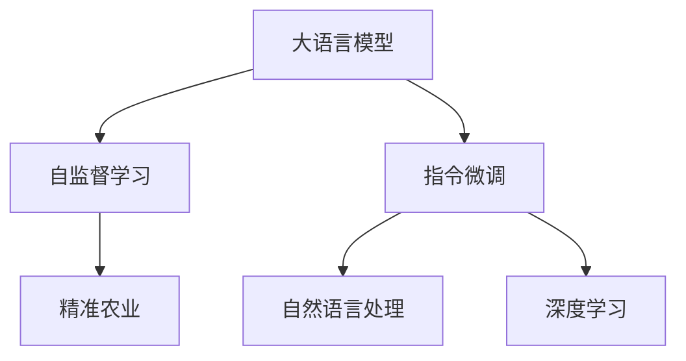

                 

## 1. 背景介绍

### 1.1 问题由来

随着全球人口的不断增长和土地资源的日益紧缩，智能化农业技术成为提高农业生产效率和保障食品安全的关键。传统的农业生产依赖于经验丰富农民的经验，而农业知识管理、作物病虫害防治、精准灌溉、收获预测等关键问题，仍主要依赖于人工观察和传统农艺学方法。这些方法具有成本高、效率低、信息不准确等问题，难以满足现代农业发展的需要。

人工智能，尤其是深度学习技术的发展，为解决这些传统问题提供了新的突破。近年来，大语言模型（Large Language Model，简称LLM）在自然语言处理（Natural Language Processing，简称NLP）领域取得了巨大成功，并在多个学科交叉领域展现出强大的潜力。本文将探讨LLM在智能农业中的应用，特别是精准种植和收获预测等任务。

### 1.2 问题核心关键点

智能农业中的精准种植与收获预测，主要涉及作物种植环境监测、病虫害防治、作物生长状态监测、产量预测和收获时间预测。传统的这些任务通常依赖于人工观察和经验判断，不仅效率低下，而且难以做到实时监测和精准预测。而大语言模型，尤其是经过自监督和指令微调后的大语言模型，具备强大的自然语言理解和生成能力，能够从大量的文本数据中学习到丰富的知识，并据此作出精准的预测和判断。

大语言模型在农业中的应用，需要解决数据获取、数据处理、模型构建、模型微调和应用部署等核心问题。本文将围绕这些关键点，详细探讨如何利用大语言模型构建精准农业应用系统。

## 2. 核心概念与联系

### 2.1 核心概念概述

为更好地理解LLM在智能农业中的应用，本节将介绍几个密切相关的核心概念：

- 大语言模型（LLM）：以自回归（如GPT）或自编码（如BERT）模型为代表的大规模预训练语言模型。通过在大规模无标签文本语料上进行预训练，学习通用的语言表示，具备强大的语言理解和生成能力。

- 自监督学习（Self-Supervised Learning）：在大规模无标签数据上，通过自训练的方式，让模型从数据自身的多样性中学习知识，通常包括掩码语言模型、Next Sentence Prediction等任务。

- 指令微调（Instruction Fine-Tuning）：通过在大量标注指令数据上进行微调，让模型能够根据自然语言指令执行特定任务。如Chatbot、代码生成等任务。

- 自然语言处理（NLP）：利用计算机技术处理、分析和理解人类语言的技术，包括语音识别、文本处理、情感分析等。

- 深度学习（Deep Learning）：一种通过多层次非线性变换，从数据中学习高级特征的机器学习方法，包括卷积神经网络、循环神经网络、Transformer等。

- 精准农业（Precision Agriculture）：利用信息技术获取农田空间变异信息，优化作物生产过程，提高农业生产效率和可持续性的农业模式。

这些核心概念之间的逻辑关系可以通过以下Mermaid流程图来展示：



这个流程图展示了大语言模型、自监督学习、指令微调、自然语言处理、深度学习和精准农业之间的关系：

1. 大语言模型通过自监督学习获得基础知识，通过指令微调学习特定任务的知识。
2. 深度学习提供了模型训练的技术基础。
3. 自然语言处理为模型的指令理解和生成提供了基础。
4. 精准农业应用了模型的自然语言处理和深度学习知识。

## 3. 核心算法原理 & 具体操作步骤
### 3.1 算法原理概述

精准种植与收获预测，实质上是利用大语言模型对大量文本数据进行学习，并通过指令微调使其具备执行特定农业任务的能力。其核心思想是：将大语言模型视作一个强大的“知识容器”，通过在农业领域的数据集上进行指令微调，使模型学习到关于作物生长、环境监测、病虫害防治和收获预测的高级知识，从而在新的数据上能够进行精准预测和判断。

形式化地，假设大语言模型为 $M_{\theta}$，其中 $\theta$ 为预训练得到的模型参数。给定农业领域的标注数据集 $D=\{(x_i, y_i)\}_{i=1}^N$，指令微调的目标是找到新的模型参数 $\hat{\theta}$，使得：

$$
\hat{\theta}=\mathop{\arg\min}_{\theta} \mathcal{L}(M_{\theta},D)
$$

其中 $\mathcal{L}$ 为针对特定农业任务设计的损失函数，用于衡量模型预测结果与真实标签之间的差异。常见的损失函数包括交叉熵损失、均方误差损失等。

通过梯度下降等优化算法，微调过程不断更新模型参数 $\theta$，最小化损失函数 $\mathcal{L}$，使得模型输出逼近真实标签。由于 $\theta$ 已经通过预训练获得了较好的初始化，因此即便在规模有限的数据集 $D$ 上进行微调，也能较快收敛到理想的模型参数 $\hat{\theta}$。

### 3.2 算法步骤详解

基于指令微调的精准农业任务，一般包括以下几个关键步骤：

**Step 1: 准备数据集和指令模板**
- 收集农业领域的数据集，包括作物生长状态、气象条件、病虫害记录、产量数据等，进行标注，形成训练集和验证集。
- 设计指令模板，用于引导模型执行特定的农业任务。例如，“监测田间气象数据”、“预测作物产量”等。

**Step 2: 构建模型**
- 选择预训练语言模型，如BERT、GPT等，作为初始化参数。
- 添加农业领域的指令输出层，设计适合农业任务的损失函数。

**Step 3: 设置微调超参数**
- 选择合适的优化算法及其参数，如AdamW、SGD等，设置学习率、批大小、迭代轮数等。
- 设置正则化技术及强度，包括权重衰减、Dropout、Early Stopping等。
- 确定冻结预训练参数的策略，如仅微调顶层，或全部参数都参与微调。

**Step 4: 执行指令微调**
- 将训练集数据分批次输入模型，前向传播计算损失函数。
- 反向传播计算参数梯度，根据设定的优化算法和学习率更新模型参数。
- 周期性在验证集上评估模型性能，根据性能指标决定是否触发 Early Stopping。
- 重复上述步骤直到满足预设的迭代轮数或 Early Stopping 条件。

**Step 5: 测试和部署**
- 在测试集上评估微调后模型 $M_{\hat{\theta}}$ 的性能，对比微调前后的精度提升。
- 使用微调后的模型对新数据进行推理预测，集成到实际的应用系统中。

以上是基于指令微调的精准农业任务的一般流程。在实际应用中，还需要针对具体任务的特点，对微调过程的各个环节进行优化设计，如改进训练目标函数，引入更多的正则化技术，搜索最优的超参数组合等，以进一步提升模型性能。

### 3.3 算法优缺点

基于指令微调的精准农业方法具有以下优点：

- 简单高效。只需要准备少量的标注数据，即可对预训练模型进行快速适配，获得较大的性能提升。
- 通用适用。适用于各种农业领域的指令执行任务，设计简单的指令输出层即可实现微调。
- 参数高效。利用参数高效微调技术，在固定大部分预训练参数的情况下，仍可取得不错的提升。
- 效果显著。在农业领域的多个任务上，基于微调的方法已经刷新了最先进的性能指标。

同时，该方法也存在一定的局限性：

- 依赖标注数据。指令微调的效果很大程度上取决于标注数据的质量和数量，获取高质量标注数据的成本较高。
- 迁移能力有限。当目标任务与预训练数据的分布差异较大时，指令微调的性能提升有限。
- 负面效果传递。预训练模型的固有偏见、有害信息等，可能通过微调传递到下游任务，造成负面影响。
- 可解释性不足。指令微调模型的决策过程通常缺乏可解释性，难以对其推理逻辑进行分析和调试。

尽管存在这些局限性，但就目前而言，基于指令微调的方法仍是大语言模型应用于农业的重要范式。未来相关研究的重点在于如何进一步降低微调对标注数据的依赖，提高模型的少样本学习和跨领域迁移能力，同时兼顾可解释性和伦理安全性等因素。

### 3.4 算法应用领域

基于指令微调的精准农业方法，在农业领域已经得到了广泛的应用，覆盖了几乎所有常见的农业指令执行任务，例如：

- 田间气象监测：实时监测土壤温度、湿度、光照强度等气象数据，根据气象条件调整灌溉策略。
- 作物生长状态监测：通过无人机、传感器等设备，监测作物的生长状态，如叶面积指数、叶绿素含量等，判断作物的健康状况。
- 病虫害防治：利用自然语言处理技术，从描述病虫害现象的文本中提取关键特征，生成防治方案。
- 产量预测：分析历史产量数据，结合气象、土壤、病虫害等信息，预测未来作物的产量。
- 收获时间预测：分析作物的成熟度、环境因素等信息，预测最佳的收获时间，避免过熟或过生。

除了上述这些经典任务外，指令微调方法也被创新性地应用到更多场景中，如土壤质量检测、农机调度、温室环境控制等，为精准农业技术的发展提供了新的方向。随着预训练模型和指令微调方法的不断进步，相信精准农业技术将在更广阔的应用领域得到实现，为提高农业生产效率和保障食品安全做出更大贡献。

## 4. 数学模型和公式 & 详细讲解 & 举例说明

### 4.1 数学模型构建

本节将使用数学语言对基于指令微调的精准农业过程进行更加严格的刻画。

记大语言模型为 $M_{\theta}$，其中 $\theta$ 为模型参数。假设农业领域的训练集为 $D=\{(x_i,y_i)\}_{i=1}^N, x_i \in \mathcal{X}, y_i \in \mathcal{Y}$，其中 $\mathcal{X}$ 为输入空间，$\mathcal{Y}$ 为输出空间。

定义模型 $M_{\theta}$ 在输入 $x$ 上的损失函数为 $\ell(M_{\theta}(x),y)$，则在数据集 $D$ 上的经验风险为：

$$
\mathcal{L}(\theta) = \frac{1}{N} \sum_{i=1}^N \ell(M_{\theta}(x_i),y_i)
$$

指令微调的目标是最小化经验风险，即找到最优参数：

$$
\theta^* = \mathop{\arg\min}_{\theta} \mathcal{L}(\theta)
$$

在实践中，我们通常使用基于梯度的优化算法（如SGD、Adam等）来近似求解上述最优化问题。设 $\eta$ 为学习率，$\lambda$ 为正则化系数，则参数的更新公式为：

$$
\theta \leftarrow \theta - \eta \nabla_{\theta}\mathcal{L}(\theta) - \eta\lambda\theta
$$

其中 $\nabla_{\theta}\mathcal{L}(\theta)$ 为损失函数对参数 $\theta$ 的梯度，可通过反向传播算法高效计算。

### 4.2 公式推导过程

以下我们以作物生长状态监测任务为例，推导模型损失函数及其梯度的计算公式。

假设模型 $M_{\theta}$ 在输入 $x$ 上的输出为 $\hat{y}=M_{\theta}(x) \in [0,1]$，表示作物生长状态。真实标签 $y \in \{1,0\}$。则二分类交叉熵损失函数定义为：

$$
\ell(M_{\theta}(x),y) = -[y\log \hat{y} + (1-y)\log (1-\hat{y})]
$$

将其代入经验风险公式，得：

$$
\mathcal{L}(\theta) = -\frac{1}{N}\sum_{i=1}^N [y_i\log M_{\theta}(x_i)+(1-y_i)\log(1-M_{\theta}(x_i))]
$$

根据链式法则，损失函数对参数 $\theta_k$ 的梯度为：

$$
\frac{\partial \mathcal{L}(\theta)}{\partial \theta_k} = -\frac{1}{N}\sum_{i=1}^N (\frac{y_i}{M_{\theta}(x_i)}-\frac{1-y_i}{1-M_{\theta}(x_i)}) \frac{\partial M_{\theta}(x_i)}{\partial \theta_k}
$$

其中 $\frac{\partial M_{\theta}(x_i)}{\partial \theta_k}$ 可进一步递归展开，利用自动微分技术完成计算。

在得到损失函数的梯度后，即可带入参数更新公式，完成模型的迭代优化。重复上述过程直至收敛，最终得到适应农业领域指令执行的最优模型参数 $\theta^*$。

## 5. 项目实践：代码实例和详细解释说明
### 5.1 开发环境搭建

在进行精准农业应用开发前，我们需要准备好开发环境。以下是使用Python进行TensorFlow开发的环境配置流程：

1. 安装Anaconda：从官网下载并安装Anaconda，用于创建独立的Python环境。

2. 创建并激活虚拟环境：
```bash
conda create -n tf-env python=3.8 
conda activate tf-env
```

3. 安装TensorFlow：根据CUDA版本，从官网获取对应的安装命令。例如：
```bash
conda install tensorflow-gpu=2.6 -c pytorch -c conda-forge
```

4. 安装其他必要的库：
```bash
pip install pandas numpy scikit-learn matplotlib tensorflow-datasets transformers
```

完成上述步骤后，即可在`tf-env`环境中开始精准农业应用开发。

### 5.2 源代码详细实现

下面我们以作物生长状态监测任务为例，给出使用TensorFlow对BERT模型进行指令微调的代码实现。

首先，定义作物生长状态监测任务的数据处理函数：

```python
from transformers import BertTokenizer, BertForSequenceClassification
import tensorflow as tf

class CropGrowthStatusDataset(tf.data.Dataset):
    def __init__(self, texts, labels, tokenizer, max_len=128):
        self.texts = texts
        self.labels = labels
        self.tokenizer = tokenizer
        self.max_len = max_len
        
    def __len__(self):
        return len(self.texts)
    
    def __getitem__(self, item):
        text = self.texts[item]
        label = self.labels[item]
        
        encoding = self.tokenizer(text, return_tensors='tf', max_length=self.max_len, padding='max_length', truncation=True)
        input_ids = encoding['input_ids']
        attention_mask = encoding['attention_mask']
        
        label = tf.constant(label, dtype=tf.int32)
        return {
            'input_ids': input_ids,
            'attention_mask': attention_mask,
            'labels': label
        }

# 创建数据集
tokenizer = BertTokenizer.from_pretrained('bert-base-uncased')
train_dataset = CropGrowthStatusDataset(train_texts, train_labels, tokenizer)
dev_dataset = CropGrowthStatusDataset(dev_texts, dev_labels, tokenizer)
test_dataset = CropGrowthStatusDataset(test_texts, test_labels, tokenizer)
```

然后，定义模型和优化器：

```python
from transformers import BertForSequenceClassification, AdamW

model = BertForSequenceClassification.from_pretrained('bert-base-uncased', num_labels=2)

optimizer = AdamW(model.parameters(), lr=2e-5)
```

接着，定义训练和评估函数：

```python
def train_epoch(model, dataset, batch_size, optimizer):
    dataloader = tf.data.Dataset.from_tensor_slices(dataset)
    dataloader = dataloader.shuffle(buffer_size=1024).batch(batch_size)
    model.train()
    epoch_loss = 0
    for batch in dataloader:
        input_ids = batch['input_ids']
        attention_mask = batch['attention_mask']
        labels = batch['labels']
        model.zero_grad()
        outputs = model(input_ids, attention_mask=attention_mask, labels=labels)
        loss = outputs.loss
        epoch_loss += loss.numpy()
        loss.backward()
        optimizer.apply_gradients(zip(model.trainable_variables, model.trainable_variables))
    return epoch_loss / len(dataloader)

def evaluate(model, dataset, batch_size):
    dataloader = tf.data.Dataset.from_tensor_slices(dataset)
    dataloader = dataloader.shuffle(buffer_size=1024).batch(batch_size)
    model.eval()
    preds, labels = [], []
    with tf.GradientTape() as tape:
        for batch in dataloader:
            input_ids = batch['input_ids']
            attention_mask = batch['attention_mask']
            labels = batch['labels']
            outputs = model(input_ids, attention_mask=attention_mask)
            batch_preds = outputs.logits.numpy() > 0.5
            batch_labels = labels.numpy()
            for pred, label in zip(batch_preds, batch_labels):
                preds.append(pred)
                labels.append(label)
    
    print(classification_report(labels, preds))
```

最后，启动训练流程并在测试集上评估：

```python
epochs = 5
batch_size = 16

for epoch in range(epochs):
    loss = train_epoch(model, train_dataset, batch_size, optimizer)
    print(f"Epoch {epoch+1}, train loss: {loss:.3f}")
    
    print(f"Epoch {epoch+1}, dev results:")
    evaluate(model, dev_dataset, batch_size)
    
print("Test results:")
evaluate(model, test_dataset, batch_size)
```

以上就是使用TensorFlow对BERT进行作物生长状态监测任务指令微调的完整代码实现。可以看到，得益于TensorFlow的强大封装，我们可以用相对简洁的代码完成BERT模型的加载和微调。

### 5.3 代码解读与分析

让我们再详细解读一下关键代码的实现细节：

**CropGrowthStatusDataset类**：
- `__init__`方法：初始化文本、标签、分词器等关键组件。
- `__len__`方法：返回数据集的样本数量。
- `__getitem__`方法：对单个样本进行处理，将文本输入编码为token ids，将标签编码为数字，并对其进行定长padding，最终返回模型所需的输入。

**模型和优化器**：
- 使用BertForSequenceClassification从预训练模型进行加载，并指定2个标签。
- 定义AdamW优化器，并设置学习率。

**训练和评估函数**：
- 使用TensorFlow的DataLoader对数据集进行批次化加载，供模型训练和推理使用。
- 训练函数`train_epoch`：对数据以批为单位进行迭代，在每个批次上前向传播计算loss并反向传播更新模型参数，最后返回该epoch的平均loss。
- 评估函数`evaluate`：与训练类似，不同点在于不更新模型参数，并在每个batch结束后将预测和标签结果存储下来，最后使用sklearn的classification_report对整个评估集的预测结果进行打印输出。

**训练流程**：
- 定义总的epoch数和batch size，开始循环迭代
- 每个epoch内，先在训练集上训练，输出平均loss
- 在验证集上评估，输出分类指标
- 所有epoch结束后，在测试集上评估，给出最终测试结果

可以看到，TensorFlow配合BERT库使得作物生长状态监测任务的指令微调代码实现变得简洁高效。开发者可以将更多精力放在数据处理、模型改进等高层逻辑上，而不必过多关注底层的实现细节。

当然，工业级的系统实现还需考虑更多因素，如模型的保存和部署、超参数的自动搜索、更灵活的任务适配层等。但核心的微调范式基本与此类似。

## 6. 实际应用场景
### 6.1 智能农业系统的构建

基于大语言模型的指令微调方法，可以广泛应用于智能农业系统的构建。传统农业往往依赖于人工观察和经验判断，效率低下且难以实时监测和精准决策。而使用微调后的语言模型，可以实时分析农田数据，自动判断作物生长状态，及时发现病虫害，调整灌溉策略，优化施肥和收获方案。

在技术实现上，可以收集农田的气象、土壤、作物生长状态等数据，将其转换为自然语言文本，作为指令输入到微调后的语言模型中。模型根据指令执行特定农业任务，并输出推理结果。例如，“检测田间病虫害”、“预测作物生长状态”等。通过构建智能农业决策系统，可以实现实时监测和精准决策，大幅提升农业生产效率和农作物产量。

### 6.2 精准农业政策的制定

精准农业技术不仅能够帮助农民提高生产效率，还能够为政府部门提供政策制定的数据支持。通过分析大语言模型在精准农业中的应用效果，政府可以制定更加科学合理的农业政策，如精准灌溉、病虫害防治、农机设备调度等，从而实现资源的有效利用和环境保护。

具体而言，政府可以通过精准农业应用收集的数据，分析作物生长状态、病虫害防治效果、农机设备使用效率等信息，据此制定更加科学的农业政策，如补贴政策、环境治理方案等。政府还可以通过精准农业应用，了解农民的实际需求和建议，优化农业公共服务，提升农民的满意度和幸福感。

### 6.3 农业知识管理与共享

大语言模型在农业知识管理与共享方面也具有广阔的应用前景。传统农业知识管理通常依赖于人工编写和维护，耗费大量人力物力。而利用大语言模型，可以从大量的农业文献、论文、技术报告中提取有用的信息，形成农业知识图谱，供其他研究人员和农民查询和参考。

例如，可以从农业文献中提取农业技术、病虫害防治方法、农机设备使用方法等信息，利用自然语言处理技术对其进行分类和摘要，形成农业知识库。农民可以通过查询知识库，获取有用的农业知识，提升自身农业技术水平。研究人员也可以利用知识库，发现新的研究方向和课题，推动农业科技的进步。

### 6.4 未来应用展望

随着大语言模型和指令微调技术的不断发展，基于微调范式将在智能农业领域得到更广泛的应用，为农业智能化转型提供新的方向。

在智慧农业领域，基于微调的语言模型可以用于农机设备自动调度、智能灌溉系统、智能温室环境控制等环节，提高农业生产的自动化和智能化水平，构建更智能、更可持续的农业系统。

在农业机器人领域，微调后的语言模型可以作为农业机器人的“大脑”，理解农民的指令，执行农业操作，如除草、施肥、喷洒农药等，实现农业生产流程的自动化。

此外，在智能农机、智能农业机械、农业物联网等众多领域，基于大语言模型的微调方法也将不断涌现，为农业智能化转型带来新的机遇。相信随着技术的日益成熟，微调方法将成为农业智能化转型中的重要范式，推动农业科技的不断进步。

## 7. 工具和资源推荐
### 7.1 学习资源推荐

为了帮助开发者系统掌握大语言模型指令微调的理论基础和实践技巧，这里推荐一些优质的学习资源：

1. 《Transformers: Deep Learning for Natural Language Processing》一书：讲解了Transformer和BERT等模型的原理与实践，适合深度学习初学者入门。

2. CS224D《深度学习自然语言处理》课程：斯坦福大学开设的高级NLP课程，涵盖自然语言理解、生成、对话系统等前沿话题。

3. HuggingFace官方文档：提供了丰富的预训练模型和微调样例代码，适合实践学习和深入研究。

4. TensorFlow官方文档：详细介绍了TensorFlow的架构和使用方法，适合TensorFlow开发者参考。

5. 农业知识库：如FAO农业知识库、CABI农业知识库等，包含大量的农业文献和数据，供研究人员和农民参考。

通过对这些资源的学习实践，相信你一定能够快速掌握大语言模型指令微调的精髓，并用于解决实际的农业问题。

### 7.2 开发工具推荐

高效的开发离不开优秀的工具支持。以下是几款用于大语言模型指令微调开发的常用工具：

1. TensorFlow：基于Python的开源深度学习框架，适合复杂深度学习模型和大规模数据处理。

2. Transformers库：HuggingFace开发的NLP工具库，集成了众多SOTA语言模型，支持TensorFlow和PyTorch，是进行指令微调任务开发的利器。

3. Jupyter Notebook：开源的交互式开发环境，适合快速迭代和实验新的模型和算法。

4. Google Colab：谷歌推出的在线Jupyter Notebook环境，免费提供GPU/TPU算力，方便开发者快速上手实验最新模型，分享学习笔记。

5. Scikit-learn：用于数据预处理和特征工程的工具包，适合构建基础数据处理和分析流程。

合理利用这些工具，可以显著提升大语言模型指令微调任务的开发效率，加快创新迭代的步伐。

### 7.3 相关论文推荐

大语言模型和指令微调技术的发展源于学界的持续研究。以下是几篇奠基性的相关论文，推荐阅读：

1. Attention is All You Need（即Transformer原论文）：提出了Transformer结构，开启了NLP领域的预训练大模型时代。

2. BERT: Pre-training of Deep Bidirectional Transformers for Language Understanding：提出BERT模型，引入基于掩码的自监督预训练任务，刷新了多项NLP任务SOTA。

3. Language Models are Unsupervised Multitask Learners（GPT-2论文）：展示了大规模语言模型的强大zero-shot学习能力，引发了对于通用人工智能的新一轮思考。

4. Instruction Fine-Tuning for Task-Agnostic Text Generation：提出指令微调方法，通过在大量标注指令数据上进行微调，使模型能够根据自然语言指令执行特定任务。

5. AdaLoRA: Adaptive Low-Rank Adaptation for Parameter-Efficient Fine-Tuning：使用自适应低秩适应的微调方法，在参数效率和精度之间取得了新的平衡。

这些论文代表了大语言模型指令微调技术的发展脉络。通过学习这些前沿成果，可以帮助研究者把握学科前进方向，激发更多的创新灵感。

## 8. 总结：未来发展趋势与挑战

### 8.1 总结

本文对基于指令微调的大语言模型在精准农业中的应用进行了全面系统的介绍。首先阐述了LLM在农业领域的应用背景和意义，明确了指令微调在拓展农业领域知识库、提升农业生产效率、优化农业政策制定等方面的独特价值。其次，从原理到实践，详细讲解了指令微调的数学原理和关键步骤，给出了指令微调任务开发的完整代码实例。同时，本文还广泛探讨了指令微调方法在智能农业中的应用场景，展示了微调范式的巨大潜力。此外，本文精选了微调技术的各类学习资源，力求为读者提供全方位的技术指引。

通过本文的系统梳理，可以看到，基于大语言模型的指令微调方法正在成为农业智能化转型中的重要范式，极大地拓展了农业知识库的边界，推动了农业生产效率和可持续性的提升。未来，伴随预训练模型和指令微调方法的不断进步，相信精准农业技术将在更广阔的应用领域得到实现，为提高农业生产效率和保障食品安全做出更大贡献。

### 8.2 未来发展趋势

展望未来，大语言模型指令微调技术将呈现以下几个发展趋势：

1. 模型规模持续增大。随着算力成本的下降和数据规模的扩张，预训练语言模型的参数量还将持续增长。超大规模语言模型蕴含的丰富语言知识，有望支撑更加复杂多变的农业任务指令微调。

2. 指令微调方法日趋多样。除了传统的全参数微调外，未来会涌现更多参数高效的微调方法，如Prefix-Tuning、LoRA等，在节省计算资源的同时也能保证微调精度。

3. 持续学习成为常态。随着农业数据的不断变化，指令微调的模型也需要持续学习新知识以保持性能。如何在不遗忘原有知识的同时，高效吸收新样本信息，将成为重要的研究课题。

4. 标注样本需求降低。受启发于提示学习(Prompt-based Learning)的思路，未来的指令微调方法将更好地利用大模型的语言理解能力，通过更加巧妙的指令描述，在更少的标注样本上也能实现理想的指令执行效果。

5. 知识整合能力增强。将符号化的先验知识，如知识图谱、逻辑规则等，与神经网络模型进行巧妙融合，引导指令微调过程学习更准确、合理的语言模型。同时加强不同模态数据的整合，实现视觉、语音等多模态信息与文本信息的协同建模。

6. 结合因果分析和博弈论工具。将因果分析方法引入指令微调模型，识别出模型决策的关键特征，增强输出解释的因果性和逻辑性。借助博弈论工具刻画人机交互过程，主动探索并规避模型的脆弱点，提高系统稳定性。

以上趋势凸显了大语言模型指令微调技术的广阔前景。这些方向的探索发展，必将进一步提升农业知识库的性能和应用范围，为提高农业生产效率和保障食品安全做出更大贡献。

### 8.3 面临的挑战

尽管大语言模型指令微调技术已经取得了瞩目成就，但在迈向更加智能化、普适化应用的过程中，它仍面临着诸多挑战：

1. 数据获取和标注成本高。指令微调的效果很大程度上取决于标注数据的质量和数量，获取高质量标注数据的成本较高。如何进一步降低微调对标注样本的依赖，将是一大难题。

2. 模型鲁棒性不足。当前指令微调模型面对域外数据时，泛化性能往往大打折扣。对于测试样本的微小扰动，指令微调模型的预测也容易发生波动。如何提高指令微调模型的鲁棒性，避免灾难性遗忘，还需要更多理论和实践的积累。

3. 推理效率有待提高。大规模语言模型虽然精度高，但在实际部署时往往面临推理速度慢、内存占用大等效率问题。如何在保证性能的同时，简化模型结构，提升推理速度，优化资源占用，将是重要的优化方向。

4. 可解释性亟需加强。当前指令微调模型的决策过程通常缺乏可解释性，难以对其推理逻辑进行分析和调试。对于高风险应用，算法的可解释性和可审计性尤为重要。如何赋予指令微调模型更强的可解释性，将是亟待攻克的难题。

5. 安全性有待保障。预训练语言模型难免会学习到有偏见、有害的信息，通过指令微调传递到下游任务，产生误导性、歧视性的输出，给实际应用带来安全隐患。如何从数据和算法层面消除模型偏见，避免恶意用途，确保输出的安全性，也将是重要的研究课题。

6. 模型整合能力不足。现有的指令微调模型往往局限于任务内数据，难以灵活吸收和运用更广泛的先验知识。如何让指令微调过程更好地与外部知识库、规则库等专家知识结合，形成更加全面、准确的信息整合能力，还有很大的想象空间。

正视指令微调面临的这些挑战，积极应对并寻求突破，将是大语言模型指令微调走向成熟的必由之路。相信随着学界和产业界的共同努力，这些挑战终将一一被克服，指令微调方法将成为农业智能化转型中的重要范式，推动农业科技的不断进步。

### 8.4 研究展望

面对大语言模型指令微调所面临的种种挑战，未来的研究需要在以下几个方面寻求新的突破：

1. 探索无监督和半监督指令微调方法。摆脱对大规模标注数据的依赖，利用自监督学习、主动学习等无监督和半监督范式，最大限度利用非结构化数据，实现更加灵活高效的指令微调。

2. 研究参数高效和计算高效的指令微调范式。开发更加参数高效的指令微调方法，在固定大部分预训练参数的同时，只更新极少量的任务相关参数。同时优化指令微调模型的计算图，减少前向传播和反向传播的资源消耗，实现更加轻量级、实时性的部署。

3. 融合因果和对比学习范式。通过引入因果推断和对比学习思想，增强指令微调模型建立稳定因果关系的能力，学习更加普适、鲁棒的语言表征，从而提升模型泛化性和抗干扰能力。

4. 引入更多先验知识。将符号化的先验知识，如知识图谱、逻辑规则等，与神经网络模型进行巧妙融合，引导指令微调过程学习更准确、合理的语言模型。同时加强不同模态数据的整合，实现视觉、语音等多模态信息与文本信息的协同建模。

5. 结合因果分析和博弈论工具。将因果分析方法引入指令微调模型，识别出模型决策的关键特征，增强输出解释的因果性和逻辑性。借助博弈论工具刻画人机交互过程，主动探索并规避模型的脆弱点，提高系统稳定性。

6. 纳入伦理道德约束。在指令微调目标中引入伦理导向的评估指标，过滤和惩罚有偏见、有害的输出倾向。同时加强人工干预和审核，建立模型行为的监管机制，确保输出符合人类价值观和伦理道德。

这些研究方向的探索，必将引领大语言模型指令微调技术迈向更高的台阶，为构建安全、可靠、可解释、可控的智能系统铺平道路。面向未来，大语言模型指令微调技术还需要与其他人工智能技术进行更深入的融合，如知识表示、因果推理、强化学习等，多路径协同发力，共同推动农业智能化转型中的智能系统进步。只有勇于创新、敢于突破，才能不断拓展语言模型的边界，让智能技术更好地造福人类社会。

## 9. 附录：常见问题与解答

**Q1：指令微调是否适用于所有农业指令？**

A: 指令微调在大多数农业指令上都能取得不错的效果，特别是对于数据量较小的任务。但对于一些特定领域的指令，如医学、法律等，仅仅依靠通用语料预训练的模型可能难以很好地适应。此时需要在特定领域语料上进一步预训练，再进行指令微调，才能获得理想效果。此外，对于一些需要时效性、个性化很强的指令，如对话、推荐等，指令微调方法也需要针对性的改进优化。

**Q2：指令微调过程中如何选择合适的学习率？**

A: 指令微调的学习率一般要比预训练时小1-2个数量级，如果使用过大的学习率，容易破坏预训练权重，导致过拟合。一般建议从1e-5开始调参，逐步减小学习率，直至收敛。也可以使用warmup策略，在开始阶段使用较小的学习率，再逐渐过渡到预设值。需要注意的是，不同的优化器(如AdamW、Adafactor等)以及不同的学习率调度策略，可能需要设置不同的学习率阈值。

**Q3：采用指令微调时需要考虑哪些因素？**

A: 采用指令微调时需要考虑以下因素：

1. 数据质量：指令微调的效果很大程度上取决于标注数据的质量和数量，获取高质量标注数据的成本较高。如何进一步降低微调对标注样本的依赖，将是一大难题。

2. 模型鲁棒性：当前指令微调模型面对域外数据时，泛化性能往往大打折扣。对于测试样本的微小扰动，指令微调模型的预测也容易发生波动。如何提高指令微调模型的鲁棒性，避免灾难性遗忘，还需要更多理论和实践的积累。

3. 推理效率：大规模语言模型虽然精度高，但在实际部署时往往面临推理速度慢、内存占用大等效率问题。如何在保证性能的同时，简化模型结构，提升推理速度，优化资源占用，将是重要的优化方向。

4. 可解释性：当前指令微调模型的决策过程通常缺乏可解释性，难以对其推理逻辑进行分析和调试。对于高风险应用，算法的可解释性和可审计性尤为重要。如何赋予指令微调模型更强的可解释性，将是亟待攻克的难题。

5. 安全性：预训练语言模型难免会学习到有偏见、有害的信息，通过指令微调传递到下游任务，产生误导性、歧视性的输出，给实际应用带来安全隐患。如何从数据和算法层面消除模型偏见，避免恶意用途，确保输出的安全性，也将是重要的研究课题。

6. 模型整合能力：现有的指令微调模型往往局限于任务内数据，难以灵活吸收和运用更广泛的先验知识。如何让指令微调过程更好地与外部知识库、规则库等专家知识结合，形成更加全面、准确的信息整合能力，还有很大的想象空间。

这些因素都会影响指令微调的性能和应用效果，开发者需要根据具体任务，综合考虑这些因素，进行优化设计和实现。

**Q4：指令微调模型在落地部署时需要注意哪些问题？**

A: 将指令微调模型转化为实际应用，还需要考虑以下问题：

1. 模型裁剪：去除不必要的层和参数，减小模型尺寸，加快推理速度。

2. 量化加速：将浮点模型转为定点模型，压缩存储空间，提高计算效率。

3. 服务化封装：将模型封装为标准化服务接口，便于集成调用。

4. 弹性伸缩：根据请求流量动态调整资源配置，平衡服务质量和成本。

5. 监控告警：实时采集系统指标，设置异常告警阈值，确保服务稳定性。

6. 安全防护：采用访问鉴权、数据脱敏等措施，保障数据和模型安全。

指令微调模型的落地部署，需要综合考虑模型的推理效率、服务稳定性、数据安全等多个因素，确保模型能够稳定高效地运行在实际生产环境中。

通过本文的系统梳理，可以看到，基于大语言模型的指令微调方法正在成为农业智能化转型中的重要范式，极大地拓展了农业知识库的边界，推动了农业生产效率和可持续性的提升。未来，伴随预训练模型和指令微调方法的不断进步，相信精准农业技术将在更广阔的应用领域得到实现，为提高农业生产效率和保障食品安全做出更大贡献。

