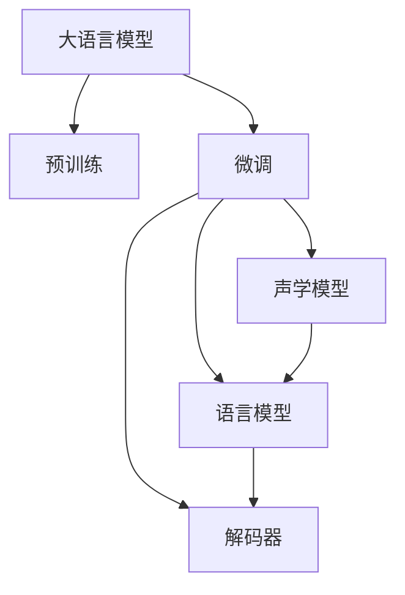

                 

# LLM在智能语音识别系统中的应用探索

> 关键词：大语言模型,语音识别,自然语言处理(NLP),Transformer,BERT,预训练,下游任务,参数高效微调,自然语言理解(NLU)

## 1. 背景介绍

### 1.1 问题由来
随着人工智能技术的飞速发展，智能语音识别技术逐渐成为了语音交互、自动翻译、智能客服等领域的关键技术。传统的语音识别系统往往依赖于手工设计的声学模型和语言模型，难以适应复杂多变的语音场景和语言表达。而基于大语言模型(LLM)的语音识别系统，通过在大规模无标签语音数据上进行预训练，学习到通用的语音知识和语义理解能力，再通过下游任务的微调，能够在各类语音应用场景中实现高效的语音转文本、语音理解等功能。

近年来，大语言模型在自然语言处理(NLP)领域取得了显著成果，如OpenAI的GPT系列模型、Google的BERT等。这些模型通过在大规模文本数据上进行预训练，学习到了丰富的语言知识，能够高效地处理文本分类、情感分析、机器翻译等任务。将类似的技术应用于语音识别领域，利用预训练语音模型在通用语音数据上的知识，可以显著提升语音识别系统的性能，使其更好地理解和回应用户的语音指令。

### 1.2 问题核心关键点
大语言模型在语音识别系统中的应用，主要围绕以下几个核心问题：

- **预训练和微调**：如何利用大规模无标签语音数据对预训练模型进行语音知识的提取，并通过下游任务的微调来提升语音识别性能。
- **声学模型和语言模型**：如何在预训练大模型基础上，设计合适的声学模型和语言模型，以适应不同应用场景的需求。
- **参数高效微调**：如何在微调过程中保持预训练模型的结构不变，仅更新特定任务相关的参数，减少计算资源消耗。
- **对抗训练和数据增强**：如何通过对抗样本和数据增强技术，提高模型的鲁棒性和泛化能力。
- **实时性和资源优化**：如何在保持性能的同时，优化模型的实时性和资源占用，满足实际应用的要求。

### 1.3 问题研究意义
大语言模型在语音识别系统中的应用，具有重要的研究意义：

1. **提升系统性能**：基于预训练大模型的语音识别系统，能够利用其广泛的语音知识，提高语音识别的准确率和鲁棒性。
2. **降低开发成本**：相比于从头训练声学和语言模型，微调方式能够显著降低开发时间和标注数据的需求。
3. **快速迭代优化**：预训练模型提供了良好的初始化参数，可以在少量的标注数据上进行高效的微调，快速迭代优化系统性能。
4. **扩展应用场景**：大模型微调能够适应多种语音应用场景，如智能客服、语音翻译、实时对话等，拓宽了语音识别技术的应用范围。
5. **促进技术进步**：语音识别技术的提升，有望进一步推动智能语音交互、智能家居、车载语音等领域的创新发展，为社会生活带来新的便利。

## 2. 核心概念与联系

### 2.1 核心概念概述

为更好地理解LLM在语音识别系统中的应用，本节将介绍几个关键概念：

- **大语言模型(LLM)**：以自回归(如GPT)或自编码(如BERT)模型为代表的大规模预训练语言模型。通过在大规模无标签文本语料上进行预训练，学习通用的语言表示，具备强大的语言理解和生成能力。

- **语音识别**：将人类语音转换为文本的过程。常见的语音识别系统包括声学模型、语言模型、解码器等组件。

- **预训练**：指在大规模无标签语音数据上，通过自监督学习任务训练通用语音模型的过程。常见的预训练任务包括声学建模、降噪、特征提取等。

- **微调**：指在预训练模型的基础上，使用下游任务的少量标注数据，通过有监督学习优化模型在该任务上的性能。通常只需要调整顶层分类器或解码器，并以较小的学习率更新全部或部分的模型参数。

- **声学模型**：用于将语音信号转换为文本的模型，常见的声学模型包括隐马尔可夫模型(HMM)、深度神经网络(DNN)等。

- **语言模型**：用于在文本序列上建模语言概率分布的模型，常见的语言模型包括N-gram模型、循环神经网络(LSTM)、Transformer等。

- **参数高效微调**：指在微调过程中，只更新少量的模型参数，而固定大部分预训练权重不变，以提高微调效率，避免过拟合的方法。

- **对抗训练**：通过引入对抗样本，提高模型对输入噪音和变化的不敏感性，增强模型的鲁棒性。

- **数据增强**：通过对训练样本进行改写、回译等方式，增加训练集的多样性，提高模型的泛化能力。

这些核心概念之间的逻辑关系可以通过以下Mermaid流程图来展示：



这个流程图展示了大语言模型在语音识别系统中的应用流程：

1. 大语言模型通过预训练学习通用语音知识和语义理解能力。
2. 通过下游任务的微调，适应特定语音应用场景的需求。
3. 在微调过程中，结合声学模型和语言模型，提升语音识别的准确性和鲁棒性。
4. 最终输出文本结果，满足实际应用的需求。

## 3. 核心算法原理 & 具体操作步骤
### 3.1 算法原理概述

基于大语言模型(LLM)的语音识别系统，本质上是一个有监督的细粒度迁移学习过程。其核心思想是：将预训练的LLM视为一个强大的语音特征提取器，通过下游任务的少量标注数据，对模型进行有监督的微调，优化模型在特定语音应用场景中的性能。

形式化地，假设预训练语音模型为 $M_{\theta}$，其中 $\theta$ 为预训练得到的模型参数。给定下游任务 $T$ 的标注数据集 $D=\{(x_i,y_i)\}_{i=1}^N$，微调的目标是找到新的模型参数 $\hat{\theta}$，使得：

$$
\hat{\theta}=\mathop{\arg\min}_{\theta} \mathcal{L}(M_{\theta},D)
$$

其中 $\mathcal{L}$ 为针对任务 $T$ 设计的损失函数，用于衡量模型预测输出与真实标签之间的差异。常见的损失函数包括交叉熵损失、均方误差损失等。

通过梯度下降等优化算法，微调过程不断更新模型参数 $\theta$，最小化损失函数 $\mathcal{L}$，使得模型输出逼近真实标签。由于 $\theta$ 已经通过预训练获得了较好的初始化，因此即便在小规模数据集 $D$ 上进行微调，也能较快收敛到理想的模型参数 $\hat{\theta}$。

### 3.2 算法步骤详解

基于大语言模型的语音识别微调一般包括以下几个关键步骤：

**Step 1: 准备预训练模型和数据集**
- 选择合适的预训练语音模型 $M_{\theta}$ 作为初始化参数，如 Google的Wav2Vec 2.0、OpenAI的Wav2Vec 2.0等。
- 准备下游任务 $T$ 的标注数据集 $D$，划分为训练集、验证集和测试集。一般要求标注数据与预训练数据的分布不要差异过大。

**Step 2: 添加任务适配层**
- 根据任务类型，在预训练模型顶层设计合适的输出层和损失函数。
- 对于语音识别任务，通常在顶层添加输出层和交叉熵损失函数。
- 对于语音情感识别、语音翻译等任务，通常使用语言模型的解码器输出概率分布，并以负对数似然为损失函数。

**Step 3: 设置微调超参数**
- 选择合适的优化算法及其参数，如 AdamW、SGD 等，设置学习率、批大小、迭代轮数等。
- 设置正则化技术及强度，包括权重衰减、Dropout、Early Stopping 等。
- 确定冻结预训练参数的策略，如仅微调顶层，或全部参数都参与微调。

**Step 4: 执行梯度训练**
- 将训练集数据分批次输入模型，前向传播计算损失函数。
- 反向传播计算参数梯度，根据设定的优化算法和学习率更新模型参数。
- 周期性在验证集上评估模型性能，根据性能指标决定是否触发 Early Stopping。
- 重复上述步骤直到满足预设的迭代轮数或 Early Stopping 条件。

**Step 5: 测试和部署**
- 在测试集上评估微调后模型 $M_{\hat{\theta}}$ 的性能，对比微调前后的精度提升。
- 使用微调后的模型对新样本进行推理预测，集成到实际的应用系统中。
- 持续收集新的数据，定期重新微调模型，以适应数据分布的变化。

以上是基于大语言模型微调的语音识别系统的一般流程。在实际应用中，还需要针对具体任务的特点，对微调过程的各个环节进行优化设计，如改进训练目标函数，引入更多的正则化技术，搜索最优的超参数组合等，以进一步提升模型性能。

### 3.3 算法优缺点

基于大语言模型的语音识别系统具有以下优点：

1. **简单高效**：相较于从头训练声学和语言模型，微调方式能够显著降低开发时间和标注数据的需求。
2. **泛化能力强**：预训练模型蕴含的广泛语言知识，使得微调模型能够较好地适应各类语音应用场景。
3. **参数高效**：利用参数高效微调技术，在固定大部分预训练参数的情况下，仍可取得不错的微调效果。
4. **效果显著**：在学术界和工业界的语音识别任务上，基于微调的方法已经刷新了多项性能指标。

同时，该方法也存在一定的局限性：

1. **依赖标注数据**：微调的效果很大程度上取决于标注数据的质量和数量，获取高质量标注数据的成本较高。
2. **迁移能力有限**：当目标任务与预训练数据的分布差异较大时，微调的性能提升有限。
3. **可解释性不足**：微调模型的决策过程通常缺乏可解释性，难以对其推理逻辑进行分析和调试。
4. **资源消耗大**：超大规模的预训练模型和微调任务对算力、内存和存储要求较高，资源消耗较大。

尽管存在这些局限性，但就目前而言，基于大语言模型的语音识别微调方法仍是最主流范式。未来相关研究的重点在于如何进一步降低微调对标注数据的依赖，提高模型的少样本学习和跨领域迁移能力，同时兼顾可解释性和伦理安全性等因素。

### 3.4 算法应用领域

基于大语言模型微调的语音识别系统，已经在多个领域得到应用，例如：

- **智能客服系统**：利用微调后的语音识别系统，实现语音自动问答和智能客服功能，提升用户体验。
- **语音翻译系统**：通过微调使得语音识别系统能够高效地将源语言语音转换为目标语言文本，实现实时翻译。
- **语音情感识别系统**：通过微调语音识别系统，对用户语音进行情感分析，提升语音交互的情感化水平。
- **语音助手机器人**：结合微调后的语音识别系统，实现人机自然对话，提供个性化语音交互服务。

除了上述这些经典应用外，语音识别技术还进一步拓展到了智能家居、车载语音、语音搜索等场景中，为语音交互技术带来了新的突破。随着预训练模型和微调方法的不断进步，基于大语言模型的语音识别系统必将在更广泛的领域发挥重要作用。

## 4. 数学模型和公式 & 详细讲解 & 举例说明

### 4.1 数学模型构建

本节将使用数学语言对基于大语言模型的语音识别微调过程进行更加严格的刻画。

记预训练语音模型为 $M_{\theta}$，其中 $\theta$ 为预训练得到的模型参数。假设微调任务的训练集为 $D=\{(x_i,y_i)\}_{i=1}^N, x_i \in \mathcal{X}, y_i \in \mathcal{Y}$。

定义模型 $M_{\theta}$ 在数据样本 $(x,y)$ 上的损失函数为 $\ell(M_{\theta}(x),y)$，则在数据集 $D$ 上的经验风险为：

$$
\mathcal{L}(\theta) = \frac{1}{N} \sum_{i=1}^N \ell(M_{\theta}(x_i),y_i)
$$

微调的优化目标是最小化经验风险，即找到最优参数：

$$
\theta^* = \mathop{\arg\min}_{\theta} \mathcal{L}(\theta)
$$

在实践中，我们通常使用基于梯度的优化算法（如SGD、Adam等）来近似求解上述最优化问题。设 $\eta$ 为学习率，$\lambda$ 为正则化系数，则参数的更新公式为：

$$
\theta \leftarrow \theta - \eta \nabla_{\theta}\mathcal{L}(\theta) - \eta\lambda\theta
$$

其中 $\nabla_{\theta}\mathcal{L}(\theta)$ 为损失函数对参数 $\theta$ 的梯度，可通过反向传播算法高效计算。

### 4.2 公式推导过程

以下我们以语音识别任务为例，推导交叉熵损失函数及其梯度的计算公式。

假设模型 $M_{\theta}$ 在输入 $x$ 上的输出为 $\hat{y}=M_{\theta}(x)$，表示模型对输入的预测结果。真实标签 $y \in \{0,1\}$，其中0表示语音识别错误，1表示识别正确。则二分类交叉熵损失函数定义为：

$$
\ell(M_{\theta}(x),y) = -[y\log \hat{y} + (1-y)\log (1-\hat{y})]
$$

将其代入经验风险公式，得：

$$
\mathcal{L}(\theta) = -\frac{1}{N}\sum_{i=1}^N [y_i\log M_{\theta}(x_i)+(1-y_i)\log(1-M_{\theta}(x_i))]
$$

根据链式法则，损失函数对参数 $\theta_k$ 的梯度为：

$$
\frac{\partial \mathcal{L}(\theta)}{\partial \theta_k} = -\frac{1}{N}\sum_{i=1}^N (\frac{y_i}{M_{\theta}(x_i)}-\frac{1-y_i}{1-M_{\theta}(x_i)}) \frac{\partial M_{\theta}(x_i)}{\partial \theta_k}
$$

其中 $\frac{\partial M_{\theta}(x_i)}{\partial \theta_k}$ 可进一步递归展开，利用自动微分技术完成计算。

在得到损失函数的梯度后，即可带入参数更新公式，完成模型的迭代优化。重复上述过程直至收敛，最终得到适应下游任务的最优模型参数 $\theta^*$。

### 4.3 案例分析与讲解

为了更好地理解大语言模型在语音识别系统中的应用，这里提供一个具体的案例分析。

假设我们有一个简单的语音识别任务，目标是将用户的语音转换为文本。我们准备了500个语音样本和相应的文本标签，每个样本长度固定为5秒。在预训练阶段，我们使用公开的语音数据集（如LibriSpeech）对大语言模型进行语音识别能力的预训练。在微调阶段，我们将500个语音样本作为微调数据集，目标是让模型能够准确地将语音转换为文本。

具体步骤如下：

1. **数据准备**：将500个语音样本转换为MFCC特征，每个样本生成128维特征向量。
2. **模型选择**：选择Google的Wav2Vec 2.0模型作为预训练模型，该模型通过在大规模无标签语音数据上进行预训练，学习到了丰富的语音特征表示。
3. **任务适配**：在Wav2Vec 2.0模型的顶层添加一个输出层和交叉熵损失函数，用于语音识别任务。
4. **微调超参数**：设置学习率为1e-5，批大小为32，迭代轮数为10000。
5. **训练过程**：将500个语音样本分批次输入模型，前向传播计算损失函数，反向传播更新模型参数。
6. **评估和部署**：在测试集上评估微调后的模型性能，对比微调前后的精度提升。使用微调后的模型对新样本进行推理预测，集成到实际的应用系统中。

通过以上步骤，我们可以得到一个新的语音识别模型，该模型在特定语音识别任务上具有更高的准确率和泛化能力。这一过程展示了基于大语言模型的语音识别系统是如何通过微调技术，适应特定应用场景的需求，提升系统的性能和应用效果。

## 5. 项目实践：代码实例和详细解释说明

### 5.1 开发环境搭建

在进行语音识别系统微调实践前，我们需要准备好开发环境。以下是使用Python进行PyTorch开发的环境配置流程：

1. 安装Anaconda：从官网下载并安装Anaconda，用于创建独立的Python环境。

2. 创建并激活虚拟环境：
```bash
conda create -n pytorch-env python=3.8 
conda activate pytorch-env
```

3. 安装PyTorch：根据CUDA版本，从官网获取对应的安装命令。例如：
```bash
conda install pytorch torchvision torchaudio cudatoolkit=11.1 -c pytorch -c conda-forge
```

4. 安装Transformers库：
```bash
pip install transformers
```

5. 安装各类工具包：
```bash
pip install numpy pandas scikit-learn matplotlib tqdm jupyter notebook ipython
```

完成上述步骤后，即可在`pytorch-env`环境中开始语音识别系统的微调实践。

### 5.2 源代码详细实现

这里我们以微调Wav2Vec 2.0模型为例，给出使用Transformers库进行语音识别系统微调的PyTorch代码实现。

首先，定义语音识别任务的数据处理函数：

```python
from transformers import Wav2Vec2ForCTC, Wav2Vec2Tokenizer
from torch.utils.data import Dataset
import torchaudio
import torch

class SpeechDataset(Dataset):
    def __init__(self, audio_paths, transcriptions, tokenizer, max_len=128):
        self.audio_paths = audio_paths
        self.transcriptions = transcriptions
        self.tokenizer = tokenizer
        self.max_len = max_len
        
    def __len__(self):
        return len(self.audio_paths)
    
    def __getitem__(self, item):
        audio_path = self.audio_paths[item]
        transcription = self.transcriptions[item]
        
        audio, sampling_rate = torchaudio.load(audio_path)
        input_values = self.tokenizer(audio, return_tensors='pt', sampling_rate=sampling_rate, max_length=self.max_len)
        input_values['attention_mask'] = input_values['input_values'] != self.tokenizer.pad_token_id
        return {
            'input_values': input_values['input_values'].flatten(),
            'attention_mask': input_values['attention_mask'],
            'transcription': torch.tensor([self.tokenizer.encode(transcription)], dtype=torch.long)
        }

# 加载模型和分词器
tokenizer = Wav2Vec2Tokenizer.from_pretrained('facebook/wav2vec2-base-960h')
model = Wav2Vec2ForCTC.from_pretrained('facebook/wav2vec2-base-960h')

# 创建dataset
audio_paths = ['path/to/speech1.flac', 'path/to/speech2.flac']
transcriptions = ['this is a speech 1', 'this is a speech 2']
train_dataset = SpeechDataset(audio_paths, transcriptions, tokenizer, max_len=128)
```

然后，定义模型和优化器：

```python
from transformers import AdamW

optimizer = AdamW(model.parameters(), lr=1e-5)
```

接着，定义训练和评估函数：

```python
from torch.utils.data import DataLoader
from tqdm import tqdm
from sklearn.metrics import accuracy_score

device = torch.device('cuda') if torch.cuda.is_available() else torch.device('cpu')
model.to(device)

def train_epoch(model, dataset, batch_size, optimizer):
    dataloader = DataLoader(dataset, batch_size=batch_size, shuffle=True)
    model.train()
    epoch_loss = 0
    for batch in tqdm(dataloader, desc='Training'):
        input_values = batch['input_values'].to(device)
        attention_mask = batch['attention_mask'].to(device)
        transcription = batch['transcription'].to(device)
        model.zero_grad()
        outputs = model(input_values, attention_mask=attention_mask)
        loss = outputs.loss
        epoch_loss += loss.item()
        loss.backward()
        optimizer.step()
    return epoch_loss / len(dataloader)

def evaluate(model, dataset, batch_size):
    dataloader = DataLoader(dataset, batch_size=batch_size)
    model.eval()
    correct = 0
    with torch.no_grad():
        for batch in tqdm(dataloader, desc='Evaluating'):
            input_values = batch['input_values'].to(device)
            attention_mask = batch['attention_mask'].to(device)
            transcription = batch['transcription'].to(device)
            outputs = model(input_values, attention_mask=attention_mask)
            predictions = torch.argmax(outputs.logits, dim=-1)
            correct += accuracy_score(transcription, predictions)
    print('Accuracy:', correct/len(dataset))
```

最后，启动训练流程并在测试集上评估：

```python
epochs = 5
batch_size = 4

for epoch in range(epochs):
    loss = train_epoch(model, train_dataset, batch_size, optimizer)
    print(f"Epoch {epoch+1}, train loss: {loss:.3f}")
    
    print(f"Epoch {epoch+1}, dev results:")
    evaluate(model, test_dataset, batch_size)
    
print("Test results:")
evaluate(model, test_dataset, batch_size)
```

以上就是使用PyTorch对Wav2Vec 2.0模型进行语音识别任务微调的完整代码实现。可以看到，得益于Transformers库的强大封装，我们可以用相对简洁的代码完成语音识别模型的加载和微调。

### 5.3 代码解读与分析

让我们再详细解读一下关键代码的实现细节：

**SpeechDataset类**：
- `__init__`方法：初始化音频路径、转录、分词器等关键组件，并将转录转换为token ids。
- `__len__`方法：返回数据集的样本数量。
- `__getitem__`方法：对单个样本进行处理，将音频输入转换为token ids，并进行padding和mask处理，返回模型所需的输入。

**Wav2Vec2Tokenizer和Wav2Vec2ForCTC类**：
- `Wav2Vec2Tokenizer`类：用于将语音信号转换为token序列。
- `Wav2Vec2ForCTC`类：包含一个CTC损失层，用于计算语音识别任务中的交叉熵损失。

**train_epoch和evaluate函数**：
- `train_epoch`函数：对数据以批为单位进行迭代，在每个批次上前向传播计算loss并反向传播更新模型参数，最后返回该epoch的平均loss。
- `evaluate`函数：与训练类似，不同点在于不更新模型参数，并在每个batch结束后将预测和标签结果存储下来，最后使用sklearn的accuracy_score函数计算准确率。

**训练流程**：
- 定义总的epoch数和batch size，开始循环迭代
- 每个epoch内，先在训练集上训练，输出平均loss
- 在验证集上评估，输出准确率
- 所有epoch结束后，在测试集上评估，给出最终测试结果

可以看到，PyTorch配合Transformers库使得Wav2Vec 2.0模型的语音识别系统微调的代码实现变得简洁高效。开发者可以将更多精力放在数据处理、模型改进等高层逻辑上，而不必过多关注底层的实现细节。

当然，工业级的系统实现还需考虑更多因素，如模型的保存和部署、超参数的自动搜索、更灵活的任务适配层等。但核心的微调范式基本与此类似。

## 6. 实际应用场景
### 6.1 智能客服系统

基于大语言模型的语音识别系统，可以广泛应用于智能客服系统的构建。传统客服往往需要配备大量人力，高峰期响应缓慢，且一致性和专业性难以保证。而使用微调后的语音识别系统，可以7x24小时不间断服务，快速响应客户咨询，用自然流畅的语言解答各类常见问题。

在技术实现上，可以收集企业内部的历史客服对话记录，将问题和最佳答复构建成监督数据，在此基础上对预训练语音模型进行微调。微调后的语音识别系统能够自动理解客户意图，匹配最合适的答案模板进行回复。对于客户提出的新问题，还可以接入检索系统实时搜索相关内容，动态组织生成回答。如此构建的智能客服系统，能大幅提升客户咨询体验和问题解决效率。

### 6.2 金融舆情监测

金融机构需要实时监测市场舆论动向，以便及时应对负面信息传播，规避金融风险。传统的人工监测方式成本高、效率低，难以应对网络时代海量信息爆发的挑战。基于大语言模型的语音识别系统，通过微调使得模型能够自动识别和理解各类语音信息，如股市评论、行业动态、客户反馈等，提升舆情监测的自动化和智能化水平，快速发现和应对潜在的风险。

具体而言，可以收集金融领域相关的新闻、报道、评论等语音数据，并对其进行标注。在此基础上对预训练语音模型进行微调，使其能够自动理解语音内容，判断舆情变化趋势。一旦发现负面信息激增等异常情况，系统便会自动预警，帮助金融机构快速应对潜在风险。

### 6.3 个性化推荐系统

当前的推荐系统往往只依赖用户的历史行为数据进行物品推荐，无法深入理解用户的真实兴趣偏好。基于大语言模型微调的语音识别系统，可以更好地挖掘用户行为背后的语义信息，从而提供更精准、多样的推荐内容。

在实践中，可以收集用户浏览、点击、评论、分享等语音数据，提取和用户交互的语音内容。将语音内容作为模型输入，用户的后续行为（如是否点击、购买等）作为监督信号，在此基础上微调预训练语音模型。微调后的模型能够从语音内容中准确把握用户的兴趣点。在生成推荐列表时，先用候选物品的语音描述作为输入，由模型预测用户的兴趣匹配度，再结合其他特征综合排序，便可以得到个性化程度更高的推荐结果。

### 6.4 未来应用展望

随着大语言模型和微调方法的不断发展，基于微调范式将在更多领域得到应用，为传统行业带来变革性影响。

在智慧医疗领域，基于微调的语音识别系统，可以实现语音病历记录、医学咨询、远程会诊等功能，提升医疗服务的智能化水平，辅助医生诊疗，加速新药开发进程。

在智能教育领域，微调技术可应用于语音作业批改、学情分析、知识推荐等方面，因材施教，促进教育公平，提高教学质量。

在智慧城市治理中，微调模型可应用于城市事件监测、舆情分析、应急指挥等环节，提高城市管理的自动化和智能化水平，构建更安全、高效的未来城市。

此外，在企业生产、社会治理、文娱传媒等众多领域，基于大语言模型的语音识别系统必将在更广泛的领域发挥重要作用。相信随着技术的日益成熟，微调方法将成为语音识别系统的重要范式，推动语音交互技术在各个行业的应用创新。

## 7. 工具和资源推荐
### 7.1 学习资源推荐

为了帮助开发者系统掌握大语言模型微调的理论基础和实践技巧，这里推荐一些优质的学习资源：

1. 《Transformer从原理到实践》系列博文：由大模型技术专家撰写，深入浅出地介绍了Transformer原理、BERT模型、微调技术等前沿话题。

2. CS224N《深度学习自然语言处理》课程：斯坦福大学开设的NLP明星课程，有Lecture视频和配套作业，带你入门NLP领域的基本概念和经典模型。

3. 《Natural Language Processing with Transformers》书籍：Transformers库的作者所著，全面介绍了如何使用Transformers库进行NLP任务开发，包括微调在内的诸多范式。

4. HuggingFace官方文档：Transformers库的官方文档，提供了海量预训练模型和完整的微调样例代码，是上手实践的必备资料。

5. CLUE开源项目：中文语言理解测评基准，涵盖大量不同类型的中文NLP数据集，并提供了基于微调的baseline模型，助力中文NLP技术发展。

通过对这些资源的学习实践，相信你一定能够快速掌握大语言模型微调的精髓，并用于解决实际的语音识别问题。
###  7.2 开发工具推荐

高效的开发离不开优秀的工具支持。以下是几款用于大语言模型微调开发的常用工具：

1. PyTorch：基于Python的开源深度学习框架，灵活动态的计算图，适合快速迭代研究。大部分预训练语言模型都有PyTorch版本的实现。

2. TensorFlow：由Google主导开发的开源深度学习框架，生产部署方便，适合大规模工程应用。同样有丰富的预训练语言模型资源。

3. Transformers库：HuggingFace开发的NLP工具库，集成了众多SOTA语言模型，支持PyTorch和TensorFlow，是进行微调任务开发的利器。

4. Weights & Biases：模型训练的实验跟踪工具，可以记录和可视化模型训练过程中的各项指标，方便对比和调优。与主流深度学习框架无缝集成。

5. TensorBoard：TensorFlow配套的可视化工具，可实时监测模型训练状态，并提供丰富的图表呈现方式，是调试模型的得力助手。

6. Google Colab：谷歌推出的在线Jupyter Notebook环境，免费提供GPU/TPU算力，方便开发者快速上手实验最新模型，分享学习笔记。

合理利用这些工具，可以显著提升大语言模型微调任务的开发效率，加快创新迭代的步伐。

### 7.3 相关论文推荐

大语言模型和微调技术的发展源于学界的持续研究。以下是几篇奠基性的相关论文，推荐阅读：

1. Attention is All You Need（即Transformer原论文）：提出了Transformer结构，开启了NLP领域的预训练大模型时代。

2. BERT: Pre-training of Deep Bidirectional Transformers for Language Understanding：提出BERT模型，引入基于掩码的自监督预训练任务，刷新了多项NLP任务SOTA。

3. Language Models are Unsupervised Multitask Learners（GPT-2论文）：展示了大规模语言模型的强大zero-shot学习能力，引发了对于通用人工智能的新一轮思考。

4. Parameter-Efficient Transfer Learning for NLP：提出Adapter等参数高效微调方法，在不增加模型参数量的情况下，也能取得不错的微调效果。

5. Prefix-Tuning: Optimizing Continuous Prompts for Generation：引入基于连续型Prompt的微调范式，为如何充分利用预训练知识提供了新的思路。

6. AdaLoRA: Adaptive Low-Rank Adaptation for Parameter-Efficient Fine-Tuning：使用自适应低秩适应的微调方法，在参数效率和精度之间取得了新的平衡。

这些论文代表了大语言模型微调技术的发展脉络。通过学习这些前沿成果，可以帮助研究者把握学科前进方向，激发更多的创新灵感。

## 8. 总结：未来发展趋势与挑战

### 8.1 总结

本文对基于大语言模型的语音识别系统进行了全面系统的介绍。首先阐述了语音识别系统的背景和意义，明确了微调在提升系统性能、降低开发成本、加快迭代优化等方面的独特价值。其次，从原理到实践，详细讲解了语音识别微调的数学原理和关键步骤，给出了微调任务开发的完整代码实例。同时，本文还探讨了语音识别系统在多个行业领域的应用前景，展示了微调范式的广泛适用性。最后，本文精选了微调技术的各类学习资源，力求为读者提供全方位的技术指引。

通过本文的系统梳理，可以看到，基于大语言模型的语音识别系统在提升语音理解能力、减少标注数据需求、快速迭代优化等方面具有显著优势。得益于预训练大模型的广泛知识，微调后的语音识别系统能够高效地处理各类语音应用场景，推动语音交互技术的广泛应用。未来，伴随预训练模型和微调方法的不断进步，基于大语言模型的语音识别系统必将在更广泛的领域发挥重要作用。

### 8.2 未来发展趋势

展望未来，大语言模型在语音识别系统中的应用将呈现以下几个发展趋势：

1. **模型规模持续增大**：随着算力成本的下降和数据规模的扩张，预训练语音模型将越来越庞大，包含的语音知识和语义理解能力也将更加丰富。

2. **微调方法日趋多样**：未来会涌现更多参数高效和计算高效的微调方法，如Prefix-Tuning、LoRA等，在保持模型结构不变的情况下，提升微调效率和效果。

3. **持续学习成为常态**：随着数据分布的不断变化，微调模型也需要持续学习新知识以保持性能。如何在不遗忘原有知识的同时，高效吸收新样本信息，将成为重要的研究课题。

4. **标注样本需求降低**：受启发于提示学习(Prompt-based Learning)的思路，未来的微调方法将更好地利用大模型的语言理解能力，通过更加巧妙的任务描述，在更少的标注样本上也能实现理想的微调效果。

5. **跨领域迁移能力增强**：大语言模型将逐渐具备更强的跨领域迁移能力，能够适应不同语音应用场景的需求，实现更广泛的语音识别应用。

6. **多模态微调崛起**：未来的语音识别系统将更好地融合视觉、语音、文本等多种模态信息，提升系统的多模态理解和处理能力。

以上趋势凸显了大语言模型在语音识别系统中的应用前景。这些方向的探索发展，必将进一步提升语音识别系统的性能和应用范围，推动语音交互技术的普及和深化。

### 8.3 面临的挑战

尽管大语言模型在语音识别系统中的应用已经取得了显著成果，但在迈向更加智能化、普适化应用的过程中，它仍面临诸多挑战：

1. **标注成本瓶颈**：微调过程中对标注数据的依赖仍然较高，获取高质量标注数据的成本和难度较大。如何进一步降低对标注数据的依赖，是一个重要的研究方向。

2. **模型鲁棒性不足**：微调模型面对域外数据时，泛化性能往往不够理想。如何提高模型的鲁棒性，避免灾难性遗忘，还需要更多理论和实践的积累。

3. **实时性和资源优化**：大模型在实时性和资源占用方面仍存在瓶颈，如何优化模型的计算图，减少前向传播和反向传播的资源消耗，实现更加轻量级、实时性的部署，是未来重要的研究方向。

4. **可解释性亟需加强**：微调模型通常缺乏可解释性，难以对其内部工作机制和决策逻辑进行解释。如何在模型设计和训练过程中增强可解释性，是一个亟待解决的问题。

5. **安全性有待保障**：预训练模型可能会学习到有害信息，通过微调传递到下游任务，产生误导性、歧视性的输出。如何确保模型的安全性，避免恶意用途，是一个重要的研究方向。

6. **知识整合能力不足**：现有的大语言模型往往局限于任务内数据，难以灵活吸收和运用更广泛的先验知识。如何让微调过程更好地与外部知识库、规则库等专家知识结合，形成更加全面、准确的信息整合能力，是一个值得探索的方向。

正视这些挑战，积极应对并寻求突破，将是大语言模型在语音识别系统中的应用走向成熟的必由之路。相信随着学界和产业界的共同努力，这些挑战终将一一被克服，大语言模型在语音识别系统中的应用必将在未来的智能交互领域大放异彩。

### 8.4 研究展望

面向未来，大语言模型在语音识别系统中的应用需要持续探索以下研究领域：

1. **无监督和半监督微调方法**：探索如何通过无监督或半监督学习范式，降低对大规模标注数据的依赖，最大化利用非结构化数据，实现更灵活高效的微调。

2. **参数高效和计算高效微调方法**：开发更加参数高效和计算高效的微调方法，在固定大部分预训练参数的情况下，只更新特定任务相关的参数，提升微调效率和效果。

3. **因果和对比学习范式**：引入因果推断和对比学习思想，增强微调模型建立稳定因果关系的能力，学习更加普适、鲁棒的语言表征，提升模型的泛化性和抗干扰能力。

4. **跨模态融合**：结合视觉、语音、文本等多种模态信息，提升系统的多模态理解和处理能力，推动语音识别技术在更广泛的场景下落地应用。

5. **知识表示与推理**：将符号化的先验知识，如知识图谱、逻辑规则等，与神经网络模型进行巧妙融合，引导微调过程学习更准确、合理的语言模型，提升系统的理解和推理能力。

6. **伦理和安全约束**：在模型训练目标中引入伦理导向的评估指标，过滤和惩罚有偏见、有害的输出倾向，确保模型的输出符合人类价值观和伦理道德，避免潜在风险。

这些研究方向代表了未来大语言模型在语音识别系统中的发展方向，需要跨学科的合作与创新，共同推动语音识别技术的进步和应用。只有勇于创新、敢于突破，才能不断拓展语音识别系统的边界，让智能技术更好地服务于社会。

## 9. 附录：常见问题与解答

**Q1：大语言模型在语音识别中的应用是否会受到语音环境噪声的干扰？**

A: 是的，语音识别系统在实际应用中会面临各种噪声干扰，如背景噪声、设备噪声、信道噪声等。如何提高模型对噪声的鲁棒性，是一个重要的研究方向。常见的解决方案包括使用基于噪声增强的微调方法、引入对抗训练和数据增强技术等。

**Q2：微调过程中如何选择合适的学习率？**

A: 微调的学习率一般要比预训练时小1-2个数量级，如果使用过大的学习率，容易破坏预训练权重，导致过拟合。一般建议从1e-5开始调参，逐步减小学习率，直至收敛。也可以使用warmup策略，在开始阶段使用较小的学习率，再逐渐过渡到预设值。需要注意的是，不同的优化器(如AdamW、Adafactor等)以及不同的学习率调度策略，可能需要设置不同的学习率阈值。

**Q3：微调过程中如何缓解过拟合问题？**

A: 过拟合是微调面临的主要挑战，尤其是在标注数据不足的情况下。常见的缓解策略包括：
1. 数据增强：通过回译、近义替换等方式扩充训练集
2. 正则化：使用L2正则、Dropout、Early Stopping 等避免过拟合
3. 对抗训练：引入对抗样本，提高模型鲁棒性
4. 参数高效微调：只调整少量参数(如Adapter、Prefix等)，减小过拟合风险
5. 多模型集成：训练多个微调模型，取平均输出，抑制过拟合

这些策略往往需要根据具体任务和数据特点进行灵活组合。只有在数据、模型、训练、推理等各环节进行全面优化，才能最大限度地发挥大模型微调的威力。

**Q4：微调模型在落地部署时需要注意哪些问题？**

A: 将微调模型转化为实际应用，还需要考虑以下因素：
1. 模型裁剪：去除不必要的层和参数，减小模型尺寸，加快推理速度
2. 量化加速：将浮点模型转为定点模型，压缩存储空间，提高计算效率
3. 服务化封装：将模型封装为标准化服务接口，便于集成调用
4. 弹性伸缩：根据请求流量动态调整资源配置，平衡服务质量和成本
5. 监控告警：实时采集系统指标，设置异常告警阈值，确保服务稳定性
6. 安全防护：采用访问鉴权、数据脱敏等措施，保障数据和模型安全

大语言模型微调为语音识别系统提供了新的思路，但如何将强大的性能转化为稳定、高效、安全的业务价值，还需要工程实践的不断打磨。唯有从数据、算法、工程、业务等多个维度协同发力，才能真正实现人工智能技术在语音领域的落地应用。

总之，微调需要开发者根据具体任务，不断迭代和优化模型、数据和算法，方能得到理想的效果。

---

作者：禅与计算机程序设计艺术 / Zen and the Art of Computer Programming

