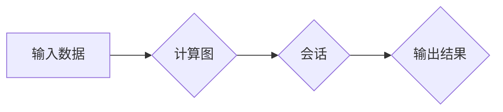
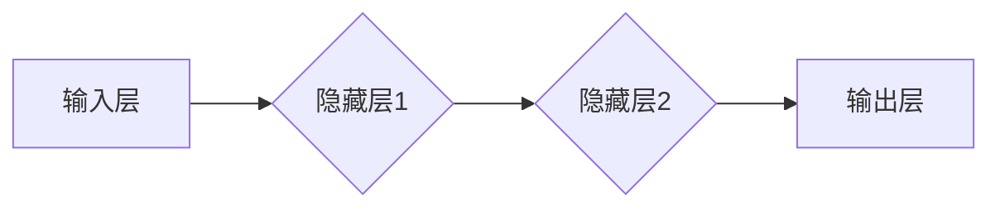

TensorFlow, 深度学习, 神经网络, 机器学习, 编程, 代码实战, 算法原理, 数学模型, 项目实践

## 1. 背景介绍

深度学习作为机器学习领域最前沿的子领域，近年来取得了令人瞩目的成就，在图像识别、自然语言处理、语音识别等领域展现出强大的应用潜力。TensorFlow作为Google开发的开源深度学习框架，凭借其强大的计算能力、灵活的模型构建能力和丰富的生态系统，成为了深度学习研究和应用的首选工具之一。

然而，对于初学者来说，TensorFlow的学习门槛相对较高，其底层原理和代码实现较为复杂。为了帮助大家更好地理解TensorFlow，本文将从核心概念、算法原理、数学模型、代码实现等多个方面进行深入讲解，并结合实际案例，让大家能够快速掌握TensorFlow的基本使用方法，并能够独立开发深度学习应用。

## 2. 核心概念与联系

TensorFlow的核心概念包括：

* **张量（Tensor）：** Tensor是TensorFlow的基本数据结构，可以理解为多维数组。张量可以表示各种数据类型，例如数字、图像、文本等。
* **计算图（Computational Graph）：** TensorFlow使用计算图来表示模型的计算过程。计算图由节点和边组成，节点代表运算，边代表数据流。
* **会话（Session）：** 会话是TensorFlow执行计算图的执行环境。在会话中，我们可以运行计算图，并获取计算结果。
* **变量（Variable）：** 变量是TensorFlow中可训练的参数。在训练过程中，变量的值会根据训练数据进行更新。

**TensorFlow 架构流程图**



## 3. 核心算法原理 & 具体操作步骤

### 3.1  算法原理概述

TensorFlow支持多种深度学习算法，其中最常用的算法是反向传播算法（Backpropagation）。反向传播算法的核心思想是通过计算误差，并反向传播误差梯度，来更新模型参数，从而使模型的预测结果越来越准确。

### 3.2  算法步骤详解

1. **前向传播（Forward Propagation）：** 将输入数据通过计算图进行计算，得到模型的预测结果。
2. **损失函数计算（Loss Function）：** 计算预测结果与真实值的误差，即损失函数的值。
3. **反向传播（Backpropagation）：** 计算损失函数对模型参数的梯度，并根据梯度更新模型参数。
4. **重复步骤1-3：** 迭代执行前向传播、损失函数计算和反向传播，直到模型的损失函数达到最小值。

### 3.3  算法优缺点

**优点：**

* 能够有效地训练复杂的深度学习模型。
* 具有较高的准确率。
* 能够处理大规模的数据集。

**缺点：**

* 训练过程可能需要很长时间。
* 需要大量的计算资源。
* 容易陷入局部最优解。

### 3.4  算法应用领域

反向传播算法广泛应用于各种深度学习领域，例如：

* **图像识别：** 用于识别图像中的物体、场景和人脸。
* **自然语言处理：** 用于机器翻译、文本摘要、情感分析等任务。
* **语音识别：** 用于将语音转换为文本。
* **推荐系统：** 用于推荐用户感兴趣的内容。

## 4. 数学模型和公式 & 详细讲解 & 举例说明

### 4.1  数学模型构建

深度学习模型通常由多个神经网络层组成，每一层都包含多个神经元。每个神经元接收来自上一层的输入，并通过激活函数进行处理，输出到下一层。

**神经网络层结构**



### 4.2  公式推导过程

**激活函数**

常用的激活函数包括 sigmoid 函数、ReLU 函数、tanh 函数等。

* **sigmoid 函数：**

$$
f(x) = \frac{1}{1 + e^{-x}}
$$

* **ReLU 函数：**

$$
f(x) = max(0, x)
$$

**损失函数**

常用的损失函数包括均方误差（MSE）、交叉熵损失（Cross-Entropy Loss）等。

* **均方误差：**

$$
L = \frac{1}{n} \sum_{i=1}^{n} (y_i - \hat{y}_i)^2
$$

其中，$y_i$ 是真实值，$\hat{y}_i$ 是预测值，$n$ 是样本数量。

### 4.3  案例分析与讲解

以图像分类为例，假设我们使用一个包含两层隐藏层的卷积神经网络（CNN）来进行图像分类。

* **输入层：** 接收图像数据，例如一张 28x28 的灰度图像。
* **隐藏层1：** 使用卷积核进行卷积操作，提取图像特征。
* **隐藏层2：** 使用全连接层进行特征融合。
* **输出层：** 使用 softmax 函数将特征映射到多个类别概率。

在训练过程中，我们使用图像数据集进行训练，并使用交叉熵损失函数来计算模型的损失。通过反向传播算法，更新模型参数，使模型的预测结果越来越准确。

## 5. 项目实践：代码实例和详细解释说明

### 5.1  开发环境搭建

* 安装 Python 3.x
* 安装 TensorFlow 库：`pip install tensorflow`
* 安装 Jupyter Notebook：`pip install jupyter`

### 5.2  源代码详细实现

```python
import tensorflow as tf

# 定义模型
model = tf.keras.models.Sequential([
    tf.keras.layers.Conv2D(32, (3, 3), activation='relu', input_shape=(28, 28, 1)),
    tf.keras.layers.MaxPooling2D((2, 2)),
    tf.keras.layers.Conv2D(64, (3, 3), activation='relu'),
    tf.keras.layers.MaxPooling2D((2, 2)),
    tf.keras.layers.Flatten(),
    tf.keras.layers.Dense(10, activation='softmax')
])

# 编译模型
model.compile(optimizer='adam',
              loss='sparse_categorical_crossentropy',
              metrics=['accuracy'])

# 加载 MNIST 数据集
(x_train, y_train), (x_test, y_test) = tf.keras.datasets.mnist.load_data()

# 数据预处理
x_train = x_train.astype('float32') / 255.0
x_test = x_test.astype('float32') / 255.0
x_train = x_train.reshape((x_train.shape[0], 28, 28, 1))
x_test = x_test.reshape((x_test.shape[0], 28, 28, 1))

# 训练模型
model.fit(x_train, y_train, epochs=5)

# 评估模型
loss, accuracy = model.evaluate(x_test, y_test)
print('Test loss:', loss)
print('Test accuracy:', accuracy)
```

### 5.3  代码解读与分析

* **模型定义：** 使用 Keras API 定义了一个卷积神经网络模型，包含两层卷积层、两层池化层和一层全连接层。
* **模型编译：** 使用 Adam 优化器、交叉熵损失函数和准确率指标来编译模型。
* **数据加载：** 使用 MNIST 数据集进行训练和测试。
* **数据预处理：** 将图像数据转换为浮点数，并进行归一化处理。
* **模型训练：** 使用 `fit()` 方法训练模型，指定训练轮数（epochs）。
* **模型评估：** 使用 `evaluate()` 方法评估模型在测试集上的性能。

### 5.4  运行结果展示

训练完成后，模型的准确率通常会达到较高的水平，例如 98% 以上。

## 6. 实际应用场景

TensorFlow在各个领域都有广泛的应用，例如：

* **图像识别：** 用于自动驾驶、医疗影像分析、人脸识别等。
* **自然语言处理：** 用于机器翻译、文本摘要、聊天机器人等。
* **语音识别：** 用于语音助手、语音搜索等。
* **推荐系统：** 用于个性化推荐、电商推荐等。

### 6.4  未来应用展望

随着深度学习技术的不断发展，TensorFlow的应用场景将会更加广泛，例如：

* **药物研发：** 用于预测药物的活性、副作用等。
* **材料科学：** 用于设计新型材料。
* **金融科技：** 用于欺诈检测、风险评估等。

## 7. 工具和资源推荐

### 7.1  学习资源推荐

* **TensorFlow 官方文档：** https://www.tensorflow.org/
* **TensorFlow 教程：** https://www.tensorflow.org/tutorials
* **DeepLearning.AI TensorFlow课程：** https://www.deeplearning.ai/

### 7.2  开发工具推荐

* **Jupyter Notebook：** https://jupyter.org/
* **TensorBoard：** https://www.tensorflow.org/tensorboard

### 7.3  相关论文推荐

* **TensorFlow: Large-Scale Machine Learning on Heterogeneous Systems**
* **Sequence to Sequence Learning with Neural Networks**

## 8. 总结：未来发展趋势与挑战

### 8.1  研究成果总结

TensorFlow的发展取得了显著成果，其强大的计算能力、灵活的模型构建能力和丰富的生态系统，推动了深度学习技术的快速发展。

### 8.2  未来发展趋势

* **模型效率提升：** 研究更轻量级、更高效的深度学习模型。
* **可解释性增强：** 研究更易于理解和解释的深度学习模型。
* **边缘计算：** 将深度学习模型部署到边缘设备上，实现更低延迟、更高效率的应用。

### 8.3  面临的挑战

* **数据获取和标注：** 深度学习模型的训练需要大量的标注数据，数据获取和标注成本较高。
* **模型训练时间：** 训练大型深度学习模型需要很长时间，需要更高效的训练算法和硬件资源。
* **模型安全性：** 深度学习模型容易受到攻击，需要研究更安全的模型架构和训练方法。

### 8.4  研究展望

未来，TensorFlow将继续朝着更强大、更易用、更安全的方向发展，为深度学习技术的应用提供更强大的支持。

## 9. 附录：常见问题与解答

* **如何安装 TensorFlow？**

```
pip install tensorflow
```

* **如何创建第一个 TensorFlow 模型？**

```python
import tensorflow as tf

model = tf.keras.models.Sequential([
    tf.keras.layers.Dense(10, activation='softmax')
])
```

* **如何训练 TensorFlow 模型？**

```python
model.compile(optimizer='adam',
              loss='sparse_categorical_crossentropy',
              metrics=['accuracy'])
model.fit(x_train, y_train, epochs=5)
```


作者：禅与计算机程序设计艺术 / Zen and the Art of Computer Programming 
<end_of_turn>