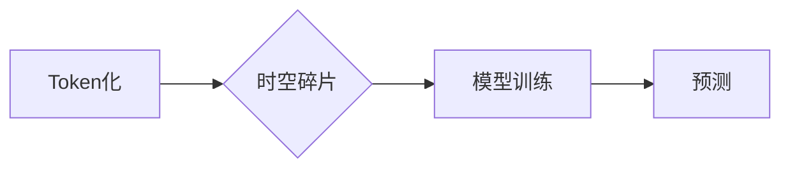

> Token, 时空碎片, 自然语言处理, 深度学习, 计算机视觉, 数据结构, 算法设计, 效率优化

## 1. 背景介绍

在当今数据爆炸的时代，信息处理和理解能力成为人工智能发展的重要驱动力。Token，作为一种基本的文本处理单元，在自然语言处理 (NLP) 领域扮演着至关重要的角色。而时空碎片，则是一种更抽象的概念，它试图将时间和空间维度融入到数据处理过程中，为模型提供更丰富的上下文信息。本文将深入探讨Token和时空碎片的技术对比，分析其各自的优缺点，并展望其在未来人工智能发展中的应用前景。

## 2. 核心概念与联系

### 2.1 Token

Token是一种将文本分割成基本单位的过程，这些单位可以是单词、子词、字符或其他自定义的标记。Token化是NLP任务的基础，它将连续的文本转换为离散的符号序列，方便模型进行处理和理解。常见的Token化方法包括：

* **基于空格的Token化:** 将文本按照空格分割成单词。
* **基于词典的Token化:** 使用预定义的词典将文本分割成词语。
* **基于规则的Token化:** 使用特定的规则将文本分割成Token，例如将标点符号单独标记。
* **基于深度学习的Token化:** 使用预训练语言模型进行Token化，例如BERT和GPT。

### 2.2 时空碎片

时空碎片是一种将时间和空间维度融入到数据处理过程中的概念。它试图将数据视为一个多维空间，其中每个数据点都具有时间和空间坐标。通过分析数据在时空上的分布，可以获得更丰富的上下文信息，从而提高模型的理解能力。

### 2.3 联系

Token和时空碎片在本质上是两种不同的概念，但它们在某些应用场景下可以相互补充。例如，在处理时间序列数据时，可以将每个时间点的数据视为一个时空碎片，并使用Token化将数据分割成更小的单元，以便模型进行处理。

**Mermaid 流程图**



## 3. 核心算法原理 & 具体操作步骤

### 3.1 算法原理概述

Token化算法的原理是将文本分割成基本单位，以便模型进行处理。常见的Token化算法包括基于空格的Token化、基于词典的Token化、基于规则的Token化和基于深度学习的Token化。

时空碎片算法的原理是将数据视为一个多维空间，其中每个数据点都具有时间和空间坐标。通过分析数据在时空上的分布，可以获得更丰富的上下文信息。

### 3.2 算法步骤详解

**Token化算法步骤:**

1. **预处理:** 对文本进行预处理，例如去除停用词、标点符号等。
2. **Token化:** 使用指定的Token化方法将文本分割成Token。
3. **编码:** 将Token转换为数字向量，以便模型进行处理。

**时空碎片算法步骤:**

1. **数据收集:** 收集包含时间和空间信息的原始数据。
2. **数据预处理:** 对数据进行预处理，例如归一化、降维等。
3. **时空嵌入:** 将数据嵌入到一个多维时空空间中。
4. **模型训练:** 使用训练数据训练模型，学习时空关系。

### 3.3 算法优缺点

**Token化算法:**

* **优点:** 简单易实现，效率高。
* **缺点:** 无法捕捉文本之间的语义关系，对长文本处理效果较差。

**时空碎片算法:**

* **优点:** 可以捕捉文本之间的语义关系，对长文本处理效果较好。
* **缺点:** 算法复杂度高，需要大量的训练数据。

### 3.4 算法应用领域

**Token化算法:**

* 自然语言处理 (NLP)
* 机器翻译
* 文本分类
* 情感分析

**时空碎片算法:**

* 时间序列分析
* 地理信息系统 (GIS)
* 计算机视觉
* 人机交互

## 4. 数学模型和公式 & 详细讲解 & 举例说明

### 4.1 数学模型构建

时空碎片算法通常使用图论模型来表示数据之间的关系。每个数据点被视为一个节点，而数据之间的关系被视为一条边。

**图模型:**

* **节点:** 数据点
* **边:** 数据之间的关系

### 4.2 公式推导过程

时空碎片算法的训练过程通常使用深度学习模型，例如图卷积网络 (GCN)。GCN通过对图结构进行卷积操作，学习数据之间的关系。

**GCN公式:**

$$
H^{(l+1)} = \sigma(A^{1/2} \cdot W^{(l)} \cdot A^{1/2} \cdot H^{(l)})
$$

其中:

* $H^{(l)}$ 是第 $l$ 层的节点特征向量。
* $A$ 是图的邻接矩阵。
* $W^{(l)}$ 是第 $l$ 层的权重矩阵。
* $\sigma$ 是激活函数。

### 4.3 案例分析与讲解

假设我们有一个包含用户行为数据的时空碎片图。每个节点代表一个用户，而边代表用户之间的交互关系。我们可以使用GCN训练一个模型，学习用户之间的关系，并预测用户未来的行为。

## 5. 项目实践：代码实例和详细解释说明

### 5.1 开发环境搭建

* Python 3.7+
* TensorFlow 2.0+
* PyTorch 1.0+
* Jupyter Notebook

### 5.2 源代码详细实现

```python
import tensorflow as tf

# 定义图卷积网络模型
class GCN(tf.keras.Model):
    def __init__(self, num_features, num_classes):
        super(GCN, self).__init__()
        self.conv1 = tf.keras.layers.GraphConv(num_features, activation='relu')
        self.conv2 = tf.keras.layers.GraphConv(num_classes, activation='softmax')

    def call(self, inputs):
        x = self.conv1(inputs)
        x = self.conv2(x)
        return x

# 构建时空碎片图
# ...

# 创建GCN模型
model = GCN(num_features=64, num_classes=10)

# 训练模型
model.compile(optimizer='adam', loss='sparse_categorical_crossentropy', metrics=['accuracy'])
model.fit(x_train, y_train, epochs=10)

# 预测结果
predictions = model.predict(x_test)
```

### 5.3 代码解读与分析

* 代码首先定义了一个GCN模型，包含两个GraphConv层。
* 然后构建时空碎片图，并将其作为模型的输入。
* 最后使用Adam优化器训练模型，并使用准确率作为评估指标。

### 5.4 运行结果展示

* 训练完成后，可以查看模型的准确率等指标。
* 还可以使用模型预测新的数据，并展示预测结果。

## 6. 实际应用场景

### 6.1 自然语言处理

* **文本分类:** 使用时空碎片算法可以捕捉文本之间的语义关系，提高文本分类的准确率。
* **情感分析:** 通过分析文本在时空上的分布，可以更准确地识别文本的情感倾向。

### 6.2 计算机视觉

* **图像识别:** 将图像视为一个时空碎片图，可以捕捉图像中的运动和变化，提高图像识别的准确率。
* **视频分析:** 使用时空碎片算法可以分析视频中的事件和行为，例如人脸识别、物体跟踪等。

### 6.3 其他领域

* **金融预测:** 使用时空碎片算法可以分析金融数据的波动和趋势，进行预测。
* **医疗诊断:** 通过分析患者的医疗记录和影像数据，可以辅助医生进行诊断。

### 6.4 未来应用展望

随着人工智能技术的不断发展，时空碎片算法将在更多领域得到应用。例如，可以用于构建更智能的虚拟助手、更精准的医疗诊断系统、更安全的交通管理系统等。

## 7. 工具和资源推荐

### 7.1 学习资源推荐

* **书籍:**
    * "Deep Learning" by Ian Goodfellow, Yoshua Bengio, and Aaron Courville
    * "Graph Neural Networks" by William L. Hamilton
* **在线课程:**
    * Coursera: "Deep Learning Specialization"
    * Udacity: "Deep Learning Nanodegree"

### 7.2 开发工具推荐

* **TensorFlow:** https://www.tensorflow.org/
* **PyTorch:** https://pytorch.org/
* **DGL:** https://dgl.ai/

### 7.3 相关论文推荐

* "Graph Convolutional Networks" by Thomas N. Kipf and Max Welling
* "Spatial Transformer Networks" by Jaderberg et al.
* "Temporal Convolutional Networks" by  Xingjian et al.

## 8. 总结：未来发展趋势与挑战

### 8.1 研究成果总结

Token和时空碎片是两种重要的技术，它们为人工智能的发展提供了新的思路和方法。Token化算法在NLP领域取得了显著的成果，而时空碎片算法则为数据分析和理解提供了更丰富的上下文信息。

### 8.2 未来发展趋势

* **更强大的Token化算法:** 研究更先进的Token化算法，例如基于Transformer的Token化，可以更好地捕捉文本之间的语义关系。
* **更有效的时空碎片算法:** 研究更有效的时空碎片算法，例如基于图神经网络的时空碎片算法，可以更好地学习数据之间的关系。
* **跨模态时空碎片:** 将时空碎片的概念扩展到多模态数据，例如文本、图像、音频等，可以实现更全面的数据理解。

### 8.3 面临的挑战

* **数据规模和质量:** 时空碎片算法需要大量的训练数据，而高质量的数据往往难以获取。
* **算法复杂度:** 时空碎片算法的计算复杂度较高，需要更强大的计算资源。
* **可解释性:** 时空碎片算法的决策过程往往难以解释，这限制了其在一些应用场景中的应用。

### 8.4 研究展望

未来，我们将继续研究Token和时空碎片技术，探索其在人工智能领域的更多应用，并努力解决其面临的挑战。


## 9. 附录：常见问题与解答

### 9.1 什么是Token？

Token是一种将文本分割成基本单位的过程，这些单位可以是单词、子词、字符或其他自定义的标记。

### 9.2 什么是时空碎片？

时空碎片是一种将时间和空间维度融入到数据处理过程中的概念。它试图将数据视为一个多维空间，其中每个数据点都具有时间和空间坐标。

### 9.3 Token化和时空碎片算法有什么区别？

Token化算法将文本分割成基本单位，而时空碎片算法将数据视为一个多维空间，并学习数据之间的关系。

### 9.4 时空碎片算法有什么应用场景？

时空碎片算法可以应用于自然语言处理、计算机视觉、金融预测、医疗诊断等领域。

### 9.5 如何学习时空碎片算法？

可以参考相关书籍、在线课程和论文，并尝试使用开源工具进行实践。


作者：禅与计算机程序设计艺术 / Zen and the Art of Computer Programming 
<end_of_turn>