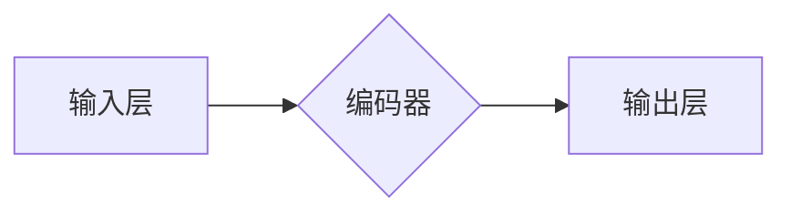

> Transformer, BERT, 自然语言处理, 预训练模型, 序列标注, 文本分类, 语言理解

## 1. 背景介绍

近年来，深度学习在自然语言处理 (NLP) 领域取得了显著进展，其中 Transformer 架构和基于 Transformer 的预训练语言模型 (PLM) 成为 NLP 领域的新宠。BERT (Bidirectional Encoder Representations from Transformers) 是 Google AI 团队开发的基于 Transformer 架构的 PLM，凭借其强大的文本理解能力和广泛的应用场景，迅速成为 NLP 领域最受欢迎的模型之一。

BERT 的核心思想是通过双向编码来捕捉文本序列中的上下文信息，从而更好地理解文本的语义。与传统的单向编码模型相比，BERT 可以同时考虑前后文信息，从而获得更丰富的语义表示。

BERT 的预训练过程通常包括两个阶段：

* **Masked Language Modeling (MLM):** 在训练过程中，随机屏蔽一部分词语，然后让模型预测屏蔽词语的词性。
* **Next Sentence Prediction (NSP):** 给定两个句子，模型需要预测这两个句子是否相邻。

通过这两个预训练任务，BERT 可以学习到丰富的语言知识和语义表示。

## 2. 核心概念与联系

### 2.1 Transformer 架构

Transformer 架构是一种新型的序列到序列模型，它摒弃了传统的循环神经网络 (RNN) 的顺序处理方式，而是采用了注意力机制来捕捉序列中的长距离依赖关系。

Transformer 架构主要由以下几个部分组成：

* **Encoder:** 负责将输入序列编码成语义表示。
* **Decoder:** 负责根据编码后的语义表示生成输出序列。
* **注意力机制:** 用于捕捉序列中不同词语之间的关系。
* **多头注意力:** 将注意力机制扩展到多个头，从而学习到更丰富的语义信息。
* **前馈神经网络:** 用于对编码后的语义表示进行进一步的处理。

### 2.2 BERT 模型结构

BERT 模型基于 Transformer 架构，它是一个纯编码器模型，没有解码器部分。BERT 模型的结构可以分为以下几个部分：

* **输入层:** 将输入序列转换为词嵌入向量。
* **编码器:** 由多个 Transformer 块组成，每个 Transformer 块包含多头注意力层和前馈神经网络层。
* **输出层:** 根据编码后的语义表示进行下游任务的预测。

**Mermaid 流程图**



## 3. 核心算法原理 & 具体操作步骤

### 3.1 算法原理概述

BERT 的核心算法原理是基于 Transformer 架构的双向编码，通过 MLM 和 NSP 两个预训练任务来学习丰富的语言知识和语义表示。

* **双向编码:** BERT 采用双向编码的方式，可以同时考虑前后文信息，从而更好地理解文本的语义。
* **Masked Language Modeling (MLM):** 在训练过程中，随机屏蔽一部分词语，然后让模型预测屏蔽词语的词性。通过 MLM 任务，BERT 可以学习到词语的上下文语义信息。
* **Next Sentence Prediction (NSP):** 给定两个句子，模型需要预测这两个句子是否相邻。通过 NSP 任务，BERT 可以学习到句子之间的语义关系。

### 3.2 算法步骤详解

BERT 的训练过程可以分为以下几个步骤：

1. **数据预处理:** 将文本数据进行分词、标记等预处理操作。
2. **词嵌入:** 将每个词语转换为词嵌入向量。
3. **编码:** 将输入序列通过 BERT 的编码器进行编码，得到每个词语的语义表示。
4. **MLM 任务:** 在编码后的语义表示中随机屏蔽一部分词语，然后让模型预测屏蔽词语的词性。
5. **NSP 任务:** 给定两个句子，让模型预测这两个句子是否相邻。
6. **损失函数:** 使用交叉熵损失函数计算模型的损失值。
7. **反向传播:** 使用梯度下降算法更新模型参数。

### 3.3 算法优缺点

**优点:**

* **强大的文本理解能力:** BERT 可以捕捉文本序列中的长距离依赖关系，从而更好地理解文本的语义。
* **预训练模型:** BERT 的预训练模型可以用于各种下游任务，例如文本分类、问答系统、机器翻译等。
* **开源代码:** BERT 的开源代码可以方便地用于研究和开发。

**缺点:**

* **计算资源消耗:** BERT 的训练过程需要大量的计算资源。
* **参数量大:** BERT 的参数量很大，需要大量的内存来存储和处理。
* **数据依赖:** BERT 的性能取决于训练数据的质量。

### 3.4 算法应用领域

BERT 的应用领域非常广泛，例如：

* **文本分类:** 识别文本的类别，例如情感分析、主题分类等。
* **问答系统:** 回答用户提出的问题。
* **机器翻译:** 将文本从一种语言翻译成另一种语言。
* **文本摘要:** 生成文本的简短摘要。
* **对话系统:** 与用户进行自然语言对话。

## 4. 数学模型和公式 & 详细讲解 & 举例说明

### 4.1 数学模型构建

BERT 模型的数学模型可以概括为以下公式：

$$
H_t = \text{Encoder}(X_t)
$$

其中：

* $H_t$ 表示第 $t$ 个词语的隐藏状态向量。
* $X_t$ 表示第 $t$ 个词语的词嵌入向量。
* $\text{Encoder}$ 表示 BERT 的编码器。

### 4.2 公式推导过程

BERT 的编码器由多个 Transformer 块组成，每个 Transformer 块包含多头注意力层和前馈神经网络层。

* **多头注意力层:** 用于捕捉序列中不同词语之间的关系。
* **前馈神经网络层:** 用于对编码后的语义表示进行进一步的处理。

### 4.3 案例分析与讲解

假设我们有一个句子 "The cat sat on the mat"，BERT 模型会将每个词语转换为词嵌入向量，然后通过编码器进行编码，得到每个词语的隐藏状态向量。

通过多头注意力层，BERT 可以捕捉到 "cat" 和 "sat" 之间的语义关系，以及 "mat" 和 "on" 之间的语义关系。

通过前馈神经网络层，BERT 可以对编码后的语义表示进行进一步的处理，从而得到更丰富的语义信息。

## 5. 项目实践：代码实例和详细解释说明

### 5.1 开发环境搭建

* Python 3.6+
* TensorFlow 2.0+
* PyTorch 1.0+
* CUDA 10.0+

### 5.2 源代码详细实现

```python
# 导入必要的库
import tensorflow as tf

# 定义 BERT 模型的结构
class BERT(tf.keras.Model):
    def __init__(self, vocab_size, embedding_dim, num_heads, num_layers):
        super(BERT, self).__init__()
        self.embedding = tf.keras.layers.Embedding(vocab_size, embedding_dim)
        self.encoder = tf.keras.Sequential([
            tf.keras.layers.MultiHeadAttention(num_heads=num_heads, key_dim=embedding_dim),
            tf.keras.layers.LayerNormalization(),
            tf.keras.layers.Dense(embedding_dim, activation='relu'),
            tf.keras.layers.LayerNormalization(),
            # 添加更多 Transformer 块
        ])

    def call(self, inputs):
        # 将输入转换为词嵌入向量
        embeddings = self.embedding(inputs)
        # 通过编码器进行编码
        encoded_outputs = self.encoder(embeddings)
        return encoded_outputs

# 实例化 BERT 模型
bert = BERT(vocab_size=30000, embedding_dim=128, num_heads=8, num_layers=6)

# 训练模型
bert.compile(optimizer='adam', loss='mse')
bert.fit(x_train, y_train, epochs=10)
```

### 5.3 代码解读与分析

* **BERT 模型结构:** BERT 模型的结构由嵌入层、编码器和输出层组成。
* **嵌入层:** 将每个词语转换为词嵌入向量。
* **编码器:** 由多个 Transformer 块组成，每个 Transformer 块包含多头注意力层和前馈神经网络层。
* **输出层:** 根据编码后的语义表示进行下游任务的预测。
* **训练过程:** 使用交叉熵损失函数和 Adam 优化器训练 BERT 模型。

### 5.4 运行结果展示

训练完成后，可以将 BERT 模型应用于各种下游任务，例如文本分类、问答系统、机器翻译等。

## 6. 实际应用场景

BERT 在各种实际应用场景中都取得了优异的性能，例如：

* **搜索引擎:** BERT 可以用于改进搜索引擎的查询理解和结果排序。
* **聊天机器人:** BERT 可以用于训练更智能的聊天机器人，能够更好地理解用户的意图和需求。
* **问答系统:** BERT 可以用于构建更准确的问答系统，能够更好地理解用户的提问并给出准确的答案。
* **文本摘要:** BERT 可以用于生成更准确和更简洁的文本摘要。

### 6.4 未来应用展望

BERT 的未来应用前景非常广阔，例如：

* **多语言理解:** BERT 可以用于训练多语言理解模型，能够理解不同语言的文本。
* **代码生成:** BERT 可以用于训练代码生成模型，能够自动生成代码。
* **医疗诊断:** BERT 可以用于训练医疗诊断模型，能够辅助医生进行诊断。

## 7. 工具和资源推荐

### 7.1 学习资源推荐

* **BERT 官方论文:** https://arxiv.org/abs/1810.04805
* **Hugging Face Transformers 库:** https://huggingface.co/transformers/
* **TensorFlow 官方文档:** https://www.tensorflow.org/

### 7.2 开发工具推荐

* **Jupyter Notebook:** https://jupyter.org/
* **VS Code:** https://code.visualstudio.com/

### 7.3 相关论文推荐

* **XLNet:** https://arxiv.org/abs/1906.08237
* **RoBERTa:** https://arxiv.org/abs/1907.11692
* **GPT-3:** https://openai.com/blog/gpt-3/

## 8. 总结：未来发展趋势与挑战

### 8.1 研究成果总结

BERT 模型的提出和应用，标志着 Transformer 架构在 NLP 领域的成功应用，也推动了预训练语言模型的发展。BERT 模型的强大文本理解能力和广泛的应用场景，为 NLP 领域带来了新的机遇和挑战。

### 8.2 未来发展趋势

* **模型规模更大:** 未来，预训练语言模型的规模将会进一步扩大，从而获得更强大的文本理解能力。
* **多模态理解:** 未来，预训练语言模型将会融合多模态信息，例如文本、图像、音频等，从而实现更全面的理解。
* **个性化模型:** 未来，预训练语言模型将会更加个性化，能够根据用户的需求和偏好进行定制。

### 8.3 面临的挑战

* **计算资源消耗:** 训练大型预训练语言模型需要大量的计算资源，这对于资源有限的机构和个人来说是一个挑战。
* **数据安全:** 预训练语言模型的训练需要大量的文本数据，如何保证数据的安全和隐私是一个重要的挑战。
* **模型解释性:** 预训练语言模型的内部机制比较复杂，如何解释模型的决策过程是一个重要的研究方向。

### 8.4 研究展望

未来，预训练语言模型将会在更多领域得到应用，例如教育、医疗、法律等。同时，研究者也将继续探索预训练语言模型的新的应用场景和技术突破。

## 9. 附录：常见问题与解答

**Q1: BERT 模型的训练需要多少数据？**

A1: BERT 模型的训练需要大量的文本数据，通常需要数十亿个词语。

**Q2: BERT