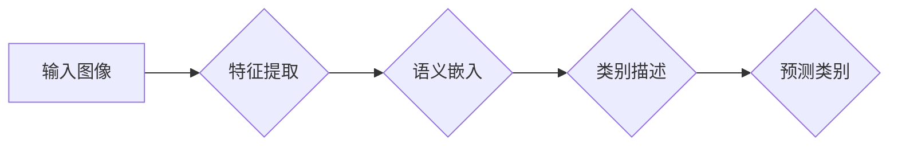

> Zero-Shot Learning, ZSL, 迁移学习,  Few-Shot Learning,  图像分类, 自然语言处理,  深度学习

## 1. 背景介绍

在机器学习领域，模型通常需要在特定任务上进行大量标注数据的训练才能达到良好的性能。然而，获取大量标注数据的成本高昂且耗时，这限制了机器学习模型在许多新兴领域中的应用。Zero-Shot Learning (ZSL) 作为一种突破性技术，旨在解决这一难题。ZSL 允许模型在从未见过样本的任务上进行预测，即模型可以学习到对新类别概念的理解，并将其应用于从未见过的类别。

ZSL 的核心思想是通过学习一个通用的语义表示来实现对新类别的泛化能力。模型可以学习到不同类别的语义特征，并利用这些特征来预测新类别的标签。例如，一个 ZSL 模型可以学习到“猫”和“狗”的语义特征，即使它从未见过“老虎”这个类别，它也可以根据“老虎”的语义描述预测其类别。

## 2. 核心概念与联系

ZSL 的核心概念包括：

* **语义嵌入:** 将类别信息映射到一个低维的语义空间，使得语义相似的类别在语义空间中距离较近。
* **零样本分类:** 在没有训练样本的情况下，利用语义嵌入和类别的语义描述来预测新类别的标签。

**Mermaid 流程图:**



## 3. 核心算法原理 & 具体操作步骤

### 3.1  算法原理概述

ZSL 算法通常分为以下几个步骤：

1. **语义嵌入学习:** 利用预训练模型或其他方法学习到类别之间的语义关系，并将类别映射到一个低维的语义空间。
2. **类别描述学习:** 对于每个类别，收集其相关的文本描述，并将其转换为语义向量。
3. **预测:** 将新样本的特征映射到语义空间，并计算其与每个类别的语义向量的相似度。选择相似度最高的类别作为预测结果。

### 3.2  算法步骤详解

1. **语义嵌入学习:**

   * 使用预训练模型，例如 Word2Vec 或 GloVe，学习到单词的语义向量。
   * 将类别的名称转换为单词序列，并利用预训练模型获得类别的语义向量。
   * 使用深度学习模型，例如 CNN 或 RNN，学习到类别之间的语义关系，并生成更精细的语义嵌入。

2. **类别描述学习:**

   * 收集每个类别的文本描述，例如维基百科条目、产品描述等。
   * 使用文本处理技术，例如分词、词干提取等，将文本描述转换为语义向量。
   * 使用深度学习模型，例如 Transformer，学习到类别描述的语义表示。

3. **预测:**

   * 将新样本的特征提取，并将其映射到语义空间。
   * 计算新样本的特征向量与每个类别的语义向量的相似度。
   * 选择相似度最高的类别作为预测结果。

### 3.3  算法优缺点

**优点:**

* 可以处理从未见过的类别。
* 不需要大量的标注数据。
* 可以利用丰富的文本描述信息。

**缺点:**

* 依赖于语义嵌入的质量。
* 对类别描述的质量要求较高。
* 在某些情况下，预测性能可能不如传统监督学习方法。

### 3.4  算法应用领域

ZSL 算法在以下领域具有广泛的应用前景:

* **图像分类:** 识别从未见过的物体类别。
* **自然语言处理:** 理解新出现的词汇或概念。
* **推荐系统:** 推荐从未接触过的商品或服务。
* **医疗诊断:** 识别新的疾病类型。

## 4. 数学模型和公式 & 详细讲解 & 举例说明

### 4.1  数学模型构建

假设我们有 $C$ 个类别，每个类别都有一个对应的语义向量 $c_i \in R^d$，其中 $d$ 是语义向量的维度。对于一个新样本 $x$，其特征向量为 $x \in R^m$，我们需要将其映射到语义空间，得到其语义向量 $x' \in R^d$。

### 4.2  公式推导过程

常用的语义嵌入方法包括线性映射和非线性映射。

* **线性映射:**

   $$x' = W x$$

   其中 $W$ 是一个 $d \times m$ 的权重矩阵。

* **非线性映射:**

   $$x' = f(Wx)$$

   其中 $f$ 是一个非线性激活函数，例如 ReLU 或 sigmoid。

### 4.3  案例分析与讲解

假设我们有一个图像分类任务，需要识别猫、狗和鸟三种类别。我们可以使用预训练的 ResNet 模型提取图像特征，并将特征向量映射到语义空间。

对于每个类别，我们可以收集其相关的文本描述，例如“猫是毛茸茸的动物”，“狗是忠诚的动物”，“鸟会飞”。我们可以使用 Word2Vec 模型学习到单词的语义向量，并将其组合起来得到每个类别的语义向量。

当我们遇到一个新的图像时，我们可以使用 ResNet 模型提取其特征向量，并将其映射到语义空间。然后，我们可以计算新样本的语义向量与每个类别的语义向量的相似度，并选择相似度最高的类别作为预测结果。

## 5. 项目实践：代码实例和详细解释说明

### 5.1  开发环境搭建

* Python 3.6+
* TensorFlow 2.0+
* PyTorch 1.0+
* OpenAI Gym

### 5.2  源代码详细实现

```python
import tensorflow as tf

# 定义一个简单的 ZSL 模型
class ZSLModel(tf.keras.Model):
    def __init__(self, embedding_dim, num_classes):
        super(ZSLModel, self).__init__()
        self.embedding = tf.keras.layers.Dense(embedding_dim)
        self.classifier = tf.keras.layers.Dense(num_classes)

    def call(self, inputs):
        embeddings = self.embedding(inputs)
        outputs = self.classifier(embeddings)
        return outputs

# 训练 ZSL 模型
model = ZSLModel(embedding_dim=128, num_classes=3)
model.compile(optimizer='adam', loss='sparse_categorical_crossentropy', metrics=['accuracy'])

# 训练数据
train_data = ...
# 验证数据
val_data = ...

model.fit(train_data, epochs=10, validation_data=val_data)

# 预测新样本
new_sample = ...
prediction = model.predict(new_sample)
```

### 5.3  代码解读与分析

* 我们定义了一个简单的 ZSL 模型，包含一个嵌入层和一个分类层。
* 嵌入层将特征向量映射到语义空间。
* 分类层将语义向量分类到不同的类别。
* 我们使用 Adam 优化器和交叉熵损失函数训练模型。
* 训练完成后，我们可以使用模型预测新样本的类别。

### 5.4  运行结果展示

训练完成后，我们可以使用模型预测新样本的类别，并评估模型的性能。

## 6. 实际应用场景

### 6.1  图像分类

ZSL 可以用于识别从未见过的物体类别，例如识别新的动物物种或植物种类。

### 6.2  自然语言处理

ZSL 可以用于理解新出现的词汇或概念，例如识别新兴的网络流行语或科技术语。

### 6.3  推荐系统

ZSL 可以用于推荐从未接触过的商品或服务，例如推荐用户可能感兴趣的新书或电影。

### 6.4  未来应用展望

ZSL 是一种有前途的技术，在未来将有更广泛的应用场景。例如，它可以用于自动驾驶、医疗诊断、金融风险评估等领域。

## 7. 工具和资源推荐

### 7.1  学习资源推荐

* **书籍:**
    * Zero-Shot Learning: A Comprehensive Survey
    * Deep Learning for Computer Vision with Python
* **论文:**
    * Zero-Shot Learning with Semantic Embeddings
    * A Survey on Zero-Shot Learning

### 7.2  开发工具推荐

* **TensorFlow:** https://www.tensorflow.org/
* **PyTorch:** https://pytorch.org/
* **OpenAI Gym:** https://gym.openai.com/

### 7.3  相关论文推荐

* **Zero-Shot Learning with Semantic Embeddings:** https://arxiv.org/abs/1607.05153
* **A Survey on Zero-Shot Learning:** https://arxiv.org/abs/1907.05728

## 8. 总结：未来发展趋势与挑战

### 8.1  研究成果总结

ZSL 领域取得了显著的进展，例如语义嵌入学习、类别描述学习和预测算法等方面都取得了新的突破。

### 8.2  未来发展趋势

* **更强大的语义嵌入模型:** 研究更强大的语义嵌入模型，例如 Transformer 和 Graph Neural Networks，以更好地学习类别之间的语义关系。
* **更丰富的类别描述信息:** 利用更丰富的类别描述信息，例如图像、视频和音频，以提高模型的预测性能。
* **跨模态 ZSL:** 研究跨模态 ZSL，例如将图像和文本信息结合起来进行预测。

### 8.3  面临的挑战

* **语义漂移:** 随着时间的推移，语义含义可能会发生变化，这会导致模型的性能下降。
* **数据稀疏性:** 许多新类别的数据非常稀疏，这使得模型难以学习到有效的语义表示。
* **可解释性:** ZSL 模型的预测结果往往难以解释，这限制了其在一些应用场景中的使用。

### 8.4  研究展望

未来 ZSL 研究将继续探索更强大的模型、更丰富的类别描述信息和更有效的训练方法，以提高模型的性能和可解释性。


## 9. 附录：常见问题与解答

### 9.1  什么是零样本学习？

零样本学习 (Zero-Shot Learning) 是一种机器学习方法，它允许模型在没有训练样本的情况下进行预测。

### 9.2  ZSL 与 Few-Shot Learning 的区别？

ZSL 和 Few-Shot Learning 都是少样本学习的方法，但它们的区别在于：

* ZSL 不需要任何训练样本，而 Few-Shot Learning 需要少量训练样本。
* ZSL 关注的是识别从未见过的类别，而 Few-Shot Learning 关注的是在少量样本的情况下进行分类。

### 9.3  ZSL 的应用场景有哪些？

ZSL 的应用场景包括：

* 图像分类
* 自然语言处理
* 推荐系统
* 医疗诊断

### 9.4  ZSL 的局限性是什么？

ZSL 的局限性包括：

* 依赖于语义嵌入的质量
* 对类别描述的质量要求较高
* 在某些情况下，预测性能可能不如传统监督学习方法

### 9.5  如何学习 ZSL？

可以参考以下资源学习 ZSL：

* 书籍: Zero-Shot Learning: A Comprehensive Survey
* 论文: Zero-Shot Learning with Semantic Embeddings, A Survey on Zero-Shot Learning
* 在线课程: Coursera, edX, Udacity

作者：禅与计算机程序设计艺术 / Zen and the Art of Computer Programming


<end_of_turn>