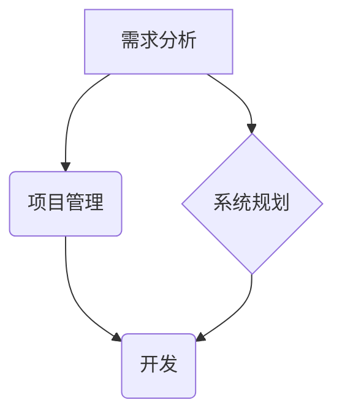

> 需求分析、项目管理、系统规划、软件开发、敏捷开发、迭代开发、风险管理、团队协作

## 1. 背景介绍

在当今科技日新月异的时代，软件开发已成为推动社会进步的重要引擎。然而，优秀的软件开发不仅仅依赖于技术能力，更需要具备扎实的需求分析、项目管理和系统规划能力。这些能力是软件开发项目的成功关键，能够有效地将用户的需求转化为高质量的软件产品，并确保项目按时、按预算、按质量完成。

传统的软件开发模式往往以瀑布模型为主，强调线性、顺序的开发流程。然而，随着软件开发的复杂性不断增加，瀑布模型的局限性也日益凸显。它难以应对需求变化、技术迭代和市场环境的快速变化。因此，敏捷开发模式应运而生，它强调迭代开发、持续反馈和团队协作，能够更好地适应现代软件开发的动态环境。

## 2. 核心概念与联系

**2.1 需求分析**

需求分析是软件开发项目的起点，它旨在深入了解用户的需求，并将其转化为清晰、可实现的软件功能描述。需求分析需要与用户进行充分沟通，收集用户的需求信息，并进行分析、整理和验证。

**2.2 项目管理**

项目管理是指规划、组织、协调和控制项目资源，以实现项目目标。项目管理涉及到时间管理、成本管理、风险管理、质量管理等多个方面。

**2.3 系统规划**

系统规划是指对软件系统的整体架构、功能模块、数据结构、接口设计等进行规划和设计。系统规划需要考虑软件系统的可扩展性、可维护性、安全性等因素。

**2.4 核心概念联系**

需求分析、项目管理和系统规划是软件开发过程中相互关联、相互影响的核心环节。需求分析为项目管理和系统规划提供基础，项目管理为系统规划和开发提供指导，系统规划为开发人员提供开发方向。



## 3. 核心算法原理 & 具体操作步骤

**3.1 算法原理概述**

在软件开发过程中，算法是解决问题的关键。算法的效率和正确性直接影响到软件的性能和质量。常见的软件开发算法包括排序算法、搜索算法、数据结构算法等。

**3.2 算法步骤详解**

以排序算法为例，常见的排序算法包括冒泡排序、插入排序、快速排序等。每个排序算法都有其独特的步骤和逻辑。例如，冒泡排序算法的步骤如下：

1. 比较相邻的两个元素，如果顺序错误，则交换它们的位置。
2. 重复步骤1，直到整个数组排序完成。

**3.3 算法优缺点**

不同的排序算法具有不同的时间复杂度和空间复杂度。例如，冒泡排序的时间复杂度为O(n^2)，空间复杂度为O(1)，而快速排序的时间复杂度为平均情况下为O(n log n)，空间复杂度为O(log n)。

**3.4 算法应用领域**

算法广泛应用于各个领域，例如：

* 数据处理：排序、查找、聚类等
* 图像处理：图像识别、图像压缩等
* 自然语言处理：文本分类、机器翻译等

## 4. 数学模型和公式 & 详细讲解 & 举例说明

**4.1 数学模型构建**

在软件开发中，数学模型可以用来描述软件系统的行为和性能。例如，可以使用数学模型来描述软件系统的响应时间、吞吐量、可靠性等指标。

**4.2 公式推导过程**

例如，可以使用以下公式来计算软件系统的平均响应时间：

$$
T_{avg} = \frac{1}{n} \sum_{i=1}^{n} T_i
$$

其中：

* $T_{avg}$：平均响应时间
* $n$：样本数量
* $T_i$：第i个样本的响应时间

**4.3 案例分析与讲解**

例如，假设我们对一个软件系统进行了10次测试，测试结果如下：

* 响应时间：100ms, 150ms, 200ms, 120ms, 180ms, 160ms, 140ms, 190ms, 170ms, 130ms

可以使用上述公式计算平均响应时间：

$$
T_{avg} = \frac{1}{10} (100 + 150 + 200 + 120 + 180 + 160 + 140 + 190 + 170 + 130) = 150ms
$$

## 5. 项目实践：代码实例和详细解释说明

**5.1 开发环境搭建**

在进行项目实践之前，需要搭建开发环境。开发环境包括操作系统、编程语言、开发工具等。

**5.2 源代码详细实现**

以一个简单的需求为例，例如开发一个简单的计算器应用程序。

```python
def add(x, y):
  """
  This function adds two numbers.
  """
  return x + y

def subtract(x, y):
  """
  This function subtracts two numbers.
  """
  return x - y

def multiply(x, y):
  """
  This function multiplies two numbers.
  """
  return x * y

def divide(x, y):
  """
  This function divides two numbers.
  """
  if y == 0:
    return "Division by zero error"
  else:
    return x / y

while True:
  print("Select operation:")
  print("1. Add")
  print("2. Subtract")
  print("3. Multiply")
  print("4. Divide")
  print("5. Exit")

  choice = input("Enter choice(1/2/3/4/5): ")

  if choice in ('1', '2', '3', '4'):
    try:
      num1 = float(input("Enter first number: "))
      num2 = float(input("Enter second number: "))
    except ValueError:
      print("Invalid input. Please enter numbers only.")
      continue

    if choice == '1':
      print(num1, "+", num2, "=", add(num1, num2))

    elif choice == '2':
      print(num1, "-", num2, "=", subtract(num1, num2))

    elif choice == '3':
      print(num1, "*", num2, "=", multiply(num1, num2))

    elif choice == '4':
      print(num1, "/", num2, "=", divide(num1, num2))
  elif choice == '5':
    break
  else:
    print("Invalid Input")
```

**5.3 代码解读与分析**

这段代码实现了一个简单的命令行计算器。它定义了四个函数：add、subtract、multiply、divide，分别对应加、减、乘、除四种运算。

主程序循环询问用户选择操作，并根据用户的选择调用相应的函数进行计算。

**5.4 运行结果展示**

当用户运行这段代码后，会看到以下界面：

```
Select operation:
1. Add
2. Subtract
3. Multiply
4. Divide
5. Exit
Enter choice(1/2/3/4/5): 1
Enter first number: 10
Enter second number: 5
10.0 + 5.0 = 15.0
```

## 6. 实际应用场景

需求分析、项目管理和系统规划能力在软件开发的各个阶段都发挥着重要作用。

**6.1 需求分析在软件开发中的应用**

需求分析是软件开发项目的起点，它可以帮助开发团队更好地理解用户的需求，并将其转化为可实现的软件功能。

**6.2 项目管理在软件开发中的应用**

项目管理可以帮助开发团队有效地规划、组织、协调和控制项目资源，确保项目按时、按预算、按质量完成。

**6.3 系统规划在软件开发中的应用**

系统规划可以帮助开发团队设计软件系统的整体架构、功能模块、数据结构、接口设计等，确保软件系统的可扩展性、可维护性和安全性。

**6.4 未来应用展望**

随着人工智能、云计算等技术的不断发展，软件开发的模式和需求也在不断变化。未来，需求分析、项目管理和系统规划能力将更加重要，并需要不断地学习和提升。

## 7. 工具和资源推荐

**7.1 学习资源推荐**

* 书籍：
    * 《软件工程》
    * 《敏捷软件开发》
    * 《需求工程》
* 在线课程：
    * Coursera
    * Udemy
    * edX

**7.2 开发工具推荐**

* 编程语言：Python, Java, C++, JavaScript
* 版本控制系统：Git
* 项目管理工具：Jira, Trello
* 代码编辑器：VS Code, Sublime Text

**7.3 相关论文推荐**

* 《敏捷软件开发的实践与研究》
* 《需求工程的最新进展》
* 《软件系统架构设计》

## 8. 总结：未来发展趋势与挑战

**8.1 研究成果总结**

需求分析、项目管理和系统规划能力是软件开发的核心能力，它们相互关联、相互影响，共同推动软件开发项目的成功。

**8.2 未来发展趋势**

未来，软件开发将更加注重用户体验、个性化定制和智能化。需求分析、项目管理和系统规划能力将更加重要，并需要不断地学习和提升。

**8.3 面临的挑战**

* 需求变化快速，难以预测
* 项目规模越来越大，管理难度越来越高
* 技术迭代速度快，需要不断学习新技术

**8.4 研究展望**

未来，需要进一步研究如何更好地应对需求变化、提高项目管理效率、提升系统规划的智能化水平。


## 9. 附录：常见问题与解答

**9.1 如何进行有效的需求分析？**

* 与用户进行充分沟通，了解用户的真实需求
* 使用多种需求收集方法，例如访谈、问卷调查、原型设计等
* 对收集到的需求进行分析、整理和验证，确保需求清晰、可实现

**9.2 如何进行有效的项目管理？**

* 制定详细的项目计划，包括时间计划、成本计划、资源计划等
* 使用项目管理工具，例如Jira, Trello等，跟踪项目进度和风险
* 定期进行项目回顾，总结经验教训，改进项目管理方法

**9.3 如何进行有效的系统规划？**

* 确定软件系统的目标和功能需求
* 设计软件系统的整体架构、功能模块、数据结构、接口设计等
* 考虑软件系统的可扩展性、可维护性和安全性


作者：禅与计算机程序设计艺术 / Zen and the Art of Computer Programming 
<end_of_turn>