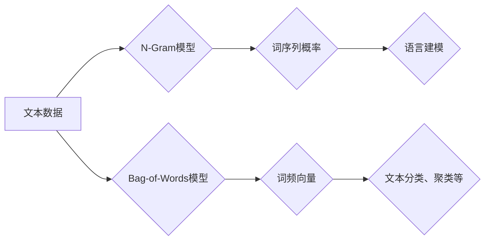

> N-Gram, Bag-of-Words, 语言模型, 文本表示, 自然语言处理, 机器学习

## 1. 背景介绍

在信息爆炸的时代，海量文本数据无处不在。如何有效地理解、分析和利用这些文本数据成为了一个重要的研究课题。自然语言处理（NLP）作为人工智能的重要分支，致力于使计算机能够理解、处理和生成人类语言。

语言模型是NLP领域的基础，它试图学习语言的统计规律，并根据这些规律预测下一个词或词序列。早期语言模型的出现为NLP的发展奠定了基础，也为后续更复杂、更强大的模型的发展提供了参考。

## 2. 核心概念与联系

### 2.1 N-Gram

N-Gram是一种统计语言模型，它基于词序列的统计信息来预测下一个词。N代表词序列的长度，例如：

* **Unigram (N=1):** 只考虑单个词的出现概率。
* **Bigram (N=2):** 考虑两个连续词的联合概率。
* **Trigram (N=3):** 考虑三个连续词的联合概率。

N-Gram模型的优点在于简单易懂，计算量相对较小，并且能够捕捉到一定的语言依赖关系。

### 2.2 Bag-of-Words

Bag-of-Words（BoW）是一种文本表示方法，它将文本视为一个词袋，忽略了词的顺序和语法结构。BoW模型将每个词的出现频率作为文本的特征向量，从而将文本表示为一个数字向量。

### 2.3 核心概念联系

N-Gram和BoW都是用于文本表示和语言建模的重要方法。N-Gram模型关注词之间的顺序关系，而BoW模型则忽略了词的顺序，只关注词的频率。两者各有优缺点，在不同的应用场景中会有不同的选择。



## 3. 核心算法原理 & 具体操作步骤

### 3.1 算法原理概述

N-Gram模型的核心原理是基于词序列的统计信息来预测下一个词。它通过计算不同词序列出现的频率，并根据这些频率来估计下一个词出现的概率。

BoW模型的核心原理是将文本视为一个词袋，忽略了词的顺序和语法结构。它通过统计每个词在文本中出现的频率，并将其作为文本的特征向量。

### 3.2 算法步骤详解

#### 3.2.1 N-Gram模型

1. **训练数据预处理:** 将训练数据进行清洗、分词等预处理操作。
2. **统计词序列频率:** 计算不同词序列出现的频率。
3. **计算概率:** 根据词序列频率，计算每个词在特定词序列出现的概率。
4. **预测下一个词:** 根据已知词序列，利用计算出的概率来预测下一个词。

#### 3.2.2 Bag-of-Words模型

1. **训练数据预处理:** 将训练数据进行清洗、分词等预处理操作。
2. **构建词典:** 从训练数据中构建词典，记录所有出现的词。
3. **计算词频:** 计算每个词在文本中出现的频率。
4. **构建特征向量:** 将每个文本表示为一个词频向量，其中每个元素代表词典中一个词的频率。

### 3.3 算法优缺点

#### 3.3.1 N-Gram模型

* **优点:** 能够捕捉到一定的语言依赖关系，预测效果相对较好。
* **缺点:** 计算量较大，随着N的增大，计算量呈指数级增长。

#### 3.3.2 Bag-of-Words模型

* **优点:** 计算量较小，易于实现。
* **缺点:** 忽略了词的顺序和语法结构，无法捕捉到复杂的语言依赖关系。

### 3.4 算法应用领域

* **文本分类:** 根据文本内容自动分类，例如垃圾邮件过滤、情感分析等。
* **文本聚类:** 将文本按照主题或内容进行分组。
* **机器翻译:** 将一种语言翻译成另一种语言。
* **语音识别:** 将语音信号转换为文本。

## 4. 数学模型和公式 & 详细讲解 & 举例说明

### 4.1 数学模型构建

#### 4.1.1 N-Gram模型

N-Gram模型的概率计算公式如下：

$$P(w_i | w_{i-N+1}, w_{i-N+2}, ..., w_{i-1})$$

其中：

* $w_i$ 是第i个词。
* $w_{i-N+1}, w_{i-N+2}, ..., w_{i-1}$ 是前N-1个词。

#### 4.1.2 Bag-of-Words模型

BoW模型将文本表示为一个词频向量，每个元素代表词典中一个词的频率。

$$v = (f_{w_1}, f_{w_2}, ..., f_{w_V})$$

其中：

* $v$ 是文本的词频向量。
* $f_{w_i}$ 是词典中第i个词在文本中出现的频率。
* $V$ 是词典的大小。

### 4.2 公式推导过程

N-Gram模型的概率计算公式可以通过最大似然估计推导得出。最大似然估计的目标是找到最能解释观测数据的参数值。

BoW模型的词频向量可以通过直接统计每个词在文本中出现的频率来计算。

### 4.3 案例分析与讲解

#### 4.3.1 N-Gram模型案例

假设我们有一个训练语料库，包含以下句子：

* "The cat sat on the mat."
* "The dog chased the ball."

我们可以使用N-Gram模型来预测下一个词。例如，对于词序列"The cat sat", 我们可以使用Trigram模型来预测下一个词。根据训练语料库，我们可以计算出以下概率：

* $P(on | The, cat, sat) = 1$
* $P(dog | The, cat, sat) = 0$

因此，根据Trigram模型，预测下一个词为"on"。

#### 4.3.2 Bag-of-Words模型案例

假设我们有一个训练语料库，包含以下句子：

* "The cat sat on the mat."
* "The dog chased the ball."

我们可以使用BoW模型来表示这些句子。假设我们的词典包含以下词：

* "the"
* "cat"
* "sat"
* "on"
* "mat"
* "dog"
* "chased"
* "ball"

那么，我们可以将这些句子表示为以下词频向量：

* "The cat sat on the mat.": (2, 1, 1, 1, 1, 0, 0, 0)
* "The dog chased the ball.": (2, 0, 0, 0, 0, 1, 1, 1)

## 5. 项目实践：代码实例和详细解释说明

### 5.1 开发环境搭建

* Python 3.x
* NLTK库
* Scikit-learn库

### 5.2 源代码详细实现

```python
import nltk
from nltk.corpus import gutenberg
from sklearn.feature_extraction.text import CountVectorizer

# 下载训练数据
nltk.download('gutenberg')

# 加载训练数据
text = gutenberg.raw('austen-emma.txt')

# 分词
tokens = nltk.word_tokenize(text)

# 使用Bag-of-Words模型构建特征向量
vectorizer = CountVectorizer()
X = vectorizer.fit_transform(tokens)

# 打印特征向量
print(X.toarray())
```

### 5.3 代码解读与分析

* 首先，我们使用NLTK库下载并加载训练数据。
* 然后，我们使用NLTK库的`word_tokenize()`函数对文本进行分词。
* 接下来，我们使用Scikit-learn库的`CountVectorizer()`类构建BoW模型，并将其应用于分词后的文本。
* 最后，我们打印生成的特征向量。

### 5.4 运行结果展示

运行代码后，会输出一个稀疏矩阵，其中每个元素代表词典中一个词在文本中出现的频率。

## 6. 实际应用场景

### 6.1 文本分类

N-Gram和BoW模型可以用于文本分类，例如垃圾邮件过滤、情感分析等。

### 6.2 文本聚类

N-Gram和BoW模型可以用于文本聚类，将文本按照主题或内容进行分组。

### 6.3 机器翻译

N-Gram模型可以用于机器翻译，将一种语言翻译成另一种语言。

### 6.4 未来应用展望

随着深度学习技术的不断发展，N-Gram和BoW模型在NLP领域将继续发挥重要作用。未来，这些模型可能会与深度学习模型相结合，构建更强大的语言模型，从而实现更精准、更智能的自然语言处理任务。

## 7. 工具和资源推荐

### 7.1 学习资源推荐

* **NLTK Book:** https://www.nltk.org/book/
* **Scikit-learn Documentation:** https://scikit-learn.org/stable/documentation.html

### 7.2 开发工具推荐

* **Python:** https://www.python.org/
* **NLTK:** https://www.nltk.org/
* **Scikit-learn:** https://scikit-learn.org/stable/

### 7.3 相关论文推荐

* **A Statistical Language Model Based on N-grams**
* **Bag-of-Words Model**

## 8. 总结：未来发展趋势与挑战

### 8.1 研究成果总结

N-Gram和BoW模型是NLP领域的重要基础，为后续更复杂、更强大的语言模型的发展奠定了基础。

### 8.2 未来发展趋势

随着深度学习技术的不断发展，N-Gram和BoW模型可能会与深度学习模型相结合，构建更强大的语言模型。

### 8.3 面临的挑战

* 如何处理长距离依赖关系
* 如何更好地捕捉语义信息
* 如何提高模型的泛化能力

### 8.4 研究展望

未来，N-Gram和BoW模型的研究方向将集中在解决上述挑战，并探索新的应用场景。

## 9. 附录：常见问题与解答

### 9.1 什么是N-Gram？

N-Gram是一种统计语言模型，它基于词序列的统计信息来预测下一个词。

### 9.2 什么是Bag-of-Words？

Bag-of-Words是一种文本表示方法，它将文本视为一个词袋，忽略了词的顺序和语法结构。

### 9.3 N-Gram和BoW模型有什么区别？

N-Gram模型关注词之间的顺序关系，而BoW模型则忽略了词的顺序，只关注词的频率。

### 9.4 N-Gram和BoW模型有什么应用场景？

N-Gram和BoW模型可以用于文本分类、文本聚类、机器翻译等。


作者：禅与计算机程序设计艺术 / Zen and the Art of Computer Programming 
<end_of_turn>