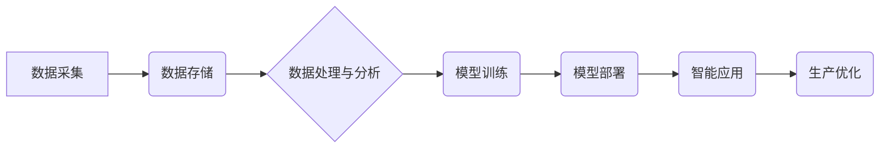

> AI、高端制造、创新体系、机器学习、深度学习、数据驱动、智能制造、工业互联网

## 1. 背景介绍

高端制造业是国家经济发展的重要支柱，其核心竞争力在于产品的高精度、高性能、高可靠性和个性化定制能力。然而，传统制造业面临着劳动力成本上升、生产效率低下、产品质量难以保证等挑战。人工智能（AI）作为第四次工业革命的重要驱动力，为高端制造业的转型升级提供了新的机遇。

AI技术能够通过对海量数据的分析和学习，实现智能化决策、自动化生产、精准控制等功能，从而提升高端制造业的生产效率、产品质量和创新能力。例如，AI驱动的机器视觉系统可以实现对产品缺陷的快速识别和分类，AI驱动的机器人可以实现自动化生产和装配，AI驱动的预测维护系统可以提前预警设备故障，避免生产停滞。

## 2. 核心概念与联系

**2.1  AI创新体系**

AI创新体系是指以人工智能技术为核心，融合数据、算法、平台、应用等多方面要素，构建起一套完整的创新体系，以推动高端制造业的智能化转型升级。

**2.2  高端制造业与AI的联系**

高端制造业与AI的结合，可以从以下几个方面体现：

* **数据驱动:** 高端制造业产生海量数据，AI技术可以对这些数据进行分析和挖掘，发现隐藏的规律和趋势，为生产决策提供数据支持。
* **智能化生产:** AI技术可以实现对生产过程的智能化控制，例如，通过机器视觉识别产品缺陷，通过机器人实现自动化生产，通过预测维护系统提前预警设备故障。
* **个性化定制:** AI技术可以根据客户需求进行产品个性化定制，例如，通过3D打印技术实现个性化产品生产，通过AI算法进行产品设计优化。

**2.3  AI创新体系架构**



## 3. 核心算法原理 & 具体操作步骤

**3.1  算法原理概述**

深度学习是AI领域的重要分支，其核心是利用多层神经网络对数据进行特征提取和学习。深度学习算法能够自动学习数据中的复杂模式和关系，从而实现对图像、语音、文本等数据的识别、分类、预测等任务。

**3.2  算法步骤详解**

1. **数据预处理:** 对原始数据进行清洗、转换、归一化等处理，使其适合深度学习模型的训练。
2. **网络结构设计:** 根据任务需求设计深度学习模型的网络结构，包括神经网络层数、节点数量、激活函数等参数。
3. **模型训练:** 使用训练数据对深度学习模型进行训练，通过调整模型参数，使模型的预测结果与真实值尽可能接近。
4. **模型评估:** 使用测试数据对训练好的模型进行评估，评估模型的准确率、召回率、F1-score等指标。
5. **模型部署:** 将训练好的模型部署到实际应用场景中，用于对新数据的预测和处理。

**3.3  算法优缺点**

**优点:**

* 能够自动学习数据中的复杂模式和关系。
* 具有较高的识别精度和预测准确率。
* 可以处理海量数据。

**缺点:**

* 训练数据量要求较高。
* 计算资源消耗较大。
* 模型解释性较差。

**3.4  算法应用领域**

* **图像识别:** 人脸识别、物体检测、图像分类等。
* **语音识别:** 语音转文本、语音合成等。
* **自然语言处理:** 文本分类、情感分析、机器翻译等。
* **预测分析:** 销售预测、故障预测等。

## 4. 数学模型和公式 & 详细讲解 & 举例说明

**4.1  数学模型构建**

深度学习模型通常采用多层神经网络结构，每个神经元接收多个输入信号，并通过激活函数进行处理，输出一个信号。神经网络的训练过程是通过调整神经元权重和偏置，使模型的输出与真实值尽可能接近。

**4.2  公式推导过程**

深度学习模型的训练过程通常使用反向传播算法，该算法通过计算误差梯度，逐步调整神经元权重和偏置，以最小化模型的损失函数。

损失函数通常定义为预测值与真实值的差值，例如均方误差（MSE）:

$$
MSE = \frac{1}{n} \sum_{i=1}^{n} (y_i - \hat{y}_i)^2
$$

其中，$y_i$ 是真实值，$\hat{y}_i$ 是预测值，$n$ 是样本数量。

**4.3  案例分析与讲解**

例如，在图像分类任务中，深度学习模型可以学习图像特征，并将其映射到不同的类别。模型的输出是一个概率分布，表示图像属于不同类别的概率。

假设模型输出图像属于类别 A 的概率为 0.8，类别 B 的概率为 0.2。如果设定阈值为 0.5，则模型将将图像分类为类别 A。

## 5. 项目实践：代码实例和详细解释说明

**5.1  开发环境搭建**

* 操作系统：Ubuntu 20.04
* Python 版本：3.8
* 深度学习框架：TensorFlow 2.0

**5.2  源代码详细实现**

```python
import tensorflow as tf

# 定义模型结构
model = tf.keras.models.Sequential([
    tf.keras.layers.Conv2D(32, (3, 3), activation='relu', input_shape=(28, 28, 1)),
    tf.keras.layers.MaxPooling2D((2, 2)),
    tf.keras.layers.Conv2D(64, (3, 3), activation='relu'),
    tf.keras.layers.MaxPooling2D((2, 2)),
    tf.keras.layers.Flatten(),
    tf.keras.layers.Dense(10, activation='softmax')
])

# 编译模型
model.compile(optimizer='adam',
              loss='sparse_categorical_crossentropy',
              metrics=['accuracy'])

# 训练模型
model.fit(x_train, y_train, epochs=5)

# 评估模型
loss, accuracy = model.evaluate(x_test, y_test)
print('Test loss:', loss)
print('Test accuracy:', accuracy)
```

**5.3  代码解读与分析**

* 代码首先定义了一个深度学习模型，该模型包含卷积层、池化层和全连接层。
* 然后，模型被编译，指定了优化器、损失函数和评价指标。
* 接着，模型被训练，使用训练数据进行训练。
* 最后，模型被评估，使用测试数据评估模型的性能。

**5.4  运行结果展示**

训练完成后，模型的准确率通常会达到较高的水平。

## 6. 实际应用场景

**6.1  智能制造**

* **质量控制:** AI驱动的机器视觉系统可以对产品进行实时检测，识别缺陷，提高产品质量。
* **生产优化:** AI算法可以分析生产数据，优化生产流程，提高生产效率。
* **预测维护:** AI驱动的预测维护系统可以提前预警设备故障，避免生产停滞。

**6.2  个性化定制**

* **3D打印:** AI算法可以根据客户需求进行3D模型设计，实现个性化产品定制。
* **服装设计:** AI算法可以根据客户的体型和喜好，推荐合适的服装款式和尺寸。

**6.3  供应链管理**

* **库存优化:** AI算法可以预测产品需求，优化库存管理，降低库存成本。
* **物流配送:** AI算法可以优化物流路线，提高配送效率。

**6.4  未来应用展望**

随着AI技术的不断发展，其在高端制造业的应用场景将更加广泛，例如：

* **协作机器人:** AI驱动的协作机器人可以与人类工人在同一工作环境中协作，提高生产效率。
* **数字孪生:** AI驱动的数字孪生技术可以模拟现实世界中的生产过程，帮助企业进行虚拟测试和优化。
* **工业互联网:** AI技术将成为工业互联网的重要组成部分，推动高端制造业的数字化转型。

## 7. 工具和资源推荐

**7.1  学习资源推荐**

* **在线课程:** Coursera、edX、Udacity等平台提供丰富的AI课程。
* **书籍:** 《深度学习》、《机器学习实战》等书籍。
* **开源项目:** TensorFlow、PyTorch等开源深度学习框架。

**7.2  开发工具推荐**

* **Python:** 深度学习开发的主要编程语言。
* **TensorFlow:** Google开发的开源深度学习框架。
* **PyTorch:** Facebook开发的开源深度学习框架。

**7.3  相关论文推荐**

* **AlexNet:** 《ImageNet Classification with Deep Convolutional Neural Networks》
* **VGGNet:** 《Very Deep Convolutional Networks for Large-Scale Image Recognition》
* **ResNet:** 《Deep Residual Learning for Image Recognition》

## 8. 总结：未来发展趋势与挑战

**8.1  研究成果总结**

近年来，AI技术在高端制造业取得了显著的成果，例如，AI驱动的机器视觉系统、机器人、预测维护系统等，已经应用于多个领域，提高了生产效率、产品质量和创新能力。

**8.2  未来发展趋势**

* **模型更加复杂:** 未来，深度学习模型将更加复杂，包含更多的层数和参数，能够学习更加复杂的特征。
* **数据更加丰富:** 未来，高端制造业将产生更加丰富的数据，为AI模型的训练提供更多的数据支持。
* **应用更加广泛:** 未来，AI技术将应用于高端制造业的更多领域，例如，协作机器人、数字孪生等。

**8.3  面临的挑战**

* **数据安全:** 高端制造业的数据通常包含敏感信息，需要采取措施保障数据安全。
* **算法解释性:** 深度学习模型的解释性较差，难以理解模型的决策过程。
* **人才短缺:** 高端制造业需要大量AI人才，但目前人才供给不足。

**8.4  研究展望**

未来，需要进一步研究以下问题：

* 如何提高深度学习模型的解释性？
* 如何保障AI模型在高端制造业的应用安全？
* 如何培养更多AI人才？


## 9. 附录：常见问题与解答

**9.1  Q: 如何选择合适的深度学习框架？**

**A:** TensorFlow和PyTorch是目前最流行的深度学习框架，选择哪个框架取决于个人喜好和项目需求。

**9.2  Q: 如何处理高维数据？**

**A:** 可以使用降维技术，例如主成分分析（PCA）或t-SNE，将高维数据降维到低维空间。

**9.3  Q: 如何评估深度学习模型的性能？**

**A:** 可以使用准确率、召回率、F1-score等指标评估模型的性能。

**9.4  Q: 如何防止深度学习模型过拟合？**

**A:** 可以使用正则化技术、交叉验证等方法防止模型过拟合。


作者：禅与计算机程序设计艺术 / Zen and the Art of Computer Programming 
<end_of_turn>