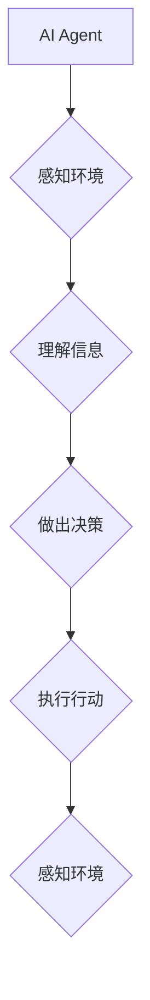

> AI Agent, 具身智能, 强化学习, 计算机视觉, 自然语言处理, 机器人学, 深度学习

## 1. 背景介绍

人工智能（AI）技术近年来取得了飞速发展，从语音识别、图像识别到自然语言处理等领域取得了突破性进展。然而，传统的AI模型大多局限于数字空间，缺乏与物理世界直接交互的能力。随着技术的进步，**具身智能（Embodied Intelligence）** 作为AI发展的新方向，逐渐受到越来越多的关注。

具身智能是指赋予AI代理（AI Agent）感知、行动和交互的能力，使其能够在物理世界中感知环境、理解信息、做出决策并执行行动。与传统的AI模型相比，具身智能具有以下特点：

* **感知能力增强:** 具身智能代理可以通过传感器（如摄像头、麦克风、触觉传感器等）感知物理世界的各种信息，例如视觉、声音、触觉等。
* **行动能力提升:** 具身智能代理可以利用 actuators（如电机、关节等）与物理世界进行交互，例如移动、抓取、 Manipulation 等。
* **学习能力更强:** 通过与物理世界的交互，具身智能代理可以进行更有效的学习和适应，例如通过强化学习（Reinforcement Learning）从经验中学习最佳策略。
* **更强的通用性:** 具身智能代理能够应用于更广泛的场景，例如机器人、自动驾驶、医疗辅助等。

## 2. 核心概念与联系

**AI Agent:** AI Agent 是一个能够感知环境、做出决策并执行行动的智能体。它可以是软件程序、机器人或其他形式的实体。

**具身智能:** 具身智能是指赋予AI Agent感知、行动和交互的能力，使其能够在物理世界中感知环境、理解信息、做出决策并执行行动。

**强化学习:** 强化学习是一种机器学习方法，通过奖励和惩罚机制，训练AI Agent学习最佳策略。

**计算机视觉:** 计算机视觉是让计算机“看”世界的一种技术，包括图像识别、物体检测、场景理解等。

**自然语言处理:** 自然语言处理是让计算机理解和处理人类语言的技术，包括文本分类、机器翻译、对话系统等。

**机器人学:** 机器人学是研究设计、制造和控制机器人的学科。

**深度学习:** 深度学习是一种机器学习方法，利用多层神经网络学习复杂数据模式。

**Mermaid 流程图:**



## 3. 核心算法原理 & 具体操作步骤

### 3.1  算法原理概述

具身智能的核心算法主要包括强化学习、计算机视觉、自然语言处理和机器人学等。

* **强化学习:** 通过奖励和惩罚机制，训练AI Agent学习最佳策略。
* **计算机视觉:** 帮助AI Agent感知和理解视觉信息。
* **自然语言处理:** 帮助AI Agent理解和处理语言信息。
* **机器人学:** 提供AI Agent与物理世界交互的平台和工具。

### 3.2  算法步骤详解

1. **环境建模:** 建立物理世界的模型，包括环境状态、动作空间和奖励函数。
2. **代理设计:** 设计AI Agent的架构，包括感知模块、决策模块和执行模块。
3. **强化学习训练:** 使用强化学习算法训练AI Agent，使其学习最佳策略。
4. **感知信息获取:** AI Agent通过传感器获取环境信息。
5. **信息处理:** AI Agent利用计算机视觉和自然语言处理技术处理感知信息。
6. **决策制定:** AI Agent根据处理后的信息和强化学习策略制定决策。
7. **动作执行:** AI Agent通过 actuators 执行决策。
8. **奖励反馈:** 环境根据AI Agent的动作提供奖励或惩罚。
9. **迭代学习:** AI Agent根据奖励反馈更新策略，不断改进行为。

### 3.3  算法优缺点

**优点:**

* 能够学习更复杂的策略。
* 能够适应动态变化的环境。
* 能够应用于更广泛的场景。

**缺点:**

* 训练时间长，计算资源消耗大。
* 需要大量的训练数据。
* 算法复杂度高，难以解释。

### 3.4  算法应用领域

* **机器人:** 构建更智能、更灵活的机器人。
* **自动驾驶:** 开发更安全的自动驾驶系统。
* **医疗辅助:** 提供更精准的医疗诊断和治疗方案。
* **教育:** 创建更个性化的学习体验。

## 4. 数学模型和公式 & 详细讲解 & 举例说明

### 4.1  数学模型构建

强化学习的核心是马尔可夫决策过程（MDP）。MDP模型由以下几个要素组成：

* **状态空间 (S):** 环境可能存在的各种状态。
* **动作空间 (A):** AI Agent可以执行的动作。
* **转移概率 (P):** 从一个状态执行一个动作后转移到另一个状态的概率。
* **奖励函数 (R):** 在某个状态执行某个动作后获得的奖励。
* **折扣因子 (γ):** 未来奖励的权重。

### 4.2  公式推导过程

强化学习的目标是找到一个策略 π，使得在该策略下，AI Agent获得最大的累积奖励。

**Bellman 方程:**

$$
V^{\pi}(s) = \max_{a \in A} \left[ R(s, a) + \gamma \sum_{s' \in S} P(s' | s, a) V^{\pi}(s') \right]
$$

其中：

* $V^{\pi}(s)$ 是在策略 π 下，从状态 s 开始的期望累积奖励。
* $R(s, a)$ 是在状态 s 执行动作 a 后获得的奖励。
* $P(s' | s, a)$ 是从状态 s 执行动作 a 后转移到状态 s' 的概率。

### 4.3  案例分析与讲解

例如，训练一个机器人学会在迷宫中找到出口。

* **状态空间:** 迷宫中的每个位置。
* **动作空间:** 向上、向下、向左、向右四个方向移动。
* **转移概率:** 根据迷宫地图确定每个动作转移到下一个位置的概率。
* **奖励函数:** 找到出口获得最大奖励，迷宫中其他位置获得较小奖励或惩罚。

通过Bellman方程和强化学习算法，机器人可以学习出最优策略，找到迷宫出口。

## 5. 项目实践：代码实例和详细解释说明

### 5.1  开发环境搭建

* 操作系统: Ubuntu 20.04
* Python 版本: 3.8
* 库依赖: TensorFlow, PyTorch, OpenAI Gym

### 5.2  源代码详细实现

```python
import gym
import numpy as np

# 定义环境
class MyEnv(gym.Env):
    def __init__(self):
        # 初始化环境
        pass

    def step(self, action):
        # 执行动作
        pass

    def reset(self):
        # 重置环境
        pass

    def render(self):
        # 渲染环境
        pass

# 创建环境实例
env = MyEnv()

# 训练循环
for episode in range(100):
    state = env.reset()
    done = False
    while not done:
        # 选择动作
        action = env.action_space.sample()
        # 执行动作
        next_state, reward, done, info = env.step(action)
        # 更新状态
        state = next_state
        # 打印奖励
        print(reward)

# 关闭环境
env.close()
```

### 5.3  代码解读与分析

* **环境定义:** `MyEnv` 类继承自 `gym.Env`，定义了环境的初始化、步骤执行、重置和渲染等方法。
* **训练循环:** 循环训练多个episode，每个episode中，AI Agent与环境交互，执行动作并获得奖励。
* **动作选择:** 使用 `env.action_space.sample()` 随机选择动作。
* **环境交互:** 使用 `env.step()` 执行动作，获取下一个状态、奖励、是否结束等信息。
* **状态更新:** 更新当前状态为下一个状态。
* **奖励打印:** 打印每次获得的奖励。

### 5.4  运行结果展示

运行代码后，会打印出每个episode的奖励信息，可以观察到AI Agent的学习过程。

## 6. 实际应用场景

### 6.1  机器人

* **工业机器人:** 提高机器人生产效率和精度。
* **服务机器人:** 提供更智能的客户服务和家政服务。
* **医疗机器人:** 协助医生进行手术和治疗。

### 6.2  自动驾驶

* **自动驾驶汽车:** 开发更安全、更智能的自动驾驶系统。
* **无人机:** 实现无人机自主导航和任务执行。

### 6.3  医疗辅助

* **诊断辅助:** 帮助医生更快、更准确地诊断疾病。
* **治疗辅助:** 提供更精准的治疗方案。

### 6.4  未来应用展望

* **个性化教育:** 创建更个性化的学习体验。
* **虚拟助手:** 开发更智能的虚拟助手。
* **娱乐:** 创造更沉浸式的游戏和娱乐体验。

## 7. 工具和资源推荐

### 7.1  学习资源推荐

* **书籍:**
    * 《Reinforcement Learning: An Introduction》
    * 《Deep Learning》
* **在线课程:**
    * Coursera: Reinforcement Learning Specialization
    * Udacity: Self-Driving Car Engineer Nanodegree

### 7.2  开发工具推荐

* **TensorFlow:** 深度学习框架。
* **PyTorch:** 深度学习框架。
* **OpenAI Gym:** 强化学习环境库。

### 7.3  相关论文推荐

* **Deep Reinforcement Learning with Double Q-learning**
* **Proximal Policy Optimization Algorithms**
* **Asynchronous Methods for Deep Reinforcement Learning**

## 8. 总结：未来发展趋势与挑战

### 8.1  研究成果总结

具身智能是AI发展的新方向，取得了显著的进展。强化学习、计算机视觉、自然语言处理和机器人学等技术相互融合，推动了具身智能的发展。

### 8.2  未来发展趋势

* **更强大的感知能力:** 利用更先进的传感器和计算机视觉技术，增强AI Agent的感知能力。
* **更灵活的行动能力:** 开发更灵活、更精细的动作控制技术，使AI Agent能够更好地与物理世界交互。
* **更智能的决策能力:** 利用更先进的机器学习算法，提高AI Agent的决策能力和适应性。
* **更广泛的应用场景:** 将具身智能应用于更多领域，例如医疗、教育、娱乐等。

### 8.3  面临的挑战

* **算法复杂度:** 具身智能算法复杂度高，难以解释和调试。
* **数据需求:** 训练具身智能模型需要大量的训练数据，收集和标注数据成本高。
* **安全性和可靠性:** 具身智能代理在现实世界中运行存在安全性和可靠性问题。

### 8.4  研究展望

未来，具身智能研究将继续深入，探索更智能、更安全、更可靠的AI代理。


## 9. 附录：常见问题与解答

**Q1: 具身智能与传统AI有什么区别？**

**A1:** 传统AI主要局限于数字空间，而具身智能赋予AI代理感知、行动和交互的能力，使其能够与物理世界直接交互。

**Q2: 具身智能的应用场景有哪些？**

**A2:** 具身智能的应用场景非常广泛，例如机器人、自动驾驶、医疗辅助、教育等。

**Q3: 如何训练具身智能代理？**

**A3:** 使用强化学习算法训练具身智能代理，通过奖励和惩罚机制，使其学习最佳策略。

**Q4: 具身智能面临哪些挑战？**

**A4:** 具身智能面临的