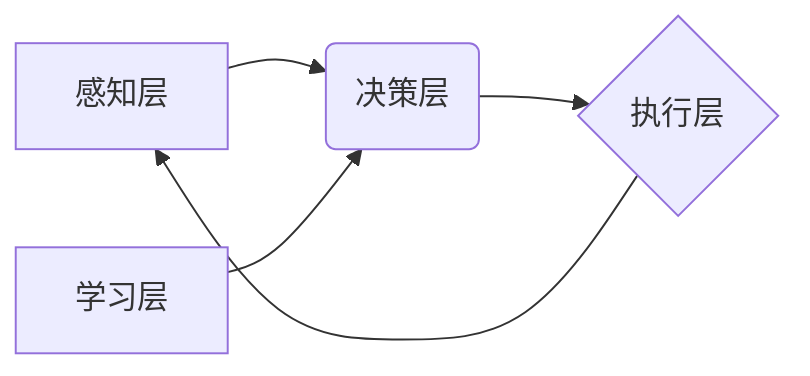

> AI Agent, 智能代理, 用户体验, 自然语言处理, 机器学习, 深度学习, 聊天机器人, 个性化服务

## 1. 背景介绍

人工智能（AI）技术近年来发展迅速，从语音识别、图像识别到自然语言处理，AI已经渗透到我们生活的方方面面。然而，传统的AI应用大多是局限于特定的任务，例如图像分类、文本摘要等。随着AI技术的不断进步，一个新的概念——AI Agent（智能代理）逐渐成为人们关注的焦点。

AI Agent是一种能够自主学习、决策和执行任务的智能实体。它可以理解用户需求，并根据上下文和历史数据提供个性化的服务。与传统的AI应用相比，AI Agent更加智能、灵活和自主，能够更好地适应复杂的环境和用户的动态需求。

## 2. 核心概念与联系

**2.1 AI Agent 的定义**

AI Agent是一种能够感知环境、做出决策并执行行动的智能系统。它通常具有以下特征：

* **感知能力:** AI Agent能够通过传感器或其他方式获取环境信息。
* **决策能力:** AI Agent能够根据感知到的信息和自身的知识库做出决策。
* **执行能力:** AI Agent能够执行决策，并与环境进行交互。
* **学习能力:** AI Agent能够从经验中学习，并不断改进自身的决策能力。

**2.2 AI Agent 与其他技术的联系**

AI Agent 的实现依赖于多种人工智能技术，包括：

* **自然语言处理 (NLP):** 允许 AI Agent 理解和生成人类语言。
* **机器学习 (ML):** 赋予 AI Agent 学习和改进决策能力的能力。
* **深度学习 (DL):** 提供更强大的学习能力，能够处理更复杂的数据。
* **知识图谱 (KG):** 提供 AI Agent 理解世界知识的框架。

**2.3 AI Agent 的架构**

AI Agent 的架构通常包括以下几个部分：

* **感知层:** 收集环境信息。
* **决策层:** 根据感知信息和知识库做出决策。
* **执行层:** 执行决策，与环境交互。
* **学习层:** 从经验中学习，改进决策能力。



## 3. 核心算法原理 & 具体操作步骤

**3.1 算法原理概述**

AI Agent 的核心算法通常基于强化学习 (Reinforcement Learning, RL) 框架。强化学习是一种机器学习方法，它通过奖励和惩罚机制来训练 AI Agent 学习最佳的行为策略。

在强化学习中，AI Agent 处于一个环境中，它可以采取不同的行动，这些行动会对环境产生影响，并导致相应的奖励或惩罚。AI Agent 的目标是学习一个策略，使得它在长期内获得最大的总奖励。

**3.2 算法步骤详解**

1. **环境建模:** 建立一个数学模型来描述 AI Agent 所处的环境，包括状态空间、动作空间和奖励函数。
2. **策略初始化:** 初始化一个策略，该策略将状态映射到动作。
3. **交互学习:** AI Agent 与环境进行交互，根据策略选择动作，并观察环境状态的变化和奖励信号。
4. **策略更新:** 使用强化学习算法更新策略，使得策略能够更好地引导 AI Agent 获得更高的奖励。
5. **重复步骤 3 和 4:** 持续与环境交互和策略更新，直到 AI Agent 学习到一个近似最优的策略。

**3.3 算法优缺点**

* **优点:**
    * 可以学习复杂的行为策略。
    * 能够适应动态变化的环境。
    * 不需要明确的规则和目标函数。
* **缺点:**
    * 训练过程可能很长，需要大量的样本数据。
    * 难以评估策略的性能。
    * 可能存在局部最优解的问题。

**3.4 算法应用领域**

* **机器人控制:** 训练机器人执行复杂的任务，例如导航、抓取和组装。
* **游戏 AI:** 开发智能游戏对手，能够与人类玩家进行对抗。
* **推荐系统:** 建立个性化的推荐系统，根据用户的历史行为推荐感兴趣的内容。
* **自动驾驶:** 训练自动驾驶汽车，使其能够安全地行驶在复杂道路环境中。

## 4. 数学模型和公式 & 详细讲解 & 举例说明

**4.1 数学模型构建**

强化学习的数学模型通常由以下几个要素组成：

* **状态空间 (S):** 环境可能存在的全部状态集合。
* **动作空间 (A):** AI Agent 可以采取的所有动作集合。
* **奖励函数 (R):** 将状态-动作对映射到奖励值的功能。
* **策略 (π):** 将状态映射到动作的映射函数。

**4.2 公式推导过程**

强化学习的目标是找到一个策略 π，使得 AI Agent 在长期内获得最大的总奖励。

总奖励可以表示为：

$$
R_T = \sum_{t=0}^{T-1} r_t
$$

其中，$r_t$ 是在时间步 $t$ 获得的奖励，$T$ 是总时间步数。

策略的价值函数可以表示为：

$$
V^\pi(s) = E_{\pi}[R_T | S_0 = s]
$$

其中，$E_{\pi}$ 表示根据策略 π 的期望值。

**4.3 案例分析与讲解**

例如，在一个简单的迷宫环境中，AI Agent 的目标是找到通往出口的路径。

* 状态空间：迷宫中的所有位置。
* 动作空间：向上、向下、向左、向右四个方向。
* 奖励函数：到达出口时获得最大奖励，迷宫墙壁时获得惩罚。
* 策略：根据当前位置和历史信息选择最优方向。

通过强化学习算法，AI Agent 可以学习到一个策略，使得它能够在迷宫中找到最短的路径到达出口。

## 5. 项目实践：代码实例和详细解释说明

**5.1 开发环境搭建**

* Python 3.x
* TensorFlow 或 PyTorch
* OpenAI Gym

**5.2 源代码详细实现**

```python
import gym
import tensorflow as tf

# 定义强化学习模型
class QNetwork(tf.keras.Model):
    def __init__(self):
        super(QNetwork, self).__init__()
        self.dense1 = tf.keras.layers.Dense(64, activation='relu')
        self.dense2 = tf.keras.layers.Dense(64, activation='relu')
        self.output = tf.keras.layers.Dense(4)

    def call(self, state):
        x = self.dense1(state)
        x = self.dense2(x)
        return self.output(x)

# 创建强化学习环境
env = gym.make('CartPole-v1')

# 初始化模型
model = QNetwork()

# 训练模型
for episode in range(1000):
    state = env.reset()
    done = False
    while not done:
        # 选择动作
        action = tf.argmax(model(tf.expand_dims(state, axis=0))).numpy()[0]

        # 执行动作
        next_state, reward, done, _ = env.step(action)

        # 更新模型
        # ...

    env.render()

# 保存模型
model.save('cartpole_model.h5')
```

**5.3 代码解读与分析**

* 代码首先定义了一个 QNetwork 类，该类代表强化学习模型。
* 然后创建了一个 CartPole-v1 环境，这是一个经典的强化学习环境。
* 初始化模型并开始训练循环。
* 在每个时间步，模型根据当前状态选择动作，执行动作并观察奖励和下一个状态。
* 使用强化学习算法更新模型参数，使得模型能够学习到一个能够获得高奖励的策略。

**5.4 运行结果展示**

训练完成后，模型能够控制 CartPole 持续一段时间，展示出学习到的策略。

## 6. 实际应用场景

**6.1 个性化推荐系统**

AI Agent 可以根据用户的历史行为、偏好和上下文信息，提供个性化的商品、内容或服务推荐。

**6.2 智能客服系统**

AI Agent 可以理解用户的自然语言问题，并提供准确、及时和个性化的回复，提高客户服务效率。

**6.3 自动化办公助手**

AI Agent 可以帮助用户完成日常办公任务，例如安排日程、发送邮件、整理文档等，提高工作效率。

**6.4 智能家居控制**

AI Agent 可以根据用户的需求和环境状态，智能控制家居设备，例如灯光、温度、安全系统等，提供更加舒适和便捷的生活体验。

**6.5 未来应用展望**

AI Agent 的应用场景还在不断扩展，未来可能会应用于：

* **医疗保健:** 提供个性化的医疗建议、辅助医生诊断疾病。
* **教育:** 提供个性化的学习方案、辅助学生学习。
* **金融:** 提供个性化的理财建议、辅助金融分析。
* **交通运输:** 优化交通流量、辅助驾驶决策。

## 7. 工具和资源推荐

**7.1 学习资源推荐**

* **书籍:**
    * Reinforcement Learning: An Introduction by Richard S. Sutton and Andrew G. Barto
    * Deep Reinforcement Learning Hands-On by Maxim Lapan
* **在线课程:**
    * Coursera: Reinforcement Learning Specialization
    * Udacity: Deep Reinforcement Learning Nanodegree

**7.2 开发工具推荐**

* **TensorFlow:** 开源深度学习框架
* **PyTorch:** 开源深度学习框架
* **OpenAI Gym:** 强化学习环境库

**7.3 相关论文推荐**

* Deep Q-Network (DQN)
* Proximal Policy Optimization (PPO)
* Trust Region Policy Optimization (TRPO)

## 8. 总结：未来发展趋势与挑战

**8.1 研究成果总结**

近年来，AI Agent 的研究取得了显著进展，在多个领域取得了成功应用。

**8.2 未来发展趋势**

* **更强大的学习能力:** 探索更先进的强化学习算法，提高 AI Agent 的学习效率和泛化能力。
* **更复杂的场景应用:** 将 AI Agent 应用于更复杂、更现实的场景，例如自动驾驶、医疗保健等。
* **更安全的 AI Agent:** 研究 AI Agent 的安全性、可靠性和可解释性，确保其在实际应用中能够安全可靠地运行。

**8.3 面临的挑战**

* **数据获取和标注:** 强化学习算法需要大量的样本数据，获取和标注这些数据成本高昂。
* **模型训练效率:** 训练大型强化学习模型需要大量的计算资源和时间。
* **可解释性:** 强化学习模型的决策过程往往难以解释，这可能会导致用户对 AI Agent 的信任度降低。

**8.4 研究展望**

未来，AI Agent 将继续朝着更智能、更灵活、更安全的方向发展，并将在更多领域发挥重要作用。


## 9. 附录：常见问题与解答

**9.1 如何选择合适的强化学习算法？**

选择合适的强化学习算法取决于具体的应用场景和数据特点。

* **DQN:** 适合离散动作空间的场景。
* **PPO:** 适合连续动作空间的场景，稳定性好。
* **TRPO:** 理论上更稳健，但训练过程更复杂。

**9.2 如何解决数据获取和标注问题？**

* 利用模拟环境生成数据。
* 使用迁移学习技术，将已有的知识迁移到新的任务中。
* 探索无监督学习和半监督学习方法。

**9.3 如何提高模型训练效率？**

* 使用分布式训练技术，将模型训练任务分摊到多个机器上。
* 优化模型架构，减少模型参数数量。
* 使用硬件加速器，例如GPU，加速模型训练速度。


作者：禅与计算机程序设计艺术 / Zen and the Art of Computer Programming 
<end_of_turn>