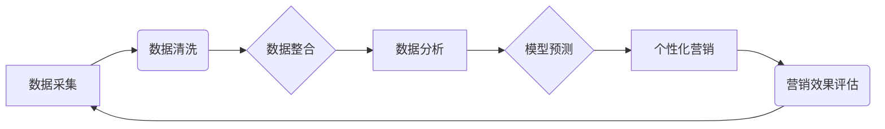

> AI DMP, 数据基建, 营销效率, 数据驱动, 个性化营销, 算法模型, 数据分析, 预测分析

## 1. 背景介绍

在当今数据爆炸的时代，企业拥有海量用户数据，但如何有效利用这些数据提升营销效率成为了一个关键问题。传统的营销方式往往依靠经验和直觉，难以精准触达目标用户，导致营销成本高、效果低。而人工智能（AI）技术的兴起为数据驱动营销提供了新的解决方案。

AI DMP（人工智能数据管理平台）作为一种新型的营销技术，通过整合用户数据、运用AI算法和机器学习模型，能够实现对用户行为的深度理解和精准预测，从而帮助企业实现个性化营销、提升营销效率。

## 2. 核心概念与联系

**2.1 AI DMP 的核心概念**

AI DMP 是基于人工智能技术的营销数据管理平台，其核心概念包括：

* **数据整合:** 收集来自各种渠道的用户数据，包括网站行为、社交媒体互动、购买记录等，构建统一的用户画像。
* **数据分析:** 利用机器学习算法对用户数据进行分析，挖掘用户行为模式、兴趣偏好和购买趋势等。
* **模型预测:** 基于分析结果，构建预测模型，预测用户未来的行为，例如购买意愿、点击率等。
* **个性化营销:** 根据用户画像和预测结果，为不同用户提供个性化的营销内容和服务，提高营销转化率。

**2.2 AI DMP 与传统 DMP 的区别**

传统 DMP 主要依靠规则引擎和人工干预，对用户数据的分析和预测能力有限。而 AI DMP 则通过人工智能算法，能够实现更精准、更智能的数据分析和预测，从而提供更有效的营销解决方案。

**2.3 AI DMP 的架构**



## 3. 核心算法原理 & 具体操作步骤

**3.1 算法原理概述**

AI DMP 中常用的算法包括：

* **机器学习算法:** 用于分析用户数据，挖掘用户行为模式和兴趣偏好。常见的机器学习算法包括决策树、支持向量机、神经网络等。
* **预测分析算法:** 用于预测用户未来的行为，例如购买意愿、点击率等。常见的预测分析算法包括线性回归、逻辑回归、随机森林等。
* **推荐算法:** 用于推荐用户感兴趣的内容或产品。常见的推荐算法包括协同过滤、内容过滤、混合推荐等。

**3.2 算法步骤详解**

1. **数据采集:** 从各种渠道收集用户数据，例如网站行为、社交媒体互动、购买记录等。
2. **数据清洗:** 对收集到的数据进行清洗和预处理，例如去除重复数据、缺失值处理等。
3. **数据整合:** 将清洗后的数据整合到统一的数据仓库中，构建用户画像。
4. **特征工程:** 从用户数据中提取特征，例如用户年龄、性别、兴趣爱好、购买历史等，这些特征将作为机器学习算法的输入。
5. **模型训练:** 利用机器学习算法对用户数据进行训练，构建预测模型。
6. **模型评估:** 对训练好的模型进行评估，例如准确率、召回率等，选择性能最好的模型。
7. **模型部署:** 将选定的模型部署到生产环境中，用于预测用户行为。
8. **个性化营销:** 根据模型预测结果，为不同用户提供个性化的营销内容和服务。

**3.3 算法优缺点**

* **优点:**

    * 能够实现对用户行为的深度理解和精准预测。
    * 能够提供个性化营销，提高营销转化率。
    * 能够自动化营销流程，降低营销成本。

* **缺点:**

    * 需要大量的用户数据进行训练。
    * 模型的准确性依赖于数据质量和算法选择。
    * 需要专业的技术人员进行开发和维护。

**3.4 算法应用领域**

AI DMP 的应用领域非常广泛，包括：

* **电商:** 个性化商品推荐、精准广告投放、用户画像分析等。
* **金融:** 风险评估、欺诈检测、客户关系管理等。
* **医疗:** 疾病诊断、个性化治疗方案推荐、患者行为分析等。
* **教育:** 个性化学习推荐、学生行为分析、教学效果评估等。

## 4. 数学模型和公式 & 详细讲解 & 举例说明

**4.1 数学模型构建**

在 AI DMP 中，常用的数学模型包括：

* **线性回归模型:** 用于预测连续型变量，例如用户购买金额。
* **逻辑回归模型:** 用于预测分类型变量，例如用户是否会购买商品。
* **决策树模型:** 用于分类和回归，能够处理非线性关系。
* **支持向量机模型:** 用于分类，能够处理高维数据。
* **神经网络模型:** 用于复杂数据分析和预测，能够学习非线性关系。

**4.2 公式推导过程**

这里以线性回归模型为例，介绍其公式推导过程：

假设我们想要预测用户购买金额，并已知用户年龄、性别等特征数据。线性回归模型假设购买金额与特征之间存在线性关系，可以用以下公式表示：

$$y = \beta_0 + \beta_1x_1 + \beta_2x_2 + ... + \beta_nx_n + \epsilon$$

其中：

* $y$ 是用户购买金额
* $x_1, x_2, ..., x_n$ 是用户特征数据
* $\beta_0, \beta_1, \beta_2, ..., \beta_n$ 是模型参数
* $\epsilon$ 是误差项

模型参数的估计可以通过最小二乘法来实现，其目标是找到参数值，使得模型预测值与实际值之间的误差最小。

**4.3 案例分析与讲解**

假设我们有一个电商平台，想要预测用户的购买金额。我们可以收集用户的年龄、性别、购买历史等特征数据，并使用线性回归模型进行预测。

通过训练模型，我们可以得到模型参数，例如：

* $\beta_0 = 100$
* $\beta_1 = 5$
* $\beta_2 = 10$

这意味着，用户的购买金额平均为 100 元，年龄每增加 1 岁，购买金额增加 5 元，性别为女性的用户购买金额增加 10 元。

## 5. 项目实践：代码实例和详细解释说明

**5.1 开发环境搭建**

* 操作系统: Ubuntu 20.04
* Python 版本: 3.8
* 必要的库: pandas, numpy, scikit-learn, matplotlib

**5.2 源代码详细实现**

```python
import pandas as pd
from sklearn.linear_model import LinearRegression
from sklearn.model_selection import train_test_split
from sklearn.metrics import mean_squared_error

# 加载数据
data = pd.read_csv('user_data.csv')

# 选择特征和目标变量
features = ['age', 'gender', 'purchase_history']
target = 'purchase_amount'

# 将数据分为训练集和测试集
X_train, X_test, y_train, y_test = train_test_split(data[features], data[target], test_size=0.2, random_state=42)

# 创建线性回归模型
model = LinearRegression()

# 训练模型
model.fit(X_train, y_train)

# 预测测试集数据
y_pred = model.predict(X_test)

# 计算模型性能
mse = mean_squared_error(y_test, y_pred)
print(f'Mean Squared Error: {mse}')

# 打印模型参数
print(f'Intercept: {model.intercept_}')
print(f'Coefficients: {model.coef_}')
```

**5.3 代码解读与分析**

* 首先，我们加载用户数据，并选择特征和目标变量。
* 然后，我们将数据分为训练集和测试集，用于训练和评估模型。
* 接下来，我们创建线性回归模型，并使用训练集数据进行训练。
* 训练完成后，我们使用测试集数据进行预测，并计算模型性能。
* 最后，我们打印模型参数，以便了解模型的学习结果。

**5.4 运行结果展示**

运行代码后，会输出模型的性能指标（例如 Mean Squared Error）和模型参数。

## 6. 实际应用场景

**6.1 个性化推荐**

AI DMP 可以根据用户的兴趣爱好、购买历史等数据，推荐个性化的商品或服务，提高用户体验和转化率。例如，电商平台可以根据用户的浏览记录和购买历史，推荐他们可能感兴趣的商品。

**6.2 精准广告投放**

AI DMP 可以根据用户的画像和行为数据，精准投放广告，提高广告效果和降低广告成本。例如，金融机构可以根据用户的收入、年龄、职业等数据，精准投放信用卡广告。

**6.3 营销自动化**

AI DMP 可以自动化营销流程，例如发送个性化邮件、推送消息通知等，提高营销效率。例如，电商平台可以根据用户的购买行为，自动发送优惠券或促销信息。

**6.4 客户关系管理**

AI DMP 可以帮助企业更好地了解客户，建立更深层次的客户关系。例如，企业可以根据客户的购买历史和反馈信息，提供个性化的服务和支持。

**6.5 未来应用展望**

随着人工智能技术的不断发展，AI DMP 将在更多领域得到应用，例如：

* **医疗保健:** 个性化医疗方案推荐、疾病预测、患者行为分析等。
* **教育:** 个性化学习推荐、学生行为分析、教学效果评估等。
* **智能家居:** 智能家居设备的个性化配置和控制、用户行为分析等。

## 7. 工具和资源推荐

**7.1 学习资源推荐**

* **书籍:**
    * 《深度学习》
    * 《机器学习实战》
    * 《Python数据科学手册》
* **在线课程:**
    * Coursera: 机器学习
    * edX: 深度学习
    * Udacity: 数据科学

**7.2 开发工具推荐**

* **Python:** 广泛应用于数据科学和机器学习领域。
* **pandas:** 用于数据分析和处理。
* **numpy:** 用于数值计算。
* **scikit-learn:** 用于机器学习算法的实现。
* **TensorFlow:** 用于深度学习模型的开发。

**7.3 相关论文推荐**

* 《Attention Is All You Need》
* 《BERT: Pre-training of Deep Bidirectional Transformers for Language Understanding》
* 《Generative Adversarial Networks》

## 8. 总结：未来发展趋势与挑战

**8.1 研究成果总结**

AI DMP 技术在近年来取得了显著进展，能够实现对用户行为的更精准的预测和分析，为企业提供更有效的营销解决方案。

**8.2 未来发展趋势**

* **模型更加智能化:** 未来 AI DMP 模型将更加智能化，能够学习更复杂的模式，提供更精准的预测。
* **数据更加丰富:** 未来 AI DMP 将整合更多数据源，例如社交媒体数据、传感器数据等，为用户画像提供更全面的信息。
* **应用场景更加广泛:** 未来 AI DMP 将应用于更多领域，例如医疗保健、教育、智能家居等。

**8.3 面临的挑战**

* **数据隐私保护:** AI DMP 需要处理大量用户数据，如何保护用户隐私是一个重要的挑战。
* **算法可解释性:** 许多 AI 算法是黑箱模型，难以解释其决策过程，这可能会导致用户对 AI DMP 的信任度降低。
* **技术人才短缺:** AI DMP 的开发和维护需要专业的技术人才，而目前技术人才短缺是一个普遍问题。

**8.4 研究展望**

未来，AI DMP 研究将继续朝着更加智能化、个性化、可解释的方向发展，并解决数据