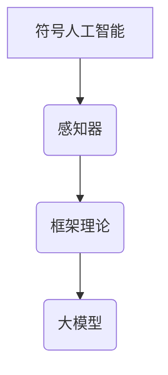

> AI, 大模型, 明斯基, 神经网络, 认知科学, 计算机科学, 人工智能

## 1. 背景介绍

Marvin Lee Minsky (1927-2016) 是 20 世纪最具影响力的计算机科学家之一，被誉为“人工智能之父”。他为人工智能的理论基础和实践发展做出了不可磨灭的贡献。本文将深入探讨明斯基在人工智能领域的研究成果，特别是他在大模型领域的开创性贡献。

明斯基出生于美国纽约，从小就展现出惊人的智力和学习能力。他于麻省理工学院获得学士学位，并在麻省理工学院和哈佛大学攻读博士学位。他的研究领域涵盖了认知科学、神经网络、人工智能、计算机科学等多个领域。

明斯基是人工智能领域的先驱者之一，他与 John McCarthy、Claude Shannon 等科学家共同创立了人工智能领域。他提出了许多重要的理论和概念，例如：

* **符号人工智能:** 明斯基认为，人工智能的关键在于使用符号和规则来模拟人类的思维过程。
* **感知器:** 明斯基与 Seymour Papert 共同发明了感知器，这是一种早期的人工神经网络模型。
* **框架理论:** 明斯基提出了框架理论，认为人类的知识和理解是通过框架结构组织的。

## 2. 核心概念与联系

明斯基的思想和研究成果对现代人工智能的发展产生了深远的影响。他的工作为大模型的出现奠定了理论基础。

**核心概念与联系：**



**符号人工智能:** 明斯基认为，人工智能的关键在于使用符号和规则来模拟人类的思维过程。

**感知器:** 明斯基与 Seymour Papert 共同发明了感知器，这是一种早期的人工神经网络模型。感知器通过学习输入数据来调整自身的权重，从而实现对输入数据的分类和识别。

**框架理论:** 明斯基提出了框架理论，认为人类的知识和理解是通过框架结构组织的。框架是一种知识结构，它包含了关于某个主题的背景信息、概念和关系。

**大模型:** 大模型是指参数量巨大的人工智能模型，它能够处理海量数据并学习复杂的模式。大模型的出现得益于计算能力的提升和数据量的爆炸式增长。

## 3. 核心算法原理 & 具体操作步骤

### 3.1  算法原理概述

明斯基在人工智能领域的研究成果中，感知器算法是最具代表性的一个。感知器算法是一种基于神经网络的监督学习算法，它通过学习输入数据来调整自身的权重，从而实现对输入数据的分类和识别。

### 3.2  算法步骤详解

1. **初始化权重:** 将感知器的权重随机初始化。
2. **输入数据:** 将输入数据输入到感知器中。
3. **加权求和:** 将输入数据与权重相乘，并将结果相加。
4. **激活函数:** 将加权求和的结果输入到激活函数中，得到输出值。
5. **误差计算:** 将输出值与实际值进行比较，计算误差。
6. **权重更新:** 根据误差值，更新感知器的权重。
7. **重复步骤2-6:** 重复以上步骤，直到误差达到预设阈值。

### 3.3  算法优缺点

**优点:**

* 算法简单易懂，易于实现。
* 能够处理线性可分的数据集。

**缺点:**

* 只能处理线性可分的数据集。
* 容易陷入局部最优解。

### 3.4  算法应用领域

感知器算法在图像识别、语音识别、文本分类等领域都有广泛的应用。

## 4. 数学模型和公式 & 详细讲解 & 举例说明

### 4.1  数学模型构建

感知器的数学模型可以表示为以下公式：

$$
y = f(w_1x_1 + w_2x_2 + ... + w_nx_n + b)
$$

其中：

* $y$ 是感知器的输出值。
* $x_1, x_2, ..., x_n$ 是输入数据。
* $w_1, w_2, ..., w_n$ 是权重。
* $b$ 是偏置。
* $f$ 是激活函数。

### 4.2  公式推导过程

感知器的权重更新公式可以表示为：

$$
w_i = w_i + \alpha \delta x_i
$$

其中：

* $\alpha$ 是学习率。
* $\delta$ 是误差信号。

### 4.3  案例分析与讲解

假设我们有一个感知器，用于识别手写数字 0 和 1。输入数据是数字的像素值，输出值是 0 或 1。

通过训练数据，感知器可以学习到将像素值与数字 0 和 1 对应的权重和偏置。

当输入一个新的数字时，感知器会根据学习到的权重和偏置计算输出值。如果输出值大于某个阈值，则识别为数字 1；否则，识别为数字 0。

## 5. 项目实践：代码实例和详细解释说明

### 5.1  开发环境搭建

* Python 3.x
* TensorFlow 或 PyTorch

### 5.2  源代码详细实现

```python
import tensorflow as tf

# 定义感知器模型
model = tf.keras.models.Sequential([
    tf.keras.layers.Dense(units=1, activation='sigmoid', input_shape=(784,))
])

# 编译模型
model.compile(optimizer='adam', loss='binary_crossentropy', metrics=['accuracy'])

# 加载 MNIST 数据集
(x_train, y_train), (x_test, y_test) = tf.keras.datasets.mnist.load_data()

# 数据预处理
x_train = x_train.reshape(-1, 784).astype('float32') / 255
x_test = x_test.reshape(-1, 784).astype('float32') / 255

# 训练模型
model.fit(x_train, y_train, epochs=10, batch_size=32)

# 评估模型
loss, accuracy = model.evaluate(x_test, y_test)
print('Test loss:', loss)
print('Test accuracy:', accuracy)
```

### 5.3  代码解读与分析

* 代码首先定义了一个感知器模型，包含一个全连接层。
* 模型使用 Adam 优化器、二元交叉熵损失函数和准确率作为评估指标。
* MNIST 数据集用于训练和评估模型。
* 数据预处理包括将图像数据reshape成向量形式并归一化。
* 模型训练完成后，使用测试数据评估模型的性能。

### 5.4  运行结果展示

运行代码后，可以得到模型在测试集上的损失值和准确率。

## 6. 实际应用场景

### 6.1  图像识别

感知器算法可以用于识别手写数字、字母、物体等。

### 6.2  语音识别

感知器算法可以用于识别语音命令、语音转文本等。

### 6.3  文本分类

感知器算法可以用于分类文本邮件、新闻文章等。

### 6.4  未来应用展望

随着人工智能技术的不断发展，感知器算法将在更多领域得到应用，例如：

* 自动驾驶
* 医疗诊断
* 金融风险评估

## 7. 工具和资源推荐

### 7.1  学习资源推荐

* **书籍:**
    * 《人工智能：现代方法》
    * 《深度学习》
* **在线课程:**
    * Coursera 上的《机器学习》课程
    * edX 上的《人工智能导论》课程

### 7.2  开发工具推荐

* **TensorFlow:** 开源深度学习框架
* **PyTorch:** 开源深度学习框架

### 7.3  相关论文推荐

* **Perceptrons: An Introduction to Computational Geometry** by Frank Rosenblatt (1958)
* **A Mathematical Theory of Communication** by Claude Shannon (1948)

## 8. 总结：未来发展趋势与挑战

### 8.1  研究成果总结

明斯基在人工智能领域的研究成果对现代人工智能的发展产生了深远的影响。他的工作为大模型的出现奠定了理论基础。

### 8.2  未来发展趋势

未来，人工智能将朝着更加智能、更加通用、更加安全的方向发展。大模型将继续发展壮大，并应用于更多领域。

### 8.3  面临的挑战

人工智能的发展也面临着一些挑战，例如：

* 数据安全和隐私保护
* 算法的解释性和可信度
* 人工智能的伦理问题

### 8.4  研究展望

未来，我们需要继续探索人工智能的本质，并解决人工智能发展过程中面临的挑战。


## 9. 附录：常见问题与解答

**Q1: 明斯基的感知器算法有什么局限性？**

**A1:** 明斯基的感知器算法只能处理线性可分的数据集，并且容易陷入局部最优解。

**Q2: 大模型是如何实现的？**

**A2:** 大模型的实现需要大量的计算资源和数据。通过训练大量的参数，大模型能够学习复杂的模式。

**Q3: 人工智能的未来发展趋势是什么？**

**A3:** 人工智能将朝着更加智能、更加通用、更加安全的方向发展。


作者：禅与计算机程序设计艺术 / Zen and the Art of Computer Programming 


<end_of_turn>