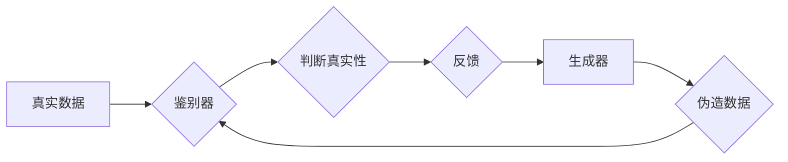

> 生成对抗网络（GAN）、Ian Goodfellow、深度学习、生成模型、对抗训练、图像生成、数据合成

## 1. 背景介绍

在人工智能领域，生成模型一直是研究的热点之一。传统的生成模型，例如隐马尔可夫模型（HMM）和变分自编码器（VAE），在生成数据方面存在一定的局限性，例如生成的样本缺乏多样性和真实性。随着深度学习的兴起，生成对抗网络（GAN）应运而生，它利用对抗性训练机制，使得生成模型能够生成更加逼真的样本。

Ian Goodfellow，一位计算机科学家，在2014年发表了题为《Generative Adversarial Networks》的论文，首次提出了GAN的概念。这篇论文彻底改变了生成模型的研究方向，并引发了人工智能领域的一场革命。

## 2. 核心概念与联系

GAN由两个神经网络组成：生成器（Generator）和鉴别器（Discriminator）。

* **生成器（Generator）:** 负责生成新的样本数据，例如图像、文本、音频等。
* **鉴别器（Discriminator）:** 负责判断样本数据是真实数据还是由生成器生成的伪造数据。

GAN的训练过程是一个对抗性的过程，生成器和鉴别器相互竞争，不断提升自己的能力。生成器试图生成更加逼真的样本，以欺骗鉴别器；而鉴别器则试图准确地识别真实和伪造样本。

**GAN 工作流程图:**



## 3. 核心算法原理 & 具体操作步骤

### 3.1  算法原理概述

GAN的训练目标是让生成器能够生成与真实数据分布相似的样本。为了实现这个目标，GAN采用了一种对抗性训练机制。

* **生成器训练目标:** 尽可能生成逼真的样本，以欺骗鉴别器。
* **鉴别器训练目标:** 准确地识别真实数据和伪造数据。

GAN的训练过程是一个迭代的过程，在每次迭代中，生成器会生成新的样本，鉴别器会对这些样本进行判断，并反馈结果给生成器。根据反馈结果，生成器会调整自己的参数，以生成更加逼真的样本。

### 3.2  算法步骤详解

1. **初始化:** 生成器和鉴别器网络参数随机初始化。
2. **生成样本:** 生成器根据输入的噪声数据生成新的样本。
3. **鉴别样本:** 鉴别器对真实数据和生成器生成的样本进行判断，并输出判断结果。
4. **计算损失:** 计算生成器和鉴别器的损失函数值。
5. **更新参数:** 根据损失函数值，使用梯度下降算法更新生成器和鉴别器的参数。
6. **重复步骤2-5:** 重复上述步骤，直到生成器能够生成逼真的样本，或者达到预设的训练目标。

### 3.3  算法优缺点

**优点:**

* **生成逼真的样本:** GAN能够生成与真实数据分布相似的样本，在图像、文本、音频等领域具有广泛的应用。
* **无监督学习:** GAN可以进行无监督学习，不需要大量的标注数据。

**缺点:**

* **训练困难:** GAN的训练过程比较复杂，容易出现模式崩溃等问题。
* **评价指标不完善:** 目前还没有一个完善的评价指标来衡量GAN生成的样本质量。

### 3.4  算法应用领域

GAN在图像生成、文本生成、音频生成、视频生成、数据合成等领域都有广泛的应用。

* **图像生成:** 生成逼真的图像，例如人脸、风景、物体等。
* **文本生成:** 生成逼真的文本，例如文章、故事、对话等。
* **音频生成:** 生成逼真的音频，例如音乐、语音、音效等。
* **视频生成:** 生成逼真的视频，例如电影片段、动画等。
* **数据合成:** 生成合成数据，用于训练其他机器学习模型。

## 4. 数学模型和公式 & 详细讲解 & 举例说明

### 4.1  数学模型构建

GAN的数学模型主要包括生成器G和鉴别器D的损失函数。

* **生成器损失函数:**

$$
L_G(G, D) = E_{z \sim p_z(z)}[ -log(D(G(z))) ]
$$

其中，$z$是输入的噪声数据，$p_z(z)$是噪声数据的分布，$D(G(z))$是鉴别器对生成器生成的样本的判断结果。

* **鉴别器损失函数:**

$$
L_D(D, G) = E_{x \sim p_{data}(x)}[ -log(D(x)) ] + E_{z \sim p_z(z)}[ -log(1 - D(G(z))) ]
$$

其中，$x$是真实数据，$p_{data}(x)$是真实数据的分布。

### 4.2  公式推导过程

生成器损失函数的目标是最大化鉴别器对生成样本的判断结果，即让鉴别器认为生成样本是真实样本。

鉴别器损失函数的目标是准确地识别真实数据和生成样本，即让鉴别器对真实数据判断为真实，对生成样本判断为伪造。

### 4.3  案例分析与讲解

假设我们使用GAN生成人脸图像。

* **生成器:** 接收噪声数据作为输入，生成人脸图像。
* **鉴别器:** 接收人脸图像作为输入，判断图像是否为真实人脸。

训练过程中，生成器会不断生成新的人脸图像，鉴别器会对这些图像进行判断。如果鉴别器判断为真实，则生成器损失函数会降低；如果鉴别器判断为伪造，则生成器损失函数会增加。

通过不断迭代，生成器会逐渐生成更加逼真的人脸图像，直到鉴别器无法区分真实人脸和生成人脸。

## 5. 项目实践：代码实例和详细解释说明

### 5.1  开发环境搭建

* **操作系统:** Ubuntu 18.04
* **编程语言:** Python 3.6
* **深度学习框架:** TensorFlow 2.0

### 5.2  源代码详细实现

```python
import tensorflow as tf

# 定义生成器网络
def generator(z):
    # ...

# 定义鉴别器网络
def discriminator(x):
    # ...

# 定义损失函数
def loss_function(real_output, fake_output):
    # ...

# 定义优化器
optimizer = tf.keras.optimizers.Adam(learning_rate=0.0002)

# 训练循环
for epoch in range(num_epochs):
    for batch in dataset:
        # ...
```

### 5.3  代码解读与分析

* **生成器网络:** 接收噪声数据作为输入，通过多层神经网络生成人脸图像。
* **鉴别器网络:** 接收人脸图像作为输入，判断图像是否为真实人脸。
* **损失函数:** 计算生成器和鉴别器的损失值。
* **优化器:** 使用梯度下降算法更新生成器和鉴别器的参数。

### 5.4  运行结果展示

训练完成后，可以利用生成器生成新的人脸图像，并与真实人脸图像进行比较。

## 6. 实际应用场景

### 6.1  图像生成

GAN可以用于生成逼真的图像，例如人脸、风景、物体等。

* **人脸生成:** 生成逼真的人脸图像，用于身份验证、虚拟助手等应用。
* **风景生成:** 生成逼真的风景图像，用于游戏、电影等视觉效果制作。
* **物体生成:** 生成逼真的物体图像，用于3D建模、产品设计等应用。

### 6.2  文本生成

GAN可以用于生成逼真的文本，例如文章、故事、对话等。

* **文章生成:** 生成新闻、博客文章等类型的文本。
* **故事生成:** 生成小说、诗歌等类型的文本。
* **对话生成:** 生成自然流畅的对话文本，用于聊天机器人、虚拟助手等应用。

### 6.3  音频生成

GAN可以用于生成逼真的音频，例如音乐、语音、音效等。

* **音乐生成:** 生成不同风格的音乐。
* **语音生成:** 生成逼真的语音，用于语音合成、语音助手等应用。
* **音效生成:** 生成逼真的音效，用于游戏、电影等视觉效果制作。

### 6.4  未来应用展望

GAN在未来将有更广泛的应用，例如：

* **数据合成:** 生成合成数据，用于训练其他机器学习模型。
* **医疗保健:** 生成医学图像，用于疾病诊断、治疗方案设计等。
* **金融:** 生成金融数据，用于风险评估、欺诈检测等。

## 7. 工具和资源推荐

### 7.1  学习资源推荐

* **论文:** 《Generative Adversarial Networks》
* **博客:** https://blog.openai.com/
* **课程:** https://www.coursera.org/

### 7.2  开发工具推荐

* **TensorFlow:** https://www.tensorflow.org/
* **PyTorch:** https://pytorch.org/
* **Keras:** https://keras.io/

### 7.3  相关论文推荐

* 《Improved Techniques for Training GANs》
* 《Progressive Growing of GANs for Improved Quality, Stability, and Variation》
* 《StyleGAN2-ADA: Adapting StyleGAN2 for High-Resolution Image Synthesis》

## 8. 总结：未来发展趋势与挑战

### 8.1  研究成果总结

GAN的提出彻底改变了生成模型的研究方向，并取得了显著的成果。GAN能够生成逼真的样本，在图像、文本、音频等领域都有广泛的应用。

### 8.2  未来发展趋势

* **提高生成质量:** 研究更有效的训练方法，生成更高质量的样本。
* **增强控制能力:** 研究如何更好地控制生成样本的属性，例如风格、内容等。
* **拓展应用领域:** 将GAN应用到更多领域，例如医疗保健、金融等。

### 8.3  面临的挑战

* **训练困难:** GAN的训练过程比较复杂，容易出现模式崩溃等问题。
* **评价指标不完善:** 目前还没有一个完善的评价指标来衡量GAN生成的样本质量。
* **伦理问题:** GAN可以生成逼真的伪造数据，可能被用于恶意目的，例如造假、传播谣言等。

### 8.4  研究展望

未来，GAN的研究将继续深入，解决目前面临的挑战，并拓展更多应用领域。

## 9. 附录：常见问题与解答

* **什么是模式崩溃？**

模式崩溃是指GAN训练过程中，生成器生成的样本质量下降，陷入一种固定的模式。

* **如何解决模式崩溃？**

一些方法可以用来解决模式崩溃，例如：

* 使用更复杂的网络架构。
* 使用更好的训练策略，例如WGAN-GP。
* 使用数据增强技术。

* **如何评价GAN生成的样本质量？**

目前还没有一个完善的评价指标来衡量GAN生成的样本质量。一些常用的评价指标包括：

* **Inception Score (IS):** 衡量生成样本的质量和多样性。
* **Fréchet Inception Distance (FID):** 衡量生成样本与真实样本之间的距离。
* **Perceptual Loss:** 衡量生成样本与真实样本在视觉上的相似度。

作者：禅与计算机程序设计艺术 / Zen and the Art of Computer Programming


<end_of_turn>