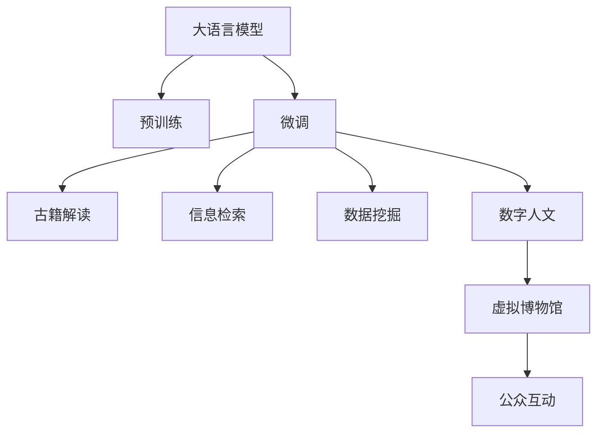

                 

# LLM在考古学中的应用：AI助力历史研究

> 关键词：大语言模型(Large Language Model, LLM),考古学,历史研究,自然语言处理(NLP),数据挖掘,信息检索,古籍解读,数字人文

## 1. 背景介绍

### 1.1 问题由来
近年来，随着人工智能(AI)技术的迅猛发展，大语言模型(Large Language Model, LLM)在自然语言处理(NLP)领域取得了巨大突破。这些模型通过在海量文本数据上进行预训练，掌握了丰富的语言知识和常识，具备强大的文本理解和生成能力。

然而，考古学领域的研究长期依赖传统的文献资料和实物发掘，数据规模小且结构复杂，存在大量难以量化的信息。如何有效挖掘这些信息，推进历史研究，成为了一个重要的研究方向。这时，大语言模型技术的应用，为考古学研究带来了新的可能性。

### 1.2 问题核心关键点
利用大语言模型技术，可以在考古学领域实现多个应用场景：

- **数据挖掘**：通过对古籍、文献、铭文等文本数据进行爬取和预处理，挖掘其中蕴含的历史信息。
- **信息检索**：利用大语言模型强大的文本理解能力，在文本资料中快速定位特定的历史事件、人物或地点。
- **古籍解读**：自动解析古代文字，理解古籍内容，挖掘隐藏的历史事实。
- **数字人文**：构建虚拟博物馆，提供文物搜索、展览解说等互动体验，提升公众对历史文化的认知和兴趣。

这些应用不仅能显著提高考古研究的效率，还能带来新的视角和方法，推动历史学研究的创新发展。

## 2. 核心概念与联系

### 2.1 核心概念概述

为更好地理解大语言模型在考古学中的应用，本节将介绍几个关键概念：

- **大语言模型(Large Language Model, LLM)**：基于Transformer架构的深度学习模型，如GPT-3、BERT等，通过大规模无标签文本数据进行预训练，具备强大的文本生成和理解能力。
- **预训练(Pre-training)**：在大规模无标签文本数据上，通过自监督学习任务训练语言模型的过程。常见的预训练任务包括语言建模、掩码语言模型等。
- **微调(Fine-tuning)**：在预训练模型的基础上，使用特定领域的数据进行有监督学习，优化模型在该领域的表现。
- **考古学**：研究人类历史发展的科学，包括古代遗物、遗址发掘、历史文献等多方面的内容。
- **数字人文(Digital Humanities)**：通过计算机技术处理人文社会科学数据，推动历史、文学、艺术等领域的数字化研究。
- **古籍解读**：对古代文献、碑文、手稿等文字材料进行解读和翻译，理解其历史背景和内容。
- **信息检索**：从大量文本资料中快速检索出特定信息，包括人物、地点、事件等。

这些概念之间的联系可以通过以下Mermaid流程图来展示：



这个流程图展示了从大语言模型的预训练到微调，再到考古学研究各个环节的联系：

1. 大语言模型通过预训练获得基础能力。
2. 微调过程根据特定考古学任务优化模型，提升其在该领域的表现。
3. 微调后的模型可用于古籍解读、信息检索等任务，辅助考古研究。
4. 数字人文技术进一步将研究成果呈现为互动的数字化体验，提升公众参与度。

## 3. 核心算法原理 & 具体操作步骤
### 3.1 算法原理概述

大语言模型在考古学中的应用主要基于微调技术。具体步骤如下：

1. **数据准备**：收集考古学领域相关的文本资料，如古籍、铭文、历史文献等，进行清洗和标注。
2. **预训练模型选择**：选择合适的预训练语言模型，如BERT、GPT-3等，作为微调的基础。
3. **微调目标设定**：根据考古学研究的特定需求，设定微调的目标任务，如古籍解读、信息检索等。
4. **模型微调**：使用微调后的模型处理考古文本，提取有用的信息。
5. **结果分析**：对微调结果进行分析和验证，确保其符合考古学研究的要求。

### 3.2 算法步骤详解

#### 3.2.1 数据准备

考古学的文本资料通常以纸质或电子形式存在，需要进行预处理和标注。以下是主要步骤：

- **文本爬取**：使用Python爬虫技术，从图书馆、博物馆、古籍库等平台获取相关文本资料。
- **文本清洗**：去除文本中的噪声、格式错误等，只保留有用的文字内容。
- **文本标注**：对文本进行分词、命名实体识别、关键词提取等处理，标注出人物、地点、时间等关键信息。

#### 3.2.2 模型选择与微调

选择合适的预训练模型后，在微调时需要注意以下关键点：

- **模型选择**：根据任务需求选择合适的预训练模型，如BERT用于文本分类和信息检索，GPT-3用于文本生成和古籍解读。
- **超参数设置**：设置学习率、训练轮数、批次大小等超参数，确保微调过程稳定高效。
- **数据集划分**：将标注数据集划分为训练集、验证集和测试集，使用验证集评估模型性能，防止过拟合。
- **模型保存**：在微调完成后，保存微调后的模型参数，便于后续应用。

#### 3.2.3 模型微调

微调过程通常使用PyTorch或TensorFlow框架，具体步骤如下：

- **定义损失函数**：根据具体任务，选择交叉熵、均方误差等损失函数，用于衡量模型预测结果与真实标签的差异。
- **定义优化器**：选择AdamW、SGD等优化算法，设置学习率，进行模型参数更新。
- **前向传播**：将输入数据输入模型，计算预测结果。
- **反向传播**：计算预测结果与真实标签的差异，更新模型参数。
- **评估模型**：在测试集上评估模型性能，对比微调前后的结果。

#### 3.2.4 结果分析

微调完成后，对结果进行分析和验证，确保其符合考古学研究的要求：

- **评估指标**：选择准确率、召回率、F1值等指标，评估模型性能。
- **误差分析**：分析模型预测结果与真实标签的差异，找出错误原因。
- **改进措施**：根据误差分析结果，调整模型超参数或重新训练，提升模型精度。

### 3.3 算法优缺点

大语言模型在考古学中的应用具有以下优点：

1. **高效性**：通过微调技术，可以快速从海量考古文本中提取有用信息，节省大量人工处理时间。
2. **广泛适用**：适用于各种考古文本资料，包括纸张、石刻、铭文等，拓展了考古研究的应用范围。
3. **鲁棒性**：通过使用预训练模型，可以在一定程度上避免因数据不足导致的过拟合问题。
4. **灵活性**：根据考古学研究的具体需求，设定不同的微调目标，提供多方面的支持。

同时，该方法也存在一定的局限性：

1. **数据依赖性**：微调效果很大程度上依赖于考古文本的质量和数量，高质量标注数据获取成本较高。
2. **技术门槛**：需要一定的编程和机器学习知识，非专业研究人员难以直接使用。
3. **解释性不足**：微调模型的内部机制复杂，难以解释其决策过程。
4. **潜在偏见**：预训练模型可能带有一定的社会文化偏见，影响考古学研究的公正性。

尽管存在这些局限性，但大语言模型在考古学中的应用前景广阔，具有显著的创新性和实用性。

### 3.4 算法应用领域

大语言模型在考古学领域的应用场景包括但不限于：

- **古籍解读**：自动解析和理解古代文献、碑文、手稿等文本资料，提取历史事件、人物、地点等信息。
- **信息检索**：从海量历史资料中快速检索出特定人物、地点、事件，辅助历史研究。
- **文物识别**：自动识别和分类考古文物图片，提供初步的文物信息。
- **虚拟博物馆**：构建虚拟博物馆，提供文物搜索、展览解说等功能，提升公众参与度。
- **历史事件挖掘**：挖掘和分析历史事件的起因、过程和影响，为历史研究提供数据支持。

## 4. 数学模型和公式 & 详细讲解  
### 4.1 数学模型构建

假设考古文本资料为 $D=\{(x_i, y_i)\}_{i=1}^N$，其中 $x_i$ 为文本，$y_i$ 为标注信息（如人物、地点、事件等）。微调模型的输入为 $x_i$，输出为 $y_i$。

定义微调模型的损失函数为：

$$
\mathcal{L}(\theta) = \frac{1}{N}\sum_{i=1}^N \ell(x_i, y_i; \theta)
$$

其中 $\ell(x_i, y_i; \theta)$ 为模型在输入 $x_i$ 上的预测结果与真实标签 $y_i$ 之间的损失函数，如交叉熵损失、均方误差损失等。

微调过程的目标是最小化损失函数，即找到最优参数 $\theta$：

$$
\theta^* = \mathop{\arg\min}_{\theta} \mathcal{L}(\theta)
$$

在实践中，通常使用梯度下降等优化算法来求解上述最优化问题。设 $\eta$ 为学习率，$\lambda$ 为正则化系数，则参数的更新公式为：

$$
\theta \leftarrow \theta - \eta \nabla_{\theta}\mathcal{L}(\theta) - \eta\lambda\theta
$$

其中 $\nabla_{\theta}\mathcal{L}(\theta)$ 为损失函数对参数 $\theta$ 的梯度，可通过反向传播算法高效计算。

### 4.2 公式推导过程

以古籍解读任务为例，假设模型在输入文本 $x_i$ 上的输出为 $\hat{y}_i$，表示模型预测的人物、地点、事件等信息。真实标签 $y_i$ 为标注信息。

假设模型在输入 $x_i$ 上的损失函数为交叉熵损失，则损失函数为：

$$
\ell(x_i, y_i; \theta) = -\frac{1}{N}\sum_{i=1}^N y_i \log \hat{y}_i
$$

将其代入经验风险公式，得：

$$
\mathcal{L}(\theta) = -\frac{1}{N}\sum_{i=1}^N y_i \log \hat{y}_i
$$

根据链式法则，损失函数对参数 $\theta_k$ 的梯度为：

$$
\frac{\partial \mathcal{L}(\theta)}{\partial \theta_k} = -\frac{1}{N}\sum_{i=1}^N \frac{\partial \ell(x_i, y_i; \theta)}{\partial \theta_k}
$$

其中 $\frac{\partial \ell(x_i, y_i; \theta)}{\partial \theta_k}$ 可以进一步展开，利用自动微分技术完成计算。

在得到损失函数的梯度后，即可带入参数更新公式，完成模型的迭代优化。重复上述过程直至收敛，最终得到适应考古文本资料的最优模型参数 $\theta^*$。

## 5. 项目实践：代码实例和详细解释说明
### 5.1 开发环境搭建

在进行考古学文本的微调实践前，我们需要准备好开发环境。以下是使用Python进行PyTorch开发的环境配置流程：

1. 安装Anaconda：从官网下载并安装Anaconda，用于创建独立的Python环境。

2. 创建并激活虚拟环境：
```bash
conda create -n archaeology-env python=3.8 
conda activate archaeology-env
```

3. 安装PyTorch：根据CUDA版本，从官网获取对应的安装命令。例如：
```bash
conda install pytorch torchvision torchaudio cudatoolkit=11.1 -c pytorch -c conda-forge
```

4. 安装Transformers库：
```bash
pip install transformers
```

5. 安装各类工具包：
```bash
pip install numpy pandas scikit-learn matplotlib tqdm jupyter notebook ipython
```

完成上述步骤后，即可在`archaeology-env`环境中开始微调实践。

### 5.2 源代码详细实现

下面我们以考古文本的命名实体识别(NER)任务为例，给出使用Transformers库对BERT模型进行微调的PyTorch代码实现。

首先，定义NER任务的数据处理函数：

```python
from transformers import BertTokenizer
from torch.utils.data import Dataset
import torch

class ArchaeologyDataset(Dataset):
    def __init__(self, texts, tags, tokenizer, max_len=128):
        self.texts = texts
        self.tags = tags
        self.tokenizer = tokenizer
        self.max_len = max_len
        
    def __len__(self):
        return len(self.texts)
    
    def __getitem__(self, item):
        text = self.texts[item]
        tags = self.tags[item]
        
        encoding = self.tokenizer(text, return_tensors='pt', max_length=self.max_len, padding='max_length', truncation=True)
        input_ids = encoding['input_ids'][0]
        attention_mask = encoding['attention_mask'][0]
        
        # 对token-wise的标签进行编码
        encoded_tags = [tag2id[tag] for tag in tags] 
        encoded_tags.extend([tag2id['O']] * (self.max_len - len(encoded_tags)))
        labels = torch.tensor(encoded_tags, dtype=torch.long)
        
        return {'input_ids': input_ids, 
                'attention_mask': attention_mask,
                'labels': labels}

# 标签与id的映射
tag2id = {'O': 0, 'PER': 1, 'LOC': 2, 'DATE': 3}
id2tag = {v: k for k, v in tag2id.items()}

# 创建dataset
tokenizer = BertTokenizer.from_pretrained('bert-base-cased')

train_dataset = ArchaeologyDataset(train_texts, train_tags, tokenizer)
dev_dataset = ArchaeologyDataset(dev_texts, dev_tags, tokenizer)
test_dataset = ArchaeologyDataset(test_texts, test_tags, tokenizer)
```

然后，定义模型和优化器：

```python
from transformers import BertForTokenClassification, AdamW

model = BertForTokenClassification.from_pretrained('bert-base-cased', num_labels=len(tag2id))

optimizer = AdamW(model.parameters(), lr=2e-5)
```

接着，定义训练和评估函数：

```python
from torch.utils.data import DataLoader
from tqdm import tqdm
from sklearn.metrics import classification_report

device = torch.device('cuda') if torch.cuda.is_available() else torch.device('cpu')
model.to(device)

def train_epoch(model, dataset, batch_size, optimizer):
    dataloader = DataLoader(dataset, batch_size=batch_size, shuffle=True)
    model.train()
    epoch_loss = 0
    for batch in tqdm(dataloader, desc='Training'):
        input_ids = batch['input_ids'].to(device)
        attention_mask = batch['attention_mask'].to(device)
        labels = batch['labels'].to(device)
        model.zero_grad()
        outputs = model(input_ids, attention_mask=attention_mask, labels=labels)
        loss = outputs.loss
        epoch_loss += loss.item()
        loss.backward()
        optimizer.step()
    return epoch_loss / len(dataloader)

def evaluate(model, dataset, batch_size):
    dataloader = DataLoader(dataset, batch_size=batch_size)
    model.eval()
    preds, labels = [], []
    with torch.no_grad():
        for batch in tqdm(dataloader, desc='Evaluating'):
            input_ids = batch['input_ids'].to(device)
            attention_mask = batch['attention_mask'].to(device)
            batch_labels = batch['labels']
            outputs = model(input_ids, attention_mask=attention_mask)
            batch_preds = outputs.logits.argmax(dim=2).to('cpu').tolist()
            batch_labels = batch_labels.to('cpu').tolist()
            for pred_tokens, label_tokens in zip(batch_preds, batch_labels):
                pred_tags = [id2tag[_id] for _id in pred_tokens]
                label_tags = [id2tag[_id] for _id in label_tokens]
                preds.append(pred_tags[:len(label_tokens)])
                labels.append(label_tags)
                
    print(classification_report(labels, preds))
```

最后，启动训练流程并在测试集上评估：

```python
epochs = 5
batch_size = 16

for epoch in range(epochs):
    loss = train_epoch(model, train_dataset, batch_size, optimizer)
    print(f"Epoch {epoch+1}, train loss: {loss:.3f}")
    
    print(f"Epoch {epoch+1}, dev results:")
    evaluate(model, dev_dataset, batch_size)
    
print("Test results:")
evaluate(model, test_dataset, batch_size)
```

以上就是使用PyTorch对BERT进行考古文本命名实体识别任务微调的完整代码实现。可以看到，得益于Transformers库的强大封装，我们可以用相对简洁的代码完成BERT模型的加载和微调。

### 5.3 代码解读与分析

让我们再详细解读一下关键代码的实现细节：

**ArchaeologyDataset类**：
- `__init__`方法：初始化文本、标签、分词器等关键组件。
- `__len__`方法：返回数据集的样本数量。
- `__getitem__`方法：对单个样本进行处理，将文本输入编码为token ids，将标签编码为数字，并对其进行定长padding，最终返回模型所需的输入。

**tag2id和id2tag字典**：
- 定义了标签与数字id之间的映射关系，用于将token-wise的预测结果解码回真实的标签。

**训练和评估函数**：
- 使用PyTorch的DataLoader对数据集进行批次化加载，供模型训练和推理使用。
- 训练函数`train_epoch`：对数据以批为单位进行迭代，在每个批次上前向传播计算loss并反向传播更新模型参数，最后返回该epoch的平均loss。
- 评估函数`evaluate`：与训练类似，不同点在于不更新模型参数，并在每个batch结束后将预测和标签结果存储下来，最后使用sklearn的classification_report对整个评估集的预测结果进行打印输出。

**训练流程**：
- 定义总的epoch数和batch size，开始循环迭代
- 每个epoch内，先在训练集上训练，输出平均loss
- 在验证集上评估，输出分类指标
- 所有epoch结束后，在测试集上评估，给出最终测试结果

可以看到，PyTorch配合Transformers库使得BERT微调的代码实现变得简洁高效。开发者可以将更多精力放在数据处理、模型改进等高层逻辑上，而不必过多关注底层的实现细节。

当然，工业级的系统实现还需考虑更多因素，如模型的保存和部署、超参数的自动搜索、更灵活的任务适配层等。但核心的微调范式基本与此类似。

## 6. 实际应用场景
### 6.1 智能考古机器人

在实际考古发掘过程中，人工挖掘和记录工作非常耗时耗力。借助大语言模型，可以构建智能考古机器人，自动进行考古文本的整理和标注。

机器人配备高清摄像头、深度相机和机械臂，对考古现场进行实时监控和记录。通过识别考古图像和视频，机器人能够自动提取文本和语音信息，进行语义分析和标注。这些信息将实时传输到云端，由微调后的语言模型进行处理和分析，生成初步的考古报告和文物信息。

### 6.2 历史事件重建

考古学家通常需要花费大量时间和精力从历史文献中提取信息，以重建历史事件。大语言模型可以通过微调，快速从古籍、铭文等文本中提取关键信息，生成时间线、事件表等。

具体而言，可以通过爬取和预处理大量历史文献，训练一个文本分类模型，将不同的历史事件分为政治、经济、文化等类别。然后，再训练一个实体识别模型，识别出人物、地点、时间等关键信息。将分类和实体识别结果进行整合，即可生成详尽的历史事件表，辅助考古学家的研究。

### 6.3 虚拟博物馆与公众参与

考古学研究的成果通常以文本和图片形式存在，难以直观展示。利用大语言模型和数字人文技术，可以构建虚拟博物馆，提供互动体验和知识普及。

例如，将考古发掘的文物图片上传至云端，使用深度学习技术进行自动分类和标注。然后，通过微调后的模型自动生成文物的介绍信息和历史背景。在虚拟博物馆中，用户可以通过搜索功能快速找到感兴趣的物品，听取专家讲解，甚至与虚拟展品互动。这种体验不仅提升了公众的参与度，也促进了对历史文化的理解和传承。

### 6.4 未来应用展望

随着大语言模型微调技术的不断发展，考古学领域的应用前景广阔。未来，大语言模型有望在以下几个方面发挥更大作用：

1. **多模态考古**：结合文本、图像、声音等多模态数据，进行更加全面的考古挖掘和分析。
2. **跨文化研究**：利用大语言模型强大的语言处理能力，支持不同文化背景的考古研究。
3. **智能协作**：构建智能考古团队，自动记录和整理考古现场数据，辅助考古学家的现场工作。
4. **大数据考古**：利用大数据分析技术，从海量考古资料中挖掘出深层次的历史信息，推动考古学研究的创新发展。

总之，大语言模型在考古学领域的应用，将为历史研究带来新的工具和方法，推动考古学的数字化和智能化进程。

## 7. 工具和资源推荐
### 7.1 学习资源推荐

为了帮助开发者系统掌握大语言模型在考古学中的应用，这里推荐一些优质的学习资源：

1. **《Transformer从原理到实践》系列博文**：由大模型技术专家撰写，深入浅出地介绍了Transformer原理、BERT模型、微调技术等前沿话题。
2. **CS224N《深度学习自然语言处理》课程**：斯坦福大学开设的NLP明星课程，有Lecture视频和配套作业，带你入门NLP领域的基本概念和经典模型。
3. **《Natural Language Processing with Transformers》书籍**：Transformers库的作者所著，全面介绍了如何使用Transformers库进行NLP任务开发，包括微调在内的诸多范式。
4. **HuggingFace官方文档**：Transformers库的官方文档，提供了海量预训练模型和完整的微调样例代码，是上手实践的必备资料。
5. **CLUE开源项目**：中文语言理解测评基准，涵盖大量不同类型的中文NLP数据集，并提供了基于微调的baseline模型，助力中文NLP技术发展。

通过对这些资源的学习实践，相信你一定能够快速掌握大语言模型在考古学中的应用，并用于解决实际的考古学问题。

### 7.2 开发工具推荐

高效的开发离不开优秀的工具支持。以下是几款用于考古学文本微调开发的常用工具：

1. **PyTorch**：基于Python的开源深度学习框架，灵活动态的计算图，适合快速迭代研究。大部分预训练语言模型都有PyTorch版本的实现。
2. **TensorFlow**：由Google主导开发的开源深度学习框架，生产部署方便，适合大规模工程应用。同样有丰富的预训练语言模型资源。
3. **Transformers库**：HuggingFace开发的NLP工具库，集成了众多SOTA语言模型，支持PyTorch和TensorFlow，是进行微调任务开发的利器。
4. **Weights & Biases**：模型训练的实验跟踪工具，可以记录和可视化模型训练过程中的各项指标，方便对比和调优。与主流深度学习框架无缝集成。
5. **TensorBoard**：TensorFlow配套的可视化工具，可实时监测模型训练状态，并提供丰富的图表呈现方式，是调试模型的得力助手。

合理利用这些工具，可以显著提升考古学文本微调任务的开发效率，加快创新迭代的步伐。

### 7.3 相关论文推荐

大语言模型和微调技术的发展源于学界的持续研究。以下是几篇奠基性的相关论文，推荐阅读：

1. **Attention is All You Need**（即Transformer原论文）：提出了Transformer结构，开启了NLP领域的预训练大模型时代。
2. **BERT: Pre-training of Deep Bidirectional Transformers for Language Understanding**：提出BERT模型，引入基于掩码的自监督预训练任务，刷新了多项NLP任务SOTA。
3. **Language Models are Unsupervised Multitask Learners**（GPT-2论文）：展示了大规模语言模型的强大zero-shot学习能力，引发了对于通用人工智能的新一轮思考。
4. **Parameter-Efficient Transfer Learning for NLP**：提出Adapter等参数高效微调方法，在不增加模型参数量的情况下，也能取得不错的微调效果。
5. **Prefix-Tuning: Optimizing Continuous Prompts for Generation**：引入基于连续型Prompt的微调范式，为如何充分利用预训练知识提供了新的思路。
6. **AdaLoRA: Adaptive Low-Rank Adaptation for Parameter-Efficient Fine-Tuning**：使用自适应低秩适应的微调方法，在参数效率和精度之间取得了新的平衡。

这些论文代表了大语言模型微调技术的发展脉络。通过学习这些前沿成果，可以帮助研究者把握学科前进方向，激发更多的创新灵感。

## 8. 总结：未来发展趋势与挑战
### 8.1 总结

本文对大语言模型在考古学中的应用进行了全面系统的介绍。首先阐述了大语言模型和微调技术的研究背景和意义，明确了微调在拓展考古学应用、提升历史研究性能方面的独特价值。其次，从原理到实践，详细讲解了微调的数学原理和关键步骤，给出了考古学文本微调的完整代码实例。同时，本文还广泛探讨了大语言模型在考古学领域的应用场景，展示了其广阔的应用前景。

通过本文的系统梳理，可以看到，大语言模型在考古学中的应用前景广阔，具有显著的创新性和实用性。

### 8.2 未来发展趋势

展望未来，大语言模型在考古学中的应用将呈现以下几个发展趋势：

1. **数据规模扩大**：随着数据采集技术的进步，考古学领域的数据规模将进一步扩大，为大规模语言模型的训练和微调提供了更多素材。
2. **跨模态融合**：结合文本、图像、声音等多模态数据，进行更加全面的考古挖掘和分析。
3. **跨文化研究**：利用大语言模型强大的语言处理能力，支持不同文化背景的考古研究。
4. **智能协作**：构建智能考古团队，自动记录和整理考古现场数据，辅助考古学家的现场工作。
5. **大数据考古**：利用大数据分析技术，从海量考古资料中挖掘出深层次的历史信息，推动考古学研究的创新发展。

### 8.3 面临的挑战

尽管大语言模型在考古学中的应用前景广阔，但在迈向更加智能化、普适化应用的过程中，它仍面临诸多挑战：

1. **数据依赖性**：微调效果很大程度上依赖于考古文本的质量和数量，高质量标注数据获取成本较高。
2. **技术门槛**：需要一定的编程和机器学习知识，非专业研究人员难以直接使用。
3. **解释性不足**：微调模型的内部机制复杂，难以解释其决策过程。
4. **潜在偏见**：预训练模型可能带有一定的社会文化偏见，影响考古学研究的公正性。
5. **跨模态处理**：跨模态数据的整合和分析仍然是一个挑战，需要进一步的研究和优化。

尽管存在这些挑战，但大语言模型在考古学中的应用前景广阔，具有显著的创新性和实用性。

### 8.4 研究展望

面对大语言模型在考古学应用所面临的挑战，未来的研究需要在以下几个方面寻求新的突破：

1. **跨模态融合**：研究如何将文本、图像、声音等多模态数据进行高效整合，提升考古学的挖掘和分析能力。
2. **跨文化研究**：开发更加通用的语言模型，支持多种语言和文化背景的考古研究。
3. **智能协作**：构建更加灵活和高效的智能考古团队，提升考古现场的自动化和智能化水平。
4. **大数据考古**：利用大数据分析技术，从海量考古资料中挖掘出深层次的历史信息，推动考古学研究的创新发展。
5. **知识整合**：将符号化的先验知识，如知识图谱、逻辑规则等，与神经网络模型进行巧妙融合，引导微调过程学习更准确、合理的语言模型。

这些研究方向的探索，必将引领大语言模型在考古学中的应用走向更高的台阶，为考古学的数字化和智能化进程注入新的动力。

## 9. 附录：常见问题与解答

**Q1：大语言模型微调是否适用于所有考古学任务？**

A: 大语言模型微调在大多数考古学任务上都能取得不错的效果，特别是对于数据量较小的任务。但对于一些特定领域的任务，如考古图像识别、特定语言文献解读等，仅靠通用的预训练模型可能难以很好地适应。此时需要在特定领域语料上进一步预训练，再进行微调，才能获得理想效果。此外，对于一些需要时效性、个性化很强的任务，如对话、推荐等，微调方法也需要针对性的改进优化。

**Q2：如何缓解微调过程中的过拟合问题？**

A: 过拟合是微调面临的主要挑战，尤其是在标注数据不足的情况下。常见的缓解策略包括：
1. 数据增强：通过回译、近义替换等方式扩充训练集
2. 正则化：使用L2正则、Dropout、Early Stopping等避免过拟合
3. 对抗训练：引入对抗样本，提高模型鲁棒性
4. 参数高效微调：只调整少量参数(如Adapter、Prefix等)，减小过拟合风险
5. 多模型集成：训练多个微调模型，取平均输出，抑制过拟合

这些策略往往需要根据具体任务和数据特点进行灵活组合。只有在数据、模型、训练、推理等各环节进行全面优化，才能最大限度地发挥大语言模型微调的威力。

**Q3：考古学文本微调过程中需要注意哪些问题？**

A: 考古学文本微调过程中，需要注意以下关键问题：
1. 文本质量：确保考古文本的质量和完整性，避免噪声和格式错误影响模型训练。
2. 标注一致性：保证标注数据的标注一致性，避免标注错误导致模型学习错误的知识。
3. 多语言支持：考虑考古文献的多语言性，训练支持多种语言的模型。
4. 知识库整合：将符号化的先验知识，如知识图谱、逻辑规则等，与神经网络模型进行巧妙融合，引导微调过程学习更准确、合理的语言模型。

这些问题的解决，需要考古学家和计算机科学家共同努力，确保微调结果的准确性和可靠性。

总之，大语言模型在考古学领域的应用，将为历史研究带来新的工具和方法，推动考古学的数字化和智能化进程。相信随着技术的不断进步，大语言模型在考古学中的应用将更加广泛和深入。

