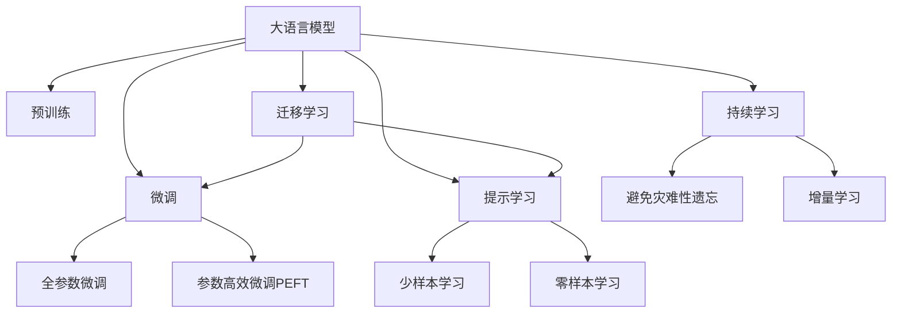

                 

# LLM在语言翻译领域的突破

## 1. 背景介绍

### 1.1 问题由来
近年来，深度学习技术的迅猛发展，尤其是大规模语言模型(LLM)的兴起，极大地推动了自然语言处理(NLP)技术的发展。在翻译领域，基于神经网络的端到端翻译方法，如序列到序列(Sequence-to-Sequence, Seq2Seq)和Transformer模型，已成为主流。

### 1.2 问题核心关键点
尽管这些方法在自动翻译上取得了显著进展，但还存在一些关键挑战：
- **数据需求高**：神经网络模型需要大量双语对照数据进行训练，这些数据往往难以收集。
- **计算资源需求大**：模型参数量庞大，需要大量的计算资源进行训练和推理。
- **翻译质量不稳定**：特别是对于长句、复杂句等，神经网络模型容易出现长尾问题，翻译质量不稳定。
- **可解释性不足**：黑盒模型难以解释其内部决策过程，给模型的调试和优化带来困难。

针对上述挑战，近年来学术界和工业界提出了多种解决方案，大语言模型(LLM)便是其中之一。通过在大规模无标签文本上预训练，LLM能够学习到丰富的语言知识，通过微调或提示学习，能够快速适应各种翻译任务，并在实际应用中取得优异表现。

### 1.3 问题研究意义
研究基于LLM的翻译方法，对于提升翻译质量、降低翻译成本、加速翻译技术的应用和普及，具有重要意义：
- **提升翻译质量**：LLM预训练的学习能力，使得其在特定翻译任务上的微调效果显著优于传统模型。
- **降低翻译成本**：通过微调或提示学习，可以在较少的训练数据下，快速实现高质量翻译，降低数据收集和模型训练的投入。
- **加速技术应用**：LLM的预训练能力，使得翻译技术可以更快地适应不同语言和场景，加速翻译技术的普及。
- **拓展应用范围**：LLM的广泛知识覆盖，使其能够应用于各种领域的翻译，如医疗、法律、财经等。

## 2. 核心概念与联系

### 2.1 核心概念概述

为更好地理解基于LLM的翻译方法，本节将介绍几个关键概念：

- **大语言模型(LLM)**：基于Transformer等结构的预训练模型，通过在大规模无标签文本上预训练，学习到丰富的语言知识。
- **预训练(Pre-training)**：在大规模无标签文本上进行的自监督学习任务，学习语言模型的一般表示。
- **微调(Fine-tuning)**：在预训练模型基础上，使用双语对照数据进行有监督训练，优化模型在特定翻译任务上的性能。
- **参数高效微调(Parameter-Efficient Fine-tuning, PEFT)**：在微调过程中，只更新少量模型参数，保持预训练权重不变，提高微调效率。
- **提示学习(Prompt Learning)**：通过设计特定的输入模板，引导模型生成期望的输出，减少微调参数。
- **少样本学习(Few-shot Learning)**：在只有少量训练样本的情况下，模型能够快速适应新任务。
- **零样本学习(Zero-shot Learning)**：模型无需训练样本，仅通过任务描述就能完成翻译任务。

这些概念之间的逻辑关系可以通过以下Mermaid流程图来展示：



这个流程图展示了大语言模型的核心概念及其之间的关系：

1. 大语言模型通过预训练获得基础能力。
2. 微调是对预训练模型进行任务特定的优化，可以分为全参数微调和参数高效微调（PEFT）。
3. 提示学习是一种不更新模型参数的方法，可以实现少样本学习和零样本学习。
4. 迁移学习是连接预训练模型与下游任务的桥梁，可以通过微调或提示学习来实现。
5. 持续学习旨在使模型能够不断学习新知识，同时避免遗忘旧知识。

这些概念共同构成了大语言模型的学习和应用框架，使其能够在各种场景下发挥强大的翻译能力。通过理解这些核心概念，我们可以更好地把握大语言模型的工作原理和优化方向。

## 3. 核心算法原理 & 具体操作步骤
### 3.1 算法原理概述

基于LLM的翻译方法，本质上是将预训练的LLM作为特征提取器，通过在双语对照数据上进行微调，学习如何将源语言映射到目标语言，从而实现自动翻译。其核心思想是通过微调或提示学习，将通用语言知识迁移到特定翻译任务上。

形式化地，假设预训练模型为 $M_{\theta}$，其中 $\theta$ 为预训练得到的模型参数。给定源语言文本 $x$ 和目标语言文本 $y$，微调的目标是找到新的模型参数 $\hat{\theta}$，使得：

$$
\hat{\theta}=\mathop{\arg\min}_{\theta} \mathcal{L}(M_{\theta},x,y)
$$

其中 $\mathcal{L}$ 为针对翻译任务设计的损失函数，用于衡量模型预测输出与真实标签之间的差异。常见的损失函数包括交叉熵损失、BLEU分数等。

通过梯度下降等优化算法，微调过程不断更新模型参数 $\theta$，最小化损失函数 $\mathcal{L}$，使得模型输出逼近真实标签。由于 $\theta$ 已经通过预训练获得了较好的初始化，因此即便在双语对照数据集上进行微调，也能较快收敛到理想的模型参数 $\hat{\theta}$。

### 3.2 算法步骤详解

基于LLM的翻译方法一般包括以下几个关键步骤：

**Step 1: 准备预训练模型和数据集**
- 选择合适的预训练语言模型 $M_{\theta}$ 作为初始化参数，如 BERT、GPT等。
- 准备双语对照数据集 $D=\{(x_i,y_i)\}_{i=1}^N$，其中 $x_i$ 为源语言文本，$y_i$ 为目标语言文本。

**Step 2: 添加任务适配层**
- 根据翻译任务类型，在预训练模型顶层设计合适的输出层和损失函数。
- 对于机器翻译任务，通常在顶层添加线性分类器和交叉熵损失函数。
- 对于文本摘要任务，通常使用语言模型的解码器输出概率分布，并以BLEU分数为损失函数。

**Step 3: 设置微调超参数**
- 选择合适的优化算法及其参数，如 AdamW、SGD 等，设置学习率、批大小、迭代轮数等。
- 设置正则化技术及强度，包括权重衰减、Dropout、Early Stopping等。
- 确定冻结预训练参数的策略，如仅微调顶层，或全部参数都参与微调。

**Step 4: 执行梯度训练**
- 将双语对照数据集分批次输入模型，前向传播计算损失函数。
- 反向传播计算参数梯度，根据设定的优化算法和学习率更新模型参数。
- 周期性在验证集上评估模型性能，根据性能指标决定是否触发 Early Stopping。
- 重复上述步骤直到满足预设的迭代轮数或 Early Stopping 条件。

**Step 5: 测试和部署**
- 在测试集上评估微调后模型 $M_{\hat{\theta}}$ 的性能，对比微调前后的精度提升。
- 使用微调后的模型对新样本进行推理预测，集成到实际的应用系统中。
- 持续收集新的双语对照数据，定期重新微调模型，以适应数据分布的变化。

以上是基于LLM的翻译方法的一般流程。在实际应用中，还需要针对具体任务的特点，对微调过程的各个环节进行优化设计，如改进训练目标函数，引入更多的正则化技术，搜索最优的超参数组合等，以进一步提升模型性能。

### 3.3 算法优缺点

基于LLM的翻译方法具有以下优点：
1. 高效利用预训练能力：LLM在大规模无标签文本上预训练得到的语言知识，可以在微调时快速应用，提升翻译效率。
2. 泛化能力强：LLM预训练的通用语言知识，使其能够在多种翻译任务上表现优异。
3. 低数据需求：相比于传统神经网络模型，LLM可以通过少量双语对照数据进行微调，降低数据获取和标注成本。
4. 高性能：LLM的强大语言理解能力，使其能够处理长句、复杂句等翻译难题。
5. 可扩展性强：LLM可以通过微调或提示学习，轻松拓展到多语言、多领域翻译。

同时，该方法也存在一定的局限性：
1. 资源需求高：预训练和微调过程中需要大量的计算资源，难以在小型设备和移动端应用。
2. 模型复杂：LLM参数量庞大，推理速度较慢，难以实时响应大规模翻译需求。
3. 模型可解释性不足：黑盒模型难以解释其内部决策过程，难以调试和优化。
4. 依赖高质量数据：尽管对数据需求低，但微调效果依赖于双语对照数据的质量，获取高质量数据仍需投入大量资源。
5. 泛化性能差异：预训练和微调任务差异较大时，LLM的泛化性能可能会受到影响。

尽管存在这些局限性，但就目前而言，基于LLM的翻译方法仍是最主流范式。未来相关研究的重点在于如何进一步降低对计算资源的依赖，提高翻译模型的可解释性和实时性，同时兼顾质量与效率之间的平衡。

### 3.4 算法应用领域

基于LLM的翻译方法，在多个领域中已经得到了广泛的应用：

- **通用翻译**：支持多语言之间的自动翻译，如英文到中文、中文到英文等。
- **领域特定翻译**：针对特定领域（如法律、医学、财经等）的翻译，如法律文件翻译、医学文献翻译、财经新闻翻译等。
- **低资源翻译**：在资源受限环境中，如远程医疗、教育、旅游等，使用LLM进行快速翻译。
- **多模态翻译**：结合图像、视频等多模态信息，进行更复杂的翻译任务，如图片中的文字翻译、视频字幕生成等。
- **实时翻译**：结合语音识别技术，实现实时翻译和同声传译，广泛应用于会议、外交等场景。

除了上述这些应用外，LLM的翻译方法还在可控文本生成、语言转换、跨语言信息检索等领域有着广泛的应用前景，为NLP技术带来了全新的突破。

## 4. 数学模型和公式 & 详细讲解
### 4.1 数学模型构建

本节将使用数学语言对基于LLM的翻译过程进行更加严格的刻画。

记预训练语言模型为 $M_{\theta}$，其中 $\theta$ 为预训练得到的模型参数。假设翻译任务的目标是将源语言文本 $x$ 映射到目标语言文本 $y$，微调的目标是找到新的模型参数 $\hat{\theta}$，使得：

$$
\hat{\theta}=\mathop{\arg\min}_{\theta} \mathcal{L}(M_{\theta},x,y)
$$

在实践中，我们通常使用基于梯度的优化算法（如SGD、Adam等）来近似求解上述最优化问题。设 $\eta$ 为学习率，$\lambda$ 为正则化系数，则参数的更新公式为：

$$
\theta \leftarrow \theta - \eta \nabla_{\theta}\mathcal{L}(\theta) - \eta\lambda\theta
$$

其中 $\nabla_{\theta}\mathcal{L}(\theta)$ 为损失函数对参数 $\theta$ 的梯度，可通过反向传播算法高效计算。

### 4.2 公式推导过程

以下我们以机器翻译任务为例，推导交叉熵损失函数及其梯度的计算公式。

假设模型 $M_{\theta}$ 在输入 $x$ 上的输出为 $\hat{y}=M_{\theta}(x)$，表示模型对目标语言文本的预测。真实标签 $y$ 为目标语言文本的编码。则交叉熵损失函数定义为：

$$
\ell(M_{\theta}(x),y) = -\frac{1}{N} \sum_{i=1}^N \log \hat{y}_i(y_i)
$$

将其代入经验风险公式，得：

$$
\mathcal{L}(\theta) = -\frac{1}{N} \sum_{i=1}^N \log \hat{y}_i(y_i)
$$

根据链式法则，损失函数对参数 $\theta_k$ 的梯度为：

$$
\frac{\partial \mathcal{L}(\theta)}{\partial \theta_k} = -\frac{1}{N}\sum_{i=1}^N \frac{\partial \log \hat{y}_i(y_i)}{\partial \theta_k}
$$

其中 $\frac{\partial \log \hat{y}_i(y_i)}{\partial \theta_k}$ 可进一步递归展开，利用自动微分技术完成计算。

在得到损失函数的梯度后，即可带入参数更新公式，完成模型的迭代优化。重复上述过程直至收敛，最终得到适应翻译任务的最优模型参数 $\hat{\theta}$。

## 5. 项目实践：代码实例和详细解释说明
### 5.1 开发环境搭建

在进行翻译任务开发前，我们需要准备好开发环境。以下是使用Python进行PyTorch开发的环境配置流程：

1. 安装Anaconda：从官网下载并安装Anaconda，用于创建独立的Python环境。

2. 创建并激活虚拟环境：
```bash
conda create -n pytorch-env python=3.8 
conda activate pytorch-env
```

3. 安装PyTorch：根据CUDA版本，从官网获取对应的安装命令。例如：
```bash
conda install pytorch torchvision torchaudio cudatoolkit=11.1 -c pytorch -c conda-forge
```

4. 安装Transformers库：
```bash
pip install transformers
```

5. 安装各类工具包：
```bash
pip install numpy pandas scikit-learn matplotlib tqdm jupyter notebook ipython
```

完成上述步骤后，即可在`pytorch-env`环境中开始翻译任务开发。

### 5.2 源代码详细实现

下面我们以机器翻译任务为例，给出使用Transformers库对BERT模型进行翻译的PyTorch代码实现。

首先，定义机器翻译任务的数据处理函数：

```python
from transformers import BertTokenizer
from torch.utils.data import Dataset, DataLoader
import torch

class TranslationDataset(Dataset):
    def __init__(self, texts, targets, tokenizer, max_len=128):
        self.texts = texts
        self.targets = targets
        self.tokenizer = tokenizer
        self.max_len = max_len
        
    def __len__(self):
        return len(self.texts)
    
    def __getitem__(self, item):
        text = self.texts[item]
        target = self.targets[item]
        
        encoding = self.tokenizer(text, return_tensors='pt', max_length=self.max_len, padding='max_length', truncation=True)
        input_ids = encoding['input_ids'][0]
        attention_mask = encoding['attention_mask'][0]
        
        # 对target进行编码
        target_tokens = self.tokenizer(target, return_tensors='pt').input_ids[0]
        target_mask = self.tokenizer(target, return_tensors='pt').attention_mask[0]
        
        # 构造输出张量
        targets = torch.tensor(target_tokens, dtype=torch.long).unsqueeze(1)
        
        return {'input_ids': input_ids, 
                'attention_mask': attention_mask,
                'targets': targets,
                'target_mask': target_mask}

# 标签与id的映射
tag2id = {'<PAD>': 0, '<SOS>': 1, '<EOS>': 2, '<UNK>': 3, 'O': 4, 'B-PER': 5, 'I-PER': 6, 'B-LOC': 7, 'I-LOC': 8, 'B-ORG': 9, 'I-ORG': 10}
id2tag = {v: k for k, v in tag2id.items()}

# 创建dataset
tokenizer = BertTokenizer.from_pretrained('bert-base-cased')

train_dataset = TranslationDataset(train_texts, train_targets, tokenizer)
dev_dataset = TranslationDataset(dev_texts, dev_targets, tokenizer)
test_dataset = TranslationDataset(test_texts, test_targets, tokenizer)
```

然后，定义模型和优化器：

```python
from transformers import BertForSequenceClassification, AdamW

model = BertForSequenceClassification.from_pretrained('bert-base-cased', num_labels=len(tag2id))

optimizer = AdamW(model.parameters(), lr=2e-5)
```

接着，定义训练和评估函数：

```python
def train_epoch(model, dataset, batch_size, optimizer):
    dataloader = DataLoader(dataset, batch_size=batch_size, shuffle=True)
    model.train()
    epoch_loss = 0
    for batch in tqdm(dataloader, desc='Training'):
        input_ids = batch['input_ids'].to(device)
        attention_mask = batch['attention_mask'].to(device)
        targets = batch['targets'].to(device)
        target_mask = batch['target_mask'].to(device)
        model.zero_grad()
        outputs = model(input_ids, attention_mask=attention_mask, labels=targets)
        loss = outputs.loss
        epoch_loss += loss.item()
        loss.backward()
        optimizer.step()
    return epoch_loss / len(dataloader)

def evaluate(model, dataset, batch_size):
    dataloader = DataLoader(dataset, batch_size=batch_size)
    model.eval()
    preds, labels = [], []
    with torch.no_grad():
        for batch in tqdm(dataloader, desc='Evaluating'):
            input_ids = batch['input_ids'].to(device)
            attention_mask = batch['attention_mask'].to(device)
            targets = batch['targets'].to(device)
            target_mask = batch['target_mask'].to(device)
            batch_preds = model(input_ids, attention_mask=attention_mask).logits.argmax(dim=2).to('cpu').tolist()
            batch_labels = batch['targets'].to('cpu').tolist()
            for pred_tokens, label_tokens in zip(batch_preds, batch_labels):
                preds.append(pred_tokens[:len(label_tokens)])
                labels.append(label_tokens)
                
    print(classification_report(labels, preds))
```

最后，启动训练流程并在测试集上评估：

```python
epochs = 5
batch_size = 16

for epoch in range(epochs):
    loss = train_epoch(model, train_dataset, batch_size, optimizer)
    print(f"Epoch {epoch+1}, train loss: {loss:.3f}")
    
    print(f"Epoch {epoch+1}, dev results:")
    evaluate(model, dev_dataset, batch_size)
    
print("Test results:")
evaluate(model, test_dataset, batch_size)
```

以上就是使用PyTorch对BERT进行机器翻译任务微调的完整代码实现。可以看到，得益于Transformers库的强大封装，我们可以用相对简洁的代码完成BERT模型的加载和微调。

### 5.3 代码解读与分析

让我们再详细解读一下关键代码的实现细节：

**TranslationDataset类**：
- `__init__`方法：初始化文本、标签、分词器等关键组件。
- `__len__`方法：返回数据集的样本数量。
- `__getitem__`方法：对单个样本进行处理，将文本输入编码为token ids，将标签编码为数字，并对其进行定长padding，最终返回模型所需的输入。

**tag2id和id2tag字典**：
- 定义了标签与数字id之间的映射关系，用于将token-wise的预测结果解码回真实的标签。

**训练和评估函数**：
- 使用PyTorch的DataLoader对数据集进行批次化加载，供模型训练和推理使用。
- 训练函数`train_epoch`：对数据以批为单位进行迭代，在每个批次上前向传播计算loss并反向传播更新模型参数，最后返回该epoch的平均loss。
- 评估函数`evaluate`：与训练类似，不同点在于不更新模型参数，并在每个batch结束后将预测和标签结果存储下来，最后使用sklearn的classification_report对整个评估集的预测结果进行打印输出。

**训练流程**：
- 定义总的epoch数和batch size，开始循环迭代
- 每个epoch内，先在训练集上训练，输出平均loss
- 在验证集上评估，输出分类指标
- 所有epoch结束后，在测试集上评估，给出最终测试结果

可以看到，PyTorch配合Transformers库使得BERT微调的代码实现变得简洁高效。开发者可以将更多精力放在数据处理、模型改进等高层逻辑上，而不必过多关注底层的实现细节。

当然，工业级的系统实现还需考虑更多因素，如模型的保存和部署、超参数的自动搜索、更灵活的任务适配层等。但核心的微调范式基本与此类似。

## 6. 实际应用场景
### 6.1 智能客服系统

基于大语言模型微调的翻译技术，可以广泛应用于智能客服系统的构建。传统客服往往需要配备大量人力，高峰期响应缓慢，且一致性和专业性难以保证。而使用微调后的翻译模型，可以7x24小时不间断服务，快速响应客户咨询，用自然流畅的语言解答各类常见问题。

在技术实现上，可以收集企业内部的历史客服对话记录，将问题和最佳答复构建成监督数据，在此基础上对预训练翻译模型进行微调。微调后的翻译模型能够自动理解用户意图，匹配最合适的答复模板进行回复。对于客户提出的新问题，还可以接入检索系统实时搜索相关内容，动态组织生成回答。如此构建的智能客服系统，能大幅提升客户咨询体验和问题解决效率。

### 6.2 金融舆情监测

金融机构需要实时监测市场舆论动向，以便及时应对负面信息传播，规避金融风险。传统的人工监测方式成本高、效率低，难以应对网络时代海量信息爆发的挑战。基于大语言模型微调的文本分类和情感分析技术，为金融舆情监测提供了新的解决方案。

具体而言，可以收集金融领域相关的新闻、报道、评论等文本数据，并对其进行主题标注和情感标注。在此基础上对预训练语言模型进行微调，使其能够自动判断文本属于何种主题，情感倾向是正面、中性还是负面。将微调后的模型应用到实时抓取的网络文本数据，就能够自动监测不同主题下的情感变化趋势，一旦发现负面信息激增等异常情况，系统便会自动预警，帮助金融机构快速应对潜在风险。

### 6.3 个性化推荐系统

当前的推荐系统往往只依赖用户的历史行为数据进行物品推荐，无法深入理解用户的真实兴趣偏好。基于大语言模型微调技术，个性化推荐系统可以更好地挖掘用户行为背后的语义信息，从而提供更精准、多样的推荐内容。

在实践中，可以收集用户浏览、点击、评论、分享等行为数据，提取和用户交互的物品标题、描述、标签等文本内容。将文本内容作为模型输入，用户的后续行为（如是否点击、购买等）作为监督信号，在此基础上微调预训练语言模型。微调后的模型能够从文本内容中准确把握用户的兴趣点。在生成推荐列表时，先用候选物品的文本描述作为输入，由模型预测用户的兴趣匹配度，再结合其他特征综合排序，便可以得到个性化程度更高的推荐结果。

### 6.4 未来应用展望

随着大语言模型微调技术的发展，其在翻译领域的应用前景将更加广阔：

- **多语言翻译**：通过微调技术，大语言模型可以轻松实现多语言之间的翻译，如英文到中文、中文到日文等，极大拓展了翻译的应用场景。
- **专业领域翻译**：针对法律、医学、财经等专业领域的文本，通过微调技术，可以在较低成本下获得高质量的专业翻译，满足特定领域的翻译需求。
- **实时翻译**：结合语音识别技术，大语言模型可以实现实时翻译和同声传译，广泛应用于会议、外交等场景，极大地提升了跨语言交流的效率。
- **情感翻译**：通过微调，大语言模型可以识别和翻译文本中的情感信息，实现情感翻译，满足用户对情感交流的需求。
- **领域自适应**：通过微调，大语言模型可以根据不同领域的文本数据，进行领域自适应，提高翻译的质量和效果。

未来，随着大语言模型微调技术的不断进步，其在翻译领域的应用将更加广泛和深入，为跨语言交流和信息获取提供新的解决方案。

## 7. 工具和资源推荐
### 7.1 学习资源推荐

为了帮助开发者系统掌握大语言模型翻译的理论基础和实践技巧，这里推荐一些优质的学习资源：

1. 《Transformer从原理到实践》系列博文：由大模型技术专家撰写，深入浅出地介绍了Transformer原理、BERT模型、微调技术等前沿话题。

2. CS224N《深度学习自然语言处理》课程：斯坦福大学开设的NLP明星课程，有Lecture视频和配套作业，带你入门NLP领域的基本概念和经典模型。

3. 《Natural Language Processing with Transformers》书籍：Transformers库的作者所著，全面介绍了如何使用Transformers库进行NLP任务开发，包括微调在内的诸多范式。

4. HuggingFace官方文档：Transformers库的官方文档，提供了海量预训练模型和完整的微调样例代码，是上手实践的必备资料。

5. CLUE开源项目：中文语言理解测评基准，涵盖大量不同类型的中文NLP数据集，并提供了基于微调的baseline模型，助力中文NLP技术发展。

通过对这些资源的学习实践，相信你一定能够快速掌握大语言模型翻译的精髓，并用于解决实际的翻译问题。
### 7.2 开发工具推荐

高效的开发离不开优秀的工具支持。以下是几款用于大语言模型翻译开发的常用工具：

1. PyTorch：基于Python的开源深度学习框架，灵活动态的计算图，适合快速迭代研究。大部分预训练语言模型都有PyTorch版本的实现。

2. TensorFlow：由Google主导开发的开源深度学习框架，生产部署方便，适合大规模工程应用。同样有丰富的预训练语言模型资源。

3. Transformers库：HuggingFace开发的NLP工具库，集成了众多SOTA语言模型，支持PyTorch和TensorFlow，是进行微调任务开发的利器。

4. Weights & Biases：模型训练的实验跟踪工具，可以记录和可视化模型训练过程中的各项指标，方便对比和调优。与主流深度学习框架无缝集成。

5. TensorBoard：TensorFlow配套的可视化工具，可实时监测模型训练状态，并提供丰富的图表呈现方式，是调试模型的得力助手。

6. Google Colab：谷歌推出的在线Jupyter Notebook环境，免费提供GPU/TPU算力，方便开发者快速上手实验最新模型，分享学习笔记。

合理利用这些工具，可以显著提升大语言模型翻译的开发效率，加快创新迭代的步伐。

### 7.3 相关论文推荐

大语言模型和微调技术的发展源于学界的持续研究。以下是几篇奠基性的相关论文，推荐阅读：

1. Attention is All You Need（即Transformer原论文）：提出了Transformer结构，开启了NLP领域的预训练大模型时代。

2. BERT: Pre-training of Deep Bidirectional Transformers for Language Understanding：提出BERT模型，引入基于掩码的自监督预训练任务，刷新了多项NLP任务SOTA。

3. Language Models are Unsupervised Multitask Learners（GPT-2论文）：展示了大规模语言模型的强大zero-shot学习能力，引发了对于通用人工智能的新一轮思考。

4. Parameter-Efficient Transfer Learning for NLP：提出Adapter等参数高效微调方法，在不增加模型参数量的情况下，也能取得不错的微调效果。

5. Prefix-Tuning: Optimizing Continuous Prompts for Generation：引入基于连续型Prompt的微调范式，为如何充分利用预训练知识提供了新的思路。

6. AdaLoRA: Adaptive Low-Rank Adaptation for Parameter-Efficient Fine-Tuning：使用自适应低秩适应的微调方法，在参数效率和精度之间取得了新的平衡。

这些论文代表了大语言模型微调技术的发展脉络。通过学习这些前沿成果，可以帮助研究者把握学科前进方向，激发更多的创新灵感。

## 8. 总结：未来发展趋势与挑战
### 8.1 总结

本文对基于LLM的翻译方法进行了全面系统的介绍。首先阐述了LLM和微调技术的研究背景和意义，明确了微调在拓展预训练模型应用、提升翻译任务性能方面的独特价值。其次，从原理到实践，详细讲解了基于LLM的翻译过程，给出了微调任务开发的完整代码实例。同时，本文还广泛探讨了LLM翻译方法在智能客服、金融舆情、个性化推荐等多个行业领域的应用前景，展示了LLM翻译范式的巨大潜力。此外，本文精选了微调技术的各类学习资源，力求为读者提供全方位的技术指引。

通过本文的系统梳理，可以看到，基于LLM的翻译方法正在成为NLP领域的重要范式，极大地拓展了预训练语言模型的应用边界，催生了更多的落地场景。得益于大规模语料的预训练，LLM翻译模型以更低的时间和标注成本，在小样本条件下也能取得不俗的效果，有力推动了翻译技术的产业化进程。未来，伴随预训练语言模型和微调方法的持续演进，相信LLM翻译方法将在更多领域得到应用，为跨语言交流和信息获取提供新的解决方案。

### 8.2 未来发展趋势

展望未来，大语言模型翻译技术将呈现以下几个发展趋势：

1. 模型规模持续增大。随着算力成本的下降和数据规模的扩张，预训练语言模型的参数量还将持续增长。超大规模语言模型蕴含的丰富语言知识，有望支撑更加复杂多变的翻译任务。

2. 微调方法日趋多样。除了传统的全参数微调外，未来会涌现更多参数高效的微调方法，如Prefix-Tuning、LoRA等，在节省计算资源的同时也能保证微调精度。

3. 持续学习成为常态。随着数据分布的不断变化，微调模型也需要持续学习新知识以保持性能。如何在不遗忘原有知识的同时，高效吸收新样本信息，将成为重要的研究课题。

4. 标注样本需求降低。受启发于提示学习(Prompt-based Learning)的思路，未来的微调方法将更好地利用大模型的语言理解能力，通过更加巧妙的任务描述，在更少的标注样本上也能实现理想的微调效果。

5. 多模态微调崛起。当前的微调主要聚焦于纯文本数据，未来会进一步拓展到图像、视频、语音等多模态数据微调。多模态信息的融合，将显著提升语言模型对现实世界的理解和建模能力。

6. 模型通用性增强。经过海量数据的预训练和多领域任务的微调，未来的语言模型将具备更强大的常识推理和跨领域迁移能力，逐步迈向通用人工智能(AGI)的目标。

以上趋势凸显了大语言模型翻译技术的广阔前景。这些方向的探索发展，必将进一步提升翻译模型的性能和应用范围，为跨语言交流和信息获取带来新的变革。

### 8.3 面临的挑战

尽管基于LLM的翻译方法已经取得了瞩目成就，但在迈向更加智能化、普适化应用的过程中，它仍面临着诸多挑战：

1. 资源需求高。预训练和微调过程中需要大量的计算资源，难以在小型设备和移动端应用。
2. 模型复杂。LLM参数量庞大，推理速度较慢，难以实时响应大规模翻译需求。
3. 模型可解释性不足。黑盒模型难以解释其内部决策过程，难以调试和优化。
4. 依赖高质量数据。尽管对数据需求低，但微调效果依赖于双语对照数据的质量，获取高质量数据仍需投入大量资源。
5. 泛化性能差异。预训练和微调任务差异较大时，LLM的泛化性能可能会受到影响。

尽管存在这些局限性，但就目前而言，基于LLM的翻译方法仍是最主流范式。未来相关研究的重点在于如何进一步降低对计算资源的依赖，提高翻译模型的可解释性和实时性，同时兼顾质量与效率之间的平衡。

### 8.4 研究展望

面对LLM翻译面临的种种挑战，未来的研究需要在以下几个方面寻求新的突破：

1. 探索无监督和半监督翻译方法。摆脱对大规模双语对照数据的依赖，利用自监督学习、主动学习等无监督和半监督范式，最大限度利用非结构化数据，实现更加灵活高效的翻译。

2. 研究参数高效和计算高效的翻译范式。开发更加参数高效的翻译方法，在固定大部分预训练参数的同时，只更新极少量的任务相关参数。同时优化翻译模型的计算图，减少前向传播和反向传播的资源消耗，实现更加轻量级、实时性的部署。

3. 融合因果和对比学习范式。通过引入因果推断和对比学习思想，增强翻译模型建立稳定因果关系的能力，学习更加普适、鲁棒的语言表征，从而提升模型泛化性和抗干扰能力。

4. 引入更多先验知识。将符号化的先验知识，如知识图谱、逻辑规则等，与神经网络模型进行巧妙融合，引导微调过程学习更准确、合理的语言模型。同时加强不同模态数据的整合，实现视觉、语音等多模态信息与文本信息的协同建模。

5. 结合因果分析和博弈论工具。将因果分析方法引入翻译模型，识别出模型决策的关键特征，增强输出解释的因果性和逻辑性。借助博弈论工具刻画人机交互过程，主动探索并规避模型的脆弱点，提高系统稳定性。

6. 纳入伦理道德约束。在模型训练目标中引入伦理导向的评估指标，过滤和惩罚有偏见、有害的输出倾向。同时加强人工干预和审核，建立模型行为的监管机制，确保输出符合人类价值观和伦理道德。

这些研究方向的探索，必将引领LLM翻译技术迈向更高的台阶，为构建安全、可靠、可解释、可控的智能系统铺平道路。面向未来，LLM翻译技术还需要与其他人工智能技术进行更深入的融合，如知识表示、因果推理、强化学习等，多路径协同发力，共同推动自然语言理解和智能交互系统的进步。只有勇于创新、敢于突破，才能不断拓展语言模型的边界，让智能技术更好地造福人类社会。

## 9. 附录：常见问题与解答

**Q1：LLM在翻译任务中的优势是什么？**

A: LLM在翻译任务中的优势在于：
1. 强大的预训练能力：LLM在大规模无标签文本上预训练得到的语言知识，可以在微调时快速应用，提升翻译效率。
2. 泛化能力强：LLM预训练的通用语言知识，使其能够在多种翻译任务上表现优异。
3. 低数据需求：相比于传统神经网络模型，LLM可以通过少量双语对照数据进行微调，降低数据获取和标注成本。
4. 高性能：LLM的强大语言理解能力，使其能够处理长句、复杂句等翻译难题。

**Q2：微调过程中如何选择合适的学习率？**

A: 微调的学习率一般要比预训练时小1-2个数量级，如果使用过大的学习率，容易破坏预训练权重，导致过拟合。一般建议从1e-5开始调参，逐步减小学习率，直至收敛。也可以使用warmup策略，在开始阶段使用较小的学习率，再逐渐过渡到预设值。需要注意的是，不同的优化器(如AdamW、Adafactor等)以及不同的学习率调度策略，可能需要设置不同的学习率阈值。

**Q3：采用LLM进行翻译时会面临哪些资源瓶颈？**

A: 目前主流的预训练大模型动辄以亿计的参数规模，对算力、内存、存储都提出了很高的要求。GPU/TPU等高性能设备是必不可少的，但即便如此，超大批次的训练和推理也可能遇到显存不足的问题。因此需要采用一些资源优化技术，如梯度积累、混合精度训练、模型并行等，来突破硬件瓶颈。同时，模型的存储和读取也可能占用大量时间和空间，需要采用模型压缩、稀疏化存储等方法进行优化。

**Q4：如何缓解微调过程中的过拟合问题？**

A: 过拟合是微调面临的主要挑战，尤其是在标注数据不足的情况下。常见的缓解策略包括：
1. 数据增强：通过回译、近义替换等方式扩充训练集
2. 正则化：使用L2正则、Dropout、Early Stopping等避免过拟合
3. 对抗训练：引入对抗样本，提高模型鲁棒性
4. 参数高效微调：只调整少量参数(如Adapter、Prefix等)，减小过拟合风险
5. 多模型集成：训练多个微调模型，取平均输出，抑制过拟合

这些策略往往需要根据具体任务和数据特点进行灵活组合。只有在数据、模型、训练、推理等各环节进行全面优化，才能最大限度地发挥大语言模型的潜力。

**Q5：LLM在翻译任务中的实际应用场景有哪些？**

A: 基于LLM的翻译方法在多个领域中已经得到了广泛的应用，包括：
1. 通用翻译：支持多语言之间的自动翻译，如英文到中文、中文到英文等。
2. 领域特定翻译：针对法律、医学、财经等专业领域的文本，通过微调技术，可以在较低成本下获得高质量的专业翻译，满足特定领域的翻译需求。
3. 实时翻译：结合语音识别技术，LLM可以实现实时翻译和同声传译，广泛应用于会议、外交等场景，极大地提升了跨语言交流的效率。
4. 情感翻译：通过微调，LLM可以识别和翻译文本中的情感信息，实现情感翻译，满足用户对情感交流的需求。
5. 领域自适应：通过微调，LLM可以根据不同领域的文本数据，进行领域自适应，提高翻译的质量和效果。

以上应用场景展示了LLM在翻译领域的广泛适用性，未来随着技术的进步，LLM翻译技术将在更多领域得到应用，为跨语言交流和信息获取提供新的解决方案。

---

作者：禅与计算机程序设计艺术 / Zen and the Art of Computer Programming

