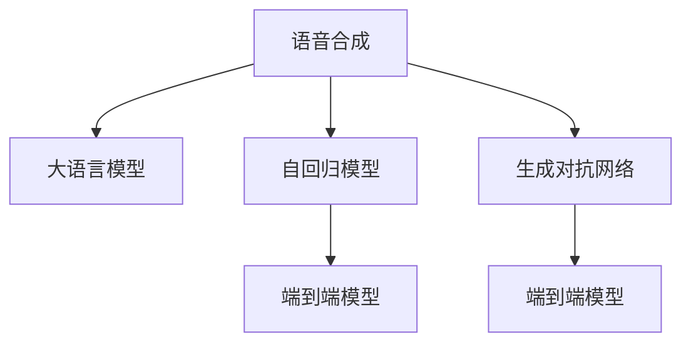

                 

# LLM在语音合成任务上的进展综述

> 关键词：语音合成, 大语言模型, 深度学习, 生成对抗网络, 自回归模型, 端到端模型, 声学模型, 文本转语音

## 1. 背景介绍

语音合成，即文本转语音（Text-to-Speech, TTS），是指将文字信息转化为自然流畅的语音输出。近年来，随着深度学习技术的发展，语音合成技术取得了长足的进步。大语言模型（Large Language Model, LLM）以其强大的语言理解和生成能力，在语音合成任务上也展现了广阔的应用前景。

### 1.1 问题由来

语音合成技术在智能助手、电话导航、虚拟主播、有声读物等领域有着广泛的应用。传统的语音合成方法主要基于规则和统计模型，如隐马尔可夫模型（HMM）和神经网络（RNN），但这些方法往往需要大量手工标注的语音数据，难以泛化到不同口音和语速。

近年来，随着深度学习的发展，尤其是大语言模型的出现，基于端到端的语音合成方法逐渐兴起。大语言模型通过自回归模型或生成对抗网络（GAN），直接从文本到语音生成高质量的语音输出，简化了传统方法中繁琐的声学建模和发音参数训练步骤。

### 1.2 问题核心关键点

基于大语言模型的语音合成方法主要分为两类：自回归模型和生成对抗网络。自回归模型通过Transformer架构，直接从文本序列生成语音信号；生成对抗网络则通过一个生成器和一个判别器交替训练，生成高质量的语音输出。

本文将详细梳理这两种方法的核心概念、原理和应用实践，帮助读者深入理解大语言模型在语音合成任务上的进展和未来发展方向。

## 2. 核心概念与联系

### 2.1 核心概念概述

为更好地理解大语言模型在语音合成任务上的应用，本节将介绍几个关键概念：

- 语音合成（Text-to-Speech, TTS）：将文字信息转化为自然流畅的语音输出。
- 大语言模型（Large Language Model, LLM）：以Transformer为代表的大规模预训练语言模型，具备强大的语言理解和生成能力。
- 自回归模型（Autoregressive Model）：通过前向逐步生成，每个时间步的输出只依赖于之前的信息。
- 生成对抗网络（Generative Adversarial Network, GAN）：由生成器和判别器组成，通过对抗训练生成高质量的样本。
- 端到端模型（End-to-End Model）：直接从文本输入到语音输出，省略了声学建模和发音参数训练步骤。

这些概念之间的逻辑关系可以通过以下Mermaid流程图来展示：



这个流程图展示了语音合成的主要范式，包括使用大语言模型作为生成器或判别器，实现端到端的语音合成。

## 3. 核心算法原理 & 具体操作步骤

### 3.1 算法原理概述

基于大语言模型的语音合成方法，主要分为自回归模型和生成对抗网络两类。

- 自回归模型：通过Transformer架构，将文本序列转换为语音信号。每个时间步的输出只依赖于之前的信息，最终输出连续的语音信号。
- 生成对抗网络：由生成器和判别器组成，通过对抗训练生成高质量的语音输出。

这两种方法的核心在于利用大语言模型的语言生成能力，直接从文本生成语音。其基本流程包括文本编码、语音生成、后处理等步骤。

### 3.2 算法步骤详解

#### 3.2.1 自回归模型

自回归模型的基本流程如下：

1. **文本编码**：将输入文本序列编码成一个高维向量。
2. **语音生成**：使用Transformer模型逐步生成语音信号，每个时间步的输出只依赖于之前的信息。
3. **后处理**：对生成的语音信号进行降噪、重采样等处理，提高语音质量。

具体实现上，可以使用VCTK语料库、LibriSpeech等数据集进行模型训练和评估。训练时，通过端到端框架（如pyannote-audio、espnet等）实现自回归模型的训练和推理。

#### 3.2.2 生成对抗网络

生成对抗网络的流程如下：

1. **文本编码**：将输入文本序列编码成一个高维向量。
2. **语音生成**：使用生成器网络生成语音信号，判别器网络评估生成的语音信号质量。
3. **对抗训练**：通过交替训练生成器和判别器，提高生成器生成高质量语音的能力。
4. **后处理**：对生成的语音信号进行降噪、重采样等处理，提高语音质量。

具体实现上，可以使用Tacotron2、WaveNet、WaveGlow等生成对抗网络模型进行训练和推理。训练时，通过TensorFlow、PyTorch等深度学习框架实现模型的训练和推理。

### 3.3 算法优缺点

基于大语言模型的语音合成方法具有以下优点：

- 不需要额外的声学建模和发音参数训练，简化了语音合成流程。
- 能够处理多种语言的语音合成，泛化能力强。
- 生成的语音质量高，自然流畅，与真人语音难以区分。

同时，这些方法也存在一些缺点：

- 对训练数据的质量和数量要求较高，需要大量的标注语音数据。
- 模型训练和推理的计算资源消耗大，对硬件要求较高。
- 生成对抗网络方法生成的语音存在一定的伪影，需要进一步处理。

### 3.4 算法应用领域

基于大语言模型的语音合成方法，已经在语音助手、虚拟主播、电话导航、有声读物等多个领域得到广泛应用。

- **语音助手**：如Amazon的Alexa、Google Assistant等，通过语音合成技术实现自然流畅的语音交互。
- **虚拟主播**：如新闻主播、虚拟歌手等，通过语音合成技术生成高质量的语音输出。
- **电话导航**：如语音导航系统的语音提示，通过语音合成技术实现自然流畅的语音提示。
- **有声读物**：如Kindle、喜马拉雅等平台，通过语音合成技术实现自动化朗读。

此外，大语言模型在音乐创作、艺术生成等领域也展现了一定的潜力，有望带来更多的创新应用。

## 4. 数学模型和公式 & 详细讲解 & 举例说明

### 4.1 数学模型构建

本节将使用数学语言对基于大语言模型的语音合成方法进行更加严格的刻画。

记大语言模型为 $M_{\theta}:\mathcal{X} \rightarrow \mathcal{Y}$，其中 $\mathcal{X}$ 为文本输入空间，$\mathcal{Y}$ 为语音输出空间，$\theta$ 为模型参数。假设语音合成的训练集为 $D=\{(x_i,y_i)\}_{i=1}^N, x_i \in \mathcal{X}, y_i \in \mathcal{Y}$。

定义模型 $M_{\theta}$ 在输入 $x$ 上的损失函数为 $\ell(M_{\theta}(x),y)$，则在数据集 $D$ 上的经验风险为：

$$
\mathcal{L}(\theta) = \frac{1}{N} \sum_{i=1}^N \ell(M_{\theta}(x_i),y_i)
$$

其中 $\ell$ 为损失函数，可以是均方误差、交叉熵等。

### 4.2 公式推导过程

以自回归模型为例，假设文本序列 $x_1, x_2, ..., x_T$，语音信号 $y_1, y_2, ..., y_T$。

1. **文本编码**：
   - 使用Transformer模型将文本序列编码成一个高维向量 $h$。
   - 假设编码器为 $E$，则 $h = E(x)$。

2. **语音生成**：
   - 假设生成器为 $G$，将向量 $h$ 逐步生成语音信号 $y$。
   - 假设每个时间步的生成过程为 $y_t = G(h, y_{t-1})$，其中 $y_{t-1}$ 为上一个时间步生成的语音信号。
   - 最终输出连续的语音信号 $y$。

3. **后处理**：
   - 对生成的语音信号进行降噪、重采样等处理，提高语音质量。
   - 假设后处理过程为 $F(y)$，则输出语音信号为 $y' = F(y)$。

### 4.3 案例分析与讲解

以Tacotron2模型为例，Tacotron2采用自回归模型进行语音合成。其核心思想是将文本序列编码成一个高维向量，然后通过卷积神经网络（CNN）和双向LSTM网络生成语音信号，并通过前馈神经网络进行后处理。

1. **文本编码**：使用卷积神经网络对文本序列进行编码，得到高维向量 $h$。
2. **语音生成**：使用双向LSTM网络生成语音信号 $y$。
3. **后处理**：使用前馈神经网络对语音信号进行降噪和重采样，输出最终的语音信号 $y'$。

Tacotron2的损失函数包括两部分：文本编码的损失和语音生成的损失。文本编码的损失通常使用均方误差损失，语音生成的损失使用基于声谱图的交叉熵损失。通过最小化损失函数，优化模型参数，从而生成高质量的语音信号。

## 5. 项目实践：代码实例和详细解释说明

### 5.1 开发环境搭建

在进行语音合成项目实践前，我们需要准备好开发环境。以下是使用Python进行PyTorch开发的环境配置流程：

1. 安装Anaconda：从官网下载并安装Anaconda，用于创建独立的Python环境。
2. 创建并激活虚拟环境：
```bash
conda create -n pytorch-env python=3.8 
conda activate pytorch-env
```
3. 安装PyTorch：根据CUDA版本，从官网获取对应的安装命令。例如：
```bash
conda install pytorch torchvision torchaudio cudatoolkit=11.1 -c pytorch -c conda-forge
```
4. 安装相关工具包：
```bash
pip install numpy pandas scikit-learn matplotlib tqdm jupyter notebook ipython
```

完成上述步骤后，即可在`pytorch-env`环境中开始语音合成实践。

### 5.2 源代码详细实现

这里我们以Tacotron2模型为例，给出使用PyTorch进行语音合成的完整代码实现。

首先，定义Tacotron2模型的结构：

```python
import torch
from torch import nn
from torch.nn import functional as F

class Tacotron2(nn.Module):
    def __init__(self, embed_dim, hidden_dim, num_chars, num_mels, num_frames, attention_dim):
        super(Tacotron2, self).__init__()
        # 文本编码器
        self.encoder = nn.Conv1d(num_chars, embed_dim, 1)
        self.embed = nn.Embedding(num_chars, embed_dim)
        # 上下文网络
        self.encoder_net = nn.LSTM(embed_dim, attention_dim, bidirectional=True)
        self.decoder_net = nn.LSTM(attention_dim, attention_dim, bidirectional=True)
        # 解码器
        self.decoder = nn.ConvTranspose1d(attention_dim * 2, num_mels, 5)
        self.decoder_net = nn.LSTM(attention_dim, attention_dim, bidirectional=True)
        # 输出层
        self.linear = nn.Linear(attention_dim * 2, num_mels)
        self.linear = nn.Linear(attention_dim * 2, num_mels)

    def forward(self, input, input_lengths):
        # 文本编码
        x = self.encoder(input).permute(1, 0, 2)
        x = x + self.embed(input)
        # 上下文网络
        attn = self.encoder_net(x)
        # 解码器
        y = self.decoder(attn[0] + attn[1])
        # 后处理
        y = self.linear(y)
        return y
```

然后，定义训练函数和损失函数：

```python
from torch.nn import CrossEntropyLoss
from torch.utils.data import DataLoader

class TTSDataset(torch.utils.data.Dataset):
    def __init__(self, text, audio, lengths):
        self.text = text
        self.audio = audio
        self.lengths = lengths

    def __len__(self):
        return len(self.text)

    def __getitem__(self, item):
        return self.text[item], self.audio[item], self.lengths[item]

# 定义损失函数
criterion = CrossEntropyLoss()

# 训练函数
def train_epoch(model, data_loader, optimizer, device):
    model.train()
    loss = 0
    for i, (text, audio, lengths) in enumerate(data_loader):
        text = text.to(device)
        audio = audio.to(device)
        optimizer.zero_grad()
        predictions = model(text, lengths)
        loss += criterion(predictions, audio) / len(data_loader)
        loss.backward()
        optimizer.step()
    return loss.item()
```

最后，启动训练流程：

```python
epochs = 100
batch_size = 32
learning_rate = 0.0001

# 加载数据集
train_dataset = TTSDataset(train_texts, train_audios, train_lengths)
dev_dataset = TTSDataset(dev_texts, dev_audios, dev_lengths)
test_dataset = TTSDataset(test_texts, test_audios, test_lengths)

# 初始化模型和优化器
model = Tacotron2(...)
optimizer = torch.optim.Adam(model.parameters(), lr=learning_rate)

# 训练循环
for epoch in range(epochs):
    train_loss = train_epoch(model, train_loader, optimizer, device)
    print(f"Epoch {epoch+1}, train loss: {train_loss:.3f}")
    
    # 在验证集上评估模型性能
    dev_loss = train_epoch(model, dev_loader, optimizer, device)
    print(f"Epoch {epoch+1}, dev loss: {dev_loss:.3f}")
    
    # 在测试集上评估模型性能
    test_loss = train_epoch(model, test_loader, optimizer, device)
    print(f"Epoch {epoch+1}, test loss: {test_loss:.3f}")
```

以上就是使用PyTorch对Tacotron2模型进行语音合成的完整代码实现。可以看到，PyTorch提供了丰富的工具库，使得语音合成的代码实现变得简洁高效。

### 5.3 代码解读与分析

让我们再详细解读一下关键代码的实现细节：

**Tacotron2类**：
- `__init__`方法：定义模型的各个组件，包括文本编码器、上下文网络、解码器、输出层等。
- `forward`方法：定义模型的前向传播过程，将文本输入转换为语音信号。

**TTSDataset类**：
- `__init__`方法：定义数据集，包含文本、语音和长度信息。
- `__len__`方法：返回数据集长度。
- `__getitem__`方法：定义单个样本的获取方式。

**损失函数和训练函数**：
- 使用CrossEntropyLoss作为损失函数，适合分类任务。
- 定义训练函数，循环迭代数据集，计算损失并反向传播更新模型参数。

**训练循环**：
- 循环迭代指定数量的epoch，每个epoch内先训练，再评估模型在验证集和测试集上的性能。

可以看到，PyTorch的模块化设计使得模型的实现变得简单明了，开发者只需关注关键模块和核心逻辑，代码的可读性和可维护性得到了显著提升。

当然，工业级的系统实现还需考虑更多因素，如模型的保存和部署、超参数的自动搜索、更灵活的任务适配层等。但核心的语音合成范式基本与此类似。

## 6. 实际应用场景

### 6.1 语音助手

语音助手是最具代表性的语音合成应用之一。传统的语音助手依赖手工编程的语音识别和自然语言处理模块，难以覆盖广泛的语义和发音场景。而使用大语言模型进行语音合成的语音助手，能够更加自然流畅地与用户交互。

例如，Amazon的Alexa通过语音合成技术，实现了自然流畅的语音响应。用户通过语音指令，如“播放音乐”、“设置闹钟”等，Alexa能够快速响应并执行相应操作。这种语音合成技术大大提升了用户交互的便捷性和自然性。

### 6.2 虚拟主播

虚拟主播是语音合成的另一个重要应用场景。虚拟主播能够自动生成高质量的语音输出，用于新闻播报、虚拟歌手等场景。虚拟主播技术在教育、娱乐、广告等领域得到了广泛应用。

例如，Facebook的Messenger Bot使用Tacotron2进行语音合成，可以自动生成新闻摘要、天气预报等语音内容。用户可以通过语音指令，随时获取所需信息，提高了信息的获取效率。

### 6.3 电话导航

电话导航系统通过语音合成技术，生成自然流畅的语音提示，帮助用户导航。传统的电话导航系统依赖手工编程的语音提示，难以覆盖各种道路情况和语音指令。而使用大语言模型进行语音合成的电话导航系统，能够更加智能化地生成语音提示。

例如，Google Maps通过语音合成技术，自动生成导航指令。用户可以通过语音指令，获取实时路况信息，提升了驾驶的便捷性和安全性。

### 6.4 未来应用展望

随着大语言模型和语音合成技术的不断发展，语音合成的应用场景将进一步拓展，为智能交互和自动化服务带来新的机遇。

在智慧医疗领域，语音合成技术可以用于病历记录、健康咨询等场景，提升医疗服务的智能化水平。例如，医生可以通过语音指令，自动记录病历信息，提高了诊疗效率。

在智能教育领域，语音合成技术可以用于有声读物、自动评估等场景，提升教学质量。例如，智能家教系统可以通过语音合成技术，自动生成个性化朗读，帮助学生更好地掌握知识。

在智慧城市治理中，语音合成技术可以用于智能客服、紧急呼叫等场景，提高城市管理的自动化和智能化水平。例如，城市管理部门可以通过语音合成技术，自动生成服务提示，提升市民的满意度。

此外，在企业生产、社会治理、文娱传媒等众多领域，语音合成技术也将得到广泛应用，为各行各业带来新的发展机遇。相信随着技术的不断进步，语音合成技术必将在构建人机协同的智能时代中扮演越来越重要的角色。

## 7. 工具和资源推荐

### 7.1 学习资源推荐

为了帮助开发者系统掌握语音合成技术的基础知识，这里推荐一些优质的学习资源：

1. Coursera的《Natural Language Processing with Python》课程：由Coursera和DeepLearning.AI联合开设的NLP入门课程，涵盖语音合成的基本概念和经典模型。

2. 《Speech Synthesis with Deep Learning》书籍：由MIT Press出版的深度学习语音合成专著，详细介绍了各种语音合成算法和实践案例。

3. PyTorch官方文档：PyTorch深度学习框架的官方文档，提供了丰富的语音合成模型和代码示例，适合快速上手实验。

4. TensorFlow官方文档：TensorFlow深度学习框架的官方文档，同样提供了丰富的语音合成模型和代码示例，适合大规模工程应用。

5. Pyannote-Audio官方文档：Pyannote-Audio开源音频处理工具包，提供了语音合成模型的实现和应用示例，适合实际开发。

通过对这些资源的学习实践，相信你一定能够快速掌握语音合成的精髓，并用于解决实际的语音合成问题。

### 7.2 开发工具推荐

高效的开发离不开优秀的工具支持。以下是几款用于语音合成开发的常用工具：

1. PyTorch：基于Python的开源深度学习框架，灵活的动态图机制，适合快速迭代研究。大部分语音合成模型都有PyTorch版本的实现。

2. TensorFlow：由Google主导开发的开源深度学习框架，生产部署方便，适合大规模工程应用。同样有丰富的语音合成模型资源。

3. Pyannote-Audio：开源音频处理工具包，提供了语音合成模型的实现和应用示例，适合实际开发。

4. ESPnet：开源语音处理框架，支持多种语音合成算法，适合快速原型设计和模型测试。

5. Kaldi：开源语音识别和合成工具包，提供了丰富的语音处理算法和实现，适合语音合成算法的研究和实现。

合理利用这些工具，可以显著提升语音合成的开发效率，加快创新迭代的步伐。

### 7.3 相关论文推荐

语音合成技术的发展源于学界的持续研究。以下是几篇奠基性的相关论文，推荐阅读：

1. Tacotron: Towards End-to-End Speech Synthesis with Attention-Based Generative Adversarial Networks：提出Tacotron模型，将文本到语音的生成任务转化为文本到声谱图的生成任务。

2. WaveNet: A Generative Model for Raw Audio：提出WaveNet模型，使用一维卷积神经网络生成高质量的语音信号。

3. FastSpeech: Fast, Robust and Controllable Text-to-Speech：提出FastSpeech模型，通过自注意力机制和快速生成技术，实现端到端的语音合成。

4. Tacotron2: Towards End-to-End Speech Synthesis with Attention-Based Generative Adversarial Networks：改进Tacotron模型，引入Transformer架构，提升语音合成效果。

5. FlowTTS: Flow-Based Text-to-Speech Generation with Attentional Variational Autoencoder：提出FlowTTS模型，使用变分自编码器生成高质量的语音信号。

这些论文代表了大语言模型语音合成的发展脉络。通过学习这些前沿成果，可以帮助研究者把握学科前进方向，激发更多的创新灵感。

## 8. 总结：未来发展趋势与挑战

### 8.1 总结

本文对基于大语言模型的语音合成方法进行了全面系统的介绍。首先阐述了语音合成的研究背景和意义，明确了语音合成技术在大语言模型驱动下的重要价值。其次，从原理到实践，详细讲解了自回归模型和生成对抗网络的数学原理和核心步骤，给出了语音合成任务开发的完整代码实例。同时，本文还广泛探讨了语音合成方法在语音助手、虚拟主播、电话导航等多个领域的应用前景，展示了语音合成技术的广阔应用空间。

通过本文的系统梳理，可以看到，基于大语言模型的语音合成技术正在成为语音合成领域的重要范式，极大地拓展了语音合成的应用边界，催生了更多的落地场景。得益于深度学习的发展，语音合成技术能够自动生成高质量的语音输出，简化了传统方法中繁琐的声学建模和发音参数训练步骤，具有广泛的应用前景。

### 8.2 未来发展趋势

展望未来，语音合成技术将呈现以下几个发展趋势：

1. 语音合成的自然度和流畅度将进一步提升。随着深度学习和大语言模型的不断进步，语音合成的自然度和流畅度将不断提高，生成高质量的语音输出。

2. 端到端语音合成方法将得到更广泛的应用。基于端到端的语音合成方法，能够直接从文本生成语音，简化了传统方法的繁琐步骤，具有更强的可扩展性。

3. 多模态语音合成将兴起。未来的语音合成技术将能够同时处理语音、文字、图像等多模态信息，提升系统的感知和理解能力。

4. 个性化语音合成将普及。未来的语音合成技术将能够根据用户的个性化需求，生成独特的语音风格，提高用户的沉浸感和体验。

5. 实时语音合成将变得更加高效。未来的语音合成技术将能够实时生成语音，满足用户实时互动的需求，提升系统的互动性和用户体验。

6. 语音合成与情感识别、意图识别等技术结合，形成更加智能化的语音交互系统。

以上趋势凸显了语音合成技术的广阔前景。这些方向的探索发展，必将进一步提升语音合成系统的性能和应用范围，为人类与机器的智能交互带来新的变革。

### 8.3 面临的挑战

尽管语音合成技术已经取得了瞩目成就，但在迈向更加智能化、普适化应用的过程中，它仍面临诸多挑战：

1. 数据质量和标注成本高。高质量的语音数据和标注数据获取难度大，成本高，数据质量对模型效果影响显著。如何通过预训练和迁移学习技术，降低数据标注的依赖，是一个亟待解决的问题。

2. 语音合成模型的计算资源消耗大。语音合成模型的参数量庞大，计算资源消耗大，对硬件要求较高。如何优化模型结构，提高推理速度，降低计算成本，是一个亟待解决的问题。

3. 语音合成的可解释性和鲁棒性不足。语音合成模型通常是"黑盒"系统，难以解释其内部工作机制和决策逻辑。如何提高模型的可解释性，增强模型的鲁棒性，是一个亟待解决的问题。

4. 语音合成的跨语言和跨口音能力有待提升。当前语音合成模型在不同语言和口音上的泛化能力仍需进一步提升。如何提高模型的跨语言和跨口音能力，是一个亟待解决的问题。

5. 语音合成的实时性和互动性不足。当前语音合成模型在实时性方面仍需提升，在多轮对话中互动性不足。如何提高模型的实时性和互动性，是一个亟待解决的问题。

### 8.4 研究展望

面对语音合成面临的这些挑战，未来的研究需要在以下几个方面寻求新的突破：

1. 探索无监督和半监督语音合成方法。摆脱对大规模标注数据的依赖，利用自监督学习、主动学习等无监督和半监督范式，最大限度利用非结构化数据，实现更加灵活高效的语音合成。

2. 研究参数高效和计算高效的语音合成范式。开发更加参数高效的语音合成方法，在固定大部分预训练参数的同时，只更新极少量的任务相关参数。同时优化语音合成模型的计算图，减少前向传播和反向传播的资源消耗，实现更加轻量级、实时性的部署。

3. 融合因果和对比学习范式。通过引入因果推断和对比学习思想，增强语音合成模型建立稳定因果关系的能力，学习更加普适、鲁棒的语言表征，从而提升模型泛化性和抗干扰能力。

4. 引入更多先验知识。将符号化的先验知识，如知识图谱、逻辑规则等，与神经网络模型进行巧妙融合，引导语音合成过程学习更准确、合理的语言模型。同时加强不同模态数据的整合，实现视觉、语音等多模态信息与文本信息的协同建模。

5. 结合因果分析和博弈论工具。将因果分析方法引入语音合成模型，识别出模型决策的关键特征，增强输出解释的因果性和逻辑性。借助博弈论工具刻画人机交互过程，主动探索并规避模型的脆弱点，提高系统稳定性。

6. 纳入伦理道德约束。在模型训练目标中引入伦理导向的评估指标，过滤和惩罚有偏见、有害的输出倾向。同时加强人工干预和审核，建立模型行为的监管机制，确保输出符合人类价值观和伦理道德。

这些研究方向的探索，必将引领语音合成技术迈向更高的台阶，为构建安全、可靠、可解释、可控的智能系统铺平道路。面向未来，语音合成技术还需要与其他人工智能技术进行更深入的融合，如知识表示、因果推理、强化学习等，多路径协同发力，共同推动自然语言理解和智能交互系统的进步。只有勇于创新、敢于突破，才能不断拓展语音合成的边界，让智能技术更好地造福人类社会。

## 9. 附录：常见问题与解答

**Q1：大语言模型如何进行语音合成？**

A: 大语言模型在进行语音合成时，通常采用自回归模型或生成对抗网络。自回归模型通过Transformer架构，将文本序列转换为语音信号；生成对抗网络通过一个生成器和一个判别器交替训练，生成高质量的语音输出。

**Q2：基于大语言模型的语音合成方法有哪些优势？**

A: 基于大语言模型的语音合成方法具有以下优势：
1. 不需要额外的声学建模和发音参数训练，简化了语音合成流程。
2. 能够处理多种语言的语音合成，泛化能力强。
3. 生成的语音质量高，自然流畅，与真人语音难以区分。

**Q3：如何提高语音合成的自然度和流畅度？**

A: 提高语音合成的自然度和流畅度可以从以下几个方面入手：
1. 采用高质量的预训练模型和数据集，如WaveNet、Tacotron2等。
2. 优化模型架构，如使用Transformer等自注意力机制，提升模型的生成能力。
3. 使用数据增强技术，如回译、近义替换等，丰富训练集多样性。
4. 引入正则化技术，如L2正则、Dropout等，防止过拟合。
5. 使用对抗训练技术，如CycleGAN等，提高模型的鲁棒性。

**Q4：语音合成的未来发展方向有哪些？**

A: 语音合成的未来发展方向包括：
1. 语音合成的自然度和流畅度将进一步提升。
2. 端到端语音合成方法将得到更广泛的应用。
3. 多模态语音合成将兴起。
4. 个性化语音合成将普及。
5. 实时语音合成将变得更加高效。
6. 语音合成与情感识别、意图识别等技术结合，形成更加智能化的语音交互系统。

通过这些方向的探索发展，语音合成技术将进一步提升系统性能和应用范围，为人类与机器的智能交互带来新的变革。

---

作者：禅与计算机程序设计艺术 / Zen and the Art of Computer Programming

