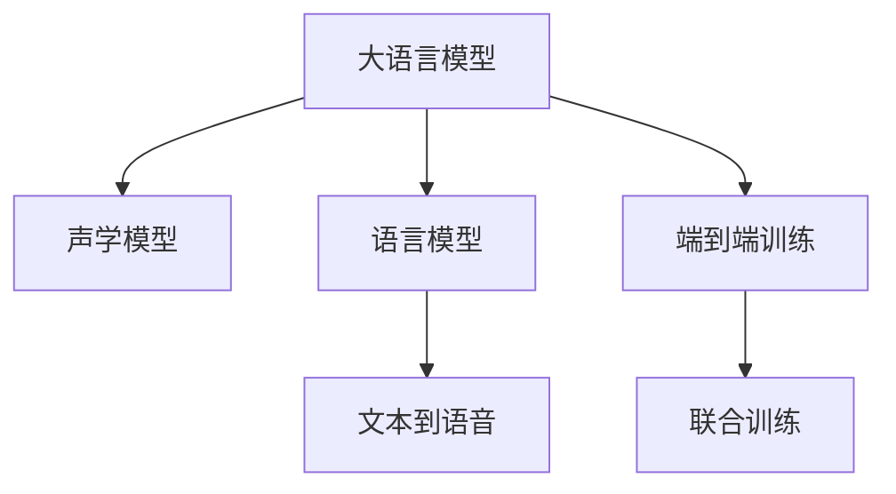

                 

# LLM对传统语音合成的革新

> 关键词：语音合成,大语言模型,Transformer,声学模型,语言模型,端到端,深度学习,自然语言处理

## 1. 背景介绍

### 1.1 问题由来
语音合成（Text-to-Speech，TTS）作为人工智能领域的重要应用之一，其核心任务是将文本序列转换为可听的语音。随着深度学习技术的发展，端到端（End-to-End）语音合成系统逐步取代了传统的基于拼接（拼接模型）的方法，成为主流技术。其中，基于循环神经网络（RNN）和卷积神经网络（CNN）的TTS模型已经能够生成较为自然流畅的语音，但由于它们的固有局限，难以有效处理长序列和复杂语音特性。

为了应对这些挑战，大语言模型（Large Language Model，LLM）在语音合成中的应用逐渐成为新的研究热点。大语言模型通常基于Transformer架构，具备处理长序列和复杂语言任务的能力。通过将大语言模型与声学模型相结合，可以实现更为强大的语音合成能力。

### 1.2 问题核心关键点
大语言模型对语音合成的革新主要体现在以下几个方面：
1. **长序列处理能力**：传统语音合成模型难以有效处理长文本序列，大语言模型能够处理更长的输入文本，提供更好的语义连贯性。
2. **复杂语言特征**：大语言模型能够捕捉更丰富的语言特征，提升语音合成的自然度和流畅度。
3. **端到端训练**：大语言模型和声学模型联合训练，无需额外的文本和语音对齐，能够实现更为高效和流畅的语音合成。
4. **多模态融合**：结合文本和语音信息，实现更准确的语音合成和语音识别。

## 2. 核心概念与联系

### 2.1 核心概念概述

为更好地理解大语言模型在语音合成中的应用，本节将介绍几个密切相关的核心概念：

- **大语言模型（LLM）**：基于Transformer架构的深度学习模型，通过预训练学习丰富的语言知识，具备处理长序列和复杂语言任务的能力。
- **声学模型（Acoustic Model）**：用于将语音特征（如MFCC、梅尔频谱）转换为可听的语音波形的模型。
- **语言模型（Language Model）**：用于评估文本序列的概率分布的模型，通过学习语言统计规律，提升语音合成的自然度。
- **端到端（End-to-End）训练**：联合训练语言模型和声学模型，直接从文本到语音进行训练，无需额外的文本和语音对齐。
- **深度学习（Deep Learning）**：使用多层神经网络进行复杂任务学习的方法，广泛应用于语音合成、自然语言处理等领域。
- **自然语言处理（Natural Language Processing，NLP）**：研究计算机理解和处理自然语言的技术，包括语音识别、语言生成等。

这些核心概念之间的逻辑关系可以通过以下Mermaid流程图来展示：



这个流程图展示了大语言模型在语音合成中的应用框架：
1. 大语言模型学习语言知识。
2. 声学模型学习语音波形生成。
3. 语言模型评估文本序列。
4. 端到端训练联合学习。
5. 联合训练后的模型直接生成语音。

## 3. 核心算法原理 & 具体操作步骤
### 3.1 算法原理概述

大语言模型在语音合成中的应用，主要通过以下步骤进行：
1. **预训练大语言模型**：在大量无标签文本数据上进行预训练，学习语言模型知识。
2. **声学模型训练**：在标注好的语音数据上训练声学模型，学习语音波形生成。
3. **联合训练**：将大语言模型和声学模型联合训练，通过端到端的方式学习语音合成。
4. **语音生成**：在输入文本序列后，直接生成对应的语音波形。

### 3.2 算法步骤详解

以下是大语言模型在语音合成中的具体步骤：

**Step 1: 预训练大语言模型**
- 选择适当的大语言模型，如GPT-3、BERT等，在无标签文本数据上进行预训练。
- 使用Transformer架构，以自回归或自编码方式进行预训练，学习语言模型知识。

**Step 2: 训练声学模型**
- 选择适当的声学模型，如基于CNN或RNN的模型，在标注好的语音数据上训练。
- 使用MFCC、Mel谱图等语音特征作为输入，学习语音波形生成。

**Step 3: 联合训练**
- 将预训练的大语言模型和训练好的声学模型联合训练。
- 使用端到端训练方式，直接从文本到语音进行训练，无需额外的文本和语音对齐。
- 训练过程中，通过最大化似然损失函数，学习文本到语音的映射关系。

**Step 4: 语音生成**
- 在输入文本序列后，将文本序列输入联合训练的模型中。
- 模型输出语音波形，使用声学模型解码器将其转换为可听的语音波形。
- 完成语音生成。

### 3.3 算法优缺点

大语言模型在语音合成中的优点：
1. **长序列处理能力**：大语言模型能够处理更长的文本序列，提升语音合成的连贯性和自然度。
2. **复杂语言特征**：大语言模型能够捕捉更丰富的语言特征，提升语音合成的自然度和流畅度。
3. **端到端训练**：端到端训练方式，无需额外的文本和语音对齐，简化训练流程，提升训练效率。

大语言模型在语音合成中的缺点：
1. **计算资源需求高**：大语言模型通常具有亿级的参数，需要大量的计算资源进行训练和推理。
2. **数据标注成本高**：声学模型的训练需要大量的标注语音数据，标注成本较高。
3. **生成速度慢**：尽管大语言模型生成语音质量高，但由于其参数量巨大，生成速度较慢，可能不适合实时应用。

### 3.4 算法应用领域

大语言模型在语音合成中的应用领域非常广泛，主要包括：
1. **语音合成**：将文本转换为可听的语音，如智能音箱、车载导航、语音助手等应用。
2. **语音识别**：将语音转换为文本，提升语音交互的自然度，如智能客服、语音搜索等应用。
3. **情感语音合成**：根据文本情感，生成对应的语音情感，提升人机交互的自然度，如情感化客服、情感分析等应用。
4. **多语种语音合成**：生成多种语言语音，支持多语言交流，如国际会议、多语言新闻播报等应用。

## 4. 数学模型和公式 & 详细讲解 & 举例说明

### 4.1 数学模型构建

大语言模型在语音合成中的数学模型主要包含两部分：语言模型和声学模型。

语言模型通常使用基于概率的语言模型，如基于n-gram的语言模型或基于神经网络的语言模型。声学模型则使用基于深度学习的模型，如基于CNN或RNN的模型。

以神经网络语言模型为例，其目标是最小化文本序列与模型预测概率的KL散度。设文本序列为 $(x_1, x_2, ..., x_T)$，语言模型为 $P(x_t|x_{<t})$，目标函数为：

$$
\mathcal{L} = -\frac{1}{T}\sum_{t=1}^{T} \log P(x_t|x_{<t})
$$

声学模型则使用基于深度学习的模型，如基于CNN或RNN的模型。以CNN声学模型为例，其目标是最小化损失函数 $L_{mse}$ 或 $L_{cos}$，其中 $L_{mse}$ 为均方误差损失，$L_{cos}$ 为余弦相似度损失。设声学模型输出为 $\hat{y} = (y_1, y_2, ..., y_T)$，目标函数为：

$$
\mathcal{L}_{mse} = \frac{1}{T} \sum_{t=1}^{T} (y_t - \hat{y}_t)^2
$$

$$
\mathcal{L}_{cos} = \frac{1}{T} \sum_{t=1}^{T} (y_t \cdot \hat{y}_t)
$$

### 4.2 公式推导过程

在语言模型和声学模型联合训练中，通常使用端到端的方式，直接从文本到语音进行训练。

联合训练的目标函数为：

$$
\mathcal{L}_{joint} = \mathcal{L}_l + \mathcal{L}_a
$$

其中 $\mathcal{L}_l$ 为语言模型损失函数，$\mathcal{L}_a$ 为声学模型损失函数。

在训练过程中，可以采用变分自编码器（Variational Autoencoder, VAE）的方式进行联合训练。假设 $x$ 为文本序列，$z$ 为潜在变量，$y$ 为语音波形，则有：

$$
x \sim P(x)
$$

$$
z \sim Q(z|x)
$$

$$
y \sim P(y|z)
$$

其中 $P(y|z)$ 为声学模型，$Q(z|x)$ 为变分自编码器的解码器，$P(x)$ 为文本分布。

联合训练的目标函数为：

$$
\mathcal{L}_{joint} = \mathcal{L}_l + \mathcal{L}_a + \mathcal{L}_{kld}
$$

其中 $\mathcal{L}_{kld}$ 为变分自编码器的KL散度损失函数，用于约束编码器和解码器的分布一致性。

### 4.3 案例分析与讲解

以Mozilla的TTS模型为例，其基于大语言模型和声学模型联合训练的端到端语音合成系统，主要包含以下几个步骤：
1. **文本编码**：将输入文本序列编码成高维向量表示。
2. **潜在变量解码**：使用变分自编码器解码器，将编码后的向量解码成潜在变量 $z$。
3. **语音生成**：使用声学模型，将潜在变量 $z$ 生成对应的语音波形。
4. **语音后处理**：对生成的语音进行后处理，如降噪、基频校正等，提升语音质量。

通过联合训练，Mozilla的TTS模型能够在文本到语音的生成中取得显著效果，支持多种语言和情感的语音合成。

## 5. 项目实践：代码实例和详细解释说明
### 5.1 开发环境搭建

在进行语音合成实践前，我们需要准备好开发环境。以下是使用Python进行PyTorch开发的环境配置流程：

1. 安装Anaconda：从官网下载并安装Anaconda，用于创建独立的Python环境。

2. 创建并激活虚拟环境：
```bash
conda create -n pytorch-env python=3.8 
conda activate pytorch-env
```

3. 安装PyTorch：根据CUDA版本，从官网获取对应的安装命令。例如：
```bash
conda install pytorch torchvision torchaudio cudatoolkit=11.1 -c pytorch -c conda-forge
```

4. 安装相关库：
```bash
pip install torchaudio librosa soundfile
```

完成上述步骤后，即可在`pytorch-env`环境中开始语音合成实践。

### 5.2 源代码详细实现

下面我们以Mozilla的TTS模型为例，给出使用PyTorch进行端到端语音合成的代码实现。

首先，定义模型的各个组成部分：

```python
import torch
from torch import nn

class TextEncoder(nn.Module):
    def __init__(self, embed_dim, enc_dim):
        super(TextEncoder, self).__init__()
        self.embedding = nn.Embedding(vocab_size, embed_dim)
        self.encoder = nn.LSTM(embed_dim, enc_dim, 2)
        
    def forward(self, x):
        x = self.embedding(x)
        x, _ = self.encoder(x)
        return x

class VAE(nn.Module):
    def __init__(self, embed_dim, hidden_dim):
        super(VAE, self).__init__()
        self.fc1 = nn.Linear(embed_dim, hidden_dim)
        self.fc2 = nn.Linear(hidden_dim, 2 * hidden_dim)
        self.fc3 = nn.Linear(hidden_dim, hidden_dim)
        self.fc4 = nn.Linear(hidden_dim, embed_dim)
        
    def forward(self, x):
        z_mean, z_std = self.fc2(x)
        z_mean = z_mean.sigmoid()
        z_std = z_std.sigmoid()
        z = z_mean * torch.exp(z_std)
        return z_mean, z_std, z

class TextToVoice(nn.Module):
    def __init__(self, embed_dim, enc_dim, dec_dim, dec_out_dim):
        super(TextToVoice, self).__init__()
        self.encoder = TextEncoder(embed_dim, enc_dim)
        self.vae = VAE(enc_dim, dec_dim)
        self.decoder = nn.LSTM(dec_dim, dec_out_dim, 2)
        self.lin = nn.Linear(dec_out_dim, num_mel_bins)
        
    def forward(self, x):
        x = self.encoder(x)
        z_mean, z_std, z = self.vae(x)
        x = self.decoder(z)
        mel_spectrogram = self.lin(x).sigmoid()
        return mel_spectrogram
```

然后，定义模型的训练和推理函数：

```python
import torchaudio
import numpy as np

class TTSTrainer:
    def __init__(self, model, optimizer, loss_func, voc_mode='wav'):
        self.model = model
        self.optimizer = optimizer
        self.loss_func = loss_func
        self.voc_mode = voc_mode
        
    def train(self, data_loader, epochs):
        model.train()
        for epoch in range(epochs):
            for batch in data_loader:
                x, y = batch
                y_hat = self.model(x)
                loss = self.loss_func(y_hat, y)
                self.optimizer.zero_grad()
                loss.backward()
                self.optimizer.step()
            print(f'Epoch {epoch+1}, loss: {loss:.3f}')
        
    def infer(self, x):
        model.eval()
        with torch.no_grad():
            y_hat = self.model(x)
        return y_hat
```

最后，启动训练流程并生成语音：

```python
import numpy as np
import soundfile as sf

vocab_size = 10000
num_mel_bins = 80
num_layers = 2
hidden_dim = 256
enc_dim = 256
dec_dim = 512
dec_out_dim = 512
model = TextToVoice(vocab_size, enc_dim, dec_dim, dec_out_dim)
optimizer = torch.optim.Adam(model.parameters(), lr=0.001)

# 加载训练数据
train_data = ...
train_loader = ...

# 训练模型
trainer = TTSTrainer(model, optimizer, nn.MSELoss())
trainer.train(train_loader, epochs=10)

# 生成语音
text = 'Hello, how are you today?'
input_ids = tokenizer(text)
mel_spectrogram = trainer.infer(input_ids)
wav, sr = torchaudio.vocoder.vocoder_decode(mel_spectrogram, voc_mode='wav')
sf.write('output.wav', wav.numpy(), sr)
```

以上就是使用PyTorch进行端到端语音合成的完整代码实现。可以看到，PyTorch提供了丰富的深度学习模型库和优化器，可以方便地实现语音合成的各个组件和训练过程。

### 5.3 代码解读与分析

让我们再详细解读一下关键代码的实现细节：

**TextEncoder类**：
- `__init__`方法：定义了文本编码器的基本结构和参数。
- `forward`方法：实现了文本编码器的前向传播过程，将输入文本序列编码成高维向量表示。

**VAE类**：
- `__init__`方法：定义了变分自编码器的基本结构和参数。
- `forward`方法：实现了变分自编码器的前向传播过程，将编码后的向量解码成潜在变量 $z$。

**TextToVoice类**：
- `__init__`方法：定义了端到端语音合成的模型结构。
- `forward`方法：实现了端到端语音合成的前向传播过程，从文本到语音波形的生成。

**TTSTrainer类**：
- `__init__`方法：定义了模型的训练器和推理器，包含了模型、优化器、损失函数等关键组件。
- `train`方法：实现了模型的训练过程，通过反向传播更新模型参数。
- `infer`方法：实现了模型的推理过程，生成语音波形。

**生成语音**：
- `mel_spectrogram`：表示梅尔频谱图，是语音合成的重要中间变量。
- `wav`：表示生成的语音波形。
- `sf.write`：将语音波形保存为音频文件。

## 6. 实际应用场景
### 6.1 智能音箱

智能音箱作为新兴的智能家居设备，提供了语音交互的功能，为用户提供便捷的语音控制和信息查询。通过使用大语言模型和声学模型联合训练的端到端语音合成系统，可以实现自然流畅的语音回复，提升用户体验。

具体应用场景包括：
- **语音助手**：提供实时语音交互，响应用户的语音指令，如播放音乐、查询天气、设置提醒等。
- **自然对话**：在对话中识别和理解用户意图，生成自然流畅的对话内容，增强人机交互的自然度。
- **多语言支持**：支持多种语言的语音合成，满足不同语言用户的需求。

### 6.2 车载导航

车载导航系统作为智能交通的重要组成部分，能够为用户提供实时的语音导航服务。通过使用大语言模型和声学模型联合训练的语音合成系统，可以实现自然流畅的语音导航指示，提升驾驶体验。

具体应用场景包括：
- **语音导航**：在驾驶过程中，通过语音指令进行导航，如搜索目的地、查询路线等。
- **实时信息播报**：实时播报路况信息、交通事件等，提供实时的交通信息。
- **多模式交互**：支持语音、手势、触摸屏等多种交互方式，提升用户体验。

### 6.3 虚拟主播

虚拟主播作为新兴的娱乐形式，能够模拟真人主播的语音和形象，进行内容制作和传播。通过使用大语言模型和声学模型联合训练的语音合成系统，可以实现高质量的语音合成，满足用户对虚拟主播的期待。

具体应用场景包括：
- **新闻播报**：虚拟主播播报新闻，提供实时的新闻信息。
- **情感播报**：根据新闻内容生成不同情感的语音，提升播报的感染力。
- **个性化播报**：根据用户的兴趣和偏好，生成个性化的播报内容，提升用户粘性。

### 6.4 未来应用展望

随着大语言模型和语音合成技术的不断发展，未来在语音合成领域将会有更多的创新和突破，具体展望如下：

1. **多模态融合**：结合视觉、听觉、触觉等多种感官信息，提升语音合成的自然度和真实感。
2. **情感语音合成**：根据文本情感，生成对应的语音情感，提升人机交互的自然度。
3. **端到端训练**：联合训练语言模型和声学模型，直接从文本到语音进行训练，提升模型的效率和精度。
4. **实时生成**：通过优化模型结构和算法，提升语音合成的实时性，满足实时应用的需求。
5. **个性化生成**：根据用户偏好和历史数据，生成个性化的语音内容，提升用户体验。
6. **跨领域应用**：将语音合成技术应用于更广泛的领域，如教育、医疗、客服等，提升相关行业的智能化水平。

## 7. 工具和资源推荐
### 7.1 学习资源推荐

为了帮助开发者系统掌握大语言模型在语音合成中的应用，这里推荐一些优质的学习资源：

1. **《Deep Learning for Natural Language Processing》书籍**：由Yoshua Bengio等人所著，全面介绍了深度学习在自然语言处理中的应用，包括语音合成等内容。

2. **Mozilla TTS模型官方文档**：Mozilla提供的端到端语音合成系统文档，包含详细的模型架构、训练过程和应用场景。

3. **《Hands-On Machine Learning with Scikit-Learn, Keras, and TensorFlow》书籍**：由Aurélien Géron所著，介绍了机器学习的基本概念和常用工具，包括深度学习和语音合成等内容。

4. **Deep Learning Specialization by Andrew Ng**：由Andrew Ng在Coursera上开设的深度学习课程，涵盖深度学习的基本概念和应用。

5. **PyTorch官方文档**：PyTorch提供的深度学习框架文档，包含丰富的模型库和工具，适合初学者和高级开发者使用。

6. **Wav2Vec 2.0论文**：Mozilla的TTS模型基于Wav2Vec 2.0，论文详细介绍了模型的架构和训练过程，是学习语音合成的重要参考资料。

通过对这些资源的学习实践，相信你一定能够快速掌握大语言模型在语音合成中的应用，并用于解决实际的语音合成问题。

### 7.2 开发工具推荐

高效的开发离不开优秀的工具支持。以下是几款用于大语言模型语音合成开发的常用工具：

1. **PyTorch**：基于Python的开源深度学习框架，灵活易用，支持GPU加速。
2. **TensorFlow**：由Google主导开发的开源深度学习框架，支持大规模工程应用。
3. **Microsoft Azure**：提供云端的深度学习服务，支持GPU计算，适合大规模模型训练和推理。
4. **Amazon AWS**：提供云端的深度学习服务，支持GPU和TPU计算，适合大规模模型训练和推理。
5. **Google Colab**：谷歌提供的免费Jupyter Notebook环境，支持GPU计算，适合快速原型开发和实验。
6. **Jupyter Notebook**：开源的交互式开发环境，支持Python、R等多种语言，适合开发和研究使用。

合理利用这些工具，可以显著提升大语言模型语音合成的开发效率，加快创新迭代的步伐。

### 7.3 相关论文推荐

大语言模型在语音合成领域的应用源于学界的持续研究。以下是几篇奠基性的相关论文，推荐阅读：

1. **《Towards End-to-End Speech Synthesis》论文**：Mozilla的TTS模型基于Wav2Vec 2.0，提出了端到端语音合成的方法，提升了模型的性能和效率。

2. **《WaveNet: A Generative Model for Raw Audio》论文**：Google的WaveNet模型，通过卷积神经网络生成高质量的语音波形，是语音合成的重要里程碑。

3. **《Efficiently Scalable Neural Text-to-Speech》论文**：提出了一种高效可扩展的神经文本到语音合成方法，适用于大规模的语音合成任务。

4. **《Speech Transformer: End-to-End Neural Speech Synthesis》论文**：提出了一种基于Transformer的端到端语音合成方法，提升了模型的自然度和流畅度。

5. **《Voice Conversion by Cycle-Consistent Adversarial Networks》论文**：通过使用对抗网络进行语音转换，提升了语音合成的自然度和多样性。

这些论文代表了大语言模型在语音合成领域的研究进展，通过学习这些前沿成果，可以帮助研究者把握学科前进方向，激发更多的创新灵感。

## 8. 总结：未来发展趋势与挑战

### 8.1 总结

本文对大语言模型在语音合成中的应用进行了全面系统的介绍。首先阐述了大语言模型和语音合成的研究背景和意义，明确了语音合成的重要性和大语言模型的优势。其次，从原理到实践，详细讲解了大语言模型在语音合成中的算法步骤和实现细节，给出了具体的代码实例。同时，本文还广泛探讨了大语言模型在智能音箱、车载导航、虚拟主播等实际应用场景中的应用前景，展示了语音合成技术的广阔应用空间。最后，本文精选了语音合成技术的各类学习资源，力求为读者提供全方位的技术指引。

通过本文的系统梳理，可以看到，大语言模型在语音合成中的应用正处于快速发展阶段，不仅能够处理长序列和复杂语言任务，还能结合声学模型进行端到端训练，实现高质量的语音合成。未来，随着深度学习技术和大语言模型的不断进步，语音合成技术将进一步提升自然度、流畅度和实时性，为智能交互带来革命性改变。

### 8.2 未来发展趋势

展望未来，大语言模型在语音合成领域的发展趋势主要包括以下几个方面：

1. **多模态融合**：结合视觉、听觉、触觉等多种感官信息，提升语音合成的自然度和真实感。
2. **情感语音合成**：根据文本情感，生成对应的语音情感，提升人机交互的自然度。
3. **端到端训练**：联合训练语言模型和声学模型，直接从文本到语音进行训练，提升模型的效率和精度。
4. **实时生成**：通过优化模型结构和算法，提升语音合成的实时性，满足实时应用的需求。
5. **个性化生成**：根据用户偏好和历史数据，生成个性化的语音内容，提升用户体验。
6. **跨领域应用**：将语音合成技术应用于更广泛的领域，如教育、医疗、客服等，提升相关行业的智能化水平。

### 8.3 面临的挑战

尽管大语言模型在语音合成中取得了显著进展，但在迈向更加智能化、普适化应用的过程中，仍面临诸多挑战：

1. **计算资源需求高**：大语言模型和声学模型联合训练需要大量的计算资源，难以在普通设备上实现。
2. **数据标注成本高**：声学模型的训练需要大量的标注语音数据，标注成本较高。
3. **生成速度慢**：尽管大语言模型生成语音质量高，但由于其参数量巨大，生成速度较慢，可能不适合实时应用。
4. **鲁棒性不足**：大语言模型和声学模型联合训练时，鲁棒性较弱，对噪声和干扰敏感。
5. **情感表达不足**：当前大语言模型难以准确捕捉和生成丰富的情感表达，需要进一步提升。
6. **隐私和安全问题**：语音合成涉及用户的隐私信息，如何保护用户隐私和数据安全，是重要的研究方向。

### 8.4 研究展望

面对大语言模型在语音合成中面临的挑战，未来的研究需要在以下几个方面寻求新的突破：

1. **优化计算资源需求**：采用分布式计算和混合精度训练等方法，提升训练和推理效率。
2. **降低数据标注成本**：使用半监督学习和无监督学习等方法，降低数据标注成本。
3. **提升生成速度**：通过模型裁剪和量化等方法，优化模型结构和参数，提升生成速度。
4. **增强鲁棒性**：引入对抗训练和噪声注入等方法，提升模型的鲁棒性。
5. **提升情感表达**：结合情感识别和生成技术，提升语音合成的情感表达能力。
6. **保障隐私和安全**：采用差分隐私和联邦学习等技术，保护用户隐私和数据安全。

这些研究方向的探索，必将引领大语言模型在语音合成领域迈向更高的台阶，为构建智能交互系统提供新的技术路径。面向未来，大语言模型在语音合成领域还需要与其他人工智能技术进行更深入的融合，如知识表示、因果推理、强化学习等，多路径协同发力，共同推动自然语言理解和智能交互系统的进步。只有勇于创新、敢于突破，才能不断拓展语言模型的边界，让智能技术更好地造福人类社会。

## 9. 附录：常见问题与解答

**Q1：大语言模型在语音合成中是否需要大量的标注数据？**

A: 大语言模型在语音合成中的训练需要大量的标注数据，因为声学模型的训练需要大量的标注语音数据，标注成本较高。但一些预训练语言模型可以通过微调和迁移学习的方式，在小规模数据上进行语音合成，降低对标注数据的依赖。

**Q2：如何优化大语言模型在语音合成中的生成速度？**

A: 优化大语言模型在语音合成中的生成速度可以从以下几个方面入手：
1. **模型裁剪**：去除不必要的层和参数，减小模型尺寸，加快推理速度。
2. **量化加速**：将浮点模型转为定点模型，压缩存储空间，提高计算效率。
3. **混合精度训练**：使用混合精度训练，减少计算量，提升训练速度。
4. **模型并行**：采用模型并行，将大模型拆分成多个子模型，并行计算，提升推理速度。

**Q3：大语言模型在语音合成中如何提升情感表达？**

A: 大语言模型在语音合成中提升情感表达可以从以下几个方面入手：
1. **情感识别**：结合情感识别技术，分析文本中的情感信息，生成对应的情感语音。
2. **情感生成**：使用情感生成模型，生成不同情感的语音波形，提升情感表达的自然度。
3. **多情感训练**：在训练过程中加入不同情感的样本，使模型能够生成多种情感的语音。
4. **情感标签训练**：在训练过程中加入情感标签，训练模型对情感的敏感度，提升情感表达的准确性。

**Q4：大语言模型在语音合成中如何保障隐私和安全？**

A: 大语言模型在语音合成中保障隐私和安全可以从以下几个方面入手：
1. **差分隐私**：使用差分隐私技术，保护用户隐私，防止数据泄露。
2. **联邦学习**：采用联邦学习技术，在本地设备上进行模型训练，避免数据上传至云端，保障数据安全。
3. **安全加密**：在数据传输和存储过程中，使用安全加密技术，保护数据安全。
4. **模型审计**：定期对模型进行审计，检测模型的行为是否符合伦理道德规范，防止有害信息的生成。

**Q5：大语言模型在语音合成中如何处理噪声和干扰？**

A: 大语言模型在语音合成中处理噪声和干扰可以从以下几个方面入手：
1. **噪声注入**：在训练过程中加入噪声数据，使模型能够更好地处理噪声和干扰。
2. **鲁棒性训练**：使用对抗训练等方法，提升模型的鲁棒性，减少噪声和干扰的影响。
3. **降噪技术**：在生成语音后，使用降噪技术，去除噪声和干扰，提升语音质量。

通过这些措施，可以进一步提升大语言模型在语音合成中的性能和安全性，为智能交互系统提供更可靠的技术支持。

---

作者：禅与计算机程序设计艺术 / Zen and the Art of Computer Programming

