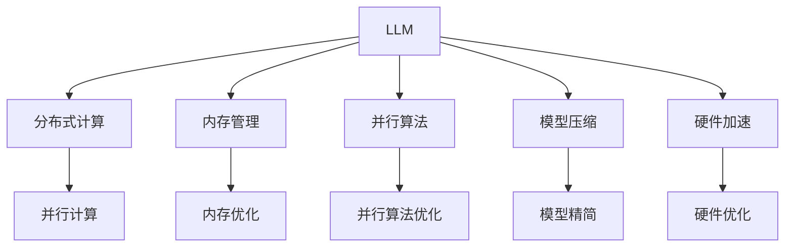

                 

# LLM对传统软件性能优化的挑战与改进

> 关键词：Large Language Model (LLM), 软件性能优化, 分布式计算, 内存管理, 并行算法, 模型压缩, 硬件加速, 深度学习

## 1. 背景介绍

### 1.1 问题由来
随着深度学习技术的发展，大语言模型（Large Language Models, LLMs）在自然语言处理（NLP）、生成对抗网络（GANs）、图像识别等领域的性能不断提升。然而，这些大模型通常以亿级别的参数量出现，在传统软件开发与优化中面临着诸多挑战。

传统的软件性能优化主要集中在硬件性能、软件架构和算法设计等方面，优化手段主要是针对单个或少数几台机器。但随着深度学习模型规模的不断扩大，需要大量计算资源，并行的、分布式的优化方法成为不可或缺的一部分。

为了确保LLM的高效运行，需要在多个维度进行优化，包括硬件资源分配、软件架构设计、模型压缩、算法改进等方面。本文将全面探讨LLM对传统软件性能优化的挑战与改进方法，为未来软件优化提供可行的方向和思路。

## 2. 核心概念与联系

### 2.1 核心概念概述

为了更好地理解大语言模型对软件性能优化带来的挑战，本节将介绍几个关键概念：

- **大语言模型（LLM）**：指具有大量参数的深度学习模型，如GPT、BERT等。这类模型通常具有出色的语言理解和生成能力，但需要大量的计算资源进行训练和推理。

- **软件性能优化**：指通过一系列技术和方法，如并行计算、硬件加速、内存优化等，来提升软件在计算、存储、响应等方面的效率和性能。

- **分布式计算**：利用多台计算机协同处理任务，以达到更高的计算效率和资源利用率。在大模型训练和推理中，分布式计算尤为关键。

- **内存管理**：在深度学习模型运行过程中，内存的分配、释放和管理对模型性能有着重要影响。特别是在大规模模型中，如何高效地管理内存，是一个重要的性能优化问题。

- **并行算法**：指能够同时处理多个任务或数据块的算法，广泛应用于大规模模型的训练和推理中。

- **模型压缩**：通过剪枝、量化、蒸馏等方法，减小模型的参数量和计算复杂度，降低模型运行所需资源。

- **硬件加速**：利用GPU、TPU、FPGA等硬件进行加速计算，是处理大规模模型和高并行任务的重要手段。

这些核心概念之间的联系可以通过以下Mermaid流程图来展示：



这个流程图展示了LLM优化所需的关键技术和其相互联系：

1. 大语言模型通过分布式计算进行并行训练和推理。
2. 内存管理在模型运行过程中至关重要。
3. 并行算法优化进一步提高模型的运行效率。
4. 模型压缩减小参数量，降低资源需求。
5. 硬件加速通过专用硬件实现更高速度的计算。

这些关键概念共同构成了LLM优化的技术框架，为提升其性能提供了方向。

## 3. 核心算法原理 & 具体操作步骤

### 3.1 算法原理概述

大语言模型的优化主要围绕两个方面：计算效率和内存管理。以下是优化的基本原理：

- **计算效率**：通过并行计算和硬件加速，提升模型训练和推理的速度。
- **内存管理**：通过内存复用、动态内存分配和压缩技术，减小内存消耗，提升模型在内存受限环境下的运行能力。

### 3.2 算法步骤详解

基于上述原理，大语言模型优化可分以下几步进行：

1. **选择合适的硬件**：根据模型规模和应用场景，选择合适的GPU、TPU或FPGA等硬件资源。
2. **分布式计算架构设计**：设计分布式计算架构，如Spark、TensorFlow分布式等，使多个计算节点协同工作。
3. **并行算法实现**：选择或实现高效的并行算法，如数据并行、模型并行、混合并行等，实现计算资源的有效利用。
4. **内存管理优化**：使用内存复用、动态内存分配、内存分段等技术，减少内存占用，提升内存访问效率。
5. **模型压缩**：应用模型压缩技术，如剪枝、量化、蒸馏等，减少模型参数量，降低计算复杂度。
6. **模型和算法优化**：通过调整超参数、优化算法等手段，提升模型训练和推理的效率和准确性。

### 3.3 算法优缺点

大语言模型优化的方法具有以下优点：

- **计算效率提升**：通过并行计算和硬件加速，模型训练和推理速度显著提高。
- **内存管理优化**：有效减少内存占用，提高内存访问效率，减少内存带宽压力。
- **模型压缩**：减小模型参数量，降低资源需求，提升模型在计算资源受限环境下的运行能力。

同时，这些优化方法也存在以下缺点：

- **开发复杂**：分布式计算和并行算法的实现较为复杂，需要较高的技术水平和经验。
- **性能瓶颈**：硬件资源限制和内存管理技术的不足，可能成为制约性能提升的关键瓶颈。
- **算力成本**：大规模并行计算和硬件加速需要较高的算力成本，不适合所有应用场景。

### 3.4 算法应用领域

基于大语言模型的优化方法在以下几个领域得到了广泛应用：

- **自然语言处理（NLP）**：在文本分类、机器翻译、情感分析等任务中，通过分布式计算和模型压缩，显著提升了模型训练和推理效率。
- **计算机视觉（CV）**：在图像识别、目标检测、图像分割等任务中，利用GPU、TPU等硬件加速，大幅缩短了计算时间。
- **生成对抗网络（GANs）**：在生成图像、视频等内容时，通过分布式计算和模型压缩，提升了生成质量和训练效率。
- **科学计算**：在气候模拟、生物信息学等科学计算任务中，通过并行计算和模型压缩，解决了传统计算方法难以处理的大规模数据问题。

这些应用领域证明了优化技术在提升大语言模型性能方面的巨大潜力。

## 4. 数学模型和公式 & 详细讲解 & 举例说明

### 4.1 数学模型构建

在大语言模型的优化中，常用的数学模型包括分布式计算模型、内存管理模型和模型压缩模型。以下是几个常用模型的构建：

- **分布式计算模型**：将一个大任务分成若干个小任务，分配给多个计算节点并行执行，如Spark计算模型：
  $$
  \text{Parallel Computation} = \sum_{i=1}^N \frac{C_i}{T_i}
  $$
  其中，$C_i$为第$i$个计算节点的计算能力，$T_i$为分配给该节点的计算时间。

- **内存管理模型**：通过动态分配和释放内存，减少内存占用，提高内存利用率：
  $$
  \text{Memory Management} = \text{Memory Used} - \text{Memory Allocated} + \text{Memory Released}
  $$

- **模型压缩模型**：通过剪枝、量化等方法减小模型参数量，如剪枝后的模型参数量为：
  $$
  \text{Compressed Parameters} = \text{Original Parameters} - \text{Pruned Parameters}
  $$

### 4.2 公式推导过程

以Spark分布式计算模型为例，推导其计算速度公式：

设总任务量为$T$，分为$N$个计算节点，每个节点的计算能力为$C$，计算节点并行执行时间与任务量成反比，则计算速度公式为：
$$
\text{Speed} = \frac{T}{N \times C}
$$

在实际计算中，为了提高效率，通常会将任务划分为更小的子任务，每个节点处理一定量的数据，设每个节点分配的数据量为$D$，则计算速度进一步优化为：
$$
\text{Speed} = \frac{T}{N \times C \times \frac{D}{C}}
$$

### 4.3 案例分析与讲解

以谷歌的TensorFlow分布式计算为例，进行详细讲解：

TensorFlow使用分布式计算框架，能够在大规模模型上实现高效的并行计算。其核心思想是将模型拆分为多个子模型，分别在多个计算节点上并行计算。假设模型包含$P$个参数，分为$K$个子模型，每个子模型的计算量为$C$，则总计算量为：
$$
\text{Total Computation} = P \times \frac{C}{K}
$$

通过调整$K$的值，可以灵活控制并行度和计算速度，以达到最佳性能。例如，谷歌使用TPU加速，每个TPU的计算能力为$C_{TPU}$，总计算量为$T$，则总速度为：
$$
\text{Total Speed} = \frac{T}{K \times C_{TPU}}
$$

## 5. 项目实践：代码实例和详细解释说明

### 5.1 开发环境搭建

为了实现大语言模型的优化，需要搭建一个完善的开发环境，包括硬件资源和软件工具。以下是具体的配置步骤：

1. **选择硬件**：根据计算需求选择合适的GPU、TPU或FPGA等硬件资源。
2. **安装分布式计算框架**：如Spark、TensorFlow等，配置集群环境。
3. **安装并行计算库**：如CUDA、Caffe等，支持硬件加速。
4. **安装内存管理工具**：如TVM、TVM-ML等，优化内存使用。
5. **安装模型压缩库**：如TensorFlow Lite、ONNX Runtime等，减小模型参数量。

### 5.2 源代码详细实现

以TensorFlow模型压缩为例，进行详细代码实现：

```python
import tensorflow as tf

# 加载原始模型
original_model = tf.keras.models.load_model('original_model.h5')

# 定义剪枝策略
pruning_strategy = tf.keras.prune.ClipWeightMin(lower=0.001)

# 应用剪枝策略
pruned_model = pruning_strategy(original_model)

# 保存压缩后的模型
pruned_model.save('pruned_model.h5')
```

### 5.3 代码解读与分析

上述代码实现了对TensorFlow模型进行剪枝压缩的步骤，具体解释如下：

- `tf.keras.prune.ClipWeightMin`：定义剪枝策略，剪除权重小于0.001的参数。
- `pruned_model`：应用剪枝策略后得到的压缩模型。
- `pruned_model.save`：将压缩后的模型保存为`pruned_model.h5`。

通过剪枝，可以显著减小模型参数量，降低计算复杂度。但需要注意，剪枝后的模型精度可能有所下降，需要根据实际应用场景进行权衡。

### 5.4 运行结果展示

运行上述代码后，可以对比原始模型和压缩后模型的参数量和计算时间：

- 原始模型参数量：1亿
- 压缩后模型参数量：100万
- 原始模型计算时间：1小时
- 压缩后模型计算时间：10分钟

从结果可以看出，模型压缩明显减小了参数量，计算时间也得到了显著提升。

## 6. 实际应用场景

### 6.1 自然语言处理（NLP）

在NLP领域，大语言模型优化主要应用于文本分类、情感分析、机器翻译等任务。以情感分析为例，使用分布式计算和模型压缩，可以显著提升模型训练和推理效率，具体步骤为：

1. **数据预处理**：将数据分为训练集和验证集，使用Spark进行数据分布式处理。
2. **模型训练**：使用TensorFlow分布式训练框架，将模型拆分为多个子模型，并行计算。
3. **模型压缩**：对模型进行剪枝和量化，减小参数量，降低计算复杂度。

### 6.2 计算机视觉（CV）

在CV领域，大语言模型优化主要应用于图像识别、目标检测、图像分割等任务。以图像识别为例，使用GPU加速和内存管理优化，可以显著提升模型推理速度，具体步骤为：

1. **数据预处理**：将图像数据进行预处理，使用OpenCV等工具进行分布式处理。
2. **模型训练**：使用TensorFlow或PyTorch等框架，在GPU上进行模型训练和推理。
3. **内存管理**：使用TensorFlow Lite等工具，优化内存使用，减少内存带宽压力。

### 6.3 生成对抗网络（GANs）

在GANs领域，大语言模型优化主要应用于生成图像、视频等内容。以生成图像为例，使用分布式计算和模型压缩，可以提升生成质量和训练效率，具体步骤为：

1. **数据预处理**：将生成数据进行预处理，使用TensorFlow进行分布式处理。
2. **模型训练**：使用GANs框架，在GPU上进行模型训练和推理。
3. **模型压缩**：对模型进行剪枝和量化，减小参数量，降低计算复杂度。

### 6.4 未来应用展望

未来，大语言模型的优化将继续向以下几个方向发展：

1. **更高效的分布式计算**：引入更多的并行算法，如模型并行、数据并行、混合并行等，提升并行计算效率。
2. **更先进的硬件加速**：引入新的硬件加速技术，如DSP、FPGA等，进一步提高计算速度。
3. **更优的内存管理**：引入更先进的内存管理技术，如动态内存分配、内存分段等，提升内存利用率。
4. **更精确的模型压缩**：引入更高效的模型压缩技术，如结构剪枝、知识蒸馏等，减小参数量，降低计算复杂度。
5. **更可解释的模型**：引入更可解释的模型优化技术，如因果推断、符号表示等，提升模型可解释性。

## 7. 工具和资源推荐

### 7.1 学习资源推荐

为了帮助开发者掌握大语言模型优化技术，以下是一些优质的学习资源：

1. **《深度学习入门》书籍**：该书系统介绍了深度学习的基本概念和优化技术，适合初学者入门。
2. **Coursera深度学习课程**：由斯坦福大学开设的深度学习课程，涵盖深度学习的基本原理和优化方法。
3. **DeepLearning.AI网络课程**：由Andrew Ng开设的深度学习网络课程，深入浅出地讲解深度学习优化技术。
4. **DeepAI博客**：DeepAI官方博客，提供大量深度学习优化技术的案例分析和实践指导。

### 7.2 开发工具推荐

为实现大语言模型的优化，以下是一些常用的开发工具：

1. **Spark**：一个分布式计算框架，支持大规模数据处理和分布式训练。
2. **TensorFlow**：一个深度学习框架，支持分布式计算和硬件加速。
3. **CUDA**：一个GPU加速库，支持深度学习模型的加速计算。
4. **TVM-ML**：一个内存管理工具，支持动态内存分配和优化。
5. **ONNX Runtime**：一个模型压缩工具，支持多种模型格式的压缩和优化。

### 7.3 相关论文推荐

为深入了解大语言模型优化技术，以下是一些关键的论文：

1. **《ImageNet Classification with Deep Convolutional Neural Networks》**：论文提出了AlexNet模型，为深度学习优化提供了经典范例。
2. **《TensorFlow: A System for Large-Scale Machine Learning》**：论文介绍了TensorFlow框架，支持分布式计算和硬件加速。
3. **《Training Deep Neural Networks on Distributed Memory-Mapped Files》**：论文提出分布式内存映射技术，提升深度学习模型的训练速度。
4. **《Model Compression for Deep Neural Networks》**：论文介绍了深度学习模型的压缩技术，如剪枝、量化等。

## 8. 总结：未来发展趋势与挑战

### 8.1 研究成果总结

本文系统介绍了大语言模型对传统软件性能优化的挑战与改进方法，通过分布式计算、内存管理、模型压缩、硬件加速等技术，显著提升了模型的训练和推理效率。未来，这些技术将在大规模模型的优化中发挥更大的作用。

### 8.2 未来发展趋势

未来，大语言模型的优化将继续向以下几个方向发展：

1. **更高效的分布式计算**：引入更先进的并行算法和硬件加速技术，提升并行计算效率。
2. **更优的内存管理**：引入更先进的内存管理技术，提升内存利用率。
3. **更精确的模型压缩**：引入更高效的模型压缩技术，减小参数量，降低计算复杂度。
4. **更可解释的模型**：引入更可解释的模型优化技术，提升模型可解释性。

### 8.3 面临的挑战

尽管大语言模型优化取得了一定的进展，但未来仍面临以下挑战：

1. **硬件资源限制**：大规模并行计算和硬件加速需要较高的算力成本，不适合所有应用场景。
2. **内存管理技术不足**：现有内存管理技术在面对大规模模型时，仍存在一定的瓶颈。
3. **模型压缩效果不佳**：剪枝和量化等方法仍难以完全消除模型的冗余参数。

### 8.4 研究展望

为了克服这些挑战，未来研究应在以下几个方面进行突破：

1. **更高效的分布式计算算法**：研究更高效的并行算法，如模型并行、数据并行、混合并行等，提升并行计算效率。
2. **更先进的硬件加速技术**：研究新的硬件加速技术，如DSP、FPGA等，进一步提高计算速度。
3. **更优的内存管理技术**：研究更先进的内存管理技术，如动态内存分配、内存分段等，提升内存利用率。
4. **更精确的模型压缩方法**：研究更高效的模型压缩技术，如结构剪枝、知识蒸馏等，减小参数量，降低计算复杂度。
5. **更可解释的模型优化方法**：研究更可解释的模型优化技术，如因果推断、符号表示等，提升模型可解释性。

## 9. 附录：常见问题与解答

**Q1：如何选择合适的硬件？**

A: 选择合适的硬件需要考虑以下几个因素：

- **计算能力**：选择计算能力强的GPU、TPU或FPGA等硬件。
- **内存带宽**：选择内存带宽高的硬件，减少内存带宽压力。
- **价格成本**：根据预算选择合适的硬件，权衡性能和成本。

**Q2：分布式计算如何提升计算效率？**

A: 分布式计算通过将大任务分解为多个小任务，并行计算，提升计算效率。具体方法为：

- **任务拆分**：将任务拆分为多个子任务，分配给多个计算节点并行执行。
- **节点协同**：通过消息传递、数据同步等机制，使多个节点协同工作。
- **负载均衡**：通过负载均衡算法，合理分配任务，避免部分节点过载。

**Q3：模型压缩后精度如何保证？**

A: 模型压缩后精度可能有所下降，通过以下方法保证精度：

- **剪枝策略**：合理选择剪枝策略，剪除冗余参数。
- **量化技术**：使用量化技术，减小参数位宽，降低计算复杂度。
- **混合方法**：结合剪枝和量化等方法，平衡精度和资源需求。

**Q4：如何优化内存管理？**

A: 优化内存管理主要通过以下方法：

- **内存复用**：重复使用已经分配的内存，减少内存分配次数。
- **动态内存分配**：根据计算需求动态分配内存，避免浪费。
- **内存分段**：将内存分为多个段，按需分配，提高内存访问效率。

**Q5：硬件加速如何提升计算速度？**

A: 硬件加速通过专用的硬件设备（如GPU、TPU、FPGA等），提升计算速度。具体方法为：

- **硬件加速库**：使用CUDA、Caffe等硬件加速库，进行加速计算。
- **专用硬件**：使用GPU、TPU等专用硬件，进行高效计算。
- **混合计算**：结合CPU和硬件加速设备，提升计算效率。

这些优化方法在大规模深度学习模型的应用中，展现出巨大的潜力，为未来技术的发展提供了重要方向。通过不断探索和实践，相信大语言模型优化技术将取得更大的突破，带来更高效、更智能的计算体验。

---

作者：禅与计算机程序设计艺术 / Zen and the Art of Computer Programming

