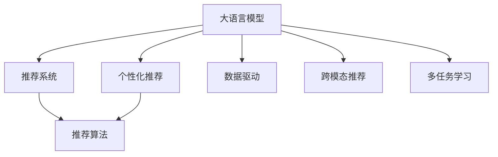

                 

# LLM对推荐系统商业模式的影响

> 关键词：大语言模型, 推荐系统, 商业模式, 个性化推荐, 推荐算法, 数据驱动, 机器学习

## 1. 背景介绍

### 1.1 问题由来

在数字经济时代，推荐系统已成为各大电商、社交、视频等平台的核心竞争力之一。推荐算法不仅能提升用户体验，还能显著增加平台收益。但传统的推荐系统多依赖于基于用户行为特征的静态模型，难以捕捉用户的长期兴趣和动态变化。大语言模型（Large Language Models, LLMs）的崛起，为推荐系统带来了一次变革性的机遇。

### 1.2 问题核心关键点

大语言模型，尤其是基于Transformer结构的预训练模型，通过在大规模无标签文本数据上进行预训练，学习到丰富的语言知识和语义表示，具备强大的自然语言理解和生成能力。将LLM应用于推荐系统，能够在用户意图表达不明确或缺乏行为数据时，通过自然语言交互获得用户偏好，从而实现更加精准和个性化的推荐。

LLM对推荐系统商业模式的变革主要体现在以下几个方面：

- **提升用户满意度**：通过自然语言交互，LLM能提供更贴合用户需求和偏好的推荐内容，提升用户体验和满意度。
- **增加平台收益**：个性化的推荐能激发用户的长期购买行为，增加平台转化率和销售额。
- **拓展新应用场景**：LLM的应用不仅能提升传统电商推荐效果，还能扩展到新场景如在线医疗、旅游等领域。
- **促进内容创作**：LLM生成的推荐文本内容，可以作为用户兴趣表达的参考，激发用户生成更多原创内容，如商品评价、点评等。

### 1.3 问题研究意义

研究LLM在推荐系统中的应用，对于拓展LLM的应用场景，提升推荐系统的效果，加速电商、社交、视频等平台向智能化升级，具有重要意义：

1. **降低推荐成本**：LLM能够通过自然语言交互获取用户需求，降低对用户行为数据的依赖，简化推荐模型的构建。
2. **提升推荐精度**：LLM能捕捉到用户语义变化和隐含需求，提升推荐结果的准确性和相关性。
3. **加速市场响应**：LLM的实时自然语言处理能力，能快速响应用户反馈，提高平台对市场的反应速度。
4. **促进技术创新**：LLM在推荐系统中的应用，推动了推荐算法的创新，如跨模态推荐、多任务学习等。
5. **赋能产业升级**：LLM为电商、社交、视频等行业带来新的商业模式，提升用户体验，增加用户粘性。

## 2. 核心概念与联系

### 2.1 核心概念概述

为更好地理解LLM在推荐系统中的应用，本节将介绍几个密切相关的核心概念：

- **大语言模型 (Large Language Model, LLM)**：以Transformer结构为代表的预训练语言模型，通过在大规模无标签文本数据上进行预训练，学习到丰富的语言知识和语义表示。
- **推荐系统 (Recommendation System)**：根据用户的历史行为和兴趣偏好，向用户推荐其可能感兴趣的内容的系统，旨在提升用户满意度并增加平台收益。
- **个性化推荐 (Personalized Recommendation)**：根据用户个体特征和实时行为，提供定制化的推荐内容，提高推荐的精准度。
- **推荐算法 (Recommendation Algorithm)**：根据推荐模型设计，对用户和内容进行匹配，生成推荐结果的算法。
- **数据驱动 (Data-driven)**：推荐系统以用户行为数据为依据，通过机器学习算法进行模型训练和推荐。
- **跨模态推荐 (Cross-modal Recommendation)**：结合文本、图片、视频等多模态数据，提高推荐的丰富性和准确性。
- **多任务学习 (Multi-task Learning)**：在多个相关任务上进行联合训练，提升模型的泛化能力和性能。

这些核心概念之间的逻辑关系可以通过以下Mermaid流程图来展示：



这个流程图展示了大语言模型、推荐系统、个性化推荐、推荐算法等概念之间的联系：

1. 大语言模型通过预训练获得基础能力。
2. 推荐系统以用户行为数据为依据，通过推荐算法生成推荐结果。
3. 个性化推荐通过大语言模型提升推荐精准度。
4. 数据驱动、跨模态推荐、多任务学习等技术手段，进一步增强推荐效果。

这些概念共同构成了推荐系统的核心框架，使得LLM在推荐系统中的应用得以深入实施。

## 3. 核心算法原理 & 具体操作步骤

### 3.1 算法原理概述

将大语言模型应用于推荐系统的基本思路是：利用LLM的自然语言理解和生成能力，通过用户输入的自然语言描述，获取其兴趣和需求，结合用户行为数据，生成个性化的推荐内容。具体来说，包括以下几个步骤：

1. **用户意图获取**：通过自然语言交互，收集用户对推荐内容的描述或偏好，将用户输入转化为模型可处理的向量形式。
2. **兴趣点提取**：使用预训练的LLM，分析用户输入的语义内容，提取出用户感兴趣的关键点。
3. **推荐内容生成**：根据用户兴趣点，结合用户行为数据，生成推荐内容的向量表示。
4. **相似度计算**：计算推荐内容向量与所有候选内容向量的相似度，选择与用户兴趣最匹配的内容。
5. **推荐输出**：将相似度最高的内容推荐给用户，作为个性化推荐结果。

### 3.2 算法步骤详解

**Step 1: 用户意图获取**

用户输入通常以自然语言形式表达，需要进行文本预处理和向量化处理。具体步骤如下：

1. **文本预处理**：去除停用词、标点等噪声，将用户输入转换为小写，进行分词。
2. **向量化**：使用预训练的word embedding模型或BERT等预训练模型，将分词后的文本序列转换为向量形式。

例如，假设用户输入为“我想买一台笔记本”，通过Bert模型，可以得到一个包含文本语义信息的向量表示。

**Step 2: 兴趣点提取**

用户意图向量提取完成后，使用预训练的LLM模型，如BERT、GPT等，进一步提取用户兴趣点。步骤包括：

1. **嵌入层嵌入**：将用户意图向量输入到嵌入层，得到上下文无关的表示。
2. **Transformer层处理**：使用Transformer层，对用户意图向量进行序列建模，学习到语义信息。
3. **Softmax输出**：通过Softmax层，将Transformer的输出映射为各个兴趣点的概率分布。

假设LLM输出对“笔记本”、“平板电脑”、“手机”等兴趣点的概率分别为0.3、0.2、0.5，则表示用户对这些兴趣点的兴趣程度。

**Step 3: 推荐内容生成**

根据用户兴趣点，结合用户行为数据（如浏览历史、点击记录等），生成推荐内容的向量表示。具体步骤如下：

1. **行为数据向量化**：将用户行为数据转换为向量形式，如通过Embedding层进行向量化。
2. **兴趣点嵌入**：将用户兴趣点向量与行为数据向量拼接，得到推荐内容的向量表示。
3. **生成推荐内容**：使用预训练的LLM，对推荐内容向量进行编码，生成推荐文本或标签。

例如，对于用户浏览历史“手机”、“平板”、“电脑”等，可以通过LLM生成推荐标签“笔记本电脑”、“平板电脑”等。

**Step 4: 相似度计算**

计算推荐内容向量与所有候选内容向量的相似度，选择与用户兴趣最匹配的内容。步骤包括：

1. **计算余弦相似度**：对推荐内容向量与候选内容向量进行余弦相似度计算。
2. **选取推荐结果**：根据相似度大小，选择与用户兴趣最匹配的推荐内容。

例如，对于用户浏览历史“手机”，生成的推荐内容“笔记本电脑”与“平板电脑”的相似度分别为0.8、0.6，则选择“笔记本电脑”作为推荐结果。

**Step 5: 推荐输出**

将相似度最高的内容推荐给用户，作为个性化推荐结果。

### 3.3 算法优缺点

使用大语言模型进行推荐系统微调，具有以下优点：

1. **提升推荐精度**：LLM能捕捉到用户语义变化和隐含需求，提高推荐结果的准确性和相关性。
2. **降低推荐成本**：LLM通过自然语言交互获取用户需求，降低对用户行为数据的依赖。
3. **提高用户满意度**：LLM能提供更贴合用户需求和偏好的推荐内容，提升用户体验和满意度。
4. **促进内容创作**：LLM生成的推荐文本内容，可以作为用户兴趣表达的参考，激发用户生成更多原创内容。

但同时也存在一些局限性：

1. **数据依赖问题**：LLM需要大量的标注数据进行微调，而推荐系统通常面临数据稀缺的问题。
2. **资源消耗高**：大语言模型的参数量和计算量较大，对硬件资源要求较高。
3. **计算复杂度高**：LLM的自然语言处理过程复杂，增加了推荐系统的计算复杂度。
4. **解释性不足**：LLM的决策过程缺乏可解释性，难以对其推理逻辑进行分析和调试。

尽管存在这些局限性，但就目前而言，使用大语言模型进行推荐系统微调，仍能显著提升推荐效果，为推荐系统带来新的突破。

### 3.4 算法应用领域

基于大语言模型的推荐系统已经在电商、社交、视频等多个领域得到了广泛应用，具体包括：

1. **电商推荐系统**：如京东、淘宝、亚马逊等电商平台的商品推荐。
2. **社交推荐系统**：如微信朋友圈、微博等社交平台的内容推荐。
3. **视频推荐系统**：如YouTube、B站等视频平台的内容推荐。
4. **在线医疗推荐**：如阿里健康、好大夫在线等在线医疗平台的健康咨询推荐。
5. **在线旅游推荐**：如携程、马蜂窝等在线旅游平台的目的地推荐。

除了上述这些经典应用外，大语言模型在个性化新闻推荐、个性化内容创作等领域也有广泛的应用前景。

## 4. 数学模型和公式 & 详细讲解 & 举例说明

### 4.1 数学模型构建

假设用户输入的语义表示为 $x$，用户兴趣点的概率分布为 $p$，候选内容向量表示为 $y$。推荐系统的目标是最小化用户和内容的相似度损失函数 $\mathcal{L}(y,x)$，即：

$$
\hat{y} = \mathop{\arg\min}_{y} \mathcal{L}(y,x)
$$

其中 $\mathcal{L}$ 为相似度损失函数，可以采用余弦相似度、欧式距离等多种形式。

### 4.2 公式推导过程

以余弦相似度为例，计算推荐内容向量与候选内容向量的相似度：

$$
\cos(\theta) = \frac{\langle y, x \rangle}{||y|| \cdot ||x||}
$$

其中 $\langle \cdot, \cdot \rangle$ 表示向量点积，$||\cdot||$ 表示向量范数。

假设推荐内容向量为 $y_1$，候选内容向量为 $y_2$，则余弦相似度为：

$$
\cos(\theta) = \frac{\langle y_1, x \rangle}{||y_1|| \cdot ||x||}
$$

### 4.3 案例分析与讲解

假设用户输入为“我想买一部电影”，通过LLM提取出的兴趣点为“电影”、“评分”、“导演”等。对于用户浏览历史“电影”、“评分”、“导演”等，生成的推荐内容为“某导演的新电影”。计算推荐内容与候选内容的余弦相似度，选择相似度最高的内容作为推荐结果。

## 5. 项目实践：代码实例和详细解释说明

### 5.1 开发环境搭建

在进行LLM在推荐系统中的应用实践前，需要先准备好开发环境。以下是使用Python进行PyTorch开发的环境配置流程：

1. 安装Anaconda：从官网下载并安装Anaconda，用于创建独立的Python环境。

2. 创建并激活虚拟环境：
```bash
conda create -n pytorch-env python=3.8 
conda activate pytorch-env
```

3. 安装PyTorch：根据CUDA版本，从官网获取对应的安装命令。例如：
```bash
conda install pytorch torchvision torchaudio cudatoolkit=11.1 -c pytorch -c conda-forge
```

4. 安装Transformers库：
```bash
pip install transformers
```

5. 安装各类工具包：
```bash
pip install numpy pandas scikit-learn matplotlib tqdm jupyter notebook ipython
```

完成上述步骤后，即可在`pytorch-env`环境中开始项目实践。

### 5.2 源代码详细实现

下面以一个简单的电商推荐系统为例，给出使用Transformers库进行推荐系统微调的PyTorch代码实现。

首先，定义推荐系统的数据处理函数：

```python
from transformers import BertTokenizer
from torch.utils.data import Dataset
import torch

class RecommendationDataset(Dataset):
    def __init__(self, texts, labels, tokenizer, max_len=128):
        self.texts = texts
        self.labels = labels
        self.tokenizer = tokenizer
        self.max_len = max_len
        
    def __len__(self):
        return len(self.texts)
    
    def __getitem__(self, item):
        text = self.texts[item]
        label = self.labels[item]
        
        encoding = self.tokenizer(text, return_tensors='pt', max_length=self.max_len, padding='max_length', truncation=True)
        input_ids = encoding['input_ids'][0]
        attention_mask = encoding['attention_mask'][0]
        
        # 将标签转换为向量
        label_vector = torch.tensor(label, dtype=torch.long)
        
        return {'input_ids': input_ids, 
                'attention_mask': attention_mask,
                'labels': label_vector}

# 创建推荐系统的数据集
tokenizer = BertTokenizer.from_pretrained('bert-base-cased')

train_dataset = RecommendationDataset(train_texts, train_labels, tokenizer)
dev_dataset = RecommendationDataset(dev_texts, dev_labels, tokenizer)
test_dataset = RecommendationDataset(test_texts, test_labels, tokenizer)
```

然后，定义模型和优化器：

```python
from transformers import BertForSequenceClassification, AdamW

model = BertForSequenceClassification.from_pretrained('bert-base-cased', num_labels=2)

optimizer = AdamW(model.parameters(), lr=2e-5)
```

接着，定义训练和评估函数：

```python
from torch.utils.data import DataLoader
from tqdm import tqdm
from sklearn.metrics import accuracy_score

device = torch.device('cuda') if torch.cuda.is_available() else torch.device('cpu')
model.to(device)

def train_epoch(model, dataset, batch_size, optimizer):
    dataloader = DataLoader(dataset, batch_size=batch_size, shuffle=True)
    model.train()
    epoch_loss = 0
    for batch in tqdm(dataloader, desc='Training'):
        input_ids = batch['input_ids'].to(device)
        attention_mask = batch['attention_mask'].to(device)
        labels = batch['labels'].to(device)
        model.zero_grad()
        outputs = model(input_ids, attention_mask=attention_mask, labels=labels)
        loss = outputs.loss
        epoch_loss += loss.item()
        loss.backward()
        optimizer.step()
    return epoch_loss / len(dataloader)

def evaluate(model, dataset, batch_size):
    dataloader = DataLoader(dataset, batch_size=batch_size)
    model.eval()
    preds, labels = [], []
    with torch.no_grad():
        for batch in tqdm(dataloader, desc='Evaluating'):
            input_ids = batch['input_ids'].to(device)
            attention_mask = batch['attention_mask'].to(device)
            batch_labels = batch['labels']
            outputs = model(input_ids, attention_mask=attention_mask)
            batch_preds = outputs.logits.argmax(dim=2).to('cpu').tolist()
            batch_labels = batch_labels.to('cpu').tolist()
            for pred, label in zip(batch_preds, batch_labels):
                preds.append(pred)
                labels.append(label)
                
    print("Accuracy: {:.2f}".format(accuracy_score(labels, preds)))
```

最后，启动训练流程并在测试集上评估：

```python
epochs = 5
batch_size = 16

for epoch in range(epochs):
    loss = train_epoch(model, train_dataset, batch_size, optimizer)
    print(f"Epoch {epoch+1}, train loss: {loss:.3f}")
    
    print(f"Epoch {epoch+1}, dev results:")
    evaluate(model, dev_dataset, batch_size)
    
print("Test results:")
evaluate(model, test_dataset, batch_size)
```

以上就是使用PyTorch对Bert模型进行电商推荐系统微调的完整代码实现。可以看到，得益于Transformers库的强大封装，我们可以用相对简洁的代码完成BERT模型的加载和微调。

### 5.3 代码解读与分析

让我们再详细解读一下关键代码的实现细节：

**RecommendationDataset类**：
- `__init__`方法：初始化文本、标签、分词器等关键组件。
- `__len__`方法：返回数据集的样本数量。
- `__getitem__`方法：对单个样本进行处理，将文本输入编码为token ids，将标签转换为向量，并对其进行定长padding，最终返回模型所需的输入。

**BertForSequenceClassification模型**：
- 使用Bert模型作为序列分类器，适合电商推荐系统中的二分类任务。

**AdamW优化器**：
- 选择AdamW优化器，适用于大规模预训练模型的微调。

**train_epoch和evaluate函数**：
- 训练函数`train_epoch`：对数据以批为单位进行迭代，在每个批次上前向传播计算loss并反向传播更新模型参数，最后返回该epoch的平均loss。
- 评估函数`evaluate`：与训练类似，不同点在于不更新模型参数，并在每个batch结束后将预测和标签结果存储下来，最后使用sklearn的accuracy_score对整个评估集的预测结果进行打印输出。

**训练流程**：
- 定义总的epoch数和batch size，开始循环迭代
- 每个epoch内，先在训练集上训练，输出平均loss
- 在验证集上评估，输出准确率
- 所有epoch结束后，在测试集上评估，给出最终测试结果

可以看到，PyTorch配合Transformers库使得Bert微调的代码实现变得简洁高效。开发者可以将更多精力放在数据处理、模型改进等高层逻辑上，而不必过多关注底层的实现细节。

当然，工业级的系统实现还需考虑更多因素，如模型的保存和部署、超参数的自动搜索、更灵活的任务适配层等。但核心的微调范式基本与此类似。

## 6. 实际应用场景

### 6.1 智能客服系统

智能客服系统是推荐系统的重要应用场景之一。传统客服往往需要配备大量人力，高峰期响应缓慢，且一致性和专业性难以保证。而使用推荐系统，结合大语言模型，可以7x24小时不间断服务，快速响应客户咨询，用自然流畅的语言解答各类常见问题。

在技术实现上，可以收集企业内部的历史客服对话记录，将问题和最佳答复构建成监督数据，在此基础上对预训练对话模型进行微调。微调后的对话模型能够自动理解用户意图，匹配最合适的答案模板进行回复。对于客户提出的新问题，还可以接入检索系统实时搜索相关内容，动态组织生成回答。如此构建的智能客服系统，能大幅提升客户咨询体验和问题解决效率。

### 6.2 金融舆情监测

金融机构需要实时监测市场舆论动向，以便及时应对负面信息传播，规避金融风险。传统的人工监测方式成本高、效率低，难以应对网络时代海量信息爆发的挑战。基于推荐系统的文本分类和情感分析技术，为金融舆情监测提供了新的解决方案。

具体而言，可以收集金融领域相关的新闻、报道、评论等文本数据，并对其进行主题标注和情感标注。在此基础上对预训练语言模型进行微调，使其能够自动判断文本属于何种主题，情感倾向是正面、中性还是负面。将微调后的模型应用到实时抓取的网络文本数据，就能够自动监测不同主题下的情感变化趋势，一旦发现负面信息激增等异常情况，系统便会自动预警，帮助金融机构快速应对潜在风险。

### 6.3 个性化推荐系统

当前的推荐系统往往只依赖于用户的历史行为特征，难以捕捉用户的长期兴趣和动态变化。基于大语言模型的推荐系统，能够通过自然语言交互获取用户需求，提升推荐系统的灵活性和个性化水平。

在实践中，可以收集用户浏览、点击、评论、分享等行为数据，提取和用户交互的物品标题、描述、标签等文本内容。将文本内容作为模型输入，用户的后续行为（如是否点击、购买等）作为监督信号，在此基础上微调预训练语言模型。微调后的模型能够从文本内容中准确把握用户的兴趣点。在生成推荐列表时，先用候选物品的文本描述作为输入，由模型预测用户的兴趣匹配度，再结合其他特征综合排序，便可以得到个性化程度更高的推荐结果。

### 6.4 未来应用展望

随着大语言模型和推荐系统的发展，基于微调范式将在更多领域得到应用，为传统行业带来变革性影响。

在智慧医疗领域，基于微调的推荐系统能够提供个性化的健康咨询和建议，帮助医生诊疗，加速新药开发进程。

在智能教育领域，推荐系统可以个性化推荐学习资源，因材施教，促进教育公平，提高教学质量。

在智慧城市治理中，推荐系统能够辅助城市管理，优化资源配置，提高城市运行的智能化水平。

此外，在企业生产、社会治理、文娱传媒等众多领域，基于大语言模型的推荐系统也将不断涌现，为经济社会发展注入新的动力。相信随着技术的日益成熟，微调方法将成为推荐系统的重要范式，推动推荐技术向更广阔的领域加速渗透。

## 7. 工具和资源推荐

### 7.1 学习资源推荐

为了帮助开发者系统掌握大语言模型在推荐系统中的应用，这里推荐一些优质的学习资源：

1. 《推荐系统实战》书籍：深入浅出地介绍了推荐系统的工作原理和实际应用，包括基于大语言模型的推荐方法。

2. 《自然语言处理与深度学习》课程：由斯坦福大学开设的NLP明星课程，涵盖大语言模型和推荐系统的基本概念和经典模型。

3. CS449《推荐系统》课程：清华大学开设的推荐系统课程，详细讲解了推荐算法和应用。

4. Kaggle竞赛平台：提供大量的推荐系统竞赛数据集和代码实现，是实践推荐系统的好平台。

5. UCI机器学习库：包含众多推荐系统数据集和模型实现，适合初学者进行系统学习。

通过对这些资源的学习实践，相信你一定能够快速掌握大语言模型在推荐系统中的应用，并用于解决实际的推荐问题。

### 7.2 开发工具推荐

高效的开发离不开优秀的工具支持。以下是几款用于大语言模型在推荐系统中的应用开发的常用工具：

1. PyTorch：基于Python的开源深度学习框架，灵活动态的计算图，适合快速迭代研究。
2. TensorFlow：由Google主导开发的开源深度学习框架，生产部署方便，适合大规模工程应用。
3. Transformers库：HuggingFace开发的NLP工具库，集成了众多SOTA语言模型，支持PyTorch和TensorFlow，是进行推荐系统微调任务开发的利器。
4. Weights & Biases：模型训练的实验跟踪工具，可以记录和可视化模型训练过程中的各项指标，方便对比和调优。
5. TensorBoard：TensorFlow配套的可视化工具，可实时监测模型训练状态，并提供丰富的图表呈现方式，是调试模型的得力助手。

合理利用这些工具，可以显著提升大语言模型在推荐系统中的应用开发效率，加快创新迭代的步伐。

### 7.3 相关论文推荐

大语言模型和推荐系统的结合研究源于学界的持续研究。以下是几篇奠基性的相关论文，推荐阅读：

1. Attention is All You Need：提出了Transformer结构，开启了NLP领域的预训练大模型时代。

2. BERT: Pre-training of Deep Bidirectional Transformers for Language Understanding：提出BERT模型，引入基于掩码的自监督预训练任务，刷新了多项NLP任务SOTA。

3. Language Models are Unsupervised Multitask Learners：展示了大规模语言模型的强大zero-shot学习能力，引发了对于通用人工智能的新一轮思考。

4. Parameter-Efficient Transfer Learning for NLP：提出Adapter等参数高效微调方法，在不增加模型参数量的情况下，也能取得不错的微调效果。

5. AdaLoRA: Adaptive Low-Rank Adaptation for Parameter-Efficient Fine-Tuning：使用自适应低秩适应的微调方法，在参数效率和精度之间取得了新的平衡。

这些论文代表了大语言模型在推荐系统中的应用发展脉络。通过学习这些前沿成果，可以帮助研究者把握学科前进方向，激发更多的创新灵感。

## 8. 总结：未来发展趋势与挑战

### 8.1 总结

本文对大语言模型在推荐系统中的应用进行了全面系统的介绍。首先阐述了大语言模型和推荐系统的研究背景和意义，明确了LLM在推荐系统中的应用带来的巨大变革。其次，从原理到实践，详细讲解了LLM在推荐系统中的应用方法，给出了推荐系统微调的完整代码实例。同时，本文还广泛探讨了LLM在智能客服、金融舆情、个性化推荐等多个推荐系统应用领域的前景，展示了LLM带来的新商业价值。此外，本文精选了LLM在推荐系统中的应用学习资源，力求为开发者提供全方位的技术指引。

通过本文的系统梳理，可以看到，大语言模型在推荐系统中的应用，使得推荐系统能够借助自然语言处理能力，提升推荐效果，拓展应用场景，赋能传统行业数字化转型。LLM的应用不仅提高了推荐系统的智能化水平，还推动了推荐系统的创新和发展，为电商、社交、视频等行业带来了新的商业模式和用户价值。

### 8.2 未来发展趋势

展望未来，大语言模型在推荐系统中的应用将呈现以下几个发展趋势：

1. **用户意图获取的实时化**：利用实时自然语言处理技术，实现用户意图的实时获取，提升推荐的时效性和个性化水平。
2. **多模态推荐系统的普及**：结合文本、图片、视频等多模态数据，提高推荐的丰富性和准确性。
3. **跨领域推荐系统的应用**：在金融、医疗、旅游等领域推广LLM的应用，提升推荐的通用性和泛化能力。
4. **数据驱动与用户驱动相结合**：结合用户行为数据和自然语言交互数据，共同驱动推荐系统的发展。
5. **多任务学习与深度学习结合**：通过多任务学习，提升模型的泛化能力和性能。

这些趋势凸显了大语言模型在推荐系统中的应用前景，未来推荐系统的智能化水平将得到进一步提升，推动更多行业的数字化转型。

### 8.3 面临的挑战

尽管大语言模型在推荐系统中的应用已经取得了显著进展，但在迈向更加智能化、普适化应用的过程中，仍面临诸多挑战：

1. **数据依赖问题**：推荐系统需要大量的用户行为数据，而LLM的应用需要更多的自然语言交互数据，难以满足需求。
2. **计算资源消耗高**：大语言模型的参数量和计算量较大，对硬件资源要求较高。
3. **计算复杂度高**：自然语言处理过程复杂，增加了推荐系统的计算复杂度。
4. **解释性不足**：LLM的决策过程缺乏可解释性，难以对其推理逻辑进行分析和调试。

尽管存在这些挑战，但就目前而言，使用大语言模型进行推荐系统微调，仍能显著提升推荐效果，为推荐系统带来新的突破。

### 8.4 研究展望

面对大语言模型在推荐系统中的应用所面临的挑战，未来的研究需要在以下几个方面寻求新的突破：

1. **数据增强与采集**：通过数据增强和采集，扩大自然语言交互数据的规模，提高推荐系统的覆盖面和精度。
2. **轻量化模型研究**：研究轻量化模型结构，降低模型参数量和计算复杂度，提升推荐系统的实时性和可扩展性。
3. **交互式推荐系统**：研究交互式推荐系统，提升用户参与度，提供更加个性化和及时的推荐服务。
4. **推荐系统的公平性研究**：研究推荐系统的公平性问题，避免偏见和歧视，确保推荐的公正性。
5. **推荐系统的可解释性研究**：研究推荐系统的可解释性问题，增强用户信任，提高系统的透明度和可信度。

这些研究方向的探索，必将引领大语言模型在推荐系统中的应用走向更高的台阶，为推荐系统带来更加智能、公正、可解释的推荐服务。面向未来，大语言模型将与推荐系统共同发展，共同推动人工智能技术在各行各业的落地应用。

## 9. 附录：常见问题与解答

**Q1：大语言模型在推荐系统中是否适用于所有推荐任务？**

A: 大语言模型在大多数推荐任务上都能取得不错的效果，特别是对于数据量较小的任务。但对于一些特定领域的任务，如医学、法律等，仅仅依靠通用语料预训练的模型可能难以很好地适应。此时需要在特定领域语料上进一步预训练，再进行微调，才能获得理想效果。

**Q2：使用大语言模型进行推荐系统微调时，如何选择超参数？**

A: 超参数的选择对于推荐系统的性能至关重要。常用的超参数包括学习率、批次大小、优化器等。一般建议通过交叉验证选择最优超参数组合。例如，通过网格搜索或随机搜索，在验证集上评估模型性能，选择最优的超参数。

**Q3：大语言模型在推荐系统中的应用面临哪些资源瓶颈？**

A: 大语言模型的参数量和计算量较大，对硬件资源要求较高。推荐系统需要大规模的训练数据和计算资源，因此需要在资源配置上进行合理规划。可以考虑分布式训练、GPU/TPU等高性能设备，以提高训练效率和计算性能。

**Q4：如何缓解推荐系统中的过拟合问题？**

A: 推荐系统中的过拟合问题可以通过以下方法缓解：
1. **数据增强**：通过数据增强技术，扩充训练集，增强模型的泛化能力。
2. **正则化**：使用L2正则、Dropout等正则化技术，防止模型过拟合。
3. **对抗训练**：引入对抗样本，提高模型的鲁棒性。
4. **多任务学习**：结合多个相关任务进行联合训练，提高模型的泛化能力。

这些策略需要根据具体任务和数据特点进行灵活组合。只有在数据、模型、训练、推理等各环节进行全面优化，才能最大限度地发挥大语言模型在推荐系统中的应用。

**Q5：使用大语言模型进行推荐系统微调时，如何优化模型的推理速度？**

A: 推理速度的优化可以通过以下方法实现：
1. **剪枝**：对模型进行剪枝，去除不必要的参数，减少计算量。
2. **量化**：将模型进行量化，减少存储空间和计算复杂度。
3. **并行计算**：利用多线程、多GPU等技术，加速模型推理。
4. **缓存**：对模型中间结果进行缓存，减少重复计算。

这些优化措施需要在保证推荐精度的情况下，兼顾计算速度和模型大小，以达到最佳的推荐效果。

**Q6：如何确保推荐系统的公平性和可解释性？**

A: 推荐系统的公平性和可解释性可以通过以下方法保障：
1. **公平性评估**：在模型训练和评估中引入公平性指标，确保推荐结果的公正性。
2. **可解释性模型**：研究可解释性模型，增强推荐过程的可解释性。
3. **人工干预**：引入人工干预机制，对推荐结果进行审核和调整，确保系统的透明度和可信度。
4. **用户反馈**：收集用户反馈，不断优化推荐系统，提升用户的满意度。

这些方法需要在实际应用中不断优化，以确保推荐系统的公平性和可解释性。

---

作者：禅与计算机程序设计艺术 / Zen and the Art of Computer Programming

