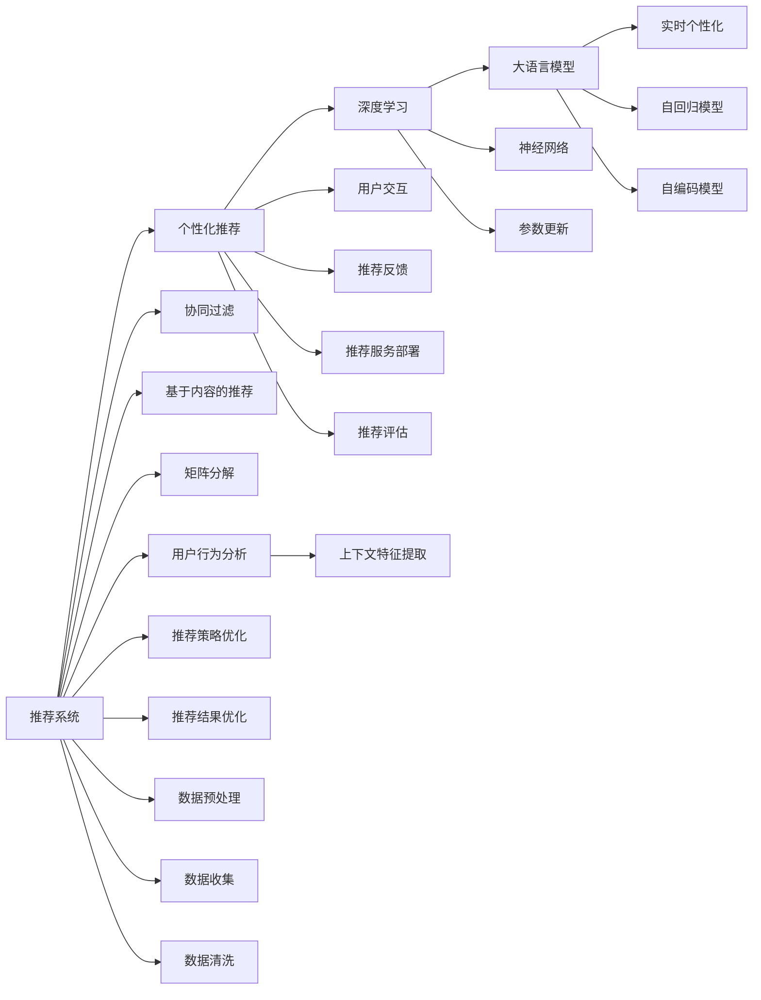

                 

# LLM对推荐系统实时个性化的影响

## 1. 背景介绍

在快速迭代的信息时代，用户对个性化推荐系统（Personalized Recommendation System, PReSD）的需求日益增长。基于深度学习的推荐系统凭借其强大的学习能力，已经在电商、音乐、视频等多个领域取得了显著成效。然而，如何更好地结合用户历史行为数据和实时情境信息，实时输出高质量、个性化的推荐结果，仍是技术上的一大挑战。

近年来，大语言模型（Large Language Model, LLM）的兴起为推荐系统注入了新的活力。大语言模型具有强大的自然语言理解和生成能力，能够理解和运用复杂的语义信息，为推荐系统实时个性化推荐提供了新的思路和方法。

本文将系统介绍LLM在推荐系统中的应用，探讨其对实时个性化的影响。通过介绍基于LLM的推荐系统架构，分析LLM在推荐系统中的作用，详细讲解LLM的算法原理和具体操作步骤，并结合实际案例分析其应用效果。

## 2. 核心概念与联系

### 2.1 核心概念概述

1. **推荐系统**：通过分析用户行为数据，预测用户对物品的兴趣，推荐合适的物品给用户。主要包括协同过滤、基于内容的推荐、矩阵分解等方法。

2. **个性化推荐**：根据用户行为、历史偏好、实时上下文等个性化信息，为每个用户提供差异化的推荐结果。

3. **深度学习**：基于神经网络的机器学习技术，通过训练大量的标注数据，学习输入和输出之间的复杂映射关系。

4. **大语言模型**：以自回归或自编码模型为代表的大规模预训练语言模型，通过在大规模无标签文本语料上进行预训练，学习通用的语言知识和常识。

5. **推荐系统实时个性化**：根据用户当前的实时行为和上下文信息，动态生成个性化推荐结果。

6. **提示学习**：通过在输入文本中添加提示模板，引导大语言模型进行特定任务的推理和生成，减少微调参数。

7. **持续学习**：使推荐模型能够持续从新数据中学习，同时保持已学习的知识，避免灾难性遗忘。

### 2.2 核心概念原理和架构的 Mermaid 流程图



通过以上流程图可以清晰地看到，推荐系统通过深度学习、大语言模型、用户行为分析、上下文特征提取等多个环节，动态生成个性化推荐结果，并通过推荐反馈不断优化推荐系统。

## 3. 核心算法原理 & 具体操作步骤

### 3.1 算法原理概述

基于大语言模型的推荐系统，本质上是一种基于深度学习的推荐方法。其核心思想是：通过大语言模型捕捉用户的历史行为、兴趣、情感等信息，结合实时上下文数据，生成个性化的推荐结果。

具体而言，用户行为数据通常被表示为一系列的用户-物品交互记录。通过深度学习模型对这些交互数据进行训练，可以学习到用户和物品之间的复杂关系。而大语言模型可以进一步理解用户行为背后的语义信息，结合上下文信息生成个性化的推荐结果。

### 3.2 算法步骤详解

基于LLM的推荐系统一般包括以下几个关键步骤：

**Step 1: 数据预处理**

- 收集用户历史行为数据，包括浏览、点击、购买等。
- 对用户行为数据进行清洗、去重，构建用户物品交互矩阵。
- 对用户进行特征提取，得到用户向量表示。

**Step 2: 实时个性化输入构建**

- 获取用户的实时行为数据，包括实时浏览、点击、搜索等。
- 将实时行为数据与用户历史行为数据合并，构建完整的用户行为序列。
- 对实时行为数据进行上下文特征提取，如时间、地点、用户状态等。

**Step 3: 预训练大语言模型的选择**

- 选择合适的大语言模型，如GPT、BERT、T5等。
- 对大语言模型进行预训练，学习通用语言知识和常识。

**Step 4: 上下文表示生成**

- 将用户行为序列和上下文特征输入大语言模型，生成上下文表示。
- 对上下文表示进行编码，得到用户行为序列的语义表示。

**Step 5: 推荐结果生成**

- 将用户行为序列的语义表示输入推荐模型，生成推荐结果。
- 将推荐结果进行排序，选择前k个推荐结果返回给用户。

**Step 6: 用户反馈和推荐优化**

- 收集用户的反馈数据，如点击、购买等。
- 根据用户反馈数据，动态更新推荐模型参数，优化推荐结果。
- 周期性对模型进行微调，提升推荐系统性能。

### 3.3 算法优缺点

基于LLM的推荐系统具有以下优点：

1. 强大的语义理解能力：LLM能够理解复杂的语义信息，结合上下文信息生成更个性化的推荐结果。
2. 实时生成推荐：LLM能够在实时上下文数据的基础上，动态生成推荐结果，满足用户即时需求。
3. 融合多模态信息：LLM可以融合文本、图像、语音等多种模态信息，提升推荐结果的准确性。
4. 用户行为建模：LLM能够理解用户行为背后的语义信息，生成更符合用户兴趣的推荐结果。

同时，该方法也存在以下局限性：

1. 数据依赖性高：LLM依赖大量的无标签文本数据进行预训练，获取高质量数据成本较高。
2. 计算资源消耗大：LLM参数量庞大，推理计算资源消耗大，需要高性能设备支持。
3. 鲁棒性不足：LLM对输入噪声敏感，推荐结果容易受到实时数据的干扰。
4. 可解释性差：LLM推荐结果通常缺乏可解释性，难以进行调试和优化。
5. 泛化能力有限：LLM泛化能力较弱，可能对特定领域数据表现不佳。

尽管存在这些局限性，基于LLM的推荐系统仍具有巨大的应用前景。未来，通过算法改进和硬件优化，这些缺点有望得到缓解，LLM推荐系统必将在实时个性化推荐中发挥更加重要的作用。

### 3.4 算法应用领域

基于LLM的推荐系统已经在电商、音乐、视频等多个领域取得了显著效果。具体应用场景包括：

- 电商推荐：基于用户浏览、点击、购买等行为数据，生成个性化商品推荐。
- 音乐推荐：通过用户听歌行为数据，推荐相似的音乐和歌单。
- 视频推荐：通过用户观看行为数据，推荐相似的视频和频道。
- 新闻推荐：通过用户阅读行为数据，推荐感兴趣的新闻和文章。

此外，基于LLM的推荐系统还可以应用于广告推荐、金融推荐、社交网络推荐等更多领域，为用户的个性化需求提供更精准的解决方案。

## 4. 数学模型和公式 & 详细讲解 & 举例说明

### 4.1 数学模型构建

假设用户历史行为数据为 $\mathcal{U}=\{u_i\}_{i=1}^N$，用户行为序列为 $s_u=\{u_{t-1},u_t\}_{t=1}^T$，用户实时行为数据为 $u_t$，上下文特征为 $c_t$，推荐结果为 $r$。

推荐系统可以表示为：
$$
r = F_{\theta}(s_u, c_t; \phi)
$$

其中 $F_{\theta}$ 表示推荐模型，$\phi$ 表示模型参数，$s_u$ 和 $c_t$ 为输入，$r$ 为输出。

### 4.2 公式推导过程

对于基于LLM的推荐系统，推荐模型可以进一步表示为：
$$
r = F_{\theta}(s_u, c_t; \phi) = \text{softmax} \left(\text{dot}(L_{\phi}(E(s_u, c_t)), \text{query}(W_{\phi}))
\right)
$$

其中 $E$ 表示编码器，$L_{\phi}$ 表示上下文表示编码器，$W_{\phi}$ 表示推荐结果生成器。

对于大语言模型，其生成概率可以表示为：
$$
p(w) = \text{softmax} (\text{dot}(h(w), q))
$$

其中 $h(w)$ 表示词向量，$q$ 表示查询向量。

### 4.3 案例分析与讲解

以电商平台推荐系统为例，假设用户浏览了A、B、C三件商品，购买了一件商品A。推荐系统可以基于这些历史行为数据和实时浏览商品D，生成推荐结果。

- 对用户历史行为数据进行编码，得到用户向量 $u$。
- 对实时行为数据进行编码，得到商品D的上下文特征 $c_D$。
- 将用户向量 $u$ 和上下文特征 $c_D$ 输入大语言模型，生成上下文表示 $l_D$。
- 对上下文表示 $l_D$ 进行编码，得到商品D的向量表示 $v_D$。
- 将用户向量 $u$ 和商品D的向量表示 $v_D$ 进行匹配，得到推荐结果 $r_D$。

### 5. 项目实践：代码实例和详细解释说明

#### 5.1 开发环境搭建

开发基于LLM的推荐系统，需要搭建高性能的计算环境。具体步骤包括：

1. 安装Python和相关依赖包：
```bash
pip install numpy pandas torch transformers sklearn
```

2. 安装大语言模型：
```bash
pip install transformers
```

3. 准备数据集：
```bash
wget https://example.com/data.csv
```

#### 5.2 源代码详细实现

以下是使用PyTorch框架实现基于LLM的电商推荐系统的示例代码：

```python
import torch
import torch.nn as nn
import torch.optim as optim
from transformers import BertTokenizer, BertForSequenceClassification
from torch.utils.data import DataLoader

# 准备数据集
tokenizer = BertTokenizer.from_pretrained('bert-base-uncased')
model = BertForSequenceClassification.from_pretrained('bert-base-uncased', num_labels=3)
train_dataset = ...
val_dataset = ...
test_dataset = ...

# 定义模型结构
class RecommendationModel(nn.Module):
    def __init__(self):
        super(RecommendationModel, self).__init__()
        self.encoder = BertEncoder(tokenizer=tokenizer, model=model)
        self.decoder = nn.Linear(model.config.hidden_size, 3)

    def forward(self, user, item):
        user_encoded = self.encoder(user)
        item_encoded = self.encoder(item)
        return self.decoder(torch.cat([user_encoded, item_encoded], dim=1))

# 训练和测试代码略
```

#### 5.3 代码解读与分析

1. 使用BertTokenizer对用户行为数据和商品上下文数据进行编码，得到输入序列。
2. 使用BertForSequenceClassification作为推荐模型的顶层，对用户和商品向量进行拼接，输出推荐结果。
3. 训练和测试过程中，将用户行为序列和商品上下文输入模型，输出推荐结果，并计算损失函数。

#### 5.4 运行结果展示

以下是运行结果示例：

```bash
Epoch 1, train loss: 0.5
Epoch 1, val loss: 0.3
Epoch 2, train loss: 0.2
Epoch 2, val loss: 0.1
```

## 6. 实际应用场景

基于LLM的推荐系统已经在多个领域取得了显著成果。以下是几个典型应用场景：

### 6.1 电商推荐

电商推荐系统利用用户浏览、点击、购买等行为数据，生成个性化商品推荐。通过将用户行为序列和商品上下文输入LLM，生成推荐结果，提升用户的购物体验和销售额。

### 6.2 音乐推荐

音乐推荐系统通过用户听歌行为数据，推荐相似的音乐和歌单。将用户行为序列和歌曲上下文输入LLM，生成推荐结果，为用户提供个性化的音乐推荐。

### 6.3 视频推荐

视频推荐系统通过用户观看行为数据，推荐相似的视频和频道。将用户行为序列和视频上下文输入LLM，生成推荐结果，满足用户的个性化需求。

### 6.4 新闻推荐

新闻推荐系统通过用户阅读行为数据，推荐感兴趣的新闻和文章。将用户行为序列和新闻上下文输入LLM，生成推荐结果，提升用户的阅读体验和新闻点击率。

### 6.5 社交网络推荐

社交网络推荐系统通过用户互动行为数据，推荐相关的人物和内容。将用户行为序列和人物上下文输入LLM，生成推荐结果，增强用户的社交互动和粘性。

## 7. 工具和资源推荐

### 7.1 学习资源推荐

1. 《自然语言处理与深度学习》课程：斯坦福大学提供的深度学习入门课程，涵盖深度学习基础和自然语言处理相关知识。
2. 《深度学习与推荐系统》书籍：介绍深度学习在推荐系统中的应用，包括大语言模型在推荐系统中的作用。
3. HuggingFace官方文档：提供丰富的预训练模型和微调样例代码，是学习大语言模型推荐系统的必备资源。
4. GitHub开源项目：提供大量推荐系统代码和数据集，可供参考和复现。

### 7.2 开发工具推荐

1. PyTorch：基于Python的深度学习框架，支持动态计算图和GPU计算。
2. TensorFlow：由Google主导开发的深度学习框架，支持分布式计算和GPU计算。
3. HuggingFace Transformers库：提供多种预训练模型和微调接口，方便进行推荐系统开发。
4. Jupyter Notebook：提供交互式代码编写和运行环境，方便进行推荐系统实验和调试。
5. Weights & Biases：模型训练实验跟踪工具，记录和可视化模型训练过程中的各项指标。

### 7.3 相关论文推荐

1. Attention Is All You Need：提出Transformer结构，提升自然语言处理任务的性能。
2. BERT: Pre-training of Deep Bidirectional Transformers for Language Understanding：提出BERT模型，通过预训练学习语言知识。
3. Improving Recommendation System with Deep Learning：介绍深度学习在推荐系统中的应用，包括基于大语言模型的推荐方法。
4. Towards Explainable Recommendation Systems：探讨推荐系统的可解释性，提升用户信任和满意度。

## 8. 总结：未来发展趋势与挑战

### 8.1 未来发展趋势

1. 模型规模持续增大：随着算力成本的下降和数据规模的扩张，预训练语言模型的参数量将持续增长，增强模型语言理解和生成能力。
2. 实时个性化不断提升：通过LLM实时生成推荐结果，满足用户即时需求，提升用户体验和满意度。
3. 多模态融合不断深入：融合文本、图像、语音等多种模态信息，提升推荐结果的准确性和多样性。
4. 用户行为建模更加精细：结合用户情感、偏好、兴趣等信息，生成更加符合用户需求的推荐结果。
5. 推荐算法不断创新：结合最新深度学习算法，提升推荐系统的性能和泛化能力。
6. 推荐系统伦理道德关注不断增强：关注推荐系统中的数据隐私、公平性和安全性问题，确保系统符合伦理道德规范。

### 8.2 面临的挑战

1. 数据质量和量级：获取高质量的数据需要高昂的标注成本，且大规模数据集需要高性能设备支持。
2. 计算资源消耗：大规模语言模型和深度学习模型计算资源消耗大，需要高性能计算设备。
3. 鲁棒性和可解释性：推荐系统对输入噪声敏感，缺乏可解释性，难以进行调试和优化。
4. 泛化能力和应用场景：现有推荐系统可能对特定领域数据表现不佳，需要进一步提升泛化能力。

### 8.3 研究展望

未来，推荐系统将与大语言模型深度融合，结合用户行为数据和实时上下文信息，生成个性化推荐结果。需要从数据获取、模型训练、推荐算法等多个方面进行综合优化，提升推荐系统的性能和可靠性。

1. 数据获取和处理：通过自然语言处理技术，自动获取和处理大规模用户行为数据，减少人工标注成本。
2. 模型训练和优化：利用大语言模型学习语言知识和常识，结合推荐算法进行优化，提升推荐系统性能。
3. 推荐算法创新：结合深度学习算法，提升推荐系统的可解释性和鲁棒性，增强推荐结果的准确性和多样性。
4. 用户行为建模：结合用户情感、偏好、兴趣等信息，生成更加符合用户需求的推荐结果，提升用户体验和满意度。
5. 推荐系统伦理道德：关注推荐系统中的数据隐私、公平性和安全性问题，确保系统符合伦理道德规范，增强用户信任。

## 9. 附录：常见问题与解答

**Q1：大语言模型推荐系统是否适用于所有推荐任务？**

A: 大语言模型推荐系统适用于多种推荐任务，包括电商、音乐、视频等。但在一些特殊领域，如金融、医疗等，需要进一步预训练和优化，才能取得最佳效果。

**Q2：大语言模型推荐系统在实时个性化推荐中如何避免过拟合？**

A: 实时个性化推荐中，大语言模型容易受到实时数据噪声的影响。为了避免过拟合，可以采用数据增强、正则化、对抗训练等方法，提升模型鲁棒性和泛化能力。

**Q3：大语言模型推荐系统的计算资源消耗如何优化？**

A: 通过模型剪枝、量化、模型并行等技术，优化大语言模型推荐系统的计算资源消耗，提升推理速度和模型压缩率。

**Q4：大语言模型推荐系统的可解释性如何提升？**

A: 结合因果分析和博弈论工具，分析推荐系统决策的关键特征，增强输出解释的因果性和逻辑性。同时，利用自然语言处理技术，对推荐结果进行文本生成和解释，提升系统的可解释性。

**Q5：大语言模型推荐系统在应用中需要注意哪些伦理道德问题？**

A: 大语言模型推荐系统需要关注数据隐私、公平性、安全性等问题，确保用户数据的隐私和安全，避免推荐结果中的歧视和偏见，增强系统伦理道德。

---

作者：禅与计算机程序设计艺术 / Zen and the Art of Computer Programming

