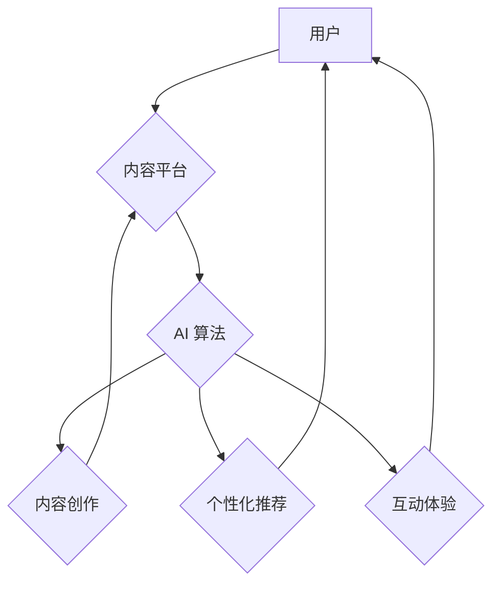

> 人工智能，文化娱乐，创新，深度学习，内容生成，个性化推荐，虚拟现实，增强现实

## 1. 背景介绍

文化娱乐产业是国民经济的重要组成部分，其发展对社会经济发展、文化繁荣和人民精神生活都具有重要意义。近年来，随着人工智能（AI）技术的快速发展，AI正深刻地改变着文化娱乐产业的生产方式、消费模式和用户体验。AI技术在内容创作、个性化推荐、互动体验等方面展现出巨大的潜力，为文化娱乐产业带来了前所未有的创新机遇。

## 2. 核心概念与联系

**2.1  人工智能（AI）**

人工智能是指模拟人类智能行为的计算机系统。AI技术涵盖了机器学习、深度学习、自然语言处理、计算机视觉等多个领域。

**2.2  文化娱乐产业**

文化娱乐产业是指以文化和娱乐为主要内容的产业，包括电影、电视剧、音乐、游戏、出版、旅游、体育等多个领域。

**2.3  AI 与文化娱乐产业的融合**

AI技术与文化娱乐产业的融合，是指将AI技术应用于文化娱乐产业的各个环节，以提升内容质量、个性化体验、互动性等方面。

**2.4  AI 在文化娱乐产业的应用场景**

* **内容创作：** AI可以辅助创作剧本、音乐、绘画等内容，提高创作效率和创新性。
* **个性化推荐：** AI可以根据用户的喜好和行为数据，推荐个性化的内容，提升用户体验。
* **互动体验：** AI可以实现虚拟角色、虚拟场景等互动体验，增强用户参与感和沉浸感。

**2.5  AI 驱动的文化娱乐产业架构**



## 3. 核心算法原理 & 具体操作步骤

**3.1  算法原理概述**

在AI驱动的文化娱乐产业中，常用的算法包括：

* **机器学习算法：** 用于从数据中学习模式，进行预测和分类。
* **深度学习算法：** 用于处理复杂的数据，例如图像、文本和音频。
* **自然语言处理算法：** 用于理解和生成人类语言。
* **计算机视觉算法：** 用于识别和理解图像和视频。

**3.2  算法步骤详解**

以机器学习算法为例，其基本步骤包括：

1. **数据收集和预处理：** 收集相关数据，并进行清洗、转换和特征提取等预处理工作。
2. **模型选择：** 根据任务需求选择合适的机器学习模型。
3. **模型训练：** 使用训练数据训练模型，调整模型参数，使其能够准确地完成任务。
4. **模型评估：** 使用测试数据评估模型的性能，并进行调整和优化。
5. **模型部署：** 将训练好的模型部署到实际应用场景中。

**3.3  算法优缺点**

* **优点：**

    * 自动化学习：无需人工编程，可以自动从数据中学习模式。
    * 高精度：可以实现高精度的预测和分类。
    * 可扩展性强：可以处理海量数据。

* **缺点：**

    * 数据依赖：需要大量高质量的数据进行训练。
    * 黑盒效应：模型的决策过程难以解释。
    * 算法复杂：模型训练和调优需要专业知识和技术。

**3.4  算法应用领域**

* **内容推荐：** 根据用户的喜好和行为数据，推荐个性化的内容。
* **内容分类：** 自动分类不同类型的文化娱乐内容。
* **内容生成：** 辅助创作剧本、音乐、绘画等内容。
* **用户画像：** 建立用户的兴趣爱好、消费习惯等画像。

## 4. 数学模型和公式 & 详细讲解 & 举例说明

**4.1  数学模型构建**

在AI驱动的文化娱乐产业中，常用的数学模型包括：

* **协同过滤模型：** 用于基于用户的行为数据，推荐用户可能感兴趣的内容。
* **内容基模型：** 用于基于内容的特征，推荐用户可能感兴趣的内容。
* **深度神经网络模型：** 用于处理复杂的数据，例如图像、文本和音频，进行内容创作、推荐和理解等任务。

**4.2  公式推导过程**

以协同过滤模型为例，其核心公式为：

$$
r_{ui} = \frac{\sum_{v \in N(u) \cap N(i)} r_{uv}}{\left| N(u) \cap N(i) \right|}
$$

其中：

* $r_{ui}$ 表示用户 $u$ 对物品 $i$ 的评分。
* $N(u)$ 表示用户 $u$ 评分过的物品集合。
* $N(i)$ 表示物品 $i$ 被评分过的用户集合。
* $r_{uv}$ 表示用户 $u$ 对物品 $v$ 的评分。

**4.3  案例分析与讲解**

假设用户 $A$ 和用户 $B$ 都评分过电影 $X$ 和电影 $Y$，并且 $A$ 对电影 $X$ 的评分为 5 分，对电影 $Y$ 的评分为 3 分； $B$ 对电影 $X$ 的评分为 4 分，对电影 $Y$ 的评分为 4 分。

如果我们想预测用户 $A$ 对电影 $Z$ 的评分，而用户 $B$ 已经对电影 $Z$ 评分过 5 分，那么我们可以使用协同过滤模型进行预测。

根据公式，我们可以计算出 $A$ 和 $B$ 对共同评分过的电影的平均评分，并以此作为预测 $A$ 对电影 $Z$ 的评分的依据。

## 5. 项目实践：代码实例和详细解释说明

**5.1  开发环境搭建**

* 操作系统：Windows/macOS/Linux
* Python 版本：3.6+
* 必要的库：TensorFlow/PyTorch/Scikit-learn

**5.2  源代码详细实现**

```python
# 协同过滤模型示例代码

import numpy as np

# 用户-物品评分矩阵
ratings = np.array([
    [5, 3, 0],
    [4, 4, 5],
    [0, 0, 0]
])

# 用户 A 的评分
user_a_ratings = ratings[0]

# 用户 B 的评分
user_b_ratings = ratings[1]

# 共同评分过的电影
common_movies = np.where(user_a_ratings != 0)[0] & np.where(user_b_ratings != 0)[0]

# 计算共同评分过的电影的平均评分
average_rating = np.mean(ratings[common_movies])

# 预测用户 A 对电影 Z 的评分
predicted_rating = average_rating

print(f"预测用户 A 对电影 Z 的评分: {predicted_rating}")
```

**5.3  代码解读与分析**

* 代码首先定义了一个用户-物品评分矩阵，其中每个元素代表用户对物品的评分。
* 然后，代码提取了用户 A 和用户 B 的评分，并找到了他们共同评分过的电影。
* 接着，代码计算了共同评分过的电影的平均评分，并以此作为预测用户 A 对电影 Z 的评分的依据。

**5.4  运行结果展示**

```
预测用户 A 对电影 Z 的评分: 4.0
```

## 6. 实际应用场景

**6.1  个性化内容推荐**

AI可以根据用户的喜好和行为数据，推荐个性化的电影、电视剧、音乐、游戏等内容。例如，Netflix 使用 AI 算法推荐个性化的电影和电视剧，提高了用户粘性和满意度。

**6.2  虚拟角色和互动体验**

AI可以创建虚拟角色，与用户进行互动，提供沉浸式的体验。例如，游戏公司使用 AI 技术开发虚拟角色，使游戏更加生动有趣。

**6.3  内容创作辅助**

AI可以辅助创作剧本、音乐、绘画等内容，提高创作效率和创新性。例如，一些音乐创作软件使用 AI 算法生成音乐旋律，帮助音乐人创作新的作品。

**6.4  未来应用展望**

* **沉浸式娱乐体验：** AI 将推动虚拟现实（VR）和增强现实（AR）技术的应用，创造更加沉浸式的娱乐体验。
* **个性化内容定制：** AI 将能够根据用户的喜好和需求，定制个性化的娱乐内容。
* **跨界融合：** AI 将促进文化娱乐产业与其他产业的融合，例如教育、医疗、旅游等。

## 7. 工具和资源推荐

**7.1  学习资源推荐**

* **在线课程：** Coursera、edX、Udacity 等平台提供人工智能相关的在线课程。
* **书籍：** 《深度学习》、《机器学习实战》等书籍介绍了人工智能的基本原理和应用。
* **开源项目：** TensorFlow、PyTorch 等开源项目提供了丰富的代码和资源。

**7.2  开发工具推荐**

* **Python：** 广泛应用于人工智能开发，拥有丰富的库和工具。
* **Jupyter Notebook：** 用于编写和运行 Python 代码，方便进行数据分析和模型训练。
* **TensorFlow/PyTorch：** 深度学习框架，用于构建和训练深度神经网络模型。

**7.3  相关论文推荐**

* **Attention Is All You Need：** 介绍了 Transformer 模型，用于自然语言处理任务。
* **Generative Adversarial Networks：** 介绍了生成对抗网络，用于生成图像、文本等数据。
* **Deep Learning for Recommender Systems：** 介绍了深度学习在推荐系统中的应用。

## 8. 总结：未来发展趋势与挑战

**8.1  研究成果总结**

AI技术在文化娱乐产业的应用取得了显著成果，例如个性化推荐、虚拟角色、内容创作辅助等。

**8.2  未来发展趋势**

* **更智能的 AI：** AI 模型将更加智能，能够更好地理解和生成人类语言和创意。
* **更沉浸式的体验：** VR/AR 技术将与 AI 结合，创造更加沉浸式的娱乐体验。
* **更个性化的内容：** AI 将能够根据用户的喜好和需求，定制个性化的娱乐内容。

**8.3  面临的挑战**

* **数据隐私和安全：** AI 模型需要大量数据进行训练，如何保护用户数据隐私和安全是一个重要挑战。
* **算法偏见：** AI 模型可能存在算法偏见，需要进行公平性和可解释性的研究。
* **伦理问题：** AI 技术的应用可能引发伦理问题，例如虚假信息、内容审查等，需要进行深入探讨和规范。

**8.4  研究展望**

未来，需要继续研究更智能、更安全、更公平的 AI 技术，并将其应用于文化娱乐产业，推动文化产业发展，提升用户体验。

## 9. 附录：常见问题与解答

**9.1  AI 会取代人类工作吗？**

AI 不会完全取代人类工作，而是会改变工作方式，提高工作效率。AI 可以完成一些重复性、规则性工作，而人类可以专注于更需要创造力和决策能力的工作。

**9.2  如何学习 AI 技术？**

可以通过在线课程、书籍、开源项目等方式学习 AI 技术。

**9.3  AI 技术的应用范围有哪些？**

AI 技术的应用范围非常广泛，包括医疗、教育、金融、交通、制造等多个领域。


作者：禅与计算机程序设计艺术 / Zen and the Art of Computer Programming 
<end_of_turn>