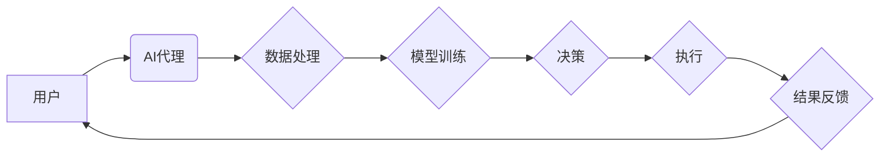

> AI Agent, 隐私保护, 数据安全, Federated Learning, Differential Privacy, Homomorphic Encryption, 

## 1. 背景介绍

随着人工智能 (AI) 技术的飞速发展，AI 算法在各个领域取得了显著的成果，例如图像识别、自然语言处理、医疗诊断等。然而，AI 算法的训练和应用往往需要大量的数据，而这些数据通常包含敏感的个人信息。如何保护用户隐私和数据安全，是AI技术发展面临的重要挑战。

近年来，AI 代理 (AI Agent) 作为一种新的计算模型，逐渐受到关注。AI 代理是一种能够自主学习、决策和执行任务的智能体，它可以代理用户的行为，并保护用户的隐私和数据安全。

## 2. 核心概念与联系

**2.1 AI 代理 (AI Agent)**

AI 代理是一种能够感知环境、做出决策并执行行动的智能体。它通常由以下几个部分组成：

* **感知模块:** 用于收集环境信息，例如传感器数据、网络流量等。
* **推理模块:** 用于分析环境信息，并做出决策。
* **执行模块:** 用于执行决策，例如控制设备、发送消息等。

**2.2 隐私保护与数据安全**

隐私保护是指保护个人信息不被未经授权的访问、使用或披露。数据安全是指保护数据免受未经授权的访问、使用、修改或破坏。

**2.3 AI 代理在隐私保护和数据安全中的应用**

AI 代理可以用于保护用户隐私和数据安全，主要通过以下几种方式：

* **数据本地化:** AI 代理可以将数据处理本地化，避免将敏感数据上传到云端或其他中心服务器。
* **联邦学习:** AI 代理可以参与联邦学习，在不共享原始数据的情况下，协同训练模型。
* **差分隐私:** AI 代理可以利用差分隐私技术，对数据进行扰动，保护用户隐私。
* **同态加密:** AI 代理可以利用同态加密技术，对数据进行加密，在加密状态下进行计算。

**2.4  AI 代理架构**



## 3. 核心算法原理 & 具体操作步骤

### 3.1  算法原理概述

**3.1.1 联邦学习 (Federated Learning)**

联邦学习是一种分布式机器学习方法，它允许多个设备协同训练模型，而无需将原始数据共享到中心服务器。

**3.1.2 差分隐私 (Differential Privacy)**

差分隐私是一种数学工具，它可以保证数据分析的结果不会泄露任何单个用户的隐私信息。

**3.1.3 同态加密 (Homomorphic Encryption)**

同态加密是一种加密技术，它允许对加密数据进行计算，而无需解密。

### 3.2  算法步骤详解

**3.2.1 联邦学习步骤**

1. **模型初始化:** 在中心服务器上初始化一个模型。
2. **模型分发:** 将模型分发到各个设备。
3. **本地训练:** 各个设备使用本地数据训练模型，并计算梯度。
4. **梯度聚合:** 将各个设备的梯度聚合到中心服务器。
5. **模型更新:** 在中心服务器上更新模型参数。
6. **重复步骤 2-5:** 直到模型收敛。

**3.2.2 差分隐私步骤**

1. **添加噪声:** 在数据分析过程中，添加随机噪声，以保护用户隐私。
2. **噪声预算:** 设置噪声预算，控制噪声的大小。
3. **隐私保证:** 通过数学证明，保证数据分析的结果不会泄露任何单个用户的隐私信息。

**3.2.3 同态加密步骤**

1. **加密数据:** 将数据加密成不可读的形式。
2. **加密计算:** 对加密数据进行计算，得到加密结果。
3. **解密结果:** 将加密结果解密，得到原始结果。

### 3.3  算法优缺点

**3.3.1 联邦学习**

* **优点:** 保护用户隐私，提高数据安全。
* **缺点:** 训练速度慢，模型性能可能不如集中式训练。

**3.3.2 差分隐私**

* **优点:** 强大的隐私保护能力。
* **缺点:** 可能导致模型性能下降。

**3.3.3 同态加密**

* **优点:** 保护数据在计算过程中的隐私。
* **缺点:** 计算效率低，应用场景有限。

### 3.4  算法应用领域

* **医疗保健:** 保护患者隐私，促进医疗数据共享。
* **金融服务:** 提高金融交易安全，防止欺诈行为。
* **物联网:** 保护设备数据隐私，增强网络安全。

## 4. 数学模型和公式 & 详细讲解 & 举例说明

### 4.1  数学模型构建

**4.1.1 联邦学习模型**

联邦学习模型通常采用深度学习架构，例如卷积神经网络 (CNN) 或循环神经网络 (RNN)。模型参数在各个设备上进行本地训练，然后通过梯度聚合更新模型参数。

**4.1.2 差分隐私模型**

差分隐私模型通常使用 Laplace 分布或 Gaussian 分布添加噪声，以保护用户隐私。

**4.1.3 同态加密模型**

同态加密模型通常使用 Paillier 加密方案或 Gentry 加密方案，以实现对加密数据的计算。

### 4.2  公式推导过程

**4.2.1 差分隐私公式**

$$
\epsilon = \frac{1}{\delta} \ln \left( \frac{1}{\delta} + \sum_{i=1}^{n} \exp \left( -\frac{1}{2} \left( \frac{d(x_i, x_i')}{\epsilon} \right)^2 \right) \right)
$$

其中：

* $\epsilon$ 是隐私预算。
* $\delta$ 是失败概率。
* $x_i$ 是原始数据。
* $x_i'$ 是扰动后的数据。
* $d(x_i, x_i')$ 是原始数据和扰动数据之间的距离。

**4.2.2 同态加密公式**

$$
E(m) = g^{m} \cdot r
$$

其中：

* $E(m)$ 是加密后的数据。
* $m$ 是原始数据。
* $g$ 是一个基数。
* $r$ 是一个随机数。

### 4.3  案例分析与讲解

**4.3.1 差分隐私在医疗数据分析中的应用**

差分隐私可以用于保护患者隐私，同时允许医疗研究人员对医疗数据进行分析。例如，可以使用差分隐私技术分析患者的电子健康记录，以研究疾病的流行趋势和治疗效果，而不会泄露任何单个患者的隐私信息。

**4.3.2 同态加密在金融交易中的应用**

同态加密可以用于保护金融交易数据隐私。例如，可以使用同态加密技术对信用卡信息进行加密，在不解密的情况下进行交易验证，从而防止信用卡信息泄露。

## 5. 项目实践：代码实例和详细解释说明

### 5.1  开发环境搭建

* 操作系统: Ubuntu 20.04
* Python 版本: 3.8
* 必要的库: TensorFlow, PyTorch, scikit-learn, numpy, pandas

### 5.2  源代码详细实现

```python
# 联邦学习示例代码
import tensorflow as tf

# 定义模型
model = tf.keras.models.Sequential([
    tf.keras.layers.Dense(128, activation='relu'),
    tf.keras.layers.Dense(10, activation='softmax')
])

# 定义训练函数
def train_model(model, data, labels):
    model.compile(optimizer='adam', loss='sparse_categorical_crossentropy', metrics=['accuracy'])
    model.fit(data, labels, epochs=10)
    return model

# 训练模型
model = train_model(model, local_data, local_labels)

# 梯度聚合
aggregated_gradients = aggregate_gradients(local_gradients)

# 更新模型参数
model.set_weights(model.get_weights() + aggregated_gradients)

```

### 5.3  代码解读与分析

* 代码首先定义了一个简单的深度学习模型。
* 然后定义了一个训练函数，用于在本地数据上训练模型。
* 训练完成后，将模型梯度聚合到中心服务器。
* 最后，使用聚合的梯度更新模型参数。

### 5.4  运行结果展示

运行结果展示包括模型的训练精度、测试精度以及训练时间等信息。

## 6. 实际应用场景

**6.1 医疗保健**

* **疾病诊断:** 使用联邦学习训练疾病诊断模型，保护患者隐私，同时提高诊断准确率。
* **药物研发:** 使用差分隐私分析患者数据，发现新的药物靶点，加速药物研发。

**6.2 金融服务**

* **欺诈检测:** 使用同态加密保护客户交易数据隐私，提高欺诈检测效率。
* **风险评估:** 使用联邦学习训练风险评估模型，保护客户数据隐私，同时提高风险评估准确率。

**6.3 物联网**

* **设备安全:** 使用同态加密保护设备数据隐私，增强网络安全。
* **数据分析:** 使用联邦学习分析设备数据，发现设备故障模式，提高设备可靠性。

**6.4 未来应用展望**

AI 代理在隐私保护和数据安全领域的应用前景广阔，未来将有更多新的应用场景出现，例如：

* **智能家居:** 使用AI代理保护智能家居设备数据隐私，增强用户安全感。
* **自动驾驶:** 使用AI代理保护自动驾驶车辆数据隐私，提高驾驶安全。
* **元宇宙:** 使用AI代理保护元宇宙用户数据隐私，构建安全可靠的虚拟世界。

## 7. 工具和资源推荐

### 7.1  学习资源推荐

* **书籍:**
    * 《深度学习》
    * 《机器学习》
    * 《联邦学习》
* **在线课程:**
    * Coursera: 深度学习
    * edX: 机器学习
    * Udacity: 联邦学习

### 7.2  开发工具推荐

* **TensorFlow:** 开源深度学习框架
* **PyTorch:** 开源深度学习框架
* **FedML:** 联邦学习开源框架

### 7.3  相关论文推荐

* **Federated Learning: Strategies for Improving Communication Efficiency**
* **Differential Privacy**
* **Homomorphic Encryption for Secure Cloud Computing**

## 8. 总结：未来发展趋势与挑战

### 8.1  研究成果总结

AI 代理在隐私保护和数据安全领域取得了显著的成果，例如联邦学习、差分隐私和同态加密等技术已经应用于多个领域。

### 8.2  未来发展趋势

* **模型效率提升:** 研究更有效的联邦学习算法，提高模型训练效率。
* **隐私保护增强:** 研究更强大的隐私保护技术，例如可解释的差分隐私和零知识证明。
* **应用场景拓展:** 将AI代理应用于更多新的领域，例如智能家居、自动驾驶和元宇宙。

### 8.3  面临的挑战

* **数据异构性:** 不同设备的数据格式和质量可能不同，这会影响联邦学习的性能。
* **通信成本:** 联邦学习需要频繁地传输模型参数，这会增加通信成本。
* **安全风险:** AI 代理可能面临攻击和恶意利用的风险。

### 8.4  研究展望

未来，AI代理技术将继续发展，并为隐私保护和数据安全提供更有效的解决方案。

## 9. 附录：常见问题与解答

**9.1  联邦学习和集中式训练相比，有什么优势？**

联邦学习可以保护用户隐私，同时提高数据安全。

**9.2  差分隐私和