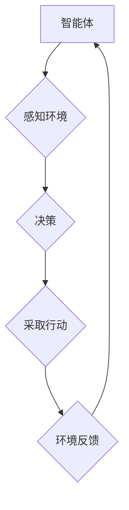

> 智能体，环境，交互，强化学习，决策，模型，算法，应用

## 1. 背景介绍

在人工智能领域，智能体（Agent）的概念至关重要。智能体是指能够感知环境、做出决策并采取行动以实现特定目标的系统。智能体与环境的交互是人工智能的核心，也是智能体学习和进化的关键。

近年来，随着深度学习和强化学习等技术的快速发展，人工智能智能体取得了显著的进展。从自动驾驶汽车到游戏AI，智能体已经开始在各个领域发挥着越来越重要的作用。然而，智能体与环境的交互仍然是一个复杂而充满挑战的问题。

本篇文章将深入探讨智能体与环境的交互理论，涵盖核心概念、算法原理、数学模型、项目实践以及实际应用场景等方面。

## 2. 核心概念与联系

**2.1 智能体**

智能体是一个能够感知环境、做出决策并采取行动的系统。智能体通常具有以下特征：

* **感知能力:** 智能体能够感知环境中的信息，例如图像、文本、声音等。
* **决策能力:** 智能体能够根据感知到的信息做出决策，选择最优的行动。
* **行动能力:** 智能体能够执行决策，采取行动影响环境。
* **目标驱动:** 智能体通常具有特定的目标，并努力通过行动实现目标。

**2.2 环境**

环境是指智能体所处的外部世界，包括所有与智能体交互的信息和实体。环境可以是物理世界，也可以是虚拟世界。

**2.3 交互**

智能体与环境的交互是指智能体感知环境信息、做出决策并采取行动，从而影响环境的过程。交互可以是单向的，也可以是双向的。

**2.4 强化学习**

强化学习是一种机器学习方法，它通过奖励和惩罚机制来训练智能体。智能体在与环境交互的过程中，会根据环境的反馈（奖励或惩罚）调整自己的行为策略，以最大化累积的奖励。

**2.5 决策理论**

决策理论研究的是在不确定性条件下，如何做出最佳决策。决策理论为智能体提供了一套框架，帮助智能体评估不同行动的风险和收益，并选择最优的行动。

**2.6  Mermaid 流程图**



## 3. 核心算法原理 & 具体操作步骤

### 3.1  算法原理概述

强化学习算法的核心思想是通过试错学习，不断调整行为策略，以最大化累积的奖励。

**3.1.1  状态（State）**

智能体在与环境交互的过程中，会处于不同的状态。状态描述了智能体当前的环境和自身情况。

**3.1.2  动作（Action）**

智能体可以采取不同的动作来影响环境。动作是智能体与环境交互的方式。

**3.1.3  奖励（Reward）**

环境会根据智能体的动作给予奖励或惩罚。奖励是衡量智能体行为好坏的指标。

**3.1.4  价值函数（Value Function）**

价值函数估计了智能体在特定状态下采取特定动作的长期奖励。

**3.1.5  策略（Policy）**

策略是一个映射关系，将状态映射到动作。策略决定了智能体在不同状态下采取的动作。

### 3.2  算法步骤详解

1. **初始化:** 初始化智能体的策略和价值函数。
2. **感知环境:** 智能体感知当前环境的状态。
3. **选择动作:** 根据策略，智能体选择一个动作。
4. **采取行动:** 智能体执行选择的动作，并观察环境的反馈（奖励或惩罚）。
5. **更新价值函数:** 根据环境的反馈，更新智能体的价值函数。
6. **更新策略:** 根据更新后的价值函数，更新智能体的策略。
7. **重复步骤2-6:** 重复以上步骤，直到智能体达到预设的目标或训练结束。

### 3.3  算法优缺点

**优点:**

* 可以学习复杂的行为策略。
* 不需要事先定义所有规则。
* 可以适应不断变化的环境。

**缺点:**

* 训练过程可能很慢。
* 需要大量的训练数据。
* 难以解释智能体的决策过程。

### 3.4  算法应用领域

强化学习算法已广泛应用于以下领域：

* **游戏AI:** 训练游戏AI，使其能够学习玩游戏并取得胜利。
* **机器人控制:** 训练机器人控制算法，使其能够自主完成任务。
* **推荐系统:** 建立个性化推荐系统，推荐用户感兴趣的内容。
* **金融交易:** 开发自动交易系统，进行股票、期货等金融交易。

## 4. 数学模型和公式 & 详细讲解 & 举例说明

### 4.1  数学模型构建

强化学习的数学模型主要包括价值函数、策略和奖励函数。

**4.1.1  价值函数**

价值函数 $V(s)$ 表示智能体在状态 $s$ 下的期望累积奖励。

**4.1.2  策略**

策略 $\pi(a|s)$ 表示智能体在状态 $s$ 下采取动作 $a$ 的概率。

**4.1.3  奖励函数**

奖励函数 $R(s, a)$ 表示智能体在状态 $s$ 下采取动作 $a$ 后获得的奖励。

### 4.2  公式推导过程

**4.2.1  Bellman方程**

Bellman方程是强化学习的核心公式，它描述了价值函数的更新规则。

$$V(s) = \max_a \left[ R(s, a) + \gamma \sum_{s'} P(s'|s, a) V(s') \right]$$

其中：

* $V(s)$ 是状态 $s$ 的价值函数。
* $R(s, a)$ 是状态 $s$ 下采取动作 $a$ 后获得的奖励。
* $\gamma$ 是折扣因子，控制未来奖励的权重。
* $P(s'|s, a)$ 是从状态 $s$ 采取动作 $a$ 到状态 $s'$ 的转移概率。

**4.2.2  策略梯度算法**

策略梯度算法是一种常用的强化学习算法，它通过梯度上升来更新策略。

$$\theta_{t+1} = \theta_t + \alpha \nabla_{\theta} J(\theta)$$

其中：

* $\theta$ 是策略参数。
* $J(\theta)$ 是策略的效用函数。
* $\alpha$ 是学习率。

### 4.3  案例分析与讲解

**4.3.1  游戏AI**

在游戏AI领域，强化学习算法可以训练智能体学习玩游戏并取得胜利。例如，AlphaGo 使用强化学习算法战胜了世界围棋冠军。

**4.3.2  机器人控制**

在机器人控制领域，强化学习算法可以训练机器人自主完成任务。例如，机器人可以学习如何导航、抓取物体和完成其他复杂的任务。

## 5. 项目实践：代码实例和详细解释说明

### 5.1  开发环境搭建

* Python 3.x
* TensorFlow 或 PyTorch
* Jupyter Notebook

### 5.2  源代码详细实现

```python
import tensorflow as tf

# 定义价值函数
class ValueFunction(tf.keras.Model):
    def __init__(self):
        super(ValueFunction, self).__init__()
        self.dense1 = tf.keras.layers.Dense(64, activation='relu')
        self.dense2 = tf.keras.layers.Dense(1)

    def call(self, state):
        x = self.dense1(state)
        return self.dense2(x)

# 定义策略网络
class PolicyNetwork(tf.keras.Model):
    def __init__(self):
        super(PolicyNetwork, self).__init__()
        self.dense1 = tf.keras.layers.Dense(64, activation='relu')
        self.dense2 = tf.keras.layers.Dense(2, activation='softmax')

    def call(self, state):
        x = self.dense1(state)
        return self.dense2(x)

# 定义强化学习算法
class QLearningAgent:
    def __init__(self, state_size, action_size, learning_rate=0.01, discount_factor=0.99):
        self.state_size = state_size
        self.action_size = action_size
        self.learning_rate = learning_rate
        self.discount_factor = discount_factor
        self.value_function = ValueFunction()
        self.policy_network = PolicyNetwork()

    def choose_action(self, state):
        probs = self.policy_network(state)
        action = tf.random.categorical(tf.math.log(probs), num_samples=1)[0, 0]
        return action

    def update_value_function(self, state, action, reward, next_state):
        target = reward + self.discount_factor * self.value_function(next_state)
        with tf.GradientTape() as tape:
            value = self.value_function(state)
            loss = tf.keras.losses.MSE(target, value)
        gradients = tape.gradient(loss, self.value_function.trainable_variables)
        self.value_function.optimizer.apply_gradients(zip(gradients, self.value_function.trainable_variables))

    def train(self, env, num_episodes=1000):
        for episode in range(num_episodes):
            state = env.reset()
            done = False
            while not done:
                action = self.choose_action(state)
                next_state, reward, done, _ = env.step(action)
                self.update_value_function(state, action, reward, next_state)
                state = next_state

```

### 5.3  代码解读与分析

* **价值函数:** 价值函数用于估计智能体在特定状态下采取特定动作的长期奖励。
* **策略网络:** 策略网络用于决定智能体在特定状态下采取的动作。
* **强化学习算法:** QLearning算法是一种常用的强化学习算法，它通过更新价值函数和策略网络来训练智能体。

### 5.4  运行结果展示

运行代码后，智能体将在环境中进行交互，并逐渐学习到最佳的行为策略。

## 6. 实际应用场景

### 6.1  自动驾驶

强化学习可以用于训练自动驾驶汽车，使其能够感知周围环境、做出决策并控制车辆行驶。

### 6.2  机器人控制

强化学习可以用于训练机器人完成各种任务，例如导航、抓取物体和进行手术。

### 6.3  推荐系统

强化学习可以用于构建个性化推荐系统，推荐用户感兴趣的内容。

### 6.4  未来应用展望

强化学习在未来将有更广泛的应用，例如：

* **医疗保健:** 辅助医生诊断疾病、制定治疗方案。
* **金融:** 进行风险管理、投资决策。
* **教育:** 个性化教学、智能辅导。

## 7. 工具和资源推荐

### 7.1  学习资源推荐

* **书籍:**
    * Reinforcement Learning: An Introduction by Richard S. Sutton and Andrew G. Barto
    * Deep Reinforcement Learning Hands-On by Maxim Lapan
* **在线课程:**
    * Deep Reinforcement Learning Specialization by DeepLearning.AI
    * Reinforcement Learning by David Silver (University of DeepMind)

### 7.2  开发工具推荐

* **TensorFlow:** 开源深度学习框架
* **PyTorch:** 开源深度学习框架
* **OpenAI Gym:** 强化学习环境库

### 7.3  相关论文推荐

* **Deep Q-Network (DQN):** Mnih et al. (2015)
* **Proximal Policy Optimization (PPO):** Schulman et al.