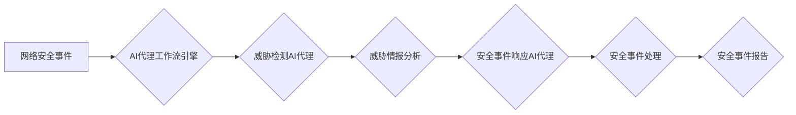

> AI代理，工作流，网络安全，自动化，威胁检测，响应，机器学习，深度学习

## 1. 背景介绍

随着网络攻击的日益复杂化和智能化，传统的网络安全防御体系面临着越来越大的挑战。传统的安全防御模式主要依赖于人工干预，效率低下，难以应对海量数据和瞬息万变的攻击场景。人工智能（AI）技术作为一种新兴技术，为网络安全领域带来了新的希望。

AI代理工作流（AI Agent WorkFlow）是一种利用人工智能技术，自动执行网络安全任务的工作流程。它通过将网络安全任务分解成一系列可执行的步骤，并使用AI代理来完成这些步骤，从而实现自动化、智能化和高效化的网络安全防御。

## 2. 核心概念与联系

### 2.1 AI代理

AI代理是一种能够自主学习、决策和执行任务的软件实体。它可以根据预先定义的规则或通过机器学习算法，从数据中学习并做出决策。在网络安全领域，AI代理可以用于各种任务，例如：

* **威胁检测：** 分析网络流量和系统日志，识别潜在的威胁。
* **恶意软件分析：** 分析恶意软件样本，识别其功能和行为。
* **漏洞扫描：** 扫描系统和应用程序，识别潜在的漏洞。
* **安全事件响应：** 自动化安全事件的响应，例如隔离受感染主机或阻止恶意流量。

### 2.2 工作流

工作流是一种描述一系列任务和步骤的流程图。它可以帮助组织自动化和标准化工作流程，提高效率和一致性。在网络安全领域，工作流可以用于描述各种安全操作，例如：

* **安全事件处理流程：** 从安全事件的检测到事件的响应和处理，整个流程。
* **漏洞修复流程：** 从漏洞的发现到漏洞的修复，整个流程。
* **安全配置管理流程：** 从安全配置的定义到配置的实施和维护，整个流程。

### 2.3 AI代理工作流

AI代理工作流将AI代理与工作流相结合，实现网络安全任务的自动化和智能化。它通过将网络安全任务分解成一系列可执行的步骤，并使用AI代理来完成这些步骤，从而实现以下优势：

* **自动化：** 自动化重复性任务，提高效率和减少人为错误。
* **智能化：** 利用AI代理的学习和决策能力，提高安全防御的智能化水平。
* **高效化：** 缩短安全事件的响应时间，提高安全防御的效率。

**AI代理工作流架构图**



## 3. 核心算法原理 & 具体操作步骤

### 3.1 算法原理概述

AI代理工作流的核心算法原理是基于机器学习和深度学习技术。

* **机器学习：** AI代理可以利用机器学习算法从历史数据中学习，识别威胁模式和行为。常见的机器学习算法包括支持向量机（SVM）、决策树、随机森林和神经网络。
* **深度学习：** 深度学习是一种更高级的机器学习技术，它使用多层神经网络来学习复杂的数据模式。深度学习在网络安全领域具有强大的应用潜力，例如恶意软件检测、网络流量分析和身份验证。

### 3.2 算法步骤详解

AI代理工作流的具体操作步骤如下：

1. **数据收集：** 从网络设备、系统日志和安全信息和事件管理（SIEM）系统收集网络安全数据。
2. **数据预处理：** 对收集到的数据进行清洗、转换和特征提取，以便于AI代理的训练和使用。
3. **模型训练：** 使用机器学习或深度学习算法，对预处理后的数据进行训练，构建AI代理模型。
4. **模型部署：** 将训练好的AI代理模型部署到网络安全系统中。
5. **威胁检测：** AI代理根据预定义的规则或机器学习模型，分析网络流量和系统日志，识别潜在的威胁。
6. **威胁响应：** 当AI代理检测到威胁时，它会根据预定义的策略或机器学习模型，自动执行相应的安全响应措施，例如隔离受感染主机、阻止恶意流量或发送安全告警。
7. **事件报告：** AI代理将安全事件的详细信息报告给安全运营中心或相关人员。

### 3.3 算法优缺点

**优点：**

* 自动化：自动执行网络安全任务，提高效率和减少人为错误。
* 智能化：利用AI代理的学习和决策能力，提高安全防御的智能化水平。
* 高效化：缩短安全事件的响应时间，提高安全防御的效率。

**缺点：**

* 数据依赖：AI代理的性能取决于训练数据的质量和数量。
* 模型解释性：深度学习模型的决策过程难以解释，这可能会导致安全事件的误判。
* 攻击面：AI代理本身也可能成为攻击目标，需要采取相应的安全措施保护AI代理。

### 3.4 算法应用领域

AI代理工作流在网络安全领域具有广泛的应用场景，例如：

* **威胁检测和响应：** 自动识别和响应网络攻击，例如DDoS攻击、恶意软件感染和零日漏洞利用。
* **安全事件管理：** 自动化安全事件的处理流程，提高事件响应效率。
* **漏洞管理：** 自动识别和修复系统和应用程序中的漏洞。
* **安全配置管理：** 自动化安全配置的定义、实施和维护。

## 4. 数学模型和公式 & 详细讲解 & 举例说明

### 4.1 数学模型构建

在AI代理工作流中，可以使用各种数学模型来描述和预测网络安全事件。例如：

* **贝叶斯网络：** 用于表示网络安全事件之间的因果关系和概率依赖关系。
* **支持向量机（SVM）：** 用于分类网络安全事件，例如恶意流量和合法流量。
* **随机森林：** 用于预测网络安全事件的发生概率。

### 4.2 公式推导过程

例如，可以使用贝叶斯定理来计算网络安全事件的概率：

$$P(A|B) = \frac{P(B|A)P(A)}{P(B)}$$

其中：

* $P(A|B)$ 是事件A在事件B发生条件下的概率。
* $P(B|A)$ 是事件B在事件A发生条件下的概率。
* $P(A)$ 是事件A发生的概率。
* $P(B)$ 是事件B发生的概率。

### 4.3 案例分析与讲解

例如，假设我们想要预测网络攻击的发生概率。我们可以使用历史网络攻击数据训练一个随机森林模型。模型训练完成后，我们可以输入新的网络流量数据，模型会根据训练数据预测该流量是否属于攻击流量。

## 5. 项目实践：代码实例和详细解释说明

### 5.1 开发环境搭建

* 操作系统：Ubuntu 20.04 LTS
* Python 版本：3.8
* 必要的库：TensorFlow、Keras、Scikit-learn、Pandas、NumPy

### 5.2 源代码详细实现

```python
# 导入必要的库
import tensorflow as tf
from tensorflow import keras
from sklearn.model_selection import train_test_split
from sklearn.preprocessing import StandardScaler

# 加载网络安全数据
data = pd.read_csv("network_security_data.csv")

# 数据预处理
X = data.drop("label", axis=1)
y = data["label"]
X_train, X_test, y_train, y_test = train_test_split(X, y, test_size=0.2, random_state=42)
scaler = StandardScaler()
X_train = scaler.fit_transform(X_train)
X_test = scaler.transform(X_test)

# 建立深度学习模型
model = keras.Sequential([
    keras.layers.Dense(64, activation="relu", input_shape=(X_train.shape[1],)),
    keras.layers.Dense(32, activation="relu"),
    keras.layers.Dense(1, activation="sigmoid")
])

# 编译模型
model.compile(optimizer="adam", loss="binary_crossentropy", metrics=["accuracy"])

# 训练模型
model.fit(X_train, y_train, epochs=10, batch_size=32)

# 评估模型
loss, accuracy = model.evaluate(X_test, y_test)
print("Loss:", loss)
print("Accuracy:", accuracy)
```

### 5.3 代码解读与分析

这段代码演示了如何使用TensorFlow和Keras构建一个简单的深度学习模型来预测网络攻击的发生概率。

* 首先，代码导入必要的库。
* 然后，代码加载网络安全数据并进行数据预处理，包括特征选择、数据分割和数据标准化。
* 接着，代码建立一个深度学习模型，该模型包含三个全连接层和一个sigmoid激活函数的输出层。
* 然后，代码编译模型，指定优化器、损失函数和评估指标。
* 最后，代码训练模型并评估模型的性能。

### 5.4 运行结果展示

训练完成后，模型会输出训练过程中的损失值和准确率。

## 6. 实际应用场景

AI代理工作流在网络安全领域具有广泛的应用场景，例如：

### 6.1 威胁检测

AI代理可以分析网络流量和系统日志，识别潜在的威胁，例如DDoS攻击、恶意软件感染和零日漏洞利用。

### 6.2 安全事件响应

当AI代理检测到威胁时，它可以自动执行相应的安全响应措施，例如隔离受感染主机、阻止恶意流量或发送安全告警。

### 6.3 安全事件管理

AI代理可以自动化安全事件的处理流程，提高事件响应效率。

### 6.4 未来应用展望

随着人工智能技术的不断发展，AI代理工作流在网络安全领域将有更广泛的应用场景，例如：

* **主动防御：** AI代理可以主动识别和防御新的威胁，例如利用机器学习算法预测未来的攻击模式。
* **安全态势感知：** AI代理可以收集和分析来自不同安全源的信息，提供全面的安全态势感知。
* **安全自动化：** AI代理可以自动化更多的安全任务，例如安全配置管理、漏洞扫描和安全审计。

## 7. 工具和资源推荐

### 7.1 学习资源推荐

* **书籍：**
    * 《深度学习》
    * 《机器学习实战》
* **在线课程：**
    * Coursera上的“机器学习”课程
    * edX上的“人工智能导论”课程

### 7.2 开发工具推荐

* **TensorFlow：** 一个开源的机器学习框架。
* **Keras：** 一个基于TensorFlow的深度学习框架。
* **Scikit-learn：** 一个用于机器学习的Python库。

### 7.3 相关论文推荐

* **“AI-Powered Threat Detection and Response”**
* **“Deep Learning for Network Intrusion Detection”**

## 8. 总结：未来发展趋势与挑战

### 8.1 研究成果总结

AI代理工作流在网络安全领域取得了显著的成果，例如提高了威胁检测的准确率、缩短了安全事件的响应时间和自动化了安全任务。

### 8.2 未来发展趋势

未来，AI代理工作流将朝着以下方向发展：

* **更智能化：** 利用更先进的机器学习和深度学习算法，提高AI代理的智能化水平。
* **更自动化：** 自动化更多的安全任务，例如安全配置管理、漏洞扫描和安全审计。
* **更协同化：** 与其他安全工具和系统进行协同工作，形成一个完整的安全防御体系。

### 8.3 面临的挑战