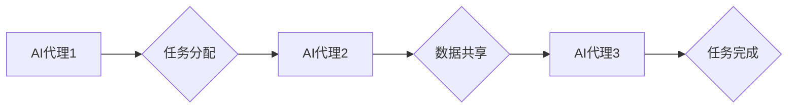

> AI代理,工作流,分布式,同步,数据共享,人工智能,协作,数据一致性

## 1. 背景介绍

随着人工智能技术的飞速发展，AI代理作为一种智能化的软件实体，在自动化决策、任务执行和用户交互等领域展现出巨大的潜力。然而，随着代理数量的增加和任务复杂度的提升，如何实现代理之间的协作、同步和数据共享成为一个关键挑战。

传统的集中式代理架构存在着单点故障风险、资源利用率低和扩展性差等问题。分布式AI代理架构则通过将代理分散部署在多个节点上，可以有效解决这些问题，提高系统的可靠性和可扩展性。

然而，分布式AI代理架构也面临着新的挑战，例如代理之间的同步机制、数据一致性问题和通信效率问题。

## 2. 核心概念与联系

### 2.1 AI代理

AI代理是一种能够感知环境、做出决策并执行行动的智能软件实体。它可以独立完成任务，也可以与其他代理协作完成复杂的任务。

### 2.2 工作流

工作流是一种描述业务流程的模型，它将任务分解成一系列步骤，并定义了步骤之间的依赖关系。

### 2.3 分布式AI代理

分布式AI代理是指将多个AI代理分散部署在多个节点上，并通过网络进行通信和协作的架构。

### 2.4 同步与数据共享

同步是指代理之间协调执行任务，确保任务的顺序和一致性。数据共享是指代理之间共享数据，以便更好地完成任务。

**Mermaid 流程图**



## 3. 核心算法原理 & 具体操作步骤

### 3.1  算法原理概述

本方案采用基于事件驱动的分布式工作流引擎，实现AI代理之间的同步和数据共享。

工作流引擎负责管理任务分配、代理调度和数据流转。

当一个任务被提交到工作流引擎时，引擎会根据任务的类型和代理的可用性，将任务分配给合适的代理。

代理完成任务后，会将结果数据返回给工作流引擎，引擎会将数据转发给下一个需要使用该数据的代理。

### 3.2  算法步骤详解

1. **任务提交:** 用户或系统提交一个任务到工作流引擎。
2. **任务解析:** 工作流引擎解析任务的类型、依赖关系和所需资源。
3. **代理调度:** 工作流引擎根据任务的属性和代理的可用性，选择合适的代理执行任务。
4. **任务执行:** 代理接收到任务后，执行相应的逻辑，并生成任务结果。
5. **数据共享:** 代理将任务结果数据发送到工作流引擎。
6. **数据转发:** 工作流引擎根据任务依赖关系，将数据转发给下一个需要使用该数据的代理。
7. **任务完成:** 所有依赖的任务都完成之后，工作流引擎将任务标记为完成。

### 3.3  算法优缺点

**优点:**

* **可扩展性:** 可以根据需要增加代理数量，提高系统的处理能力。
* **可靠性:** 代理之间相互独立，如果一个代理出现故障，不会影响其他代理的正常工作。
* **灵活性:** 可以根据不同的任务需求，灵活配置代理和工作流。

**缺点:**

* **复杂性:** 分布式系统的设计和维护比集中式系统更加复杂。
* **同步问题:** 需要解决代理之间的同步机制，确保任务的顺序和一致性。
* **数据一致性:** 需要保证数据在不同代理之间的一致性。

### 3.4  算法应用领域

* **自动化决策:** 在金融、医疗、物流等领域，可以利用AI代理自动完成决策任务。
* **任务调度:** 在云计算、大数据等领域，可以利用AI代理自动调度任务，提高资源利用率。
* **用户交互:** 在聊天机器人、虚拟助手等领域，可以利用AI代理与用户进行交互，提供个性化服务。

## 4. 数学模型和公式 & 详细讲解 & 举例说明

### 4.1  数学模型构建

假设有N个AI代理，每个代理都有一个状态变量s，表示代理当前的状态。

代理之间的交互可以表示为一个状态转移图，其中每个节点代表一个代理的状态，每个边代表代理之间的交互。

状态转移图可以表示为一个状态转移函数：

$$s_t = f(s_{t-1}, a_t)$$

其中：

* $s_t$ 是代理在时间t的状态。
* $s_{t-1}$ 是代理在时间t-1的状态。
* $a_t$ 是代理在时间t接收到的动作。

### 4.2  公式推导过程

为了保证数据一致性，需要设计一个数据同步机制。

一个简单的同步机制是采用广播机制，即当一个代理更新数据时，会将数据广播给所有其他代理。

广播机制的复杂度为O(N)，其中N是代理的数量。

为了降低复杂度，可以采用分层同步机制，将代理分成多个层次，每个层次的代理之间进行同步，然后将同步结果向上级层次传递。

### 4.3  案例分析与讲解

假设有两个AI代理，代理1负责收集数据，代理2负责分析数据。

代理1收集到数据后，会将数据广播给代理2。

代理2接收到数据后，会进行分析，并生成分析结果。

分析结果可以被其他代理使用，例如，可以被用于决策或控制其他系统。

## 5. 项目实践：代码实例和详细解释说明

### 5.1  开发环境搭建

本项目使用Python语言开发，并使用以下工具：

* **Python 3.x:** 编程语言
* **Flask:** Web框架
* **Redis:** 数据存储和缓存
* **RabbitMQ:** 消息队列

### 5.2  源代码详细实现

```python
# 代理1代码示例
from flask import Flask, request, jsonify
import redis

app = Flask(__name__)
redis_client = redis.Redis(host='localhost', port=6379, db=0)

@app.route('/collect_data', methods=['POST'])
def collect_data():
    data = request.get_json()
    redis_client.set('data', data)
    return jsonify({'status': 'success'})

if __name__ == '__main__':
    app.run(debug=True)

# 代理2代码示例
from flask import Flask, jsonify
import redis

app = Flask(__name__)
redis_client = redis.Redis(host='localhost', port=6379, db=0)

@app.route('/analyze_data', methods=['GET'])
def analyze_data():
    data = redis_client.get('data')
    # 对数据进行分析
    # ...
    return jsonify({'analysis_result': '...'})

if __name__ == '__main__':
    app.run(debug=True)
```

### 5.3  代码解读与分析

* 代理1负责收集数据，并将数据存储到Redis数据库中。
* 代理2负责从Redis数据库中获取数据，并进行分析。
* 两个代理之间通过HTTP请求进行通信。

### 5.4  运行结果展示

当用户向代理1发送数据收集请求时，代理1会将数据存储到Redis数据库中。

当用户向代理2发送数据分析请求时，代理2会从Redis数据库中获取数据，并进行分析，返回分析结果。

## 6. 实际应用场景

### 6.1  智能客服系统

在智能客服系统中，多个AI代理可以协作完成客户服务任务。

例如，一个代理负责识别客户问题，另一个代理负责提供解决方案。

### 6.2  自动驾驶系统

在自动驾驶系统中，多个AI代理可以协作完成驾驶任务。

例如，一个代理负责感知周围环境，另一个代理负责控制车辆行驶。

### 6.3  工业自动化

在工业自动化中，多个AI代理可以协作完成生产任务。

例如，一个代理负责监控生产设备，另一个代理负责控制生产流程。

### 6.4  未来应用展望

随着人工智能技术的不断发展，分布式AI代理架构将在更多领域得到应用，例如：

* **医疗诊断:** 多个AI代理可以协作完成疾病诊断。
* **金融风险管理:** 多个AI代理可以协作完成金融风险评估。
* **个性化教育:** 多个AI代理可以协作提供个性化教育服务。

## 7. 工具和资源推荐

### 7.1  学习资源推荐

* **书籍:**
    * 《人工智能：现代方法》
    * 《深度学习》
* **在线课程:**
    * Coursera: 人工智能
    * edX: 深度学习
* **博客:**
    * OpenAI Blog
    * Google AI Blog

### 7.2  开发工具推荐

* **Python:** 编程语言
* **TensorFlow:** 深度学习框架
* **PyTorch:** 深度学习框架
* **Kubernetes:** 集群管理工具

### 7.3  相关论文推荐

* **《分布式人工智能代理的同步与数据共享》**
* **《基于事件驱动的分布式工作流引擎》**
* **《人工智能代理的协作与决策》**

## 8. 总结：未来发展趋势与挑战

### 8.1  研究成果总结

本方案提出了一种基于事件驱动的分布式AI代理架构，并设计了同步和数据共享机制。

该架构具有可扩展性、可靠性和灵活性等优点，可以应用于各种场景。

### 8.2  未来发展趋势

* **更智能的代理:** 未来，AI代理将更加智能，能够自主学习和决策。
* **更复杂的协作:** 未来，AI代理将能够进行更复杂的协作，例如，协同完成大型任务。
* **更安全的系统:** 未来，分布式AI代理系统将更加安全，能够有效防止攻击和数据泄露。

### 8.3  面临的挑战

* **数据安全:** 如何保证数据在分布式系统中的安全传输和存储。
* **系统可靠性:** 如何提高分布式系统的可靠性和容错性。
* **算法效率:** 如何提高算法的效率，降低系统资源消耗。

### 8.4  研究展望

未来，我们将继续研究分布式AI代理架构，探索更智能、更安全、更高效的代理协作机制。

## 9. 附录：常见问题与解答

**问题1:** 如何保证数据在分布式系统中的一致性？

**解答:** 可以采用数据同步机制，例如广播机制或分层同步机制，保证数据在不同代理之间的一致性。

**问题2:** 如何提高分布式系统的可靠性？

**解答:** 可以采用冗余机制，例如部署多个代理实例，并使用负载均衡器进行代理调度，提高系统的容错性。

**问题3:** 如何降低分布式系统的资源消耗？

**解答:** 可以采用高效的算法和数据结构，并优化系统架构，降低系统的资源消耗。


作者：禅与计算机程序设计艺术 / Zen and the Art of Computer Programming 
<end_of_turn>