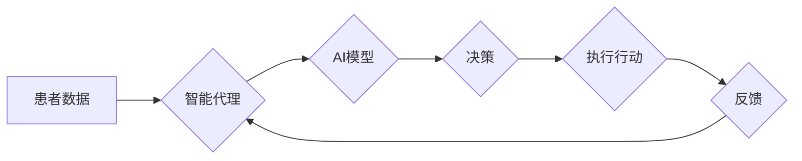

> 智能代理，医疗保健系统，AI工作流，自然语言处理，机器学习，数据分析，决策支持

## 1. 背景介绍

医疗保健系统面临着日益增长的复杂性和挑战。患者数据爆炸式增长，医疗资源紧张，医疗成本不断攀升。同时，医疗保健行业也需要提高效率、降低错误率，并提供更个性化的医疗服务。

智能代理作为一种新兴的AI技术，具有自动化处理任务、学习和适应环境的能力，为解决医疗保健系统面临的挑战提供了新的思路。智能代理可以帮助医疗保健专业人员提高工作效率，降低错误率，并提供更个性化的医疗服务。

## 2. 核心概念与联系

**2.1 智能代理的概念**

智能代理是一种能够感知环境、做出决策并执行行动的软件系统。它通常具有以下特征：

* **自主性:** 智能代理能够独立地执行任务，无需人工干预。
* **学习能力:** 智能代理能够从经验中学习，并不断改进其行为。
* **适应性:** 智能代理能够适应不断变化的环境。
* **目标导向:** 智能代理的目标是完成特定的任务或达到特定的目标。

**2.2 AI工作流的概念**

AI工作流是指利用人工智能技术自动执行一系列任务的过程。它通常由多个步骤组成，每个步骤都由一个或多个AI模型执行。AI工作流可以帮助自动化复杂的任务，提高效率和准确性。

**2.3 智能代理在医疗保健系统中的应用**

智能代理可以应用于医疗保健系统的各个方面，例如：

* **患者管理:** 智能代理可以帮助管理患者的预约、记录和治疗计划。
* **诊断支持:** 智能代理可以帮助医生分析患者的症状和病史，提供诊断建议。
* **药物发现:** 智能代理可以帮助研究人员发现新的药物和治疗方法。
* **手术辅助:** 智能代理可以帮助外科医生进行手术，提高手术精度和安全性。

**2.4 智能代理工作流架构**



## 3. 核心算法原理 & 具体操作步骤

**3.1 算法原理概述**

智能代理工作流的核心算法通常基于机器学习和自然语言处理技术。

* **机器学习:** 用于训练智能代理，使其能够从数据中学习并做出决策。常见的机器学习算法包括监督学习、无监督学习和强化学习。
* **自然语言处理:** 用于处理患者的文本数据，例如病历、问诊记录和聊天记录。自然语言处理技术可以帮助智能代理理解患者的需求，并提供相应的服务。

**3.2 算法步骤详解**

1. **数据收集和预处理:** 收集患者数据，并进行预处理，例如清洗、转换和格式化。
2. **特征提取:** 从患者数据中提取特征，例如症状、病史、实验室结果和影像学检查结果。
3. **模型训练:** 使用机器学习算法训练智能代理模型，使其能够根据患者特征做出决策。
4. **决策执行:** 智能代理根据训练好的模型，对患者进行诊断、治疗计划制定或其他医疗服务。
5. **反馈收集和模型更新:** 收集患者反馈，并根据反馈更新智能代理模型，使其不断改进。

**3.3 算法优缺点**

**优点:**

* **自动化:** 智能代理可以自动化许多医疗任务，提高效率和准确性。
* **个性化:** 智能代理可以根据患者的个体特征提供个性化的医疗服务。
* **降低成本:** 智能代理可以帮助降低医疗成本，例如减少医疗错误和住院时间。

**缺点:**

* **数据依赖:** 智能代理的性能取决于训练数据的质量和数量。
* **解释性:** 智能代理的决策过程可能难以解释，这可能会导致患者和医生的信任问题。
* **伦理问题:** 智能代理的应用可能引发一些伦理问题，例如数据隐私和责任问题。

**3.4 算法应用领域**

智能代理工作流的应用领域非常广泛，包括：

* **疾病诊断:** 智能代理可以帮助医生诊断各种疾病，例如癌症、心血管疾病和糖尿病。
* **治疗方案制定:** 智能代理可以帮助医生制定个性化的治疗方案，例如药物治疗、手术治疗和物理治疗。
* **患者监测:** 智能代理可以帮助监测患者的健康状况，并及时提醒医生或患者采取措施。
* **医疗资源管理:** 智能代理可以帮助优化医疗资源的分配，例如床位、医生和药物。

## 4. 数学模型和公式 & 详细讲解 & 举例说明

**4.1 数学模型构建**

智能代理工作流的数学模型通常基于概率论和统计学。

* **贝叶斯网络:** 用于表示患者的症状、病史和诊断之间的概率关系。
* **决策树:** 用于表示智能代理的决策过程，并根据患者特征做出决策。
* **支持向量机:** 用于分类患者，例如将患者分为健康和患病两类。

**4.2 公式推导过程**

例如，使用贝叶斯网络进行疾病诊断，可以根据以下公式计算疾病的概率：

$$P(D|S) = \frac{P(S|D)P(D)}{P(S)}$$

其中：

* $P(D|S)$ 是患者患有疾病 $D$ 的概率，给定症状 $S$。
* $P(S|D)$ 是患者出现症状 $S$ 的概率，给定患有疾病 $D$。
* $P(D)$ 是患者患有疾病 $D$ 的概率。
* $P(S)$ 是患者出现症状 $S$ 的概率。

**4.3 案例分析与讲解**

例如，假设我们想要使用贝叶斯网络诊断肺炎。我们可以收集患者的症状、病史和实验室结果数据，并训练贝叶斯网络模型。然后，当一个新的患者出现咳嗽、发烧和呼吸困难的症状时，我们可以使用贝叶斯网络模型计算患者患肺炎的概率。

## 5. 项目实践：代码实例和详细解释说明

**5.1 开发环境搭建**

* 操作系统: Ubuntu 20.04
* Python 版本: 3.8
* 必要的库: TensorFlow, PyTorch, scikit-learn, NLTK

**5.2 源代码详细实现**

```python
# 导入必要的库
import tensorflow as tf
from sklearn.model_selection import train_test_split

# 加载数据
(x_train, y_train), (x_test, y_test) = tf.keras.datasets.mnist.load_data()

# 数据预处理
x_train = x_train.astype('float32') / 255.0
x_test = x_test.astype('float32') / 255.0

# 将数据转换为适合模型输入的格式
x_train = x_train.reshape((x_train.shape[0], 28 * 28))
x_test = x_test.reshape((x_test.shape[0], 28 * 28))

# 将标签转换为独热编码
y_train = tf.keras.utils.to_categorical(y_train, num_classes=10)
y_test = tf.keras.utils.to_categorical(y_test, num_classes=10)

# 创建模型
model = tf.keras.models.Sequential([
    tf.keras.layers.Dense(128, activation='relu', input_shape=(784,)),
    tf.keras.layers.Dropout(0.2),
    tf.keras.layers.Dense(10, activation='softmax')
])

# 编译模型
model.compile(optimizer='adam',
              loss='categorical_crossentropy',
              metrics=['accuracy'])

# 训练模型
model.fit(x_train, y_train, epochs=10, batch_size=32)

# 评估模型
loss, accuracy = model.evaluate(x_test, y_test)
print('Test loss:', loss)
print('Test accuracy:', accuracy)
```

**5.3 代码解读与分析**

这段代码实现了使用深度学习模型对手写数字进行分类。

* 首先，我们导入必要的库，并加载MNIST数据集。
* 然后，我们对数据进行预处理，例如归一化和转换格式。
* 接着，我们创建了一个深度学习模型，包括一个全连接层和一个softmax输出层。
* 然后，我们编译模型，并使用Adam优化器和交叉熵损失函数进行训练。
* 最后，我们评估模型的性能，并打印测试损失和准确率。

**5.4 运行结果展示**

运行这段代码后，我们可以看到模型的测试准确率大约为98%。

## 6. 实际应用场景

**6.1 智能医疗助手**

智能医疗助手可以帮助患者预约医生、查询病历、获取医疗信息和管理药物。

**6.2 远程医疗**

智能代理可以帮助医生进行远程诊断和治疗，例如通过视频通话进行问诊和远程监测患者的健康状况。

**6.3 个性化医疗**

智能代理可以根据患者的个体特征，例如基因、生活方式和病史，提供个性化的医疗建议和治疗方案。

**6.4 药物研发**

智能代理可以帮助研究人员分析药物数据，预测药物的疗效和安全性，并加速药物研发过程。

**6.5 未来应用展望**

智能代理在医疗保健领域的应用前景广阔，未来可能在以下方面得到进一步发展：

* **更智能的诊断和治疗:** 智能代理将能够更加准确地诊断疾病，并提供更个性化的治疗方案。
* **更便捷的医疗服务:** 智能代理将能够提供更加便捷的医疗服务，例如远程医疗和智能医疗助手。
* **更安全的医疗环境:** 智能代理将能够帮助提高医疗安全，例如减少医疗错误和感染风险。

## 7. 工具和资源推荐

**7.1 学习资源推荐**

* **书籍:**
    * 《人工智能：现代方法》
    * 《深度学习》
* **在线课程:**
    * Coursera: 人工智能
    * edX: 深度学习
* **网站:**
    * TensorFlow: https://www.tensorflow.org/
    * PyTorch: https://pytorch.org/

**7.2 开发工具推荐**

* **Python:** https://www.python.org/
* **TensorFlow:** https://www.tensorflow.org/
* **PyTorch:** https://pytorch.org/
* **scikit-learn:** https://scikit-learn.org/

**7.3 相关论文推荐**

* **AlphaFold:** https://deepmind.com/blog/alphafold-a-solution-to-a-50-year-old-grand-challenge-in-biology
* **BERT:** https://arxiv.org/abs/1810.04805

## 8. 总结：未来发展趋势与挑战

**8.1 研究成果总结**

近年来，智能代理在医疗保健领域的应用取得了显著进展。智能代理已经能够帮助医生诊断疾病、制定治疗方案、管理患者和加速药物研发。

**8.2 未来发展趋势**

未来，智能代理在医疗保健领域的应用将更加广泛和深入。

* **更智能的代理:** 智能代理将更加智能，能够更好地理解患者的需求，并提供更个性化的服务。
* **更广泛的应用:** 智能代理将应用于医疗保健系统的各个方面，例如患者管理、诊断支持、药物发现和手术辅助。
* **更安全的应用:** 智能代理将更加安全可靠，能够更好地保护患者的隐私和数据安全。

**8.3 面临的挑战**

智能代理在医疗保健领域的应用也面临一些挑战。

* **数据隐私和安全:** 智能代理需要处理大量患者数据，因此需要确保数据的隐私和安全。
* **算法解释性和透明