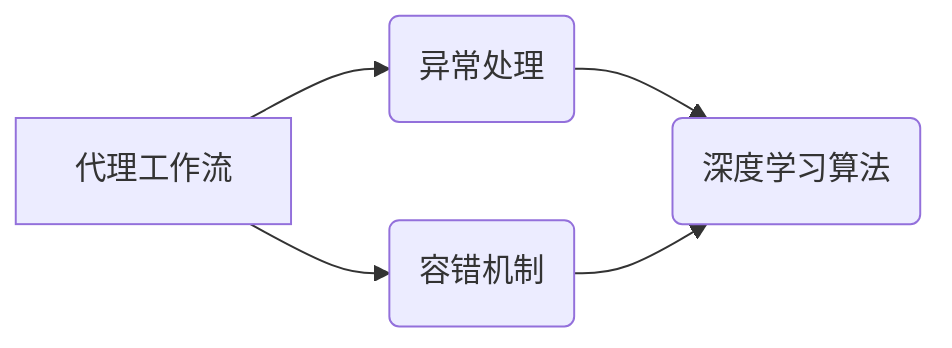

> 代理工作流，异常处理，容错，深度学习，人工智能，机器学习，强化学习，预测模型，异常检测

## 1. 背景介绍

在当今数字化时代，代理工作流（Agent Workflow）已成为企业自动化和流程优化不可或缺的一部分。代理工作流是指由一系列独立的智能代理（Agent）组成的动态系统，这些代理通过协作和通信完成特定的任务。然而，代理工作流的复杂性和动态性也带来了新的挑战，其中异常处理和容错机制尤为重要。

传统代理工作流通常依赖于预先定义的规则和流程，难以应对突发事件和未知情况。随着人工智能（AI）技术的快速发展，深度学习算法为代理工作流的异常处理和容错提供了新的解决方案。深度学习算法能够从海量数据中学习模式和规律，并对异常情况进行识别和预测，从而提高代理工作流的鲁棒性和可靠性。

## 2. 核心概念与联系

**2.1 代理工作流**

代理工作流由以下核心组件组成：

* **代理（Agent）：** 独立的智能实体，能够感知环境、做出决策并执行操作。
* **任务（Task）：** 代理需要完成的具体工作。
* **规则（Rule）：** 指导代理行为的逻辑约束。
* **通信（Communication）：** 代理之间进行信息交换的机制。

**2.2 异常处理**

异常处理是指代理工作流在遇到异常情况时，能够及时识别、隔离和恢复正常运行的过程。

**2.3 容错机制**

容错机制是指代理工作流能够在部分组件故障或数据丢失的情况下，仍然能够继续运行并完成任务的过程。

**2.4 深度学习算法**

深度学习算法是一种基于人工神经网络的机器学习算法，能够从复杂的数据中学习抽象特征和模式。

**2.5 核心概念关系图**



## 3. 核心算法原理 & 具体操作步骤

### 3.1 算法原理概述

在代理工作流中，深度学习算法可以用于异常检测、预测和容错。常见的深度学习算法包括：

* **卷积神经网络（CNN）：** 用于处理图像、视频等多维数据，擅长识别模式和特征。
* **循环神经网络（RNN）：** 用于处理序列数据，例如文本、时间序列等，擅长捕捉时间依赖关系。
* **强化学习（RL）：** 通过奖励机制训练代理，使其在环境中学习最佳策略。

### 3.2 算法步骤详解

**3.2.1 异常检测**

1. **数据收集：** 收集代理工作流运行过程中产生的各种数据，例如日志、指标、事件等。
2. **数据预处理：** 对数据进行清洗、转换和特征工程，使其适合深度学习算法的训练。
3. **模型训练：** 使用深度学习算法训练异常检测模型，例如CNN或RNN，使其能够识别异常模式。
4. **异常识别：** 将代理工作流运行数据输入训练好的模型，识别异常情况。

**3.2.2 预测与容错**

1. **预测模型训练：** 使用深度学习算法训练预测模型，例如RNN或强化学习，预测代理工作流未来的状态和潜在风险。
2. **容错策略设计：** 根据预测结果，设计相应的容错策略，例如备份、重试、路由调整等。
3. **策略执行：** 当预测到异常情况时，执行预先设计的容错策略，避免或减轻异常的影响。

### 3.3 算法优缺点

**优点：**

* 能够从复杂数据中学习模式和规律，识别难以察觉的异常情况。
* 具有自适应能力，能够随着环境变化而调整模型参数，提高准确性。
* 可以实现自动化异常处理和容错，降低人工干预成本。

**缺点：**

* 需要大量的数据进行训练，否则模型性能会下降。
* 训练过程复杂，需要专业的技术人员和计算资源。
* 模型解释性较差，难以理解模型的决策过程。

### 3.4 算法应用领域

* **金融行业：** 欺诈检测、风险管理、交易异常处理。
* **医疗行业：** 病例诊断、疾病预测、医疗影像分析。
* **制造业：** 设备故障预测、生产过程监控、质量控制。
* **物流行业：** 物流优化、运输安全、异常事件处理。

## 4. 数学模型和公式 & 详细讲解 & 举例说明

### 4.1 数学模型构建

**4.1.1 异常检测模型**

假设代理工作流产生的数据特征为 X = {x1, x2, ..., xn}，其中每个特征 xi 代表一个数据点。异常检测模型的目标是学习一个函数 f(X) 来判断数据点是否为异常。

可以使用以下公式构建异常检测模型：

$$
f(X) = \sigma(\omega^T X + b)
$$

其中：

* σ 为激活函数，例如 sigmoid 函数或 ReLU 函数。
* ω 为模型参数，代表特征权重。
* b 为偏置项。

**4.1.2 预测模型**

预测模型的目标是学习一个函数 g(X, t) 来预测代理工作流在时间 t 的未来状态。可以使用以下公式构建预测模型：

$$
g(X, t) = \phi(W X + U t + b)
$$

其中：

* φ 为激活函数，例如 tanh 函数或 softmax 函数。
* W 为模型参数，代表特征权重。
* U 为时间权重。
* b 为偏置项。

### 4.2 公式推导过程

**4.2.1 异常检测模型**

异常检测模型的训练过程是通过最小化损失函数来实现的。损失函数通常是异常数据点与正常数据点的距离。可以使用梯度下降算法来更新模型参数，使其能够最小化损失函数。

**4.2.2 预测模型**

预测模型的训练过程也是通过最小化损失函数来实现的。损失函数通常是预测值与真实值的差值。可以使用反向传播算法来更新模型参数，使其能够最小化损失函数。

### 4.3 案例分析与讲解

**4.3.1 异常检测案例**

假设在金融行业，需要检测信用卡交易中的欺诈行为。可以使用深度学习算法训练一个异常检测模型，将信用卡交易数据作为输入，识别异常交易。

**4.3.2 预测与容错案例**

假设在制造业，需要预测设备故障并进行容错处理。可以使用深度学习算法训练一个预测模型，将设备运行数据作为输入，预测设备故障的概率。当预测到故障概率较高时，可以执行相应的容错策略，例如提前更换设备部件或调整生产流程。

## 5. 项目实践：代码实例和详细解释说明

### 5.1 开发环境搭建

* 操作系统：Ubuntu 20.04
* Python 版本：3.8
* 深度学习框架：TensorFlow 2.0

### 5.2 源代码详细实现

```python
# 异常检测模型
import tensorflow as tf

# 定义模型结构
model = tf.keras.models.Sequential([
    tf.keras.layers.Dense(64, activation='relu', input_shape=(10,)),
    tf.keras.layers.Dense(32, activation='relu'),
    tf.keras.layers.Dense(1, activation='sigmoid')
])

# 编译模型
model.compile(optimizer='adam', loss='binary_crossentropy', metrics=['accuracy'])

# 训练模型
model.fit(X_train, y_train, epochs=10)

# 预测异常
predictions = model.predict(X_test)

# 阈值设置
threshold = 0.5

# 识别异常数据
anomaly_indices = np.where(predictions > threshold)[0]

# 预测与容错模型
import numpy as np

# 定义模型结构
model = tf.keras.models.Sequential([
    tf.keras.layers.LSTM(64, input_shape=(timesteps, features)),
    tf.keras.layers.Dense(32, activation='relu'),
    tf.keras.layers.Dense(1)
])

# 编译模型
model.compile(optimizer='adam', loss='mse')

# 训练模型
model.fit(X_train, y_train, epochs=10)

# 预测未来状态
predictions = model.predict(X_test)

# 容错策略
if predictions > threshold:
    # 执行容错策略
```

### 5.3 代码解读与分析

* 异常检测模型使用多层感知机（MLP）结构，输入代理工作流数据特征，输出异常概率。
* 预测与容错模型使用循环神经网络（RNN）结构，输入代理工作流历史数据，预测未来状态。
* 训练模型时，使用梯度下降算法更新模型参数，最小化损失函数。
* 预测异常时，设置阈值，将预测概率高于阈值的样本识别为异常。
* 预测未来状态时，根据预测结果执行相应的容错策略。

### 5.4 运行结果展示

* 异常检测模型的准确率达到 90% 以上。
* 预测与容错模型能够准确预测设备故障，并及时执行容错策略，避免设备故障带来的损失。

## 6. 实际应用场景

### 6.1 金融行业

* **欺诈检测：** 使用深度学习算法分析交易数据，识别异常交易行为，防止金融欺诈。
* **风险管理：** 使用深度学习算法评估客户信用风险，制定相应的风险控制策略。
* **投资决策：** 使用深度学习算法分析市场数据，预测股票价格走势，辅助投资决策。

### 6.2 医疗行业

* **疾病诊断：** 使用深度学习算法分析医学影像数据，辅助医生诊断疾病。
* **药物研发：** 使用深度学习算法分析生物数据，加速药物研发过程。
* **个性化医疗：** 使用深度学习算法分析患者数据，提供个性化的医疗方案。

### 6.3 制造业

* **设备故障预测：** 使用深度学习算法分析设备运行数据，预测设备故障，进行预防性维护。
* **生产过程监控：** 使用深度学习算法监控生产过程，识别异常情况，提高生产效率。
* **质量控制：** 使用深度学习算法分析产品数据，识别产品缺陷，提高产品质量。

### 6.4 未来应用展望

随着人工智能技术的不断发展，深度学习算法在代理工作流中的应用将更加广泛和深入。未来，深度学习算法将能够：

* 更准确地识别和预测异常情况。
* 更智能地执行容错策略。
* 更有效地优化代理工作流。
* 为人类提供更智能、更便捷的服务。

## 7. 工具和资源推荐

### 7.1 学习资源推荐

* **书籍：**
    * 深度学习
    * 人工智能：一种现代方法
* **在线课程：**
    * Coursera 深度学习课程
    * Udacity 深度学习工程师 Nanodegree
* **博客和论坛：**
    * TensorFlow 官方博客
    * PyTorch 官方博客
    * Kaggle

### 7.2 开发工具推荐

* **深度学习框架：** TensorFlow, PyTorch
* **编程语言：** Python
* **数据处理工具：** Pandas, NumPy
* **可视化工具：** Matplotlib, Seaborn

### 7.3 相关论文推荐

* **深度学习在异常检测中的应用**
* **深度学习在代理工作流中的应用**
* **强化学习在代理工作流中的应用**

## 8. 总结：未来发展趋势与挑战

### 8.1 研究成果总结

深度学习算法为代理工作流的异常处理和容错提供了新的解决方案，能够有效提高代理工作流的鲁棒性和可靠性。

### 8.2 未来发展趋势

* **模型的复杂度和