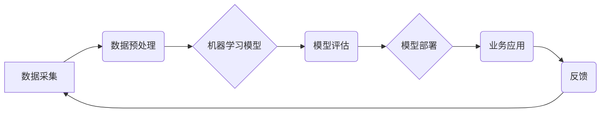

>  人工智能、企业发展、机器学习、深度学习、数据驱动、自动化、伦理

## 1. 背景介绍

人工智能（AI）正以惊人的速度发展，深刻地改变着各行各业。从医疗保健到金融，从制造业到零售，AI技术的应用正在创造新的价值，提高效率，优化流程。对于企业而言，拥抱AI已经不再是选择，而是生存和发展的必然趋势。

然而，AI技术的应用并非一帆风顺。企业在实施AI战略时面临着诸多挑战，例如数据获取和管理、算法模型的开发和部署、人才短缺以及伦理和社会影响等。

## 2. 核心概念与联系

**2.1  人工智能（AI）**

人工智能是指模拟人类智能行为的计算机系统。它涵盖了广泛的领域，包括机器学习、深度学习、自然语言处理、计算机视觉等。

**2.2  机器学习（ML）**

机器学习是人工智能的一个子领域，它使计算机能够从数据中学习，无需明确编程。机器学习算法通过分析数据模式，识别趋势和规律，从而进行预测、分类和决策。

**2.3  深度学习（DL）**

深度学习是机器学习的一个更高级的子领域，它使用多层神经网络来模拟人类大脑的学习过程。深度学习算法能够处理海量数据，学习复杂的模式，从而在图像识别、语音识别、自然语言处理等领域取得突破性进展。

**2.4  数据驱动**

数据是AI发展的基石。AI算法的性能直接取决于数据的质量和数量。企业需要收集、存储、清洗和分析海量数据，才能为AI模型提供充足的训练数据。

**2.5  自动化**

AI可以自动化许多重复性、耗时的任务，例如数据录入、报表生成、客户服务等。自动化可以提高效率，降低成本，释放人力资源用于更具创造性和战略性的工作。

**2.6  伦理与社会影响**

AI技术的应用也引发了一些伦理和社会问题，例如算法偏见、隐私泄露、工作岗位替代等。企业需要在开发和应用AI技术时，充分考虑这些问题，并制定相应的伦理规范和社会责任。

**2.7  AI企业架构**



## 3. 核心算法原理 & 具体操作步骤

### 3.1  算法原理概述

机器学习算法的核心原理是通过学习数据中的模式和规律，建立数学模型，从而进行预测、分类和决策。常见的机器学习算法包括：

* **监督学习:** 利用标记数据训练模型，例如分类和回归问题。
* **无监督学习:** 利用未标记数据发现数据中的隐藏结构，例如聚类和降维。
* **强化学习:** 通过试错学习，在环境中获得最大奖励。

### 3.2  算法步骤详解

**3.2.1  数据预处理:**

* 数据清洗：删除缺失值、异常值和重复数据。
* 数据转换：将数据转换为适合算法处理的格式。
* 数据特征工程：提取数据中的重要特征，提高模型性能。

**3.2.2  模型选择:**

根据具体问题选择合适的机器学习算法。

**3.2.3  模型训练:**

使用训练数据训练模型，调整模型参数，使模型能够准确预测或分类。

**3.2.4  模型评估:**

使用测试数据评估模型性能，例如准确率、召回率、F1-score等。

**3.2.5  模型部署:**

将训练好的模型部署到生产环境中，用于实际应用。

### 3.3  算法优缺点

不同的机器学习算法具有不同的优缺点，需要根据具体问题选择合适的算法。

**3.3.1  监督学习算法:**

* **优点:** 准确率高，可以处理分类和回归问题。
* **缺点:** 需要大量的标记数据，对数据质量要求高。

**3.3.2  无监督学习算法:**

* **优点:** 不需要标记数据，可以发现数据中的隐藏结构。
* **缺点:** 难以评估模型性能，结果解释性较差。

**3.3.3  强化学习算法:**

* **优点:** 可以解决复杂的任务，例如游戏和机器人控制。
* **缺点:** 训练时间长，需要大量的试错学习。

### 3.4  算法应用领域

机器学习算法广泛应用于各个领域，例如：

* **医疗保健:** 疾病诊断、药物研发、个性化医疗。
* **金融:** 欺诈检测、风险评估、投资决策。
* **制造业:** 质量控制、预测维护、生产优化。
* **零售:** 商品推荐、客户画像、库存管理。

## 4. 数学模型和公式 & 详细讲解 & 举例说明

### 4.1  数学模型构建

机器学习模型通常是一个数学函数，它将输入数据映射到输出结果。例如，线性回归模型的数学表达式为：

$$y = w_0 + w_1x_1 + w_2x_2 + ... + w_nx_n$$

其中：

* $y$ 是输出结果
* $w_0, w_1, w_2, ..., w_n$ 是模型参数
* $x_1, x_2, ..., x_n$ 是输入特征

### 4.2  公式推导过程

机器学习模型的参数可以通过优化算法来调整。常用的优化算法包括梯度下降法、随机梯度下降法和Adam算法等。这些算法的目标是找到使模型预测误差最小的参数值。

### 4.3  案例分析与讲解

**4.3.1  线性回归案例:**

假设我们想要预测房屋价格，输入特征包括房屋面积、房间数量和地理位置等。我们可以使用线性回归模型来建立房屋价格与输入特征之间的关系。通过训练数据，我们可以找到最佳的模型参数，从而预测新房子的价格。

**4.3.2  逻辑回归案例:**

假设我们想要预测客户是否会购买产品，输入特征包括客户年龄、收入和购买历史等。我们可以使用逻辑回归模型来预测客户购买概率。逻辑回归模型将输入特征映射到0到1之间的概率值，从而判断客户是否会购买产品。

## 5. 项目实践：代码实例和详细解释说明

### 5.1  开发环境搭建

* Python 3.x
* TensorFlow 或 PyTorch
* Jupyter Notebook

### 5.2  源代码详细实现

```python
import tensorflow as tf

# 定义模型
model = tf.keras.models.Sequential([
    tf.keras.layers.Dense(64, activation='relu', input_shape=(784,)),
    tf.keras.layers.Dense(10, activation='softmax')
])

# 编译模型
model.compile(optimizer='adam',
              loss='sparse_categorical_crossentropy',
              metrics=['accuracy'])

# 训练模型
model.fit(x_train, y_train, epochs=10)

# 评估模型
loss, accuracy = model.evaluate(x_test, y_test)
print('Test loss:', loss)
print('Test accuracy:', accuracy)
```

### 5.3  代码解读与分析

* **模型定义:** 使用 `tf.keras.models.Sequential` 创建一个顺序模型，包含两层全连接层。
* **激活函数:** 使用 `relu` 激活函数，可以提高模型的表达能力。
* **损失函数:** 使用 `sparse_categorical_crossentropy` 损失函数，用于分类问题。
* **优化器:** 使用 `adam` 优化器，可以快速收敛。
* **训练模型:** 使用 `model.fit` 方法训练模型，指定训练数据、 epochs 和其他参数。
* **评估模型:** 使用 `model.evaluate` 方法评估模型性能，计算测试集上的损失和准确率。

### 5.4  运行结果展示

训练完成后，可以查看模型的测试集准确率，评估模型的性能。

## 6. 实际应用场景

### 6.1  医疗保健

* **疾病诊断:** 利用机器学习算法分析患者的医疗影像、病历和基因信息，辅助医生诊断疾病。
* **药物研发:** 利用机器学习算法分析药物分子结构和生物活性，加速药物研发过程。
* **个性化医疗:** 利用机器学习算法分析患者的个人特征和健康数据，提供个性化的医疗建议和治疗方案。

### 6.2  金融

* **欺诈检测:** 利用机器学习算法分析交易数据，识别异常交易行为，防止欺诈行为。
* **风险评估:** 利用机器学习算法分析客户的信用记录和财务状况，评估客户的贷款风险。
* **投资决策:** 利用机器学习算法分析市场数据和投资策略，辅助投资决策。

### 6.3  制造业

* **质量控制:** 利用机器学习算法分析生产过程中的数据，识别产品缺陷，提高产品质量。
* **预测维护:** 利用机器学习算法分析设备运行数据，预测设备故障，进行及时维护。
* **生产优化:** 利用机器学习算法分析生产流程数据，优化生产计划和资源配置，提高生产效率。

### 6.4  未来应用展望

随着人工智能技术的不断发展，其应用场景将更加广泛，例如：

* **自动驾驶:** 利用机器学习算法实现车辆自动驾驶，提高交通安全和效率。
* **机器人技术:** 利用机器学习算法开发更智能的机器人，用于工业生产、服务业和医疗保健等领域。
* **个性化教育:** 利用机器学习算法分析学生的学习情况，提供个性化的学习方案和教学内容。

## 7. 工具和资源推荐

### 7.1  学习资源推荐

* **在线课程:** Coursera、edX、Udacity 等平台提供丰富的机器学习和深度学习课程。
* **书籍:** 《深入理解机器学习》、《深度学习》等书籍是机器学习和深度学习的经典教材。
* **博客和论坛:** 机器学习和深度学习领域的博客和论坛可以获取最新的研究成果和技术分享。

### 7.2  开发工具推荐

* **Python:** 机器学习和深度学习的常用编程语言。
* **TensorFlow:** Google 开发的开源机器学习框架。
* **PyTorch:** Facebook 开发的开源机器学习框架。
* **Scikit-learn:** Python 的机器学习库，提供各种经典机器学习算法。

### 7.3  相关论文推荐

* **《ImageNet Classification with Deep Convolutional Neural Networks》:** 
AlexNet 模型的论文，标志着深度学习在图像识别领域的突破。
* **《Attention Is All You Need》:** 
Transformer 模型的论文，引领了自然语言处理领域的变革。

## 8. 总结：未来发展趋势与挑战

### 8.1  研究成果总结

近年来，人工智能领域取得了令人瞩目的进展，例如：

* **深度学习算法的突破:** 深度学习算法在图像识别、语音识别、自然语言处理等领域取得了突破性进展。
* **大规模数据量的积累:** 互联网和物联网的快速发展，为人工智能提供了海量数据。
* **计算能力的提升:** GPU 和 TPU 等高性能计算设备的出现，加速了人工智能模型的训练和推理。

### 8.2  未来发展趋势

* **更强大的模型:** 研究人员将继续开发更强大的深度学习模型，例如 Transformer、GAN 等。
* **更广泛的应用场景:** 人工智能将应用于更多领域，例如自动驾驶、机器人技术、个性化教育等。
* **更强的解释性:** 研究人员将致力于提高人工智能模型的解释性，使模型的决策过程更加透明。

### 8.3  面临的挑战

* **数据安全和隐私:** 人工智能的应用需要大量数据，如何保护数据安全和隐私是一个重要的挑战。
* **算法偏见:** 人工智能算法可能存在偏见，导致不公平的结果。
* **伦理问题:** 人工智能的应用引发了一些伦理问题，例如工作岗位替代、人工智能的控制等。

### 8.4  研究展望

未来，人工智能研究将继续朝着更智能、更安全、更可解释的方向发展。

## 