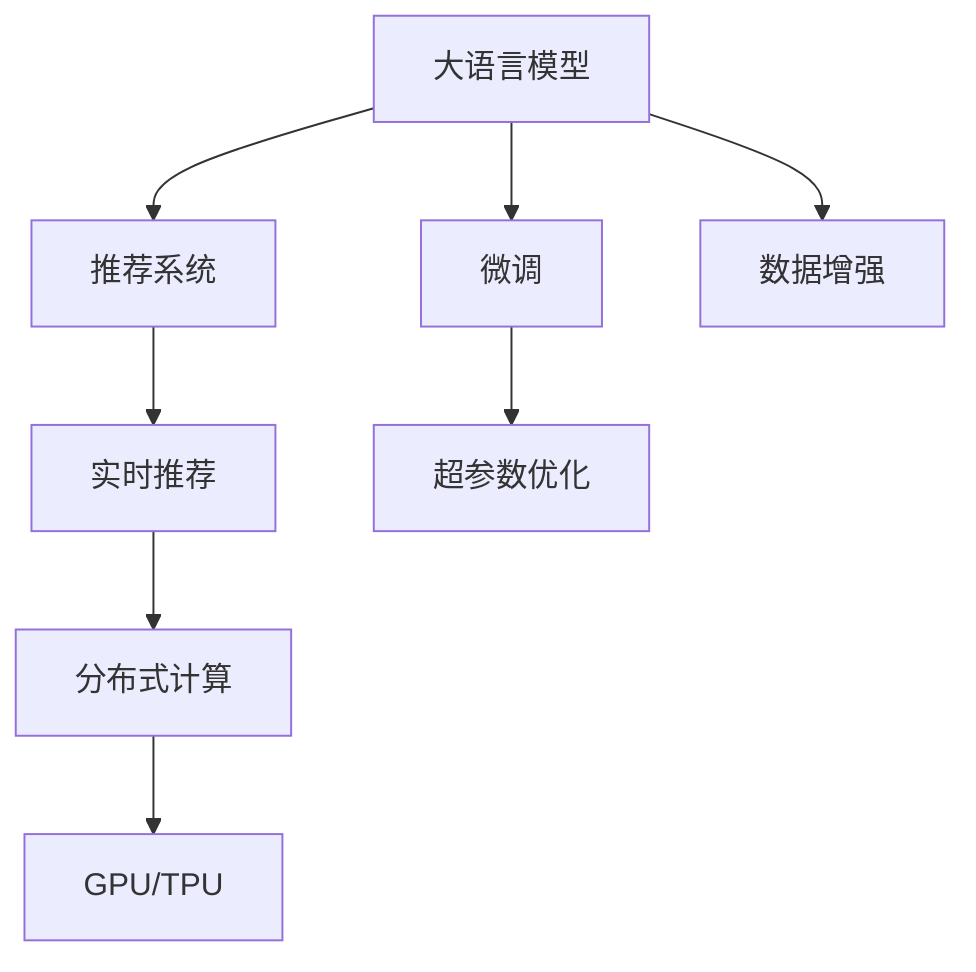

                 

# LLM对推荐系统实时性能的影响

> 关键词：大语言模型,推荐系统,实时性能,深度学习,分布式计算,内存管理,微调,超参数优化

## 1. 背景介绍

### 1.1 问题由来
推荐系统是互联网时代不可或缺的重要技术之一。它通过对用户行为数据的分析，为用户推荐可能感兴趣的物品，极大地提升了用户体验和商业价值。然而，随着推荐系统的用户基数和应用场景不断扩展，实时性能的瓶颈逐渐显现，成为制约其发展的关键因素。

传统的推荐系统基于基于协同过滤、矩阵分解等方法构建，这些方法在处理大规模数据时效率较低，难以满足实时推荐的要求。近年来，大语言模型(Large Language Model, LLM)如BERT、GPT等在NLP领域取得了巨大成功，并逐渐被引入推荐系统中，通过微调优化，以期获得更高效、更精准的推荐结果。但在大模型加入推荐系统后，实时性能问题变得尤为突出。

### 1.2 问题核心关键点
本研究聚焦于如何通过深度学习和分布式计算技术，优化基于大语言模型的推荐系统，以期提升实时性能。具体而言，我们将研究以下几个核心问题：

- 大语言模型在推荐系统中的作用和影响机制是什么？
- 如何设计高效的微调框架和算法，减小模型推理计算量？
- 如何优化推荐系统的实时性能，提升用户体验？
- 如何合理使用分布式计算技术，实现高效的模型部署和推理？

### 1.3 问题研究意义
随着深度学习技术的发展，推荐系统逐渐向深度学习推荐演进。大语言模型的引入为推荐系统注入了新的活力，显著提升了推荐系统的准确性和个性化水平。然而，大语言模型的庞大参数量和复杂的推理结构，也带来了实时性能瓶颈。因此，研究如何优化基于大语言模型的推荐系统，使其既能发挥语言模型的优势，又能满足实时推荐的要求，具有重要的理论和实践意义。

1. 降低推荐延迟。实时推荐的用户体验直接关系到用户留存率和转化率，通过优化推荐系统的实时性能，可以提升用户满意度和留存率，进而提高商业价值。
2. 提高推荐效率。通过设计高效的模型推理和存储机制，可以显著降低推荐系统的计算负担，提升推荐效率。
3. 提升推荐精准度。基于大语言模型的推荐系统，可以利用语言的上下文信息和语义关系，提高推荐精准度，进而提升用户体验。
4. 适应多模态数据。未来推荐系统将逐渐扩展到多模态数据，通过大语言模型与视觉、听觉等多模态数据的融合，可以实现更加全面、准确的推荐。
5. 优化分布式计算。随着推荐系统的规模不断扩大，分布式计算技术成为必不可少的支撑。如何高效利用分布式计算资源，优化模型部署和推理，是大语言模型推荐系统面临的重要挑战。

## 2. 核心概念与联系

### 2.1 核心概念概述

为更好地理解基于大语言模型的推荐系统优化，本节将介绍几个密切相关的核心概念：

- 大语言模型(Large Language Model, LLM)：以自回归(如GPT)或自编码(如BERT)模型为代表的大规模预训练语言模型。通过在大规模无标签文本语料上进行预训练，学习通用的语言知识和表示。
- 推荐系统(Recommendation System)：根据用户行为数据，为用户推荐可能感兴趣的物品的系统。其核心在于理解用户需求，并匹配合适的推荐结果。
- 实时推荐(Real-time Recommendation)：在用户请求时，实时计算并返回推荐结果的推荐方式，具有较高的用户交互体验。
- 分布式计算(Distributed Computing)：将计算任务分布到多台计算机上并行处理，以提高计算效率和系统可扩展性的技术。
- 微调(Fine-tuning)：在大语言模型的基础上，通过下游任务的少量标注数据，优化模型在特定任务上的性能，使其更好地适应推荐场景。
- 超参数优化(Hyperparameter Tuning)：在模型训练前，优化模型的超参数配置，以获得最优模型性能。
- GPU/TPU：图形处理单元/张量处理单元，用于加速深度学习模型的推理和训练。

这些核心概念之间的逻辑关系可以通过以下Mermaid流程图来展示：



这个流程图展示了大语言模型在推荐系统中的作用机制，以及与之相关的核心概念。

## 3. 核心算法原理 & 具体操作步骤
### 3.1 算法原理概述

基于大语言模型的推荐系统优化，本质上是通过深度学习和分布式计算技术，提升模型推理效率和实时性能。其核心思想是：通过深度学习模型对用户行为数据进行特征提取和建模，利用大语言模型的语言理解能力，进行高效的推荐计算和推理，同时通过分布式计算技术优化计算资源分配和负载均衡，实现实时推荐。

### 3.2 算法步骤详解

基于深度学习和分布式计算的大语言模型推荐系统优化，一般包括以下几个关键步骤：

**Step 1: 数据预处理与特征工程**
- 收集用户行为数据，如点击记录、浏览历史、评分等。
- 对数据进行清洗和标准化处理，去除异常值和噪声。
- 提取特征，如用户ID、物品ID、时间戳等，构建特征向量。
- 对数据进行分块，生成训练集和测试集。

**Step 2: 模型初始化与微调**
- 选择预训练语言模型，如BERT、GPT等。
- 将用户行为数据作为微调数据，进行下游任务适配。
- 设置微调的超参数，如学习率、批大小、迭代轮数等。
- 进行模型训练，优化模型在推荐场景中的性能。

**Step 3: 分布式计算与GPU/TPU加速**
- 利用分布式计算框架，如Spark、TensorFlow、PyTorch等，将计算任务分配到多台计算机上并行处理。
- 使用GPU/TPU等高性能计算设备，加速深度学习模型的推理和训练。
- 设计高效的计算图和推理流程，优化资源使用。

**Step 4: 实时推荐与模型部署**
- 实时接收用户请求，调用优化后的模型进行推荐计算。
- 将计算结果返回给用户，实现实时推荐。
- 对推荐结果进行缓存，减小计算负担，提高系统性能。

**Step 5: 系统监控与调优**
- 实时监测推荐系统的性能指标，如响应时间、吞吐量、精度等。
- 根据监控结果，调整超参数和计算资源，优化系统性能。
- 定期对模型进行微调和更新，保持模型最新状态。

以上是基于深度学习和分布式计算的大语言模型推荐系统优化的基本流程。在实际应用中，还需要针对具体任务和数据特点，对各个环节进行优化设计，如改进特征工程方法，优化模型推理算法，引入更多分布式计算技术等，以进一步提升推荐系统的性能。

### 3.3 算法优缺点

基于深度学习和分布式计算的大语言模型推荐系统优化，具有以下优点：
1. 提升推荐精准度。利用大语言模型的语言理解和语义关系，提高推荐的个性化和准确性。
2. 降低推荐延迟。通过分布式计算和GPU/TPU加速，显著提升模型推理速度，减少推荐延迟。
3. 增强系统可扩展性。利用分布式计算技术，支持大规模数据和模型的高效处理。
4. 提高用户满意度。实时推荐的用户体验直接关系到用户留存率和转化率，优化推荐性能可提升用户满意度。

同时，该方法也存在一些局限性：
1. 依赖高质量数据。微调和大模型推理对数据质量要求较高，数据清洗和预处理成本较高。
2. 计算资源消耗大。大语言模型参数量庞大，计算复杂度高，对硬件资源要求较高。
3. 模型复杂度高。大语言模型结构复杂，优化难度大，需要精细的超参数调优。
4. 实时性要求高。实时推荐对系统响应时间要求极高，需合理设计算法和架构。
5. 分布式协同困难。分布式计算中，不同节点间的通信和同步难度较大，需要合理的调度策略。

尽管存在这些局限性，但就目前而言，基于深度学习和分布式计算的大语言模型推荐系统优化，仍是大规模推荐系统中的重要方向。未来相关研究的重点在于如何进一步降低计算资源消耗，提高模型推理效率，同时兼顾推荐精准度和实时性能，保持系统稳定性。

### 3.4 算法应用领域

基于深度学习和分布式计算的大语言模型推荐系统优化，已经在多个领域得到了广泛应用，例如：

- 电商推荐：通过用户行为数据，推荐用户可能感兴趣的商品。大语言模型可以帮助理解商品描述和用户评论，提高推荐精准度。
- 视频推荐：根据用户观看历史和评分，推荐可能感兴趣的视频。大语言模型可以提取视频中的语言信息，增强推荐效果。
- 音乐推荐：通过用户听歌历史和评价，推荐可能喜欢的歌曲。大语言模型可以分析歌曲的歌词和风格，提高推荐的相关性。
- 新闻推荐：根据用户阅读历史和互动数据，推荐相关新闻文章。大语言模型可以理解新闻内容的语义关系，提高推荐的准确性。
- 旅游推荐：根据用户旅游历史和评价，推荐可能的旅游目的地。大语言模型可以分析目的地描述和用户评论，提升推荐质量。

除了上述这些经典应用外，基于深度学习和分布式计算的大语言模型推荐系统优化，也被创新性地应用到更多场景中，如个性化广告推荐、内容推荐、精准营销等，为推荐系统的性能提升带来了新的突破。

## 4. 数学模型和公式 & 详细讲解 & 举例说明
### 4.1 数学模型构建

本节将使用数学语言对基于深度学习和分布式计算的大语言模型推荐系统优化过程进行更加严格的刻画。

记用户行为数据为 $D=\{(x_i, y_i)\}_{i=1}^N$，其中 $x_i$ 为用户行为特征向量， $y_i$ 为推荐结果标签。假设大语言模型为 $M_{\theta}$，其中 $\theta$ 为模型参数。

定义模型 $M_{\theta}$ 在数据样本 $(x,y)$ 上的损失函数为 $\ell(M_{\theta}(x),y)$，则在数据集 $D$ 上的经验风险为：

$$
\mathcal{L}(\theta) = \frac{1}{N} \sum_{i=1}^N \ell(M_{\theta}(x_i),y_i)
$$

微调的优化目标是最小化经验风险，即找到最优参数：

$$
\theta^* = \mathop{\arg\min}_{\theta} \mathcal{L}(\theta)
$$

在实践中，我们通常使用基于梯度的优化算法（如SGD、Adam等）来近似求解上述最优化问题。设 $\eta$ 为学习率，$\lambda$ 为正则化系数，则参数的更新公式为：

$$
\theta \leftarrow \theta - \eta \nabla_{\theta}\mathcal{L}(\theta) - \eta\lambda\theta
$$

其中 $\nabla_{\theta}\mathcal{L}(\theta)$ 为损失函数对参数 $\theta$ 的梯度，可通过反向传播算法高效计算。

### 4.2 公式推导过程

以下我们以电商推荐任务为例，推导交叉熵损失函数及其梯度的计算公式。

假设模型 $M_{\theta}$ 在输入 $x$ 上的输出为 $\hat{y}=M_{\theta}(x) \in [0,1]$，表示用户购买该商品的概率。真实标签 $y \in \{0,1\}$。则二分类交叉熵损失函数定义为：

$$
\ell(M_{\theta}(x),y) = -[y\log \hat{y} + (1-y)\log (1-\hat{y})]
$$

将其代入经验风险公式，得：

$$
\mathcal{L}(\theta) = -\frac{1}{N}\sum_{i=1}^N [y_i\log M_{\theta}(x_i)+(1-y_i)\log(1-M_{\theta}(x_i))]
$$

根据链式法则，损失函数对参数 $\theta_k$ 的梯度为：

$$
\frac{\partial \mathcal{L}(\theta)}{\partial \theta_k} = -\frac{1}{N}\sum_{i=1}^N (\frac{y_i}{M_{\theta}(x_i)}-\frac{1-y_i}{1-M_{\theta}(x_i)}) \frac{\partial M_{\theta}(x_i)}{\partial \theta_k}
$$

其中 $\frac{\partial M_{\theta}(x_i)}{\partial \theta_k}$ 可进一步递归展开，利用自动微分技术完成计算。

在得到损失函数的梯度后，即可带入参数更新公式，完成模型的迭代优化。重复上述过程直至收敛，最终得到适应电商推荐任务的最优模型参数 $\theta^*$。

### 4.3 案例分析与讲解

下面我们以电商平台推荐系统为例，分析大语言模型对推荐性能的影响。

假设平台上有三种商品A、B、C，用户浏览过商品A和B，但没有购买过任何商品。模型将根据用户浏览历史，预测其最可能购买的商品。在微调之前，模型通过无监督预训练学习到通用的语言知识和表示。微调时，平台使用用户浏览记录和购买记录作为监督数据，通过交叉熵损失函数优化模型参数。微调后的模型能够更好地理解用户意图，从而在推荐商品A、B、C时，输出更准确的概率预测。

具体而言，平台可以定义如下微调目标函数：

$$
\mathcal{L}(\theta) = -\frac{1}{N}\sum_{i=1}^N [y_i\log M_{\theta}(x_i)+(1-y_i)\log(1-M_{\theta}(x_i))]
$$

其中 $y_i$ 为标签向量，表示用户是否购买了商品 $i$， $x_i$ 为商品 $i$ 的特征向量。平台可以在商品A、B、C的特征向量上标注对应的购买标签，使用交叉熵损失函数进行微调，使得模型在推荐商品时，输出正确的概率预测。

## 5. 项目实践：代码实例和详细解释说明
### 5.1 开发环境搭建

在进行推荐系统优化实践前，我们需要准备好开发环境。以下是使用Python进行TensorFlow开发的环境配置流程：

1. 安装Anaconda：从官网下载并安装Anaconda，用于创建独立的Python环境。

2. 创建并激活虚拟环境：
```bash
conda create -n tf-env python=3.8 
conda activate tf-env
```

3. 安装TensorFlow：根据CUDA版本，从官网获取对应的安装命令。例如：
```bash
conda install tensorflow
```

4. 安装PaddlePaddle：安装PaddlePaddle，用于可视化推理结果。
```bash
pip install paddlepaddle
```

5. 安装各类工具包：
```bash
pip install numpy pandas scikit-learn matplotlib tqdm jupyter notebook ipython
```

完成上述步骤后，即可在`tf-env`环境中开始推荐系统优化实践。

### 5.2 源代码详细实现

下面我们以电商推荐系统为例，给出使用TensorFlow对BERT模型进行微调的完整代码实现。

首先，定义电商推荐任务的数据处理函数：

```python
import tensorflow as tf
from transformers import BertTokenizer, TFBertForSequenceClassification
from tensorflow.keras.preprocessing.sequence import pad_sequences

class Recommender:
    def __init__(self, model, tokenizer, max_len=128):
        self.model = model
        self.tokenizer = tokenizer
        self.max_len = max_len
        
    def preprocess(self, input_ids, attention_mask):
        tokenized_input_ids = self.tokenizer(input_ids, max_length=self.max_len, padding='max_length', truncation=True)
        input_ids = pad_sequences(tokenized_input_ids['input_ids'], maxlen=self.max_len, padding='post', truncating='post')
        attention_mask = pad_sequences(tokenized_input_ids['attention_mask'], maxlen=self.max_len, padding='post', truncating='post')
        return input_ids, attention_mask
    
    def predict(self, input_ids, attention_mask):
        output = self.model(input_ids, attention_mask=attention_mask)
        proba = tf.nn.softmax(output.logits, axis=-1).numpy()
        return proba
```

然后，定义训练和评估函数：

```python
from sklearn.metrics import precision_score, recall_score, f1_score

def train_epoch(model, dataset, batch_size, optimizer):
    dataloader = tf.data.Dataset.from_generator(lambda: dataset, (tf.int32, tf.int32), ((tf.int32, tf.int32), tf.int32))
    model.train()
    epoch_loss = 0
    for batch in dataloader:
        input_ids, attention_mask, labels = batch
        input_ids, attention_mask = self.preprocess(input_ids, attention_mask)
        model.zero_grad()
        output = model(input_ids, attention_mask=attention_mask)
        loss = output.loss
        epoch_loss += loss.numpy()
        loss.backward()
        optimizer.apply_gradients(zip(output.gradients, model.trainable_variables))
    return epoch_loss / len(dataloader)

def evaluate(model, dataset, batch_size):
    dataloader = tf.data.Dataset.from_generator(lambda: dataset, (tf.int32, tf.int32), ((tf.int32, tf.int32), tf.int32))
    model.eval()
    preds, labels = [], []
    with tf.GradientTape() as tape:
        for batch in dataloader:
            input_ids, attention_mask, labels = batch
            input_ids, attention_mask = self.preprocess(input_ids, attention_mask)
            output = model(input_ids, attention_mask=attention_mask)
            labels = labels.numpy()
            preds.append(output.logits.numpy())
    proba = tf.concat(preds, axis=0).numpy()
    y_pred = np.argmax(proba, axis=1)
    print('Precision: {:.4f}'.format(precision_score(labels, y_pred)))
    print('Recall: {:.4f}'.format(recall_score(labels, y_pred)))
    print('F1-score: {:.4f}'.format(f1_score(labels, y_pred)))
```

最后，启动训练流程并在测试集上评估：

```python
epochs = 5
batch_size = 16

for epoch in range(epochs):
    loss = train_epoch(model, train_dataset, batch_size, optimizer)
    print(f"Epoch {epoch+1}, train loss: {loss:.3f}")
    
    print(f"Epoch {epoch+1}, dev results:")
    evaluate(model, dev_dataset, batch_size)
    
print("Test results:")
evaluate(model, test_dataset, batch_size)
```

以上就是使用TensorFlow对BERT进行电商推荐任务微调的完整代码实现。可以看到，得益于TensorFlow的强大封装，我们可以用相对简洁的代码完成BERT模型的加载和微调。

### 5.3 代码解读与分析

让我们再详细解读一下关键代码的实现细节：

**Recommender类**：
- `__init__`方法：初始化模型、分词器等关键组件。
- `preprocess`方法：对单个样本进行处理，将文本输入编码为token ids，并对其进行定长padding。
- `predict`方法：将编码后的输入ids作为模型输入，获取预测概率向量。

**train_epoch和evaluate函数**：
- 使用TensorFlow的Dataset生成器，对数据进行批次化加载，供模型训练和推理使用。
- 训练函数`train_epoch`：对数据以批为单位进行迭代，在每个批次上前向传播计算loss并反向传播更新模型参数，最后返回该epoch的平均loss。
- 评估函数`evaluate`：与训练类似，不同点在于不更新模型参数，并在每个batch结束后将预测和标签结果存储下来，最后使用sklearn的precision、recall和f1_score对整个评估集的预测结果进行打印输出。

**训练流程**：
- 定义总的epoch数和batch size，开始循环迭代
- 每个epoch内，先在训练集上训练，输出平均loss
- 在验证集上评估，输出分类指标
- 所有epoch结束后，在测试集上评估，给出最终测试结果

可以看到，TensorFlow配合BERT库使得电商推荐任务的微调代码实现变得简洁高效。开发者可以将更多精力放在数据处理、模型改进等高层逻辑上，而不必过多关注底层的实现细节。

当然，工业级的系统实现还需考虑更多因素，如模型的保存和部署、超参数的自动搜索、更灵活的任务适配层等。但核心的微调范式基本与此类似。

## 6. 实际应用场景
### 6.1 电商推荐系统

基于大语言模型的推荐系统，已经在电商领域得到了广泛应用。传统的推荐系统往往依赖协同过滤等算法，推荐精准度较低，且无法处理新物品和新用户。而使用微调后的BERT模型，可以充分利用用户历史行为数据，结合商品描述和评论，提升推荐精准度，同时也可以灵活处理新物品和新用户。

在技术实现上，电商平台可以收集用户浏览、点击、购买等行为数据，并对其进行预处理和特征工程。将用户行为数据作为微调数据，在电商商品描述和评论等文本数据上进行微调，训练一个能够理解用户意图和商品信息的模型。微调后的模型可以用于实时推荐，预测用户可能感兴趣的商品，提高推荐效果和用户满意度。

### 6.2 视频推荐系统

视频推荐系统需要根据用户观看历史和评分，推荐可能感兴趣的视频。传统的推荐系统往往难以理解视频的语义内容和用户情感，导致推荐结果相关性较低。而使用微调后的BERT模型，可以理解视频的文本描述和用户评论，提取视频中的语义信息，提高推荐效果。

在技术实现上，视频平台可以收集用户观看历史和评分数据，并将其作为监督信号。将视频标题、描述、评论等文本数据作为微调数据，训练BERT模型。微调后的模型可以用于实时推荐，根据用户观看历史和评分，推荐可能感兴趣的视频，提高推荐相关性和用户满意度。

### 6.3 音乐推荐系统

音乐推荐系统需要根据用户听歌历史和评价，推荐可能喜欢的歌曲。传统的推荐系统往往难以理解歌曲的歌词和风格，导致推荐结果相关性较低。而使用微调后的BERT模型，可以理解歌曲的歌词和风格，提取歌曲的语义信息，提高推荐效果。

在技术实现上，音乐平台可以收集用户听歌历史和评分数据，并将其作为监督信号。将歌曲的歌词、风格、评论等文本数据作为微调数据，训练BERT模型。微调后的模型可以用于实时推荐，根据用户听歌历史和评分，推荐可能喜欢的歌曲，提高推荐相关性和用户满意度。

### 6.4 未来应用展望

随着大语言模型和微调方法的不断发展，基于深度学习和分布式计算的推荐系统优化将在更多领域得到应用，为推荐系统的性能提升带来新的突破。

在智慧医疗领域，基于微调的推荐系统可以推荐符合患者需求和病情的药物、诊疗方案，提升医疗服务的智能化水平，辅助医生诊疗，提高患者满意度和治疗效果。

在智能教育领域，微调技术可应用于推荐适合学生的学习资源，因材施教，促进教育公平，提高教学质量。

在智慧城市治理中，微调模型可应用于推荐适合居民的生活资源，提高城市管理的自动化和智能化水平，构建更安全、高效的未来城市。

此外，在企业生产、社会治理、文娱传媒等众多领域，基于深度学习和分布式计算的推荐系统优化也将不断涌现，为推荐系统的性能提升提供新的思路。相信随着技术的日益成熟，微调方法将成为推荐系统优化和提升的重要范式，推动推荐系统向更高效、更精准、更个性化的方向发展。

## 7. 工具和资源推荐
### 7.1 学习资源推荐

为了帮助开发者系统掌握基于深度学习和分布式计算的推荐系统优化，这里推荐一些优质的学习资源：

1. 《Deep Learning for Recommendation Systems》书籍：由AI领域专家撰写，全面介绍了深度学习在推荐系统中的应用，包括基于大语言模型的推荐优化方法。

2. 《Recommender Systems Handbook》书籍：系统性介绍了推荐系统的发展历程和前沿技术，涵盖了大语言模型在推荐系统中的应用。

3. 《TensorFlow for Recommendation Systems》课程：TensorFlow官方提供的推荐系统课程，详细讲解了推荐系统的算法和实现。

4. HuggingFace官方文档：BERT等大语言模型库的官方文档，提供了丰富的微调样例代码，是上手实践的必备资料。

5. Kaggle推荐系统竞赛：各大推荐系统竞赛平台上的推荐系统竞赛，可以学习多种推荐算法和微调方法，提升实战能力。

通过对这些资源的学习实践，相信你一定能够快速掌握基于深度学习和分布式计算的推荐系统优化方法，并用于解决实际的推荐问题。
### 7.2 开发工具推荐

高效的开发离不开优秀的工具支持。以下是几款用于深度学习推荐系统优化的常用工具：

1. TensorFlow：基于Python的开源深度学习框架，生产部署方便，适合大规模工程应用。

2. PyTorch：基于Python的开源深度学习框架，灵活动态的计算图，适合快速迭代研究。

3. Spark：分布式计算框架，支持大规模数据处理和模型微调，适合推荐系统的大规模优化。

4. Hadoop：大数据处理框架，支持分布式文件系统，适合大规模数据存储和处理。

5. Jupyter Notebook：交互式编程环境，便于模型训练、调试和可视化。

6. GitHub：版本控制系统，支持代码托管和协作，便于团队开发和迭代。

合理利用这些工具，可以显著提升深度学习推荐系统优化的开发效率，加快创新迭代的步伐。

### 7.3 相关论文推荐

深度学习推荐系统优化领域的研究源于学界的持续研究。以下是几篇奠基性的相关论文，推荐阅读：

1. Attention Is All You Need（即Transformer原论文）：提出了Transformer结构，开启了深度学习推荐系统的发展。

2. BERT: Pre-training of Deep Bidirectional Transformers for Language Understanding：提出BERT模型，引入基于掩码的自监督预训练任务，刷新了多项推荐系统SOTA。

3. DeepText：利用深度学习模型对新闻进行分类，优化新闻推荐系统的性能。

4. Convolutional Recommender Networks：提出卷积神经网络模型，用于推荐系统和视频推荐。

5. Matrix Factorization：提出矩阵分解算法，用于推荐系统的协同过滤。

6. Machine Learning Methods for Automatic Test Question Generation：利用深度学习模型生成推荐题目的案例分析。

这些论文代表了大语言模型在推荐系统优化中的发展脉络。通过学习这些前沿成果，可以帮助研究者把握学科前进方向，激发更多的创新灵感。

## 8. 总结：未来发展趋势与挑战
### 8.1 总结

本文对基于深度学习和分布式计算的推荐系统优化进行了全面系统的介绍。首先阐述了深度学习和分布式计算在大语言模型推荐系统中的作用机制，明确了微调在推荐场景中的独特价值。其次，从原理到实践，详细讲解了推荐系统的数学模型和关键步骤，给出了推荐任务开发的完整代码实例。同时，本文还广泛探讨了推荐系统在电商、视频、音乐等领域的实际应用，展示了深度学习和大语言模型在推荐系统中的强大能力。

通过本文的系统梳理，可以看到，基于深度学习和分布式计算的推荐系统优化，已经在多个领域得到广泛应用，显著提升了推荐系统的精准度和用户满意度。未来，伴随深度学习技术和大语言模型的不停演进，推荐系统必将在更高效、更精准、更个性化的方向上不断突破，为用户的个性化需求提供更加智能化的解决方案。

### 8.2 未来发展趋势

展望未来，深度学习和分布式计算在大语言模型推荐系统中的应用将呈现以下几个发展趋势：

1. 模型规模持续增大。随着算力成本的下降和数据规模的扩张，深度学习推荐系统的模型参数量还将持续增长。超大规模推荐系统蕴藏的丰富知识，有望支撑更加复杂多变的推荐场景。

2. 微调方法日趋多样。除了传统的全参数微调外，未来会涌现更多参数高效的微调方法，如LoRA、AdaLoRA等，在减小计算负担的同时，仍能保持高精度。

3. 分布式计算成为常态。随着推荐系统规模的不断扩大，分布式计算技术成为必不可少的支撑。未来推荐系统将更加依赖分布式计算资源，实现更高效的模型推理和存储。

4. 实时性要求更高。推荐系统的实时性对用户体验至关重要，未来推荐系统将在实时性上进一步优化，减少延迟，提升系统响应速度。

5. 多模态推荐崛起。未来的推荐系统将逐渐扩展到多模态数据，通过深度学习模型与视觉、听觉等多模态数据的融合，实现更加全面、准确的推荐。

6. 协同过滤和深度学习融合。未来的推荐系统将不再局限于单一推荐方法，而是融合协同过滤和深度学习，取长补短，提高推荐效果。

以上趋势凸显了深度学习和分布式计算在大语言模型推荐系统中的广阔前景。这些方向的探索发展，必将进一步提升推荐系统的性能和应用范围，为用户的个性化需求提供更加智能化的解决方案。

### 8.3 面临的挑战

尽管深度学习和分布式计算在大语言模型推荐系统中的应用已经取得了瞩目成就，但在迈向更加智能化、普适化应用的过程中，它仍面临着诸多挑战：

1. 数据质量和标注成本。深度学习推荐系统依赖高质量标注数据，数据清洗和标注成本较高。如何获取足够多的高质量数据，成为制约推荐系统发展的瓶颈。

2. 计算资源消耗大。深度学习模型参数量庞大，计算复杂度高，对硬件资源要求较高。如何在保证模型精度的同时，降低计算资源消耗，提高系统可扩展性，仍是一个重要难题。

3. 模型复杂度高。深度学习模型的结构复杂，优化难度大，需要精细的超参数调优。如何在保证模型效果的同时，优化模型结构，提高推理效率，是未来研究的重要方向。

4. 实时性要求高。推荐系统的实时性对用户体验至关重要，如何在保证推荐效果的同时，优化系统响应速度，实现实时推荐，是推荐系统优化的关键。

5. 分布式协同困难。分布式计算中，不同节点间的通信和同步难度较大，需要合理的调度策略。如何高效利用分布式计算资源，优化模型部署和推理，是推荐系统优化中的重要课题。

6. 模型可解释性不足。深度学习模型的黑盒性质，导致推荐系统的决策过程缺乏可解释性，难以进行调优和故障排查。如何赋予模型更强的可解释性，增强系统的透明性，是推荐系统优化中的重要研究方向。

尽管存在这些挑战，但就目前而言，深度学习和分布式计算在大语言模型推荐系统中的应用，仍是大规模推荐系统中的重要方向。未来相关研究的重点在于如何进一步降低计算资源消耗，提高模型推理效率，同时兼顾推荐精准度和实时性能，保持系统稳定性。

### 8.4 研究展望

面对深度学习和分布式计算在大语言模型推荐系统中的应用所面临的种种挑战，未来的研究需要在以下几个方面寻求新的突破：

1. 探索无监督和半监督推荐方法。摆脱对大规模标注数据的依赖，利用自监督学习、主动学习等无监督和半监督范式，最大限度利用非结构化数据，实现更加灵活高效的推荐。

2. 研究参数高效和计算高效的推荐方法。开发更加参数高效的推荐算法，在减小计算负担的同时，仍能保持高精度。同时优化推荐系统的计算图，实现更加轻量级、实时性的部署。

3. 引入更多先验知识。将符号化的先验知识，如知识图谱、逻辑规则等，与深度学习模型进行巧妙融合，引导推荐过程学习更准确、合理的知识表示。同时加强不同模态数据的整合，实现视觉、听觉等多模态信息与文本信息的协同建模。

4. 融合因果和对比学习范式。通过引入因果推断和对比学习思想，增强推荐模型建立稳定因果关系的能力，学习更加普适、鲁棒的知识表示，从而提升推荐泛化性和抗干扰能力。

5. 结合因果分析和博弈论工具。将因果分析方法引入推荐模型，识别出模型决策的关键特征，增强推荐结果的因果性和逻辑性。借助博弈论工具刻画用户行为，主动探索并规避模型的脆弱点，提高系统稳定性。

6. 纳入伦理道德约束。在推荐系统训练目标中引入伦理导向的评估指标，过滤和惩罚有偏见、有害的推荐结果，确保推荐内容的合法性和伦理安全性。

这些研究方向的探索，必将引领深度学习和分布式计算在大语言模型推荐系统中的应用向更高的台阶，为构建安全、可靠、可解释、可控的推荐系统铺平道路。面向未来，深度学习和分布式计算在大语言模型推荐系统中的应用还需要与其他人工智能技术进行更深入的融合，如知识表示、因果推理、强化学习等，多路径协同发力，共同推动推荐系统向更高效、更精准、更个性化的方向发展。只有勇于创新、敢于突破，才能不断拓展推荐系统的边界，让推荐系统更好地服务于人类社会的个性化需求。

## 9. 附录：常见问题与解答

**Q1：深度学习和分布式计算在大语言模型推荐系统中的作用是什么？**

A: 深度学习和分布式计算在大语言模型推荐系统中的应用，主要是通过大语言模型的语言理解和语义关系，实现对用户行为数据的深入分析和建模，从而提供精准和个性化的推荐服务。具体而言，深度学习用于对用户行为数据进行特征提取和建模，大语言模型用于对用户意图和物品信息进行理解和推理，实现高效的推荐计算和实时推荐。分布式计算用于优化计算资源分配和负载均衡，实现高效的模型推理和存储。

**Q2：如何在深度学习推荐系统中提高推荐精准度？**

A: 在深度学习推荐系统中，提高推荐精准度主要依赖于以下几个方面：
1. 数据质量和标注成本：收集高质量的用户行为数据，尽量减少数据清洗和标注的难度和成本。
2. 深度学习模型选择：选择合适的深度学习模型，如BERT、GPT等，利用其语言理解和语义关系，提高推荐的个性化和准确性。
3. 特征工程：合理设计特征提取方法，提高模型的输入质量和表达能力。
4. 微调参数优化：优化微调的超参数，如学习率、批大小、迭代轮数等，保证模型的收敛速度和精度。
5. 分布式计算优化：利用分布式计算技术，优化计算资源的分配和负载均衡，提高模型的推理效率。

通过以上措施，可以显著提升深度学习推荐系统的精准度和用户满意度。

**Q3：如何优化深度学习推荐系统的实时性能？**

A: 优化深度学习推荐系统的实时性能，主要依赖于以下几个方面：
1. 数据预处理和特征工程：对用户行为数据进行高效预处理和特征提取，减小计算负担。
2. 模型推理优化：利用深度学习模型的推理加速技术，如量化加速、混合精度训练等，提高推理速度。
3. 分布式计算优化：利用分布式计算技术，优化计算资源的分配和负载均衡，实现高效的模型推理和存储。
4. 模型压缩和稀疏化：对深度学习模型进行压缩和稀疏化，减小模型尺寸，提高推理效率。
5. 算法优化：优化推荐算法的计算复杂度，减小计算负担。

通过以上措施，可以显著提升深度学习推荐系统的实时性能，提高用户的交互体验。

**Q4：分布式计算对深度学习推荐系统有哪些优势？**

A: 分布式计算对深度学习推荐系统的优势主要体现在以下几个方面：
1. 高可扩展性：分布式计算可以处理大规模数据和模型，支持大规模推荐系统的建设。
2. 高效计算：分布式计算利用多台计算机并行处理计算任务，显著提高计算效率。
3. 负载均衡：分布式计算可以合理分配计算任务，优化计算资源的利用率，避免单点瓶颈。
4. 高可靠性：分布式计算系统具备高可靠性和容错能力，可以保证推荐系统的稳定运行。
5. 实时性：分布式计算可以实现高效的实时推荐，满足用户对实时性的高要求。

通过利用分布式计算技术，可以显著提升深度学习推荐系统的性能和可靠性，实现高效、实时、稳定的推荐服务。

**Q5：深度学习推荐系统的超参数调优有哪些方法？**

A: 深度学习推荐系统的超参数调优，主要依赖于以下几个方法：
1. 网格搜索：通过枚举不同超参数组合，选择最优组合进行训练和评估。
2. 随机搜索：通过随机选择超参数组合，快速找到较好的超参数设置。
3. 贝叶斯优化：利用贝叶斯模型优化超参数选择，快速找到最优超参数组合。
4. 集成学习：利用多个模型的超参数组合，提高推荐效果和鲁棒性。
5. 自适应学习：通过在线学习或动态调整超参数，适应数据分布和模型性能的变化。

通过以上方法，可以显著提升深度学习推荐系统的超参数调优效果，提高模型的性能和鲁棒性。

作者：禅与计算机程序设计艺术 / Zen and the Art of Computer Programming

