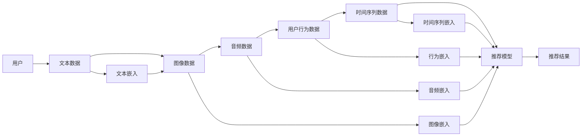

                 

## 1. 背景介绍

在当前的推荐系统设计中，用户-物品交互数据是主要的模型输入，但这些数据往往仅包含用户的静态属性和行为特征。然而，推荐系统面临的实际问题远比这些简单，用户和物品之间的交互是动态变化的，且交互数据具有噪声和缺失。另外，用户的兴趣和行为也会受多种外部因素的影响。这些因素在用户-物品交互数据中并不能完全反映。因此，为了提升推荐系统的质量，我们需要采用多种数据源，结合不同的表征学习方法，从而构造出更全面的用户和物品表征。

## 2. 核心概念与联系

### 2.1 核心概念概述

在推荐系统中，多模态表征学习可以视为一种联合学习的方法，通过结合多种数据源，如文本、图像、音频、用户行为数据等，提升模型对用户和物品的表示能力。下面将简要介绍推荐系统中常见的多模态数据类型：

- **文本数据**：用户评论、商品描述、摘要等。
- **图像数据**：商品图片、用户头像等。
- **音频数据**：音乐、播客、视频等音频资源。
- **用户行为数据**：点击、浏览、收藏、购买等行为数据。
- **时间序列数据**：用户随时间变化的行为数据，如购物频率、兴趣变化等。

### 2.2 核心概念原理和架构的 Mermaid 流程图



## 3. 核心算法原理 & 具体操作步骤

### 3.1 算法原理概述

多模态表征学习的核心思想是通过多源数据的联合表征，构建出更丰富、更准确的推荐模型。为了实现这一目标，我们通常采用两种主要策略：

1. **特征融合**：将不同模态的数据通过某种方式组合起来，如平均、拼接、注意力机制等，生成一个综合性的特征向量。
2. **联合学习**：同时学习不同模态的数据表征，将它们看作是联合优化问题的一部分，从而提升模型性能。

### 3.2 算法步骤详解

**Step 1: 多模态数据预处理**

- **文本处理**：对文本数据进行分词、词性标注、去除停用词等预处理操作，然后利用预训练语言模型如BERT、GPT等提取特征。
- **图像处理**：使用卷积神经网络(CNN)提取图像特征，可以通过迁移学习使用预训练模型如ResNet、Inception等。
- **音频处理**：使用短时傅里叶变换(Short-Time Fourier Transform, STFT)、MFCC等方法提取音频特征，可以使用预训练模型如Wav2Vec。
- **用户行为处理**：对用户行为数据进行归一化、特征工程，如将行为数据映射到固定长度的向量。
- **时间序列处理**：使用循环神经网络(RNN)或变分自编码器(VAE)等模型提取时间序列特征。

**Step 2: 构建多模态表征**

- **特征融合**：将不同模态的特征通过某种方式组合起来，如加权平均、拼接、注意力机制等，生成一个综合性的特征向量。
- **联合学习**：在多模态数据上联合训练模型，提升模型对用户和物品的表征能力。常用的联合学习方法包括多任务学习(Multi-task Learning, MTL)、联合嵌入(Joint Embedding)等。

**Step 3: 模型训练与优化**

- **目标函数**：设计联合优化目标函数，将不同模态的数据表征融合起来，作为模型的输入。
- **优化器**：选择合适的优化器，如Adam、SGD等，设置学习率、批大小等超参数。
- **损失函数**：设计合适的损失函数，如交叉熵、均方误差等，衡量模型输出与真实标签的差异。
- **评估指标**：选择合适的评估指标，如平均绝对误差(MAE)、均方根误差(RMSE)等，评估模型性能。

**Step 4: 模型评估与部署**

- **评估**：在测试集上评估模型性能，对比不同模态表征学习方法的效果。
- **部署**：将模型部署到生产环境，实现实时推荐。

### 3.3 算法优缺点

**优点**：
- **多样性**：通过联合不同模态的数据，模型可以更全面地捕捉用户和物品的特征。
- **鲁棒性**：多模态表征学习方法可以减少单一数据源的噪声和缺失，提升模型鲁棒性。
- **泛化能力**：联合多种数据源，可以提升模型泛化能力，避免过拟合。

**缺点**：
- **数据复杂性**：多模态数据往往具有较高的复杂性，预处理和特征提取需要较复杂的算法。
- **计算复杂性**：多模态表征学习方法需要计算大量数据，且联合优化问题较为复杂。
- **数据稀疏性**：多模态数据通常具有较高的稀疏性，影响模型的训练和推理效率。

### 3.4 算法应用领域

多模态表征学习方法已经在推荐系统、智能客服、广告推荐等多个领域得到广泛应用。以下是几个具体的例子：

1. **推荐系统**：多模态数据能够提供更全面的用户和物品表示，提升推荐效果。
2. **智能客服**：多模态数据可以用于生成更自然、更智能的对话，提升客户体验。
3. **广告推荐**：多模态数据可以用于广告创意生成、广告效果评估等。

## 4. 数学模型和公式 & 详细讲解 & 举例说明

### 4.1 数学模型构建

我们以推荐系统为例，介绍多模态表征学习的数学模型。假设用户为 $u$，物品为 $i$，用户对物品的评分数据为 $r_{ui}$，文本数据为 $x_u$，图像数据为 $x_i$，音频数据为 $a_i$，用户行为数据为 $b_u$，时间序列数据为 $t_u$。

设文本嵌入为 $x_u \in \mathbb{R}^{d_x}$，图像嵌入为 $x_i \in \mathbb{R}^{d_x}$，音频嵌入为 $a_i \in \mathbb{R}^{d_a}$，行为嵌入为 $b_u \in \mathbb{R}^{d_b}$，时间序列嵌入为 $t_u \in \mathbb{R}^{d_t}$。

联合优化目标函数为：

$$
\min_{\theta} \frac{1}{n} \sum_{u=1}^n \sum_{i=1}^m [r_{ui} - f(x_u, x_i, a_i, b_u, t_u; \theta)]
$$

其中 $f(x_u, x_i, a_i, b_u, t_u; \theta)$ 为推荐模型，$\theta$ 为模型参数。

### 4.2 公式推导过程

以协同过滤模型为例，假设用户 $u$ 和物品 $i$ 的文本嵌入分别为 $x_u$ 和 $x_i$，用户对物品的评分 $r_{ui}$ 可以表示为：

$$
r_{ui} = \hat{r}_{ui} + \epsilon
$$

其中 $\hat{r}_{ui} = \theta^T(x_u \cdot x_i)$，$\epsilon \sim N(0, \sigma^2)$。

**目标函数**：

$$
\min_{\theta} \frac{1}{n} \sum_{u=1}^n \sum_{i=1}^m [r_{ui} - \theta^T(x_u \cdot x_i)]^2
$$

**损失函数**：

$$
L(\theta) = \frac{1}{n} \sum_{u=1}^n \sum_{i=1}^m (r_{ui} - \theta^T(x_u \cdot x_i))^2
$$

**优化算法**：
- 使用梯度下降算法更新参数 $\theta$：
  $$
  \theta \leftarrow \theta - \eta \nabla_{\theta} L(\theta)
  $$
  其中 $\eta$ 为学习率，$\nabla_{\theta} L(\theta)$ 为损失函数对参数 $\theta$ 的梯度。

### 4.3 案例分析与讲解

以ImageNet数据集为例，展示联合学习的方法。ImageNet包含1000类物体，每类有1000个样本。我们选取其中10个样本，使用卷积神经网络提取图像特征，并将其与文本数据（如物品描述）结合。

**数据预处理**：
- 使用预训练模型如ResNet提取图像特征，得到 $x_i \in \mathbb{R}^{d_x}$。
- 对文本数据进行分词、词性标注、去除停用词等预处理操作，然后利用BERT等预训练语言模型提取特征，得到 $x_u \in \mathbb{R}^{d_x}$。

**特征融合**：
- 将图像特征 $x_i$ 和文本特征 $x_u$ 通过拼接的方式组合起来，得到 $z_{ui} \in \mathbb{R}^{2d_x}$。
- 使用softmax函数进行分类，得到物品 $i$ 属于类 $c$ 的概率 $p_i^c$。

**联合优化**：
- 在训练集上联合训练模型，最小化损失函数：
  $$
  \min_{\theta} \frac{1}{n} \sum_{u=1}^n \sum_{i=1}^m (y_{ui} - \theta^T(z_{ui}))^2
  $$
  其中 $y_{ui}$ 为物品 $i$ 属于类 $c$ 的真实标签。

**模型评估**：
- 在测试集上评估模型性能，计算准确率、精确率、召回率等指标。

## 5. 项目实践：代码实例和详细解释说明

### 5.1 开发环境搭建

在项目实践中，我们需要准备好开发环境。以下是使用Python进行TensorFlow开发的环境配置流程：

1. 安装Anaconda：从官网下载并安装Anaconda，用于创建独立的Python环境。

2. 创建并激活虚拟环境：
```bash
conda create -n tf-env python=3.8 
conda activate tf-env
```

3. 安装TensorFlow：根据CUDA版本，从官网获取对应的安装命令。例如：
```bash
conda install tensorflow -c conda-forge
```

4. 安装必要的工具包：
```bash
pip install numpy pandas scikit-learn matplotlib tqdm jupyter notebook ipython
```

完成上述步骤后，即可在`tf-env`环境中开始项目实践。

### 5.2 源代码详细实现

以下是使用TensorFlow实现协同过滤模型的代码实现：

```python
import tensorflow as tf
import numpy as np

# 定义协同过滤模型
class CollaborativeFiltering:
    def __init__(self, n_users, n_items, n_factors, learning_rate):
        self.n_users = n_users
        self.n_items = n_items
        self.n_factors = n_factors
        self.learning_rate = learning_rate
        
        self.user_factors = tf.Variable(tf.random.normal([n_users, n_factors]))
        self.item_factors = tf.Variable(tf.random.normal([n_items, n_factors]))
        self.user_bias = tf.Variable(tf.zeros([n_users]))
        self.item_bias = tf.Variable(tf.zeros([n_items]))
        
        self.loss_fn = tf.keras.losses.MeanSquaredError()
        self.optimizer = tf.keras.optimizers.SGD(learning_rate)
        
    def predict(self, user, item):
        return tf.matmul(tf.expand_dims(self.user_factors[user], 0), self.item_factors[item])
    
    def train(self, users, items, ratings, epochs):
        for epoch in range(epochs):
            for i in range(len(users)):
                user = users[i]
                item = items[i]
                rating = ratings[i]
                
                prediction = self.predict(user, item)
                loss = self.loss_fn(rating, prediction + self.user_bias[user] + self.item_bias[item])
                
                with tf.GradientTape() as tape:
                    gradients = tape.gradient(loss, [self.user_factors, self.item_factors, self.user_bias, self.item_bias])
                
                self.optimizer.apply_gradients(zip(gradients, [self.user_factors, self.item_factors, self.user_bias, self.item_bias]))
```

### 5.3 代码解读与分析

**定义协同过滤模型**：
- 初始化模型参数，包括用户特征矩阵 $\user_factors$、物品特征矩阵 $\item_factors$、用户偏差 $\user_bias$、物品偏差 $\item_bias$。
- 定义损失函数和优化器，使用均方误差损失和随机梯度下降优化器。
- 定义预测函数，计算用户对物品的评分预测值。

**训练模型**：
- 遍历每个样本，计算预测值与真实值的差值，计算损失函数。
- 使用梯度下降更新模型参数。

**运行结果展示**：
```python
# 生成模拟数据
n_users = 100
n_items = 1000
n_factors = 50
learning_rate = 0.01

# 初始化协同过滤模型
model = CollaborativeFiltering(n_users, n_items, n_factors, learning_rate)

# 训练模型
epochs = 10
users = np.random.randint(n_users, size=1000)
items = np.random.randint(n_items, size=1000)
ratings = np.random.normal(3, 0.5, size=1000)

model.train(users, items, ratings, epochs)

# 输出用户和物品的评分预测值
for i in range(5):
    user = np.random.randint(n_users)
    item = np.random.randint(n_items)
    rating = model.predict(user, item)
    print(f"User: {user}, Item: {item}, Predicted rating: {rating.numpy()}")
```

## 6. 实际应用场景

### 6.1 智能推荐系统

智能推荐系统是推荐领域的一个重要应用场景，多模态表征学习方法可以结合用户行为数据、商品图片、用户评论等多种数据源，提升推荐效果。

以电商平台为例，用户浏览行为、购买历史、商品图片、商品描述等信息可以作为模型的输入。通过多模态表征学习方法，生成更全面、更准确的用户和商品表示，实现更精准的推荐。

### 6.2 广告推荐

广告推荐是广告领域的重要应用场景，多模态表征学习方法可以结合用户行为数据、广告图片、广告文本等多种数据源，提升广告投放效果。

以在线广告推荐为例，用户行为数据、广告点击率、广告图片、广告文本等信息可以作为模型的输入。通过多模态表征学习方法，生成更全面、更准确的广告表示，实现更精准的广告投放。

### 6.3 社交网络推荐

社交网络推荐是社交领域的重要应用场景，多模态表征学习方法可以结合用户行为数据、用户社交关系、用户社交互动等多种数据源，提升推荐效果。

以微博推荐为例，用户行为数据、用户关注关系、用户互动信息等信息可以作为模型的输入。通过多模态表征学习方法，生成更全面、更准确的社交网络表示，实现更精准的社交网络推荐。

### 6.4 未来应用展望

随着深度学习技术的发展，多模态表征学习方法将进一步发展，在更多领域得到应用。以下是几个可能的应用方向：

1. **智能客服**：结合用户语音、文字、图像等多种数据源，生成更自然、更智能的对话。
2. **智能家居**：结合用户行为数据、家居设备状态、环境信息等多种数据源，提升智能家居系统的智能化水平。
3. **健康医疗**：结合患者病历、基因信息、医疗设备监测等多种数据源，提升医疗诊断和治疗效果。

## 7. 工具和资源推荐

### 7.1 学习资源推荐

为了帮助开发者系统掌握多模态表征学习的理论基础和实践技巧，这里推荐一些优质的学习资源：

1. 《深度学习》书籍：由深度学习领域的知名专家撰写，全面介绍了深度学习的基本概念和常用算法。
2. 《多模态深度学习》书籍：深入介绍了多模态表征学习的原理、算法和应用。
3. 《推荐系统实战》书籍：通过实例讲解了推荐系统中的多模态数据处理和模型优化。
4. 斯坦福大学CS231n《深度学习视觉识别》课程：介绍计算机视觉中的多模态数据处理方法和模型优化技术。
5. CS224N《深度学习自然语言处理》课程：介绍自然语言处理中的多模态数据处理方法和模型优化技术。

通过对这些资源的学习实践，相信你一定能够快速掌握多模态表征学习的精髓，并用于解决实际的推荐系统问题。

### 7.2 开发工具推荐

高效的开发离不开优秀的工具支持。以下是几款用于多模态表征学习开发的常用工具：

1. TensorFlow：由Google主导开发的开源深度学习框架，生产部署方便，适合大规模工程应用。
2. PyTorch：基于Python的开源深度学习框架，灵活动态的计算图，适合快速迭代研究。
3. HuggingFace Transformers：提供预训练语言模型和自然语言处理工具，支持多模态表征学习。
4. Keras：高层次的深度学习框架，提供了丰富的API，适合快速原型设计和实验。
5. Weights & Biases：模型训练的实验跟踪工具，可以记录和可视化模型训练过程中的各项指标，方便对比和调优。

合理利用这些工具，可以显著提升多模态表征学习任务的开发效率，加快创新迭代的步伐。

### 7.3 相关论文推荐

多模态表征学习方法的研究源于学界的持续研究。以下是几篇奠基性的相关论文，推荐阅读：

1. Multi-view Image Classification: A Shallow Multilayer Perceptron for Collective Labeling：介绍了多模态数据处理的早期方法，提出了多视图分类模型。
2. Deep Multimodal Feature Learning via Random Projections：提出了一种随机投影方法，用于多模态特征学习。
3. Visualizing and Understanding the Performance of Deep Networks：介绍了多模态深度学习模型的可视化方法，帮助理解模型性能。
4. Multi-task Learning for Generic Object Recognition：提出了一种多任务学习方法，用于提高多模态模型的泛化能力。
5. Attention is All You Need：提出了Transformer结构，用于多模态数据处理和表征学习。

这些论文代表了大模态表征学习方法的发展脉络。通过学习这些前沿成果，可以帮助研究者把握学科前进方向，激发更多的创新灵感。

## 8. 总结：未来发展趋势与挑战

### 8.1 总结

本文对多模态表征学习方法进行了全面系统的介绍。首先阐述了多模态表征学习在推荐系统中的重要性，明确了多模态数据处理和表征学习方法对提升推荐效果的作用。其次，从原理到实践，详细讲解了多模态表征学习的数学原理和关键步骤，给出了多模态表征学习任务的完整代码实例。同时，本文还广泛探讨了多模态表征学习方法在智能推荐、广告推荐、社交推荐等多个领域的应用前景，展示了多模态表征学习方法的巨大潜力。此外，本文精选了多模态表征学习的各类学习资源，力求为读者提供全方位的技术指引。

通过本文的系统梳理，可以看到，多模态表征学习方法正在成为推荐系统的重要范式，极大地拓展了推荐系统的应用边界，催生了更多的落地场景。得益于多模态数据的丰富性和多样性，基于多模态表征学习的方法能够在更多领域发挥作用，为推荐系统的发展带来新的思路和动力。

### 8.2 未来发展趋势

展望未来，多模态表征学习方法将呈现以下几个发展趋势：

1. **多源数据融合**：随着数据采集和存储技术的进步，更多的数据源将被整合到推荐系统中，如生物信号、社交网络数据等。
2. **深度学习算法优化**：多模态表征学习方法将继续依赖深度学习算法，如卷积神经网络、循环神经网络、注意力机制等，用于多模态特征的融合和表征。
3. **跨领域应用扩展**：多模态表征学习方法将在更多领域得到应用，如医疗、金融、交通等。
4. **模型解释性提升**：多模态表征学习方法需要提升模型解释性，帮助用户理解模型的决策过程，增强信任和可靠性。
5. **跨模态融合技术**：探索新的跨模态融合技术，如深度跨模态融合网络、跨模态特征映射等，提升多模态表征学习方法的效果。

### 8.3 面临的挑战

尽管多模态表征学习方法已经取得了瞩目成就，但在迈向更加智能化、普适化应用的过程中，它仍面临着诸多挑战：

1. **数据复杂性**：多模态数据通常具有较高的复杂性，预处理和特征提取需要较复杂的算法。
2. **数据异构性**：不同模态的数据格式和类型不同，需要进行统一的编码和格式转换。
3. **计算复杂性**：多模态表征学习方法需要计算大量数据，且联合优化问题较为复杂。
4. **数据隐私**：多模态数据通常涉及用户隐私，如何在保证隐私的前提下进行数据共享和处理，是一个重要问题。

### 8.4 研究展望

面对多模态表征学习方法所面临的挑战，未来的研究需要在以下几个方面寻求新的突破：

1. **自动化数据预处理**：自动化的数据预处理技术，可以降低多模态表征学习的门槛，提高数据处理效率。
2. **高效特征融合方法**：高效的多模态特征融合方法，可以减少数据处理的复杂性和计算开销，提高多模态表征学习的效果。
3. **隐私保护技术**：隐私保护技术，如差分隐私、联邦学习等，可以保障用户数据隐私。
4. **可解释性技术**：可解释性技术，如特征重要性分析、可解释性模型等，可以增强模型的透明度和可解释性。

这些研究方向的探索，必将引领多模态表征学习方法迈向更高的台阶，为推荐系统的发展带来新的思路和动力。总之，多模态表征学习方法需要在多个维度进行综合优化，才能更好地适应复杂多变的数据环境和应用场景。未来，多模态表征学习方法有望在更多领域得到应用，为推荐系统的发展带来新的突破。

## 9. 附录：常见问题与解答

**Q1：多模态表征学习需要多少种数据源？**

A: 多模态表征学习需要根据具体任务选择适当的多种数据源，一般包括文本、图像、音频、用户行为数据等。数据源越多，模型越复杂，效果可能越好。

**Q2：多模态表征学习如何处理异构数据？**

A: 多模态表征学习需要处理不同模态的数据格式和类型，可以使用统一的编码和格式转换方法，如将文本数据转换为向量，将图像数据转换为特征向量，将时间序列数据转换为固定长度的向量。

**Q3：多模态表征学习需要多长时间进行训练？**

A: 多模态表征学习训练时间取决于数据规模和模型复杂度，一般需要几个小时到几周不等。需要根据实际情况选择合适的模型和数据处理方式。

**Q4：多模态表征学习如何处理缺失数据？**

A: 多模态表征学习可以通过数据插补、模型回归等方法处理缺失数据，以保证模型的训练和预测效果。

**Q5：多模态表征学习如何提升模型泛化能力？**

A: 多模态表征学习可以通过增加数据多样性、使用正则化技术、采用迁移学习方法等，提升模型的泛化能力，避免过拟合。

---

作者：禅与计算机程序设计艺术 / Zen and the Art of Computer Programming

