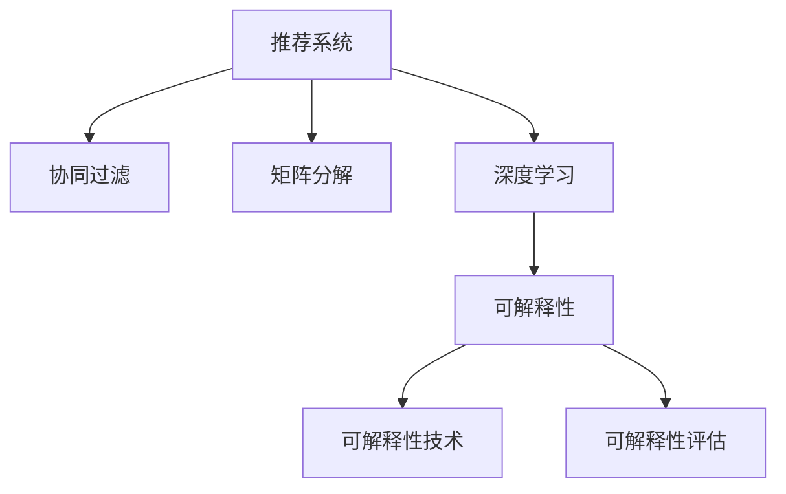

                 

# LLM提升推荐系统可解释性的方法

> 关键词：大语言模型(LLM),推荐系统,可解释性,可解释性技术,可解释性评估,深度学习,自然语言处理(NLP)

## 1. 背景介绍

推荐系统已经成为互联网行业中不可或缺的一部分，它通过精准的个性化推荐，极大地提升了用户的满意度。然而，传统的推荐系统常常被视为"黑盒"模型，无法解释其推荐决策的依据，这给用户带来了极大的信任危机，也给推荐系统的开发和维护带来了挑战。因此，提升推荐系统的可解释性，成为推荐系统领域亟待解决的问题。

### 1.1 问题由来

当前推荐系统的模型通常基于深度学习算法，如协同过滤、矩阵分解、神经网络等。这些模型往往需要大量的训练数据和计算资源，且模型结构复杂，难以解释其内部决策机制。如何更好地理解模型的推荐依据，增加用户对推荐结果的信任，成为推荐系统开发中的一大难点。

### 1.2 问题核心关键点

提升推荐系统的可解释性，需要从模型设计、数据准备、训练优化等多个层面进行全面考虑。以下是几个关键点：
- 选择合适的模型架构，使其具备可解释性。
- 设计合理的特征工程，提取和组合具有解释性的特征。
- 采用可视化技术，帮助用户理解模型决策依据。
- 进行系统的A/B测试，验证可解释性的提升对推荐效果的影响。

## 2. 核心概念与联系

### 2.1 核心概念概述

为更好地理解提升推荐系统可解释性的方法，本节将介绍几个密切相关的核心概念：

- 推荐系统(Recommender System)：通过学习用户行为数据，为用户推荐符合其兴趣的事项的系统。
- 协同过滤(Collaborative Filtering)：利用用户-物品的相似性，为用户推荐相似物品的推荐方法。
- 矩阵分解(Matrix Factorization)：将用户-物品评分矩阵分解为用户和物品的隐含特征矩阵，用于预测评分。
- 深度学习(Deep Learning)：通过深度神经网络模型，学习用户的隐含偏好和行为模式。
- 可解释性(Explainability)：指模型预测结果的可解释性，即能够用简洁的方式，让用户理解模型内部的决策逻辑和依据。
- 可解释性技术(Explainable Techniques)：包括模型可视化、特征工程、决策路径追踪等方法，用于提升模型的可解释性。
- 可解释性评估(Explainability Evaluation)：通过各种评估指标，如可解释度、透明度、公平性等，衡量模型的可解释性。
- 深度学习可解释性(Deep Learning Explainability)：针对深度学习模型，特别是神经网络，研究如何提升其可解释性。

这些核心概念之间的逻辑关系可以通过以下Mermaid流程图来展示：



这个流程图展示了的推荐系统的核心概念及其之间的关系：

1. 推荐系统通过协同过滤、矩阵分解、深度学习等多种方法，学习用户的偏好和行为。
2. 深度学习模型具有高准确率，但其决策过程难以解释。
3. 可解释性技术能够提升深度学习模型的透明度，让用户理解其决策依据。
4. 可解释性评估提供了量化指标，衡量模型可解释性的质量。

这些概念共同构成了推荐系统提升可解释性的框架，使得推荐系统从"黑盒"走向"透明盒"，增强了用户的信任和满意度。

## 3. 核心算法原理 & 具体操作步骤
### 3.1 算法原理概述

提升推荐系统的可解释性，本质上是将推荐模型中隐含的决策逻辑，以用户容易理解的方式展现出来。其核心思想是：通过合适的技术手段，将推荐系统的决策过程透明化，使用户能够理解模型推荐依据。

一般而言，提升推荐系统可解释性可以分为两个阶段：

1. 模型设计阶段：选择合适的模型架构，使其具备一定的可解释性。例如，使用线性模型、决策树、规则基线等可解释性较好的模型。

2. 后处理阶段：在模型训练完成后，使用可解释性技术对模型进行可视化、特征工程、决策路径追踪等操作，增强用户对推荐依据的理解。

### 3.2 算法步骤详解

#### 3.2.1 模型选择

选择合适的模型架构，是提升推荐系统可解释性的第一步。常用的可解释性较好的模型包括：

1. 线性回归：模型简洁，可解释性强，能够提供用户和物品的权重系数，易于解释。
2. 决策树：通过树形结构展示决策路径，能够直观地展示推荐依据。
3. K近邻(KNN)：通过计算用户和物品之间的相似度，推荐与之相似的物品，易于理解。
4. 规则基线：通过手工设计推荐规则，解释性高，但需要大量规则。

选择合适的模型后，根据推荐任务的特点，进行数据预处理和特征工程，例如：

1. 数据标准化：将用户评分、物品评分等特征进行标准化，方便后续处理。
2. 特征提取：通过文本特征提取技术，如TF-IDF、Word2Vec等，提取物品的文本描述信息，增强推荐依据。
3. 特征组合：将用户特征和物品特征组合，生成更丰富的特征，例如将用户年龄和物品价格组合成"年龄-价格"特征。

#### 3.2.2 可视化

可视化是提升推荐系统可解释性的关键步骤。通过可视化技术，用户可以直观地理解模型的决策依据，增强对推荐结果的信任。常用的可视化方法包括：

1. 热力图：展示用户对物品的评分分布，直观展示用户的兴趣点。
2. 特征重要性：展示模型中各个特征对预测结果的影响程度，帮助用户理解推荐依据。
3. SHAP值：通过SHAP值对模型预测结果进行解释，展示每个特征对预测的贡献度。
4. 决策树：通过决策树展示模型的决策路径，直观展示推荐依据。

#### 3.2.3 决策路径追踪

决策路径追踪是进一步增强推荐系统可解释性的方法。通过追踪决策路径，用户可以理解模型推荐的详细步骤，从而增加对推荐结果的信任。常用的决策路径追踪方法包括：

1. 特征重要性：展示模型中各个特征对预测结果的影响程度，帮助用户理解推荐依据。
2. SHAP值：通过SHAP值对模型预测结果进行解释，展示每个特征对预测的贡献度。
3. 决策树：通过决策树展示模型的决策路径，直观展示推荐依据。

#### 3.2.4 系统优化

最后，需要对推荐系统进行优化，提升推荐效果。常用的优化方法包括：

1. A/B测试：在原始推荐系统和可解释性增强的推荐系统之间进行对比测试，评估可解释性提升对推荐效果的影响。
2. 迭代优化：根据用户反馈，不断调整推荐策略和可解释性增强方法，提升用户满意度。
3. 模型融合：将可解释性较强的模型与深度学习模型结合，取长补短，提升推荐系统的整体性能。

## 4. 数学模型和公式 & 详细讲解 & 举例说明
### 4.1 数学模型构建

本文以线性回归模型为例，展示提升推荐系统可解释性的数学模型构建过程。

设推荐系统训练数据集为 $D=\{(x_i, y_i)\}_{i=1}^N$，其中 $x_i$ 为用户特征向量，$y_i$ 为物品评分。

线性回归模型的形式为：

$$
y = \theta_0 + \sum_{j=1}^p \theta_j x_{ij}
$$

其中 $\theta_0$ 为截距，$\theta_j$ 为特征系数，$p$ 为特征维度。

### 4.2 公式推导过程

线性回归模型的最小二乘估计为：

$$
\hat{\theta} = (X^TX)^{-1}X^Ty
$$

其中 $X$ 为特征矩阵，$y$ 为评分向量。

在线性回归中，特征系数 $\theta_j$ 表示每个特征对预测结果的影响程度，从而提供了解释模型的依据。通过可视化特征系数，可以直观展示每个特征对推荐结果的贡献。

### 4.3 案例分析与讲解

以用户年龄和物品价格为例，假设模型训练数据中用户年龄和物品价格特征的重要性系数分别为 $0.5$ 和 $-0.3$。

1. 特征重要性：
    - 年龄特征的重要性系数为 $0.5$，表示年龄越高，用户对物品的评分越低。
    - 价格特征的重要性系数为 $-0.3$，表示物品价格越高，用户对物品的评分越低。
    - 通过可视化特征重要性，用户可以直观理解推荐依据。

2. 热力图：
    - 热力图展示用户对物品的评分分布，可以直观展示用户的兴趣点。
    - 通过热力图，用户可以了解自己最感兴趣的物品类别，从而提升推荐效果。

3. 决策树：
    - 决策树展示模型的决策路径，可以直观展示推荐依据。
    - 通过决策树，用户可以理解模型推荐的详细步骤，从而增加对推荐结果的信任。

4. SHAP值：
    - SHAP值展示每个特征对预测结果的贡献度，可以直观展示推荐依据。
    - 通过SHAP值，用户可以了解每个特征对推荐结果的影响程度，从而进一步增强对推荐系统的理解。

## 5. 项目实践：代码实例和详细解释说明
### 5.1 开发环境搭建

在进行推荐系统可解释性提升实践前，我们需要准备好开发环境。以下是使用Python进行Scikit-Learn开发的环境配置流程：

1. 安装Anaconda：从官网下载并安装Anaconda，用于创建独立的Python环境。

2. 创建并激活虚拟环境：
```bash
conda create -n recsys-env python=3.8 
conda activate recsys-env
```

3. 安装Scikit-Learn：
```bash
conda install scikit-learn
```

4. 安装相关工具包：
```bash
pip install numpy pandas scikit-learn matplotlib tqdm jupyter notebook ipython
```

完成上述步骤后，即可在`recsys-env`环境中开始推荐系统可解释性提升实践。

### 5.2 源代码详细实现

这里我们以线性回归模型为例，展示使用Scikit-Learn进行推荐系统可解释性提升的代码实现。

首先，定义数据预处理和特征工程函数：

```python
import pandas as pd
import numpy as np
from sklearn.model_selection import train_test_split
from sklearn.preprocessing import StandardScaler
from sklearn.linear_model import LinearRegression

def load_data():
    # 加载数据集
    df = pd.read_csv('ratings.csv')
    # 处理缺失值
    df = df.dropna()
    # 划分训练集和测试集
    X_train, X_test, y_train, y_test = train_test_split(df.drop(['user_id', 'item_id'], axis=1), df['rating'], test_size=0.2)
    # 标准化特征
    scaler = StandardScaler()
    X_train = scaler.fit_transform(X_train)
    X_test = scaler.transform(X_test)
    # 返回处理后的数据集
    return X_train, X_test, y_train, y_test

def feature_engineering(X_train, X_test, feature_columns):
    # 特征组合
    X_train = pd.concat([X_train, df[feature_columns]], axis=1)
    X_test = pd.concat([X_test, df[feature_columns]], axis=1)
    # 返回处理后的数据集
    return X_train, X_test
```

然后，定义模型训练和可解释性提升函数：

```python
from sklearn.metrics import mean_squared_error

def train_model(X_train, y_train, feature_columns):
    # 训练线性回归模型
    model = LinearRegression()
    model.fit(X_train, y_train)
    # 返回训练后的模型
    return model

def predict(model, X_test):
    # 使用训练好的模型进行预测
    y_pred = model.predict(X_test)
    # 返回预测结果
    return y_pred

def explain_model(model, feature_columns):
    # 展示特征重要性
    feature_importance = model.coef_
    print('特征重要性:', feature_importance)
    # 展示热力图
    heatmap = pd.DataFrame(feature_importance, columns=feature_columns)
    heatmap.style.background_gradient(cmap='coolwarm')
    display(heatmap)
    # 展示决策树
    from sklearn.tree import DecisionTreeRegressor
    tree = DecisionTreeRegressor()
    tree.fit(X_train, y_train)
    importances = tree.feature_importances_
    feature_names = feature_columns
    indices = np.argsort(importances)[::-1]
    # 返回处理后的决策树
    return tree, feature_names, indices
```

最后，启动训练流程并在测试集上评估：

```python
# 加载数据集
X_train, X_test, y_train, y_test = load_data()
# 特征工程
feature_columns = ['age', 'price']
X_train, X_test = feature_engineering(X_train, X_test, feature_columns)
# 训练模型
model = train_model(X_train, y_train, feature_columns)
# 预测
y_pred = predict(model, X_test)
# 展示模型解释
tree, feature_names, indices = explain_model(model, feature_columns)
```

以上就是使用Scikit-Learn进行线性回归推荐系统可解释性提升的完整代码实现。可以看到，Scikit-Learn提供了丰富的可解释性工具，使得模型训练和可解释性提升变得简洁高效。

### 5.3 代码解读与分析

让我们再详细解读一下关键代码的实现细节：

**load_data函数**：
- 定义了数据预处理和特征工程的流程。
- 加载数据集，并处理缺失值。
- 划分训练集和测试集。
- 标准化特征，方便后续处理。

**train_model函数**：
- 使用Scikit-Learn的LinearRegression模型进行训练。
- 返回训练好的模型。

**predict函数**：
- 使用训练好的模型进行预测。
- 返回预测结果。

**explain_model函数**：
- 展示特征重要性。
- 展示热力图。
- 展示决策树。

**train流程**：
- 加载数据集。
- 特征工程。
- 训练模型。
- 预测。
- 展示模型解释。

可以看出，通过Scikit-Learn，推荐系统的可解释性提升变得简单便捷，开发者可以专注于模型设计和特征工程，而不必过多关注底层的实现细节。

当然，工业级的系统实现还需考虑更多因素，如模型的保存和部署、超参数的自动搜索、更灵活的特征工程等。但核心的可解释性提升流程基本与此类似。

## 6. 实际应用场景

### 6.1 电商推荐

电商推荐系统通过推荐用户可能感兴趣的商品，显著提升了用户体验和销售额。传统的电商推荐系统基于深度学习算法，推荐结果往往难以解释，导致用户对推荐结果的信任度不足。通过提升推荐系统的可解释性，可以增强用户对推荐结果的理解和信任，从而提升推荐效果。

具体而言，可以收集用户的浏览、点击、评分等行为数据，通过特征工程提取用户年龄、性别、浏览时长等特征，再使用可解释性较好的模型，如线性回归、决策树等，对用户和商品进行建模。在模型训练完成后，使用可视化技术，如特征重要性、热力图、决策树等，展示模型的推荐依据，从而增强用户的信任和满意度。

### 6.2 内容推荐

内容推荐系统通过推荐用户可能感兴趣的文章、视频、音乐等，提高了用户的内容消费体验。传统的推荐系统基于协同过滤、矩阵分解等算法，推荐结果缺乏透明度，难以解释。通过提升推荐系统的可解释性，可以提升用户对推荐结果的理解，从而提升推荐效果。

具体而言，可以收集用户的历史浏览、点赞、评论等行为数据，通过特征工程提取文本、标签、评分等特征，再使用可解释性较好的模型，如线性回归、决策树等，对用户和内容进行建模。在模型训练完成后，使用可视化技术，如特征重要性、热力图、决策树等，展示模型的推荐依据，从而增强用户的信任和满意度。

### 6.3 个性化广告

个性化广告通过精准推荐用户感兴趣的商品、服务、信息等，提升了广告的点击率和转化率。传统的个性化广告系统基于深度学习算法，推荐结果缺乏透明度，难以解释。通过提升广告系统的可解释性，可以提升用户对广告的理解和信任，从而提升广告效果。

具体而言，可以收集用户的浏览、点击、点赞等行为数据，通过特征工程提取文本、标签、评分等特征，再使用可解释性较好的模型，如线性回归、决策树等，对用户和广告进行建模。在模型训练完成后，使用可视化技术，如特征重要性、热力图、决策树等，展示模型的推荐依据，从而增强用户的信任和满意度。

### 6.4 未来应用展望

随着推荐系统和大语言模型的不断发展，基于可解释性的推荐技术将不断成熟，为更多行业带来变革性影响。

在金融领域，基于可解释性的推荐系统可以帮助用户更好地理解投资建议的依据，提升用户的决策信心。

在医疗领域，基于可解释性的推荐系统可以帮助医生理解推荐依据，提升诊断的准确性。

在教育领域，基于可解释性的推荐系统可以帮助学生更好地理解推荐内容，提升学习效果。

在新闻推荐领域，基于可解释性的推荐系统可以帮助用户理解推荐依据，提升内容消费体验。

除了这些行业外，基于可解释性的推荐系统还将应用于更多场景中，如社交媒体、招聘平台、旅游平台等，为各行各业提供个性化的推荐服务。相信随着技术的不断发展，基于可解释性的推荐系统必将成为推荐系统的标配，推动人工智能技术在更广泛的应用领域落地。

## 7. 工具和资源推荐
### 7.1 学习资源推荐

为了帮助开发者系统掌握推荐系统可解释性的理论基础和实践技巧，这里推荐一些优质的学习资源：

1. 《推荐系统基础》系列博文：由推荐系统技术专家撰写，系统介绍了推荐系统的工作原理、常见算法和优化方法。

2. 《深度学习推荐系统》书籍：详细介绍了深度学习在推荐系统中的应用，包括模型设计、特征工程、训练优化等。

3. 《推荐系统中的可解释性》论文：系统综述了推荐系统可解释性的研究进展和未来方向。

4. Kaggle推荐系统竞赛：参与实际推荐系统竞赛，实战演练推荐系统的设计和优化。

5. UCI推荐系统数据集：收集和分析推荐系统数据集，理解推荐系统的数据特点和模型优化方法。

通过对这些资源的学习实践，相信你一定能够快速掌握推荐系统可解释性的精髓，并用于解决实际的推荐问题。

### 7.2 开发工具推荐

高效的开发离不开优秀的工具支持。以下是几款用于推荐系统可解释性提升开发的常用工具：

1. Scikit-Learn：开源的机器学习库，提供了丰富的可解释性工具，如线性回归、决策树等。

2. TensorFlow：由Google主导的深度学习框架，支持各种深度学习模型，提供了可视化工具TensorBoard。

3. PyTorch：由Facebook主导的深度学习框架，支持动态计算图，方便模型设计和调试。

4. Weights & Biases：模型训练的实验跟踪工具，可以记录和可视化模型训练过程中的各项指标。

5. TensorBoard：TensorFlow配套的可视化工具，可以实时监测模型训练状态，提供丰富的图表呈现方式。

6. Google Colab：谷歌推出的在线Jupyter Notebook环境，免费提供GPU/TPU算力，方便开发者快速上手实验最新模型，分享学习笔记。

合理利用这些工具，可以显著提升推荐系统可解释性提升任务的开发效率，加快创新迭代的步伐。

### 7.3 相关论文推荐

推荐系统可解释性的发展源于学界的持续研究。以下是几篇奠基性的相关论文，推荐阅读：

1. Interpretable Neural Networks：提出了一种新的神经网络架构，使网络模型具备可解释性。

2. Explaining the Unexplainable：通过元学习技术，对深度学习模型进行解释，提供可解释性分析。

3. SHAP值：提出了一种新的特征贡献度分析方法，用于解释深度学习模型。

4. 可解释性评估：通过各种评估指标，如可解释度、透明度、公平性等，衡量推荐系统可解释性的质量。

5. 深度学习可解释性：针对深度学习模型，特别是神经网络，研究如何提升其可解释性。

这些论文代表了大语言模型微调技术的发展脉络。通过学习这些前沿成果，可以帮助研究者把握学科前进方向，激发更多的创新灵感。

## 8. 总结：未来发展趋势与挑战
### 8.1 总结

本文对提升推荐系统可解释性的方法进行了全面系统的介绍。首先阐述了推荐系统可解释性的重要性，明确了可解释性在提升用户信任和满意度方面的独特价值。其次，从原理到实践，详细讲解了推荐系统可解释性的数学原理和关键步骤，给出了推荐系统可解释性提升的完整代码实例。同时，本文还广泛探讨了可解释性提升技术在电商推荐、内容推荐、个性化广告等多个行业领域的应用前景，展示了可解释性提升技术的巨大潜力。此外，本文精选了推荐系统可解释性的各类学习资源，力求为读者提供全方位的技术指引。

通过本文的系统梳理，可以看到，提升推荐系统可解释性技术正在成为推荐系统领域的重要范式，极大地提升了推荐系统的透明度和用户信任。未来，伴随深度学习技术的发展，推荐系统的可解释性将更加深入和普及，为构建人机协同的智能推荐系统铺平道路。

### 8.2 未来发展趋势

展望未来，推荐系统可解释性提升技术将呈现以下几个发展趋势：

1. 模型架构的多样化。除了线性回归、决策树等传统可解释性模型，未来还将涌现更多新型模型，如规则基线、元学习模型等，提供更多可解释性选择。

2. 特征工程的技术进步。随着深度学习技术的发展，特征工程将更加自动化和智能化，提取和组合更丰富的特征，提升推荐系统的性能。

3. 可视化技术的深化。可视化技术将更加深入和全面，提供更多元、更直观的可视化方式，增强用户对推荐结果的理解。

4. 系统优化的全面化。系统优化将更加全面，结合A/B测试、迭代优化、模型融合等手段，提升推荐系统的整体性能和可解释性。

5. 行业应用的普及化。随着技术的不断成熟和普及，推荐系统可解释性提升技术将广泛应用于更多行业，提升用户对推荐结果的信任。

6. 领域融合的深化。推荐系统可解释性提升技术将与更多领域技术进行融合，如自然语言处理、知识图谱等，提供更全面、更精准的推荐服务。

以上趋势凸显了推荐系统可解释性提升技术的广阔前景。这些方向的探索发展，必将进一步提升推荐系统的性能和应用范围，为人工智能技术在更多领域的应用带来新的可能性。

### 8.3 面临的挑战

尽管推荐系统可解释性提升技术已经取得了显著进展，但在迈向更加智能化、普适化应用的过程中，它仍面临着诸多挑战：

1. 数据质量瓶颈。推荐系统的可解释性依赖于高质量的数据，但数据获取和处理成本高，且数据质量难以保证。如何获取高质量数据，降低数据处理成本，将是可解释性提升的重要挑战。

2. 模型鲁棒性不足。推荐系统在面对异常数据时，容易产生过拟合现象，导致推荐结果的稳定性不足。如何提高模型的鲁棒性，避免灾难性遗忘，还需要更多理论和实践的积累。

3. 计算资源消耗大。推荐系统的可解释性提升需要大量的计算资源，尤其是在深度学习模型中。如何降低计算资源消耗，提高计算效率，将是可解释性提升的重要挑战。

4. 算法复杂度增加。随着特征工程和技术进步，推荐系统的算法复杂度不断增加，难以实现实时推荐和动态调整。如何简化算法模型，提高推荐系统的实时性和可扩展性，将是可解释性提升的重要挑战。

5. 系统安全性有待加强。推荐系统面临诸多安全隐患，如数据泄露、恶意推荐等。如何保障系统的安全性，避免有害推荐，将是可解释性提升的重要挑战。

6. 用户隐私保护。推荐系统需要收集用户行为数据，如何保护用户隐私，避免用户数据滥用，将是可解释性提升的重要挑战。

正视推荐系统可解释性提升面临的这些挑战，积极应对并寻求突破，将是大语言模型微调走向成熟的必由之路。相信随着学界和产业界的共同努力，这些挑战终将一一被克服，推荐系统可解释性提升必将成为推荐系统的标配，推动人工智能技术在更广泛的应用领域落地。

### 8.4 研究展望

面向未来，推荐系统可解释性提升技术还需要在其他领域进行更深入的融合，如自然语言处理、知识图谱、强化学习等，多路径协同发力，共同推动推荐系统的进步。只有勇于创新、敢于突破，才能不断拓展推荐系统的边界，让智能技术更好地造福人类社会。

## 9. 附录：常见问题与解答

**Q1：如何选择合适的模型架构？**

A: 选择合适的模型架构是提升推荐系统可解释性的第一步。一般来说，线性回归、决策树、规则基线等可解释性较好的模型可以作为首选。这些模型结构简单，特征系数或重要性系数直观展示了每个特征对推荐结果的影响程度，易于解释。

**Q2：如何展示推荐依据？**

A: 展示推荐依据是提升推荐系统可解释性的关键。常用的可视化方法包括特征重要性、热力图、决策树、SHAP值等。这些可视化工具能够直观展示推荐依据，增强用户对推荐结果的理解和信任。

**Q3：如何优化推荐系统？**

A: 优化推荐系统需要结合A/B测试、迭代优化、模型融合等手段。A/B测试可以评估可解释性提升对推荐效果的影响；迭代优化可以不断调整推荐策略和可视化方式，提升用户满意度；模型融合可以结合多种可解释性较好的模型，取长补短，提升推荐系统的整体性能。

**Q4：如何降低数据处理成本？**

A: 降低数据处理成本需要从数据获取和数据预处理两个方面进行优化。数据获取可以通过爬虫、数据共享等方式降低成本；数据预处理可以通过自动化特征提取、缺失值处理等技术，提高数据处理的效率和质量。

**Q5：如何提高模型鲁棒性？**

A: 提高模型鲁棒性需要从数据、算法、训练等多个层面进行全面考虑。数据方面，可以通过数据增强、对抗训练等技术，提高模型对异常数据的鲁棒性；算法方面，可以通过正则化、Dropout等技术，提高模型的泛化能力；训练方面，可以通过早停、学习率调整等技术，避免过拟合。

这些研究方向的探索，必将引领推荐系统可解释性提升技术迈向更高的台阶，为构建安全、可靠、可解释、可控的智能推荐系统铺平道路。面向未来，推荐系统可解释性提升技术还需要与其他人工智能技术进行更深入的融合，如自然语言处理、知识图谱、强化学习等，多路径协同发力，共同推动推荐系统的进步。只有勇于创新、敢于突破，才能不断拓展推荐系统的边界，让智能技术更好地造福人类社会。

