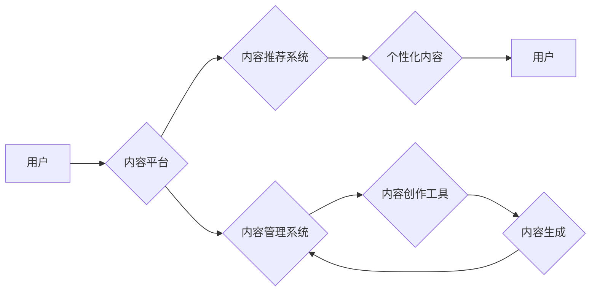

> AI、出版业、降本增效、场景创新、自动化、机器学习、自然语言处理、内容创作、个性化推荐

## 1. 背景介绍

出版业作为文化传播的重要载体，近年来面临着前所未有的挑战。传统出版模式的成本高、效率低、市场竞争激烈等问题日益突出。而人工智能（AI）技术的快速发展，为出版业带来了新的机遇和可能性。AI技术能够有效降低出版成本，提高效率，并为读者提供更加个性化、定制化的阅读体验。

**1.1 出版业面临的挑战**

* **成本高昂:** 传统出版流程涉及印刷、物流、营销等环节，成本高昂，利润空间有限。
* **效率低下:** 出版流程繁琐，周期长，难以满足读者对快速获取信息的需求。
* **市场竞争激烈:** 数字出版的兴起，打破了传统出版模式的垄断，市场竞争更加激烈。
* **读者需求多元化:** 读者对内容形式、阅读体验、个性化推荐等方面提出了更高的要求。

**1.2 AI技术带来的机遇**

* **自动化内容生产:** AI技术可以辅助或替代部分人工工作，例如自动生成文本、翻译、校对等，提高效率，降低成本。
* **个性化内容推荐:** AI算法可以根据读者的阅读习惯、兴趣爱好等信息，推荐个性化的内容，提升用户体验。
* **数据驱动决策:** AI技术可以分析海量出版数据，为出版决策提供数据支持，提高决策效率。
* **新兴内容形式:** AI技术可以支持新的内容形式，例如交互式阅读、虚拟现实阅读等，丰富阅读体验。

## 2. 核心概念与联系

**2.1 核心概念**

* **自然语言处理 (NLP):** 
NLP是人工智能的一个分支，致力于使计算机能够理解、处理和生成人类语言。在出版业中，NLP技术可以用于文本分析、自动摘要、机器翻译等。
* **机器学习 (ML):** 
ML是人工智能的一个重要子领域，它通过算法学习数据中的模式，并根据这些模式进行预测或分类。在出版业中，ML技术可以用于内容推荐、读者画像分析等。
* **深度学习 (DL):** 
DL是机器学习的一个更高级的子领域，它使用多层神经网络来学习数据中的复杂模式。在出版业中，DL技术可以用于文本生成、图像识别等。

**2.2 架构图**



**2.3 联系分析**

AI技术在出版业的应用可以分为内容生产、内容推荐、内容管理等方面。

* **内容生产:** AI技术可以辅助或替代部分人工工作，例如自动生成文本、翻译、校对等，提高效率，降低成本。
* **内容推荐:** AI算法可以根据读者的阅读习惯、兴趣爱好等信息，推荐个性化的内容，提升用户体验。
* **内容管理:** AI技术可以帮助出版商管理海量内容，提高内容的发现性和利用率。

## 3. 核心算法原理 & 具体操作步骤

**3.1 算法原理概述**

在AI出版业中，常用的算法包括：

* **文本生成算法:** 
例如GPT-3、BERT等，可以根据给定的文本提示生成新的文本内容。
* **内容推荐算法:** 
例如协同过滤、内容过滤、深度学习推荐等，可以根据用户的阅读历史、兴趣爱好等信息，推荐个性化的内容。
* **文本分类算法:** 
例如朴素贝叶斯、支持向量机等，可以将文本分类到不同的类别，例如新闻、文学、科技等。

**3.2 算法步骤详解**

以文本生成算法为例，其基本步骤如下：

1. **数据预处理:** 将原始文本数据进行清洗、格式化、分词等处理，使其适合模型训练。
2. **模型训练:** 使用训练数据训练文本生成模型，例如GPT-3。
3. **文本生成:** 将文本提示输入到训练好的模型中，模型会根据训练数据和提示信息生成新的文本内容。
4. **文本评估:** 对生成的文本内容进行评估，例如语法正确性、流畅度、相关性等。

**3.3 算法优缺点**

* **优点:** 
AI算法可以自动化完成许多重复性工作，提高效率，降低成本。
* **缺点:** 
AI算法的准确性和可靠性仍然存在局限性，需要不断改进和完善。

**3.4 算法应用领域**

* **自动写作:** 
例如新闻稿、广告文案、产品描述等。
* **内容翻译:** 
例如将书籍、文章等内容翻译成不同的语言。
* **个性化内容推荐:** 
例如推荐书籍、文章、视频等内容。

## 4. 数学模型和公式 & 详细讲解 & 举例说明

**4.1 数学模型构建**

在内容推荐系统中，常用的数学模型包括协同过滤模型和内容过滤模型。

* **协同过滤模型:** 
基于用户的行为数据，预测用户对某项内容的兴趣。
* **内容过滤模型:** 
基于内容的特征信息，预测用户对某项内容的兴趣。

**4.2 公式推导过程**

以协同过滤模型为例，其核心公式为：

$$
r_{ui} = \frac{\sum_{j \in N(u)} \frac{r_{uj} \cdot s_{ij}}{\sum_{k \in N(u)} s_{uk}}}{\sum_{j \in N(u)} \frac{s_{ij}}{\sum_{k \in N(u)} s_{uk}}}
$$

其中：

* $r_{ui}$: 用户 $u$ 对物品 $i$ 的评分。
* $r_{uj}$: 用户 $u$ 对物品 $j$ 的评分。
* $s_{ij}$: 物品 $i$ 和物品 $j$ 的相似度。
* $N(u)$: 用户 $u$ 已经评分过的物品集合。

**4.3 案例分析与讲解**

假设用户 $A$ 已经评分了电影 $X$ 和 $Y$，评分分别为 5 和 4。电影 $X$ 和 $Y$ 与电影 $Z$ 的相似度分别为 0.8 和 0.6。根据上述公式，可以预测用户 $A$ 对电影 $Z$ 的评分。

## 5. 项目实践：代码实例和详细解释说明

**5.1 开发环境搭建**

* Python 3.x
* TensorFlow 或 PyTorch
* Jupyter Notebook

**5.2 源代码详细实现**

```python
# 导入必要的库
import numpy as np

# 定义协同过滤模型
class CollaborativeFiltering:
    def __init__(self, ratings_matrix):
        self.ratings_matrix = ratings_matrix

    def predict(self, user_id, item_id):
        # 计算用户和物品的相似度
        user_similarity = self.calculate_similarity(user_id)
        item_similarity = self.calculate_similarity(item_id)

        # 使用协同过滤公式预测评分
        predicted_rating = self.calculate_predicted_rating(user_similarity, item_similarity)

        return predicted_rating

    # 计算用户或物品的相似度
    def calculate_similarity(self, target_id):
        # ...

    # 计算预测评分
    def calculate_predicted_rating(self, user_similarity, item_similarity):
        # ...

# 示例代码
ratings_matrix = np.array([[5, 4, 0],
                           [0, 0, 3],
                           [4, 0, 0]])

model = CollaborativeFiltering(ratings_matrix)
predicted_rating = model.predict(0, 2)
print(f"Predicted rating for user 0 and item 2: {predicted_rating}")
```

**5.3 代码解读与分析**

* `CollaborativeFiltering` 类实现了协同过滤模型。
* `predict()` 方法用于预测用户对物品的评分。
* `calculate_similarity()` 方法计算用户或物品的相似度。
* `calculate_predicted_rating()` 方法使用协同过滤公式计算预测评分。

**5.4 运行结果展示**

运行上述代码，可以得到用户 0 对物品 2 的预测评分。

## 6. 实际应用场景

**6.1 内容推荐系统**

AI技术可以为读者提供个性化的内容推荐，例如推荐书籍、文章、视频等内容。

**6.2 自动化内容创作**

AI技术可以辅助或替代部分人工工作，例如自动生成新闻稿、广告文案、产品描述等。

**6.3 内容翻译系统**

AI技术可以将书籍、文章等内容翻译成不同的语言，打破语言障碍，促进文化交流。

**6.4 未来应用展望**

* **交互式阅读体验:** AI技术可以支持交互式阅读体验，例如虚拟现实阅读、增强现实阅读等。
* **智能内容编辑:** AI技术可以帮助作者进行智能内容编辑，例如语法检查、风格调整、内容优化等。
* **个性化学习平台:** AI技术可以为读者提供个性化的学习平台，根据读者的学习进度和兴趣爱好，推荐合适的学习内容。

## 7. 工具和资源推荐

**7.1 学习资源推荐**

* **在线课程:** Coursera、edX、Udacity 等平台提供人工智能相关的在线课程。
* **书籍:** 《深度学习》、《机器学习实战》等书籍可以帮助读者深入了解人工智能相关知识。
* **开源项目:** TensorFlow、PyTorch 等开源项目可以帮助读者实践人工智能技术。

**7.2 开发工具推荐**

* **Python:** 作为人工智能开发的主要语言，Python拥有丰富的库和工具。
* **Jupyter Notebook:** 用于编写和运行Python代码的交互式环境。
* **TensorFlow/PyTorch:** 深度学习框架，用于训练和部署人工智能模型。

**7.3 相关论文推荐**

* **Attention Is All You Need:** 
介绍了Transformer模型，该模型在自然语言处理领域取得了突破性进展。
* **BERT: Pre-training of Deep Bidirectional Transformers for Language Understanding:** 
介绍了BERT模型，该模型在文本理解任务中取得了优异的性能。

## 8. 总结：未来发展趋势与挑战

**8.1 研究成果总结**

近年来，AI技术在出版业的应用取得了显著进展，例如内容推荐、自动写作、内容翻译等。

**8.2 未来发展趋势**

* **更智能的个性化推荐:** 
AI技术将更加深入地理解读者的需求，提供更加个性化的内容推荐。
* **更强大的内容创作能力:** 
AI技术将能够生成更加高质量、更加创新的内容。
* **更丰富的阅读体验:** 
AI技术将支持更加交互式、更加沉浸式的阅读体验。

**8.3 面临的挑战**

* **数据安全和隐私保护:** 
AI技术需要处理大量用户数据，如何保障数据安全和隐私保护是一个重要的挑战。
* **算法偏见和公平性:** 
AI算法可能存在偏见，需要不断改进和完善，确保算法的公平性和公正性。
* **伦理问题:** 
AI技术在出版业的应用可能引发一些伦理问题，例如内容原创权、信息真实性等，需要进行深入探讨和研究。

**8.4 研究展望**

未来，AI技术将继续推动出版业的变革，为读者提供更加便捷、更加智能的阅读体验。


## 9. 附录：常见问题与解答

**9.1 如何选择合适的AI算法？**

选择合适的AI算法取决于具体的应用场景和数据特点。例如，对于内容推荐问题，协同过滤模型和内容过滤模型都是常用的选择。

**9.2 如何解决AI算法的偏见问题？**

可以通过以下方法解决AI算法的偏见问题：

* 使用更加多样化的训练数据。
* 对算法进行公平性评估和调整。
* 开发更加公平的算法模型。

