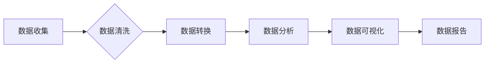

> AI创业公司,产品数据分析,用户行为分析,产品性能指标,业务洞察,数据可视化,机器学习,深度学习

## 1. 背景介绍

在当今数据爆炸的时代，AI创业公司拥有海量用户数据和产品使用数据。如何有效地分析这些数据，从中挖掘用户行为、产品性能和业务洞察，是推动公司发展和竞争力的关键。

传统的商业智能（BI）工具和方法难以满足AI创业公司对数据分析的个性化需求。AI创业公司需要更深入、更智能的数据分析方法，以洞察用户行为模式、识别产品性能瓶颈，并为业务决策提供数据支持。

## 2. 核心概念与联系

**2.1 用户行为分析**

用户行为分析是指通过收集和分析用户与产品交互的数据，以了解用户的行为模式、偏好和需求。

**2.2 产品性能指标**

产品性能指标是指用来衡量产品功能、稳定性和用户体验的指标。

**2.3 业务洞察**

业务洞察是指通过分析用户行为和产品性能数据，发现业务发展趋势、潜在机会和风险。

**2.4 数据可视化**

数据可视化是指将数据以图形、图表等形式呈现，以提高数据可读性和理解性。

**2.5 机器学习与深度学习**

机器学习和深度学习是人工智能领域的重要技术，可以用于自动学习用户行为模式和产品性能趋势。

**2.6 数据分析流程**

数据分析流程通常包括以下步骤：

1. 数据收集
2. 数据清洗
3. 数据转换
4. 数据分析
5. 数据可视化
6. 数据报告

**2.7 数据分析工具**

常用的数据分析工具包括：

* SQL
* Python
* R
* Tableau
* Power BI

**Mermaid 流程图**



## 3. 核心算法原理 & 具体操作步骤

**3.1 算法原理概述**

本节将介绍几种常用的数据分析算法，包括：

* **聚类算法**: 用于将用户或产品数据进行分组，识别用户群和产品类别。
* **分类算法**: 用于预测用户行为或产品性能，例如用户是否会流失或产品是否会发生故障。
* **回归算法**: 用于预测连续型变量，例如用户购买金额或产品使用时长。

**3.2 算法步骤详解**

* **聚类算法**:

1. 选择合适的聚类算法，例如K-means聚类或层次聚类。
2. 确定聚类数量K。
3. 计算每个数据点到各个聚类中心的距离。
4. 将每个数据点分配到距离最近的聚类中心。
5. 重复步骤3和4，直到聚类结果稳定。

* **分类算法**:

1. 选择合适的分类算法，例如逻辑回归或支持向量机。
2. 训练模型，使用已标记的数据集。
3. 使用训练好的模型预测新数据的类别。

* **回归算法**:

1. 选择合适的回归算法，例如线性回归或决策树回归。
2. 训练模型，使用已标记的数据集。
3. 使用训练好的模型预测新数据的连续型变量值。

**3.3 算法优缺点**

* **聚类算法**:

优点：无需标记数据，可以发现隐藏的模式。
缺点：聚类结果难以解释，聚类数量K的选择比较困难。

* **分类算法**:

优点：可以准确预测类别，结果易于解释。
缺点：需要标记数据，对数据质量要求较高。

* **回归算法**:

优点：可以预测连续型变量，结果易于解释。
缺点：对数据分布和噪声敏感。

**3.4 算法应用领域**

* **用户行为分析**: 识别用户群、预测用户流失、推荐个性化内容。
* **产品性能优化**: 识别产品性能瓶颈、预测产品故障、提高用户体验。
* **业务决策支持**: 预测市场趋势、识别潜在机会、制定营销策略。

## 4. 数学模型和公式 & 详细讲解 & 举例说明

**4.1 数学模型构建**

本节将介绍一些常用的数学模型，例如：

* **线性回归模型**: 用于预测连续型变量，假设数据之间存在线性关系。
* **逻辑回归模型**: 用于预测类别变量，假设数据之间存在非线性关系。
* **K-means聚类模型**: 用于将数据进行分组，假设每个聚类中心代表一个数据分布。

**4.2 公式推导过程**

* **线性回归模型**:

目标函数：

$$
J(\theta) = \frac{1}{2m} \sum_{i=1}^{m} (h_\theta(x^{(i)}) - y^{(i)})^2
$$

其中：

* $J(\theta)$ 是损失函数
* $m$ 是训练样本数量
* $h_\theta(x^{(i)})$ 是预测值
* $y^{(i)}$ 是真实值
* $\theta$ 是模型参数

梯度下降算法：

$$
\theta_j := \theta_j - \alpha \frac{1}{m} \sum_{i=1}^{m} (h_\theta(x^{(i)}) - y^{(i)})x_j^{(i)}
$$

其中：

* $\alpha$ 是学习率

* **逻辑回归模型**:

目标函数：

$$
J(\theta) = -\frac{1}{m} \sum_{i=1}^{m} [y^{(i)}\log(h_\theta(x^{(i)})) + (1-y^{(i)})\log(1-h_\theta(x^{(i)}))]
$$

其中：

* $h_\theta(x^{(i)})$ 是预测概率

梯度下降算法：

$$
\theta_j := \theta_j - \alpha \frac{1}{m} \sum_{i=1}^{m} (h_\theta(x^{(i)}) - y^{(i}))x_j^{(i)}
$$

**4.3 案例分析与讲解**

* **用户流失预测**: 使用逻辑回归模型，预测用户是否会流失，根据用户行为数据，例如登录频率、使用时长等，训练模型，并预测新用户的流失概率。

* **产品推荐**: 使用协同过滤算法，根据用户的历史购买记录和产品评分，推荐用户可能感兴趣的产品。

## 5. 项目实践：代码实例和详细解释说明

**5.1 开发环境搭建**

* Python 3.x
* Jupyter Notebook
* Pandas
* Scikit-learn

**5.2 源代码详细实现**

```python
import pandas as pd
from sklearn.model_selection import train_test_split
from sklearn.linear_model import LogisticRegression
from sklearn.metrics import accuracy_score

# 加载数据
data = pd.read_csv('user_data.csv')

# 划分训练集和测试集
X = data.drop('churn', axis=1)
y = data['churn']
X_train, X_test, y_train, y_test = train_test_split(X, y, test_size=0.2, random_state=42)

# 训练模型
model = LogisticRegression()
model.fit(X_train, y_train)

# 预测结果
y_pred = model.predict(X_test)

# 计算准确率
accuracy = accuracy_score(y_test, y_pred)
print(f'准确率: {accuracy}')
```

**5.3 代码解读与分析**

* 首先，加载用户数据，并使用Pandas库进行数据处理。
* 然后，使用Scikit-learn库将数据划分成训练集和测试集。
* 接着，使用LogisticRegression模型训练模型，并使用测试集进行预测。
* 最后，计算模型的准确率，评估模型性能。

**5.4 运行结果展示**

运行代码后，会输出模型的准确率。

## 6. 实际应用场景

**6.1 用户行为分析**

* **用户画像**: 通过分析用户行为数据，构建用户画像，了解用户的兴趣、偏好和需求。
* **用户流失预测**: 通过分析用户行为数据，预测用户是否会流失，并采取措施挽留用户。
* **个性化推荐**: 通过分析用户行为数据，推荐用户可能感兴趣的产品或内容。

**6.2 产品性能优化**

* **产品性能监控**: 通过监控产品性能指标，及时发现产品性能问题。
* **产品故障预测**: 通过分析产品使用数据，预测产品可能发生的故障，并采取措施预防故障。
* **用户体验优化**: 通过分析用户行为数据，了解用户使用产品时的痛点，并进行优化。

**6.3 业务决策支持**

* **市场趋势分析**: 通过分析用户行为和产品性能数据，发现市场趋势，并制定相应的策略。
* **营销策略优化**: 通过分析用户行为数据，优化营销策略，提高营销效果。
* **产品开发决策**: 通过分析用户需求和市场趋势，为产品开发决策提供数据支持。

**6.4 未来应用展望**

随着人工智能技术的不断发展，数据分析在AI创业公司中的应用将更加广泛和深入。未来，数据分析将更加智能化、自动化，并与其他人工智能技术，例如自然语言处理和计算机视觉，深度融合，为AI创业公司提供更强大的数据驱动的决策支持。

## 7. 工具和资源推荐

**7.1 学习资源推荐**

* **书籍**:
    * 《Python数据科学手册》
    * 《机器学习实战》
    * 《深度学习》
* **在线课程**:
    * Coursera
    * edX
    * Udacity

**7.2 开发工具推荐**

* **Python**: 
    * Pandas
    * Scikit-learn
    * TensorFlow
    * PyTorch
* **数据可视化工具**:
    * Tableau
    * Power BI
    * Matplotlib
    * Seaborn

**7.3 相关论文推荐**

* **用户行为分析**:
    * 《Recommender Systems: The Textbook》
    * 《User Modeling and Personalization》
* **产品性能优化**:
    * 《A Survey of Software Reliability Engineering》
    * 《Software Quality Assurance》
* **业务决策支持**:
    * 《Data Mining: Concepts and Techniques》
    * 《Business Analytics: A Practical Guide》

## 8. 总结：未来发展趋势与挑战

**8.1 研究成果总结**

本篇文章介绍了AI创业公司产品数据分析的原理、方法和应用场景。通过分析用户行为、产品性能和业务数据，AI创业公司可以获得宝贵的洞察，推动业务发展。

**8.2 未来发展趋势**

* **数据分析更加智能化**: 利用人工智能技术，自动学习用户行为模式和产品性能趋势，提供更精准的洞察。
* **数据分析更加自动化**: 利用自动化工具和流程，简化数据分析过程，提高效率。
* **数据分析更加可视化**: 利用数据可视化工具，将数据呈现为更直观易懂的图表和图形，方便用户理解和决策。

**8.3 面临的挑战**

* **数据质量问题**: 数据不完整、不准确、不一致等问题会影响数据分析结果的准确性。
* **数据安全问题**: 用户数据隐私安全需要得到保障。
* **人才缺口**: 数据分析人才需求量大，但人才供给不足。

**8.4 研究展望**

未来，数据分析将在AI创业公司中发挥更加重要的作用。需要进一步研究更智能、更自动化、更可视化的数据分析方法，并解决数据质量、数据安全和人才缺口等挑战。

## 9. 附录：常见问题与解答

**9.1 如何处理缺失数据？**

* 删除缺失数据
* 使用平均值、中位数或众数填充缺失数据
* 使用机器学习算法进行缺失数据预测

**9.2 如何选择合适的聚类